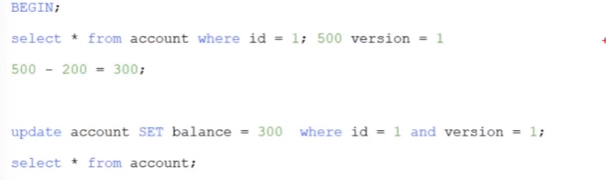
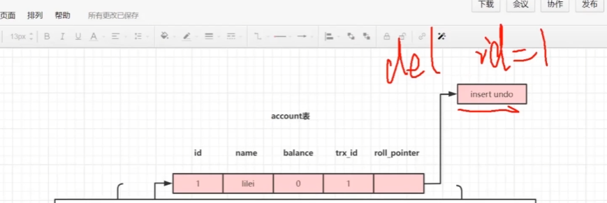
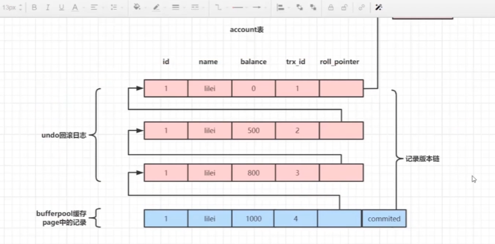

# Java

类型转换一定都要转换运算之后一定要转化

## Java中 a+=b和a=a+b有什么区别？

+= 是java中的一个运算符，而不是两个，所以在运算时 会进行自动类型转换

## Serializable接口为什么需要定义serialVersionUID常量

**验证加载的类与序列化对象是否兼容**

序列化运行时使用一个称为 serialVersionUID 的版本号与每个可序列化类相关联，该序列号在反序列化过程中用于验证序列化对象的发送者和接收者是否为该对象加载了与序列化兼容的类。如果接收者加载的该对象的类的 serialVersionUID 与对应的发送者的类的版本号不同，则反序列化将会导致 InvalidClassException

## HashMap扩容

初始化如果不指定则为null

添加之后初始化数组为16

每次put会检查元素总量超过阈值 0.75乘当前数组大小扩容为两倍

如果链表长度大于8 数组长度小于64则会进行数组扩容 两个都满足 则会变为红黑树

扩容方法是用一个新数组代替了原来的数组 将原数据迁移到新数组中使用尾插法

# 框架

## 谈谈 spring IOC 

Spring提供了一个IOC容器 ,用于管理对象的创建与对象之间的依赖关系,有各种子接口和实现类以AnnotationApplicationContext为例

有三类后置处理器以提供干涉对象创建的过程 有一些具体的实现类来完成Spring的功能 比如各种Aware接口 生命周期接口 等等

Bean定义,BeanFactoy,Bean

IOC容器作用 有准备对象信息阶段,内置了defaultListableBeanFactory 他的内部有各种Map作为各种信息的池,IOC容器来读取我们告诉他的信息生成Bean定义信息(有机会更改Bean信息的生成)存到map里以备后用,Sping内部有一些默认的Bean也会自动的加载进来

创建对象等等

## 对于mybatis中#和$绑定参数的区别总结

＃{}将传入的数据都当成一个字符串，会对自动传入的数据加一个双引号。如：order by #{id}，如果传入的值是111，那么解析成sql时的值为order by “111”， 如果传入的值是id，则解析成的sql为order by “id”。

${}将传入的数据直接显示生成在sql中。如：order by

${id}，如果传入的值是111，那么解析成sql时的值为order by 111， 如果传入的值是id，则解析成的sql为order

by id。

## Spring Boot自动装配原理

1. 从@SpringBootApplication说起,内含了@EnableAutoConfiguration注解,其内含了@import()引入了一个选择器

2. 选择器导入组件SpringFactoriesLoader.loadFactoryNanme;去类路径下找META-INF/spring.factory文件SPI机制找到@EnableAutoConfiguration全类名对应的所有配置的值

3. SprignBoot写好的全场景的自动配置类全部导入进来,配置类就是给容器放组件Bean

## SPI机制

其实就是根据Servlet厂商（服务提供商）提供要求的一个接口，  在固定的目录（META-INF/services）放上以接口全类名 为命名的文件， 文件中放入接口的实现的全类名，该类由我们自己实现，按照这种约定的方式（即SPI规范），服务提供商会调用文件中实现类的方法， 从而完成扩展。

[SPI演示案例](https://github.com/xulisha123/sample_code/tree/main/spi-parent)： 

假设我们自己是服务提供商： 现在要求的一个接口 IUserDao

1.在固定的目录放上接口的文件名

2.文件中放入实现类（该实现类由你实现）：

一行一个实现类。

3.通过java.util.ServiceLoader提供的ServiceLoader就可以完成SPI的实现类加载

​                public class App {    public static void main(String[] args) {        ServiceLoader<IUserDao> daos = ServiceLoader.load(IUserDao.class);        for (IUserDao dao : daos) {            dao.save();        }    }     

## 

# Mysql

## 谈谈MVCC

1. Mysql在读已提交和可重复读隔离级别下都实现了MVCC机制
2. 可重复读 实际上就是一个copyOrwrite 写的是副本数据,写完在提交,读的是旧数据,所以写的可能是脏写,所以加CAS 读操作会有一个版本号,写的时候必须要和持有的版本号一致,
   1. 
   2. 
      1. 这个读的是最新数据而不是快照数据用来做更新
3. 读已提交读的是最新数据

查询事务需要事务吗

具体分析 (别的情况会更改数据)

## Undo日志版本链

通俗: 每次修改都会记录一次undo日志,行记录有两个隐藏字段

一行数据被多个事务依次修改过后，在每个事务修改完后，Mysql会保留修改前的数据undo回滚日志,串联起来形成一个历史记录版本链

可重复读级别 快照读(生成当前事务的一致性视图)该视图在事务结束前不会变化

读已提交 则每次查询重新生成

**DATA_TRX_ID** 事务ID

记录最近更新这条行记录的`事务 ID`，大小为 `6` 个字节

**DATA_ROLL_PTR** 回滚指针

表示指向该行回滚段`（rollback segment）`的指针，大小为 `7` 个字节，`InnoDB` 便是通过这个指针找到之前版本的数据。该行记录上所有旧版本，在 `undo` 中都通过链表的形式组织。

图片解释

roll_point指向 insert undo(即一条delete id = 1 的指令)

# 操作系统

# 项目

作者 | 张建飞  阿里巴巴高级技术专家

了解我的人都知道，我一直在致力于应用架构和代码复杂度的治理。

这两天在看零售通商品域的代码。面对零售通如此复杂的业务场景，如何在架构和代码层面进行应对，是一个新课题。针对该命题，我进行了比较细致的思考和研究。结合实际的业务场景，我沉淀了一套“如何写复杂业务代码”的方法论，在此分享给大家。

我相信，同样的方法论可以复制到大部分复杂业务场景。

一个复杂业务的处理过程
业务背景
简单的介绍下业务背景，零售通是给线下小店供货的 B2B 模式，我们希望通过数字化重构传统供应链渠道，提升供应链效率，为新零售助力。阿里在中间是一个平台角色，提供的是 Bsbc 中的 service 的功能。

商品力是零售通的核心所在，一个商品在零售通的生命周期如下图所示：

在上图中红框标识的是一个运营操作的“上架”动作，这是非常关键的业务操作。上架之后，商品就能在零售通上面对小店进行销售了。因为上架操作非常关键，所以也是商品域中最复杂的业务之一，涉及很多的数据校验和关联操作。

针对上架，一个简化的业务流程如下所示：

过程分解
像这么复杂的业务，我想应该没有人会写在一个 service 方法中吧。一个类解决不了，那就分治吧。

说实话，能想到分而治之的工程师，已经做的不错了，至少比没有分治思维要好很多。我也见过复杂程度相当的业务，连分解都没有，就是一堆方法和类的堆砌。

不过，这里存在一个问题：即很多同学过度的依赖工具或是辅助手段来实现分解。比如在我们的商品域中，类似的分解手段至少有 3 套以上，有自制的流程引擎，有依赖于数据库配置的流程处理：

本质上来讲，这些辅助手段做的都是一个 pipeline 的处理流程，没有其它。因此，我建议此处最好保持 KISS（Keep It Simple and Stupid），即最好是什么工具都不要用，次之是用一个极简的 Pipeline 模式，最差是使用像流程引擎这样的重方法。

除非你的应用有极强的流程可视化和编排的诉求，否则我非常不推荐使用流程引擎等工具。第一，它会引入额外的复杂度，特别是那些需要持久化状态的流程引擎；第二，它会割裂代码，导致阅读代码的不顺畅。大胆断言一下，全天下估计 80% 对流程引擎的使用都是得不偿失的。

回到商品上架的问题，这里问题核心是工具吗？是设计模式带来的代码灵活性吗？显然不是，问题的核心应该是如何分解问题和抽象问题，知道金字塔原理的应该知道，此处，我们可以使用结构化分解将问题解构成一个有层级的金字塔结构：

按照这种分解写的代码，就像一本书，目录和内容清晰明了。

以商品上架为例，程序的入口是一个上架命令（OnSaleCommand）, 它由三个阶段（Phase）组成。

每个 Phase 又可以拆解成多个步骤（Step），以 OnSaleProcessPhase 为例，它是由一系列 Step 组成的：

看到了吗，这就是商品上架这个复杂业务的业务流程。需要流程引擎吗？不需要；需要设计模式支撑吗？也不需要。对于这种业务流程的表达，简单朴素的组合方法模式（Composed Method）是再合适不过的了。

因此，在做过程分解的时候，我建议工程师不要把太多精力放在工具上，放在设计模式带来的灵活性上。而是应该多花时间在对问题分析，结构化分解，最后通过合理的抽象，形成合适的阶段（Phase）和步骤（Step）上。

过程分解后的两个问题
的确，使用过程分解之后的代码，已经比以前的代码更清晰、更容易维护了。不过，还有两个问题值得我们去关注一下：

1、领域知识被割裂肢解
什么叫被肢解？因为我们到目前为止做的都是过程化拆解，导致没有一个聚合领域知识的地方。每个 Use Case 的代码只关心自己的处理流程，知识没有沉淀。

相同的业务逻辑会在多个 Use Case 中被重复实现，导致代码重复度高，即使有复用，最多也就是抽取一个 util，代码对业务语义的表达能力很弱，从而影响代码的可读性和可理解性。

2、代码的业务表达能力缺失
试想下，在过程式的代码中，所做的事情无外乎就是取数据 -- 做计算 -- 存数据，在这种情况下，要如何通过代码显性化的表达我们的业务呢？ 说实话，很难做到，因为我们缺失了模型，以及模型之间的关系。脱离模型的业务表达，是缺少韵律和灵魂的。

举个例子，在上架过程中，有一个校验是检查库存的，其中对于组合品（CombineBackOffer）其库存的处理会和普通品不一样。原来的代码是这么写的：

然而，如果我们在系统中引入领域模型之后，其代码会简化为如下：

有没有发现，使用模型的表达要清晰易懂很多，而且也不需要做关于组合品的判断了，因为我们在系统中引入了更加贴近现实的对象模型（CombineBackOffer 继承 BackOffer），通过对象的多态可以消除我们代码中的大部分的 if-else。

	

过程分解+对象模型
通过上面的案例，我们可以看到有过程分解要好于没有分解，过程分解+对象模型要好于仅仅是过程分解。对于商品上架这个 case，如果采用过程分解+对象模型的方式，最终我们会得到一个如下的系统结构：

写复杂业务的方法论
通过上面案例的讲解，我想说，我已经交代了复杂业务代码要怎么写：即自上而下的结构化分解+自下而上的面向对象分析。

接下来，让我们把上面的案例进行进一步的提炼，形成一个可落地的方法论，从而可以泛化到更多的复杂业务场景。

上下结合
所谓上下结合，是指我们要结合自上而下的过程分解和自下而上的对象建模，螺旋式的构建我们的应用系统。这是一个动态的过程，两个步骤可以交替进行、也可以同时进行。

这两个步骤是相辅相成的，上面的分析可以帮助我们更好的理清模型之间的关系，而下面的模型表达可以提升我们代码的复用度和业务语义表达能力。

其过程如下图所示：

使用这种上下结合的方式，我们就有可能在面对任何复杂的业务场景，都能写出干净整洁、易维护的代码。

能力下沉
一般来说实践 DDD 有两个过程：

1. 套概念阶段
   了解了一些 DDD 的概念，然后在代码中“使用”Aggregation Root，Bounded Context，Repository 等等这些概念。更进一步，也会使用一定的分层策略。然而这种做法一般对复杂度的治理并没有多大作用。

2. 融会贯通阶段
   术语已经不再重要，理解 DDD 的本质是统一语言、边界划分和面向对象分析的方法。

大体上而言，我大概是在 1.7 的阶段，因为有一个问题一直在困扰我，就是哪些能力应该放在 Domain 层，是不是按照传统的做法，将所有的业务都收拢到 Domain 上，这样做合理吗？说实话，这个问题我一直没有想清楚。

因为在现实业务中，很多的功能都是用例特有的（Use case specific）的，如果“盲目”的使用 Domain 收拢业务并不见得能带来多大的益处。相反，这种收拢会导致 Domain 层的膨胀过厚，不够纯粹，反而会影响复用性和表达能力。

鉴于此，我最近的思考是我们应该采用能力下沉的策略。

所谓的能力下沉，是指我们不强求一次就能设计出 Domain 的能力，也不需要强制要求把所有的业务功能都放到 Domain 层，而是采用实用主义的态度，即只对那些需要在多个场景中需要被复用的能力进行抽象下沉，而不需要复用的，就暂时放在 App 层的 Use Case 里就好了。

注：Use Case 是《架构整洁之道》里面的术语，简单理解就是响应一个 Request 的处理过程。

通过实践，我发现这种循序渐进的能力下沉策略，应该是一种更符合实际、更敏捷的方法。因为我们承认模型不是一次性设计出来的，而是迭代演化出来的。
**
下沉的过程如下图所示，假设两个 use case 中，我们发现 uc1 的 step3 和 uc2 的 step1 有类似的功能，我们就可以考虑让其下沉到 Domain 层，从而增加代码的复用性。

指导下沉有两个关键指标：代码的复用性和内聚性。

复用性是告诉我们 When（什么时候该下沉了），即有重复代码的时候。内聚性是告诉我们 How（要下沉到哪里），功能有没有内聚到恰当的实体上，有没有放到合适的层次上（因为 Domain 层的能力也是有两个层次的，一个是 Domain Service 这是相对比较粗的粒度，另一个是 Domain 的 Model 这个是最细粒度的复用）。

比如，在我们的商品域，经常需要判断一个商品是不是最小单位，是不是中包商品。像这种能力就非常有必要直接挂载在 Model 上。

之前，因为老系统中没有领域模型，没有 CSPU 这个实体。你会发现像判断单品是否为最小单位的逻辑是以 StringUtils.equals(code, baseCode) 的形式散落在代码的各个角落。这种代码的可理解性是可想而知的，至少我在第一眼看到这个代码的时候，是完全不知道什么意思。

业务技术要怎么做
写到这里，我想顺便回答一下很多业务技术同学的困惑，也是我之前的困惑：即业务技术到底是在做业务，还是做技术？业务技术的技术性体现在哪里？

通过上面的案例，我们可以看到业务所面临的复杂性并不亚于底层技术，要想写好业务代码也不是一件容易的事情。业务技术和底层技术人员唯一的区别是他们所面临的问题域不一样。

业务技术面对的问题域变化更多、面对的人更加庞杂。而底层技术面对的问题域更加稳定、但对技术的要求更加深。比如，如果你需要去开发 Pandora，你就要对 Classloader 有更加深入的了解才行。

但是，不管是业务技术还是底层技术人员，有一些思维和能力都是共通的。比如，分解问题的能力，抽象思维，结构化思维等等。

用我的话说就是：“做不好业务开发的，也做不好技术底层开发，反之亦然。业务开发一点都不简单，只是我们很多人把它做“简单”了

因此，如果从变化的角度来看，业务技术的难度一点不逊色于底层技术，其面临的挑战甚至更大。因此，我想对广大的从事业务技术开发的同学说：沉下心来，夯实自己的基础技术能力、OO 能力、建模能力... 不断提升抽象思维、结构化思维、思辨思维... 持续学习精进，写好代码。我们可以在业务技术岗做的很“技术”

