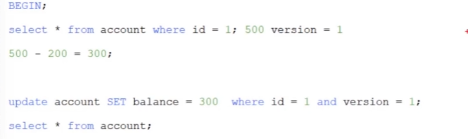
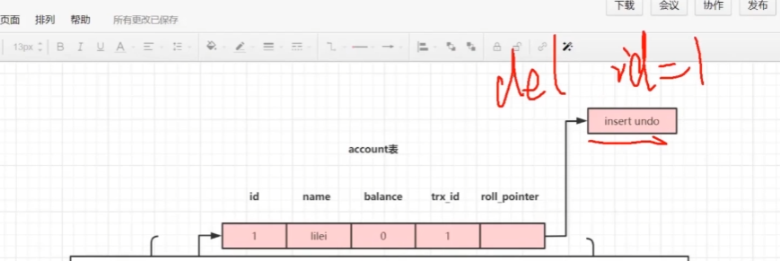
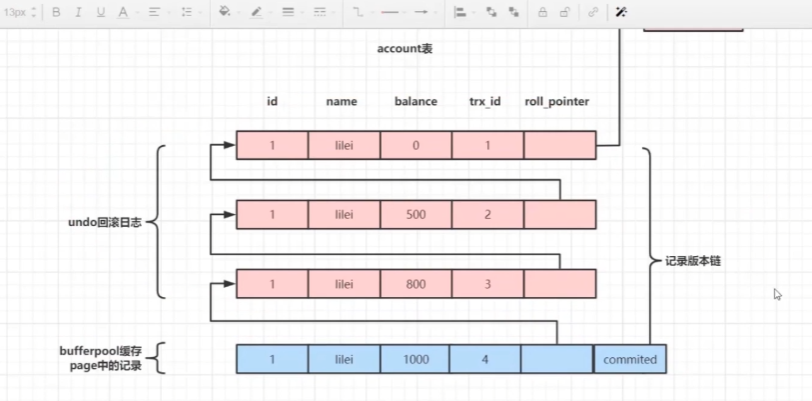
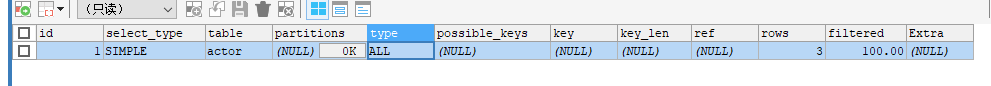
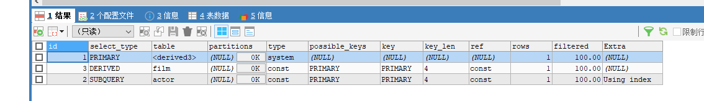
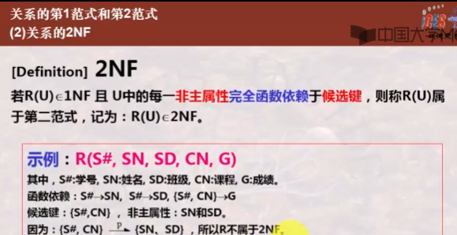

刷一点题吧

*from -> join -> on-> where -> group by -> having -> select -> distnect -> order by -> limit*

having 条件表达式 需要注意having和where的用法区别：
1.having只能用在group by之后，对分组后的结果进行筛选(即使用having的前提条件是分组)。
2.where肯定在group by 之前，即也在having之前。


mysql问题 show processlist sleep时间


# 零、select顺序


```sql
select [distinct] 字段或表达式列表
from 表名 join(left join, right join) on 连接条件
where 筛选条件
group by 字段列表
having 字段列表
order by 字段列表
limit <m,n>
-- 说服我干活哦
```

```sql
1. FROM子句
2. WHERE子句
3. GROUP BY子句  
4. HAVING子句
5. SELECT子句
6. ORDER BY子句
7. LIMIT子句

/*  ########################################################################################
执行顺序的说明：
(1) from 子句组装来自不同数据源的数据； 
(2) where 子句基于指定的条件对记录行进行筛选； 
(3) group by 子句将数据划分为多个分组； 
(4) 使用聚集函数进行计算； 
(5) 使用 having 子句筛选分组； 
(6) 计算所有的表达式； 
(7) select 字段；
(8) 使用 order by 对结果集进行排序。
需要去理解下
关于字段别名的使用：
(1) WHERE子句不能使用字段别名。
(2) 从 GROUP BY 子句开始，后面的所有子句可以使用字段别名。
########################################################################################  */

```


# 一、索引


## 1. B+Tree索引


找到键值所在的页再在内存找到具体的数据, 聚蔟索引有完整数据, 非聚蔟(联合索引)没有完整数据, 有时候会回表

双链表范围查询, 可以有磁盘预读: 不是严格按需 而是会把附近的也读上,相邻的结点也能预加载

操作: 对每一层进行二分, 插入删除会破坏平衡, 最好自增主键

与红黑树的比较

数据库系统将索引的一个节点的大小设置为页的大小，使得一次 I/O 就能完全载入一个节点, 树高低IO就低

因为不再需要进行全表扫描, 只需要对树进行搜索即可，所以查找速度快很多

## 2. Hash索引

只支持精确查找,无法用于排序与分组, InnoDB有自适应哈希索引,当某个索引值应用特别频繁, 会在B+tree索引之上在创建一个hash索引

## 3. 全文索引

MyISAM 存储引擎支持全文索引，用于查找文本中的关键词，而不是直接比较是否相等。

全文索引使用倒排索引实现，它记录着关键词到其所在文档的映射。

InnoDB 存储引擎在 MySQL 5.6.4 版本中也开始支持全文索引。

## 4. 空间数据索引

MyISAM 存储引擎支持空间数据索引（R-Tree），可以用于地理数据存储。空间数据索引会从所有维度来索引数据，可以有效地使用任意维度来进行组合查询。

必须使用 GIS 相关的函数来维护数据。


## 索引优化

#### 1.  独立的列

不能是表达式一部分, 或函数的参数

#### 2. 多列索引

在需要使用多个列作为条件进行查询时，使用多列索引比使用多个单列索引性能更好。例如下面的语句中，最好把 actor_id 和 film_id 设置为多列索引。

```sql
SELECT film_id, actor_ id FROM sakila.film_actor
WHERE actor_id = 1 AND film_id = 1;
```

#### 3. 索引列的顺序

让选择性最强的索引列放在前面。

索引的选择性是指：不重复的索引值和记录总数的比值。最大值为 1，此时每个记录都有唯一的索引与其对应。选择性越高，每个记录的区分度越高，查询效率也越高。

例如下面显示的结果中 customer_id 的选择性比 staff_id 更高，因此最好把 customer_id 列放在多列索引的前面。

```sql
SELECT COUNT(DISTINCT staff_id)/COUNT(*) AS staff_id_selectivity,
COUNT(DISTINCT customer_id)/COUNT(*) AS customer_id_selectivity,
COUNT(*)
FROM payment;
```

```html
   staff_id_selectivity: 0.0001
customer_id_selectivity: 0.0373
               COUNT(*): 16049
```

#### 4. 前缀索引

对于 BLOB、TEXT 和 VARCHAR 类型的列，必须使用前缀索引，只索引开始的部分字符。

前缀长度的选取需要根据索引选择性来确定。

#### 5. 覆盖索引

索引包含所有需要查询的字段的值。

具有以下优点：

- 索引通常远小于数据行的大小，只读取索引能大大减少数据访问量。
- 一些存储引擎（例如 MyISAM）在内存中只缓存索引，而数据依赖于操作系统来缓存。因此，只访问索引可以不使用系统调用（通常比较费时）。
- 对于 InnoDB 引擎，若辅助索引能够覆盖查询，则无需访问主索引。


## 索引的优点

- 大大减少了服务器需要扫描的数据行数。
- 帮助服务器避免进行排序和分组，以及避免创建临时表（B+Tree 索引是有序的，可以用于 ORDER BY 和 GROUP BY 操作。临时表主要是在排序和分组过程中创建，不需要排序和分组，也就不需要创建临时表）。
- 将随机 I/O 变为顺序 I/O（B+Tree 索引是有序的，会将相邻的数据都存储在一起）。

## 索引的使用条件

适用于中大表,  特大表需要分区

1查询频率高的 where列或者连接列

2为经常需要排序的, 分组操作的字段

3经常更新的不适合

4不能有效区分的

5对text, image, bit不要建立索引

6最左前缀

7 索引为非空字段

8 不要过度索引


# 二、查询性能优化

### 使用 Explain 进行分析

Explain 用来分析 SELECT 查询语句，开发人员可以通过分析 Explain 结果来优化查询语句。

比较重要的字段有：

- select_type : 查询类型，有简单查询、联合查询、子查询等
- key : 使用的索引
- rows : 扫描的行数

### 优化数据访问

#### 1. 减少请求的数据量

- 只返回必要的列：最好不要使用 SELECT * 语句。
- 只返回必要的行：使用 LIMIT 语句来限制返回的数据。
- 缓存重复查询的数据：使用缓存可以避免在数据库中进行查询，特别在要查询的数据经常被重复查询时，缓存带来的查询性能提升将会是非常明显的。

#### 2. 减少服务器端扫描的行数

最有效的方式是使用索引来覆盖查询。

### 重构查询方式

#### 1. 切分大查询

一个大查询如果一次性执行的话，可能一次锁住很多数据、占满整个事务日志、耗尽系统资源、阻塞很多小的但重要的查询。

```sql
DELETE FROM messages WHERE create < DATE_SUB(NOW(), INTERVAL 3 MONTH);
```

```sql
rows_affected = 0
do {
    rows_affected = do_query(
    "DELETE FROM messages WHERE create  < DATE_SUB(NOW(), INTERVAL 3 MONTH) LIMIT 10000")
} while rows_affected > 0
```

#### 2. 分解大连接查询

将一个大连接查询分解成对每一个表进行一次单表查询，然后在应用程序中进行关联，这样做的好处有：

- 让缓存更高效。对于连接查询，如果其中一个表发生变化，那么整个查询缓存就无法使用。而分解后的多个查询，即使其中一个表发生变化，对其它表的查询缓存依然可以使用。
- 分解成多个单表查询，这些单表查询的缓存结果更可能被其它查询使用到，从而减少冗余记录的查询。
- 减少锁竞争；
- 在应用层进行连接，可以更容易对数据库进行拆分，从而更容易做到高性能和可伸缩。
- 查询本身效率也可能会有所提升。例如下面的例子中，使用 IN() 代替连接查询，可以让 MySQL 按照 ID 顺序进行查询，这可能比随机的连接要更高效。

```sql
SELECT * FROM tag
JOIN tag_post ON tag_post.tag_id=tag.id
JOIN post ON tag_post.post_id=post.id
WHERE tag.tag='mysql';
```

```sql
SELECT * FROM tag WHERE tag='mysql';
SELECT * FROM tag_post WHERE tag_id=1234;
SELECT * FROM post WHERE post.id IN (123,456,567,9098,8904);
```

## 


### 索引算法有哪些？

索引算法有 BTree算法和Hash算法

**BTree算法**

BTree是最常用的mysql数据库索引算法，也是mysql默认的算法。因为它不仅可以被用在=,>,>=,<,<=和between这些比较操作符上，而且还可以用于like操作符，只要它的查询条件是一个不以通配符开头的常量， 例如：

```
-- 只要它的查询条件是一个不以通配符开头的常量
select * from user where name like 'jack%';
-- 如果一通配符开头，或者没有使用常量，则不会使用索引，例如：
select * from user where name like '%jack';
```

**Hash算法**

Hash算法只能用于对等比较，例如=,<=>（相当于=）操作符。由于是一次定位数据，不像BTree索引需要从根节点到枝节点，最后才能访问到叶子节点这样多次IO访问，所以检索效率远高于BTree索引。


### @$创建索引的原则？索引设计的原则？

索引虽好，但也不是无限制的使用，最好符合以下几个原则

1. 为常作为查询条件的字段建立索引，where子句中的列，或者连接子句中指定的列
2. 为经常需要排序、分组操作的字段建立索引
3. 更新频繁字段不适合创建索引
4. 不能有效区分数据的列不适合做索引列(如性别，男女未知，最多也就三种，区分度实在太低)
5. 对于定义为text、image和bit的数据类型的列不要建立索引
6. 最左前缀原则，就是最左边的优先。指的是联合索引中，优先走最左边列的索引。对于多个字段的联合索引，如 index(a,b,c) 联合索引，则相当于创建了 a 单列索引，(a,b)联合索引，和(a,b,c)联合索引（但并不是建立了多个索引树）。mysql会一直向右匹配直到遇到范围查询(>、<、between、like)就停止匹配，比如a = 1 and b = 2 and c > 3 and d = 4 如果建立(a,b,c,d)顺序的索引，d是用不到索引的，如果建立(a,b,d,c)的索引则都可以用到，a,b,d的顺序可以任意调整。使用短索引，如果对长字符串列进行索引，应该指定一个前缀长度，这样能够节省大量索引空间
7. 非空字段：应该指定列为NOT NULL，除非你想存储NULL。在mysql中，含有空值的列很难进行查询优化，因为它们使得索引、索引的统计信息以及比较运算更加复杂。你应该用0、一个特殊的值或者一个空串代替空值
8. 不要过度索引。索引需要额外的磁盘空间，并降低写操作的性能。在修改表内容的时候，索引会进行更新甚至重构，索引列越多，这个时间就会越长


### 什么情况使用了索引，查询还是慢

- 索引全表扫描
- 索引过滤性不好
- 频繁回表的开销


### MySQL使用自增主键的好处

1. 自增主键按顺序存放，增删数据速度快，对于检索非常有利；
2. 数字型，占用空间小，易排序；
3. 使用整形才可以使用AUTO_INCREAMENT，不用担心主键重复问题。


### @$什么是聚簇索引？何时使用聚簇索引与非聚簇索引


- 聚簇索引：将数据与索引放到了一块，索引结构的叶子节点存储了行数据，找到索引也就找到了数据
- 非聚簇索引：将数据与索引分开存储，索引结构的叶子节点存储的是行数据的地址

聚簇索引的优点

- 数据访问更快。聚族索引将索引和数据保存在同一个B+树中，因此从聚族索引中获取数据通常比非聚族索引中查找更快。
- 当你需要取出一定范围内的数据时，用聚簇索引也比用非聚簇索引好。
- 使用覆盖索引扫描的查询可以直接使用节点中的主键值。

聚簇索引的缺点

- 插入速度严重依赖于插入顺序，按照主键的顺序插入是最快的方式，否则将会出现页分裂，严重影响性能。因此，对于InnoDB表，我们一般都会定义一个自增的ID列作为主键。
- 更新主键的代价很高，因为将会导致被更新的行移动。因此，对于InnoDB表，我们一般定义主键为不可更新。
- 通过辅助索引访问需要两次索引查找，第一次找到主键值，第二次根据主键值找到行数据。

**几个概念**

- 对于普通索引，如 name 字段，则需要根据 name 字段的索引树（非聚簇索引）找到叶子节点对应的主键，然后再通过主键去主键索引树查询一遍，才可以得到要找的记录，这就叫**回表查询**。先定位主键值，再定位行记录，它的性能较扫描一遍索引树的效率更低
- InnoDB的行锁是建立在索引的基础之上的，行锁锁的是索引，不是数据，所以提高并发写的能力要在查询字段添加索引
- 主索引和辅助索引：主索引就是主键索引，辅助索引就是根据业务需要，自己设置的普通的非主键的索引。这个在Myisam里面区别不大，但是在Innodb的时候差别很大
- 聚簇索引：Innodb的主索引采用的是聚簇索引，一个表只能有1个聚簇索引，因为表数据存储的物理位置是唯一的。聚簇索引的value存的就是真实的数据，不是数据的地址。主索引树里面包含了真实的数据。key是主键值，value值就是data，key值按照B+树的规则分散排布的叶子节点。
- 非聚簇索引：Myisam的主索引和辅助索引都采用的是非聚簇索引，索引和表数据是分离的，索引的value值存储的是行数据的地址。
- Innodb的索引：主索引采用聚簇索引，叶子节点的value值，直接存储的真实的数据。辅助索引是非聚簇索引，value值指向主索引的位置。所以在Innodb中，根据辅助索引查询值需要遍历2次B+树，同时主键的长度越短越好，越短辅助索引的value值就越小。Innodb中根据主键进行范围查询，会特别快。
- Myisam的索引：主索引和辅助索引都是非聚簇索引
- B+树：不管是什么索引，在mysql中的数据结构都是B+树的结构，可以充分利用数据块，来减少IO查询的次数，提升查询的效率。一个数据块data里面，存储了很多个相邻key的value值，所有的非叶子节点都不存储数据，都是指针。
- mysql采用B+树的优点：IO读取次数少（每次都是页读取），范围查找更快捷（相邻页之间有指针）


### 联合索引是什么？组合索引是什么？

MySQL可以使用多个字段组合建立一个索引，叫做联合索引。在联合索引中，如果想要命中索引，需要按照建立索引时的字段顺序挨个使用，否则无法命中索引。


### @$联合索引数据结构和实现原理，使用联合索引是怎么进行查询的

假设，我们对(a,b)字段建立索引，那么入下图所示


如上图所示他们是按照a来进行排序，在a相等的情况下，才按b来排序。

因此，我们可以看到a是有序的1，1，2，2，3，3。而b是一种全局无序，局部相对有序状态！什么意思呢？

从全局来看，b的值为1，2，1，4，1，2，是无序的，因此直接执行`b = 2`这种查询条件没有办法利用索引。

从局部来看，当a的值确定的时候，b是有序的。例如a = 1时，b值为1，2是有序的状态。当a=2时候，b的值为1,4也是有序状态。因此，你执行`a = 1 and b = 2`是a,b字段能用到索引的。而你执行`a > 1 and b = 2`时，a字段能用到索引，b字段用不到索引。因为a的值此时是一个范围，不是固定的，在这个范围内b值不是有序的，因此b字段用不上索引。

综上所示，最左匹配原则，在遇到范围查询的时候，就会停止匹配。


### @$什么是最左前缀原则？什么是最左匹配原则？为什么需要注意联合索引中的顺序？

- 最左前缀原则，就是最左边的优先。指的是联合索引中，优先走最左边列的索引。对于多个字段的联合索引，如 index(a,b,c) 联合索引，则相当于创建了 a 单列索引，(a,b)联合索引，和(a,b,c)联合索引（但并不是建立了多个索引树）。mysql会一直向右匹配直到遇到范围查询(>、<、between、like)就停止匹配，比如a = 1 and b = 2 and c > 3 and d = 4 如果建立(a,b,c,d)顺序的索引，d是用不到索引的，如果建立(a,b,d,c)的索引则都可以用到，a,b,d的顺序可以任意调整。
- =和in可以乱序，比如a = 1 and b = 2 and c = 3 建立(a,b,c)索引可以任意顺序，mysql的查询优化器会帮你优化成索引可以识别的形式。
- 如果建立的索引顺序是 (a,b) 那么直接采用 where b = 5 这种查询条件是无法利用到索引的，这一条最能体现最左匹配的特性。


# 三、存储引擎

### InnoDB

是 MySQL 默认的事务型存储引擎，只有在需要它不支持的特性时，才考虑使用其它存储引擎。

实现了四个标准的隔离级别，默认级别是可重复读（REPEATABLE READ）。在可重复读隔离级别下，通过多版本并发控制（MVCC）+ Next-Key Locking 防止幻影读。

> 详情见事务与锁
>
> 幻读是因为MVCC记录在行上 对增加删除无法约束, 那么在select加上范围锁即可, 具体实现是访问过的索引加锁和前面的间隙也加锁, 防止有别的事务对这些数据进行增加删除
> 

主索引是聚簇索引，在索引中保存了数据，从而避免直接读取磁盘，因此对查询性能有很大的提升。

内部做了很多优化，包括从磁盘读取数据时采用的可预测性读、能够加快读操作并且自动创建的自适应哈希索引、能够加速插入操作的插入缓冲区等。

支持真正的在线热备份。其它存储引擎不支持在线热备份，要获取一致性视图需要停止对所有表的写入，而在读写混合场景中，停止写入可能也意味着停止读取。

> todo 跟日志相关吧


### MyISAM

设计简单，数据以紧密格式存储。对于只读数据，或者表比较小、可以容忍修复操作，则依然可以使用它。

提供了大量的特性，包括压缩表、空间数据索引等。

不支持事务。

不支持行级锁，只能对整张表加锁，读取时会对需要读到的所有表加共享锁，写入时则对表加排它锁。但在表有读取操作的同时，也可以往表中插入新的记录，这被称为并发插入（CONCURRENT INSERT）。

可以手工或者自动执行检查和修复操作，但是和事务恢复以及崩溃恢复不同，可能导致一些数据丢失，而且修复操作是非常慢的。

如果指定了 DELAY_KEY_WRITE 选项，在每次修改执行完成时，不会立即将修改的索引数据写入磁盘，而是会写到内存中的键缓冲区，只有在清理键缓冲区或者关闭表的时候才会将对应的索引块写入磁盘。这种方式可以极大的提升写入性能，但是在数据库或者主机崩溃时会造成索引损坏，需要执行修复操作。

### 比较

- 事务：InnoDB 是事务型的，可以使用 Commit 和 Rollback 语句。

- 并发：MyISAM 只支持表级锁，而 InnoDB 还支持行级锁。

- 外键：InnoDB 支持外键。

- 备份：InnoDB 支持在线热备份。

- 崩溃恢复：MyISAM 崩溃后发生损坏的概率比 InnoDB 高很多，而且恢复的速度也更慢。

- 其它特性：MyISAM 支持压缩表和空间数据索引。


# 四、数据类型

### 整型

TINYINT, SMALLINT, MEDIUMINT, INT, BIGINT 分别使用 8, 16, 24, 32, 64 位存储空间，一般情况下越小的列越好。

INT(11) 中的数字只是规定了交互工具显示字符的个数，对于存储和计算来说是没有意义的。

### 浮点数

FLOAT 和 DOUBLE 为浮点类型，DECIMAL 为高精度小数类型。CPU 原生支持浮点运算，但是不支持 DECIMAl 类型的计算，因此 DECIMAL 的计算比浮点类型需要更高的代价。

FLOAT、DOUBLE 和 DECIMAL 都可以指定列宽，例如 DECIMAL(18, 9) 表示总共 18 位，取 9 位存储小数部分，剩下 9 位存储整数部分。

### 字符串

主要有 CHAR 和 VARCHAR 两种类型，一种是定长的，一种是变长的。

VARCHAR 这种变长类型能够节省空间，因为只需要存储必要的内容。但是在执行 UPDATE 时可能会使行变得比原来长，当超出一个页所能容纳的大小时，就要执行额外的操作。MyISAM 会将行拆成不同的片段存储，而 InnoDB 则需要分裂页来使行放进页内。

在进行存储和检索时，会保留 VARCHAR 末尾的空格，而会删除 CHAR 末尾的空格。

### 时间和日期

MySQL 提供了两种相似的日期时间类型：DATETIME 和 TIMESTAMP。

#### 1. DATETIME

能够保存从 1000 年到 9999 年的日期和时间，精度为秒，使用 8 字节的存储空间。

它与时区无关。

默认情况下，MySQL 以一种可排序的、无歧义的格式显示 DATETIME 值，例如“2008-01-16 22:37:08”，这是 ANSI 标准定义的日期和时间表示方法。

#### 2. TIMESTAMP

和 UNIX 时间戳相同，保存从 1970 年 1 月 1 日午夜（格林威治时间）以来的秒数，使用 4 个字节，只能表示从 1970 年到 2038 年。

它和时区有关，也就是说一个时间戳在不同的时区所代表的具体时间是不同的。

MySQL 提供了 FROM_UNIXTIME() 函数把 UNIX 时间戳转换为日期，并提供了 UNIX_TIMESTAMP() 函数把日期转换为 UNIX 时间戳。

默认情况下，如果插入时没有指定 TIMESTAMP 列的值，会将这个值设置为当前时间。

应该尽量使用 TIMESTAMP，因为它比 DATETIME 空间效率更高。


# 五、切分

### 水平切分

水平切分又称为 Sharding，它是将同一个表中的记录拆分到多个结构相同的表中。

当一个表的数据不断增多时，Sharding 是必然的选择，它可以将数据分布到集群的不同节点上，从而缓存单个数据库的压力。

<div align="center">  </div><br>

### 垂直切分

垂直切分是将一张表按列切分成多个表，通常是按照列的关系密集程度进行切分，也可以利用垂直切分将经常被使用的列和不经常被使用的列切分到不同的表中。

在数据库的层面使用垂直切分将按数据库中表的密集程度部署到不同的库中，例如将原来的电商数据库垂直切分成商品数据库、用户数据库等。

<div align="center">  </div><br>

### Sharding 策略

- 哈希取模：hash(key) % N；
- 范围：可以是 ID 范围也可以是时间范围；
- 映射表：使用单独的一个数据库来存储映射关系。

### Sharding 存在的问题

#### 1. 事务问题

使用分布式事务来解决，比如 XA 接口。

#### 2. 连接

可以将原来的连接分解成多个单表查询，然后在用户程序中进行连接。

#### 3. ID 唯一性

- 使用全局唯一 ID（GUID）
- 为每个分片指定一个 ID 范围
- 分布式 ID 生成器 (如 Twitter 的 Snowflake 算法)

### 主从复制

主要涉及三个线程：binlog 线程、I/O 线程和 SQL 线程。

-   **binlog 线程**  ：负责将主服务器上的数据更改写入二进制日志（Binary log）中。
-   **I/O 线程**  ：负责从主服务器上读取二进制日志，并写入从服务器的中继日志（Relay log）。
-   **SQL 线程**  ：负责读取中继日志，解析出主服务器已经执行的数据更改并在从服务器中重放（Replay）。

<div align="center">  </div><br>

> todo日志

### 读写分离

主服务器处理写操作以及实时性要求比较高的读操作，而从服务器处理读操作。

读写分离能提高性能的原因在于：

- 主从服务器负责各自的读和写，极大程度缓解了锁的争用；
- 从服务器可以使用 MyISAM，提升查询性能以及节约系统开销；
- 增加冗余，提高可用性。

读写分离常用代理方式来实现，代理服务器接收应用层传来的读写请求，然后决定转发到哪个服务器。

<div align="center">  </div><br>

## 参考资料

- BaronScbwartz, PeterZaitsev, VadimTkacbenko, 等. 高性能 MySQL[M]. 电子工业出版社, 2013.
- 姜承尧. MySQL 技术内幕: InnoDB 存储引擎 [M]. 机械工业出版社, 2011.
- [20+ 条 MySQL 性能优化的最佳经验](https://www.jfox.info/20-tiao-mysql-xing-nen-you-hua-de-zui-jia-jing-yan.html)
- [服务端指南 数据存储篇 | MySQL（09） 分库与分表带来的分布式困境与应对之策](http://blog.720ui.com/2017/mysql_core_09_multi_db_table2/ "服务端指南 数据存储篇 | MySQL（09） 分库与分表带来的分布式困境与应对之策")
- [How to create unique row ID in sharded databases?](https://stackoverflow.com/questions/788829/how-to-create-unique-row-id-in-sharded-databases)
- [SQL Azure Federation – Introduction](http://geekswithblogs.net/shaunxu/archive/2012/01/07/sql-azure-federation-ndash-introduction.aspx "Title of this entry.")
- [MySQL 索引背后的数据结构及算法原理](http://blog.codinglabs.org/articles/theory-of-mysql-index.html)
- [MySQL 性能优化神器 Explain 使用分析](https://segmentfault.com/a/1190000008131735)
- [How Sharding Works](https://medium.com/@jeeyoungk/how-sharding-works-b4dec46b3f6)
- [大众点评订单系统分库分表实践](https://tech.meituan.com/dianping_order_db_sharding.html)
- [B + 树](

# 六、数据库优化

### 数据库结构优化

一个好的数据库设计方案对于数据库的性能往往会起到事半功倍的效果。

需要考虑数据冗余、查询和更新的速度、字段的数据类型是否合理等多方面的内容。

**将字段很多的表分解成多个表**

对于字段较多的表，如果有些字段的使用频率很低，可以将这些字段分离出来形成新表。

因为当一个表的数据量很大时，会由于使用频率低的字段的存在而变慢。

**增加中间表**

对于需要经常联合查询的表，可以建立中间表以提高查询效率。

通过建立中间表，将需要通过联合查询的数据插入到中间表中，然后将原来的联合查询改为对中间表的查询。

**增加冗余字段**

设计数据表时应尽量遵循范式理论的规约，尽可能的减少冗余字段，让数据库设计看起来精致、优雅。但是，合理的加入冗余字段可以提高查询速度。

表的规范化程度越高，表和表之间的关系越多，需要连接查询的情况也就越多，性能也就越差。

**注意：**

**冗余字段的值在一个表中修改了，就要想办法在其他表中更新，否则就会导致数据不一致的问题。**

### @$大表怎么优化？某个表有近千万数据，CRUD比较慢，如何优化？分库分表是怎么做的？分表分库了有什么问题？有用到中间件么？他们的原理知道么？


1. 

《Java工程师修炼之道》的作者推荐 **尽量不要对数据进行分片，因为拆分会带来逻辑、部署、运维的各种复杂度** ，一般的数据表在优化得当的情况下支撑千万以下的数据量是没有太大问题的。如果实在要分片，尽量选择客户端分片架构，这样可以减少一次和中间件的网络I/O。

下面补充一下**数据库分片的两种常见方案**：

- **客户端代理：** **分片逻辑在应用端，封装在jar包中，通过修改或者封装JDBC层来实现。** 当当网的 **Sharding-JDBC** 、阿里的TDDL是两种比较常用的实现。
- **中间件代理：** **在应用和数据库中间加了一个代理层。分片逻辑统一维护在中间件服务中。**  **Mycat** 、360的Atlas、网易的DDB等等都是这种架构的实现。

### MySQL的主从复制原理以及流程

主从复制：将主数据库中的DDL和DML操作通过二进制日志（BINLOG）传输到从数据库上，然后将这些日志重新执行，从而使得从数据库的数据与主数据库保持一致。

**主从复制的作用**

1. 高可用和故障切换：主数据库出现问题，可以切换到从数据库。
2. 负载均衡：可以进行数据库层面的读写分离。
3. 数据备份：可以在从数据库上进行日常备份。

**复制过程**


Binary log：主数据库的二进制日志

Relay log：从数据库的中继日志

第一步：master在每个事务更新数据完成之前，将该操作记录串行地写入到binlog文件中。

第二步：salve开启一个I/O Thread，该线程在master打开一个普通连接，将这些事件写入到中继日志中。如果读取的进度已经跟上了master，就进入睡眠状态并等待master产生新的事件。

第三步：SQL Thread会读取中继日志，并顺序执行该日志中的SQL事件，从而与主数据库中的数据保持一致。

### 读写分离有哪些解决方案？未完成

读写分离是依赖于主从复制，而主从复制又是为读写分离服务的。主从复制要求`slave`不能写只能读

**方案一** 

利用中间件来做代理，使用mysql-proxy代理，负责对数据库的请求识别出读还是写，并分发到不同的数据库中。

优点：直接实现读写分离和负载均衡，不用修改代码，数据库和应用程序弱耦合，master和slave用一样的帐号，mysql官方不建议实际生产中使用

缺点：降低性能， 不支持事务，代理存在性能瓶颈和可靠性风险增加。

**方案二**

使用AbstractRoutingDataSource+aop+annotation在dao层决定数据源。

 如果采用了mybatis， 可以将读写分离放在ORM层，比如mybatis可以通过mybatis plugin拦截sql语句，所有的insert/update/delete都访问master库，所有的select 都访问salve库，这样对于dao层都是透明。plugin实现时可以通过注解或者分析语句是读写方法来选定主从库。

不过这样依然有一个问题， 也就是不支持事务， 所以我们还需要重写一下DataSourceTransactionManager， 将read-only的事务扔进读库， 其余的有读有写的扔进写库。

**方案三**

使用AbstractRoutingDataSource+aop+annotation在service层决定数据源，可以支持事务

缺点：类内部方法通过this.xx()方式相互调用时，aop不会进行拦截，需要进行特殊处理

# 七、SQL查询的基本原理

### 条SQL查询语句是如何执行的？

1. 连接：应用服务器与数据库服务器建立一个连接

2. 获得请求SQL：数据库进程拿到请求sql

3. 查询缓存：如果查询命中缓存则直接返回结果

4. 语法解析和预处理：

   首先通过mysql关键字将语句解析，会生成一个内部解析树，mysql解析器将对其解析，查看是否是有错误的关键字，关键字顺序是否正确；预处理器则是根据mysql的规则进行进一步的检查，检查mysql语句是否合法，如库表是否存在，字段是否存在，字段之间是否模棱两可等等，预处理器也会验证权限。

5. 查询优化器：sql语句在优化器中转换成执行计划，一条sql语句可以有多种方式查询，最后返回的结果肯定是相同，但是不同的查询方式效果不同，优化器的作用就是：选择一种合适的执行计划。mysql是基于成本的优化器，他将预测执行此计划的成本，并选择成本最小的那条

6. 执行计划，执行SQL：在解析和优化后，MySQL将生成查询对应的执行计划，由执行计划调用存储引擎的API来执行查询

7. 将结果返回给客户端

8. 关掉连接，释放资源

### 一条更新语句的执行流程又是怎样的1

```
-- 如果要将 ID=2 这一行的值加 1
mysql> update T set c=c+1 where ID=2;
```

你执行语句前要先连接数据库，这是连接器的工作。

前面我们说过，在一个表上有更新的时候，跟这个表有关的查询缓存会失效，所以这条语句就会把表 T 上所有缓存结果都清空。这也就是我们一般不建议使用查询缓存的原因。

接下来，分析器会通过词法和语法解析知道这是一条更新语句。优化器决定要使用 ID 这个索引。然后，执行器负责具体执行，找到这一行，然后更新。

与查询流程不一样的是

### **更新流程**2

还涉及两个重要的日志模块，它们正是我们今天要讨论的主角：redo log（重做日志）和 binlog（归档日志）。

在 MySQL 里也有这个问题，如果每一次的更新操作都需要写进磁盘，然后磁盘也要找到对应的那条记录，然后再更新，整个过程 IO 成本、查找成本都很高。为了解决这个问题，MySQL 的设计者就用了类似酒店掌柜粉板的思路来提升更新效率。

而粉板和账本配合的整个过程，其实就是 MySQL 里经常说到的 WAL 技术，WAL 的全称是 Write-Ahead Logging，它的关键点就是先写日志，再写磁盘，也就是先写粉板，等不忙的时候再写账本。

具体来说，当有一条记录需要更新的时候，InnoDB 引擎就会先把记录写到 redo log（粉板）里面，并更新内存，这个时候更新就算完成了。同时，InnoDB 引擎会在适当的时候，将这个操作记录更新到磁盘里面，而这个更新往往是在系统比较空闲的时候做，这就像打烊以后掌柜做的事。

如果今天赊账的不多，掌柜可以等打烊后再整理。但如果某天赊账的特别多，粉板写满了，又怎么办呢？这个时候掌柜只好放下手中的活儿，把粉板中的一部分赊账记录更新到账本中，然后把这些记录从粉板上擦掉，为记新账腾出空间。

write pos 是当前记录的位置，一边写一边后移，写到第 3 号文件末尾后就回到 0 号文件开头。checkpoint 是当前要擦除的位置，也是往后推移并且循环的，擦除记录前要把记录更新到数据文件。

write pos 和 checkpoint 之间的是“粉板”上还空着的部分，可以用来记录新的操作。如果 write pos 追上 checkpoint，表示“粉板”满了，这时候不能再执行新的更新，得停下来先擦掉一些记录，把 checkpoint 推进一下。

有了 redo log，InnoDB 就可以保证即使数据库发生异常重启，之前提交的记录都不会丢失，这个能力称为**crash-safe**。

要理解 crash-safe 这个概念，可以想想我们前面赊账记录的例子。只要赊账记录记在了粉板上或写在了账本上，之后即使掌柜忘记了，比如突然停业几天，恢复生意后依然可以通过账本和粉板上的数据明确赊账账目。

>  补充: redo是存储在磁盘上的 是顺序写  提前分配好一块区域追加写速度很快(Kafka,mq等就是顺序写)
>
>  直接往磁盘(账本)上写是随机写,修改这条数据和修改那条数据,所以很慢

​		


### binlog

前面我们讲过，MySQL 整体来看，其实就有两块：一块是 Server 层，它主要做的是 MySQL 功能层面的事情；还有一块是引擎层，负责存储相关的具体事宜。上面我们聊到的粉板 redo log 是 InnoDB 引擎特有的日志，而 Server 层也有自己的日志，称为 binlog（归档日志）。

我想你肯定会问，为什么会有两份日志呢？

因为最开始 MySQL 里并没有 InnoDB 引擎。MySQL 自带的引擎是 MyISAM，但是 MyISAM 没有 crash-safe 的能力，binlog 日志只能用于归档。而 InnoDB 是另一个公司以插件形式引入 MySQL 的，既然只依靠 binlog 是没有 crash-safe 能力的，所以 InnoDB 使用另外一套日志系统——也就是 redo log 来实现 crash-safe 能力。

这两种日志有以下三点不同。

1. redo log 是 InnoDB 引擎特有的；binlog 是 MySQL 的 Server 层实现的，所有引擎都可以使用。
2. redo log 是物理日志，记录的是“在某个数据页上做了什么修改”；binlog 是逻辑日志，记录的是这个语句的原始逻辑，比如“给 ID=2 这一行的 c 字段加 1 ”。
3. redo log 是循环写的，空间固定会用完；binlog 是可以追加写入的。“追加写”是指 binlog 文件写到一定大小后会切换到下一个，并不会覆盖以前的日志。

# 八、事务与锁


### @$事务的四大特性(ACID)介绍一下?

关系性数据库需要遵循ACID规则，具体内容如下：

|        特性        | 说明                                                         |
| :----------------: | ------------------------------------------------------------ |
|   原子性 Atomic    | 事务是最小的执行单位，不允许分割。事务包含的所有操作要么全部成功，要么全部失败回滚。 |
| 一致性 Consistency | 事务执行之前和执行之后都必须处于一致性状态。符合现实举例：拿转账来说，假设用户A和用户B两者的钱加起来一共是5000，那么不管A和B之间如何转账，转几次账，事务结束后两个用户的钱相加起来应该还得是5000，这就是事务的一致性。 |
|  隔离性 Isolation  | 隔离性是当多个用户并发访问数据库时，比如操作同一张表时，数据库为每一个用户开启的事务，不能被其他事务的操作所干扰，多个并发事务之间是相互隔离的。数据库规定了多种事务隔离级别，不同的隔离级别对应不同的干扰程度。隔离级别越高，数据一致性越好，但并发性越差。 |
| 持久性 Durability  | 持久性是指一个事务一旦被提交了，那么对数据库中的数据的改变就是永久性的，即便是在数据库系统遇到故障的情况下，也不会丢失提交事务的操作。 |


### @$什么是脏读？不可重复读？幻读？

- 脏读(Dirty Read)：一个事务读取到另外一个事务未提交的数据。举例：一个事务1读取了被另一个事务2修改但还未提交的数据。由于某种异常事务2回滚，则事务1读取的是无效数据。


- 不可重复读(Non-repeatable read)：一个事务读取同一条记录2次，得到的结果不一致。这可能是两次查询过程中间，另一个事务更新了这条记录。


- 幻读(Phantom Read)：幻读发生在两个完全相同的查询，得到的结果不一致。这可能是两次查询过程中间，另一个事务增加或者减少了行记录。

**不可重复度和幻读区别**

不可重复读的重点是修改，幻读的重点在于新增或者删除。

这里需要注意的是：MySQL 默认采用的 REPEATABLE_READ隔离级别，Oracle 默认采用的 READ_COMMITTED隔离级别

事务隔离机制的实现基于锁机制和并发调度。其中并发调度使用的是MVVC（多版本并发控制），通过保存修改的旧版本信息来支持并发一致性读和回滚等特性。

因为隔离级别越低，事务请求的锁越少，所以大部分数据库系统的隔离级别都是**READ-COMMITTED(读取已提交)**，但是你要知道的是InnoDB 存储引擎默认使用 **REPEATABLE-READ（可重复读）**并不会有任何性能损失。

InnoDB 存储引擎在 **分布式事务** 的情况下一般会用到**SERIALIZABLE(可串行化)**隔离级别。

### @$MySQL数据库可重复读隔离级别是怎么实现的，MVCC并发版本控制原理

实际上就是一个copyOrwrite 写的是副本数据,写完在提交,读的是旧数据,所以写的可能是脏写,所以加CAS 读操作会有一个版本号(储存在行),写的时候必须要和持有的版本号一致,负责重查

> 事务一查询 version1 500
>
> 事务二 修改为 1000 version2
>
> 事务一 在查询的数据上+300 提交时发现 version不是1 则重新查询
>
> ​			查询version 2 1000
>
> ​			+300  version 是2 则提交 变为1300

MySQL可重复读是通过MVCC实现的

MVCC(Multi Version Concurrency Control的简称)，代表多版本并发控制。与MVCC相对的，是基于锁的并发控制，Lock-Based Concurrency Control)。MVCC最大的优势：读不加锁，读写不冲突。在读多写少的OLTP应用中，读写不冲突是非常重要的，极大的增加了系统的并发性能


## 锁

### 对MySQL的锁了解吗

当数据库有并发事务的时候，可能会产生数据的不一致，这时候需要一些机制来保证访问的次序，锁机制就是这样的一个机制。

### 隔离级别与锁的关系

在Read Uncommitted级别下，读取数据不需要加共享锁，这样就不会跟被修改的数据上的排他锁冲突

在Read Committed级别下，读操作需要加共享锁，在语句执行完以后释放共享锁；

在Repeatable Read级别下，读操作需要加共享锁，事务执行完毕后才释放共享锁。

在SERIALIZABLE级别下，是限制性最强的隔离级别，该级别下锁定整个范围的键，并一直持有锁，直到事务完成。


**MyISAM和InnoDB存储引擎使用的锁：**

- MyISAM采用表级锁(table-level locking)。
- InnoDB支持行级锁(row-level locking)和表级锁，默认采用行级锁

行级锁，表级锁和页级锁对比

**行级锁** 行级锁是MySQL中锁定粒度最细的一种锁，表示只针对当前操作的行进行加锁。行级锁能大大减少数据库操作的冲突。其加锁粒度最小，但加锁的开销也最大。行级锁分为共享锁 和 排他锁。

特点：锁定粒度最小，对当前操作的行记录加锁，发生锁冲突的概率最低，并发度也最高；加锁开销大，加锁慢；会出现死锁；

**表级锁** 表级锁是MySQL中锁定粒度最大的一种锁，表示对当前操作的整张表加锁，它实现简单，资源消耗较少，被大部分MySQL引擎支持。最常使用的MYISAM与INNODB都支持表级锁定。表级锁定分为表共享读锁（共享锁）与表独占写锁（排他锁）。

特点：锁定粒度大，对当前操作的整张表加锁，发出锁冲突的概率最高，并发度最低；加锁开销小，加锁快；不会出现死锁；

**页级锁** 页级锁是MySQL中锁定粒度介于行级锁和表级锁中间的一种锁。表级锁速度快，但冲突多，行级冲突少，但速度慢。所以取了折衷的页级，一次锁定相邻的一组记录。

特点：开销和加锁时间界于表锁和行锁之间；会出现死锁；锁定粒度界于表锁和行锁之间，并发度一般


## SQL优化

### @$如何定位及优化SQL语句的性能问题？创建的索引有没有被使用到？或者说怎么才可以知道这条语句运行很慢的原因？

对于低性能的SQL语句的定位，最重要也是最有效的方法就是使用执行计划，MySQL提供了explain命令来查看语句的执行计划。我们知道，不管是哪种数据库，或者是哪种数据库引擎，在对一条SQL语句进行执行的过程中都会做很多相关的优化，**对于查询语句，最重要的优化方式就是使用索引**。而**执行计划，就是显示数据库引擎对于SQL语句执行的详细情况，其中包含了是否使用索引，使用什么索引，使用的索引的相关信息等**。


执行计划包含的信息

**id** 由一组数字组成。表示一个查询中各个子查询的执行顺序;

- id相同执行顺序由上至下。
- id不同，id值越大优先级越高，越先被执行。
- id为null时，表示一个合并结果集的操作的执行id为null，常出现在包含union等查询语句中。

**select_type** 每个子查询的查询类型，一些常见的查询类型。

| id   | select_type        | description                                                  |
| ---- | ------------------ | ------------------------------------------------------------ |
| 1    | **SIMPLE**         | 不包含任何子查询或union查询                                  |
| 2    | **PRIMARY**        | 包含子查询时最外层查询就显示为 PRIMARY                       |
| 3    | **SUBQUERY**       | 在select或where子句中出现的子查询                            |
| 4    | DERIVED            | from字句中出现的子查询                                       |
| 5    | UNION              | union连接的两个select查询，第一个查询是dervied派生表，除了第一个表外，第二个以后的表select_type都是union。 |
| 6    | UNION RESULT       | 包含union的结果集，在union和union all语句中，因为它不需要参与查询，所以id字段为null |
| 7    | dependent subquery | 与dependent union类似，表示这个subquery的查询要受到外部表查询的影响。 |
| 8    | dependent union    | 与union一样，出现在union 或union all语句中，但是这个查询要受到外部查询的影响 |

**table** 显示的查询表名，如果查询使用了别名，那么这里显示的是别名。

**type**访问类型(非常重要，可以看到有没有走索引)

**依次从好到差：system，const，eq_ref，ref，fulltext，ref_or_null，unique_subquery，index_subquery，range，index_merge，index，ALL。**

**除了all之外，其他的type都可以使用到索引，除了index_merge之外，其他的type只可以用到一个索引。**

| 类型            | 描述                                                         |
| --------------- | ------------------------------------------------------------ |
| system          | 表中只有一行数据或者是空表，且只能用于myisam和memory表。如果是Innodb引擎表，type列在这个情况通常都是all或者index。 |
| **const**       | **使用唯一索引或者主键，返回记录是1行记录的等值where条件时，通常type是const**。其他数据库也叫做唯一索引扫描。 |
| eq_ref          | 出现在要连接多个表的查询计划中，驱动表只返回一行数据，且这行数据是第二个表的主键或者唯一索引，且必须为not null，唯一索引和主键是多列时，只有所有的列都用作比较时才会出现eq_ref。 |
| **ref**         | 像eq_ref那样要求连接顺序，也没有主键和唯一索引的要求，只要使用相等条件检索时就可能出现，**常见于普通索引的等值查找**。或者多列主键、唯一索引中，使用第一个列之外的列作为等值查找也会出现，总之，返回数据不唯一的等值查找就可能出现。 |
| fulltext        | 全文索引检索，要注意，全文索引的优先级很高，若全文索引和普通索引同时存在时，mysql不管代价，优先选择使用全文索引。 |
| ref_or_null     | 与ref方法类似，只是增加了null值的比较。实际用的不多。        |
| unique_subquery | 用于where中的in形式子查询，子查询返回不重复值唯一值。        |
| index_subquery  | 用于in形式子查询使用到了辅助索引或者in常数列表，子查询可能返回重复值，可以使用索引将子查询去重。 |
| **range**       | **索引范围扫描**，常见于使用>,<,is null,between ,in ,like等运算符的查询中。 |
| index_merge     | 表示查询使用了两个以上的索引，最后取交集或者并集。常见and ，or的条件使用了不同的索引，官方排序这个在ref_or_null之后，但是实际上由于要读取多个索引，性能可能都不如range。 |
| **index**       | **索引全表扫描**。把索引从头到尾扫一遍，常见于使用索引列就可以处理，不需要读取数据文件的查询、可以使用索引排序或者分组的查询。 |
| **ALL**         | **全表扫描数据文件**                                         |

**possible_keys** 可能使用的索引，注意不一定会使用。查询涉及到的字段上若存在索引，则该索引将被列出来。当该列为 NULL时就要考虑当前的SQL是否需要优化了。

**key** 显示MySQL在查询中实际使用的索引，若没有使用索引，显示为NULL。

**key_length** 索引长度

**ref** 表示上述表的连接匹配条件，即哪些列或常量被用于查找索引列上的值

**rows** 这里是执行计划中估算的扫描行数，不是精确值。

**extra** 的信息非常丰富，常见的有：

1. Using index 使用覆盖索引
2. Using where 使用了where子句来过滤结果集
3. Using filesort 使用文件排序，使用非索引列进行排序时出现，非常消耗性能，尽量优化。
4. Using temporary 使用了临时表

SQL优化的目标可以参考阿里开发手册

```
【推荐】SQL性能优化的目标：至少要达到 range 级别，要求是ref级别，如果可以是consts最好。
说明：
1） consts 单表中最多只有一个匹配行（主键或者唯一索引），在优化阶段即可读取到数据。
2） ref 指的是使用普通的索引（normal index）。
3） range 对索引进行范围检索。
反例：explain表的结果，type=index，索引物理文件全扫描，速度非常慢，这个index级别比较range还低，与全表扫描是小巫见大巫。
```


### @$SQL的生命周期？一条SQL查询语句是如何执行的？MySQL总体架构--->SQL执行流程--->语句执行顺序

MySQL 的逻辑架构图


```
-- 比如，你有个最简单的表，表里只有一个 ID 字段，在执行下面这个查询语句时：
mysql> select * from T where ID=10;
```

MySQL的框架有几个组件, 各是什么作用? Server层和存储引擎层各是什么作用？

大体来说，MySQL 可以分为 Server 层和存储引擎层两部分。

Server 层包括连接器、分析器、优化器、执行器等，涵盖 MySQL 的大多数核心服务功能，以及所有的内置函数（如日期、时间、数学和加密函数等），所有跨存储引擎的功能都在这一层实现，比如存储过程、触发器、视图等。

而存储引擎层负责数据的存储和提取。其架构模式是插件式的，支持 InnoDB、MyISAM、Memory 等多个存储引擎。现在最常用的存储引擎是 InnoDB，它从 MySQL 5.5.5 版本开始成为了默认存储引擎。


SQL执行流程，SQL的生命周期？

连接器

第一步，客户端与数据库server层的连接器进行连接。连接器负责跟客户端建立连接、获取权限、维持和管理连接。

查询缓存

连接建立完成后，会判断查询缓存是否开启，如果已经开启，会判断sql是select还是update/insert/delete，对于select，尝试去查询缓存，如果命中缓存直接返回数据给客户端， 如果缓存没有命中，或者没有开启缓存， 会进入到下一步分析器。

分析器

分析器进行词法分析和语法分析，分析器先会做“词法分析”，分析SQL中的字符串分别是什么，校验数据库表和字段是否存在，然后进行语法分析，判断SQL是否满足MySQL语法。

优化器

优化器对sql执行计划分析，得到最终执行计划，得到优化后的执行计划交给执行器。

优化器是在表里面有多个索引的时候，决定使用哪个索引，或者在一个语句有多表关联（join）的时候，决定各个表的连接顺序。

执行器

开始执行的时候，要先判断一下你对这个表 T 有没有执行查询的权限，如果没有，就会返回没有权限的错误，如果有权限，执行器调用存储引擎api执行sql，得到响应结果， 将结果返回给客户端，如果缓存是开启状态， 会更新缓存。


详细逻辑架构图


1. 连接：应用服务器与数据库服务器建立一个连接

2. 获得请求SQL：数据库进程拿到请求sql

3. 查询缓存：如果查询命中缓存则直接返回结果

4. 语法解析和预处理：

   首先通过mysql关键字将语句解析，会生成一个内部解析树，mysql解析器将对其解析，查看是否是有错误的关键字，关键字顺序是否正确；预处理器则是根据mysql的规则进行进一步的检查，检查mysql语句是否合法，如库表是否存在，字段是否存在，字段之间是否模棱两可等等，预处理器也会验证权限。

5. 查询优化器：sql语句在优化器中转换成执行计划，一条sql语句可以有多种方式查询，最后返回的结果肯定是相同，但是不同的查询方式效果不同，优化器的作用就是：选择一种合适的执行计划。mysql是基于成本的优化器，他将预测执行此计划的成本，并选择成本最小的那条

6. 执行计划，执行SQL：在解析和优化后，MySQL将生成查询对应的执行计划，由执行计划调用存储引擎的API来执行查询

7. 将结果返回给客户端

8. 关掉连接，释放资源


### 一条更新语句的执行流程又是怎样的呢？

```
-- 如果要将 ID=2 这一行的值加 1
mysql> update T set c=c+1 where ID=2;
```

你执行语句前要先连接数据库，这是连接器的工作。

前面我们说过，在一个表上有更新的时候，跟这个表有关的查询缓存会失效，所以这条语句就会把表 T 上所有缓存结果都清空。这也就是我们一般不建议使用查询缓存的原因。

接下来，分析器会通过词法和语法解析知道这是一条更新语句。优化器决定要使用 ID 这个索引。然后，执行器负责具体执行，找到这一行，然后更新。

与查询流程不一样的是，更新流程还涉及两个重要的日志模块，它们正是我们今天要讨论的主角：redo log（重做日志）和 binlog（归档日志）。

在 MySQL 里也有这个问题，如果每一次的更新操作都需要写进磁盘，然后磁盘也要找到对应的那条记录，然后再更新，整个过程 IO 成本、查找成本都很高。为了解决这个问题，MySQL 的设计者就用了类似酒店掌柜粉板的思路来提升更新效率。

而粉板和账本配合的整个过程，其实就是 MySQL 里经常说到的 WAL 技术，WAL 的全称是 Write-Ahead Logging，它的关键点就是先写日志，再写磁盘，也就是先写粉板，等不忙的时候再写账本。

具体来说，当有一条记录需要更新的时候，InnoDB 引擎就会先把记录写到 redo log（粉板）里面，并更新内存，这个时候更新就算完成了。同时，InnoDB 引擎会在适当的时候，将这个操作记录更新到磁盘里面，而这个更新往往是在系统比较空闲的时候做，这就像打烊以后掌柜做的事。

如果今天赊账的不多，掌柜可以等打烊后再整理。但如果某天赊账的特别多，粉板写满了，又怎么办呢？这个时候掌柜只好放下手中的活儿，把粉板中的一部分赊账记录更新到账本中，然后把这些记录从粉板上擦掉，为记新账腾出空间。


write pos 是当前记录的位置，一边写一边后移，写到第 3 号文件末尾后就回到 0 号文件开头。checkpoint 是当前要擦除的位置，也是往后推移并且循环的，擦除记录前要把记录更新到数据文件。

write pos 和 checkpoint 之间的是“粉板”上还空着的部分，可以用来记录新的操作。如果 write pos 追上 checkpoint，表示“粉板”满了，这时候不能再执行新的更新，得停下来先擦掉一些记录，把 checkpoint 推进一下。

有了 redo log，InnoDB 就可以保证即使数据库发生异常重启，之前提交的记录都不会丢失，这个能力称为**crash-safe**。

要理解 crash-safe 这个概念，可以想想我们前面赊账记录的例子。只要赊账记录记在了粉板上或写在了账本上，之后即使掌柜忘记了，比如突然停业几天，恢复生意后依然可以通过账本和粉板上的数据明确赊账账目。


重要的日志模块：binlog

前面我们讲过，MySQL 整体来看，其实就有两块：一块是 Server 层，它主要做的是 MySQL 功能层面的事情；还有一块是引擎层，负责存储相关的具体事宜。上面我们聊到的粉板 redo log 是 InnoDB 引擎特有的日志，而 Server 层也有自己的日志，称为 binlog（归档日志）。

我想你肯定会问，为什么会有两份日志呢？

因为最开始 MySQL 里并没有 InnoDB 引擎。MySQL 自带的引擎是 MyISAM，但是 MyISAM 没有 crash-safe 的能力，binlog 日志只能用于归档。而 InnoDB 是另一个公司以插件形式引入 MySQL 的，既然只依靠 binlog 是没有 crash-safe 能力的，所以 InnoDB 使用另外一套日志系统——也就是 redo log 来实现 crash-safe 能力。

这两种日志有以下三点不同。

1. redo log 是 InnoDB 引擎特有的；binlog 是 MySQL 的 Server 层实现的，所有引擎都可以使用。
2. redo log 是物理日志，记录的是“在某个数据页上做了什么修改”；binlog 是逻辑日志，记录的是这个语句的原始逻辑，比如“给 ID=2 这一行的 c 字段加 1 ”。
3. redo log 是循环写的，空间固定会用完；binlog 是可以追加写入的。“追加写”是指 binlog 文件写到一定大小后会切换到下一个，并不会覆盖以前的日志。


### 常用SQL查询语句优化方法

- 不要使用select * from t，用具体的字段列表代替“*”，使用星号会降低查询效率，如果数据库字段改变，可能出现不可预知隐患。
- 应尽量避免在where子句中使用!=或<>操作符，避免在where子句中字段进行null值判断，存储引擎将放弃使用索引而进行全表扫描。
- 避免使用左模糊，左模糊查询将导致全表扫描。
- IN语句查询时包含的值不应过多，否则将导致全表扫描。
- 为经常作为查询条件的字段，经常需要排序、分组操作的字段建立索引。
- 在使用联合索引字段作为条件时，应遵循最左前缀原则。
- OR前后两个条件都要有索引，整个SQL才会使用索引，只要有一个条件没索引整个SQL就不会使用索引。
- 尽量用union all代替union，union需要将结果集合并后再进行唯一性过滤操作，这就会涉及到排序，增加大量的CPU运算，加大资源消耗及延迟。


# 日志

redo日志实现crash safe 黑板 物理日志 记录了哪个表记录做了什么修改 即使宕机也能恢复: 是顺序写磁盘速度快, 循环写空间会用完

bin日志 回档日志 逻辑日志 记录了语句逻辑 比如在ID=2这行的c字段加1, 追加写不会覆盖以前

undo日志 会生成一个回滚语句的日志, 行级的copyOrwrite实现

relay日志 从数据库的中继日志

> 主从复制
>
> 主要三个线程
>
> 主binlog写线程
>
> IO线程将bin写入relay
>
> SQL 重放relay

## 谈谈MVCC

1. Mysql在读已提交和可重复读隔离级别下都实现了MVCC机制
2. 可重复读 实际上就是一个copyOrwrite 写的是副本数据,写完在提交,读的是旧数据,所以写的可能是脏写,所以加CAS 读操作会有一个版本号,写的时候必须要和持有的版本号一致,
   1. 
   2. 
      1. 这个读的是最新数据而不是快照数据用来做更新
3. 读已提交读的是最新数据


查询事务需要事务吗

具体分析 (别的情况会更改数据)


## Undo日志版本链

通俗: 每次修改都会记录一次undo日志,行记录有两个隐藏字段

一行数据被多个事务依次修改过后，在每个事务修改完后，Mysql会保留修改前的数据undo回滚日志,串联起来形成一个历史记录版本链

可重复读级别 快照读(生成当前事务的一致性视图)该视图在事务结束前不会变化

读已提交 则每次查询重新生成

**DATA_TRX_ID** 事务ID

记录最近更新这条行记录的`事务 ID`，大小为 `6` 个字节

**DATA_ROLL_PTR** 回滚指针

表示指向该行回滚段`（rollback segment）`的指针，大小为 `7` 个字节，`InnoDB` 便是通过这个指针找到之前版本的数据。该行记录上所有旧版本，在 `undo` 中都通过链表的形式组织。

图片解释

roll_point指向 insert undo(即一条delete id = 1 的指令)






# 九、Explain工具介绍


在 select 语句之前增加 explain 关键字，MySQL 会在查询上设置一个标记，执行查询会返回执行计划的信息，而不是执行这条SQL

注意：如果 from 中包含子查询，仍会执行该子查询，将结果放入临时表中

Explain分析示例

示例表

```sql
CREATE TABLE ggq_tulin;
USE ggq_tulin;

DROP TABLE IF EXISTS `actor`;

CREATE TABLE `actor` (
`id` INT(11) NOT NULL,
`name` VARCHAR(45) DEFAULT NULL,
`update_time` DATETIME DEFAULT NULL,
PRIMARY KEY (`id`)
) ENGINE=INNODB DEFAULT CHARSET=utf8;

SHOW CREATE DATABASE ggq_tulin;

INSERT INTO `actor` (`id`, `name`, `update_time`) VALUES (1,'a','2017-12-22 15:27:18'),
 (2,'b','2017-12-22 15:27:18'), (3,'c','2017-12-22 15:27:18');

SELECT * FROM actor;

DROP TABLE IF EXISTS `film`;
CREATE TABLE `film` (
`id` INT(11) NOT NULL AUTO_INCREMENT,
`name` VARCHAR(10) DEFAULT NULL,
PRIMARY KEY (`id`),
KEY `idx_name` (`name`)
) ENGINE=INNODB DEFAULT CHARSET=utf8;

SHOW DATABASES;
USE ggq_tuling;

INSERT INTO `film` (`id`, `name`) VALUES (3,'film0'),(1,'film1'),(2,'film2');
SELECT * FROM film;

DROP TABLE IF EXISTS `film_actor`;
CREATE TABLE `film_actor` (
`id` INT(11) NOT NULL,
`film_id` INT(11) NOT NULL,
`actor_id` INT(11) NOT NULL,
`remark` VARCHAR(255) DEFAULT NULL,
PRIMARY KEY (`id`),
KEY `idx_film_actor_id` (`film_id`,`actor_id`)
) ENGINE=INNODB DEFAULT CHARSET=utf8;

INSERT INTO `film_actor` (`id`, `film_id`, `actor_id`) VALUES (1,1,1),(2,1,2),(3,2,1);
```


```sql
explain select * from actor;
```

> 

在查询中的每个表会输出一行，如果有两个表通过 join 连接查询，那么会输出两行


## explain中的列

接下来我们将展示 explain 中每个列的信息。

### \1. id列

不一定唯一

id列的编号是 select 的序列号，有几个 select 就有几个id，并且id的顺序是按 select 出现的顺序增长的。

**id列越大执行优先级越高**，id相同则从上往下执行，id为NULL最后执行。

### \2. select_type列

select_type 表示对应行是简单还是复杂的查询。

1）simple：简单查询。查询不包含子查询和union

```sql
1 mysql> explain select * from film where id = 2;
```

2）primary：复杂查询中**最外层的 select**

3）subquery：包含在 **select** 中的子查询（不在 from 子句中）

4）derived：包含在 **from** 子句中的子查询。MySQL会将结果存放在一个临时表(原来没有的表)中，也称为派生(衍生)表（derived的英文含

义）

用这个例子来了解 primary、subquery 和 derived 类型

```sql
1 mysql> set session optimizer_switch='derived_merge=off'; #关闭mysql5.7新特性对衍生表的合并优化
```

```sql
2 mysql> explain select (select 1 from actor where id = 1) from (select * from film where id = 1) der;

1 mysql> set session optimizer_switch='derived_merge=on'; #还原默认配置
```




5）union：在 union 中的第二个和随后的 select

```sql
1 mysql> explain select 1 union all select 1;
```


### \3. table列

这一列表示 **explain 的一行正在访问哪个表**。

**当 from 子句中有子查询时，table列是 <derivenN> 格式，表示当前查询依赖 id=N 的查询，于是先执行 id=N 的查**

**询。**

**当有 union 时，UNION RESULT 的 table 列的值为<union1,2>，1和2表示参与 union 的 select 行id。**


### \4. type列


这一列表示关联类型或访问类型，即MySQL决定如何查找表中的行，**查找数据行记录的大概范围**。

效率依次从最优到最差分别为：**system > const > eq_ref > ref > range > index > ALL**

一般来说，得保证查询达到range级别，最好达到ref

很少: NULL：mysql能够在优化阶段分解查询语句，在执行阶段用不着再访问表或索引。例如：在索引列中选取最小值，可

以单独查找索引来完成，不需要在执行时访问表

```sql
1 mysql> explain select min(id) from film;
```


const, system：mysql能对查询的某部分进行优化并将其转化成一个**常量**（可以看show warnings 的结果）。用于

primary key 或 unique key 的所有列与常数比较时，所以表最多有一个匹配行，读取1次，速度比较快。system是

const的特例，表里只有**一条元组匹配时为system**

```sql
1 mysql> explain extended select * from (select * from film where id = 1) tmp;

1 mysql> show warnings;
```


eq_ref：**primary key 或 unique key 索引的所有部分被连接使用/唯一索引** ，最多只会返回**一条符合条件**的记录。这可能是在

const 之外最好的联接类型了，简单的 select 查询不会出现这种 type。

```sql
1 mysql> explain select * from film_actor left join film on film_actor.film_id = film.id;
```


ref：相比 eq_ref，不使用唯一索引，而是使用**普通索引**或者**唯一性索引的部分前缀**，索引要和某个值相比较，可能会

找到**多个符合条件**的行。


\1. 简单 select 查询，name是普通索引（非唯一索引）

```sql
1 mysql> explain select * from film where name = 'film1';
```


2.关联表查询，idx_film_actor_id是film_id和actor_id的联合索引，这里使用到了film_actor的左边前缀film_id部分。

```sql
1 mysql> explain select film_id from film left join film_actor on film.id = film_actor.fi
```


lm_id;

range：范围扫描通常出现在 in(), between ,> ,<, >= 等操作中。使用一个索引来检索给定范围的行。

```sql
1 mysql> explain select * from actor where id > 1;
```


index：扫描全索引就能拿到结果，一般是扫描某个二级索引，这种扫描不会从索引树根节点开始快速查找，而是直接

对二级索引的叶子节点遍历和扫描，速度还是比较慢的，这种查询一般为使用覆盖索引，二级索引一般比较小，所以这

种通常比ALL快一些。

1 mysql> explain select * from film;

ALL：即全表扫描，扫描你的聚簇索引的所有叶子节点。通常情况下这需要增加索引来进行优化了。

```sql
1 mysql> explain select * from actor;
```


### \5. possible_keys列

这一列显示查询可能使用哪些索引来查找。

explain 时可能出现 possible_keys 有列，而 key 显示 NULL 的情况，这种情况是因为表中数据不多，mysql认为索引

对此查询帮助不大，选择了全表查询。

如果该列是NULL，则没有相关的索引。在这种情况下，可以通过检查 where 子句看是否可以创造一个适当的索引来提

高查询性能，然后用 explain 查看效果。

### \6. key列

这一列显示mysql实际采用哪个索引来优化对该表的访问。

如果没有使用索引，则该列是 NULL。如果想强制mysql使用或忽视possible_keys列中的索引，在查询中使用 force

index、ignore index。

### \7. key_len列

这一列显示了mysql在索引里使用的字节数，通过这个值可以算出具体使用了索引中的哪些列。

举例来说，film_actor的联合索引 idx_film_actor_id 由 film_id 和 actor_id 两个int列组成，并且每个int是4字节。通

过结果中的key_len=4可推断出查询使用了第一个列：film_id列来执行索引查找。

```sql
1 mysql> explain select * from film_actor where film_id = 2;
```


key_len计算规则如下：

字符串，char(n)和varchar(n)，5.0.3以后版本中，n均代表字符数，而不是字节数，如果是utf-8，一个数字

或字母占1个字节，一个汉字占3个字节

char(n)：如果存汉字长度就是 3n 字节

varchar(n)：如果存汉字则长度是 3n + 2 字节，加的2字节用来存储字符串长度，因为

varchar是变长字符串

数值类型

tinyint：1字节

smallint：2字节

int：4字节

bigint：8字节

时间类型

date：3字节

timestamp：4字节

datetime：8字节

如果字段允许为 NULL，需要1字节记录是否为 NULL

索引最大长度是768字节，当字符串过长时，mysql会做一个类似左前缀索引的处理，将前半部分的字符提取出来做索

引。

### \8. ref列

这一列显示了在key列记录的索引中，表查找值所用到的列或常量，常见的有：const（常量），字段名（例：film.id）

### \9. rows列

这一列是mysql估计要读取并检测的行数，注意这个不是结果集里的行数。

### \10. Extra列

这一列展示的是额外信息。常见的重要值如下：

1）Using index：使用覆盖索引

覆盖索引定义：mysql执行计划explain结果里的key有使用索引，如果select后面查询的字段都可以从这个索引的树中

获取，这种情况一般可以说是用到了覆盖索引，extra里一般都有using index；覆盖索引一般针对的是辅助索引，整个

查询结果只通过辅助索引就能拿到结果，不需要通过辅助索引树找到主键，再通过主键去主键索引树里获取其它字段值

```sql
1 mysql> explain select film_id from film_actor where film_id = 1;
```


2）Using where：使用 where 语句来处理结果，并且查询的列未被索引覆盖

```sql
1 mysql> explain select * from actor where name = 'a';
```


3）Using index condition：查询的列不完全被索引覆盖，where条件中是一个前导列的范围；

```sql
1 mysql> explain select * from film_actor where film_id > 1;
```


4）Using temporary：mysql需要创建一张临时表来处理查询。出现这种情况一般是要进行优化的，首先是想到用索

引来优化。

\1. actor.name没有索引，此时创建了张临时表来distinct

```sql
1 mysql> explain select distinct name from actor;
```


\2. film.name建立了idx_name索引，此时查询时extra是using index,没有用临时表

```sql
1 mysql> explain select distinct name from film;
```


5）Using filesort：将用外部排序而不是索引排序，数据较小时从内存排序，否则需要在磁盘完成排序。这种情况下一

般也是要考虑使用索引来优化的。

\1. actor.name未创建索引，会浏览actor整个表，保存排序关键字name和对应的id，然后排序name并检索行记录

```sql
1 mysql> explain select * from actor order by name;
```


\2. film.name建立了idx_name索引,此时查询时extra是using index

```sql
1 mysql> explain select * from film order by name;
```


6）Select tables optimized away：使用某些聚合函数（比如 max、min）来访问存在索引的某个字段是

```sql
1 mysql> explain select min(id) from film;
```


## 索引最佳实践

```sql
1 示例表：

2 CREATE TABLE `employees` (

3 `id` int(11) NOT NULL AUTO_INCREMENT,

4 `name` varchar(24) NOT NULL DEFAULT '' COMMENT '姓名',

5 `age` int(11) NOT NULL DEFAULT '0' COMMENT '年龄',

6 `position` varchar(20) NOT NULL DEFAULT '' COMMENT '职位',

7 `hire_time` timestamp NOT NULL DEFAULT CURRENT_TIMESTAMP COMMENT '入职时间',

8 PRIMARY KEY (`id`),

9 KEY `idx_name_age_position` (`name`,`age`,`position`) USING BTREE

10 ) ENGINE=InnoDB AUTO_INCREMENT=4 DEFAULT CHARSET=utf8 COMMENT='员工记录表';

11

12 INSERT INTO employees(name,age,position,hire_time) VALUES('LiLei',22,'manager',NOW());

13 INSERT INTO employees(name,age,position,hire_time) VALUES('HanMeimei',

23,'dev',NOW());

14 INSERT INTO employees(name,age,position,hire_time) VALUES('Lucy',23,'dev',NOW());
```


1.全值匹配

```sql
1 EXPLAIN SELECT * FROM employees WHERE name= 'LiLei';

1 EXPLAIN SELECT * FROM employees WHERE name= 'LiLei' AND age = 22;

1 EXPLAIN SELECT * FROM employees WHERE name= 'LiLei' AND age = 22 AND position ='manager';
```


2.最左前缀法则

如果索引了多列，要遵守最左前缀法则。指的是查询从索引的最左前列开始并且不跳过索引中的列。

```sql
1 EXPLAIN SELECT * FROM employees WHERE name = 'Bill' and age = 31;

2 EXPLAIN SELECT * FROM employees WHERE age = 30 AND position = 'dev';

3 EXPLAIN SELECT * FROM employees WHERE position = 'manager';

3.不在索引列上做任何操作（计算、函数、（自动or手动）类型转换），会导致索引失效而转向全表扫描

1 EXPLAIN SELECT * FROM employees WHERE name = 'LiLei';

2 EXPLAIN SELECT * FROM employees WHERE left(name,3) = 'LiLei';
```


给hire_time增加一个普通索引：

```sql
1 ALTER TABLE `employees` ADD INDEX `idx_hire_time` (`hire_time`) USING BTREE ;

1 EXPLAIN select * from employees where date(hire_time) ='2018‐09‐30';
```


转化为日期范围查询，有可能会走索引：

```sql
1 EXPLAIN select * from employees where hire_time >='2018‐09‐30 00:00:00' and hire_time <

='2018‐09‐30 23:59:59';
```


还原最初索引状态

```sql
1 ALTER TABLE `employees` DROP INDEX `idx_hire_time`;
```


4.存储引擎不能使用索引中范围条件右边的列

```sql
1 EXPLAIN SELECT * FROM employees WHERE name= 'LiLei' AND age = 22 AND position ='manager';

2 EXPLAIN SELECT * FROM employees WHERE name= 'LiLei' AND age > 22 AND position ='manager';
```


5.尽量使用覆盖索引（只访问索引的查询（索引列包含查询列）），减少 select * 语句

```sql
1 EXPLAIN SELECT name,age FROM employees WHERE name= 'LiLei' AND age = 23 AND position

='manager';

1 EXPLAIN SELECT * FROM employees WHERE name= 'LiLei' AND age = 23 AND position ='manage

r';
```


6.mysql在使用不等于（！=或者<>），not in ，not exists 的时候无法使用索引会导致全表扫描

< 小于、 > 大于、 <=、>= 这些，mysql内部优化器会根据检索比例、表大小等多个因素整体评估是否使用索引

```sql
1 EXPLAIN SELECT * FROM employees WHERE name != 'LiLei';
```


7.is null,is not null 一般情况下也无法使用索引

```sql
1 EXPLAIN SELECT * FROM employees WHERE name is null
```


8.like以通配符开头（'$abc...'）mysql索引失效会变成全表扫描操作

```sql
1 EXPLAIN SELECT * FROM employees WHERE name like '%Lei'

1 EXPLAIN SELECT * FROM employees WHERE name like 'Lei%'
```


问题：解决like'%字符串%'索引不被使用的方法？

a）使用覆盖索引，查询字段必须是建立覆盖索引字段

```sql
1 EXPLAIN SELECT name,age,position FROM employees WHERE name like '%Lei%';
```


b）如果不能使用覆盖索引则可能需要借助搜索引擎

9.字符串不加单引号索引失效

```mysql
1 EXPLAIN SELECT * FROM employees WHERE name = '1000';

2 EXPLAIN SELECT * FROM employees WHERE name = 1000;
```


10.少用or或in，用它查询时，mysql不一定使用索引，mysql内部优化器会根据检索比例、表大小等多个因素整体评

估是否使用索引，详见范围查询优化

1 EXPLAIN SELECT * FROM employees WHERE name = 'LiLei' or name = 'HanMeimei';

11.范围查询优化

给年龄添加单值索引

```sql
1 ALTER TABLE `employees` ADD INDEX `idx_age` (`age`) USING BTREE ;

1 explain select * from employees where age >=1 and age <=2000;
```


没走索引原因：mysql内部优化器会根据检索比例、表大小等多个因素整体评估是否使用索引。比如这个例子，可能是

由于单次数据量查询过大导致优化器最终选择不走索引

优化方法：可以将大的范围拆分成多个小范围

```sql
1 explain select * from employees where age >=1 and age <=1000;

2 explain select * from employees where age >=1001 and age <=2000;
```


还原最初索引状态

```sql
1 ALTER TABLE `employees` DROP INDEX `idx_age`;
```


索引使用总结：

like KK%相当于=常量，%KK和%KK% 相当于范围

```sql
1 ‐‐ mysql5.7关闭ONLY_FULL_GROUP_BY报错

2 select version(), @@sql_mode;SET sql_mode=(SELECT REPLACE(@@sql_mode,'ONLY_FULL_GROUP_BY',''));
```


文档：02-VIP-Explain详解与索引最佳实践

1 http://note.youdao.com/noteshare?id=59d7a574ef9a905e3bb0982bbe33e74d&sub=83A39BAAADD14B8F99E1DCEFFB

7642CA

# 十、随笔

### 范式名词解析

什么是候选键：能够完全决定所有属性的那个属性或者属性组是候选键
什么是非主属性：不包含在任何候选键中的属性是非主属性
什么是完全函数依赖：如果x决定y那么x的任何一个真子集x`都不能决定y 就叫做




### SQL语句分类

DDL：数据定义语句【create 表，库...】

DML：数据操作语句【增加 insert，修改update，删除delete】

DQL：数据查询语句【select】

DCL：数据控制语句【管理数据库：比如用户权限 grant revoke】

