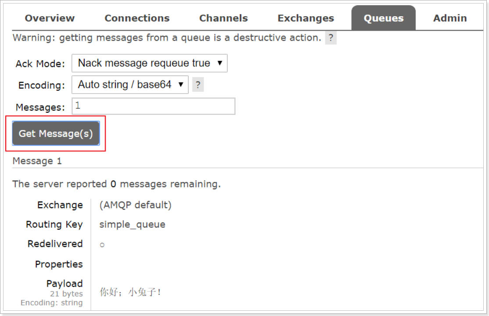

# 0 进阶

RabbitMQ的高可用性

- 镜像集群模式 所有MQ都有相同的队列信息

消息不能多不能少

消息的重复消费

- 保证接口的幂等
  - 具体设计 写redis天然幂等, 写Mysql insert前查已存在改成update, 基于数据库的唯一键, 如果已存在就不会进行插入
  - 下单传全局唯一ID, 如果已存在就不在进行处理

可靠保证:

- 生产者发消息要保证送达, 可开启Confirm模式(异步, 或事务同步)
  - 普通Confirm,  批量~, 异步~
- MQ持久化后才会返回ack
- 消费端(rabbitMQ是如果消息被消费, 立即删除消息不管消息是否被处理) 需要自己手动ack 即处理完之后再返回ack

顺序保证:

- 场景: 一个队列三个消费者,  有三个消息1/2/3 分别给消费者1/2/3 但1消费者先消费了3,1消费了2, 2消费了1,顺序错乱 
- 解决: 拆分队列/ 对应即可 队列的天然有序

延时和过期失效

- 过期失效只能后面补救了批量重导

队列积压怎么办

​	真实:

- 场景: 消费端因为某些原因消费不动了, 比如mysql挂了 处理消息需要对数据库操作
- 修复消费问题肯定不行,还要消费半天才能恢复, 扩容思路 新建一个十倍的MQ集群, 十倍的消费者集群
- 再加一个分发消息的消费者将原来的MQ均匀地分发给新MQ集群


​	官方提供:

	- 批量消费
	- 加机器
	- 丢弃部分数据
	- 优化消息消费时间


怎么做的削峰: 对可以异步并且高请求量的服务, 对其削峰


# 1. 消息中间件概述

## 1.1. 什么是消息中间件

MQ全称为Message Queue，消息队列是应用程序和应用程序之间的通信方法。

  1、任务**异步**处理

将不需要同步处理的并且耗时长的操作由消息队列通知消息接收方进行异步处理。提高了应用程序的响应时间。

  2、应用程序**解耦合**

  MQ相当于一个中介，生产方通过MQ与消费方交互，它将应用程序进行解耦合。

  3、**削峰填谷**


## 1.4. RabbitMQ

RabbitMQ是由erlang语言开发，基于AMQP（Advanced Message Queue 高级消息队列协议）协议实现的消息队列，它是一种应用程序之间的通信方法，消息队列在分布式系统开发中应用非常广泛。

RabbitMQ官方地址：http://www.rabbitmq.com/


RabbitMQ提供了6种模式：简单模式，work模式，Publish/Subscribe发布与订阅模式，Routing路由模式，Topics主题模式，RPC远程调用模式（远程调用，不太算MQ；暂不作介绍）；

官网对应模式介绍：https://www.rabbitmq.com/getstarted.html


# 3. RabbitMQ入门

## 3.1. 搭建示例工程


## 3.2. 编写生产者

编写消息生产者com.itheima.rabbitmq.simple.Producer

```java
package com.itheima.rabbitmq.simple;

import com.rabbitmq.client.Channel;
import com.rabbitmq.client.Connection;
import com.rabbitmq.client.ConnectionFactory;

public class Producer {

    static final String QUEUE_NAME = "simple_queue";

    public static void main(String[] args) throws Exception {
        //创建连接工厂
        ConnectionFactory connectionFactory = new ConnectionFactory();
        //主机地址;默认为 localhost
        connectionFactory.setHost("localhost");
        //连接端口;默认为 5672
        connectionFactory.setPort(5672);
        //虚拟主机名称;默认为 /
        connectionFactory.setVirtualHost("/itcast");
        //连接用户名；默认为guest
        connectionFactory.setUsername("heima");
        //连接密码；默认为guest
        connectionFactory.setPassword("heima");

        //创建连接
        Connection connection = connectionFactory.newConnection();

        // 创建频道
        Channel channel = connection.createChannel();

        // 声明（创建）队列
        /**
         * 参数1：队列名称
         * 参数2：是否定义持久化队列
         * 参数3：是否独占本次连接
         * 参数4：是否在不使用的时候自动删除队列
         * 参数5：队列其它参数
         */
        channel.queueDeclare(QUEUE_NAME, true, false, false, null);

        // 要发送的信息
        String message = "你好；小兔子！";
        /**
         * 参数1：交换机名称，如果没有指定则使用默认Default Exchage
         * 参数2：路由key,简单模式可以传递队列名称
         * 参数3：消息其它属性
         * 参数4：消息内容
         */
        channel.basicPublish("", QUEUE_NAME, null, message.getBytes());
        System.out.println("已发送消息：" + message);

        // 关闭资源
        channel.close();
        connection.close();
    }
}

```


在执行上述的消息发送之后；可以登录rabbitMQ的管理控制台，可以发现队列和其消息：




## 3.3. 编写消费者

抽取创建connection的工具类com.itheima.rabbitmq.util.ConnectionUtil；

```java
package com.itheima.rabbitmq.util;

import com.rabbitmq.client.Connection;
import com.rabbitmq.client.ConnectionFactory;

public class ConnectionUtil {

    public static Connection getConnection() throws Exception {
        //创建连接工厂
        ConnectionFactory connectionFactory = new ConnectionFactory();
        //主机地址;默认为 localhost
        connectionFactory.setHost("localhost");
        //连接端口;默认为 5672
        connectionFactory.setPort(5672);
        //虚拟主机名称;默认为 /
        connectionFactory.setVirtualHost("/itcast");
        //连接用户名；默认为guest
        connectionFactory.setUsername("heima");
        //连接密码；默认为guest
        connectionFactory.setPassword("heima");

        //创建连接
        return connectionFactory.newConnection();
    }

}

```


编写消息的消费者com.itheima.rabbitmq.simple.Consumer

```java
package com.itheima.rabbitmq.simple;

import com.itheima.rabbitmq.util.ConnectionUtil;
import com.rabbitmq.client.*;

import java.io.IOException;

public class Consumer {

    public static void main(String[] args) throws Exception {
        Connection connection = ConnectionUtil.getConnection();

        // 创建频道
        Channel channel = connection.createChannel();

        // 声明（创建）队列
        /**
         * 参数1：队列名称
         * 参数2：是否定义持久化队列
         * 参数3：是否独占本次连接
         * 参数4：是否在不使用的时候自动删除队列
         * 参数5：队列其它参数
         */
        channel.queueDeclare(Producer.QUEUE_NAME, true, false, false, null);

        //创建消费者；并设置消息处理
        DefaultConsumer consumer = new DefaultConsumer(channel){
            @Override
            /**
             * consumerTag 消息者标签，在channel.basicConsume时候可以指定
             * envelope 消息包的内容，可从中获取消息id，消息routingkey，交换机，消息和重传标志(收到消息失败后是否需要重新发送)
             * properties 属性信息
             * body 消息
             */
            public void handleDelivery(String consumerTag, Envelope envelope, AMQP.BasicProperties properties, byte[] body) throws IOException {
                //路由key
                System.out.println("路由key为：" + envelope.getRoutingKey());
                //交换机
                System.out.println("交换机为：" + envelope.getExchange());
                //消息id
                System.out.println("消息id为：" + envelope.getDeliveryTag());
                //收到的消息
                System.out.println("接收到的消息为：" + new String(body, "utf-8"));
            }
        };
        //监听消息
        /**
         * 参数1：队列名称
         * 参数2：是否自动确认，设置为true为表示消息接收到自动向mq回复接收到了，mq接收到回复会删除消息，设置为false则需要手动确认
         * 参数3：消息接收到后回调
         */
        channel.basicConsume(Producer.QUEUE_NAME, true, consumer);

        //不关闭资源，应该一直监听消息
        //channel.close();
        //connection.close();
    }
}
```


## 3.4. 小结

上述的入门案例中中其实使用的是如下的简单模式：


在上图的模型中，有以下概念：

- P：生产者，也就是要发送消息的程序
- C：消费者：消息的接受者，会一直等待消息到来。
- queue：消息队列，图中红色部分。类似一个邮箱，可以缓存消息；生产者向其中投递消息，消费者从其中取出消息。


# 4. AMQP


| 概念           | 说明                                                         |
| -------------- | ------------------------------------------------------------ |
| 连接Connection | 一个网络连接，比如TCP/IP套接字连接。                         |
| 会话Session    | 端点之间的命名对话。在一个会话上下文中，保证“恰好传递一次”。 |
| 信道Channel    | 多路复用连接中的一条独立的双向数据流通道。为会话提供物理传输介质。 |
| 客户端Client   | AMQP连接或者会话的发起者。AMQP是非对称的，客户端生产和消费消息，服务器存储和路由这些消息。 |
| 服务节点Broker | 消息中间件的服务节点；一般情况下可以将一个RabbitMQ Broker看作一台RabbitMQ 服务器。 |
| 端点           | AMQP对话的任意一方。一个AMQP连接包括两个端点（一个是客户端，一个是服务器）。 |
| 消费者Consumer | 一个从消息队列里请求消息的客户端程序。                       |
| 生产者Producer | 一个向交换机发布消息的客户端应用程序。                       |

# 可靠性传输


### 消息的可靠投递

1、定义

confirm 确认模式
return退回模式
rabbitMQ整个消息投递的路径为：
pruducer —>rabbitMQ broker ---->exchange------>queue ----> consumer

消息从producer到exchange则会返回一个confirmCallback。
消息从exchange–>queue投递失败则会返回一个returnCallback。
我们将利用这两个callback控制消息的可靠性投递。

我们都知道，消息从生产端到消费端消费要经过3个步骤：

1. 生产端发送消息到RabbitMQ；
2. RabbitMQ发送消息到消费端；
3. 消费端消费这条消息；


这3个步骤中的每一步都有可能导致消息丢失

### 生产端可靠性投递

生产端可靠性投递，即生产端要确保将消息正确投递到RabbitMQ中。生产端投递的消息丢失的原因有很多，比如消息在网络传输的过程中发生网络故障消息丢失，或者消息投递到RabbitMQ时RabbitMQ挂了，那消息也可能丢失，而我们根本不知道发生了什么。针对以上情况，RabbitMQ本身提供了一些机制。

### 事务消息机制

事务消息机制由于会严重降低性能，所以一般不采用这种方法，我就不介绍了，而采用另一种轻量级的解决方案——confirm消息确认机制。

### confirm消息确认机制

什么是confirm消息确认机制？顾名思义，就是生产端投递的消息一旦投递到RabbitMQ后，RabbitMQ就会发送一个确认消息给生产端，让生产端知道我已经收到消息了，否则这条消息就可能已经丢失了，需要生产端重新发送消息了。


通过下面这句代码来开启确认模式：

```java
channel.confirmSelect();// 开启发送方确认模式
```

然后异步监听确认和未确认的消息：

```java
channel.addConfirmListener(new ConfirmListener() {
    //消息正确到达broker
    @Override
    public void handleAck(long deliveryTag, boolean multiple) throws IOException {
        System.out.println("已收到消息");
        //做一些其他处理
    }

    //RabbitMQ因为自身内部错误导致消息丢失，就会发送一条nack消息
    @Override
    public void handleNack(long deliveryTag, boolean multiple) throws IOException {
        System.out.println("未确认消息，标识：" + deliveryTag);
        //做一些其他处理，比如消息重发等
    }
});
```

这样就可以让生产端感知到消息是否投递到RabbitMQ中了，当然这样还不够，稍后我会说一下极端情况。

### 消息持久化

RabbitMQ收到消息后将这个消息暂时存在了内存中，那这就会有个问题，如果RabbitMQ挂了，那重启后数据就丢失了，所以相关的数据应该持久化到硬盘中

message消息到达RabbitMQ后先是到exchange交换机中，然后路由给queue队列，最后发送给消费端。


所有需要给exchange、queue和message都进行持久化：

exchange持久化：

```java
//第三个参数true表示这个exchange持久化
channel.exchangeDeclare(EXCHANGE_NAME, "direct", true);
```

queue持久化：

```java
//第二个参数true表示这个queue持久化
channel.queueDeclare(QUEUE_NAME, true, false, false, null);
```

message持久化：

```java
//第三个参数MessageProperties.PERSISTENT_TEXT_PLAIN表示这条消息持久化
channel.basicPublish(EXCHANGE_NAME, ROUTING_KEY, MessageProperties.PERSISTENT_TEXT_PLAIN, message.getBytes(StandardCharsets.UTF_8));
```

这样，如果RabbitMQ收到消息后挂了，重启后会自行恢复消息。

到此，RabbitMQ提供的几种机制都介绍完了，但这样还不足以保证消息可靠性投递RabbitMQ中，上面我也提到了会有极端情况，比如RabbitMQ收到消息还没来得及将消息持久化到硬盘时，RabbitMQ挂了，这样消息还是丢失了，或者RabbitMQ在发送确认消息给生产端的过程中，由于网络故障而导致生产端没有收到确认消息，这样生产端就不知道RabbitMQ到底有没有收到消息，就不好做接下来的处理。


所以除了RabbitMQ提供的一些机制外，我们自己也要做一些消息补偿机制，以应对一些极端情况。接下来我就介绍其中的一种解决方案——消息入库。

### 消息入库

消息入库，顾名思义就是将要发送的消息保存到数据库中。

首先发送消息前先将消息保存到数据库中，有一个状态字段status=0，表示生产端将消息发送给了RabbitMQ但还没收到确认；在生产端收到确认后将status设为1，表示RabbitMQ已收到消息。这里有可能会出现上面说的两种情况，所以生产端这边开一个定时器，定时检索消息表，将status=0并且超过固定时间后（可能消息刚发出去还没来得及确认这边定时器刚好检索到这条status=0的消息，所以给个时间）还没收到确认的消息取出重发（第二种情况下这里会造成消息重复，消费者端要做幂等性），可能重发还会失败，所以可以做一个最大重发次数，超过就做另外的处理。


这样消息就可以可靠性投递到RabbitMQ中了，而生产端也可以感知到了。

### 消费端消息不丢失

既然已经可以让生产端100%可靠性投递到RabbitMQ了，那接下来就改看看消费端的了，如何让消费端不丢失消息。

默认情况下，以下3种情况会导致消息丢失：

- 在RabbitMQ将消息发出后，消费端还没接收到消息之前，发生网络故障，消费端与RabbitMQ断开连接，此时消息会丢失；
- 在RabbitMQ将消息发出后，消费端还没接收到消息之前，消费端挂了，此时消息会丢失；
- 消费端正确接收到消息，但在处理消息的过程中发生异常或宕机了，消息也会丢失。


其实，上述3中情况导致消息丢失归根结底是因为RabbitMQ的**自动ack机制**，即默认RabbitMQ在消息发出后就立即将这条消息删除，而不管消费端是否接收到，是否处理完，导致消费端消息丢失时RabbitMQ自己又没有这条消息了。


所以就需要将自动ack机制改为手动ack机制。

消费端手动确认消息：

```
DeliverCallback deliverCallback = (consumerTag, delivery) -> {
    try {
        //接收到消息，做处理
        //手动确认
        channel.basicAck(delivery.getEnvelope().getDeliveryTag(), false);
    } catch (Exception e) {
        //出错处理，这里可以让消息重回队列重新发送或直接丢弃消息
    }
};
//第二个参数autoAck设为false表示关闭自动确认机制，需手动确认
channel.basicConsume(QUEUE_NAME, false, deliverCallback, consumerTag -> {});
```

这样，当autoAck参数置为false，对于RabbitMQ服务端而言，队列中的消息分成了两个部分：一部分是等待投递给消费端的消息；一部分是已经投递给消费端，但是还没有收到消费端确认信号的消息。如果RabbitMQ一直没有收到消费端的确认信号，并且消费此消息的消费端已经断开连接或宕机（RabbitMQ会自己感知到），则RabbitMQ会安排该消息重新进入队列（放在队列头部），等待投递给下一个消费者，当然也有能还是原来的那个消费端，当然消费端也需要确保幂等性。


# 简单实践

## 官网get start

1. 要先将RabbitMQ 已[安装](https://www.rabbitmq.com/download.html)并运行在[标准端口](https://www.rabbitmq.com/networking.html#ports)( 5672 )上的localhost上。如果您使用不同的主机、端口或凭据，则需要调整连接设置。
2. 其他操作没有实际意义就不写了,主要是使用Java客户端与服务端进行连接

## 6.2 发送支付状态

(1)集成RabbitMQ

修改支付微服务，集成RabbitMQ，添加如下依赖：

```xml
<!--加入ampq-->
<dependency>
    <groupId>org.springframework.boot</groupId>
    <artifactId>spring-boot-starter-amqp</artifactId>
</dependency>
```


这里我们建议在后台手动创建队列，并绑定队列。如果使用程序创建队列，可以按照如下方式实现。

修改application.yml，配置支付队列和交换机信息，代码如下：

```properties
#位置支付交换机和队列
mq:
  pay:
    exchange:
      order: exchange.order
    queue:
      order: queue.order
    routing:
      key: queue.order
```


创建队列以及交换机并让队列和交换机绑定，修改com.changgou.WeixinPayApplication,添加如下代码：

```java
/***
 * 创建DirectExchange交换机
 * @return
 */
@Bean
public DirectExchange basicExchange(){
    return new DirectExchange(env.getProperty("mq.pay.exchange.order"), true,false);
}

/***
 * 创建队列
 * @return
 */
@Bean(name = "queueOrder")
public Queue queueOrder(){
    return new Queue(env.getProperty("mq.pay.queue.order"), true);
}

/****
 * 队列绑定到交换机上
 * @return
 */
@Bean
public Binding basicBinding(){
    return BindingBuilder.bind(queueOrder()).to(basicExchange()).with(env.getProperty("mq.pay.routing.key"));
}
```


#### 6.2.2 发送MQ消息

修改回调方法，在接到支付信息后，立即将支付信息发送给RabbitMQ，代码如下：


上图代码如下：

```java
@Value("${mq.pay.exchange.order}")
private String exchange;
@Value("${mq.pay.queue.order}")
private String queue;
@Value("${mq.pay.routing.key}")
private String routing;

@Autowired
private WeixinPayService weixinPayService;

@Autowired
private RabbitTemplate rabbitTemplate;

/***
 * 支付回调
 * @param request
 * @return
 */
@RequestMapping(value = "/notify/url")
public String notifyUrl(HttpServletRequest request){
    InputStream inStream;
    try {
        //读取支付回调数据
        inStream = request.getInputStream();
        ByteArrayOutputStream outSteam = new ByteArrayOutputStream();
        byte[] buffer = new byte[1024];
        int len = 0;
        while ((len = inStream.read(buffer)) != -1) {
            outSteam.write(buffer, 0, len);
        }
        outSteam.close();
        inStream.close();
        // 将支付回调数据转换成xml字符串
        String result = new String(outSteam.toByteArray(), "utf-8");
        //将xml字符串转换成Map结构
        Map<String, String> map = WXPayUtil.xmlToMap(result);
        //将消息发送给RabbitMQ
        rabbitTemplate.convertAndSend(exchange,routing, JSON.toJSONString(map));

        //响应数据设置
        Map respMap = new HashMap();
        respMap.put("return_code","SUCCESS");
        respMap.put("return_msg","OK");
        return WXPayUtil.mapToXml(respMap);
    } catch (Exception e) {
        e.printStackTrace();
        //记录错误日志
    }
    return null;
}
```


### 6.3 监听MQ消息处理订单

在订单微服务中，我们需要监听MQ支付状态消息，并实现订单数据操作。

#### 6.3.1 集成RabbitMQ

在订单微服务中，先集成RabbitMQ，再监听队列消息。

在pom.xml中引入如下依赖：

```xml
<!--加入ampq-->
<dependency>
    <groupId>org.springframework.boot</groupId>
    <artifactId>spring-boot-starter-amqp</artifactId>
</dependency>
```


在application.yml中配置rabbitmq配置，代码如下：


在application.yml中配置队列名字，代码如下：

```properties
#位置支付交换机和队列
mq:
  pay:
    queue:
      order: queue.order
```


#### 6.3.2 监听消息修改订单

在订单微服务于中创建com.changgou.order.consumer.OrderPayMessageListener，并在该类中consumeMessage方法，用于监听消息，并根据支付状态处理订单，代码如下：

```java
@Component
@RabbitListener(queues = {"${mq.pay.queue.order}"})
public class OrderPayMessageListener {

    @Autowired
    private RedisTemplate redisTemplate;

    @Autowired
    private OrderService orderService;

    /***
     * 接收消息
     */
    @RabbitHandler
    public void consumeMessage(String msg){
        //将数据转成Map
        Map<String,String> result = JSON.parseObject(msg,Map.class);

        //return_code=SUCCESS
        String return_code = result.get("return_code");
        //业务结果
        String result_code = result.get("result_code");

        //业务结果 result_code=SUCCESS/FAIL，修改订单状态
        if(return_code.equalsIgnoreCase("success") ){
            //获取订单号
            String outtradeno = result.get("out_trade_no");
            //业务结果
            if(result_code.equalsIgnoreCase("success")){
                if(outtradeno!=null){
                    //修改订单状态  out_trade_no
                    orderService.updateStatus(outtradeno,result.get("transaction_id"));
                }
            }else{
                //订单删除
                orderService.deleteOrder(outtradeno);
            }
        }

    }
}
```


## 7 定时处理订单状态

### 7.1 业务分析

在现实场景中，可能会出现这么种情况，就是用户支付后，有可能畅购服务网络不通或者服务器挂了，此时会导致回调地址无法接收到用户支付状态，这时候我们需要取微信服务器查询。所以我们之前订单信息的ID存入到了Redis队列，主要用于解决这种网络不可达造成支付状态无法回调获取的问题。

实现思路如下：

```properties
1.每次下单，都将订单存入到Reids List队列中
2.定时每5秒检查一次Redis 队列中是否有数据，如果有，则再去查询微信服务器支付状态
3.如果已支付，则修改订单状态
4.如果没有支付，是等待支付，则再将订单存入到Redis队列中，等会再次检查
5.如果是支付失败，直接删除订单信息并修改订单状态
```

# 消息中间件&RabbitMQ面试

### 什么是RabbitMQ？


### @$你们公司生产环境用的是什么消息中间件？

这个首先你可以说下你们公司选用的是什么消息中间件，比如用的是RabbitMQ，然后可以初步给一些你**对不同MQ中间件技术的选型分析**。

举个例子：比如说ActiveMQ是老牌的消息中间件，国内很多公司过去运用的还是非常广泛的，功能很强大。

但是问题在于ActiveMQ没法支撑互联网公司的高并发、高负载以及高吞吐的复杂场景，现在在国内互联网公司落地较少。而且使用较多的是一些传统企业，**用ActiveMQ做异步调用和系统解耦**。

**然后你可以说说RabbitMQ**，他的好处在于可以支撑高并发、高吞吐量、性能很高，同时有非常完善便捷的后台管理界面可以使用。

另外，他还支持集群化、高可用部署架构、消息高可靠支持，功能较为完善。

而且经过调研，国内各大互联网公司落地RabbitMQ集群支撑自身业务的case较多，国内各种中小型互联网公司使用RabbitMQ的实践也比较多。

除此之外，RabbitMQ的开源社区很活跃，较高频率的版本迭代，来修复发现的bug以及进行各种优化，因此综合考虑过后，公司采取了RabbitMQ。

但是RabbitMQ也有一点缺陷，就是他自身是基于erlang语言开发的，所以导致较为难以分析里面的源码，也较难进行深层次的源码定制和改造，需要较为扎实的erlang语言功底。

**然后可以聊聊RocketMQ**，是阿里开源的，经过阿里生产环境的超高并发、高吞吐的考验，性能卓越，同时还支持分布式事务等特殊场景。

而且RocketMQ是基于Java语言开发的，适合深入阅读源码，有需要可以站在源码层面解决线上问题，包括源码的二次开发和改造。

**另外就是Kafka**。Kafka提供的消息中间件的功能明显较少一些，相对上述几款MQ中间件要少很多。

但是Kafka的优势在于专为超高吞吐量的实时日志采集、实时数据同步、实时数据计算等场景。

因此Kafka在大数据领域中配合实时计算技术（比如Spark Streaming、Storm、Flink）使用的较多。但是在传统的MQ中间件使用场景中较少采用。


### ActiveMQ、RabbitMQ、RocketMQ、Kafka有什么优缺点？

|            | ActiveMQ                                                | RabbitMQ                                                     | RocketMQ                                                     | Kafka                                                        | ZeroMQ               |
| ---------- | ------------------------------------------------------- | ------------------------------------------------------------ | ------------------------------------------------------------ | ------------------------------------------------------------ | -------------------- |
| 单机吞吐量 | 比RabbitMQ低                                            | 2.6w/s（消息做持久化）                                       | 11.6w/s                                                      | 17.3w/s                                                      | 29w/s                |
| 开发语言   | Java                                                    | Erlang                                                       | Java                                                         | Scala/Java                                                   | C                    |
| 主要维护者 | Apache                                                  | Mozilla/Spring                                               | Alibaba                                                      | Apache                                                       | iMatix，创始人已去世 |
| 成熟度     | 成熟                                                    | 成熟                                                         | 开源版本不够成熟                                             | 比较成熟                                                     | 只有C、PHP等版本成熟 |
| 订阅形式   | 点对点(p2p)、广播（发布-订阅）                          | 提供了4种：direct, topic  ,Headers和fanout。fanout就是广播模式 | 基于topic/messageTag以及按照消息类型、属性进行正则匹配的发布订阅模式 | 基于topic以及按照topic进行正则匹配的发布订阅模式             | 点对点(p2p)          |
| 持久化     | 支持少量堆积                                            | 支持少量堆积                                                 | 支持大量堆积                                                 | 支持大量堆积                                                 | 不支持               |
| 顺序消息   | 不支持                                                  | 不支持                                                       | 支持                                                         | 支持                                                         | 不支持               |
| 性能稳定性 | 好                                                      | 好                                                           | 一般                                                         | 较差                                                         | 很好                 |
| 集群方式   | 支持简单集群模式，比如'主-备'，对高级集群模式支持不好。 | 支持简单集群，'复制'模式，对高级集群模式支持不好。           | 常用 多对'Master-Slave' 模式，开源版本需手动切换Slave变成Master | 天然的‘Leader-Slave’无状态集群，每台服务器既是Master也是Slave | 不支持               |
| 管理界面   | 一般                                                    | 较好                                                         | 一般                                                         | 无                                                           | 无                   |

综上，各种对比之后，有如下建议：

一般的业务系统要引入 MQ，最早大家都用 ActiveMQ，但是现在确实大家用的不多了，没经过大规模吞吐量场景的验证，社区也不是很活跃，所以大家还是算了吧，我个人不推荐用这个了；

后来大家开始用 RabbitMQ，但是确实 erlang 语言阻止了大量的 Java 工程师去深入研究和掌控它，对公司而言，几乎处于不可控的状态，但是确实人家是开源的，比较稳定的支持，活跃度也高；

不过现在确实越来越多的公司会去用 RocketMQ，确实很不错，毕竟是阿里出品，但社区可能有突然黄掉的风险（目前 RocketMQ 已捐给 Apache，但 GitHub 上的活跃度其实不算高）对自己公司技术实力有绝对自信的，推荐用 RocketMQ，否则回去老老实实用 RabbitMQ 吧，人家有活跃的开源社区，绝对不会黄。

所以**中小型公司**，技术实力较为一般，技术挑战不是特别高，用 RabbitMQ 是不错的选择；**大型公司**，基础架构研发实力较强，用 RocketMQ 是很好的选择。

如果是**大数据领域**的实时计算、日志采集等场景，用 Kafka 是业内标准的，绝对没问题，社区活跃度很高，绝对不会黄，何况几乎是全世界这个领域的事实性规范。


其他解决方案

方案一：消费端增加消息记录表，暂存不满足业务条件的消息，并采用定时器进行补偿处理，补偿超次进行预警；（该方案对技术营运友好，目前DMS正在使用，同样该方案可以用来解决重复消费问题）

方案二：消费端对不满足业务条件的消息不进行确认，多次消费失败进入死信队列，监听死信队列进行补偿，补偿超次或失败进行预警；

方案三：采用RocketMQ顺序消费机制；（不建议使用，会降低系统吞吐量）

> todo 消息记录表


**消息的重复问题**

造成消息重复的根本原因是：网络不可达。

所以解决这个问题的办法就是绕过这个问题。那么问题就变成了：如果消费端收到两条一样的消息，应该怎样处理？

**消费端处理消息的业务逻辑需要保持幂等性**。只要保持幂等性，不管来多少条重复消息，最后处理的结果都一样。保证每条消息都有唯一编号和添加一张日志表来记录已经处理成功的消息的 ID，如果新到的消息 ID 已经在日志表中，那么就不再处理这条消息。


### @$消息积压怎么处理

**消息积压的原因**

消息积压的直接原因，一定是系统中**某个部分出现了性能问题**，**来不及处理上游发送的消息**，才会导致消息积压。

如果日常系统正常运转的时候，没有积压或者只有少量积压很快就消费掉了，但是**某一个时刻**，突然就开始积压消息并且积压持续上涨。这种情况下需要你在短时间内找到消息积压的原因，迅速解决问题才不至于影响业务。

**消息积压的处理**

排查消息积压原因的方法：能导致积压突然增加，最粗粒度的原因，只有两种：要么是**发送变快**了，要么是**消费变慢**了。

- 大部分消息队列都内置了**监控**的功能，只要通过监控数据，很容易确定是哪种原因。如果是单位时间发送的消息增多，比如说是赶上大促或者抢购，短时间内不太可能优化消费端的代码来提升消费性能，唯一的方法是通过**扩容消费端的实例数**来提升总体的消费能力。如果短时间内没有足够的服务器资源进行扩容，没办法的办法是，将系统降级，通过**关闭一些不重要的业务，减少发送方发送的数据量，最低限度让系统还能正常运转，服务一些重要业务**。
- 还有一种不太常见的情况，你通过监控发现，无论是**发送消息的速度还是消费消息的速度和原来都没什么变化**，这时候你需要检查一下你的消费端，**是不是消费失败导致的一条消息反复消费这种情况比较多**，这种情况也会拖慢整个系统的消费速度。
- 如果监控到消费变慢了，你需要检查你的消费实例，分析一下是什么原因导致消费变慢。优先**检查一下日志是否有大量的消费错误**，如果没有错误的话，可以通过打印堆栈信息，看一下你的消费线程是不是卡在什么地方不动了，比如触发了死锁或者卡在等待某些资源上了。


### @$如何保证RabbitMQ消息的可靠传输？消息丢失怎么办？

消息不可靠的情况可能是消息丢失，劫持等原因；

丢失又分为：生产者丢失消息、消息列表丢失消息、消费者丢失消息；

**生产者丢失消息**：**从生产者弄丢数据这个角度来看，RabbitMQ提供transaction和confirm模式来确保生产者不丢消息**；

transaction机制就是说：发送消息前，开启事务（channel.txSelect()），然后发送消息，如果发送过程中出现什么异常，事务就会回滚（channel.txRollback()），如果发送成功则提交事务（channel.txCommit()）。然而，这种方式有个缺点：吞吐量下降；

confirm模式用的居多：一旦channel进入confirm模式，所有在该信道上发布的消息都将会被指派一个唯一的ID（从1开始），一旦消息被投递到所有匹配的队列之后，rabbitMQ就会发送一个ACK给生产者（包含消息的唯一ID），这就使得生产者知道消息已经正确到达目的队列了；如果rabbitMQ没能处理该消息，则会发送一个Nack消息给你，生产者可以进行重试操作。

**消息队列丢数据**：**消息持久化**。

处理消息队列丢数据的情况，一般是开启持久化磁盘的配置。

这个持久化配置可以和confirm机制配合使用，你可以在消息持久化磁盘后，再给生产者发送一个Ack信号。

这样，如果消息持久化磁盘之前，rabbitMQ阵亡了，那么生产者收不到Ack信号，生产者会自动重发。

那么如何持久化呢？

这里顺便说一下吧，其实也很容易，就下面两步

1. 将queue的持久化标识durable设置为true，则代表是一个持久的队列
2. 发送消息的时候将deliveryMode=2

这样设置以后，即使rabbitMQ挂了，重启后也能恢复数据

**消费者丢失消息**：**消费者丢数据一般是因为采用了自动确认消息模式，改为手动确认消息即可**！

消费者在收到消息之后，处理消息之前，会自动回复RabbitMQ已收到消息；

如果这时处理消息失败，就会丢失该消息；

解决方案：处理消息成功后，手动回复确认消息。

> todo 手动回复确认消息

### @$RabbitMQ 常见工作模式和应用场景

> 交换机todo

#### 一、简单模式

**原理**：一个生产者，一个消费者。生产者将消息发送到队列，消费者监听消息队列，如果队列中有消息，就进行消费，消费后消息从队列中删除


**场景**：聊天；有一个oa系统，用户通过接收手机验证码进行注册，页面上点击获取验证码后，将验证码放到消息队列，然后短信服务从队列中获取到验证码，并发送给用户。

#### 二、工作模式

**原理**：一个生产者，多个消费者，一条消息只能被一个消费者消费。生产者将消息发送到消息队列，多个消费者同时监听一个队列，谁先抢到消息谁负责消费。这样就形成了资源竞争，谁的资源空闲大，争抢到的可能性就大。


**场景**：红包；有一个电商平台，有两个订单服务，用户下单的时候，任意一个订单服务消费用户的下单请求生成订单即可。不用两个订单服务同时消费用户的下单请求。

#### 三、发布订阅模式

**原理**：一个生产者，多个消费者，每个消费者都可以收到相同的消息。生产者将消息发送到交换机，交换机类型是fanout，不同的队列注册到交换机上，不同的消费者监听不同的队列，所有消费者都会收到消息。


**场景**：邮件群发，群聊天，广播(广告)；有一个商城，我们新添加一个商品后，可能同时需要去更新缓存和数据库。

#### 四、路由模式

**原理**：生产者将消息发送给交换机，消息携带具体的routingkey。交换机类型是direct，交换机匹配与之绑定的队列的routingkey，分发到不同的队列上。


**场景**：还是一样，有一个商城，新添加了一个商品，实时性不是很高，只需要添加到数据库即可，不用刷新缓存。

#### 五、主题模式

**原理**：路由模式的一种，交换机类型是topic，路由功能添加了模糊匹配。星号（*）代表1个单词，#号（#）代表一个或多个单词。


**场景**：还是一样，有一个商城，新添加了一个商品，实时性不是很高，只需要添加到数据库即可，数据库包含了主数据库mysql1和从数据库mysql2的内容，不用刷新缓存。

#### 六、RPC

1、首先客户端发送一个reply_to和corrention_id的请求，发布到RPC队列中；

2、服务器端处理这个请求，并把处理结果发布到一个回调Queue,此Queue的名称应当与reply_to的名称一致

3、客户端从回调Queue中得到先前corrention_id设定的值的处理结果。如果碰到和先前不一样的corrention_id的值，将会忽略而不是抛出异常。


