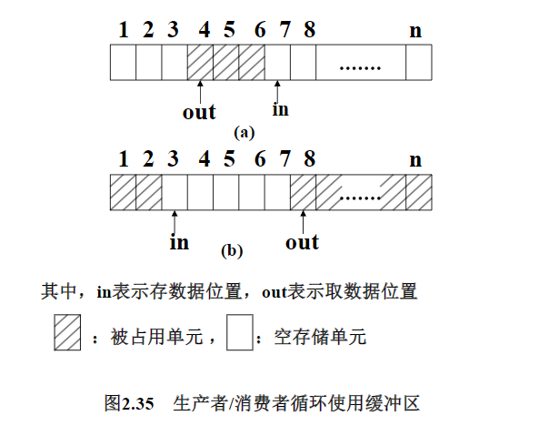
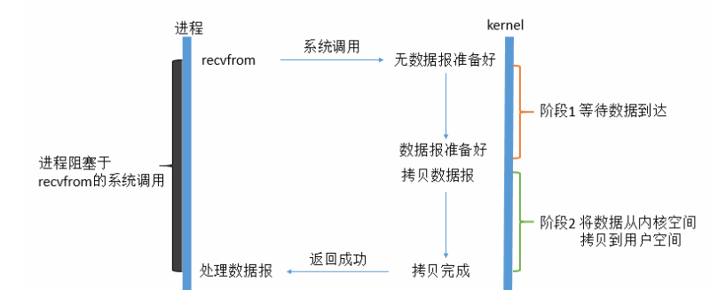
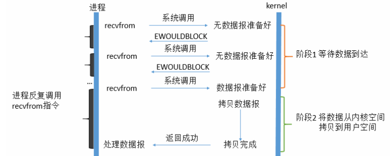
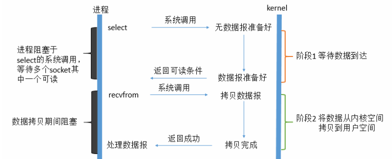
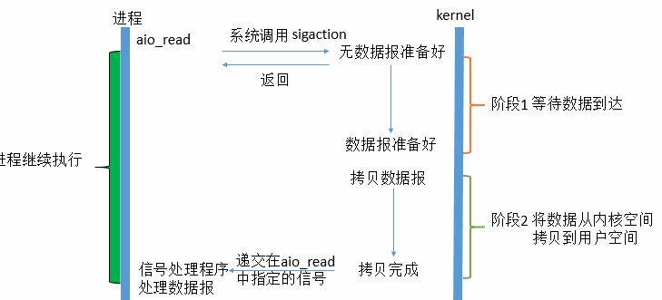
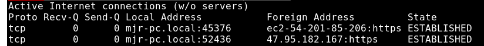
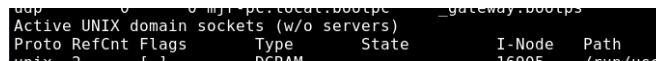

笔试题:

AMAT（平均内存访问时间）= 命中时间 + 未命中率 * 未命中惩罚

- 一级缓存，10ns，50%
- 二级缓存，50ns，90%
- 主存储器，60ns，100%

res  = 10 + 0.5*(50 + 0.1 * (600)) = 65ns

# 第一章 操作系统概述(从软件工程角度)

abstract
What’s OS
按软件工程的观点分析OS的结构
操作系统的发展，类型及特征
现代操作系统体系结构基础知识

## 1.1What’s OS

1.User/Computer Interface (用户角度)
OS是用户使用计算机系统的接口，为用户提供了方便的工作环境
2.Virtual Machine（程序员）
建立在硬件上的虚拟机器,为应用软件提供了许多比计算机硬件功能更强或没有的功能
3.Resource Manager(OS开发者1）
负责分配，回收，以及控制系统中的各种软硬件资源

4.Job Organizer（OS开发者2）
工作流程的组织者，负责协调各个应用软件的运行次序

JVM是建立在OS之上的虚拟机：可对比理解

软件工程 需求分析→系统设计→编码实现→产品测试

## 1.2 OS的系统需求

### 软件系统的系统需求

指人们从外部对系统提出的诸多期望
包括三种类型

1. 提供的服务
2. OS提供服务需要满足的限制条件
3. OS具有适应某些变化的能力

第一类系统需求是后两类系统需求赖以存在的基础，称为功能性需求，后两者为非功能性需求

### 功能性需求

计算机用户需要的**用户命令**，由OS实现的所有用户命令构成的集合，被称为**用户接口**或者命令接口
引用软件需要的**系统调用**，由OS实现的所有系统调用的集合被称为程序接口或应用编程接口

Interface(用户接口)
表示形式：字符，菜单，图形形式
使用方式：脱机（off-line处理时不能改变作业步)/联机（on-line可随时改变）

System Call
应用软件在运行过程可以引用的系统服务
常用 POSIX.1 WIN32 API

### OS对硬件平台的依赖

Timer

- I/O Interrupts
- DMA or Channel
- Privileged Instructions (特权指令）
- Memory Protection Mechanism
  ... ...

### 基本概念：Job（作业）

- 用户一次上机过程中要求计算机为其所做工作的集合；作业中的每项相对独立的工作称为作业步

- 通常，一组命令来描述作业；其中每个命令定义为一个作业步
  -......

### 基本概念：Thread&Process

- Thread是指程序的一次相对独立的运行过程，在现代OS中，线程是系统调度的最小单位。
- Process是指，系统分配资源的基本对象；在现代OS中，进程仅仅是系统中拥有资源的最小实体；不过在传统OS中进程同时也是系统调度的最小单位

### 基本概念 Virtual Memory&File

 - 虚拟存储简单的说就是进程的逻辑地址空间；是现代OS对计算机系统中多级物理存储体系进行高度抽象的结果
 - 文件，简单的说就是命名了的字节流；它是现代OS对计算机系统种类繁多的外设设备进行高度抽象的结果

## 1.3 OS的演变，类型及特点 

### 串行处理

### 简单批处理系统

## 1.4 OS体系结构

需求分析→系统设计→编码实现→产品测试
系统设计→软件体系结构设计→软件部件设计

### 一种常见的OS总体结构风格

- 大多数现代OS总体结构包含两类子系统 ：用户接口子系统（提供命令接口），和基础平台子系统（提供系统调用）
- 两者关系单项性，具体来说用户接口子系统在实现各种用户命令时能够引用基础平台子系统提供的各种系统调用，但基础平台子系统在实现各种系统调用不会引用用户命令

### OS基础平台子系统结构风格

- 分层   特征：按层实现一组概念及其相关的基本属性 ，上层只依赖直接下层
- 分级	类似分层 按级 ~                                                    只依赖以下各级             级~
- 分块   按块实现~                                                     ~ ，所有各块均可任意引用其他各块提供的概念及属性

### 双模式

user model 和kernel model

# 第一章 概述(从了解已有功能角度)

## 基本特征

### 1. 并发

并发是指宏观上在一段时间内能同时运行多个程序，而并行则指同一时刻能运行多个指令。

并行需要硬件支持，如多流水线、多核处理器或者分布式计算系统。

操作系统通过引入进程和线程，使得程序能够并发运行。

并行（Parallelism）是指在同一时间内有多个任务在执行，这些任务可能是由多个处理器或多个核心组成的系统同时执行的。例如，在多核处理器上，有多个线程同时执行，这就是并行的情况。并行可以提高系统的效率和性能，因为它可以利用多个处理器或核心同时执行多个任务，从而缩短了任务的执行时间。
并发（Concurrency）是指在计算机系统中，多个任务在逻辑上同时执行，但它们实际上是在单个处理器上依次执行的。并发可以通过操作系统的调度来实现，使得多个任务在单个处理器上轮流执行，给人一种同时执行的感觉。并发可以提高系统的响应能力和效率，因为它可以让多个任务在等待某些操作（如 I/O 操作）完成时继续执行其他任务，而不是等待所有操作完成再执行下一个任务。
在计算机科学中，并行和并发的概念常常被混淆，因为它们在某些方面是相似的。然而，它们的区别在于并行是真正的同时执行，而并发是逻辑上的同时执行。并行通常涉及到多个处理器或核心，而并发通常涉及到单个处理器上的任务调度。
总之，在计算机科学中，并行和并发都是与多个任务同时执行有关的概念。并行是指多个任务在同一时间内执行，而并发是指多个任务在单个处理器上依次执行，但给人一种同时执行的感觉。这两个概念在实际应用中都很重要，因为它们可以帮助提高系统的效率和性能。

### 2. 共享

共享是指系统中的资源可以被多个并发进程共同使用。

有两种共享方式：互斥共享和同时共享。

互斥共享的资源称为临界资源，例如打印机等，在同一时刻只允许一个进程访问，需要用同步机制来实现互斥访问。

### 3. 虚拟

虚拟技术把一个物理实体转换为多个逻辑实体。

主要有两种虚拟技术：时（时间）分复用技术和空（空间）分复用技术。

多个进程能在同一个处理器上并发执行使用了时分复用技术，让每个进程轮流占用处理器，每次只执行一小个时间片并快速切换。

虚拟内存使用了空分复用技术，它将物理内存抽象为地址空间，每个进程都有各自的地址空间。地址空间的页被映射到物理内存，地址空间的页并不需要全部在物理内存中，当使用到一个没有在物理内存的页时，执行页面置换算法，将该页置换到内存中。

### 4. 异步

异步指进程不是一次性执行完毕，而是走走停停，以不可知的速度向前推进。

## 基本功能

### 1. 进程管理

进程控制、进程同步、进程通信、死锁处理、处理机调度等。

### 2. 内存管理

内存分配、地址映射、内存保护与共享、虚拟内存等。

### 3. 文件管理

文件存储空间的管理、目录管理、文件读写管理和保护等。

### 4. 设备管理

完成用户的 I/O 请求，方便用户使用各种设备，并提高设备的利用率。

主要包括缓冲管理、设备分配、设备处理、虛拟设备等。

## 系统调用

内核态的功能实现

如果一个进程在用户态需要使用内核态的功能，就进行系统调用从而陷入内核，由操作系统代为完成。

Linux 的系统调用主要有以下这些：

|   Task   | Commands                    |
| :------: | --------------------------- |
| 进程控制 | fork(); exit(); wait();     |
| 进程通信 | pipe(); shmget(); mmap();   |
| 文件操作 | open(); read(); write();    |
| 设备操作 | ioctl(); read(); write();   |
| 信息维护 | getpid(); alarm(); sleep(); |
|   安全   | chmod(); umask(); chown();  |

## 宏内核和微内核

> todo os的进一步学习

### 1. 宏内核

宏内核是将操作系统功能作为一个紧密结合的整体放到内核。

由于各模块共享信息，因此有很高的性能。

### 2. 微内核

由于操作系统不断复杂，因此将一部分操作系统功能移出内核，从而降低内核的复杂性。移出的部分根据分层的原则划分成若干服务，相互独立。

在微内核结构下，操作系统被划分成小的、定义良好的模块，只有微内核这一个模块运行在内核态，其余模块运行在用户态。

因为需要频繁地在用户态和核心态之间进行切换，所以会有一定的性能损失。

> todo:  用户态的情况与核心态的情况

<div align="center">  </div><br>

## 中断分类

### 1. 外中断

由 CPU 执行指令以外的事件引起，如 I/O 完成中断，表示设备输入/输出处理已经完成，处理器能够发送下一个输入/输出请求。此外还有时钟中断、控制台中断等。

### 2. 异常

由 CPU 执行指令的内部事件引起，如非法操作码、地址越界、算术溢出等。

### 3. 陷入

在用户程序中使用系统调用。

# 第二章 进程和调度

## 进程描述和控制

### Swapping（交换技术）

将内存中暂时不能运行的进程，或暂时不用的数据和程序，Swapping-out到外存，以腾出足够的内存空间，把已具备运行条件的进程或进程所需要的数据和程序，Swapping-in内存

### 进程描述

OS控制体系: 通过各种表管理

- 关于进程和资源的当前状态信息
- 表是为了每个操作系统管理的实体构建的
- 存储表
- I/O 表
- 文件表
- 程序表
  

> todo进一步了解


## 进程调度算法

不同环境的调度算法目标不同，因此需要针对不同环境来讨论调度算法。

### 1. 批处理系统

批处理系统没有太多的用户操作，在该系统中，调度算法目标是保证吞吐量和周转时间（从提交到终止的时间）。

**1.1 先来先服务 first-come first-serverd（FCFS）**  

非抢占式的调度算法，按照请求的顺序进行调度。

有利于长作业，但不利于短作业，因为短作业必须一直等待前面的长作业执行完毕才能执行，而长作业又需要执行很长时间，造成了短作业等待时间过长。

**1.2 短作业优先 shortest job first（SJF）**  

非抢占式的调度算法，按估计运行时间最短的顺序进行调度。

长作业有可能会饿死，处于一直等待短作业执行完毕的状态。因为如果一直有短作业到来，那么长作业永远得不到调度。

**1.3 最短剩余时间优先 shortest remaining time next（SRTN）**  

最短作业优先的抢占式版本，按剩余运行时间的顺序进行调度。 当一个新的作业到达时，其整个运行时间与当前进程的剩余时间作比较。如果新的进程需要的时间更少，则挂起当前进程，运行新的进程。否则新的进程等待。

### 2. 交互式系统

交互式系统有大量的用户交互操作，在该系统中调度算法的目标是快速地进行响应。

**2.1 时间片轮转**  

将所有就绪进程按 FCFS 的原则排成一个队列，每次调度时，把 CPU 时间分配给队首进程，该进程可以执行一个时间片。当时间片用完时，由计时器发出时钟中断，调度程序便停止该进程的执行，并将它送往就绪队列的末尾，同时继续把 CPU 时间分配给队首的进程。

时间片轮转算法的效率和时间片的大小有很大关系：

- 因为进程切换都要保存进程的信息并且载入新进程的信息，如果时间片太小，会导致进程切换得太频繁，在进程切换上就会花过多时间。
- 而如果时间片过长，那么实时性就不能得到保证。

<div align="center">  </div><br>

**2.2 优先级调度**  

为每个进程分配一个优先级，按优先级进行调度。

为了防止低优先级的进程永远等不到调度，可以随着时间的推移增加等待进程的优先级。

**2.3 多级反馈队列**  

一个进程需要执行 100 个时间片，如果采用时间片轮转调度算法，那么需要交换 100 次。

多级队列是为这种需要连续执行多个时间片的进程考虑，它设置了多个队列，每个队列时间片大小都不同，例如 1,2,4,8,..。进程在第一个队列没执行完，就会被移到下一个队列。这种方式下，之前的进程只需要交换 7 次。

每个队列优先权也不同，最上面的优先权最高。因此只有上一个队列没有进程在排队，才能调度当前队列上的进程。

可以将这种调度算法看成是时间片轮转调度算法和优先级调度算法的结合。

<div align="center">  </div><br>

### 3. 实时系统

实时系统要求一个请求在一个确定时间内得到响应。

分为硬实时和软实时，前者必须满足绝对的截止时间，后者可以容忍一定的超时。

##  并发

### 并发控制

#### 并发设计的问题

完成一个任务时多进程间的管理共同完成且不出错

- 进程间交流 
- 共享/竞争资源
- 多进程的同步
- 处理器时间的分配


#### 操作系统问题

跟踪活动进程:PCB．

分配和释放资源

- 处理器时间:调度

- 记忆:虚拟内存

- 文件I / O设备

- 保护数据和资源

### 互斥条件与解决方案

#### 互斥的要求

- 空则让进
- 忙则等待
- 有限等待
- 让权等待

#### 互斥的方法(Approaches of Mutual Exclusion)

- 软件方法

  - 内存级别,保证内存 
  - Access to the same location in main memory are serialized
    by some sort of memory arbiter (内存仲裁器待学习)

- 硬件支持

  - 中断禁用(OS中断待学习)

    - 进程运行到调用操作系统服务或中断为止。

    - 禁用中断保证了互斥。

    这种方法的代价很高。

    多处理

    - 在一个处理器上禁用中断不能保证互斥。

- 信号量

  - 称为信号量的特殊变量用于发送信号。
  - 如果一个进程正在等待一个信号，那么它将被阻塞，直到该信号被发送。
  - 等待和信号操作不能中断。
  - Queue用于保存等待信号量的进程。
  - 信号量信号量是一个具有整数值的变量s。可以初始化为非负数。Wait和Signal是原语(是系统调用,原子的，不能被中断，每个例程可以被视为不可分割的步骤)。
    - 可理解为资源数,门口多把钥匙,都能进

- 管程

  - 队列+互斥区
  - 信号量容易出错(wait和signal操作的顺序很重要)

- 消息传递

  - send(地址,消息) 和 recive(地址,消息)
  - 可以是send和recive都可以是非阻塞的

#### 生产者消费者

- 一个缓冲区同时只能只有一个人访问(互斥)

- 不能在空的取,不能在满的加(同步)

- 循环使用缓冲区

  - 

  - Java实现

  - ```java
    //同步方式: Object的wait notify, park,unpark(再复习下),Lock.Condition接口的await()和signal() 
    //BlockQueue方式
    
    ```


​    

```java
// synchronized 实现互斥,wait,notifyAll()实现同步
public class Cache {
        private final static int MAX_SIZE = 10;
        private int cacheSize = 0;   
		public Cache(){
        	cacheSize = 0;
        }

    public Cache(int size){
        cacheSize = size;
    }
    //分析过程 一个生产者进来 不大于直接生产 小于则让出
    public void produce(){
        synchronized (this){
            while (cacheSize >= MAX_SIZE ){
                try {
                    System.out.println("缓存已满，生产者需要等待");
                    wait();
                } catch (InterruptedException e) {
                    e.printStackTrace();
                }
            }
            cacheSize++;
            System.out.println("生产了一个产品。当前产品数量为"+ cacheSize);
            notify();
        }

    }

    public void consume(){
        synchronized (this){
            while(cacheSize <= 0){
                try {
                    System.out.println("缓存为空，消费者需要等待");
                    wait();
                } catch (InterruptedException e) {
                    e.printStackTrace();
                }
            }
            cacheSize--;
            System.out.println("消费了一个产品。当前产品数量为"+ cacheSize);
            notify();
        }
    }
}
```


​    

```java
// Java内部信号量
//public class Cache {
//    private int cacheSize = 0;
//
//    public Semaphore mutex;
//    public Semaphore empty; //保证了容器空的时候（empty的信号量<=0), 消费者等待
//    public Semaphore full;  //保证了容器满的时候（full的信号量 <= 0），生产者等待
//
//    public Cache(int size) {
//        mutex = new Semaphore(1);   //二进制信号量，表示互斥锁
//        empty = new Semaphore(size);
//        full = new Semaphore(0);
//    }
//
//    public int getCacheSize()throws InterruptedException{
//        return cacheSize;
//    }
//
//    public void produce() throws InterruptedException{
//        empty.acquire();    // 消耗一个空位
//        mutex.acquire();
//        cacheSize++;
//        System.out.println("生产了一个产品， 当前产品数为" + cacheSize);
//        mutex.release();
//        full.release();     // 增加了一个产品
//
//
//    }
//
//    public void consume() throws InterruptedException{
//        full.acquire();     // 消耗了一个产品
//        mutex.acquire();
//        cacheSize--;
//        System.out.println("消费了一个产品， 当前产品数为" + cacheSize);
//        mutex.release();
//        empty.release();    // 增加了一个空位
//
//    }
//}
```


​    

~~~java
//管程
public class Cache {
    private final static int MAX_SIZE = 10;
    private int cacheSize = 0;
    private Lock lock;
    private Condition notFull;
    private Condition notEmpty;

    public Cache(){
        cacheSize = 0;
        this.lock = new ReentrantLock();
        this.notFull = lock.newCondition();
        this.notEmpty = lock.newCondition();
    }

    public Cache(int size){
        cacheSize = size;
        this.lock = new ReentrantLock();
        this.notFull = lock.newCondition();
        this.notEmpty = lock.newCondition();
    }
    //分析过程 一个生产者进来 不大于直接生产 小于则让出
    public void produce(){
        lock.lock();
        while (cacheSize == MAX_SIZE ){
            try {
                System.out.println("缓存已满，生产者需要等待");
                notFull.await();
            } catch (InterruptedException e) {
                e.printStackTrace();
            }
        }
        cacheSize++;
        System.out.println("生产了一个产品。当前产品数量为"+ cacheSize);
        notEmpty.signal();
        lock.unlock();
    }

    public void consume(){
        lock.lock();
        while (cacheSize == 0 ){
            try {
                System.out.println("缓存为空，消费者需要等待");
                notEmpty.await();
            } catch (InterruptedException e) {
                e.printStackTrace();
            }
        }
        cacheSize--;
        System.out.println("消费了一个产品。当前产品数量为"+ cacheSize);
        notFull.signal();
        lock.unlock();
    }
}

//值得一提的信号量自己实现
public class Semaphore{
    private volatile int permit;

    public Semaphore(int permit){
        this.permit = permit;

    }
    //
    public synchronized void acquire() throws InterruptedException { // 获取许可
        while (permit == 0){ // 无法获取许可
            //等待
            wait();
        }
        //执行permit--操作
        permit--;

    }

    public synchronized void release(){  //释放许可
        //执行permit++ 操作

        permit++;

        while (permit > 0){ 
            //唤醒
            notifyAll();
        }

    }
}
//消息传递实现
//
// 创建两个队列为邮箱 一个存放"有东西的箱子" 让消费者取,取完将空箱子放到第二个队列,
//生产者从空箱子队列取箱子装东西放到 第一个队列
// 生产者阻塞:没有空箱子(队列2为空),消费者阻塞:没有东西取(队列1为空)

```
~~~

## 进程通信

进程通信是一种手段，而进程同步是一种目的。

### 1. 管道

管道是通过调用 pipe 函数创建的，fd[0] 用于读，fd[1] 用于写。

```c
#include <unistd.h>
int pipe(int fd[2]);
```

它具有以下限制：

- 只支持半双工通信（单向交替传输）；
- 只能在父子进程或者兄弟进程中使用。

<div align="center">  </div><br>

### 2. FIFO

也称为命名管道，去除了管道只能在父子进程中使用的限制。

```c
#include <sys/stat.h>
int mkfifo(const char *path, mode_t mode);
int mkfifoat(int fd, const char *path, mode_t mode);
```

FIFO 常用于客户-服务器应用程序中，FIFO 用作汇聚点，在客户进程和服务器进程之间传递数据。

<div align="center">  </div><br>

### 3. 消息队列

相比于 FIFO，消息队列具有以下优点：

- 消息队列可以独立于读写进程存在，从而避免了 FIFO 中同步管道的打开和关闭时可能产生的困难；
- 避免了 FIFO 的同步阻塞问题，不需要进程自己提供同步方法；
- 读进程可以根据消息类型有选择地接收消息，而不像 FIFO 那样只能默认地接收。

### 4. 信号量

它是一个计数器，用于为多个进程提供对共享数据对象的访问。

### 5. 共享存储

允许多个进程共享一个给定的存储区。因为数据不需要在进程之间复制，所以这是最快的一种 IPC。

需要使用信号量用来同步对共享存储的访问。

多个进程可以将同一个文件映射到它们的地址空间从而实现共享内存。另外 XSI 共享内存不是使用文件，而是使用内存的匿名段。

### 6. 套接字

与其它通信机制不同的是，它可用于不同机器间的进程通信。


## 死锁概述


### 必要条件

<div align="center">  </div><br>

- 互斥：每个资源要么已经分配给了一个进程，要么就是可用的。
- 占有和等待：已经得到了某个资源的进程可以再请求新的资源。
- 不可抢占：已经分配给一个进程的资源不能强制性地被抢占，它只能被占有它的进程显式地释放。
- 环路等待：有两个或者两个以上的进程组成一条环路，该环路中的每个进程都在等待下一个进程所占有的资源。

### 处理方法

主要有以下四种方法：

- 鸵鸟策略
- 死锁检测与死锁恢复
- 死锁预防
- 死锁避免

### 鸵鸟策略

把头埋在沙子里，假装根本没发生问题。

因为解决死锁问题的代价很高，因此鸵鸟策略这种不采取任务措施的方案会获得更高的性能。

当发生死锁时不会对用户造成多大影响，或发生死锁的概率很低，可以采用鸵鸟策略。

大多数操作系统，包括 Unix，Linux 和 Windows，处理死锁问题的办法仅仅是忽略它。

## 死锁检测与死锁恢复

不试图阻止死锁，而是当检测到死锁发生时，采取措施进行恢复。

### 1. 每种类型一个资源的死锁检测

<div align="center">  </div><br>

上图为资源分配图，其中方框表示资源，圆圈表示进程。资源指向进程表示该资源已经分配给该进程，进程指向资源表示进程请求获取该资源。

图 a 可以抽取出环，如图 b，它满足了环路等待条件，因此会发生死锁。

每种类型一个资源的死锁检测算法是通过检测有向图是否存在环来实现，从一个节点出发进行深度优先搜索，对访问过的节点进行标记，如果访问了已经标记的节点，就表示有向图存在环，也就是检测到死锁的发生。

### 2. 每种类型多个资源的死锁检测

<div align="center">  </div><br>

上图中，有三个进程四个资源，每个数据代表的含义如下：

- E 向量：资源总量
- A 向量：资源剩余量
- C 矩阵：每个进程所拥有的资源数量，每一行都代表一个进程拥有资源的数量
- R 矩阵：每个进程请求的资源数量

进程 P<sub>1</sub> 和 P<sub>2</sub> 所请求的资源都得不到满足，只有进程 P<sub>3</sub> 可以，让 P<sub>3</sub> 执行，之后释放 P<sub>3</sub> 拥有的资源，此时 A = (2 2 2 0)。P<sub>2</sub> 可以执行，执行后释放 P<sub>2</sub> 拥有的资源，A = (4 2 2 1) 。P<sub>1</sub> 也可以执行。所有进程都可以顺利执行，没有死锁。

算法总结如下：

每个进程最开始时都不被标记，执行过程有可能被标记。当算法结束时，任何没有被标记的进程都是死锁进程。

1. 寻找一个没有标记的进程 P<sub>i</sub>，它所请求的资源小于等于 A。
2. 如果找到了这样一个进程，那么将 C 矩阵的第 i 行向量加到 A 中，标记该进程，并转回 1。
3. 如果没有这样一个进程，算法终止。

### 3. 死锁恢复

- 利用抢占恢复
- 利用回滚恢复
- 通过杀死进程恢复

## 死锁预防

在程序运行之前预防发生死锁。

### 1. 破坏互斥条件

例如假脱机打印机技术允许若干个进程同时输出，唯一真正请求物理打印机的进程是打印机守护进程。

### 2. 破坏占有和等待条件

一种实现方式是规定所有进程在开始执行前请求所需要的全部资源。

### 3. 破坏不可抢占条件

### 4. 破坏环路等待

给资源统一编号，进程只能按编号顺序来请求资源。

## 死锁避免

在程序运行时避免发生死锁。

### 1. 安全状态

<div align="center">  </div><br>

图 a 的第二列 Has 表示已拥有的资源数，第三列 Max 表示总共需要的资源数，Free 表示还有可以使用的资源数。从图 a 开始出发，先让 B 拥有所需的所有资源（图 b），运行结束后释放 B，此时 Free 变为 5（图 c）；接着以同样的方式运行 C 和 A，使得所有进程都能成功运行，因此可以称图 a 所示的状态时安全的。

定义：如果没有死锁发生，并且即使所有进程突然请求对资源的最大需求，也仍然存在某种调度次序能够使得每一个进程运行完毕，则称该状态是安全的。

安全状态的检测与死锁的检测类似，因为安全状态必须要求不能发生死锁。下面的银行家算法与死锁检测算法非常类似，可以结合着做参考对比。

### 2. 单个资源的银行家算法

一个小城镇的银行家，他向一群客户分别承诺了一定的贷款额度，算法要做的是判断对请求的满足是否会进入不安全状态，如果是，就拒绝请求；否则予以分配。

<div align="center">  </div><br>

上图 c 为不安全状态，因此算法会拒绝之前的请求，从而避免进入图 c 中的状态。

### 3. 多个资源的银行家算法

<div align="center">  </div><br>

上图中有五个进程，四个资源。左边的图表示已经分配的资源，右边的图表示还需要分配的资源。最右边的 E、P 以及 A 分别表示：总资源、已分配资源以及可用资源，注意这三个为向量，而不是具体数值，例如 A=(1020)，表示 4 个资源分别还剩下 1/0/2/0。

检查一个状态是否安全的算法如下：

- 查找右边的矩阵是否存在一行小于等于向量 A。如果不存在这样的行，那么系统将会发生死锁，状态是不安全的。
- 假若找到这样一行，将该进程标记为终止，并将其已分配资源加到 A 中。
- 重复以上两步，直到所有进程都标记为终止，则状态时安全的。

如果一个状态不是安全的，需要拒绝进入这个状态。

# 第三章 内存管理


# 第四章IO设备管理

RAID,RAID的基本特性由两部分组成:磁盘阵列(一组磁盘)可以并行工作，磁盘阵列管理软件磁盘阵列一组数据管理软件在逻辑上连续交叉分布，存储在磁盘阵列中到磁盘上。优点:磁盘阵列管理软件可以并行处理一组数据的单个或多个数据访问请求。磁盘阵列管理软件还负责校验存储相关信息。受益:当磁盘阵列出现磁盘故障时，磁盘阵列管理软件可以恢复磁盘上的数据。磁盘阵列管理软件屏蔽了磁盘阵列的物理细节，操作系统的其他成分不知道磁盘阵列的存在;在他们看来，逻辑盘的容量过大。


# Linux

## 五种IO模型

Java NIO,AIO 依赖于epoll

IO有两个阶段 等待数据 (写入socket直到socket可读) 和将数据从内核复制到用户空间复制完成返回成功指示


### 1. 阻塞IO

进程阻塞于两个阶段 直到最后返回成功指示

进程阻塞(CPU空转了一直被动等待IO数据准备好)



### 2.  非阻塞IO

自己主动问询准备好了吗recvfrom指令




### 3. IO多路复用

**select异步阻塞IO** 由select帮线程轮询socket 但是进程阻塞于select直到多个socket其中一个可读



select使用了Reactor设计模式 由select帮线程轮询socket 可读后在通知用户线程

> 异步: 进程走走停停 以不可知的速度执行, 不用等待结果,等回调在拿到结果

### 4. (信号驱动)第一阶段非阻塞IO


### 5. 真正的异步IO

两个阶段都不需要阻塞

linux中的aio_read



## select、poll、epoll的区别？  

> select, poll, epoll 都是I/O多路复用的具体的实现，之所以有这三个存在，其实是他们出现是有先后顺序的。
>
> * https://blog.csdn.net/nanxiaotao/article/details/90612404
> * https://www.cnblogs.com/aspirant/p/9166944.html
> * https://www.zhihu.com/question/32163005
>
> 

### select

1. 它仅仅知道了，有I/O事件发生了，却并不知道是哪那几个流（可能有一个，多个，甚至全部），只能无差别轮询所有流，找出能读出数据，或者写入数据的流，对他们进行操作。所以**select具有O(n)的无差别轮询复杂度**，同时处理的流越多，无差别轮询时间就越长。
2. 单个进程可监视的fd_set(监听的端口个数)数量被限制：32位机默认是1024个，64位机默认是2048。

### poll

poll本质上和select没有区别，采用**链表**的方式替换原有fd_set数据结构,而使其**没有连接数的限制**。

### epoll

1. epoll可以理解为event poll，不同于忙轮询和无差别轮询，epoll会把哪个流发生了怎样的I/O事件通知我们。所以我们说epoll实际上是事件驱动（每个事件关联上fd）的，此时我们对这些流的操作都是有意义的。（复杂度降低到了O(1)）
2. 效率提升，不是轮询的方式，不会随着FD数目的增加效率下降。只有活跃可用的FD才会调用callback函数。即Epoll最大的优点就在于它只管你“活跃”的连接，而跟连接总数无关，因此在实际的网络环境中，Epoll的效率就会远远高于select和poll。
3. epoll通过内核和用户空间共享一块内存来实现的。select和poll都是内核需要将消息传递到用户空间，都需要内核拷贝动作
4. epoll有EPOLLLT和EPOLLET两种触发模式。(**暂时不去记，有个印象，大致是什么样就可以**)


## linux进程管理

进程类型

前台进程 占用终端shell

> 在Linux系统中执行某些操作时候，有时需要将当前任务暂停调至后台好执行其他命令；有时又得将后台暂停的任务调至前台重新运行。这些操作可使用 jobs、bg 和 fg 三个命令以及 Ctrl + z 快捷键来完成。
>
> 按下ctr+z，将当前运行的程序放入后台挂起，此时你就可以执行其他任务了。
> jobs 命令，显示后台被挂起的所有进程
> bg N 使第N个序号的任务在后台运行
> fg N 使第N个序号的任务在前台运行
>
> ctr+c 退出前台进程
>
> 注：默认bg,fg不带N时表示对最后一个进程操作!
> 例如：
> 假如我在使用 vim a.js遍历一个文件，此时我可以使用ctrl+z将vim放入后台；再调用less config.cfg查看文件，暂时找到需要的东西后再使用ctrl+z将less查看放入后台； jobs查看所有的后台任务。记下刚才挂起的vim序列号为1，再通过fg 1将其从后台重新放入前台进行编辑。

## 常用指令

### netstat


从整体上看，netstat的输出结果可以分为两个部分：

一个是Active Internet connections，称为有源TCP连接，其中"Recv-Q"和"Send-Q"指%0A的是接收队列和发送队列。这些数字一般都应该是0。如果不是则表示软件包正在队列中堆积。这种情况只能在非常少的情况见到。



另一个是Active UNIX domain sockets，称为有源Unix域套接口(和网络套接字一样，但是只能用于本机通信，性能可以提高一倍)。



> Proto显示连接使用的协议
>
> RefCnt表示连接到本套接口上的进程号
>
> Types显示套接口的类型
>
> State显示套接口当前的状态
>
> Path表示连接到套接口的其它进程使用的路径名


## ps


ps命令列出的是当前那些进程的快照，就是执行ps命令的那个时刻的那些进程，如果想要动态的显示进程信息，就可以使用top命令。要对进程进行监测和控制，首先必须要了解当前进程的情况，也就是需要查看当前进程，而 ps 命令就是最基本同时也是非常强大的进程查看命令。

linux上进程有5种状态


1. 运行(正在运行或在运行队列中等待)

2. 中断(休眠中, 受阻, 在等待某个条件的形成或接受到信号)

3. 不可中断(收到信号不唤醒和不可运行, 进程必须等待直到有中断发生)

4. 僵死(进程已终止, 但进程描述符存在, 直到父进程调用wait4()系统调用后释放)

5. 停止(进程收到SIGSTOP, SIGSTP, SIGTIN, SIGTOU信号后停止运行运行)

ps state(S)属性

D 不可中断 uninterruptible sleep (usually IO)

R 运行 runnable (on run queue)

S 中断 sleeping

T 停止 traced or stopped

Z 僵死 a defunct (”zombie”) process


部分使用实例

 ps -A           显示所有进程信息
 ps -u root    显示指定用户信息

 ps -ef          显示所有进程信息，连同命令行

 ps -ef | grep ssh    查找特定进程

 ps -l            将目前属于您自己这次登入的 PID 与相关信息列示出来

 ps aux          列出目前所有的正在内存当中的程序

ps -axjf        列出类似程序树的程序显示

ps aux | egrep '(cron|syslog)'       找出与 cron 与 syslog 这两个服务有关的 PID 号码

ps -aux | more      可以用 | 管道和 more 连接起来分页查看

 ps -aux > ps001.txt      把所有进程显示出来，并输出到ps001.txt文件

 ps -o pid,ppid,pgrp,session,tpgid,comm      输出指定的字段


F 代表这个程序的旗标 (flag)， 4 代表使用者为 super user

S 代表这个程序的状态 (STAT)

UID 程序被该 UID 所拥有

PID 就是这个程序的 ID

PPID 则是其上级父程序的ID

**C CPU 使用的资源百分比**

PRI 这个是 Priority (优先执行序) 的缩写，详细后面介绍

NI 这个是 Nice 值，在下一小节我们会持续介绍

ADDR 这个是 kernel function，指出该程序在内存的那个部分。如果是个 running的程序，一般就是 "-"

SZ 使用掉的内存大小

WCHAN 目前这个程序是否正在运作当中，若为 - 表示正在运作

TTY 登入者的终端机位置

**TIME 使用掉的 CPU 时间。**

CMD 所下达的指令为何在预设的情况下， ps 仅会列出与目前所在的 bash shell 有关的 PID 而已，所以， 当我使用 ps -l 的时候，只有三个 PID。

USER：该 process 属于那个使用者账号的

PID ：该 process 的号码

%CPU：该 process 使用掉的 CPU 资源百分比

%MEM：该 process 所占用的物理内存百分比

VSZ ：该 process 使用掉的虚拟内存量 (Kbytes)

RSS ：该 process 占用的固定的内存量 (Kbytes)

STIME 启动时间

**TTY ：该 process 是在那个终端机上面运作，若与终端机无关，则显示 ?，另外， tty1-tty6 是本机上面的登入者程序，若为 pts/0 等等的，则表示为由网络连接进主机的程序。**

START：该 process 被触发启动的时间

TIME ：**该 process 实际使用 CPU 运作的时间**

COMMAND：该程序的实际指令


ps -ef
UID          PID    PPID  C STIME TTY          TIME CMD