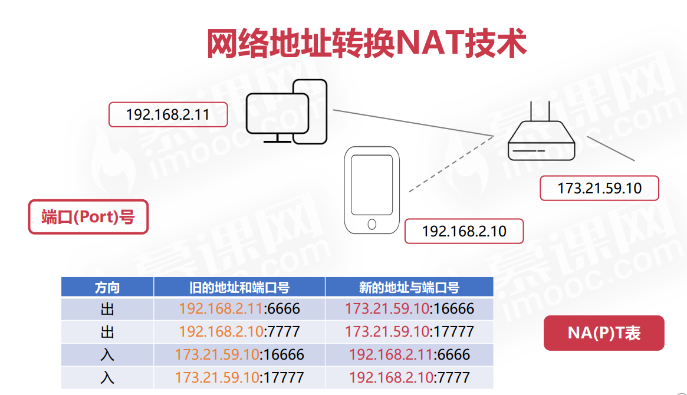

# 第零章 感性认识网络

网络把主机连在一起,而互联网(internet)把各种网络连在一起,是全球范围的网络

普通用户想加入互联网需要找到互联网服务提供商比如电信,电信拥有许多IP地址,通信线路,路由器等联网设备,缴纳一定费用即可接入互联网

网络用于通信: 为了实现才有了各种各样的实现, 分层实现

1. 应用层: 应用间通信, 将一个包裹交给传输层快递小哥,本层实现是基于传输层的,用传输层的服务来实现自身功能,工作于用户态,其他层都是和心态
2. 运输层:  进程间通信,并且有具体通信步骤比如TCP滑动窗口等等
3. 网络层:  主机间通信, 为了支持进程间通信,需要先找到进程所在的主机
4. 数据链路层:  链路间通信, 为了支持主机间通信, 主机与主机之间可能不在一个网络


**做为Java程序员**要考虑Java程序间的通信: socket编程是属于应用层的,是TCP/IP的封装,可以像读写文件一样读写网络数据,socket是实现http的基础,因为http中客户端通过socket向服务端发送请求,服务器通过socket向客户端发送数据

netty是基于Java NIO的  java NIO是基于socket的, 上层是对底层的更进一步抽象,更加方便, NIO中的 selector, buffer, channel都是基于socket的, netty在NIO的基础上更加方便,提高开发效率,与程序性能

> Netty是一个基于NIO的客户端/服务器框架，它可以快速开发可维护的高性能协议服务器和客户端。Netty的核心是异步事件驱动的网络应用程序框架，它可以轻松地扩展和定制。Netty的底层是基于Java NIO的，它提供了一种高效的、可扩展的、非阻塞的网络编程模型。因此，Netty可以与Socket编程、HTTP协议等技术结合使用，实现高性能的网络通信。在使用Netty时，可以通过编写Handler来处理网络事件，例如接收数据、发送数据、连接建立、连接关闭等。Netty还提供了一些常用的编解码器，例如Protobuf、JSON等，可以方便地进行数据的序列化和反序列化。因此，使用Netty可以大大简化网络编程的复杂度，提高开发效率和程序性能

JavaNIO适用于TCP/IP

rest是基于http的网络通信协议, eureka,SpringMVC和 feign使用rest做为通信协议

netty为 ES,rocketMQ,dubbo提供底层通信框架

Java中的servlet容器通过socket编程(IP和端口号)获取http请求报文, 将报文封装成一个对象, 

SpringMVC 的dispatcherServlet是基于servlet的是一个标准servlet,因此可以处理http请求与响应, 是一个分发请求的功能, 将对应的URI分发到对应的controller

controller处理完请求后返回对象, 在前后端分离情况下一般添加ResponseBody使返回的是json对象, 不分离情况下可以直接返回静态页面等(modelandview)并没有深入看

某种意义上你可以使用spring MVC实现rpc

> 1. 性能问题：SpringMVC框架通常是基于HTTP协议的，因此在进行远程方法调用时，需要进行HTTP请求和响应，会带来一定的性能损失。但是，SpringMVC提供了一些优化技巧，例如使用HTTP长连接、使用二进制协议等，可以提高性能。
> 2. 通信协议问题：SpringMVC框架通常是基于HTTP协议的，因此在进行远程方法调用时，需要使用HTTP协议进行通信，这可能会带来一些通信协议上的问题，例如请求头、响应头等问题。但是，SpringMVC提供了一些解决方案，例如使用自定义的请求头、响应头等，可以解决这些问题。
> 3. 安全问题：SpringMVC框架通常是基于HTTP协议的，因此在进行远程方法调用时，需要考虑安全问题，例如防止CSRF攻击、XSS攻击等。但是，SpringMVC提供了一些安全机制，例如使用CSRF Token、使用过滤器等，可以解决这些问题。
> 4. 可扩展性问题：SpringMVC框架通常是基于HTTP协议的，因此在进行远程方法调用时，需要考虑可扩展性问题，例如如何支持多种协议、如何支持多种数据格式等。但是，SpringMVC提供了一些扩展机制，例如使用自定义的消息转换器、使用自定义的拦截器等，可以解决这些问题。
>
> 使用SpringMVC实现RPC框架需要考虑以上问题，需要根据具体的业务需求来选择合适的方案。
>
> 服务注册和发现中心是RPC框架的一个重要组成部分，它可以帮助开发者实现服务的自动化注册和发现，提高系统的可用性和扩展性


Netty和Muduo都是基于事件驱动的网络编程框架，它们都使用了异步非阻塞的I/O模型，可以处理大量的并发连接。Netty是一个Java的网络编程框架，它使用Java NIO作为底层通信框架，可以实现高性能的网络通信。Muduo是一个C++的网络编程框架，它使用Linux系统调用epoll作为底层通信框架，可以实现高性能的网络通信。两者都提供了一些常用的编解码器，例如Protobuf、JSON等，可以方便地进行数据的序列化和反序列化。因此，Netty和Muduo都是非常优秀的网络编程框架，可以帮助开发者快速构建高性能的网络应用程序。

JavaNIO没有实现异步

Java NIO实现了异步非阻塞的I/O模型，它使用了Selector作为底层通信框架，可以实现高性能的网络通信。Java NIO的异步非阻塞I/O模型与Netty和Muduo的异步非阻塞I/O模型类似，都是基于事件驱动的，可以处理大量的并发连接。Java NIO提供了一些常用的编解码器，例如ByteBuffer、Charset等，可以方便地进行数据的序列化和反序列化。因此，Java NIO也是一个非常优秀的网络编程框架，可以帮助开发者快速构建高性能的网络应用程序。

# 第一章 计算机网络概述


# 第二章 数据链路层

实际场景中，⽹络并不是⼀个整体，⽐如你家和我家就不属于⼀个⽹络，所以数据不仅可以在同⼀个⽹络中设备间 进⾏传输，也可以跨⽹络进⾏传输

⼀旦数据需要跨⽹络传输，就需要有⼀个设备同时在两个⽹络当中，这个设备⼀般是路由器，路由器可以通过路由 表计算出下⼀个要去的 IP 地址

那问题来了，路由器怎么知道这个 IP 地址是哪个设备的呢

于是，就需要有⼀个专⻔的层来标识⽹络中的设备，让数据在⼀个链路中传输，这就是**数据链路层（Data Link Layer），它主要为⽹络层提供链路级别传输的服务**

每⼀台设备的⽹卡都会有⼀个 **MAC 地址**，它就是⽤来唯⼀标识设备的。路由器计算出了下⼀个⽬的地 IP 地址，再 通过 **ARP 协议找到该⽬的地的 MAC 地址**，这样就知道这个 **IP 地址是哪个设备的**了

**管理相邻结点的数据通信**


## 差错检测

- 奇偶校验码
- 循环冗余校验码CRC 

r为g(x)最高阶

### 奇偶校验码就是CRC-1

### 


## MTU

- MTU 
- 路径MTU

帧也不是无限大的 MTU即为最大传输单元 一般为1500

路径MTU由路径中的最小MTU决定

## 以太网协议(Ethernet应用于数据链路层)

- 完成相邻设备的数据帧传输
- MAC地址

### 以太网协议应用


# 第三章 网络层

**传输层**可能⼤家刚接触的时候，会认为它负责将数据从⼀个设备传输到另⼀个设备，事实上它并不负责。 

实际场景中的⽹络环节是错综复杂的，中间有各种各样的线路和分叉路⼝，如果⼀个设备的数据要传输给另⼀个设 备，就需要在各种各样的路径和节点进⾏选择，⽽传输层的设计理念是简单、⾼效、专注，如果传输层还负责这⼀ 块功能就有点违背设计原则了。 

也就是说，我们不希望传输层协议处理太多的事情，只需要服务好应⽤即可，让其作为应⽤间数据传输的媒介，帮助实现应⽤到应⽤的通信，**⽽实际的传输功能就交给下⼀层，也就是⽹络层**（Internet Layer）

**决定数据在网络中的路径** 解决跨设备的数据传输

⽹络层最常使⽤的是 **IP 协议**（Internet Protocol），IP 协议会将传**输层的报⽂作为数据部分，再加上 IP 包头组装 成 IP 报⽂，如果 IP 报⽂⼤⼩超过 MTU（以太⽹中⼀般为 1500 字节）就会再次进⾏分⽚，得到⼀个即将发送到⽹ 络的 IP 报⽂**

⽹络层负责将数据从⼀个设备传输到另⼀个设备，世界上那么多设备，⼜该如何找到对⽅呢？因此，⽹络层需要有 区分设备的编号。

我们⼀般**⽤ IP 地址给设备进⾏编号**，对于 IPv4 协议， IP 地址共 32 位，分成了四段，每段是 8 位。只有⼀个单纯 的 IP 地址虽然做到了区分设备，但是寻址起来就特别麻烦，全世界那么多台设备，难道⼀个⼀个去匹配？这显然 不科学

因此，需要将 IP 地址分成两种意义： 

​	⼀个是⽹络号，负责标识该 IP 地址是属于哪个⼦⽹的； 

​	⼀个是主机号，负责标识同⼀⼦⽹下的不同主机

怎么分的呢？这需要配合⼦⽹掩码才能算出 IP 地址 的⽹络号和主机号。那么在寻址的过程中，先匹配到相同的⽹络号，才会去找对应的主机。 

除了**寻址能⼒**， IP 协议还有另⼀个重要的能⼒就是**路由**。实际场景中，两台设备并不是⽤⼀条⽹线连接起来的， ⽽是通过很多⽹关、路由器、交换机等众多⽹络设备连接起来的，那么就会形成很多条⽹络的路径，因此当数据包 到达⼀个⽹络节点，就需要通过算法决定下⼀步⾛哪条路径。 

所以，IP 协议的**寻址作⽤是告诉我们去往下⼀个⽬的地该朝哪个⽅向⾛，路由则是根据「下⼀个⽬的地」选择路 径。寻址更像在导航，路由更像在操作⽅向盘**


## 主要内容

## IP协议的作用

封装复杂的实际网络化为一个虚拟互联的网络供上层使用


## IP头部


**版本**：占4位，指的是IP协议的 版本，通信双方的版本必须一 致，当前主流版本是4，即IPv4， 也有IPv6

**首部位长度**：占4位，最大数值 为15，表示的是IP首部长度， 单位是“32位字”（4个字节）， 也即是IP首部最大长度为60字 节

**总长度**：占16位，最大数值为 65535，表示的是IP数据报总长 度（IP首部+IP数据）

标识 标志 片偏移

**TTL**：占8位，表明IP数据报文 在网络中的寿命，每经过一个 设备，TTL减1，当TTL=0时， 网络设备必须丢弃该报文

**协议**：占8位，表明IP数据所携 带的具体数据是什么协议的 （如：TCP、UDP等）


首部校验和：占16位，校验IP 首部是否有出错

## 路由表


## IP协议的转发流程


数据帧每一跳的MAC地址都在变化

IP数据报每一跳的IP地址始终不变

## ARP协议与RARP协议


由这个协议完成


### 路由器不知道MAC地址


## 划分子网


## 无分类编址CIDR


## NAT技术

- 网络地址转换NAT(Network Address Translation)

- NAT技术用于多个主机通过一个公有IP访问互联网的私有网络中

- NAT减缓了IP地址的消耗，但是增加了网络通信的复杂度




## ICMP

- 网际控制报文协议（Internet Control Message Protocol）
- ICMP协议可以报告错误信息或者异常情况
- 

### ICMP头部

两种报文 差错报告与询问


# 第四章 传输层

网络层只把分组发送到目的主机，但是真正通信的并不是主机而是主机中的进程。传输层提供了进程间的逻辑通信，传输层向高层用户屏蔽了下面网络层的核心细节，使应用程序看起来像是在两个传输层实体之间有一条端到端的逻辑通信信道。

## 概述

应⽤层的数据包会传给传输层，传输层（Transport Layer）是为应⽤层提供⽹络⽀持的

TCP 的全称叫传输层控制协议（Transmission Control Protocol），⼤部分应⽤使⽤的正是 TCP 传输层协议，⽐ 如 HTTP 应⽤层协议。TCP 相⽐ UDP 多了很多特性，⽐如**流量控制、超时重传、拥塞控制**等，这些都是为了保证 数据包能可靠地传输给对⽅

UDP 就相对很简单，简单到只负责发送数据包，不保证数据包是否能抵达对⽅，但它实时性相对更好，传输效率 也⾼。当然，UDP 也可以实现可靠传输，把 TCP 的特性在应⽤层上实现就可以，不过要实现⼀个商⽤的可靠 UDP 传输协议，也不是⼀件简单的事情


应⽤需要传输的数据可能会⾮常⼤，如果直接传输就不好控制，因此当传输层的数据包⼤⼩超过 MSS（TCP 最⼤ 报⽂段⻓度） ，就要将数据包分块，这样即使中途有⼀个分块丢失或损坏了，只需要᯿新这⼀个分块，⽽不⽤᯿新 发送整个数据包。在 TCP 协议中，我们把每个分块称为⼀个 **TCP 段（TCP Segment）**

当设备作为接收⽅时，传输层则要负责把数据包传给应⽤，但是⼀台设备上可能会有很多应⽤在接收或者传输数 据，因此需要**⽤⼀个编号将应⽤区分开来**，这个编号就是端⼝。 

⽐如 80 端⼝通常是 Web 服务器⽤的，22 端⼝通常是远程登录服务器⽤的。⽽对于浏览器（客户端）中的每个标 签栏都是⼀个独⽴的进程，操作系统会为这些进程分配临时的端⼝号。 

由于传输层的报⽂中会携带端⼝号，因此接收⽅可以识别出该报⽂是发送给哪个应⽤

## TCP报文字段

序列号：在建⽴连接时由计算机⽣成的随机数作为其初始值，通过 SYN 包传给接收端主机，每发送⼀次数据，就 「累加」⼀次该「数据字节数」的⼤⼩。⽤来解决**⽹络包乱序**问题。 

确认应答号：指下⼀次「期望」收到的数据的序列号，发送端收到这个确认应答以后可以认为在这个序号以前的数 据都已经被正常接收。⽤来解决**不丢包**的问题

## TCP连接

连接: **⽤于保证可靠性和流量控制维护的某些状态信息，这些信息的组合，包括Socket、序列号和窗⼝ ⼤⼩称为连接**


# 第五章 应用层

## 概述

最上层的，也是我们能直接接触到的就是应⽤层（Application Layer），我们电脑或⼿机使⽤的应⽤软件都是在应 ⽤层实现。那么，当两个不同设备的应⽤需要通信的时候，应⽤就把应⽤数据传给下⼀层，也就是传输层。 

所以，应⽤层只需要专注于为⽤户提供应⽤功能，不⽤去关⼼数据是如何传输的，就类似于，我们寄快递的时候， 只需要把包裹交给快递员，由他负责运输快递，我们不需要关⼼快速是如何被运输的。 

⽽且应⽤层是⼯作在操作系统中的⽤户态，传输层及以下则⼯作在内核态


## HTTP

HTTP 是⼀个在计算机世界⾥专⻔在「两点」之间「传输」⽂字、图⽚、⾳频、视频等「超⽂本」数据的「约定和 规范」

两点(C/S S/S B/S等都可)

### 常用状态码

1xx: 提示信息，表示目前是协议处理的中间状态，还需要后续的操作;
2xx: 成功，报文已经收到并被正确处理; 
3xx: 重定向，资源位置发生变动，需要客户端重新发送请求;
4xx: 客户端错误，请求报文有误，服务器无法处理;
5xx: 服务器错误，服务器在处理请求时内部发生了错误。

1xx 类状态码属于提示信息，是协议处理中的⼀种中间状态，实际⽤到的⽐较少。 

2xx 类状态码表示服务器成功处理了客户端的请求，也是我们最愿意看到的状态。 「200 OK」是最常⻅的成功状态码，表示⼀切正常。如果是⾮ HEAD 请求，服务器返回的响应头都会有 body 数据。 「204 No Content」也是常⻅的成功状态码，与 200 OK 基本相同，但响应头没有 body 数据。 「206 Partial Content」是应⽤于 HTTP 分块下载或断点续传，表示响应返回的 body 数据并不是资源的全部，⽽ 是其中的⼀部分，也是服务器处理成功的状态。

 3xx 类状态码表示客户端请求的资源发送了变动，需要客户端⽤新的 URL 重新发送请求获取资源，也就是重定 向。 「301 Moved Permanently」表示永久重定向，说明请求的资源已经不存在了，需改⽤新的 URL 再次访问。 「302 Found」表示临时重定向，说明请求的资源还在，但暂时需要⽤另⼀个 URL 来访问。 301 和 302 都会在响应头⾥使⽤字段 Location ，指明后续要跳转的 URL，浏览器会⾃动᯿定向新的 URL。 「304 Not Modified」不具有跳转的含义，表示资源未修改，重定向已存在的缓冲⽂件，也称缓存重定向，⽤于缓 存控制。 

4xx 类状态码表示客户端发送的报⽂有误，服务器⽆法处理，也就是错误码的含义。 「400 Bad Request」表示客户端请求的报⽂有错误，但只是个笼统的错误。 「403 Forbidden」表示服务器禁⽌访问资源，并不是客户端的请求出错。 「404 Not Found」表示请求的资源在服务器上不存在或未找到，所以⽆法提供给客户端。 

5xx 类状态码表示客户端请求报⽂正确，但是服务器处理时内部发⽣了错误，属于服务器端的错误码。 「500 Internal Server Error」与 400 类型，是个笼统通⽤的错误码，服务器发⽣了什么错误，我们并不知道。 「501 Not Implemented」表示客户端请求的功能还不⽀持，类似“即将开业，敬请期待”的意思。 「502 Bad Gateway」通常是服务器作为⽹关或代理时返回的错误码，表示服务器⾃身⼯作正常，访问后端服务器 发⽣了错误。 「503 Service Unavailable」表示服务器当前很忙，暂时⽆法响应服务器，类似“⽹络服务正忙，请稍后重试”的意 思

## 常见字段

Host 字段 客户端发送请求时，⽤来指定服务器的域名

> Host: www.A.com

服务器在返回数据时，会有 Content-Length 字段，表明本次回应的数据⻓度(字节)

> Content-Length: 1000

HTTP/1.1 版本的默认连接都是持久连接，但为了兼容⽼版本的 HTTP，需要指定 Connection ⾸部字段的值为 Keep-Alive 。 ⼀个可以复⽤的 TCP 连接就建⽴了，直到客户端或服务器主动关闭连接。但是，这不是标准字段

> Connection: keep-alive

Content-Type 字段⽤于服务器回应时，告诉客户端，本次数据是什么格式

> Content-Type: text/html; charset=utf-8

客户端请求的时候，可以使⽤ Accept 字段声明⾃⼰可以接受哪些数据格式。

> Accept: */*

Content-Encoding 字段说明数据的压缩⽅法。表示服务器返回的数据使⽤了什么压缩格式

> Content-Encoding: gzip

上⾯表示服务器返回的数据采⽤了 gzip ⽅式压缩，告知客户端需要⽤此⽅式解压。 客户端在请求时，⽤ Accept-Encoding 字段说明⾃⼰可以接受哪些压缩⽅法

> Accept-Encoding: gzip, deflate

HTTPS 也就是在 HTTP 与 TCP 层之间增加了 SSL/TLS 安全传输层，HTTP/3 甚⾄把 TCP 层换成了基于 UDP 的 QUIC。

\1. ⽆状态双刃剑 ⽆状态的好处，因为服务器不会去记忆 HTTP 的状态，所以不需要额外的资源来记录状态信息，这能减轻服务器的 负担，能够把更多的 CPU 和内存⽤来对外提供服务。 ⽆状态的坏处，既然服务器没有记忆能⼒，它在完成有关联性的操作时会⾮常麻烦。 例如登录->添加购物⻋->下单->结算->⽀付，这系列操作都要知道⽤户的身份才⾏。但服务器不知道这些请求是有 关联的，每次都要问⼀遍身份信息。 这样每操作⼀次，都要验证信息，这样的购物体验还能愉快吗？别问，问就是酸爽

用cookie解决

## http缓存机制

http研究之旅：expires

将 expires的值设置为了 new Date(Date.now()+60000)，有效期就是一分钟，即60秒
看看响应头部（response header）：


在 expires设置的 有效期内，http请求不会真的向服务器发起请求，而是直接从缓存里获取数据
expires 是通过 设置资源的有效期来控制http的缓存

浏览器缓存机制详解 


### 一、为什么需要缓存

在前端开发中，我们主要追求的是**性能**和**用户体验**。对于一个网站查看性能最简单的方式就是打开网站的速度。而一个好的缓存策略可以大大提升网站的性能。使得已经下载后的资源被重复利用。减少客户端和服务器之间的请求次数，减少带宽，减少网络负荷。

### 二、什么是缓存

对于web缓存，主要是针对一些web资源（html、 js、图片、数据等），就是介于web服务器和浏览器之间的文件数据副本。当我们第一次打开某一个网页时，浏览器向服务器发起请求，请求所需要的资源。如果我们使用了web缓存，当我们下一次再次访问该网站页面的时候，我们可以根据一些缓存策略，来决定是否直接使用缓存中的一些资源，还是再次向服务端发起请求，从而避免再次向服务器发起请求，减少客户端和服务器之间通信的时延。

### 三、缓存的作用

1. 减少网络带宽的消耗
2. 降低服务器压力
3. 减少网络延时，加快页面打开速度。

### 四、浏览器的缓存机制

对于浏览器端的缓存来说，规则是在http协议头和html的mate标签中定义的，他们分别从过期机制和校验值来判断是否直接使用该缓存，还是需要从服务器去获取更新的版本。

1.新鲜度(过期机制)：也就是缓存副本的有效期。一个缓存副本必须满足以下条件之一，浏览器才会认为它是有效的，足够新的，才会直接使用缓存。

- - http协议头中存在过期时间等信息，并且仍在有效期内。
  - 浏览器已经使用过这个缓存副本，并且在一个会话中已经检查过新鲜度。

2.校验值(验证机制)：服务器相应中，在响应头中存在Etag标签，用来验证资源是否更改的标识，如果缓存的标识和服务器的标识相同则无需重新请求资源，如果不相同，则重新发送资源请求。

### 五、浏览器缓存控制

#### 1.html中的mate标签设置缓存

```
设置过期时间
＜meta http-equiv="expires" content="Wed, 20 Jun 2007 22:33:00 GMT"＞ 
设置缓存
＜meta http-equiv="Pragma" content="no-cache"＞  
```

#### 2.与缓存有关的字段

Cache-control:max-age(单位为s),当某一个资源的响应头设置max-age=3600， 则表示在1h时间内，服务器的资源发生变化，浏览器都不会想服务器发送该资源的请求，直接使用缓存。并且max-age会覆盖Expires。 如下图所示


Cache-control:s-maxage,s-maxage表示CDN缓存，也就是代理缓存，如果设置s-maxage=60,表示60秒内无论cdn服务器的该资源发生怎么样的改变，都不会重新请求，并且s-maxage会覆盖max-age和Expires.

Cache-control:public，指定是否是共享缓存，如果设置Cache-control的值设置为public，则表示多个浏览器之间可以共同使用该资源缓存。如果没有指定Cache-control是为private还是public，则默认是public.

****

Cache-control:private，表示该缓存是私有的，不存在用户共享。


Cache-control:no-cache；Cache-control的值设置为no-cache并不代表不缓存，浏览器是缓存的，但是当每一次访问该资源的时候，都要向服务器请求查看资源是否改变，如果改变，则直接重新下载，如果没有改变，则使用缓存。可以在设置完no-cache之后，在设置private，以及设置过期时间为过去的时间。

Cache-control:no-store,表示严格不缓存，每一次资源必须从服务器上重新获取。

Expires:缓存过期时间，Expires=max-age + 最后一次请求的时间。Cache-control和Expires相比，Cache-control的优先级更高。Expires需要和Last-modifyed来一起使用。


Last-Modified和if-modified-since:last-modified是响应头上的属性，if-modifyed-since是请求头的数据。该属性值需要cache-control配合使用。当再次向服务器发送请求该资源时，会携带if-modified-since的请求头字段，到服务器比对和last-modified是否相同。如果相同则直接返回304,直接使用缓存，如果不相同，则再次请求新的数据，返回200。

 

ETag和if-None-Match:这俩个属性其实和last-modified和if-modified-since类似。不过Etag是服务器更加内容产生的hash字符串，并且Etag是响应头内容。if-None-match是请求头的内容。当再次向服务器发送请求某一个资源时，请求头会携带if-None-match属性，到达服务器后，和Etag进行比对。如果相同，则返回304，如果不相同则返回该资源，并且状态码为200。

### 六、缓存报文头种类和优先级

#### 1.Cache-control和Expires比较

Cache-control的优先级比Expires的优先级高。

#### 2.Last-Modified和ETag比较

Etag的优先级要高于Last-modified，当在请求头中会先进行ETag比较，然后再进行Last-modified比较，如果两者都相等，则直接返回304,直接使用缓存资源。两者比较一下，你可能会觉得两者的功能差不多，但是为什么要在http1.1中新增Etag呢？

1. Last-modified精确到秒，如果在一秒钟内修改多次文件，则无法准确拿到最新的文件。
2. 如果缓存文件，打开后但是不修改内容，导致Last-modified发生变化，下一次就没有办法使用缓存文件了。
3. 可能存在服务器没有获取准确的修改时间，或者代理服务器时间不一致的情况。

#### 3.Last-Modified/Etag和Cache-control/Expires比较

Cache-control/Expries的优先级要比Last-Modified/Etag的优先级高，当第二次发送请求时，会首先查看Cache-control/Expries是否过期，如果没有过期，则任然使用该资源，如果过期了，则再次向服务器发送请求来请求最新的资源。到达服务器时通过比对Last-modified/Etag是否和原来的值相等，来判断资源是否改变，如果没有改变，则返回304。如果改变了，则返回最新的资源，并且状态码为200。

### 七、有哪些请求不能进行缓存的

无法被浏览器缓存的请求

1. http信息头部cache-control:no-cache , pragma: nocache或者使用cache-control:max-age=0。
2. 根据cookie，认证信息决定输入内容的信息是否可以被缓存的。
3. 经过https加密的请求。
4. post请求无法被缓存。
5. 在http响应头中不存在last-modified/Etag和cache-control/expires等。

### 八、使用缓存流程


 上面的过程可以分为三个阶段：

1. 本地缓存阶段：如果本地存在缓存，并且通过检查本地资资源的缓存并没有过期，则直接使用本地缓存。
2. 协商缓存阶段：如果在本地存在该资源，但是本地资源已经过期，此时就需要封装http请求，向服务端发送请求，检查是否存在更改资源。如果资源没有更改，则直接返回304，直接在本地使用资源。
3. 缓存失败阶段：如果资源发生了更改，则重新返回最新的资源，并且返回状态码为200。如果此时不存在该资源，则直接返回404。

### 九、用户行为与缓存的关系

用户在浏览器采用一些操作，例如，返回上一阶段，下一阶段，刷新页面，强制刷新等操作，这些对于一些缓存属性的影响是不一样的。下面将进行详细解读。

1. 刷新（仅仅是F5刷新）：此时对于cache-control/Expires是不生效的，但是last-modified/Etag都生效的，所以此时会向服务器发起请求，用来判断目标文件是否发生变化。
2. 强制刷新(F5刷新+ctrl)：此时对于cache-control/expires和last-modified/Etag都不生效，此时必须从服务器拿到新数据。
3. 回车或者转向：此时所有的缓存都生效。

### 十、从缓存角度改善站点　　

1. 同一个资源保证只有一个稳定的url地址。
2. css,js,图片资源增加http缓存头，入口html文件不被缓存。
3. 减少对cookie的依赖。
4. 减少对http协议加密的使用。

# HTTPS

TLS 握手过程，主要目的是为了协商`对称加密`的密钥，因为在最终的通信链路上使用对称加解密会更快。

我们知道，生成最终通信的对称密钥需要三个随机数：

- 客户端随机数
- 服务端随机数
- pre-master

前两个是公开的，那么最重要的就是 `pre-master`，在协商过程中如何保证它不会被窃取。为了保证协商安全性、对端可靠性，那么采用非对称加密的方式会更加合适，因为私钥只有服务端持有。

在 TLS 中采用的非对称加密方式主要有如下两种：

- RSA
- ECDHE

而这两种方式的区别，就在于 `pre-master` 的生成方式不同。


作者：微微笑的蜗牛
链接：https://www.jianshu.com/p/11d6eb418780
来源：简书
著作权归作者所有。商业转载请联系作者获得授权，非商业转载请注明出处。

前向保密:pfs保护过去的会话以免在未来秘钥或密码的（泄露）造成的危害。因为对手或恶意方会活跃地干扰，导致长期秘钥（long-term secret keys）或者密码在未来可能被泄露，但是如果使用了pfs，即使秘钥被泄露，过去的加密的通信和会话记录也不会被恢复和解密。

TLS握手:RSA实现对称秘钥交换防止泄露


三次握手后 

1. C: client hello (发送随机数C,TLS版本号,密码套件列表)

2. S: ACK

3. S: server hello (发送随机数S,确认TLS版本号,使用的密码套件(RSA))
4. S: 服务器使用的证书
5. S: 服务器Hello完成
6. C: ACK (校验证书取得公钥)


​	

之前是TCP三次握手

## TLS 第⼀次握⼿ 

客户端⾸先会发⼀个「Client Hello」消息，字⾯意思我们也能理解到，这是跟服务器「打招呼」。

消息⾥⾯有客户端使⽤的 TLS 版本号、⽀持的密码套件列表，以及⽣成的随机数（Client Random），这个随机 数会被服务端保留，它是⽣成对称加密密钥的材料之⼀。 

## TLS 第⼆次握⼿ 

当服务端收到客户端的「Client Hello」消息后，会确认 TLS 版本号是否⽀持，和从密码套件列表中选择⼀个密码 套件，以及⽣成随机数（Server Random）。

接着，返回「Server Hello」消息，消息⾥⾯有服务器确认的 TLS 版本号，也给出了随机数（Server Random）， 然后从客户端的密码套件列表选择了⼀个合适的密码套件。 可以看到，服务端选择的密码套件是 “Cipher Suite: TLS_RSA_WITH_AES_128_GCM_SHA256”。

 这个密码套件看起来真让⼈头晕，好⼀⼤串，但是其实它是有固定格式和规范的。基本的形式是「密钥交换算法 + 签名算法 + 对称加密算法 + 摘要算法」， ⼀般 WITH 单词前⾯有两个单词，第⼀个单词是约定密钥交换的算法， 第⼆个单词是约定证书的验证算法。⽐如刚才的密码套件的意思就是： 由于 WITH 单词只有⼀个 RSA，则说明握⼿时密钥交换算法和签名算法都是使⽤ RSA； 握⼿后的通信使⽤ AES 对称算法，密钥⻓度 128 位，分组模式是 GCM； 摘要算法 SHA384 ⽤于消息认证和产⽣随机数； 

就前⾯这两个客户端和服务端相互「打招呼」的过程，客户端和服务端就已确认了 TLS 版本和使⽤的密码套件， ⽽且你可能发现客户端和服务端都会各⾃⽣成⼀个随机数，并且还会把随机数传递给对⽅。 那这个随机数有啥⽤呢？其实这两个随机数是后续作为⽣成「会话密钥」的条件，所谓的会话密钥就是数据传输 时，所使⽤的对称加密密钥。 

然后，服务端为了证明⾃⼰的身份，会发送「Server Certificate」给客户端，这个消息⾥含有数字证书。 随后，服务端发了「Server Hello Done」消息，⽬的是告诉客户端，我已经把该给你的东⻄都给你了，本次打招 呼完毕。

**客户端进行证书验证**

## TLS 第三次握⼿ 

客户端验证完证书后，认为可信则继续往下⾛。接着，客户端就会⽣成⼀个新的随机数 (pre-master)，⽤服务器 的 RSA 公钥加密该随机数，通过「Change Cipher Key Exchange」消息传给服务端。 

服务端收到后，⽤ RSA 私钥解密，得到客户端发来的随机数 (pre-master)。 ⾄此，客户端和服务端双⽅都共享了三个随机数，分别是 Client Random、Server Random、pre-master。 于是，双⽅根据已经得到的三个随机数，⽣成会话密钥（Master Secret），它是对称密钥，⽤于对后续的 HTTP 请求/响应的数据加解密。 

⽣成完会话密钥后，然后客户端发⼀个「Change Cipher Spec」，告诉服务端开始使⽤加密⽅式发送消息。 

然后，客户端再发⼀个「Encrypted Handshake Message（Finishd）」消息，把之前所有发送的数据做个摘 要，再⽤会话密钥（master secret）加密⼀下，让服务器做个验证，验证加密通信是否可⽤和之前握⼿信息是否有 被中途篡改过。 

可以发现，「Change Cipher Spec」之前传输的 TLS 握⼿数据都是明⽂，之后都是对称密钥加密的密⽂。

## TLS 第四次握⼿ 

服务器也是同样的操作，发「Change Cipher Spec」和「Encrypted Handshake Message」消息，如果双⽅都 验证加密和解密没问题，那么握⼿正式完成。 最后，就⽤「会话密钥」加解密 HTTP 请求和响应了。

## TCP和UDP可以监听同一个端口吗


TCP


UDP


表述上应该是可以绑定同一个端口吗

**答案是 可以**

协议的不同也能是不同应用


## **多个 TCP 服务进程可以绑定同一个端口吗？**

默认情况下，针对「多个 TCP 服务进程可以绑定同一个端口吗？」这个问题的答案是：**如果两个 TCP 服务进程同时绑定的 IP 地址和端口都相同，那么执行 bind() 时候就会出错，错误是“Address already in use”**。

注意，如果 TCP 服务进程 A 绑定的地址是  0.0.0.0 和端口 8888，而如果 TCP 服务进程 B 绑定的地址是 192.168.1.100 地址（或者其他地址）和端口 8888，那么执行 bind() 时候也会出错。

这是因为 0.0.0.0  地址比较特殊，代表任意地址，意味着绑定了 0.0.0.0  地址，相当于把主机上的所有 IP 地址都绑定了。

## 重启 TCP 服务进程时，为什么会有“Address in use”的报错信息？

TCP 服务进程需要绑定一个 IP 地址和一个端口，然后就监听在这个地址和端口上，等待客户端连接的到来。

然后在实践中，我们可能会经常碰到一个问题，当 TCP 服务进程重启之后，总是碰到“Address in use”的报错信息，TCP 服务进程不能很快地重启，而是要过一会才能重启成功。

这是为什么呢？

当我们重启 TCP 服务进程的时候，意味着通过服务器端发起了关闭连接操作，于是就会经过四次挥手，而对于主动关闭方，会在 TIME_WAIT 这个状态里停留一段时间，这个时间大约为 2MSL。


**当 TCP 服务进程重启时，服务端会出现 TIME_WAIT 状态的连接，TIME_WAIT 状态的连接使用的 IP+PORT 仍然被认为是一个有效的 IP+PORT 组合，相同机器上不能够在该 IP+PORT 组合上进行绑定，那么执行 bind() 函数的时候，就会返回了 Address already in use 的错误**。

而等 TIME_WAIT 状态的连接结束后，重启 TCP 服务进程就能成功。

> 重启 TCP 服务进程时，如何避免“Address in use”的报错信息？

我们可以在调用 bind 前，对 socket 设置 SO_REUSEADDR 属性，可以解决这个问题。


```
int on = 1;
setsockopt(listenfd, SOL_SOCKET, SO_REUSEADDR, &on, sizeof(on));
```

因为 SO_REUSEADDR 作用是**：如果当前启动进程绑定的 IP+PORT 与处于TIME_WAIT 状态的连接占用的 IP+PORT 存在冲突，但是新启动的进程使用了 SO_REUSEADDR 选项，那么该进程就可以绑定成功。**

举个例子，服务端有个监听 0.0.0.0 地址和 8888 端口的 TCP 服务进程。‍


有个客户端（IP地址：192.168.1.100）已经和服务端（IP 地址：172.19.11.200）建立了 TCP 连接，那么在 TCP 服务进程重启时，服务端会与客户端经历四次挥手，服务端的 TCP 连接会短暂处于 TIME_WAIT 状态：

```
客户端地址:端口           服务端地址:端口        TCP 连接状态
192.168.1.100:37272     172.19.11.200:8888    TIME_WAIT
```

如果 TCP 服务进程没有对 socket 设置 SO_REUSEADDR 属性，那么在重启时，由于存在一个和绑定 IP+PORT 一样的 TIME_WAIT 状态的连接，那么在执行 bind() 函数的时候，就会返回了 Address already in use 的错误。

如果 TCP 服务进程对 socket 设置 SO_REUSEADDR 属性了，那么在重启时，即使存在一个和绑定 IP+PORT 一样的 TIME_WAIT 状态的连接，依然可以正常绑定成功，因此可以正常重启成功。

因此，在所有 TCP 服务器程序中，调用 bind 之前最好对 socket 设置 SO_REUSEADDR 属性，这不会产生危害，相反，它会帮助我们在很快时间内重启服务端程序。‍

**前面我提到过这个问题：**如果 TCP 服务进程 A 绑定的地址是  0.0.0.0 和端口 8888，而如果 TCP 服务进程 B 绑定的地址是 192.168.1.100 地址（或者其他地址）和端口 8888，那么执行 bind() 时候也会出错。

这个问题也可以由 SO_REUSEADDR 解决，因为它的**另外一个作用是：****绑定的 IP地址 + 端口时，只要 IP 地址不是正好(exactly)相同，那么允许绑定。**

比如，0.0.0.0:8888 和192.168.1.100:8888，虽然逻辑意义上前者包含了后者，但是 0.0.0.0 泛指所有本地 IP，而 192.168.1.100 特指某一IP，两者并不是完全相同，所以在对 socket 设置 SO_REUSEADDR 属性后，那么执行 bind() 时候就会绑定成功。

## **客户端的端口可以重复使用吗？**

客户端在执行 connect 函数的时候，会在内核里随机选择一个端口，然后向服务端发起 SYN 报文，然后与服务端进行三次握手。


所以，客户端的端口选择的发生在 connect 函数，内核在选择端口的时候，会从 `net.ipv4.ip_local_port_range` 这个内核参数指定的范围来选取一个端口作为客户端端口。

该参数的默认值是 32768 61000，意味着端口总可用的数量是 61000 - 32768 = 28232 个。

当客户端与服务端完成 TCP 连接建立后，我们可以通过 netstat 命令查看 TCP 连接。

```
$ netstat -napt
协议  源ip地址:端口            目的ip地址：端口         状态
tcp  192.168.110.182.64992   117.147.199.51.443     ESTABLISHED
```

> 那问题来了，上面客户端已经用了 64992 端口，那么还可以继续使用该端口发起连接吗？

这个问题，很多同学都会说不可以继续使用该端口了，如果按这个理解的话， 默认情况下客户端可以选择的端口是 28232 个，那么意味着客户端只能最多建立  28232 个 TCP 连接，如果真是这样的话，那么这个客户端并发连接也太少了吧，所以这是错误理解。

正确的理解是，**TCP 连接是由四元组（源IP地址，源端口，目的IP地址，目的端口）唯一确认的，那么只要四元组中其中一个元素发生了变化，那么就表示不同的 TCP 连接的。所以如果客户端已使用端口 64992 与服务端 A 建立了连接，那么客户端要与服务端 B 建立连接，还是可以使用端口 64992 的，因为内核是通过四元祖信息来定位一个 TCP 连接的，并不会因为客户端的端口号相同，而导致连接冲突的问题。**

比如下面这张图，有 2 个 TCP 连接，左边是客户端，右边是服务端，客户端使用了相同的端口 50004 与两个服务端建立了 TCP 连接。


仔细看，上面这两条 TCP 连接的四元组信息中的「目的 IP 地址」是不同的，一个是 180.101.49.12 ，另外一个是 180.101.49.11。

> 多个客户端可以 bind 同一个端口吗？

bind 函数虽然常用于服务端网络编程中，但是它也是用于客户端的。

前面我们知道，客户端是在调用 connect 函数的时候，由内核随机选取一个端口作为连接的端口。

而如果我们想自己指定连接的端口，就可以用 bind 函数来实现：客户端先通过 bind 函数绑定一个端口，然后调用 connect 函数就会跳过端口选择的过程了，转而使用 bind 时确定的端口。

针对这个问题：多个客户端可以 bind 同一个端口吗？

要看多个客户端绑定的 IP + PORT 是否都相同，如果都是相同的，那么在执行 bind() 时候就会出错，错误是“Address already in use”。

如果一个绑定在 192.168.1.100:6666，一个绑定在 192.168.1.200:6666，因为 IP 不相同，所以执行 bind() 的时候，能正常绑定。

所以， 如果多个客户端同时绑定的 IP 地址和端口都是相同的，那么执行 bind() 时候就会出错，错误是“Address already in use”。

一般而言，客户端不建议使用 bind 函数，应该交由 connect 函数来选择端口会比较好，因为客户端的端口通常都没什么意义。

> 客户端 TCP 连接 TIME_WAIT 状态过多，会导致端口资源耗尽而无法建立新的连接吗？

针对这个问题要看，客户端是否都是与同一个服务器（目标地址和目标端口一样）建立连接。

如果客户端都是与同一个服务器（目标地址和目标端口一样）建立连接，那么如果客户端 TIME_WAIT 状态的连接过多，当端口资源被耗尽，就无法与这个服务器再建立连接了。

但是，**因为只要客户端连接的服务器不同，端口资源可以重复使用的**。

所以，如果客户端都是与不同的服务器建立连接，即使客户端端口资源只有几万个， 客户端发起百万级连接也是没问题的（当然这个过程还会受限于其他资源，比如文件描述符、内存、CPU 等）。

> 如何解决客户端 TCP 连接 TIME_WAIT 过多，导致无法与同一个服务器建立连接的问题？

前面我们提到，如果客户端都是与同一个服务器（目标地址和目标端口一样）建立连接，那么如果客户端 TIME_WAIT 状态的连接过多，当端口资源被耗尽，就无法与这个服务器再建立连接了。

针对这个问题，也是有解决办法的，那就是打开 `net.ipv4.tcp_tw_reuse` 这个内核参数。

**因为开启了这个内核参数后，客户端调用 connect  函数时，如果选择到的端口，已经被相同四元组的连接占用的时候，就会判断该连接是否处于  TIME_WAIT 状态，如果该连接处于 TIME_WAIT 状态并且 TIME_WAIT 状态持续的时间超过了 1 秒，那么就会重用这个连接，然后就可以正常使用该端口了。**

举个例子，假设客户端已经与服务器建立了一个 TCP 连接，并且这个状态处于  TIME_WAIT 状态：

```
客户端地址:端口           服务端地址:端口         TCP 连接状态
192.168.1.100:2222      172.19.11.21:8888     TIME_WAIT
```

然后客户端又与该服务器（172.19.11.21:8888）发起了连接，**在调用 connect 函数时，内核刚好选择了 2222 端口，接着发现已经被相同四元组的连接占用了：**

- 如果**没有开启** net.ipv4.tcp_tw_reuse  内核参数，那么内核就会选择下一个端口，然后继续判断，直到找到一个没有被相同四元组的连接使用的端口， 如果端口资源耗尽还是没找到，那么 connect 函数就会返回错误。
- 如果**开启**了 net.ipv4.tcp_tw_reuse  内核参数，就会判断该四元组的连接状态是否处于 TIME_WAIT 状态，**如果连接处于 TIME_WAIT 状态并且该状态持续的时间超过了 1 秒，那么就会重用该连接**，于是就可以使用 2222 端口了，这时 connect 就会返回成功。

再次提醒一次，开启了 net.ipv4.tcp_tw_reuse  内核参数，是客户端（连接发起方） 在调用 connect() 函数时才起作用，所以在服务端开启这个参数是没有效果的。

> 客户端端口选择的流程总结

至此，我们已经把客户端在执行 connect 函数时，内核选择端口的情况大致说了一遍，为了让大家更明白客户端端口的选择过程，我画了一流程图。


## **总结**

> TCP 和 UDP 可以同时绑定相同的端口吗？

可以的。

TCP 和 UDP 传输协议，在内核中是由两个完全独立的软件模块实现的。

当主机收到数据包后，可以在 IP 包头的「协议号」字段知道该数据包是 TCP/UDP，所以可以根据这个信息确定送给哪个模块（TCP/UDP）处理，送给 TCP/UDP 模块的报文根据「端口号」确定送给哪个应用程序处理。

因此， TCP/UDP 各自的端口号也相互独立，互不影响。

> 多个 TCP 服务进程可以同时绑定同一个端口吗？

如果两个 TCP 服务进程同时绑定的 IP 地址和端口都相同，那么执行 bind() 时候就会出错，错误是“Address already in use”。

如果两个 TCP 服务进程绑定的端口都相同，而 IP 地址不同，那么执行 bind() 不会出错。

> 如何解决服务端重启时，报错“Address already in use”的问题？

当我们重启 TCP 服务进程的时候，意味着通过服务器端发起了关闭连接操作，于是就会经过四次挥手，而对于主动关闭方，会在 TIME_WAIT 这个状态里停留一段时间，这个时间大约为 2MSL。

当 TCP 服务进程重启时，服务端会出现 TIME_WAIT 状态的连接，TIME_WAIT 状态的连接使用的 IP+PORT 仍然被认为是一个有效的 IP+PORT 组合，相同机器上不能够在该 IP+PORT 组合上进行绑定，那么执行 bind() 函数的时候，就会返回了 Address already in use 的错误。

要解决这个问题，我们可以对 socket 设置 SO_REUSEADDR 属性。

这样即使存在一个和绑定 IP+PORT 一样的 TIME_WAIT 状态的连接，依然可以正常绑定成功，因此可以正常重启成功。

> 客户端的端口可以重复使用吗？

在客户端执行 connect 函数的时候，只要客户端连接的服务器不是同一个，内核允许端口重复使用。

TCP 连接是由四元组（源IP地址，源端口，目的IP地址，目的端口）唯一确认的，那么只要四元组中其中一个元素发生了变化，那么就表示不同的 TCP 连接的。

所以，如果客户端已使用端口 64992 与服务端 A 建立了连接，那么客户端要与服务端 B 建立连接，还是可以使用端口 64992 的，因为内核是通过四元祖信息来定位一个 TCP 连接的，并不会因为客户端的端口号相同，而导致连接冲突的问题。

> 客户端 TCP 连接 TIME_WAIT 状态过多，会导致端口资源耗尽而无法建立新的连接吗？

要看客户端是否都是与同一个服务器（目标地址和目标端口一样）建立连接。

如果客户端都是与同一个服务器（目标地址和目标端口一样）建立连接，那么如果客户端 TIME_WAIT 状态的连接过多，当端口资源被耗尽，就无法与这个服务器再建立连接了。即使在这种状态下，还是可以与其他服务器建立连接的，只要客户端连接的服务器不是同一个，那么端口是重复使用的。

> 如何解决客户端 TCP 连接 TIME_WAIT 过多，导致无法与同一个服务器建立连接的问题？

打开 net.ipv4.tcp_tw_reuse  这个内核参数。

因为开启了这个内核参数后，客户端调用 connect  函数时，如果选择到的端口，已经被相同四元组的连接占用的时候，就会判断该连接是否处于  TIME_WAIT 状态。

如果该连接处于 TIME_WAIT 状态并且 TIME_WAIT 状态持续的时间超过了 1 秒，那么就会重用这个连接，然后就可以正常使用该端口了。


## RSA 握手

如果双方使用传统的 `RSA` 算法进行密钥交换，那么  `pre-master`  是由客户端生成的一个随机数，然后用`服务器公钥`加密后发给服务端，服务端用私钥解密得到 `pre-master`。

双方再根据  `client-random + server-random + pre-master`  三个参数计算出主密钥  `master-key`。

流程图如下：


RSA.png

但是这种方式会存在安全问题，它不具有`前向安全性`。那什么是前向安全性？也就是指历史数据的安全性，不会被破解。

假设一个黑客收集了很多历史数据，当他破解服务端私钥后，可以计算出  `pre-master`，从而根据历史数据中的  `client-random + server-random`  计算出密钥，然后就可解密所有之前的加密数据。并且，由于私钥是固定的，在后续新的会话中，仍然可以获取 pre-master，继续截获信息。所以 RSA 并不安全。

## ECDHE 握手

而现在主流的 TLS 握手算法，一般会选择安全性更强的  `ECDHE`  实现密钥交换，即椭圆曲线算法，相比 RSA 算法来说具有`前向安全性`。

因为在每次握手过程中，服务端和客户端都重新会生成 ECDHE 算法的参数，也就是一对公私钥，并且是`一次一密`。即使黑客截获了当前会话，那也只能监听该次通信内容。

流程图如下：


ECDHE.png

从图中我们可以看到，在服务端发送  `Server Certificate`  后，多了一步  `Server Key Exchange`  的过程。

- 服务端会生成一个公钥  `server-public-key`  发给客户端。
- 客户端在  `Client Key Change`  时也会生成一个公钥  `client-public-key`  发给服务端。
- 最终，`pre-master`  由服务端的  `server-public-key` + 客户端的  `client-public-key`，再根据  `ECDHE`  算法计算而来。

该算法可以保证两边计算出来的结果是一样的。

### ECDHE 原理

在了解什么是 `ECDHE` 之前，首先可先了解下 [DH 算法](https://links.jianshu.com/go?to=https%3A%2F%2Fmp.weixin.qq.com%2Fs%3F__biz%3DMzg4MjU2Mzc1MQ%3D%3D%26mid%3D2247484046%26idx%3D1%26sn%3D6f98766849bf5b4e2829edd0a80cc659%26chksm%3Dcf558d46f822045021cecf5642007505820ad74b4c4c1ce4f89b791f6b422f70421e27ca1d5b%26token%3D1561474741%26lang%3Dzh_CN%23rd) 的原理。

其实很简单，就是利用了模幂运算的特性。


```jsx
gᵃᵇ mod p = (gᵃ mod p)ᵇ mod p = (gᵇ mod p)ᵃ mod p
```

对照上面 ECDHE 握手过程图来说。

客户端在 `Client Key Change` 这一步的公私钥数据如下：


```rust
私钥：a
公钥：A = gᵃ mod p
```

服务端在 `Server Key Change` 这一步的公私钥数据如下：


```rust
私钥：b
公钥：B = gᵇ mod p
```

客户端根据服务端传来的公钥 B 和自己的私钥 a，计算出秘钥 k1：


```rust
k1 = Bᵃ mod p = (gᵇ mod p)ᵃ mod p = gᵃᵇ mod p
```

服务端根据客户端传来的公钥 A 和自己的私钥 b，计算出秘钥 k2：


```rust
k2 = Aᵇ mod p = (gᵃ mod p)ᵇ mod p = gᵃᵇ mod p
```

那么，由此计算出的 k1 和 k2 是相等的。

那 DHE 又是什么呢？DHE 算法与 DH 原理是相同的，只不过由于 DH 算法一方的公钥是固定的，不具有`前向安全性`。因此改进成了 DHE，`E` 代表 `ephemeral`，短暂的，即每次都生成公私钥。

ECDHE 则是在 DHE 的基础上，将整数域里的离散对数替换成了椭圆曲线的离散对数，使其更难以破解，更加安全。

> 注意：ECDHE 算法参数 public-key 是不需要加密的。因为即使黑客拿到了公钥参数，也很难计算出 pre-master。

## 两者区别

两种算法的区别主要在于：

- RSA 私钥是固定的，破解后可以得到所有的算法参数。
- ECDHE 是每次重新生成参数，一次一密，更加安全。

因此在 `TLS 1.3` 中，废除了  `RSA`  和  `DH`  算法，使用了更加安全的 `ECDHE`。


作者：微微笑的蜗牛
链接：https://www.jianshu.com/p/11d6eb418780
来源：简书
著作权归作者所有。商业转载请联系作者获得授权，非商业转载请注明出处。

