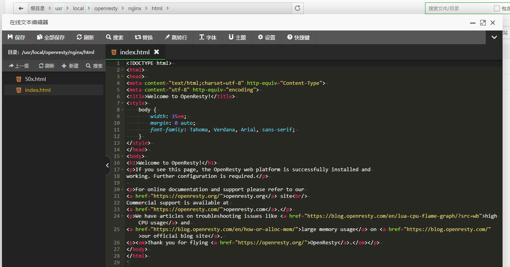

> 总结

# 高可用场景及解决方案

添加Nginx主备模式,用keepalived 来管理虚拟ip,主备Nginx对vip进行切换,


# 安装keepalived 进程间检测 

对两台nginx所在的服务器的keepalived进行配置 主备 虚拟ip 以及分组

最小配置

第一台

```xshell
global_defs {
	router_id lb110
}
vrrp_instance atguigu {
	#
    state MASTER
    #网卡
    interface ens33
    # 
    virtual_router_id 51
    priority 100
    advert_int 1
    authentication {
    auth_type PASS
    auth_pass 1111
    }
    virtual_ipaddress {
    192.168.44.200
    }
}

```


第二台

```xshell
global_defs {
	router_id lb110
}
vrrp_instance atguigu {
    state BACKUP
    interface ens33
    virtual_router_id 51
    priority 50
    advert_int 1
    authentication {
    auth_type PASS
    auth_pass 1111
    }
    virtual_ipaddress {
    192.168.44.200
    }
}

```


# 选举方式

主机down了 备用机获得vip 接收请求

# 集群化(上游服务的集群化)

nginx对集群实现负载均衡

负载均衡的方式以及实操


# 负载均衡

负载策略

会话维持

upstream

负载均衡流程


# 限流配置

针对同一IP 的qps限制

针对同一IP的线程数限制

漏桶算法


# 性能测试

jmetter

网页输入ip 默认访问80端口,openresty自动返回/usr/local/openresty/nginx/html下的index.html

# 基础使用



默认配置初步讲解

```shell
#user  root;
#工作进程 根据cpu核数 如果分配给一个核启动多个进程反而效率低
worker_processes  1;


#pid        logs/nginx.pid;


events {
    #一个工作进程对应多少连接
    worker_connections  1024;
}


http {
    #引入其他文件 mime里是其他请求头 文件类型
    include       mime.types;
    #mime不包含则 启动该默认类型 字节流
    default_type  application/octet-stream;


    #数据零拷贝
    sendfile        on;
    #tcp_nopush     on;

    #keepalive_timeout  0;
    # 反向代理细讲
    keepalive_timeout  65;

    #gzip  on;
    
    #一个 config可以配置多个主机,一个server就是一个主机
    #虚拟主机 vhost
    server {
        listen       80;
        server_name  localhost; # 域名/可解析的主机名 

        #charset koi8-r;

        #access_log  logs/host.access.log  main;
        
        # uri 描述资源 在域名之后的
        location / {
            root   html;
            index  index.html index.htm;
        }

        #error_page  404              /404.html;

        # redirect server error pages to the static page /50x.html
        #
        error_page   500 502 503 504  /50x.html;
        location = /50x.html {
            root   html;
        }

       
    }

  

}

```

1. 配置/usr/lib/systemd/system/nginx.service，通过systemctl启动：

我这里使用的是openresty

```shell
[Unit]
Description=openresty - high performance web server
After=network.target remote-fs.target nss-lookup.target

[Service]
Type=forking
ExecStart=/usr/local/openresty/bin/openresty -c /usr/local/openresty/nginx/conf/nginx.conf
ExecReload=/usr/local/openresty/bin/openresty -s reload
ExecStop=/usr/local/openresty/bin/openresty -s stop

[Install]
WantedBy=multi-user.target
```

2.使配置生效

```shell
systemctl daemon-reload
```


多vhost测试

```shell
server {
        listen       88;
        server_name  localhost; # 域名/可解析的主机名

        #charset koi8-r;

        #access_log  logs/host.access.log  main;
        
        # uri 描述资源 在域名之后的
        location / {
            root   /www/www;
            index  index.html index.htm;
        }

        #error_page  404              /404.html;

        # redirect server error pages to the static page /50x.html
        #
        error_page   500 502 503 504  /50x.html;
        location = /50x.html {
            root   html;
        }

       
    }
    server {
        listen       89;
        server_name  localhost; # 域名/可解析的主机名

        #charset koi8-r;

        #access_log  logs/host.access.log  main;
        
        # uri 描述资源 在域名之后的
        location / {
            root   /www/www2;
            index  index.html index.htm;
        }

        #error_page  404              /404.html;

        # redirect server error pages to the static page /50x.html
        #
        error_page   500 502 503 504  /50x.html;
        location = /50x.html {
            root   html;
        }

       
    }
```

# 5.2 nginx的限流

nginx提供两种限流的方式：

- 一是控制速率

- 二是控制并发连接数


#### 5.2.1 控制速率

控制速率的方式之一就是采用漏桶算法。


(1)漏桶算法实现控制速率限流

漏桶(Leaky Bucket)算法思路很简单,水(请求)先进入到漏桶里,漏桶以一定的速度出水(接口有响应速率),当水流入速度过大会直接溢出(访问频率超过接口响应速率),然后就拒绝请求,可以看出漏桶算法能强行限制数据的传输速率.示意图如下:


(2)nginx的配置

配置示意图如下：

> 超出则返回503  我当前无法响应你


binary_remote_addr 是一种key，表示基于 remote_addr(客户端IP) 来做限流，binary_ 的目的是压缩内存占用量。
zone：定义共享内存区来存储访问信息， contentRateLimit:10m 表示一个大小为10M，名字为contentRateLimit的内存区域。1M能存储16000 IP地址的访问信息，10M可以存储16W IP地址访问信息。
rate 用于设置最大访问速率，rate=10r/s 表示每秒最多处理10个请求。Nginx 实际上以毫秒为粒度来跟踪请求信息，因此 10r/s 实际上是限制：每100毫秒处理一个请求。这意味着，自上一个请求处理完后，若后续100毫秒内又有请求到达，将拒绝处理该请求.我们这里设置成2 方便测试。


修改/usr/local/openresty/nginx/conf/nginx.conf:

```nginx
user  root root;
worker_processes  1;

events {
    worker_connections  1024;
}

http {
    include       mime.types;
    default_type  application/octet-stream;

    #cache
    lua_shared_dict dis_cache 128m;

    #限流设置
    limit_req_zone $binary_remote_addr zone=contentRateLimit:10m rate=2r/s;

    sendfile        on;
    #tcp_nopush     on;

    #keepalive_timeout  0;
    keepalive_timeout  65;

    #gzip  on;

    server {
        listen       80;
        server_name  localhost;

        location /update_content {
            content_by_lua_file /root/lua/update_content.lua;
        }

        location /read_content {
            #使用限流配置
            limit_req zone=contentRateLimit;
            content_by_lua_file /root/lua/read_content.lua;
        }
    }
}
```


测试：

重新加载配置文件

```properties
cd /usr/local/openresty/nginx/sbin

./nginx -s reload
```

访问页面：`http://192.168.211.132/read_content?id=1` ,连续刷新会直接报错。


(3)处理突发流量

上面例子限制 2r/s，如果有时正常流量突然增大，超出的请求将被拒绝，无法处理突发流量，可以结合 **burst** 参数使用来解决该问题。

例如，如下配置表示：


上图代码如下：

```nginx
server {
    listen       80;
    server_name  localhost;
    location /update_content {
        content_by_lua_file /root/lua/update_content.lua;
    }
    location /read_content {
        limit_req zone=contentRateLimit burst=4;
        content_by_lua_file /root/lua/read_content.lua;
    }
}
```

burst 译为突发、爆发，表示在超过设定的处理速率后能额外处理的请求数,当 rate=10r/s 时，将1s拆成10份，即每100ms可处理1个请求。

此处，**burst=4 **，若同时有4个请求到达，Nginx 会处理第一个请求，剩余3个请求将放入队列，然后每隔500ms从队列中获取一个请求进行处理。若请求数大于4，将拒绝处理多余的请求，直接返回503.

不过，单独使用 burst 参数并不实用。假设 burst=50 ，rate依然为10r/s，排队中的50个请求虽然每100ms会处理一个，但第50个请求却需要等待 50 * 100ms即 5s，这么长的处理时间自然难以接受。

因此，burst 往往结合 nodelay 一起使用。

例如：如下配置：

```nginx
server {
    listen       80;
    server_name  localhost;
    location /update_content {
        content_by_lua_file /root/lua/update_content.lua;
    }
    location /read_content {
        limit_req zone=contentRateLimit burst=4 nodelay;
        content_by_lua_file /root/lua/read_content.lua;
    }
}
```

limit_req zone=one burst=5 nodelay;
第一个参数：zone=contentRateLimit 设置使用哪个配置区域来做限制，与上面limit_req_zone 里的name对应。

第二个参数：burst=5，重点说明一下这个配置，burst爆发的意思，这个配置的意思是设置一个大小为5的缓冲区当有大量请求(爆发)过来时，超过了访问频次限制的请求可以先放到这个缓冲区内。

第三个参数：nodelay，如果设置，超过访问频次而且缓冲区也满了的时候就会直接返回503，如果没有设置，则所有请求会等待排队。
实例二 burst缓存处理


我们看到，我们短时间内发送了大量请求，Nginx按照毫秒级精度统计，超出限制的请求直接拒绝。这在实际场景中未免过于苛刻，真实网络环境中请求到来不是匀速的，很可能有请求“突发”的情况，也就是“一股子一股子”的。Nginx考虑到了这种情况，可以通过burst关键字开启对突发请求的缓存处理，而不是直接拒绝。

来看我们的配置：

limit_req_zone $binary_remote_addr zone=mylimit:10m rate=2r/s;server {    location / {        limit_req zone=mylimit burst=4;    }}
我们加入了burst=4，意思是每个key(此处是每个IP)最多允许4个突发请求的到来。如果单个IP在10ms内发送6个请求，结果会怎样呢？


相比实例一成功数增加了4个，这个我们设置的burst数目是一致的。具体处理流程是：1个请求被立即处理，4个请求被放到burst队列里，另外一个请求被拒绝。通过burst参数，我们使得Nginx限流具备了缓存处理突发流量的能力。

但是请注意：burst的作用是让多余的请求可以先放到队列里，慢慢处理。如果不加nodelay参数，队列里的请求不会立即处理，而是按照rate设置的速度，以毫秒级精确的速度慢慢处理。

实例三 nodelay降低排队时间

实例二中我们看到，通过设置burst参数，我们可以允许Nginx缓存处理一定程度的突发，多余的请求可以先放到队列里，慢慢处理，这起到了平滑流量的作用。但是如果队列设置的比较大，请求排队的时间就会比较长，用户角度看来就是RT变长了，这对用户很不友好。

有什么解决办法呢？nodelay参数允许请求在排队的时候就立即被处理，也就是说只要请求能够进入burst队列，就会立即被后台worker处理，请注意，这意味着burst设置了nodelay时，系统瞬间的QPS可能会超过rate设置的阈值。nodelay参数要跟burst一起使用才有作用。

延续实例二的配置，我们加入nodelay选项：


limit_req_zone $binary_remote_addr zone=mylimit:10m rate=2r/s;server {    location / {        limit_req zone=mylimit burst=4 nodelay;    }}
单个IP 10ms内并发发送6个请求，结果如下：


跟实例二相比，请求成功率没变化，但是总体耗时变短了。这怎么解释呢？实例二中，有4个请求被放到burst队列当中，工作进程每隔500ms(rate=2r/s)取一个请求进行处理，最后一个请求要排队2s才会被处理；实例三中，请求放入队列跟实例二是一样的，但不同的是，队列中的请求同时具有了被处理的资格，所以实例三中的5个请求可以说是同时开始被处理的，花费时间自然变短了。

但是请注意，虽然设置burst和nodelay能够降低突发请求的处理时间，但是长期来看并不会提高吞吐量的上限，长期吞吐量的上限是由rate决定的，因为nodelay只能保证burst的请求被立即处理，但Nginx会限制队列元素释放的速度，就像是限制了令牌桶中令牌产生的速度。

看到这里你可能会问，加入了nodelay参数之后的限速算法，到底算是哪一个“桶”，是漏桶算法还是令牌桶算法？当然还算是漏桶算法。考虑一种情况，令牌桶算法的token为耗尽时会怎么做呢？由于它有一个请求队列，所以会把接下来的请求缓存下来，缓存多少受限于队列大小。但此时缓存这些请求还有意义吗？如果server已经过载，缓存队列越来越长，RT越来越高，即使过了很久请求被处理了，对用户来说也没什么价值了。所以当token不够用时，最明智的做法就是直接拒绝用户的请求，这就成了漏桶算法

令牌桶算法:

#### 2.5.2 令牌桶算法

令牌桶算法是比较常见的限流算法之一，大概描述如下：
1）所有的请求在处理之前都需要拿到一个可用的令牌才会被处理；
2）根据限流大小，设置按照一定的速率往桶里添加令牌；
3）桶设置最大的放置令牌限制，当桶满时、新添加的令牌就被丢弃或者拒绝；
4）请求达到后首先要获取令牌桶中的令牌，拿着令牌才可以进行其他的业务逻辑，处理完业务逻辑之后，将令牌直接删除；
5）令牌桶有最低限额，当桶中的令牌达到最低限额的时候，请求处理完之后将不会删除令牌，以此保证足够的限流

如下图：


这个算法的实现，有很多技术，Guaua是其中之一，redis客户端也有其实现。

```yaml
  routes:
            - id: changgou_goods_route
              uri: lb://goods
              predicates:
              - Path=/api/brand**
              filters:
              - StripPrefix=1
              - name: RequestRateLimiter #请求数限流 名字不能随便写 ，使用默认的facatory
                args:
                  key-resolver: "#{@ipKeyResolver}"
                  redis-rate-limiter.replenishRate: 1
                  redis-rate-limiter.burstCapacity: 1
```


`redis-rate-limiter.replenishRate`是您希望允许用户每秒执行多少请求，而不会丢弃任何请求。这是令牌桶填充的速率

`redis-rate-limiter.burstCapacity`是指令牌桶的容量，允许在一秒钟内完成的最大请求数,将此值设置为零将阻止所有请求。

> 超过也许会返回429错误码 too many request


如上表示：

平均每秒允许不超过2个请求，突发不超过4个请求，并且处理突发4个请求的时候，没有延迟，等到完成之后，按照正常的速率处理。

如上两种配置结合就达到了速率稳定，但突然流量也能正常处理的效果。完整配置代码如下：

```nginx
user  root root;
worker_processes  1;

events {
    worker_connections  1024;
}

http {
    include       mime.types;
    default_type  application/octet-stream;

    #cache
    lua_shared_dict dis_cache 128m;

    #限流设置
    limit_req_zone $binary_remote_addr zone=contentRateLimit:10m rate=2r/s;

    sendfile        on;
    #tcp_nopush     on;

    #keepalive_timeout  0;
    keepalive_timeout  65;

    #gzip  on;

    server {
        listen       80;
        server_name  localhost;

        location /update_content {
            content_by_lua_file /root/lua/update_content.lua;
        }

        location /read_content {
            limit_req zone=contentRateLimit burst=4 nodelay;
            content_by_lua_file /root/lua/read_content.lua;
        }
    }
}
```


测试：如下图 在1秒钟之内可以刷新4次，正常处理。


但是超过之后，连续刷新5次，抛出异常。


#### 5.2.2 控制并发量（连接数）

ngx_http_limit_conn_module  提供了限制连接数的能力。主要是利用limit_conn_zone和limit_conn两个指令。

利用连接数限制 某一个用户的ip连接的数量来控制流量。

注意：并非所有连接都被计算在内 只有当服务器正在处理请求并且已经读取了整个请求头时，才会计算有效连接。此处忽略测试。

配置语法：

```
Syntax:	limit_conn zone number;
Default: —;
Context: http, server, location;
```


(1)配置限制固定连接数

如下，配置如下： 


limit_conn_zone $binary_remote_addr zone=addr:10m;  表示限制根据用户的IP地址来显示，设置存储地址为的内存大小10M

limit_conn addr 2;   表示 同一个地址只允许连接2次。

上图配置如下：

```nginx
http {
    include       mime.types;
    default_type  application/octet-stream;

    #cache
    lua_shared_dict dis_cache 128m;

    #限流设置
    limit_req_zone $binary_remote_addr zone=contentRateLimit:10m rate=2r/s;

    #根据IP地址来限制，存储内存大小10M
    limit_conn_zone $binary_remote_addr zone=addr:1m;

    sendfile        on;
    #tcp_nopush     on;

    #keepalive_timeout  0;
    keepalive_timeout  65;

    #gzip  on;

    server {
        listen       80;
        server_name  localhost;
        #所有以brand开始的请求，访问本地changgou-service-goods微服务
        location /brand {
            limit_conn addr 2;
            proxy_pass http://192.168.211.1:18081;
        }

        location /update_content {
            content_by_lua_file /root/lua/update_content.lua;
        }

        location /read_content {
            limit_req zone=contentRateLimit burst=4 nodelay;
            content_by_lua_file /root/lua/read_content.lua;
        }
    }
}
```

表示：

```
limit_conn_zone $binary_remote_addr zone=addr:10m;  表示限制根据用户的IP地址来显示，设置存储地址为的内存大小10M

limit_conn addr 2;   表示 同一个地址只允许连接2次。
```

测试：


此时开3个线程，测试的时候会发生异常，开2个就不会有异常


(2)限制每个客户端IP与服务器的连接数，同时限制与虚拟服务器的连接总数。(了解)

如下配置： 

```nginx
limit_conn_zone $binary_remote_addr zone=perip:10m;
limit_conn_zone $server_name zone=perserver:10m; 
server {  
    listen       80;
    server_name  localhost;
    charset utf-8;
    location / {
        limit_conn perip 10;#单个客户端ip与服务器的连接数．
        limit_conn perserver 100; ＃限制与服务器的总连接数
        root   html;
        index  index.html index.htm;
    }
}
```

## 总结


# 反向代理

流程:

proxy_pass http://

# 常用配置

server

location

root

alias

