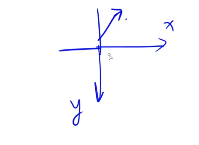
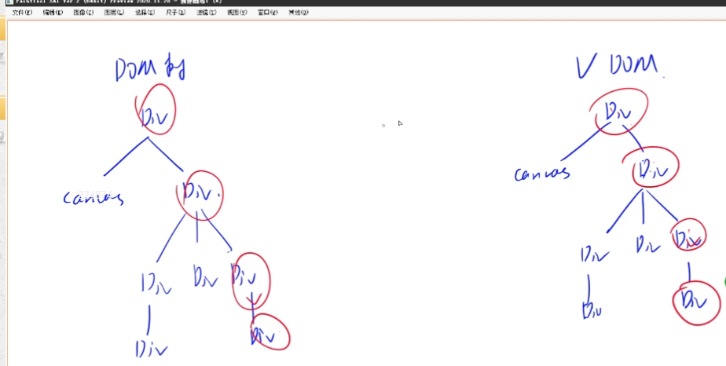

## 1标签

### 1.1基础标签

大部分本质是span 与div  只不过加了写样式

<span>span不带 </span><span>回车</span> 

<div>div带</div>  <div>回车</div>

<p>
        段
    1
    <!-- 中间的回车和开头的空格被忽略掉了-->
</p>
<p>
        段 &nbsp;&nbsp;&nbsp;&nbsp;&nbsp;2 <br> 回车

</p>

<pre>
    等宽字体
    带括号与回车
    cin
    cout
    <i>斜体</i>
</pre>


### 1.2图片


### 坐标



# React

数据驱动



node维护本地js库

```javascript
使用bind()函数绑定this取值
在JavaScript中，函数里的this指向的是执行时的调用者，而非定义时所在的对象。

例如：

const person = {
  name: "yxc",
  talk: function() {
    console.log(this);
  }
}

person.talk();

const talk = person.talk;
talk();
运行结果：

{name: 'yxc', talk: ƒ}
Window
bind()函数，可以绑定this的取值。例如：

const talk = person.talk.bind(person);
箭头函数的简写方式
const f = (x) => {
  return x * x;
};

可以简写为：

const f = x => x * x;
箭头函数不重新绑定this的取值
例如：

const person = {
  talk: function() {
    setTimeout(function() {
      console.log(this);
    }, 1000);
  }
};

person.talk();  // 输出Window
const person = {
  talk: function() {
    setTimeout(() => {
      console.log(this);
    }, 1000);
  }
};

person.talk();  // 输出 {talk: f}
对象的解构
例如：

const person = {
  name: "yxc",
  age: 18,
  height: 180,
};

const {name : nm, age} = person;  // nm是name的别名
数组和对象的展开
例如：

let a = [1, 2, 3];
let b = [...a];  // b是a的复制
let c = [...a, 4, 5, 6];
const a = {name: "yxc"};
const b = {age: 18};
const c = {...a, ...b, height: 180};
Named 与 Default exports
Named Export：可以export多个，import的时候需要加大括号，名称需要匹配
Default Export：最多export一个，import的时候不需要加大括号，可以直接定义别名

作者：yxc
链接：
```

