```java
byte b = 1;
char c = 1;
short s = 1;
int i = 1;
```

 

```java
byte b = 1;
char c = 1;
short s = 1;
int i = 1;
// 三目，一边为byte另一边为char，结果为int
// 其它情况结果为两边中范围大的。适用包装类型
i = true? b : c;// int
b = true? b : b; // byte
s = true? b : s;// short
// 表达式，两边为byte,short,char，结果为int型
// 其它情况结果为两边中范围大的。适用包装类型
i = b + c; // int
i = b + b; // int
i = b + s; // int
// 当 a 为基本数据类型时，a += b，相当于 a = (a) (a + b)
// 当 a 为包装类型时， a += b 就是 a = a + b
b += s; // 没问题
c += i; // 没问题
// 常量任君搞，long以上不能越
b = (char) 1+ (short) 1+ (int) 1; // 没问题
// i = (long) 1 // 错误
```


# 第2章 Java 概述

1) JVM 是一个虚拟的计算机，具有指令集并使用不同的存储区域。负责执行指令，管理数据、内存、寄存器，包含在 JDK 中.

2) 对于不同的平台，有不同的虚拟机。
3)  Java 虚拟机机制屏蔽了底层运行平台的差别，实现了“一次编译，到处运行

5) JDK = JRE + 开发工具集（例如 Javac,java 编译工具等)
6) JRE = JVM + Java SE 标准类库（java 核心类库）
7) 如果只想运行开发好的 .class 文件，只需要JRE


# 第3章 变量

## 3.1数据类型与API

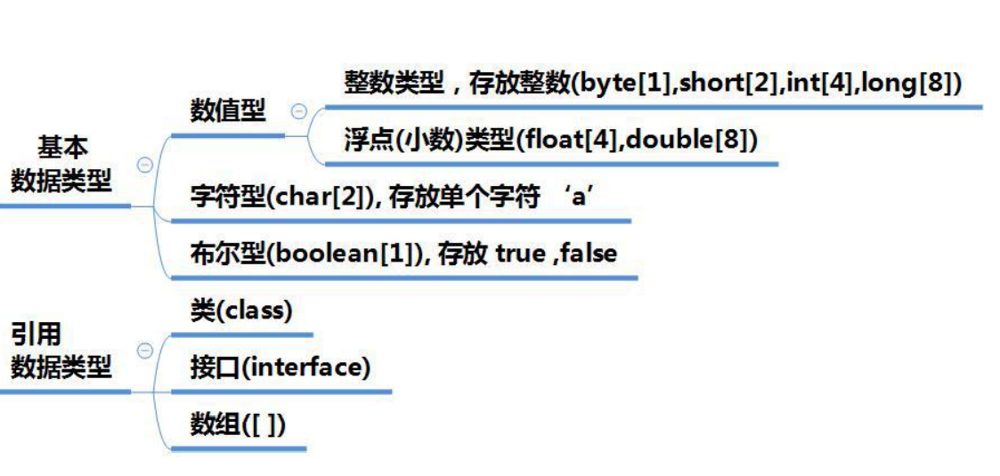


## 3.3 char+字符编码

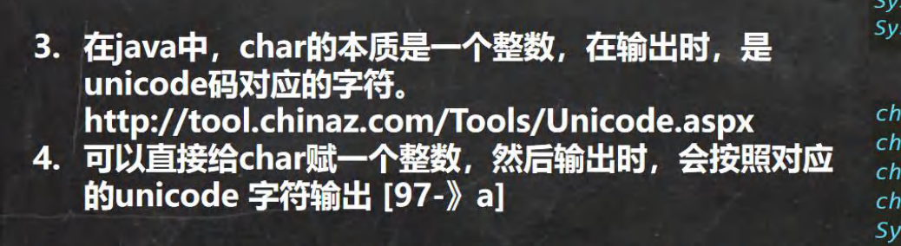

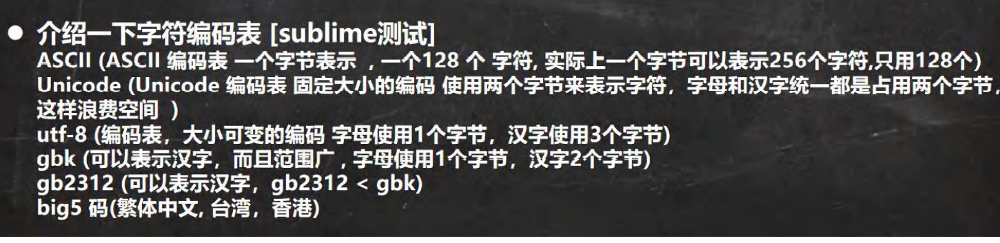

## 3.4Unicode

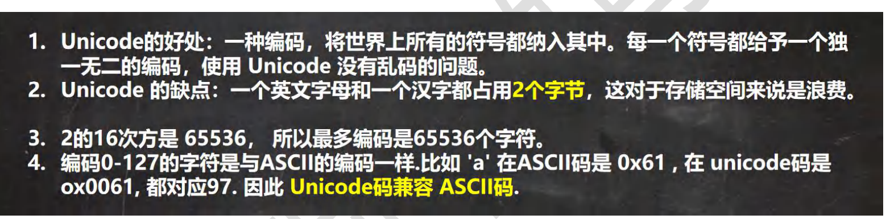

## 3.5UTF-8

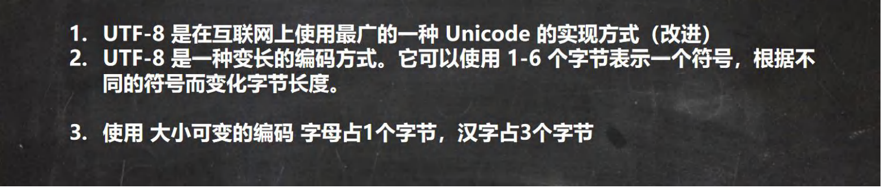

## 3.6基本数据类型转换

精度小的类型自动转化为精度大的

有多种类型混合运算，系统首先自动将所有数据转换成容量最大的那种数据类型再计算

当把容量大的赋值给容量小的就会报错，反之自动类型转换

byte short 和char 不会自动转换 ，在计算式首先转换为int类型

boolen不参与转换

```java
int n1 = 10; //ok
//float d1 = n1 + 1.1;//错误 n1 + 1.1 => 结果类型是 double
//double d1 = n1 + 1.1;//对 n1 + 1.1 => 结果类型是 double
float d1 = n1 + 1.1F;//对 n1 + 1.1 => 结果类型是 float
//细节 2: 当我们把精度(容量)大 的数据类型赋值给精度(容量)小 的数据类型时，
//就会报错，反之就会进行自动类型转换。
//
//int n2 = 1.1;//错误 double -> int
//细节 3: (byte, short) 和 char 之间不会相互自动转换
//当把具体数赋给 byte 时，(1)先判断该数是否在 byte 范围内，如果是就可以
byte b1 = 10; //对 , -128-127
// int n2 = 1; //n2 是 int
// byte b2 = n2; //错误，原因： 如果是变量赋值，判断类型
//
// char c1 = b1; //错误， 原因 byte 不能自动转成 char
//
//
韩顺平循序渐进学 Java 零基础
第 48页
//细节 4: byte，short，char 他们三者可以计算，在计算时首先转换为 int 类型
byte b2 = 1;
byte b3 = 2;
short s1 = 1;
//short s2 = b2 + s1;//错, b2 + s1 => int
int s2 = b2 + s1;//对, b2 + s1 => int
//byte b4 = b2 + b3; //错误: b2 + b3 => int
//
//boolean 不参与转换
boolean pass = true;
//int num100 = pass;// boolean 不参与类型的自动转换
//自动提升原则： 表达式结果的类型自动提升为 操作数中最大的类型
//看一道题
byte b4 = 1;
short s3 = 100;
int num200 = 1;
float num300 = 1.1F;
double num500 = b4 + s3 + num200 + num300; //float -> double
}
```


## 博客:类型转换


自动类型转换的逆过程，将容量大的数据类型转换为容量小的数据类型。使用时要加上强制转换符 ( )，但可能造成
精度降低或溢出,格外要注意


  所有的字符本质还是数字
  编码问题 Unicode 表：（97 = a，65 = A） 编码 占了两个字节

  转义字符
  \t 制表符
  \n 换行
  …

    由于java是强类型语言，所以要进行有些运算的时候，需要用到类型转换。

    低 ---------------------------------------------->高
    byte，short，char—>，int—>，float—>，long—>，double

    运算中，不同类型的数据先转换为同一类型，然后进行运算。（小数优先级高于整数）

  > 强制类型转换

  高到低

  ```java
  int i = 128;
  byte b = (byte) i;//内存溢出
  System.out.println(i);//128
  System.out.println(b);//-128
  1234
  ```

  > 自动类型转换

  低到高

  ```java
  int i = 128;
  double d = i;
  System.out.println(i);//128
  System.out.println(d);//128.0
  1234
  ```

  > 总结：

    1. 不能对布尔类型进行转换。（不能把人转成猪，可以把男人转女人）
    2. 不能把对象类型转换为不相干的类型。
    3. 在把高容量转换为低容量的时候，需要强制转换。
    4. 转换的时候可能存在内存溢出，或者精度问题。


  

  # 类与对象

  - 依赖 use-a

  - 聚合 has-a

  - 继承 is-a

  

  ## 1.域变量与局部变量

  域变量会初始化为自动默认值,如果不明确初始化会影响代码的可读性

  局部变量不会自动初始化为null

  ```java
  class Employee {
      public String name;
      ...
  }
  Emplpyee[] staff = new Employee[3];
  // 省略不同的名字初始化
  // 如果需要返回一个可变数据域的拷贝,应该使用clone
  Employee boss = new Employee();
  System.out.println(boss.name); // null
  
  public boolean equals(Employee other) {
          //访问
          int a;
          System.out.println(a);//报错 在使用时a未被初始化 当然如果不使用a就不会报错
      }
  ```

  

  

  首先方法可以访问所调用对象的私有数据(平常使用显而易见).

  然后让人奇怪的是一个**方法可以访问所属类的所有对象的私有数据**

  ```java
  class Employee {
      private String name;
  //    ...
      Employee (String name) {
          this.name = name;
      }
      public boolean equals(Employee other) {
          //访问
          return name.equals(other.name);
      }
  }
  
  public class Main {
  
      public static void main(String[] args) {
          Employee boss = new Employee("boss");
          Employee harry = new Employee("harry");
  //        System.out.println(boss.name); // 编译器报错
          if (boss.equals(harry)) {
              System.out.println("Employee的方法可以访问Employee类任何一个对象的私有域");
          }
      }
  }
  ```

  **private 方法**内部使用,想删就删(不会被外部使用)

  **final实例域** 必须确保在每个构造器执行后这个域的值被设置

  ```java
  class Employee {
      public final String name;//编译器报错
      //如果去掉无参构造器则不报错
      Employee () {
  
      }
     
      Employee (String name) {
          this.name = name;
          this.name = "不能改";// 报错: name' might already have been assigned(分配) to,因为涉及更改引用
      }
  }
  ```

  final关键字只是表示不会在指向别的地方,对象本身可以更改

  静态方法不需要构建对象就可以调用

  静态代码(只有在装载类的时候被执行) 

  ```java
  class A {
      
      static {
          System.out.println("1");
      }
      A() {
          System.out.println("a");
      }
  }
  class B extends A {
      static {
          System.out.println("2");
      }
      B() {
          System.out.println("b");
      }
  }
  public class Main {
  
      public static void main(String[] args) {
          B b = new B();
          A a = new A();   
          // 12aba
      }
  }
  ```

  每一个类都可以有一个main方法

  方法可以改变一个对象参数的状态,但不能整体改变(用x指向别的)因为是局部变量只是改变局部变量的值 真正的引用未被改变

  ```java
  //伪代码
  A a(a),b(b)
  swap(a,b);
  swap(x,y) {
      A temp = x;
      x = y;
      y = x;   
  }// 如果是传应用
  sout(a,b) 输出 b,a
  但是并没有奏效输出还是a,b
  ```

  ## 重载

  方法同名不同参数

  # 继承

  ## 覆盖方法

  子类覆盖父类:方法签名覆盖 方法名与参数列表完全一致

  

  区分重载:

  super不是一个对象的引用,不能将super赋给另一个对象变量,它只是一个指示编译器调用超类方法的特殊关键字

  ## 方法调用

  方法名+参数列表称为方法签名

  **动态绑定**

  > 
  >
  > C x = new B();
  >
  > x.f(args)

  1. 获取父类public且对应名称的方法和声明类的对应名称方法
  2. 找一个参数类型完全匹配的方法(这个过程称为重载解析) 有可能类型转换 没找到就会报错
  3. 实际调用会调用x的真正类型的方法,虚拟机预先为每个类有一个方法表

  作用: 无需对现存代码修改,就可以对程序扩展

  **静态绑定**: private,static,final或者构造器等编译器可以准确的知道应该调用哪个方法,所以称为静态绑定

  ## 修饰类

  **final类** 为不允许扩展的的类,所有方法自动成为final,不包括域,确保它们不会在子类改变语义

  如果一个方法没有被覆盖并且很短就可被优化为**内联** 例如: e.getNname 将被替换为访问e.name域 详见:Java核心卷10

  

  ## 强制类型转换

  允许子类引用赋值给父类**反之必须类型转换**才能通过**运行时**检查

  ```java
  class Employee {
      public String name;
      //    ...
      Employee () {
  
      }
      Employee (String name) {
          this.name = name;
      }
      public boolean equals(Employee other) {
          //访问
          return name.equals(other.name);
      }
      public void work() {
          System.out.println("员工共有之work"+name);
      }
  }
  class Manager extends Employee{
      Manager (String name) {
          super(name);
      }
      public void manage() {
          System.out.println("经理独有之manage"+name);
      }
      //每个经理是一个员工
  }
  public class Main {
  
      public static void main(String[] args) {
          double x = 3.405;
          int nx = (int) x;
          Manager a = new Manager("a");
          Employee[] staff = new Employee[3];
  //        Employee b = new Employee("b");
  //        Manager c = (Manager)b;
  //        c.manage(); 这三行会报 ClassCastException
         //改进:
          Employee b = new Employee("b");
          Manager c; // 局部变量未使用不会报错
          if (b instanceof Manager) {
              c = (Manager) b;
          }
  
  
          staff[0] = a;// 转化为E 实际为M
  //        staff[0].manage();//报错
          a = (Manager)staff[0];// 将父类强转为子类 唯一原因是:暂时忽视对象的?后,使用对象的全部功能
          a.manage(); // 正常调用
  
      }
  }
  ```

  总结:父类转换为子类之前要使用instanceof,并且只能在继承层次内进行类型转换

  ## **抽象类**

  1. 含有抽象方法(不需要实现的方法)的必须是抽象类
  2. 不含有抽象方法也可以声明为抽象类,只是不能被实例化
  3. 可以包含具体数据与方法

  ## Object

  **hashCode()**每个对象都有,其值为对象的存储地址

  ```java
  public class Main {
  
      public static void main(String[] args) {
          String s = "ok";
          StringBuilder sb = new StringBuilder(s);
          System.out.println(s.hashCode() + " "+sb.hashCode());
         
  
          String t = new String("ok");
          StringBuilder tb = new StringBuilder(t);
          System.out.println(t.hashCode() + " "+tb.hashCode());
      }
  }
  
  ```

  > 3548 460141958
  > 3548 1163157884
  >
  > String 的hashcode()是内容导向的 如果equals为true那么hashcode也要一致

  ### 为什么重写equals方法就必须重写hashCode方法？

  - 在散列表中，
    1、如果两个对象相等，那么它们的hashCode()值一定要相同； 这里的相等是指，通过equals()比较两个对象 时返回true

    2、如果两个对象hashCode()相等，它们并不一定相等。(不相等时就是哈希冲突)

     注意：这是在散列表中的情况。在非散列表中一定如此！

    

  - 考虑只重写equals而不重写 hashcode 时，虽然两个属性值完全相同的对象通过equals方法判断为true，但是当把这两个对象加入到 HashSet 时。会发现HashSet中有重复元素，这就是因为HashSet 使用 hashcode 判断对象是否已存在时造成了歧义，结果会导 致HashSet 的不正常运行。所以重写 equals 方法必须重写 hashcode 方法。

  map的put 拿到hashcode()进行散列定槽 如果槽为空直接加入

  如果槽不为空(判断key是否相等(key不能重复),)如果key相同直接覆盖  value ,否则解决哈希冲突

  还是从set角度说重写hashCode

  ## enum关键字

  # 接口、lambda表达式与内部类

  - 接口,lambda
  - 内部类机制,内部类中的方法可以访问外部的域
  - 代理


  ```java
  public class Main {
      A a;
      public static void main(String[] args) {
          Main main = new Main();
          
  
      }
      public interface Iinterface { // 内部接口默认为static的
           void print();
      }
      protected class A implements Iinterface {
  
          @Override
          public void print() {
              System.out.println("内部接口可被private,protectd static(默认static) public,  修饰");
              System.out.println("外部类(接口)权限修饰符只能是public 或者不写");
              System.out.println("外部类可被final修饰(接口不行),不能被继承,不能static修饰");
          }
      }
  }
  ```

  

  ## 接口

  ```java
  public interface Comparable<T> {
  	int compareTo(T other);
  }
  // 接口方法自动的是public,实现类必须写好
  ```

  > 类泛型 写在类名之后<> 可以用在类内部域,方法参数,方法返回值,方法参数,局部变量等所有能声明的: 从结果来说可以理解为限定了一个限定符 等指定之后在进行替换不指定则为null,当第一次被确定时就被确定了比如set,在使用时都进行泛型指定
  > 在实现Comparable<Employee>接口的类中必须提供下列方法
  > int compareTo(Employee other )
  > 可用instanceof 检查对象是否实现了某个特定的接口,instancof限定上限	

  

  ## 默认方法

  可以为接口提供默认实现

  ```java
  interface Comparable<T> {
      default int compareTo(Tother) {return 0};// 可以不用实现但既然
      //用处并不大,每一个实际实现都要覆盖这个方法(逻辑覆盖并不是一定要实现),不过有些情况默认方法可能很有用
      // 重要用法: 接口演化
  }
  interface DeInterface {
      int size();
      default  boolean isEmpty() {
          return size() == 0;
      }
  
  }
  
  public class Main implements DeInterface{
  	//不用实现默认方法
      public static void main(String[] args) {
         
      }
  
      @Override
      public int size() {
          return 0;
      }
  }
  ```

  

  

  # 异常、断言和日志

  **简述:** 

  程序运行过程发生错误就会"抛出异常",抛出异常比终止程序灵活,因为可以提供一个"捕获"异常的处理器(handler)对异常情况进行处理,如果没有提供处理器程序就会终止,并在控制台打印信息

  异常有两种类型,未检查异常和已检查异常

  - 对于已检查异常,编译器会检查是否提供处理器,(提示要添加异常处理的都是已检查异常)
  - 常见的如空指针都属于未检查异常,编译器不会查看,因为应该精心编写代码来避免这些错误

  ```java
  try{
  } catch {
      handler action
  }
  ```

  **异常层次**

  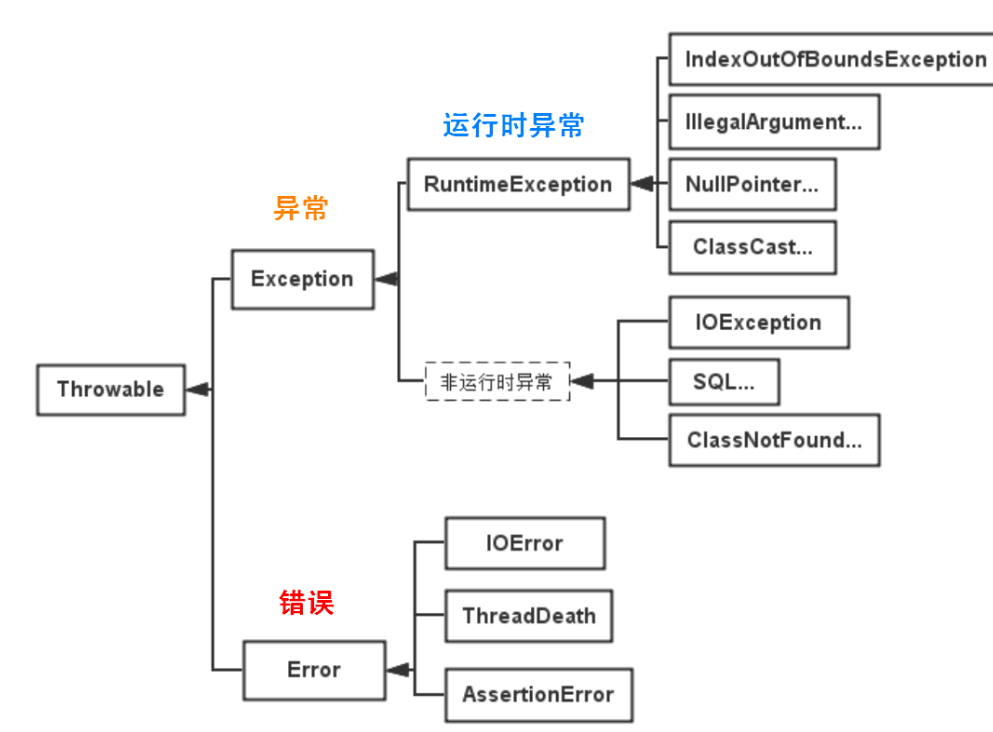

  ### Error（错误）

  Error 类及其子类：程序中无法处理的错误，表示运行应用程序中出现了严重的错误。

  此类错误一般表示代码运行时 JVM 出现问题。通常有 Virtual MachineError（虚拟机运行错误）、NoClassDefFoundError（类定义错误）等。比如 OutOfMemoryError：内存不足错误；StackOverflowError：栈溢出错误。此类错误发生时，JVM 将终止线程。

  这些错误是不受检异常，非代码性错误。因此，当此类错误发生时，应用程序不应该去处理此类错误。按照Java惯例，我们是不应该实现任何新的Error子类的！

  ### Exception（异常）

  程序本身可以捕获并且可以处理的异常。Exception 这种异常又分为两类：运行时异常和编译时异常。

  - **运行时异常** 	未检查异常

  都是RuntimeException类及其子类异常，如NullPointerException(空指针异常)、IndexOutOfBoundsException(下标越界异常)等，这些异常是不检查异常，程序中可以选择捕获处理，也可以不处理。这些异常一般是由程序逻辑错误引起的，程序应该从逻辑角度尽可能避免这类异常的发生。

  运行时异常的特点是Java编译器不会检查它，也就是说，当程序中可能出现这类异常，即使没有用try-catch语句捕获它，也没有用throws子句声明抛出它，也会编译通过。

  - **非运行时异常** （编译异常必须从语法角度进行处理）  已检查异常

  是RuntimeException以外的异常，类型上都属于Exception类及其子类。从程序语法角度讲是必须进行处理的异常，如果不处理，程序就不能编译通过。如IOException、SQLException等以及用户自定义的Exception异常，一般情况下不自定义检查异常。

  ### 应用 

  - **应该寻找更加适当的子类或创建自己的异常类**

  

#  Stream API

“集合讲的是数据，Stream讲的是计算！”

**注意：**

①Stream 自己不会存储元素。

②Stream 不会改变源对象。相反，他们会返回一个持有结果的新Stream。 

③Stream 操作是延迟执行的。这意味着他们会等到需要结果的时候才执行

**Stream** **的操作三个步骤**

1、创建Stream

一个数据源（如：集合、数组），获取一个流

2、中间操作

一个中间操作链，对数据源的数据进行处理

3、终止操作(终端操作) 

一旦执行终止操作，就执行中间操作链，才产生结果【也就是所谓的延迟执行】。之后，不会再被使用

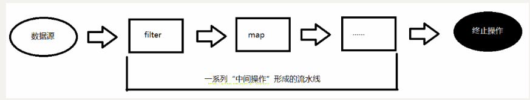


## 创建steam API

```java
// 通过数组
int[] arr = new int[]{1,2,3,4,5,6};
        //调用Arrays类的static <T> Stream<T> stream(T[] array): 返回一个流
        IntStream stream = Arrays.stream(arr);
```


## 实例1

```java
int[] q = new int[]{9,8,7,3,4,1,10,1,2,2,2};
Arrays.stream(q). // 创建steam流
    boxed().//中间操作
    collect(Collectors.toList());// 终止操作 
// collect(Collector c)——将流转换为其他形式。接收一个 Collector接口的实现，用于给Stream中元素做汇总的方法

```

# IO流&装饰器模式

装饰器模式是对功能的增强，而不是附加新的功能。代理模式才是附加新的功能。

## 星巴克咖啡订单项目

1. 咖啡种类/单品咖啡：Espresso(意大利浓咖啡)、ShortBlack、LongBlack(美式咖啡)、Decaf(无因咖啡) 
2. 调料：Milk、Soy(豆浆)、Chocolate 
3. 要求在扩展新的咖啡种类时，具有良好的扩展性、改动方便、维护方便 
4. 使用 OO 的来计算不同种类咖啡的费用: 客户可以点单品咖啡，也可以单品咖啡+调料组合。

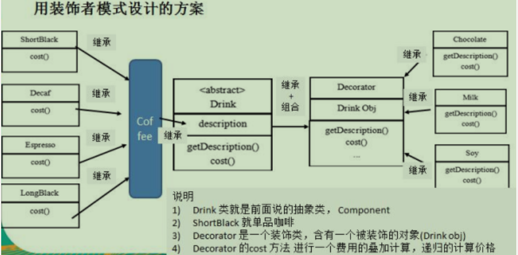

#### Drink【抽象类-主体Component】

```java
public abstract class Drink {

   public String des; // 描述
   private float price = 0.0f;
   public String getDes() {
      return des;
   }
   public void setDes(String des) {
      this.des = des;
   }
   public float getPrice() {
      return price;
   }
   public void setPrice(float price) {
      this.price = price;
   }
   
   //计算费用的抽象方法
   //子类来实现
   public abstract float cost();
   
}
```


#### Decorator

```java
public class Decorator extends Drink {
   private Drink obj;
   
   public Decorator(Drink obj) { //组合
      // TODO Auto-generated constructor stub
      this.obj = obj;
   }
   
   @Override
   public float cost() {
      // TODO Auto-generated method stub
      // getPrice 自己价格
      return super.getPrice() + obj.cost();
   }
   
   @Override
   public String getDes() {
      // TODO Auto-generated method stub
      // obj.getDes() 输出被装饰者的信息
      return des + " " + getPrice() + " && " + obj.getDes();
   }
   
}
```

#### Coffee

```
public class Coffee extends Drink {

  @Override
  public float cost() {
    // TODO Auto-generated method stub
    return super.getPrice();
  }
}
```

#### ShortBlack

```java
public class ShortBlack extends Coffee{
   
   public ShortBlack() {
      setDes(" shortblack ");
      setPrice(4.0f);
   }
}
```

#### Soy

```java
public class Soy extends Decorator{

   public Soy(Drink obj) {
      super(obj);
      // TODO Auto-generated constructor stub
      setDes(" 豆浆  ");
      setPrice(1.5f);
   }

}
```

#### Main

```java
package design_patterns.structual_type;

public class Main {
    public static void main(String[] args) {
        Drink order = new ShortBlack();
        System.out.println("费用1=" + order.cost());
        System.out.println("描述=" + order.getDes());

        // 2. order 加入一份牛奶
        order = new Soy(order);

        System.out.println("order 加入一份豆浆 费用 =" + order.cost());
        System.out.println("order 加入一份豆浆 描述 = " + order.getDes());
        System.out.println(new Soy(new ShortBlack()).cost());
    }
}

```


## IO流


> 说明
>
> 1. InputStream 是抽象类, 类似我们前面讲的 Drink
> 2. FileInputStream 是  InputStream 子类，类似我们前面的 DeCaf, LongBlack
> 3. FilterInputStream  是  InputStream 子类：类似我们前面 的 Decorator 修饰者
> 4. DataInputStream 是 FilterInputStream 子类，具体的修饰者，类似前面的 Milk, Soy 等
> 5. FilterInputStream 类 有  protected volatile InputStream in; 即含被装饰者
> 6. 分析得出在jdk 的io体系中，就是使用装饰者模式


  


  # 作用域（对类来说）

  1.在Java编程中，主要的变量就是属性（成员变量）和局部变量

  2.我们说的局部变量一般是指在成员方法中定义的变量

  3.Java中作用域的分类

  全局变量：也就是属性，作用域为整个类体

  局部变量：也就是除了属性之外的其他变量，作用域为定义它的代码块中

  4.属性可以不赋值，直接使用，因为有默认值，局部变量必须赋值后，才能使用因为没有默认值

  5.注意事项和细节使用

  属性和局部变量可以重名，访问时采用就近原则

  同作用域不能重名

  属性生命周期较长 伴随着对象的创建而创建，伴随着对象的销毁而销毁

  局部变量伴随着代码快的执行而创建，伴随着代码的结束而销毁。即在一次方法调用过程中

  作用域范围不同 ：属性可以被本类使用，或其他类使用（通过对象调用） 局部变量只能在本类中对应的方法中调用

  修饰符不同 属性可以加修饰符，局部变量不可以加修饰符

  

第10章面向对象高级部分

  ## 10.5 final 关键字

  可以修饰类，属性，方法和局部变量

#   第13 章 常用类

  ## 13.1包装类

  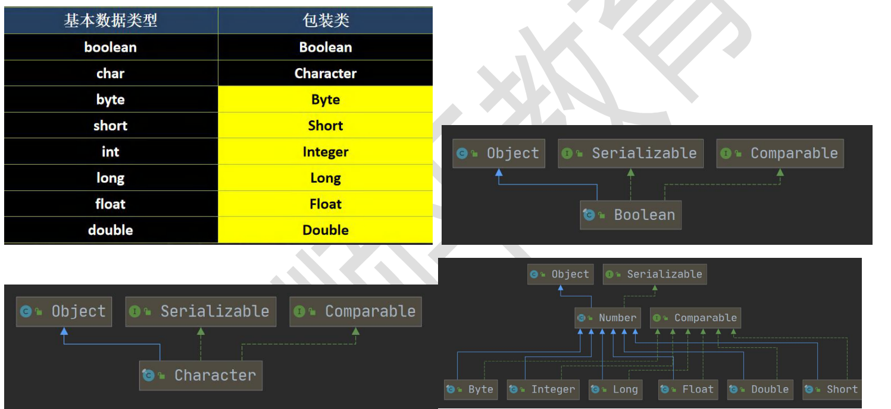

  有了类的特点，就可以调用类的方法

  ### 13.1.1装箱拆箱


  ### 13.1.2包装类之间的转化

  案例演示, 以 Integer 和 String 转换为例，其它类似:

  ```java
  package com.hspedu.wrapper;
  /**
  
  * @author 韩顺平
  * @version 1.0
    */
    public class WrapperVSString {
    public static void main(String[] args) {
    //包装类(Integer)->String
    Integer i = 100;//自动装箱
    //方式 1
    String str1 = i + "";
    //方式 2
    String str2 = i.toString();
    //方式 3
    String str3 = String.valueOf(i);
    //String -> 包装类(Integer)
    String str4 = "12345";
    Integer i2 = Integer.parseInt(str4);//使用到自动装箱
    Integer i3 = new Integer(str4);//构造器
    System.out.println("ok~~");
    }
    }
  ```

  

  ### 13.1.3Integer 类和 Character类的常用方法

  public class WrapperMethod {
  public static void main(String[] args) {
  System.out.println(Character.isDigit('a'));//判断是不是数字
  System.out.println(Character.isLetter('a'));//判断是不是字母
  System.out.println(Character.isUpperCase('a'));//判断是不是大写
  System.out.println(Character.isLowerCase('a'));//判断是不是小写
  System.out.println(Character.isWhitespace('a'));//判断是不是空格
  System.out.println(Character.toUpperCase('a'));//转成大写
  System.out.println(Character.toLowerCase('A'));//转成小写

  

  ## 13.2 String 类（双引号括起来）

  ### 13.2.1 String 类的理解和创建对象

  字符串常量用双引号扩起的字符序列 ： "你好"，"12.97"等

  使用Unicode编码 一个字符（不区分字母还是汉子)占两个字节

  String 类常用构造器（看手册）

  //
  // 常用的有 String s1 = new String(); //
  //String s2 = new String(String original);
  //String s3 = new String(char[] a);
  //String s4 = new String(char[] a,int startIndex,int count)
  //String s5 = new String(byte[] b)
  //5. String 类实现了接口 Serializable【String 可以串行化:可以在网络传输】
  // 接口 Comparable [String 对象可以比较大小]
  //6. String 是 final 类，不能被其他的类继承
  //7. String 有属性 private final char value[]; 用于存放字符串内容

  ## 13.6 StringBuilder 线程不安全的StringBuffer

  

  ## 13.7 Math 类

  Math类包含用于执行基本数学运算的方法，如初等函数、对数、平方根和三角函数。

  均为静态方法

  ```java
  public class MathMethod {
  public static void main(String[] args) {
  //看看 Math 常用的方法(静态方法)
  //1.abs 绝对值
  int abs = Math.abs(-9);
  System.out.println(abs);//9
  //2.pow 求幂
  double pow = Math.pow(2, 4);//2 的 4 次方
  System.out.println(pow);//16
  //3.ceil 向上取整,返回>=该参数的最小整数(转成 double);
  double ceil = Math.ceil(3.9);
  System.out.println(ceil);//4.0
  //4.floor 向下取整，返回<=该参数的最大整数(转成 double)
  double floor = Math.floor(4.001);
  System.out.println(floor);//4.0
  //5.round 四舍五入 Math.floor(该参数+0.5)
  long round = Math.round(5.51);
  System.out.println(round);//6
  //6.sqrt 求开方
  double sqrt = Math.sqrt(9.0);
  System.out.println(sqrt);//3.0
  //7.random 求随机数
  // random 返回的是 0 <= x < 1 之间的一个随机小数
  // 思考：请写出获取 a-b 之间的一个随机整数,a,b 均为整数 ，比如 a = 2, b=7
  // 即返回一个数 x 2 <= x <= 7
  // 解读 Math.random() * (b-a) 返回的就是 0 <= 数 <= b-a
  // (1) (int)(a) <= x <= (int)(a + Math.random() * (b-a +1) )
  // (2) 使用具体的数给小伙伴介绍 a = 2 b = 7
  // (int)(a + Math.random() * (b-a +1) ) = (int)( 2 + Math.random()*6)
  // Math.random()*6 返回的是 0 <= x < 6 小数
  // 2 + Math.random()*6 返回的就是 2<= x < 8 小数
  // (int)(2 + Math.random()*6) = 2 <= x <= 7
  // (3) 公式就是 (int)(a + Math.random() * (b-a +1) )
  for(int i = 0; i < 100; i++) {
  System.out.println((int)(2 + Math.random() * (7 - 2 + 1)));
  }
  //max , min 返回最大值和最小值
  int min = Math.min(1, 9);
  int max = Math.max(45, 90);
  System.out.println("min=" + min);
  System.out.println("max=" + max);
  }
  }
  ```

  ## 13.9 System类

  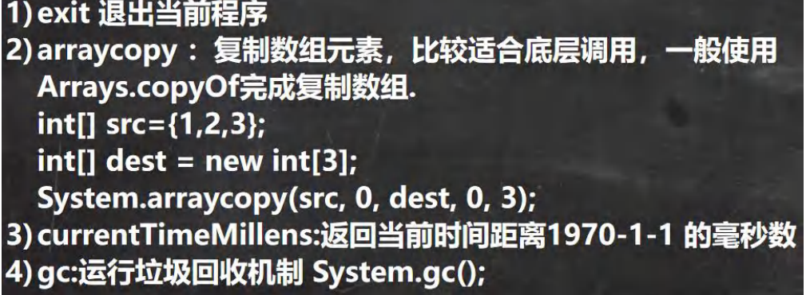

  ## 13.10 BigInteger和BigDecimal类

  应用场景：

   BigInteger适合保存较大的整形

  BigDecimal适合保存精度更高的浮点型

  两者的常见方法

  ```java
  public class BigInteger_ {
  public static void main(String[] args) {
  //当我们编程中，需要处理很大的整数，long 不够用
  //可以使用 BigInteger 的类来搞定
  // long l = 23788888899999999999999999999l;
  // System.out.println("l=" + l);
  BigInteger bigInteger = new BigInteger("23788888899999999999999999999");
  BigInteger bigInteger2 = new
  BigInteger("10099999999999999999999999999999999999999999999999999999999999999999999999999999999");
  System.out.println(bigInteger);
  //解读
  //1. 在对 BigInteger 进行加减乘除的时候，需要使用对应的方法，不能直接进行 + - * /
  //2. 可以创建一个 要操作的 BigInteger 然后进行相应操作
  BigInteger add = bigInteger.add(bigInteger2);
  System.out.println(add);//
  BigInteger subtract = bigInteger.subtract(bigInteger2);
  System.out.println(subtract);//减
  BigInteger multiply = bigInteger.multiply(bigInteger2);
  System.out.println(multiply);//乘
  BigInteger divide = bigInteger.divide(bigInteger2);
  System.out.println(divide);//除
  }
  }
  ```

  ```java
  public class BigDecimal_ {
  public static void main(String[] args) {
  //当我们需要保存一个精度很高的数时，double 不够用
  //可以是 BigDecimal
  // double d = 1999.11111111111999999999999977788d;
  // System.out.println(d);
  BigDecimal bigDecimal = new BigDecimal("1999.11");
  BigDecimal bigDecimal2 = new BigDecimal("3");
  System.out.println(bigDecimal);
  //老韩解读
  //1. 如果对 BigDecimal 进行运算，比如加减乘除，需要使用对应的方法
  //2. 创建一个需要操作的 BigDecimal 然后调用相应的方法即可
  System.out.println(bigDecimal.add(bigDecimal2));
  System.out.println(bigDecimal.subtract(bigDecimal2));
  System.out.println(bigDecimal.multiply(bigDecimal2));
  //System.out.println(bigDecimal.divide(bigDecimal2));//可能抛出异常 ArithmeticException
  //在调用 divide 方法时，指定精度即可. BigDecimal.ROUND_CEILING
  //如果有无限循环小数，就会保留 分子 的精度
  System.out.println(bigDecimal.divide(bigDecimal2, BigDecimal.ROUND_CEILING));
  }
  }
  ```

  

  


  ## 14.1集合的理解与好处

  数组长度固定不能更改 CRUD（增加 (Create)、读取(Retrieve) (重新得到数据)、更新 (Update)和删除 (Delete)增删改查）不方便

  集合可以动态保存任意多个对象（底层源码运用扩容机制），提供了一系列方便的方法，add、remove、set、get等

  ## 14.2集合的框架体系

  单列集合

  add（“tom”）

  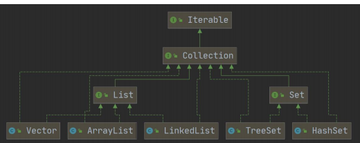

  接口定义方法类会自己具体实现各种方法

  双列集合 put（“NO1”,“北京”）

  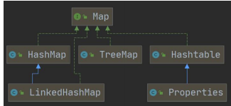

  ## 14.3 Collection接口和常用方法

  # 第21章 网络编程

  查询 API 的一般流程是：找包→找类或接口→查看类或接口→找方法或变量

  ### 21.1网络的相关概念

  计算机网络

  ### 21.2InetAddress类

  #### 21.2.1相关方法

  1.获取本机InetAddress对象  InetAddress.getLocalHost 静态方法 ，return LAPTOP-PH64GORS/192.168.137.1

  2.根据指定主机名/域名获取ip地址对象InetAddress.getByName（主机名）

  3.获取InetAddress对象的主机名 getHostName

  4.获取InetAddress对象的地址 getHostAddress

  ```java
  //1. 获取本机的InetAddress 对象
  InetAddress localHost = InetAddress.getLocalHost();
  System.out.println(localHost);//DESKTOP-S4MP84S/192.168.12.1
  
  //2. 根据指定主机名 获取 InetAddress对象
  InetAddress host1 = InetAddress.getByName("LAPTOP-PH64GORS");
  System.out.println("host1=" + host1);//DESKTOP-S4MP84S/192.168.12.1
  
  //3. 根据域名返回 InetAddress对象, 比如 www.baidu.com 对应
  InetAddress host2 = InetAddress.getByName("www.baidu.com");
  System.out.println("host2=" + host2);//www.baidu.com / 110.242.68.4
  
  //4. 通过 InetAddress 对象，获取对应的地址
  String hostAddress = host2.getHostAddress();//IP 110.242.68.4
  System.out.println("host2 对应的ip = " + hostAddress);//110.242.68.4
  
  //5. 通过 InetAddress 对象，获取对应的主机名/或者的域名
  String hostName = host2.getHostName();
  System.out.println("host2对应的主机名/域名=" + hostName); // www.baidu.com
  ```

  ### 21.3 Socket

  #### 21.3.1基本介绍

  1.套接字（Socket）开发网络应用程序被广泛采用，以至成为事实上的标准

  2.通信两端都要是Socket，是两台机器间通信的端点

  3.网络通信其实就是Socket的通信

  4.Socket允许程序把网络连接当成一个流，数据在两个Socket间通过IO传输。

  5.一般主动发起通信的应用程序属于客户端，等待的为服务端

  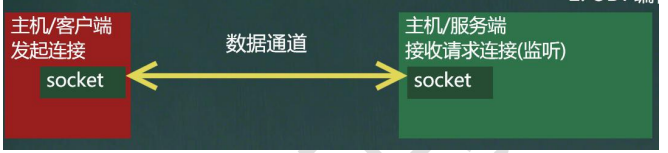

  ### 21.4  TCP网络通信编程

  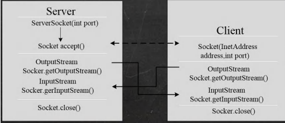

  #### 21.4.1使用字节流

  ```java
  public class SocketTCP01Client {
      public static void main(String[] args) throws IOException {
          //思路
          //1. 连接服务端 (ip , 端口）
          //解读: 连接本机的 9999端口, 如果连接成功，返回Socket对象
          Socket socket = new Socket(InetAddress.getLocalHost(), 9999);
          System.out.println("客户端 socket返回=" + socket.getClass());
          //2. 连接上后，生成Socket, 通过socket.getOutputStream()
          //   得到 和 socket对象关联的输出流对象
          OutputStream outputStream = socket.getOutputStream();
          //3. 通过输出流，写入数据到 数据通道
          outputStream.write("hello, server".getBytes());
          //4. 关闭流对象和socket, 必须关闭
          outputStream.close();
          socket.close();
          System.out.println("客户端退出.....");
      }
  }
  ```

  ```java
  public class SocketTCP01Server {
      public static void main(String[] args) throws IOException {
          //思路
          //1. 在本机 的9999端口监听, 等待连接
          //   细节: 要求在本机没有其它服务在监听9999
          //   细节：这个 ServerSocket 可以通过 accept() 返回多个Socket[多个客户端连接服务器的并发]
          ServerSocket serverSocket = new ServerSocket(9999);
          System.out.println("服务端，在9999端口监听，等待连接..");
          //2. 当没有客户端连接9999端口时，程序会 阻塞, 等待连接
          //   如果有客户端连接，则会返回Socket对象，程序继续
  
          Socket socket = serverSocket.accept();
  
          System.out.println("服务端 socket =" + socket.getClass());
          //
          //3. 通过socket.getInputStream() 读取客户端写入到数据通道的数据, 显示
          InputStream inputStream = socket.getInputStream();
          //4. IO读取
          byte[] buf = new byte[1024];
          int readLen = 0;
          while ((readLen = inputStream.read(buf)) != -1) {
              System.out.println(new String(buf, 0, readLen));//根据读取到的实际长度，显示内容.
          }
          //5.关闭流和socket
          inputStream.close();
          socket.close();
          serverSocket.close();//关闭
  
      }
  }
  ```

  #### 21.4.2使用字符流

  ```java
  public static void main(String[] args) throws IOException {
          //思路
          //1. 连接服务端 (ip , 端口）
          //解读: 连接本机的 9999端口, 如果连接成功，返回Socket对象
          Socket socket = new Socket(InetAddress.getLocalHost(), 9999);
          System.out.println("客户端 socket返回=" + socket.getClass());
          //2. 连接上后，生成Socket, 通过socket.getOutputStream()
          //   得到 和 socket对象关联的输出流对象
          OutputStream outputStream = socket.getOutputStream();
          //3. 通过输出流，写入数据到 数据通道, 使用字符流
          BufferedWriter bufferedWriter = new BufferedWriter(new OutputStreamWriter(outputStream));
          bufferedWriter.write("hello, server 字符流");
          bufferedWriter.newLine();//插入一个换行符，表示写入的内容结束, 注意，要求对方使用readLine()!!!!
          bufferedWriter.flush();// 如果使用的字符流，需要手动刷新，否则数据不会写入数据通道
  
  
          //4. 获取和socket关联的输入流. 读取数据(字符)，并显示
          InputStream inputStream = socket.getInputStream();
          BufferedReader bufferedReader = new BufferedReader(new InputStreamReader(inputStream));
          String s = bufferedReader.readLine();
          System.out.println(s);
  
          //5. 关闭流对象和socket, 必须关闭
          bufferedReader.close();//关闭外层流
          bufferedWriter.close();
          socket.close();
          System.out.println("客户端退出.....");
      }
  }
  ```

  ```java
  public class SocketTCP03Server {
      public static void main(String[] args) throws IOException {
          //思路
          //1. 在本机 的9999端口监听, 等待连接
          //   细节: 要求在本机没有其它服务在监听9999
          //   细节：这个 ServerSocket 可以通过 accept() 返回多个Socket[多个客户端连接服务器的并发]
          ServerSocket serverSocket = new ServerSocket(9999);
          System.out.println("服务端，在9999端口监听，等待连接..");
          //2. 当没有客户端连接9999端口时，程序会 阻塞, 等待连接
          //   如果有客户端连接，则会返回Socket对象，程序继续
  
          Socket socket = serverSocket.accept();
  
          System.out.println("服务端 socket =" + socket.getClass());
          //
          //3. 通过socket.getInputStream() 读取客户端写入到数据通道的数据, 显示
          InputStream inputStream = socket.getInputStream();
          //4. IO读取, 使用字符流, 老师使用 InputStreamReader 将 inputStream 转成字符流
          BufferedReader bufferedReader = new BufferedReader(new InputStreamReader(inputStream));
          String s = bufferedReader.readLine();
          System.out.println(s);//输出
  
          //5. 获取socket相关联的输出流
          OutputStream outputStream = socket.getOutputStream();
         //    使用字符输出流的方式回复信息
          BufferedWriter bufferedWriter = new BufferedWriter(new OutputStreamWriter(outputStream));
          bufferedWriter.write("hello client 字符流");
          bufferedWriter.newLine();// 插入一个换行符，表示回复内容的结束
          bufferedWriter.flush();//注意需要手动的flush
  
  
          //6.关闭流和socket
          bufferedWriter.close();
          bufferedReader.close();
          socket.close();
          serverSocket.close();//关闭
  
      }
  }
  ```

  #### 21.4.3文件发送

  #### 21.4.4 netstat 指令

  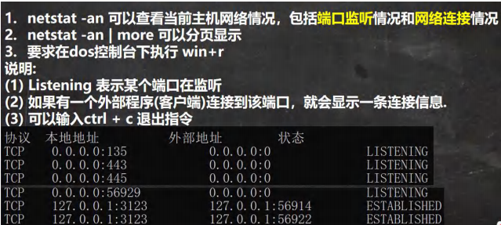

  

  telnet ip 端口号 连接服务器

  crtl+】 显示字符

  用Java连接服务器

  

  

  ```java
  try (var s = new Socket("time-a.nist.gov", 13); //打开一个关键字，负责启动该程序内部和外部的通信 若连接失败 它将抛出
       // 一个UnknownHostException,
       // 如果存在其他问题将抛出一个IOException 因为UnknownException是IOException的一个子类 这仅是示例程序仅捕获超类的异常
        var in = new Scanner(s.getInputStream(), StandardCharsets.UTF_8))
  //一旦套接字打开 Socket 类中的getInputStream 类就会返回一个InputSteam对象，该对象可以像任何其他流对象使用，该程序一旦获得了
          //这个流 该程序会将直接把每一行打印到标准输出 该程序只适用非常简单的服务器
          //在比较复杂的网络程序中 客户端发送请求而服务器可能在响应结束是并不立刻断开连接
          //java库隐藏了建立网络连接和通过连接发送数据的复杂过程
  ```

  ```java
  import java.io.*;
  import java.net.*;
  
  /**
   * This program demonstrates the InetAddress class. Supply a host name as command-line
   * argument, or run without command-line arguments to see the address of the local host.
   * @version 1.02 2012-06-05
   * @author Cay Horstmann
   */
  public class InetAddressTest
  {
     public static void main(String[] args) throws IOException
     {
        if (args.length > 0)
        {
           String host = args[0];
           InetAddress[] addresses = InetAddress.getAllByName(host);//为给定的主机名创建一个InetAddress对象
           //
           for (InetAddress a : addresses)
              System.out.println(a);
        }
        else
        {
           InetAddress localHostAddress = InetAddress.getLocalHost(); //为本机主机创建一个InetAddress对象
           System.out.println(localHostAddress);
        }
     }
  }
  ```

  InetAddress

  Socket

  # 基础知识

  ## 基础类型

  byte是字节类型

  char 是unicode 是万国码 16位 兼容assic

  ## 类型转换

  自动向上类型转换

  强制向下转换(对表达式强转)

  ## 比较器

  &gt 则返回 1

  &lt 则返回 -1

  sort 默认从小到大,比较器不关注sort,只关注传递大小信息

  lamda随便写写  基本类型不支持比较器

  ## Date

  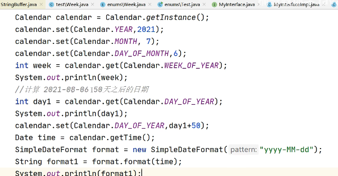

  ## File类

  > 创建文件对象,对对象进行操作 文件夹或文件皆可抽象为file,但文件夹不能被输入输出

  ## IO流

  字节与字符的区别

  字节(Byte)是计量单位，表示数据量多少，是计算机信息技术用于计量存储容量的一种计量单位，通常情况下一字节等于八位。

  字符(Character)计算机中使用的字母、数字、字和符号，比如'A'、'B'、'$'、'&'等。

  一般在英文状态下一个字母或字符占用一个字节，一个汉字用两个字节表示。

  

  **字节与字符：**

  - ASCII 码中，一个英文字母（不分大小写）为一个字节，一个中文汉字为两个字节。
  - UTF-8 编码中，一个英文字为一个字节，一个中文为三个字节。
  - Unicode 编码中，一个英文为一个字节，一个中文为两个字节。
  - 符号：英文标点为一个字节，中文标点为两个字节。例如：英文句号 **.** 占1个字节的大小，中文句号 **。**占2个字节的大小。
  - UTF-16 编码中，一个英文字母字符或一个汉字字符存储都需要 2 个字节（Unicode 扩展区的一些汉字存储需要 4 个字节）。
  - UTF-32 编码中，世界上任何字符的存储都需要 4 个字节。

  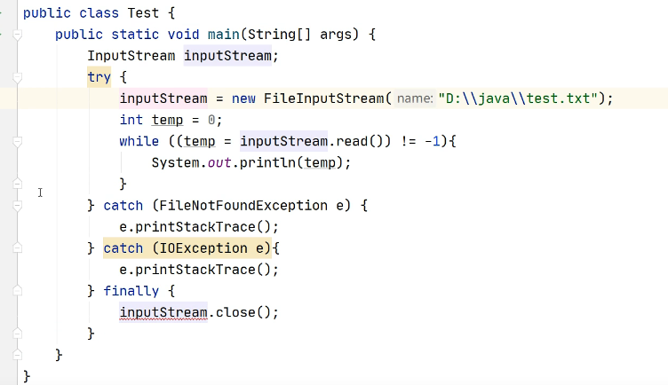

  **输出流默认覆盖写,文件不存在则创建文件**

  # 权限修饰符

  ## 类

  1、外部类前可以修饰：public、default、abstract、final

  - 对于顶级类(外部类)来说，只有两种修饰符：public和默认(default)。因为外部类的上一单元是包，所以外部类只有两个作用域：同包，任何位置。因此，只需要两种控制权限：包控制权限和公开访问权限，也就对应两种控制修饰符：public和默认(default)。可以满足所有的情况了。

    如果类使用了private修饰符，说明是个内部类。内部类的上一级是外部类，那么对应的有四种访问控制修饰符：本类(private)，同包(default)，父子类(protected)，任何位置(public)。当一个内部类使用了private修饰后，只能在该类的外部类内部使用。

    上面这些都是平时使用司空见惯的，但是为什么是这种情况呢？

    可以想一下，一个java项目是不可能在一个class里面完成的。mvc模式中，是把类分为三层，一层层调用类。如果定义为私有的和受保护的就无法调用。换句话说，对于一个java文件，要么就是自己单独运行，要么就是被其他程序作为库调用，如果一个java文件的类被private修饰，那么是不是其他的程序或是类是无法使用它的，那么他作为一个单独的文件就没啥用了。如果它作为单个文件运行，类加载怎么找到它呢，因为它对外不可见。同时，也失去了类的存在意义。

  2、内部类前可以修饰：public、protected、default、private、abstract、final、static

  3、局部(指方法 代码块等)内部类前可以修饰：abstract、final

  ## 成员变量

  1、 public ：对 所有用户 开放，所有用户都可直接调用
  2、 [private](https://so.csdn.net/so/search?q=private&spm=1001.2101.3001.7020) ：私有。 除了class自己之外，任何人都不可直接使用 ，私有财产神圣不可侵犯嘛，即便是子女，朋友，都不可使用。

  default 类内部 与 同包 ,即对于外包的类和子类朋友类相当于为私有不能访问

  3、 [protected](https://so.csdn.net/so/search?q=protected&spm=1001.2101.3001.7020) ：对于子女、朋友来说，就是public的，可自由使用，无任何限制；而对于其他的外部class，protected就变成private。（ 同一个包中的类，若不在同一个包中，必须为其子孙类才可使用 ）

  ## 接口抽象类

  接口里的静态方法，即static修饰的有方法体的方法不会被继承或者实现，但是静态变量会被继承

  接口中的static方法不能被继承，也不能被实现类调用，只能被自身调用

  # Guava入门

  guava就是类库，是java api的增强与扩展，里面有大量的方法供我们使用，使用之前需要引入包

  

  <dependencies>

          <!--guava依赖-->
      
          <dependency>
      
              <groupId>com.google.guava</groupId>
      
              <artifactId>guava</artifactId>
      
              <version>27.0.1</version>
      
          </dependency>

  </dependencies>

  guava有哪些方法呢？我们先从以下几方面开始学习：

  字符串处理：分割，连接，填充
  新增的集合类型
  原生类型
  1.原生类型

   定义list，map

  public void test() {
          //JDK 
          List<String> list = new ArrayList<String>();
          list.add("a");
          list.add("b");
          list.add("c");
          list.add("d");
          //guava
          List<String> lists = Lists.newArrayList("a", "b", "g", null, "8", "9");
          List<String> lists1 = Lists.newArrayList();
          Map<Integer, String> maps = Maps.newHashMap();
  }
  guava就是类库，是java api的增强与扩展，里面有大量的方法供我们使用，使用之前需要引入包

  <dependencies>

          <!--guava依赖-->
      
          <dependency>
      
              <groupId>com.google.guava</groupId>
      
              <artifactId>guava</artifactId>
      
              <version>27.0.1</version>
      
          </dependency>

  </dependencies>

  guava有哪些方法呢？我们先从以下几方面开始学习：

  字符串处理：分割，连接，填充
  新增的集合类型
  原生类型
  1.原生类型

   定义list，map

  public void test() {
          //JDK 
          List<String> list = new ArrayList<String>();
          list.add("a");
          list.add("b");
          list.add("c");
          list.add("d");
          //guava
          List<String> lists = Lists.newArrayList("a", "b", "g", null, "8", "9");
          List<String> lists1 = Lists.newArrayList();
          Map<Integer, String> maps = Maps.newHashMap();
  }
  2.新增集合（这里我只讲一下Mulitmap,平时用这个会使代码很方便，这里我就多讲一下）

  a Multimap的使用

     Multimap就是将相同key的value值放在一个list里面，这样子取相同key下面的所有value值就非常简单了，不然还得for循环去匹配，把相同key值的value值找出来，在进行处理。map<key,value>键值key不能重复，所以当遇到这样子场景的时候map就非常不适合了，guava提供了Multimap适用于该场景。

  当我们需要一个map中包含key为String类型，value为List类型的时候，以前我们是这样写的

  // jdk方式
  Map<String,List<Integer>> map = new HashMap<String,List<Integer>>();
  List<Integer> list = new ArrayList<Integer>();
  list.add(1);
  list.add(2);
  map.put("aa", list);
  System.out.println(map.get("aa"));//[1, 2]

  // guava方式
  Multimap<String,Integer> map = ArrayListMultimap.create();      
  map.put("aa", 1);
  map.put("aa", 2);
  System.out.println(map.get("aa"));  //[1, 2]
   Multimap.get(key)即使没有key值，会返回空的list。

   Multimap.keySet()返回的用set<T>表示的不重复key;

   Multimap.keys()返回的是用Multiset表示的key,key数量跟value值数量一致；

   Multimap.containKeys()是表示是否包含这个key;

   Multimap.size()返回所有值的个数，而非不同键的个数。要得到不同键的个数，要用Multimap.keySet().size()

  想要更多了解Multimap可以参考 https://www.jianshu.com/p/e0537d878b6c

  3.字符串的处理：分割，连接，填充

     a. joiner 连接器

  joiner on就是将list用，连接转成字符串

  @Test
      public void joinerListTest() {
          List<String> lists = Lists.newArrayList("a","b","g","8","9");
          String result = Joiner.on(",").join(lists);
          System.out.println(result);
      }

  结果：a,b,g,8,9
  joiner skipNulls()连接跳过null元素(第一个test为了跟第二个进行比对一下)

  @Test
      public void joinerListTest1() {
          List<String> lists = Lists.newArrayList("a","b","g",null,"8","9");
          String result = Joiner.on(",").join(lists);
          System.out.println(result);
      }

  结果：a,b,g,null,8,9

  @Test
  public void joinerListTest2() {
      List<String> lists = Lists.newArrayList("a","b,"g",null,"8","9");
      String result = Joiner.on(",").skipNulls().join(lists);
      System.out.println(result);
  }
  结果：a,b,g,8,9
    如果连接的时候list里面含有null值，会报空指针，因为join实现如下：

  1.
  public final String join(Iterable<?> parts) {
          return this.join(parts.iterator());
      }

  2.
  public final String join(Iterator<?> parts) {
          return this.appendTo(new StringBuilder(), parts).toString();
      }

  3.
  @CanIgnoreReturnValue
      public final StringBuilder appendTo(StringBuilder builder, Iterator<?> parts) {
          try {
              this.appendTo((Appendable)builder, (Iterator)parts);
              return builder;
          } catch (IOException var4) {
              throw new AssertionError(var4);
          }
      }

  4.
  @CanIgnoreReturnValue
      public <A extends Appendable> A appendTo(A appendable, Iterator<?> parts) throws IOException {
          Preconditions.checkNotNull(appendable);
          if (parts.hasNext()) {
              appendable.append(this.toString(parts.next()));

              while(parts.hasNext()) {
                  appendable.append(this.separator);
                  appendable.append(this.toString(parts.next()));
              }
          }
          return appendable;
      }

  5.
  @CanIgnoreReturnValue
      public static <T> T checkNotNull(T reference) {
          if (reference == null) {
              throw new NullPointerException();
          } else {
              return reference;
          }
      }
   joiner useForNull(final String value)用value替换null元素值

  @Test
      public void useNullListTest() {
          List<String> lists = Lists.newArrayList("a", "b", "g", null, "8", "9");
          String result = Joiner.on(",").useForNull("哈哈").join(lists);
          System.out.println(result);
      }

  结果：a,b,g,哈哈,8,9
   joiner withKeyValueSeparator(String value)   map连接器，keyValueSeparator为key和value之间的分隔符

  @Test
      public void withMapTest() {
          Map<Integer, String> maps = Maps.newHashMap();
          maps.put(1, "哈哈");
          maps.put(2, "压压");
          String result = Joiner.on(",").withKeyValueSeparator(":").join(maps);
          System.out.println(result);
          System.out.println(maps);
      }

  结果：
  1:哈哈,2:压压
  {1=哈哈, 2=压压}
    b. splitter 拆分器

   splitter on 拆分

  @Test
      public void splitterListTest() {
          String test = "34344,34,34,哈哈";
          List<String> lists = Splitter.on(",").splitToList(test);
          System.out.println(lists);
      }

  结果：[34344, 34, 34, 哈哈]
   splitter trimResults 拆分去除前后空格

  @Test
      public void trimResultListTest() {
          String test = "  34344,34,34,哈哈 ";
          List<String> lists = Splitter.on(",").trimResults().splitToList(test);
          System.out.println(lists);
      }

  结果：[34344, 34, 34, 哈哈]
  splitter omitEmptyStrings 去除拆分出来空的字符串

  @Test
      public void omitEmptyStringsTest() {
          String test = "  3434,434,34,,哈哈 ";
          List<String> lists = Splitter.on(",").omitEmptyStrings().splitToList(test);
          System.out.println(lists);
      }

  结果：[  3434, 434, 34, 哈哈 ]
  splitter fixedLength(int lenght) 把字符串按固定长度分割

  @Test
      public void fixedLengthTest() {
          String test = "343443434哈哈";
          List<String> lists = Splitter.fixedLength(3).splitToList(test);
          System.out.println(lists);
      }

  结果：[343, 443, 434, 哈哈]
    b. charMatcher 匹配器

  charMatcher is(Char char)  给单一字符匹配

  @Test
      public void isTest() {
          String str = "12312,agg";
          CharMatcher charMatcher1 = CharMatcher.is('g');
          System.out.println(charMatcher1.retainFrom(str));
      }

  结果：gg
  charMatcher  retainFrom(String s)  在字符序列中保留匹配字符，移除其他字符

  @Test
      public void charMatcherTest() {
          String str = "12312,agg  ";
          //两个匹配符,先匹配再操作
          CharMatcher charMatcher1 = CharMatcher.is('1');
          CharMatcher charMatcher2 = CharMatcher.is('2');
          //两个CharMatcher或操作
          CharMatcher charMatcher3 = charMatcher1.or(charMatcher2);
          System.out.println(charMatcher3.retainFrom(str));
      }

  结果：1212
  charMatcher matchersAllOf(Char char) 测试是否字符序列所有字符都匹配

  @Test
      public void matchesAllOfTest() {
          String str = "12312,agg";
          CharMatcher charMatcher1 = CharMatcher.is('g');
          System.out.println(charMatcher1.matchesAllOf(str));
      }

  结果：false
  @Test
      public void matchesAllOfTest() {
          String str = "ggggg";
          CharMatcher charMatcher1 = CharMatcher.is('g');
          System.out.println(charMatcher1.matchesAllOf(str));
      }

  结果：true

  # arr与list转换

  ## 前言

  ```java
  int[] ints = {2, 34, 55, 22, 11};
          long[] longs = {1, 2, 3};
          double[] doubles = {1, 2, 3};
          Arrays.stream(ints).boxed().collect(Collectors.toList());
          Arrays.stream(longs).boxed().collect(Collectors.toList());
          Arrays.stream(doubles).boxed().collect(Collectors.toList());
  ```

  **直接for,add就完事了反之同理**

  **java数组转list误区**
  **一、不能把基本数据类型转化为列表**
  仔细观察可以发现asList接受的参数是一个泛型的变长参数，而基本数据类型是无法泛型化的，如下所示：

  ```java
  public  class  App {
     public  static  void  main(String[] args) {
       int [] intarray = { 1 ,  2 ,  3 ,  4 ,  5 };
       //List<Integer> list = Arrays.asList(intarray); 编译通不过
       List< int []> list = Arrays.asList(intarray);
       System.out.println(list);
     }
  }
  
  output：
  [[I @66d3c617 ]
  1234567891011
  ```

  这是因为把int类型的数组当参数了，所以转换后的列表就只包含一个int[]元素。
  解决方案：
  要想把基本数据类型的数组转化为其包装类型的list，可以使用guava类库的工具方法，示例如下：

  ```java
  int [] intArray = { 1 ,  2 ,  3 ,  4 };
  List<Integer> list = Ints.asList(intArray);
  ```

  ## 第一种方式(未必最佳):使用ArrayList.asList(strArray)

  使用Arrays工具类Arrays.asList(strArray)方式,转换完成后,只能对List[数组](https://so.csdn.net/so/search?q=数组&spm=1001.2101.3001.7020)进行查改,不能增删,增删就会抛出UnsupportedOperationException 异常

  ```java
  import java.util.Arrays;
  import java.util.List; 
  public static void Demo1() {
          String[] str = {"fgx", "lzy"};
          //注意这个List不是Collections包内的List,而是util包里面的List接口
          List<String> ints = Arrays.asList(str);
      	//这里会报错
          ints.add("laopo");
      }
  123456789
  ```

  添加数据报错:

  ```java
  Exception in thread "main" java.lang.UnsupportedOperationException
  at java.util.AbstractList.add(AbstractList.java:148)
  at java.util.AbstractList.add(AbstractList.java:108)
  at JAVA基础.JDK8新特性.Java数组转List.Demo1(Java数组转List.java:20)
  at JAVA基础.JDK8新特性.Java数组转List.main(Java数组转List.java:13)
  
  报错原因:Arrays.asList(str)返回值是java.util.Arrays类中一个私有静态内部类 
  java.utiil.Arrays.Arraylist,并不是我们平时用的java.util.ArrayList();
  
  使用场景:Arrays.asList(strArray)方式仅能用在将数组转换为List后，不需要增删其中的值，仅作为数据源读取使用。
  12345678910
  ```

  ## 第二种方法(支持增删查改):

  通过ArrayList的构造器,将Arrays.asList(strArray)的返回值由java.utilArrays.ArrayList转为java.util.ArrayList.
  关键代码：ArrayList list = new ArrayList(Arrays.asList(strArray)) ;

  ```java
    String[] str = {"fgx", "lzy"};
          //注意这个List不是Collections包内的List,而是util包里面的List接口
          java.util.ArrayList<String> strings = new ArrayList<>(Arrays.asList(str));
          strings.add("aop");
          strings.stream().forEach(System.out::println);
  
  123456
  ```

  
  使用场景:需要在将数组转换为List后，对List进行增删改查操作，在List的数据量不大的情况下，可以使用。

  ## 第三种方式(通过集合工具类Collections.addAll()方法(最高效))

  通过Collections.addAll(arrayList, strArray)方式转换，根据数组的长度创建一个长度相同的List，然后通过Collections.addAll()方法，将数组中的元素转为二进制，然后添加到List中，这是最高效的方法。

  ```java
   public static void Demo3() {
          //注意这个List不是Collections包内的List,而是util包里面的List接口
          String[] str = {"fgx", "lzy"};
          java.util.ArrayList<String> stringList = new ArrayList<>(str.length);
          Collections.addAll(stringList,str);
      }
  ```

  ## 第四种方式通过JDK8的Stream流将3总基本类型数组转为List

  如果JDK版本在1.8以上,使用流stream来将下列3种数组快速转为List,分别是int[],long[],double[],不支持short[ ],byte[ ],char[]在JDK1.8中暂不支持.

  ```java
   int[] ints = {2, 34, 55, 22, 11};
          long[] longs = {1, 2, 3};
          double[] doubles = {1, 2, 3};
          Arrays.stream(ints).boxed().collect(Collectors.toList());
          Arrays.stream(longs).boxed().collect(Collectors.toList());
          Arrays.stream(doubles).boxed().collect(Collectors.toList());
  123456
  ```

  TIPs:为什么int[]不能直接转为List,而Integer[]可以转为List,而Integer[]就可以转为List了,因为List中的泛型必须是引用类型。

  **java数组转list误区**
  **一、不能把基本数据类型转化为列表**
  仔细观察可以发现asList接受的参数是一个泛型的变长参数，而基本数据类型是无法泛型化的，如下所示：

  ```java
  public  class  App {
     public  static  void  main(String[] args) {
       int [] intarray = { 1 ,  2 ,  3 ,  4 ,  5 };
       //List<Integer> list = Arrays.asList(intarray); 编译通不过
       List< int []> list = Arrays.asList(intarray);
       System.out.println(list);
     }
  }
  
  output：
  [[I @66d3c617 ]
  1234567891011
  ```

  这是因为把int类型的数组当参数了，所以转换后的列表就只包含一个int[]元素。
  解决方案：
  要想把基本数据类型的数组转化为其包装类型的list，可以使用guava类库的工具方法，示例如下：

  ```java
  int [] intArray = { 1 ,  2 ,  3 ,  4 };
  List<Integer> list = Ints.asList(intArray);
  12
  ```

  **二、asList方法返回的是数组的一个视图**
  视图意味着，对这个list的操作都会反映在原数组上，而且这个list是定长的，不支持add、remove等改变长度的方法。

  ```java
  public  class  App {
     public  static  void  main(String[] args) {
       int [] intArray = { 1 ,  2 ,  3 ,  4 };
       List<Integer> list = Ints.asList(intArray);
       list.set( 0 ,  100 );
       System.out.println(Arrays.toString(intArray));
       list.add( 5 );
       list.remove( 0 );
     }
  }
  
  
  output：
  [ 100 ,  2 ,  3 ,  4 ]
  UnsupportedOperationException
  UnsupportedOperationException
  ```

# Java 容器


## 一、概览

容器主要包括 Collection 和 Map 两种，Collection 存储着对象的集合，而 Map 存储着键值对（两个对象）的映射表。

### Collection

<div align="center">  </div><br>

#### 1. Set

- TreeSet：基于红黑树实现，支持有序性操作，例如根据一个范围查找元素的操作。但是查找效率不如 HashSet，HashSet 查找的时间复杂度为 O(1)，TreeSet 则为 O(logN)。

- HashSet：基于哈希表实现，支持快速查找，但不支持有序性操作。并且失去了元素的插入顺序信息，也就是说使用 Iterator 遍历 HashSet 得到的结果是不确定的。

- LinkedHashSet：具有 HashSet 的查找效率，并且内部使用双向链表维护元素的插入顺序。

#### 2. List

- ArrayList：基于动态数组实现，支持随机访问。

- Vector：和 ArrayList 类似，但它是线程安全的。

- LinkedList：基于双向链表实现，只能顺序访问，但是可以快速地在链表中间插入和删除元素。不仅如此，LinkedList 还可以用作栈、队列和双向队列。

#### 3. Queue

- LinkedList：可以用它来实现双向队列。

- PriorityQueue：基于堆结构实现，可以用它来实现优先队列。

### Map

<div align="center">  </div><br>

- TreeMap：基于红黑树实现。

- HashMap：基于哈希表实现。

- HashTable：和 HashMap 类似，但它是线程安全的，这意味着同一时刻多个线程同时写入 HashTable 不会导致数据不一致。它是遗留类，不应该去使用它，而是使用 ConcurrentHashMap 来支持线程安全，ConcurrentHashMap 的效率会更高，因为 ConcurrentHashMap 引入了分段锁。

- LinkedHashMap：使用双向链表来维护元素的顺序，顺序为插入顺序或者最近最少使用（LRU）顺序。


## 二、容器中的设计模式

### 迭代器模式

<div align="center">  </div><br>

Collection 继承了 Iterable 接口，其中的 iterator() 方法能够产生一个 Iterator 对象，通过这个对象就可以迭代遍历 Collection 中的元素。

从 JDK 1.5 之后可以使用 foreach 方法来遍历实现了 Iterable 接口的聚合对象。

```java
List<String> list = new ArrayList<>();
list.add("a");
list.add("b");
for (String item : list) {
    System.out.println(item);
}
```

### 适配器模式

java.util.Arrays#asList() 可以把数组类型转换为 List 类型。

```java
@SafeVarargs
public static <T> List<T> asList(T... a)
```

应该注意的是 asList() 的参数为泛型的变长参数，不能使用基本类型数组作为参数，只能使用相应的包装类型数组。

```java
Integer[] arr = {1, 2, 3};
List list = Arrays.asList(arr);
```

也可以使用以下方式调用 asList()：

```java
List list = Arrays.asList(1, 2, 3);
```

## 三、源码分析

如果没有特别说明，以下源码分析基于 JDK 1.8。

在 IDEA 中 double shift 调出 Search EveryWhere，查找源码文件，找到之后就可以阅读源码。

### ArrayList


#### 1. 概览

因为 ArrayList 是基于数组实现的，所以支持快速随机访问。RandomAccess 接口标识着该类支持快速随机访问。

```java
public class ArrayList<E> extends AbstractList<E>
        implements List<E>, RandomAccess, Cloneable, java.io.Serializable
```

数组的默认大小为 10。

```java
private static final int DEFAULT_CAPACITY = 10;
```

<div align="center">  </div><br>

#### 2. 扩容

添加元素时使用 ensureCapacityInternal() 方法来保证容量足够，如果不够时，需要使用 grow() 方法进行扩容，新容量的大小为 `oldCapacity + (oldCapacity >> 1)`，即 oldCapacity+oldCapacity/2。其中 oldCapacity >> 1 需要取整，所以新容量大约是旧容量的 1.5 倍左右。（oldCapacity 为偶数就是 1.5 倍，为奇数就是 1.5 倍-0.5）

扩容操作需要调用 `Arrays.copyOf()` 把原数组整个复制到新数组中，这个操作代价很高，因此最好在创建 ArrayList 对象时就指定大概的容量大小，减少扩容操作的次数。

```java
public boolean add(E e) {
    ensureCapacityInternal(size + 1);  // Increments modCount!!
    elementData[size++] = e;
    return true;
}

private void ensureCapacityInternal(int minCapacity) {
    if (elementData == DEFAULTCAPACITY_EMPTY_ELEMENTDATA) {
        minCapacity = Math.max(DEFAULT_CAPACITY, minCapacity);
    }
    ensureExplicitCapacity(minCapacity);
}

private void ensureExplicitCapacity(int minCapacity) {
    modCount++;
    // overflow-conscious code
    if (minCapacity - elementData.length > 0)
        grow(minCapacity);
}

private void grow(int minCapacity) {
    // overflow-conscious code
    int oldCapacity = elementData.length;
    int newCapacity = oldCapacity + (oldCapacity >> 1);
    if (newCapacity - minCapacity < 0)
        newCapacity = minCapacity;
    if (newCapacity - MAX_ARRAY_SIZE > 0)
        newCapacity = hugeCapacity(minCapacity);
    // minCapacity is usually close to size, so this is a win:
    elementData = Arrays.copyOf(elementData, newCapacity);
}
```

#### 3. 删除元素

需要调用 System.arraycopy() 将 index+1 后面的元素都复制到 index 位置上，该操作的时间复杂度为 O(N)，可以看到 ArrayList 删除元素的代价是非常高的。

```java
public E remove(int index) {
    rangeCheck(index);
    modCount++;
    E oldValue = elementData(index);
    int numMoved = size - index - 1;
    if (numMoved > 0)
        System.arraycopy(elementData, index+1, elementData, index, numMoved);
    elementData[--size] = null; // clear to let GC do its work
    return oldValue;
}
```

#### 4. 序列化

ArrayList 基于数组实现，并且具有动态扩容特性，因此保存元素的数组不一定都会被使用，那么就没必要全部进行序列化。

保存元素的数组 elementData 使用 transient 修饰，该关键字声明数组默认不会被序列化。

```java
transient Object[] elementData; // non-private to simplify nested class access
```

ArrayList 实现了 writeObject() 和 readObject() 来控制只序列化数组中有元素填充那部分内容。

```java
private void readObject(java.io.ObjectInputStream s)
    throws java.io.IOException, ClassNotFoundException {
    elementData = EMPTY_ELEMENTDATA;

    // Read in size, and any hidden stuff
    s.defaultReadObject();

    // Read in capacity
    s.readInt(); // ignored

    if (size > 0) {
        // be like clone(), allocate array based upon size not capacity
        ensureCapacityInternal(size);

        Object[] a = elementData;
        // Read in all elements in the proper order.
        for (int i=0; i<size; i++) {
            a[i] = s.readObject();
        }
    }
}
```

```java
private void writeObject(java.io.ObjectOutputStream s)
    throws java.io.IOException{
    // Write out element count, and any hidden stuff
    int expectedModCount = modCount;
    s.defaultWriteObject();

    // Write out size as capacity for behavioural compatibility with clone()
    s.writeInt(size);

    // Write out all elements in the proper order.
    for (int i=0; i<size; i++) {
        s.writeObject(elementData[i]);
    }

    if (modCount != expectedModCount) {
        throw new ConcurrentModificationException();
    }
}
```

序列化时需要使用 ObjectOutputStream 的 writeObject() 将对象转换为字节流并输出。而 writeObject() 方法在传入的对象存在 writeObject() 的时候会去反射调用该对象的 writeObject() 来实现序列化。反序列化使用的是 ObjectInputStream 的 readObject() 方法，原理类似。

```java
ArrayList list = new ArrayList();
ObjectOutputStream oos = new ObjectOutputStream(new FileOutputStream(file));
oos.writeObject(list);
```

#### 5. Fail-Fast

modCount 用来记录 ArrayList 结构发生变化的次数。结构发生变化是指添加或者删除至少一个元素的所有操作，或者是调整内部数组的大小，仅仅只是设置元素的值不算结构发生变化。

在进行序列化或者迭代等操作时，需要比较操作前后 modCount 是否改变，如果改变了需要抛出 ConcurrentModificationException。代码参考上节序列化中的 writeObject() 方法。


### Vector

#### 1. 同步

它的实现与 ArrayList 类似，但是使用了 synchronized 进行同步。

```java
public synchronized boolean add(E e) {
    modCount++;
    ensureCapacityHelper(elementCount + 1);
    elementData[elementCount++] = e;
    return true;
}

public synchronized E get(int index) {
    if (index >= elementCount)
        throw new ArrayIndexOutOfBoundsException(index);

    return elementData(index);
}
```

#### 2. 扩容

Vector 的构造函数可以传入 capacityIncrement 参数，它的作用是在扩容时使容量 capacity 增长 capacityIncrement。如果这个参数的值小于等于 0，扩容时每次都令 capacity 为原来的两倍。

```java
public Vector(int initialCapacity, int capacityIncrement) {
    super();
    if (initialCapacity < 0)
        throw new IllegalArgumentException("Illegal Capacity: "+
                                           initialCapacity);
    this.elementData = new Object[initialCapacity];
    this.capacityIncrement = capacityIncrement;
}
```

```java
private void grow(int minCapacity) {
    // overflow-conscious code
    int oldCapacity = elementData.length;
    int newCapacity = oldCapacity + ((capacityIncrement > 0) ?
                                     capacityIncrement : oldCapacity);
    if (newCapacity - minCapacity < 0)
        newCapacity = minCapacity;
    if (newCapacity - MAX_ARRAY_SIZE > 0)
        newCapacity = hugeCapacity(minCapacity);
    elementData = Arrays.copyOf(elementData, newCapacity);
}
```

调用没有 capacityIncrement 的构造函数时，capacityIncrement 值被设置为 0，也就是说默认情况下 Vector 每次扩容时容量都会翻倍。

```java
public Vector(int initialCapacity) {
    this(initialCapacity, 0);
}

public Vector() {
    this(10);
}
```

#### 3. 与 ArrayList 的比较

- Vector 是同步的，因此开销就比 ArrayList 要大，访问速度更慢。最好使用 ArrayList 而不是 Vector，因为同步操作完全可以由程序员自己来控制；
- Vector 每次扩容请求其大小的 2 倍（也可以通过构造函数设置增长的容量），而 ArrayList 是 1.5 倍。

#### 4. 替代方案

可以使用 `Collections.synchronizedList();` 得到一个线程安全的 ArrayList。

```java
List<String> list = new ArrayList<>();
List<String> synList = Collections.synchronizedList(list);
```

也可以使用 concurrent 并发包下的 CopyOnWriteArrayList 类。

```java
List<String> list = new CopyOnWriteArrayList<>();
```

### CopyOnWriteArrayList

#### 1. 读写分离

写操作在一个复制的数组上进行，读操作还是在原始数组中进行，读写分离，互不影响。

写操作需要加锁，防止并发写入时导致写入数据丢失。

写操作结束之后需要把原始数组指向新的复制数组。

```java
public boolean add(E e) {
    final ReentrantLock lock = this.lock;
    lock.lock();
    try {
        Object[] elements = getArray();
        int len = elements.length;
        Object[] newElements = Arrays.copyOf(elements, len + 1);
        newElements[len] = e;
        setArray(newElements);
        return true;
    } finally {
        lock.unlock();
    }
}

final void setArray(Object[] a) {
    array = a;
}
```

```java
@SuppressWarnings("unchecked")
private E get(Object[] a, int index) {
    return (E) a[index];
}
```

#### 2. 适用场景

CopyOnWriteArrayList 在写操作的同时允许读操作，大大提高了读操作的性能，因此很适合读多写少的应用场景。

但是 CopyOnWriteArrayList 有其缺陷：

- 内存占用：在写操作时需要复制一个新的数组，使得内存占用为原来的两倍左右；
- 数据不一致：读操作不能读取实时性的数据，因为部分写操作的数据还未同步到读数组中。

所以 CopyOnWriteArrayList 不适合内存敏感以及对实时性要求很高的场景。

### LinkedList

#### 1. 概览

基于双向链表实现，使用 Node 存储链表节点信息。

```java
private static class Node<E> {
    E item;
    Node<E> next;
    Node<E> prev;
}
```

每个链表存储了 first 和 last 指针：

```java
transient Node<E> first;
transient Node<E> last;
```

<div align="center">  </div><br>

#### 2. 与 ArrayList 的比较

ArrayList 基于动态数组实现，LinkedList 基于双向链表实现。ArrayList 和 LinkedList 的区别可以归结为数组和链表的区别：

- 数组支持随机访问，但插入删除的代价很高，需要移动大量元素；
- 链表不支持随机访问，但插入删除只需要改变指针。

### HashMap

为了便于理解，以下源码分析以 JDK 1.7 为主。

#### 1. 存储结构

内部包含了一个 Entry 类型的数组 table。Entry 存储着键值对。它包含了四个字段，从 next 字段我们可以看出 Entry 是一个链表。即数组中的每个位置被当成一个桶，一个桶存放一个链表。HashMap 使用拉链法来解决冲突，同一个链表中存放哈希值和散列桶取模运算结果相同的 Entry。

<div align="center">  </div><br>

```java
transient Entry[] table;
```

```java
static class Entry<K,V> implements Map.Entry<K,V> {
    final K key;
    V value;
    Entry<K,V> next;
    int hash;

    Entry(int h, K k, V v, Entry<K,V> n) {
        value = v;
        next = n;
        key = k;
        hash = h;
    }

    public final K getKey() {
        return key;
    }

    public final V getValue() {
        return value;
    }

    public final V setValue(V newValue) {
        V oldValue = value;
        value = newValue;
        return oldValue;
    }

    public final boolean equals(Object o) {
        if (!(o instanceof Map.Entry))
            return false;
        Map.Entry e = (Map.Entry)o;
        Object k1 = getKey();
        Object k2 = e.getKey();
        if (k1 == k2 || (k1 != null && k1.equals(k2))) {
            Object v1 = getValue();
            Object v2 = e.getValue();
            if (v1 == v2 || (v1 != null && v1.equals(v2)))
                return true;
        }
        return false;
    }

    public final int hashCode() {
        return Objects.hashCode(getKey()) ^ Objects.hashCode(getValue());
    }

    public final String toString() {
        return getKey() + "=" + getValue();
    }
}
```

#### 2. 拉链法的工作原理

```java
HashMap<String, String> map = new HashMap<>();
map.put("K1", "V1");
map.put("K2", "V2");
map.put("K3", "V3");
```

- 新建一个 HashMap，默认大小为 16；
- 插入 &lt;K1,V1\> 键值对，先计算 K1 的 hashCode 为 115，使用除留余数法得到所在的桶下标 115%16=3。
- 插入 &lt;K2,V2\> 键值对，先计算 K2 的 hashCode 为 118，使用除留余数法得到所在的桶下标 118%16=6。
- 插入 &lt;K3,V3\> 键值对，先计算 K3 的 hashCode 为 118，使用除留余数法得到所在的桶下标 118%16=6，插在 &lt;K2,V2\> 前面。

应该注意到链表的插入是以头插法方式进行的，例如上面的 &lt;K3,V3\> 不是插在 &lt;K2,V2\> 后面，而是插入在链表头部。

查找需要分成两步进行：

- 计算键值对所在的桶；
- 在链表上顺序查找，时间复杂度显然和链表的长度成正比。

<div align="center">  </div><br>

#### 3. put 操作

```java
public V put(K key, V value) {
    if (table == EMPTY_TABLE) {
        inflateTable(threshold);
    }
    // 键为 null 单独处理
    if (key == null)
        return putForNullKey(value);
    int hash = hash(key);
    // 确定桶下标
    int i = indexFor(hash, table.length);
    // 先找出是否已经存在键为 key 的键值对，如果存在的话就更新这个键值对的值为 value
    for (Entry<K,V> e = table[i]; e != null; e = e.next) {
        Object k;
        if (e.hash == hash && ((k = e.key) == key || key.equals(k))) {
            V oldValue = e.value;
            e.value = value;
            e.recordAccess(this);
            return oldValue;
        }
    }

    modCount++;
    // 插入新键值对
    addEntry(hash, key, value, i);
    return null;
}
```

HashMap 允许插入键为 null 的键值对。但是因为无法调用 null 的 hashCode() 方法，也就无法确定该键值对的桶下标，只能通过强制指定一个桶下标来存放。HashMap 使用第 0 个桶存放键为 null 的键值对。


使用链表的头插法，也就是新的键值对插在链表的头部，而不是链表的尾部。


#### 4. 确定桶下标

很多操作都需要先确定一个键值对所在的桶下标。

```java
int hash = hash(key);
int i = indexFor(hash, table.length);
```

**4.1 计算 hash 值**  

```java
final int hash(Object k) {
    int h = hashSeed;
    if (0 != h && k instanceof String) {
        return sun.misc.Hashing.stringHash32((String) k);
    }

    h ^= k.hashCode();

    // This function ensures that hashCodes that differ only by
    // constant multiples at each bit position have a bounded
    // number of collisions (approximately 8 at default load factor).
    h ^= (h >>> 20) ^ (h >>> 12);
    return h ^ (h >>> 7) ^ (h >>> 4);
}
```

```java
public final int hashCode() {
    return Objects.hashCode(key) ^ Objects.hashCode(value);
}
```

**4.2 取模**  

令 x = 1\<\<4，即 x 为 2 的 4 次方，它具有以下性质：

```
x   : 00010000
x-1 : 00001111
```

令一个数 y 与 x-1 做与运算，可以去除 y 位级表示的第 4 位以上数：

```
y       : 10110010
x-1     : 00001111
y&(x-1) : 00000010
```

这个性质和 y 对 x 取模效果是一样的：

```
y   : 10110010
x   : 00010000
y%x : 00000010
```

我们知道，位运算的代价比求模运算小的多，因此在进行这种计算时用位运算的话能带来更高的性能。

确定桶下标的最后一步是将 key 的 hash 值对桶个数取模：hash%capacity，如果能保证 capacity 为 2 的 n 次方，那么就可以将这个操作转换为位运算。

```java
static int indexFor(int h, int length) {
    return h & (length-1);
}
```

#### 5. 扩容-基本原理

设 HashMap 的 table 长度为 M，需要存储的键值对数量为 N，如果哈希函数满足均匀性的要求，那么每条链表的长度大约为 N/M，因此查找的复杂度为 O(N/M)。

为了让查找的成本降低，应该使 N/M 尽可能小，因此需要保证 M 尽可能大，也就是说 table 要尽可能大。HashMap 采用动态扩容来根据当前的 N 值来调整 M 值，使得空间效率和时间效率都能得到保证。

和扩容相关的参数主要有：capacity、size、threshold 和 load_factor。

|    参数    | 含义                                                         |
| :--------: | :----------------------------------------------------------- |
|  capacity  | table 的容量大小，默认为 16。需要注意的是 capacity 必须保证为 2 的 n 次方。 |
|    size    | 键值对数量。                                                 |
| threshold  | size 的临界值，当 size 大于等于 threshold 就必须进行扩容操作。 |
| loadFactor | 装载因子，table 能够使用的比例，threshold = (int)(capacity* loadFactor)。 |

```java
static final int DEFAULT_INITIAL_CAPACITY = 16;

static final int MAXIMUM_CAPACITY = 1 << 30;

static final float DEFAULT_LOAD_FACTOR = 0.75f;

transient Entry[] table;

transient int size;

int threshold;

final float loadFactor;

transient int modCount;
```

从下面的添加元素代码中可以看出，当需要扩容时，令 capacity 为原来的两倍。

```java
void addEntry(int hash, K key, V value, int bucketIndex) {
    Entry<K,V> e = table[bucketIndex];
    table[bucketIndex] = new Entry<>(hash, key, value, e);
    if (size++ >= threshold)
        resize(2 * table.length);
}
```

扩容使用 resize() 实现，需要注意的是，扩容操作同样需要把 oldTable 的所有键值对重新插入 newTable 中，因此这一步是很费时的。

```java
void resize(int newCapacity) {
    Entry[] oldTable = table;
    int oldCapacity = oldTable.length;
    if (oldCapacity == MAXIMUM_CAPACITY) {
        threshold = Integer.MAX_VALUE;
        return;
    }
    Entry[] newTable = new Entry[newCapacity];
    transfer(newTable);
    table = newTable;
    threshold = (int)(newCapacity * loadFactor);
}

void transfer(Entry[] newTable) {
    Entry[] src = table;
    int newCapacity = newTable.length;
    for (int j = 0; j < src.length; j++) {
        Entry<K,V> e = src[j];
        if (e != null) {
            src[j] = null;
            do {
                Entry<K,V> next = e.next;
                int i = indexFor(e.hash, newCapacity);
                e.next = newTable[i];
                newTable[i] = e;
                e = next;
            } while (e != null);
        }
    }
}
```

#### 6. 扩容-重新计算桶下标

在进行扩容时，需要把键值对重新计算桶下标，从而放到对应的桶上。在前面提到，HashMap 使用 hash%capacity 来确定桶下标。HashMap capacity 为 2 的 n 次方这一特点能够极大降低重新计算桶下标操作的复杂度。

假设原数组长度 capacity 为 16，扩容之后 new capacity 为 32：

```html
capacity     : 00010000
new capacity : 00100000
```

对于一个 Key，它的哈希值 hash 在第 5 位：

- 为 0，那么 hash%00010000 = hash%00100000，桶位置和原来一致；
- 为 1，hash%00010000 = hash%00100000 + 16，桶位置是原位置 + 16。

#### 7. 计算数组容量

HashMap 构造函数允许用户传入的容量不是 2 的 n 次方，因为它可以自动地将传入的容量转换为 2 的 n 次方。

先考虑如何求一个数的掩码，对于 10010000，它的掩码为 11111111，可以使用以下方法得到：

```
mask |= mask >> 1    11011000
mask |= mask >> 2    11111110
mask |= mask >> 4    11111111
```

mask+1 是大于原始数字的最小的 2 的 n 次方。

```
num     10010000
mask+1 100000000
```

以下是 HashMap 中计算数组容量的代码：

```java
static final int tableSizeFor(int cap) {
    int n = cap - 1;
    n |= n >>> 1;
    n |= n >>> 2;
    n |= n >>> 4;
    n |= n >>> 8;
    n |= n >>> 16;
    return (n < 0) ? 1 : (n >= MAXIMUM_CAPACITY) ? MAXIMUM_CAPACITY : n + 1;
}
```

#### 8. 链表转红黑树

从 JDK 1.8 开始，一个桶存储的链表长度大于等于 8 时会将链表转换为红黑树。

#### 9. 与 Hashtable 的比较

- Hashtable 使用 synchronized 来进行同步。
- HashMap 可以插入键为 null 的 Entry。
- HashMap 的迭代器是 fail-fast 迭代器。
- HashMap 不能保证随着时间的推移 Map 中的元素次序是不变的。

### ConcurrentHashMap

#### 1. 存储结构

<div align="center">  </div><br>

```java
static final class HashEntry<K,V> {
    final int hash;
    final K key;
    volatile V value;
    volatile HashEntry<K,V> next;
}
```

ConcurrentHashMap 和 HashMap 实现上类似，最主要的差别是 ConcurrentHashMap 采用了分段锁（Segment），每个分段锁维护着几个桶（HashEntry），多个线程可以同时访问不同分段锁上的桶，从而使其并发度更高（并发度就是 Segment 的个数）。

Segment 继承自 ReentrantLock。

```java
static final class Segment<K,V> extends ReentrantLock implements Serializable {

    private static final long serialVersionUID = 2249069246763182397L;

    static final int MAX_SCAN_RETRIES =
        Runtime.getRuntime().availableProcessors() > 1 ? 64 : 1;

    transient volatile HashEntry<K,V>[] table;

    transient int count;

    transient int modCount;

    transient int threshold;

    final float loadFactor;
}
```

```java
final Segment<K,V>[] segments;
```

默认的并发级别为 16，也就是说默认创建 16 个 Segment。

```java
static final int DEFAULT_CONCURRENCY_LEVEL = 16;
```

#### 2. size 操作

每个 Segment 维护了一个 count 变量来统计该 Segment 中的键值对个数。

```java
/**
 * The number of elements. Accessed only either within locks
 * or among other volatile reads that maintain visibility.
 */
transient int count;
```

在执行 size 操作时，需要遍历所有 Segment 然后把 count 累计起来。

ConcurrentHashMap 在执行 size 操作时先尝试不加锁，如果连续两次不加锁操作得到的结果一致，那么可以认为这个结果是正确的。

尝试次数使用 RETRIES_BEFORE_LOCK 定义，该值为 2，retries 初始值为 -1，因此尝试次数为 3。

如果尝试的次数超过 3 次，就需要对每个 Segment 加锁。

```java
/**
 * Number of unsynchronized retries in size and containsValue
 * methods before resorting to locking. This is used to avoid
 * unbounded retries if tables undergo continuous modification
 * which would make it impossible to obtain an accurate result.
 */
static final int RETRIES_BEFORE_LOCK = 2;

public int size() {
    // Try a few times to get accurate count. On failure due to
    // continuous async changes in table, resort to locking.
    final Segment<K,V>[] segments = this.segments;
    int size;
    boolean overflow; // true if size overflows 32 bits
    long sum;         // sum of modCounts
    long last = 0L;   // previous sum
    int retries = -1; // first iteration isn't retry
    try {
        for (;;) {
            // 超过尝试次数，则对每个 Segment 加锁
            if (retries++ == RETRIES_BEFORE_LOCK) {
                for (int j = 0; j < segments.length; ++j)
                    ensureSegment(j).lock(); // force creation
            }
            sum = 0L;
            size = 0;
            overflow = false;
            for (int j = 0; j < segments.length; ++j) {
                Segment<K,V> seg = segmentAt(segments, j);
                if (seg != null) {
                    sum += seg.modCount;
                    int c = seg.count;
                    if (c < 0 || (size += c) < 0)
                        overflow = true;
                }
            }
            // 连续两次得到的结果一致，则认为这个结果是正确的
            if (sum == last)
                break;
            last = sum;
        }
    } finally {
        if (retries > RETRIES_BEFORE_LOCK) {
            for (int j = 0; j < segments.length; ++j)
                segmentAt(segments, j).unlock();
        }
    }
    return overflow ? Integer.MAX_VALUE : size;
}
```

#### 3. JDK 1.8 的改动

JDK 1.7 使用分段锁机制来实现并发更新操作，核心类为 Segment，它继承自重入锁 ReentrantLock，并发度与 Segment 数量相等。

JDK 1.8 使用了 CAS 操作来支持更高的并发度，在 CAS 操作失败时使用内置锁 synchronized。

并且 JDK 1.8 的实现也在链表过长时会转换为红黑树。

### LinkedHashMap

#### 存储结构

继承自 HashMap，因此具有和 HashMap 一样的快速查找特性。

```java
public class LinkedHashMap<K,V> extends HashMap<K,V> implements Map<K,V>
```

内部维护了一个双向链表，用来维护插入顺序或者 LRU 顺序。

```java
/**
 * The head (eldest) of the doubly linked list.
 */
transient LinkedHashMap.Entry<K,V> head;

/**
 * The tail (youngest) of the doubly linked list.
 */
transient LinkedHashMap.Entry<K,V> tail;
```

accessOrder 决定了顺序，默认为 false，此时维护的是插入顺序。

```java
final boolean accessOrder;
```

LinkedHashMap 最重要的是以下用于维护顺序的函数，它们会在 put、get 等方法中调用。

```java
void afterNodeAccess(Node<K,V> p) { }
void afterNodeInsertion(boolean evict) { }
```

#### afterNodeAccess()

当一个节点被访问时，如果 accessOrder 为 true，则会将该节点移到链表尾部。也就是说指定为 LRU 顺序之后，在每次访问一个节点时，会将这个节点移到链表尾部，保证链表尾部是最近访问的节点，那么链表首部就是最近最久未使用的节点。

```java
void afterNodeAccess(Node<K,V> e) { // move node to last
    LinkedHashMap.Entry<K,V> last;
    if (accessOrder && (last = tail) != e) {
        LinkedHashMap.Entry<K,V> p =
            (LinkedHashMap.Entry<K,V>)e, b = p.before, a = p.after;
        p.after = null;
        if (b == null)
            head = a;
        else
            b.after = a;
        if (a != null)
            a.before = b;
        else
            last = b;
        if (last == null)
            head = p;
        else {
            p.before = last;
            last.after = p;
        }
        tail = p;
        ++modCount;
    }
}
```

#### afterNodeInsertion()

在 put 等操作之后执行，当 removeEldestEntry() 方法返回 true 时会移除最晚的节点，也就是链表首部节点 first。

evict 只有在构建 Map 的时候才为 false，在这里为 true。

```java
void afterNodeInsertion(boolean evict) { // possibly remove eldest
    LinkedHashMap.Entry<K,V> first;
    if (evict && (first = head) != null && removeEldestEntry(first)) {
        K key = first.key;
        removeNode(hash(key), key, null, false, true);
    }
}
```

removeEldestEntry() 默认为 false，如果需要让它为 true，需要继承 LinkedHashMap 并且覆盖这个方法的实现，这在实现 LRU 的缓存中特别有用，通过移除最近最久未使用的节点，从而保证缓存空间足够，并且缓存的数据都是热点数据。

```java
protected boolean removeEldestEntry(Map.Entry<K,V> eldest) {
    return false;
}
```

#### LRU 缓存

以下是使用 LinkedHashMap 实现的一个 LRU 缓存：

- 设定最大缓存空间 MAX_ENTRIES  为 3；
- 使用 LinkedHashMap 的构造函数将 accessOrder 设置为 true，开启 LRU 顺序；
- 覆盖 removeEldestEntry() 方法实现，在节点多于 MAX_ENTRIES 就会将最近最久未使用的数据移除。

```java
class LRUCache<K, V> extends LinkedHashMap<K, V> {
    private static final int MAX_ENTRIES = 3;

    protected boolean removeEldestEntry(Map.Entry eldest) {
        return size() > MAX_ENTRIES;
    }

    LRUCache() {
        super(MAX_ENTRIES, 0.75f, true);
    }
}
```

```java
public static void main(String[] args) {
    LRUCache<Integer, String> cache = new LRUCache<>();
    cache.put(1, "a");
    cache.put(2, "b");
    cache.put(3, "c");
    cache.get(1);
    cache.put(4, "d");
    System.out.println(cache.keySet());
}
```

```html
[3, 1, 4]
```

### WeakHashMap

#### 存储结构

WeakHashMap 的 Entry 继承自 WeakReference，被 WeakReference 关联的对象在下一次垃圾回收时会被回收。

WeakHashMap 主要用来实现缓存，通过使用 WeakHashMap 来引用缓存对象，由 JVM 对这部分缓存进行回收。

```java
private static class Entry<K,V> extends WeakReference<Object> implements Map.Entry<K,V>
```

#### ConcurrentCache

Tomcat 中的 ConcurrentCache 使用了 WeakHashMap 来实现缓存功能。

ConcurrentCache 采取的是分代缓存：

- 经常使用的对象放入 eden 中，eden 使用 ConcurrentHashMap 实现，不用担心会被回收（伊甸园）；
- 不常用的对象放入 longterm，longterm 使用 WeakHashMap 实现，这些老对象会被垃圾收集器回收。
- 当调用  get() 方法时，会先从 eden 区获取，如果没有找到的话再到 longterm 获取，当从 longterm 获取到就把对象放入 eden 中，从而保证经常被访问的节点不容易被回收。
- 当调用 put() 方法时，如果 eden 的大小超过了 size，那么就将 eden 中的所有对象都放入 longterm 中，利用虚拟机回收掉一部分不经常使用的对象。

```java
public final class ConcurrentCache<K, V> {

    private final int size;

    private final Map<K, V> eden;

    private final Map<K, V> longterm;

    public ConcurrentCache(int size) {
        this.size = size;
        this.eden = new ConcurrentHashMap<>(size);
        this.longterm = new WeakHashMap<>(size);
    }

    public V get(K k) {
        V v = this.eden.get(k);
        if (v == null) {
            v = this.longterm.get(k);
            if (v != null)
                this.eden.put(k, v);
        }
        return v;
    }

    public void put(K k, V v) {
        if (this.eden.size() >= size) {
            this.longterm.putAll(this.eden);
            this.eden.clear();
        }
        this.eden.put(k, v);
    }
}
```


## 参考资料

- Eckel B. Java 编程思想 [M]. 机械工业出版社, 2002.
- [Java Collection Framework](https://www.w3resource.com/java-tutorial/java-collections.php)
- [Iterator 模式](https://openhome.cc/Gossip/DesignPattern/IteratorPattern.htm)
- [Java 8 系列之重新认识 HashMap](https://tech.meituan.com/java_hashmap.html)
- [What is difference between HashMap and Hashtable in Java?](http://javarevisited.blogspot.hk/2010/10/difference-between-hashmap-and.html)
- [Java 集合之 HashMap](http://www.zhangchangle.com/2018/02/07/Java%E9%9B%86%E5%90%88%E4%B9%8BHashMap/)
- [The principle of ConcurrentHashMap analysis](http://www.programering.com/a/MDO3QDNwATM.html)
- [探索 ConcurrentHashMap 高并发性的实现机制](https://www.ibm.com/developerworks/cn/java/java-lo-concurrenthashmap/)
- [HashMap 相关面试题及其解答](https://www.jianshu.com/p/75adf47958a7)
- [Java 集合细节（二）：asList 的缺陷](http://wiki.jikexueyuan.com/project/java-enhancement/java-thirtysix.html)
- [Java Collection Framework – The LinkedList Class](http://javaconceptoftheday.com/java-collection-framework-linkedlist-class/)


## 杂记

HashMap

从源码中可以看出：HashMap提供四种构造方法：一是给定初始容量和加载因子的构造方法，二是给定初始容量，使用默认的加载因子，三是什么参数都不给，使用默认的初始容量和默认的加载因子，四是传进一个Map，使用默认的加载因子。从上面的构造方法可以看出，无论是使用默认的初始容量，还是使用默认的初始容量，当你调用HashMap的构造方法时，HashMap是没有进行初始化容量，也就是现在是一个空的HashMap（容量为0）,这是因为HashMap使用的懒加载机制，只有你第一次向HashMap中添加元素时，才进行第一次的容量设置，查看put(K,V)的源码：
put(K key, V value)调用了putVal(int hash, K key, V value, boolean onlyIfAbsent,boolean evict)的方法，在putVal的方法中，当第一次向HashMap中添加对象时，会进行一个判空的处理，这时就调用resize()方法对HashMap进行容量设置，此时会有两种情况的根据容量初始化。

第一种情况：当我们没有设置初始化容量时，HashMap就使用默认的初始化容量，也就是16.

第二种情况：当我们设置了初始化容量，HashMap就会按照我们设置的容量进行设置吗？答案是不一定。当你设置的初始化容量是2的n次方时，就会按照你设置的容量设置；当你设置的初始化容量不是2的n次方时，就会按照大于你设置的那个值但是最接近你设置的那个值的2的n次方进行设置。


