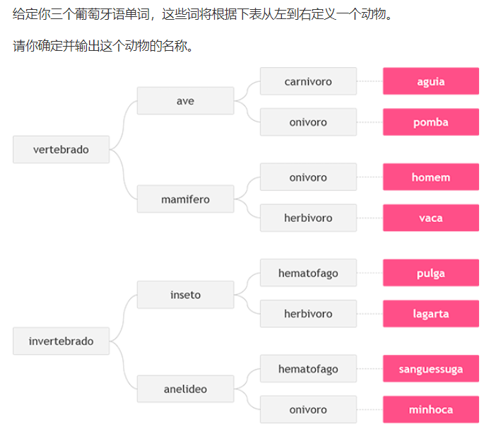
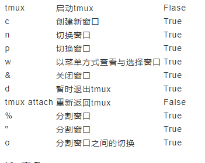
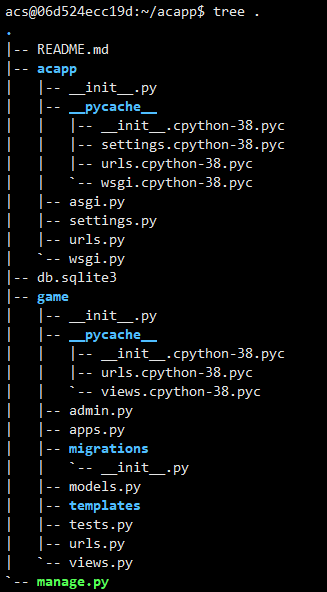
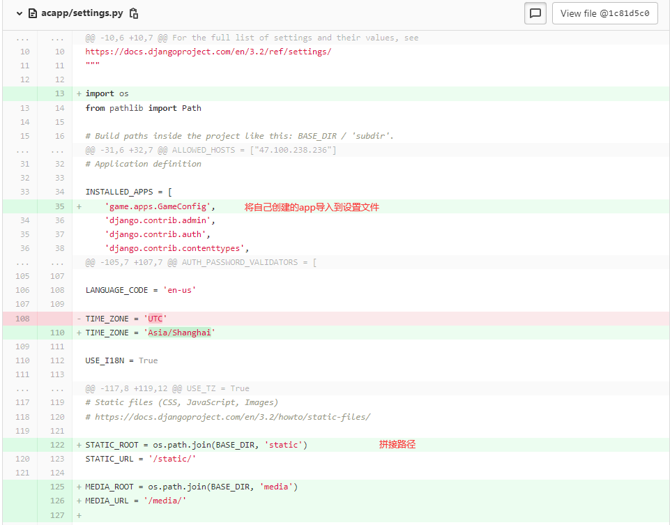
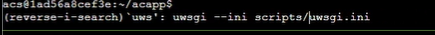

网页: http://124.220.192.97:8000/

项目: https://gitee.com/pro_ggq_915377549/django


## Python语法


输入的处理:  读入行String 对String进行处理

对于[全局变量](https://so.csdn.net/so/search?q=全局变量&spm=1001.2101.3001.7020)的修改，

如果全局变量是int或者str，那么如果想要在函数中对函数变量进行修改，则需要先在函数内，声明其为global，再进行修改

如果是list或者dict则可以直接修改

### 608. 差

```python
a = int(input()) # 读入一行 为字符串 转化为int
b = int(input())
c = int(input())
d = int(input())

print("DIFERENCA = %d" % (a * b - c * d))
```

### 665. 倍数

```Python
# 输入 6 24 
a, b = map(int, input().split(' '))

if a % b == 0 or b % a == 0:
    print("Sao Multiplos")
else:
    print("Nao sao Multiplos")   
```

### 670. 动物




```Python
a = input()
b = input()
c = input()

if a == "vertebrado":
    if b == "ave":
        if c == "carnivoro":
            print("aguia")
        elif c == "onivoro":
            print("pomba")
    elif b == "mamifero":
        if c == "onivoro":
            print("homem")
        elif c == "herbivoro":
            print("vaca")
elif a == "invertebrado":
    if b == "inseto":
        if c == "hematofago":
            print("pulga")
        elif c == "herbivoro":
            print("lagarta")
    else:
        if c == "hematofago":
            print("sanguessuga")
        else:
            print("minhoca")                  
```

### 660. 零食

```Python
a = [4.00, 4.50, 5.00, 2.00, 1.50]
x, y = map(int, input().split())

print("Total: R$ %.2f" %(a[x-1] * y))
```

### 721. 递增序列

读取一系列的整数 XX，对于每个 XX，输出一个 1,2,…,X1,2,…,X 的序列。

#### 输入格式

输入文件中包含若干个整数，其中最后一个为 00，其他的均为正整数。

每个整数占一行。

对于输入的正整数，按题目要求作输出处理。

对于最后一行的整数 00，不作任何处理。

#### 输出格式

对于每个输入的正整数 XX，输出一个从 11 到 XX 的递增序列，每个序列占一行。

#### 数据范围

1≤X≤1001≤X≤100

#### 输入样例：

```
5
10
3
0
```

#### 输出样例：

```
1 2 3 4 5
1 2 3 4 5 6 7 8 9 10
1 2 3
```

#### solution

```python
while True:
    x = int(input())
    if x == 0:
        break
    else:
        for i in range(1, x + 1):
            print(i, end = " ")
    print()  
```

### 726. 质数

一个大于 11 的自然数，如果除了 11 和它自身外，不能被其他自然数整除则称该数为质数。

例如 77 就是一个质数，因为它只能被 11 和 77 整除。

现在，给定你 NN 个大于 11 的自然数，请你依次判断这些数是否是质数。

#### 输入格式

第一行包含整数 NN，表示共有 NN 个测试数据。

接下来 NN 行，每行包含一个自然数 XX。

#### 输出格式

每个测试用例输出一个结果，每个结果占一行。

如果测试数据是质数，则输出 `X is prime`，其中 XX 是测试数据。

如果测试数据不是质数，则输出 `X is not prime`，其中 XX 是测试数据。

#### 数据范围

1≤N≤1001≤N≤100,
1<X≤1071<X≤107

#### 输入样例：

```
3
8
51
7
```

#### 输出样例：

```
8 is not prime
51 is not prime
7 is prime
```

#### Solution

```python
# 如果 d | x(d 是 x 的约数) 那么 x/d  也是 x的约数
# d | x 则 x/d | x   // 因此成对出现 , 因此枚举只需要枚举较小的因数就可以了 不妨设 d <= x / d
#  d <= 根号x (o(x) -> o(根号x)
# 例 d = 12  x = 24 
```

```python
import math
n = int(input())

for i in range(n):
    x = int(input())
    for j in range(2, int(math.sqrt(x)) + 1):
        if x % j == 0:
            print(x,"is not prime")
            break
    else:
        print(x,"is prime")
    #for的 else 语句: 执行 break 则不执行else 

```

### 745. 数组的右上半部分

#### Solution

```python
t = input()
s, c = 0, 0

for i in range(12):
    d = list(map(float, input().split()))
    for j in range(12):
        if j > i:
            s += d[j]
            c += 1

if t == "M": print("%.1f" % (s/c))
else: print("%.1f" % (s))
```

### 756. 蛇形矩阵

#### Solution

```python
n, m = map(int,input().split())

res = [[0 for j in range(m)] for i in range(n)]
dx = [0,1,0,-1] 
dy = [1,0,-1,0]
x, y, d = 0, 0, 0

for i in range(1, n * m + 1):
    res[x][y] = i
    a, b = x + dx[d], y + dy[d]
    if a < 0 or a >= n or b < 0 or b >= m or res[a][b]:
        d = (d + 1) % 4
        a, b = x + dx[d], y + dy[d]
    x, y = a, b
    
for i in range(n):
    for j in range(m):
        print(res[i][j], end = " ")
    print()
        
        
    

```

### 823. 排列

#### Solution

```python
n = int(input())
path = [0 for i in range(n)]
used = [False for i in range(n)]


def dfs(u):
    if u == n:
        for i in range(n):
            print(path[i] + 1, end = " ")
        print()
    else:
        for i in range(n):
            if used[i]:
                continue
            else:
                path[u] = i
                used[i] = True
                dfs(u+1)
                path[u] = 0
                used[i] = False
            
dfs(0)   


```


## 搭建环境

docker 挂起容器退出: 先 ctrl + p 在 ctrl + q

直接 ctrl + d 是关闭容器退出,tmux退出也是

### vim 


### **tmux**

博客: https://cloud.tencent.com/developer/article/1526675?from=15425

ctrl + a + { 复制  选中                          }  粘贴

tmux 默认 是b  可以更改设置文件为 a

tmux ctrl + a 类似 vim 的ESC模式 



ctrl + a + n 切换到下一个

ctrl + a  + p 切换到上一个

ctrl + a  + c 创建一个新的

### **Django**

将ac terminal的Django镜像上传到自己的云服务器
scp django_lesson_1_0.tar aliyun:
进入自己的云服务并将上传的镜像下载下来
ssh aliyun
docker load -i django_lesson_1_0.tar
生成容器，映射端口
docker run -p 20000:22 -p 8000:8000 --name django_server -itd django_lesson:1.0
进入容器，并配置用户权限
adduser ***
usermod -aG sudo ***
去阿里云开放端口后回到ac terminal配置免密登陆，以后直接ssh到docker容器中的用户
vim .ssh/config #添加Host django
ssh-copy-id django
scp .vimrc .bashrc .tmux.conf django: #配置vim和tmux
回到容器开始项目(记得在tmux中开始)
#创建项目
django-admin startproject acapp

#创建git仓库
git init 
git config --global user.name "***"
git config --global user.email "********@qq.com"

#将git仓库创建好后将公钥复制到git上，然后上传到git上
git push --set-upstream origin master

#看项目能不能跑
python3 manage.py runserver 0.0.0.0:8000

#将提示的东西加入到settings.py中
cd acapp/acapp
vim settings.py #第28行

#让git不在显示一些中间文件
vim .gitignore
    **/__pycache__
git add .
git commit -m "modify allowed host"
开始创建app
python3 manage.py startapp game

#将数据更新到Django中
python3 manage.py migrate 

#创建管理员账号
python3 manage.py createsuperuser
文件结构
touch urls.py
mkdir tmplates

models：存储class、user等
views：存储函数的实现   
urls：存储路由

// 以上三个可以是文件 后面都可以变为 文件夹

templates：存储html文件

## 第一个网页

#创建项目
django-admin startproject acapp, 会生成一个acapp目录

开始创建app
python3 manage.py startapp game

> 服务器目录结构
>
> 

运行项目 python3 manage.py runserver 0.0.0.0:8000

创建一个app

## 项目系统设计

**方法论**

代码太长了就分模块 , 

**项目系统设计**


menu：菜单页面
playground：游戏界面
settings：设置界面


在每个文件目录里都分类: 

**项目文件结构**
templates目录：管理html文件
urls目录：管理路由，即链接与函数的对应关系
views目录：管理http函数
models目录：管理数据库数据
static目录：管理静态文件，比如：
	css：对象的格式，比如位置、长宽、颜色、背景、字体大小等
	js：对象的逻辑，比如对象的创建与销毁、事件函数、移动、变色等
	image：图片
	audio：声音
	…
consumers目录：管理websocket函数


本节课用到的素材地址
背景图片
下载方式：wget --output-document=自定义图片名称 图片地址

jquery库：
<link rel="stylesheet" href="https://cdn.acwing.com/static/jquery-ui-dist/jquery-ui.min.css">

<script src="https://cdn.acwing.com/static/jquery/js/jquery-3.3.1.min.js"></script>

作者：yxc
链接：https://www.acwing.com/file_system/file/content/whole/index/content/3199626/
来源：AcWing
著作权归作者所有。商业转载请联系作者获得授权，非商业转载请注明出处。


全局设置



 


将文件变成文件夹: 底下是python文件 则需要创建  init文件


为什么不写成html 而是写成js渲染: 写成html的话会在后端渲染:就是所有用户请求网页都是后端把网页生成好在把网页返回前端,如果把文件传给用户,就是用户执行js进行渲染,提升用户体验

views/index.py只会在web用  返回刚刚写好的html(服务器端渲染,将html的字符串拼接) djanggo render(request,"目录从templates开始写")


urls 路由规则


constructor

js 习惯上如果是一个html对象 则在前面+一个 $


实现简易引擎 基类 AcGameObject

基类中的每个物体 每一帧都要重新画一次,因此创建一个物体的时候要把物体加入到一个全局数组里,之后 调用数组里的对象 每秒钟60次 

jQuery :


## 部署Nginx与对接app

> docker commit CONTAINER_NAME django_lesson:1.1  # 将容器保存成镜像，将CONTAINER_NAME替换成容器名称
> docker stop CONTAINER_NAME  # 关闭容器
> docker rm CONTAINER_NAME # 删除容器
>
> #使用保存的镜像重新创建容器
>
> docker run -p 20000:22 -p 8000:8000 -p 8001:80 -p 44301:443 --name django_server -itd django_lesson:1.1

sudo 下 vim高亮

> sudo cp .vimrc .tmux.conf /root/

