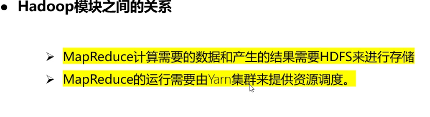
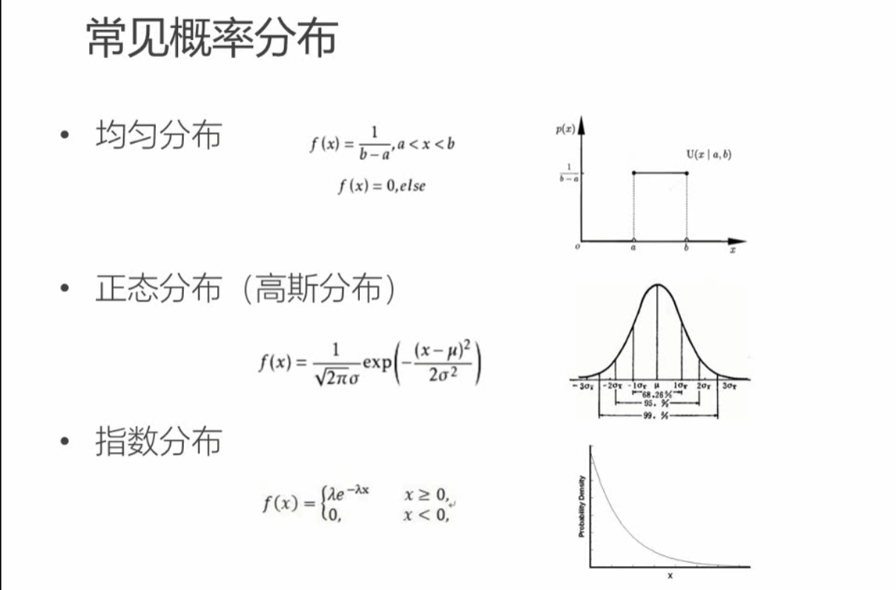

# 大数据组件笔记

## 一、 Hadoop

HDFS：分布式文件存储系统，大数据环境的基石
MapReduce(MR)：基于磁盘计算，主要用于大量数据的批处理计算
Spark(RDD)：基于内存计算
SparkSQL：一般情况都是基于离线数据处理
Spark Streaming：一般情况是基于微批(实时)处理

Flink 流式计算引擎
Flink SQL：类似SparkSQL，可以写SQL，更快的使用批处理操作
Flink Streaming：流式数据，(开发思路)生产库产生数据一部分发送至kafka、一部分落库，后续Filnk对接kafka中的Topic ，实时对kafka中数据进行去重、清洗、汇总、计算，维度可以存放至redis中。。。

## 二、 消息队列

Kafka：可理解生产者和消费者之间的数据传递，大数据量发送传递及消费，主要功能点是削峰填谷
MQ：主要运用于事务性消息队列，但是对于数据量来看，量级很小

## 三、 数据库(关系型、非关系型)

Hive：hive只是有个管理工具，不存储任何数据，将hdfs中的文件映射成表的形式进行数据处理，主要面向于(离线)数据仓库使用，内部执行引擎(MapReduce/Spark/Tez)，也可以开发一下自定义的UTF函数。
Impala：号称是当前大数据领域最快的查询sql工具，占用内存比较多，我们在工作中都是使用Hive+Impala做离线数仓。(即席查询)
Presto：一个分布式SQL查询引擎，整体性能还是可以的。(即席查询)
HBases： 典型的NoSQL、分布式存储的数据库，速度够快。
Kudu：在更新更及时的基础上实现更快的数据分析，个人感觉是在大量数据中做到更快的查询速度。
Kylin：分布式分析引擎，我们主要用于做OLAP多维数据立方体数据，就类似与Cognos中的动态CUBE。
ClickHouse：(不基于Hadoop集群，可独立安装)列式数据库，主要用于实时数据仓库，这个也是基于内存的，特点就是快。单表查询块，多表关联是弊端。(即席查询)
Doris：一个基于 MPP 架构的高性能、实时的分析型数据库，尽量使用星型模型，单表不要超过100列，(即席查询)

## 四、 ETL工具

Sqoop：主要是用于关系型数据与分布式数据库的数据抽取任务，类似MYSQL数据抽取至HDFS/Hive。sqoop底层运用的计算引擎也是MR，只不顾没有用到Reduce而已
SeaTunnel（WaterDrop）：大数据集群数据同步工具，主要引擎有spark和flink，Kakfa->PostgreSQL、ClinkHouse->PostgreSQL、MongoDB->PostgreSQL，PostgreSQL->HDFS等等。我就使用了这么多，其他的功能还需小伙伴继续钻研
DataX：阿里开发，可多线程抽取数据，但是会有一些数据丢失问题，可能是生产库数据有脏数据问题，有待考证。
FlinkX： 袋鼠云开源，有待考证。

## 五、 数据可视化

DataV：阿里开发
Datart(Davinci)：宜信开发，可支持中国式复杂报表开发，也支持图表等二三十种图表样式支持，可自定义开发图表组件
Superset：百度开源，现已贡献给Apache 开源基金会，图表绚丽

## 六、 任务调度工具

Azkaban：一个脚本任务调度工具，一般用于ETL脚本执行调度，需要单独配置调度文件。在文件中需要配置依赖脚本等信息，全程在WEB端开发，在查看调度的时候有点费眼睛，DAG图不可以缩得太小或太大
DolphinScheduler：俗称小海豚，国人开发的脚本调度工具，但是每次每一个脚本都得需要上传到服务器上，如果该工具能够支持git自动同步脚本文件的话，将是一个很好的脚本工具，开发及迁移都是很好使用的
Kettle：传统的ETL工具+调度工具，有两大特性：job和转换，win和linux都可以兼容，很好使的一个ETL处理工具
————————————————
版权声明：本文为CSDN博主「W-DW」的原创文章，遵循CC 4.0 BY-SA版权协议，转载请附上原文出处链接及本声明。
原文链接：https://blog.csdn.net/qq_36712507/article/details/106933379


# Windows 环境搭建


看过的博客:

https://cloud.tencent.com/developer/article/1818595

https://blog.csdn.net/qq_44186838/article/details/119965991

https://zhuanlan.zhihu.com/p/508841769


## hive

在Hive中 如果本地数据库是8.0 驱动jar包换成8.的版本 hive --service metastore 也有可能报错 如果报错了 把hive库删了重新手动初始化下

报错信息：

FAILED: Execution Error, return code 1 from org.apache.hadoop.hive.ql.exec.DDLTask. MetaException(message:An exception was thrown while adding/validating class(es) : You have an error in your SQL syntax; check the manual that corresponds to your MySQL server version for the right syntax to use near '[CHARACTER SET charset_name] [COLLATE collation_name] NULL,
    `VIEW_ORIGINAL_T' at line 14
java.sql.SQLSyntaxErrorException: You have an error in your SQL syntax; check the manual that corresponds to your MySQL server version for the right syntax to use near '[CHARACTER SET charset_name] [COLLATE collation_name] NULL,
    `VIEW_ORIGINAL_T' at line 14

hive --service metastore SQL语法报错解决

```

手动初始化
hive --service schematool -dbType mysql -initSchema

直接启动hive
hive Starting Hive Metastore Server
```


## 安装scala

https://blog.csdn.net/qq_46864949/article/details/123203397

不知道在安装啥的时候把scala安装好了 怕影响其他大数据组件,目录有空格将环境变量去掉了


需要在IDEA 中安装Scala插件


ok后就可正常开发scala了

## Flume

https://blog.csdn.net/moshowgame/article/details/80379402


Hive与Hbase区别


一、Hbase： Hadoop database 的简称，也就是基于Hadoop数据库，是一种NoSQL数据库，主要适用于海量明细数据(十亿、百亿)的随机实时查询，如日志明细、交易清单、轨迹行为等。

二、Hive：Hive是Hadoop数据仓库，严格来说，不是数据库，主要是让开发人员能够通过SQL来计算和处理HDFS上的结构化数据，适用于离线的批量数据计算。

\1. Hive用于批处理，而HBase用于事务处理。

\2. Hive是查询引擎,而Hbase是 非结构化数据的数据存储。

\3. Hive是运行MapReduce作业的类似SQL的引擎，而HBase 是Hadoop上的NoSQL键/值数据库


## Spark

启动spark : spark-shell.cmd

## sparkSQL集成 hive hbase mysql

https://blog.csdn.net/u011254180/article/details/79395227


# spark1.6 ->2.4升级问题

https://blog.csdn.net/aoyugang0603/article/details/102442007

# 项目搭建

## JavaWeb

https://blog.csdn.net/u014636209/article/details/104261350/

https://blog.csdn.net/weixin_43977226/article/details/118614918


根据代码 修改组件的端口号设置

hadoop

```xml
2）修改配置文件

            A）vi /home/hadoop-2.6.4/etc/hadoop/hadoop-env.sh

                   修改为export JAVA_HOME=/usr/java/jdk1.7.0_79（jdk地址）

            B）vi /home/hadoop-2.6.4/etc/hadoop/core-site.xml

            <configuration>
                <property>
                    //配置namenode主机和端口
                    <name>fs.defaultFS</name>

                    <value>hdfs://spark1:9000</value>  

                 </property>

                <property>
                    //配置hadoop的临时文件目录以及fsimage文件目录，不能放在temp下
                    <name>hadoop.tmp.dir</name>
                    <value>/opt/hadoop-2.6</value>
                </property>
            </configuration>

            C）vi /home/hadoop-2.6.4/etc/hadoop/hdfs-site.xml，配置secondary namenode主机名和端口

            <configuration>

                 <property>

                     <name>dfs.namenode.http-address</name>

                     <value>spark1:50070</value>

                 </property>

                 <property>

                     <name>dfs.namenode.secondary.https-address</name>

                     <value>spark1:50090</value>

                  </property>

             </configuration>

```

```xml

2）修改配置文件

            A）vi /home/hadoop-2.6.4/etc/hadoop/hadoop-env.sh

                   修改为export JAVA_HOME=/usr/java/jdk1.7.0_79（jdk地址）

            B）vi /home/hadoop-2.6.4/etc/hadoop/core-site.xml

            <configuration>
                <property>
                    //配置namenode主机和端口
                    <name>fs.defaultFS</name>

                    <value>hdfs://spark1:9000</value>  

                 </property>

                <property>
                    //配置hadoop的临时文件目录以及fsimage文件目录，不能放在temp下
                    <name>hadoop.tmp.dir</name>
                    <value>/opt/hadoop-2.6</value>
                </property>
            </configuration>

            C）vi /home/hadoop-2.6.4/etc/hadoop/hdfs-site.xml，配置secondary namenode主机名和端口

            <configuration>

                 <property>

                     <name>dfs.namenode.http-address</name>

                     <value>spark1:50070</value>

                 </property>

                 <property>

                     <name>dfs.namenode.secondary.https-address</name>

                     <value>spark1:50090</value>

                  </property>

             </configuration>

            D）vi /home/hadoop-2.6.4/etc/hadoop/slaves，配置datanode的主机名
                spark1
                spark2
                spark3
            E）vi /home/hadoop-2.6.4/etc/hadoop/masters（这个文件原本是没有的）
                spark1（只需输入这个，为namenode主机）
            F）配置hadoop的环境变量
                vi ~/.bash_profile
                export HADOOP_HOME=/home/hadoop-2.6.4
                export PATH=$PATH:$HADOOP_HOME/bin:$HADOOP_HOME/sbin

    3）格式化hdfs，只能在namenode主机（spark1）上执行
        hdfs namenode -format
    4）启动hdfs（在namenode上启动，已经配置免密码登录了，具体配置见免密码登录）
        start-dfs.sh   （stop-dfs.sh为关闭）
    5）在浏览器登录查看
            spark1:50070       //50070为namenode的http监控的端口，spark1已经在hosts文件中与ip相映射

            spark1:50090       //secondary namenode的监控端口

```


代码位置

D:\IDEA\projects\Movie_Recommend-master\Spark_Movie\src\main\scala\com\zxl>


数据清洗

```python
**数据的清洗：** （上传数据至hdfs中，[hdfs操作](http://blog.csdn.net/u011254180/article/details/79399422)）

到自己配置的响应的文件目录

1）启动 hdfs：  [root@spark1 ~]# start-dfs.sh

2）启动 yarn：  [root@spark1 ~]# start-yarn.sh

3）启动 mysql： [root@spark2 ~]# service mysqld start

**这一步配置好 hive后就不用了** 4）启动 hive：  [root@spark1 ~]# hive --service metastore

# 5）启动 spark集群： [root@spark1 spark-1.6.1]# ./sbin/start-all.sh 
启动spark ..\spark-2.4.2-bin-hadoop2.7\bin\spark-shell.cmd

6）代码(com.zxl.datacleaner.ETL)打包上传（[spark-sql与hive集成](http://blog.csdn.net/u011254180/article/details/79395227)）

- 代码位于 package com.zxl.datacleaner.ETL，打包为 ETL.jar
# 打包操作 todo
D:\IDEA\projects\Movie_Recommend-master\Spark_Movie\src\main\scala\com\zxl>
- 运行代码 spark-submit --class com.zxl.datacleaner.ETL --total-executor-cores 2 --executor-memory 2g lib/ETL.jar
- 成功于hive中建表
```


**5.数据的加工，** 根据ALS算法对数据建立模型([ALS论文](https://github.com/ZzXxL1994/Machine-Learning-Papers/tree/master/ALS))

1）启动 hdfs：  [root@spark1 ~]# start-dfs.sh

2）启动 yarn：  [root@spark1 ~]# start-yarn.sh

3）启动 mysql： [root@spark2 ~]# service mysqld start

4）启动 hive：  [root@spark1 ~]# hive --service metastore

5）启动 spark集群： [root@spark1 spark-1.6.1]# ./sbin/start-all.sh

6）代码(com.zxl.datacleaner.RatingData)打包上传，测试建立模型

**6.建立模型，** 根据RMSE(均方根误差)选取较好的模型

1）启动上述的服务

2）代码(com.zxl.ml.ModelTraining)打包上传，建立模型

注：com.zxl.ml.ModelTraining2中代码训练单个模型，其中参数 rank=50, iteration = 10, lambda = 0.01

- 代码位于 package com.zxl.ml.ModelTraining，打包为 Spark_Movie.jar
- 运行代码 spark-submit --class com.zxl.ml.ModelTraining lib/Spark_Movie.jar

**7.产生推荐结果**

1）启动上述的服务

2）代码(com.zxl.ml.Recommender)打包上传，产生推荐结果

**8.数据入库，** 存储为所有用户推荐的电影结果，mysql中存入的格式为(userid, movieid,rating)

1）启动上述的服务

2）代码(com.zxl.ml.RecommendForAllUsers)打包上传，数据入库

- 运行代码 spark-submit --class com.zxl.ml.RecommendForAllUsers --jars lib/mysql-connector-java-5.1.35-bin.jar lib/Spark_Movie.jar

**9.实时数据的发送**

1）[安装nginx](https://blog.csdn.net/u011254180/article/details/77897663)，用来接收电影网站上用户的点击信息，写入本地文件

2）[安装flume](https://blog.csdn.net/u011254180/article/details/80000763)，实时监控本地文件，将数据发送至kafka消息队列中

**10.实时数据的接收处理** ，如果打包到服务器运行错误，也可在本地IDEA上运行

1）[安装zookeeper](http://blog.csdn.net/u011254180/article/details/79480234)

2）[安装kafka](http://blog.csdn.net/u011254180/article/details/79481088)，用来接收发送数据

3）启动上述的服务

4）启动zookeeper：  [root@spark1 soft]# zkServer.sh start

4）启动flume：[root@spark1 flume]# bin/flume-ng agent -c ./conf/ -f conf/flume-conf.properties -Dflume.root.logger=DEBUG,console -n a1

5）启动kafka：  [root@spark1 kafka_2.11-0.10.1.0]# bin/kafka-server-start.sh config/server.properties

6）代码(com.zxl.datacleaner.PopularMovies2)运行，用于为没有登录或新用户推荐，默认推荐观看最多的5部电影

7）代码运行(需指定jar包 kafka-clients-0.10.1.0.jar)

- spark-submit --class com.zxl.streaming.SparkDrStreamALS --total-executor-cores 2 --executor-memory 1g --jars lib/kafka-clients-0.10.1.0.jar lib/Spark_Movie.jar


# 项目学习

下载数据集

spark操作将数据集上传到hdfs     "hdfs://spark1:9000/movie/data/links.txt"

```scala
 val ratings = sc.textFile("hdfs://spark1:9000/movie/data/ratings.txt", minPartitions).filter { !_.endsWith(",") }
      .map(_.split(",")).map(x => Ratings(x(0).trim().toInt, x(1).trim().toInt, x(2).trim().toDouble, x(3).trim().toInt)).toDF()
```

> 这里面spark的作用
>
> Spark(RDD)：基于内存计算
> SparkSQL：一般情况都是基于离线数据处理

ETL:  将表存到hive, 数据写入hdfs

> hive 与  hdfs:
>
> 7）Hbase：HBase 是一个分布式的、面向列的开源数据库。HBase 不同于一般的关系数据库， 它是一个适合于非结构化数据存储的数据库。 
>
> 8）Hive：Hive 是基于 Hadoop 的一个数据仓库工具，可以将结构化的数据文件映射为一张 数据库表，并提供简单的 SQL 查询功能，可以将 SQL 语句转换为 MapReduce 任务进行运 行。其优点是学习成本低，可以通过类 SQL 语句快速实现简单的 MapReduce 统计，不必开 发专门的 MapReduce 应用，十分适合数据仓库的统计分析。
>
> hdfs的分布式: 是因为一个系统存储不下所有数据

Hive：hive只是有个管理工具，不存储任何数据，将hdfs中的文件映射成表的形式进行数据处理，主要面向于(离线)数据仓库使用，内部执行引擎

# 爬虫


# Spark

## 概念


DataSet 是将DataFrame转换为对象的结果


## 操作外置Hive


## 实操

默认情况下，Spark 可以将一个作业切分多个任务后，发送给 Executor 节点并行计算，而能 够并行计算的任务数量我们称之为并行度。这个数量可以在构建 RDD 时指定。记住，这里 的并行执行的任务数量，并不是指的切分任务的数量，不要混淆了。


### **RDD算子**

```scala
//map
val dataRDD: RDD[Int] = sparkContext.makeRDD(List(1,2,3,4))
val dataRDD2: RDD[String] = dataRDD.map(
 num => {
 "" + num
 }
)
//mapPartitions 
//将处理的数据以分区为单位发送到计算节点进行处理，这里的处理是指可以进行任意的处
//理，哪怕是过滤数据。
//Map 算子因为类似于串行操作，所以性能比较低，而是 mapPartitions 算子类似于批处
//理，所以性能较高。但是 mapPartitions 算子会长时间占用内存，那么这样会导致内存可能
//不够用，出现内存溢出的错误。所以在内存有限的情况下，不推荐使用。使用 map 操作。
val dataRDD1: RDD[Int] = dataRDD.mapPartitions(
 datas => {
 datas.filter(_==2)
 }
)
//flatmap 扁平映射
val dataRDD = sparkContext.makeRDD(List(
 List(1,2),List(3,4)
),1)
val dataRDD1 = dataRDD.flatMap(
 list => list
)
//groupby
val dataRDD = sparkContext.makeRDD(List(1,2,3,4),1)
val dataRDD1 = dataRDD.groupBy(
 _%2
)
// filter 符合规则的数据保留，不符合规则的数据丢弃
val dataRDD = sparkContext.makeRDD(List(
 1,2,3,4
),1)
val dataRDD1 = dataRDD.filter(_%2 == 0)
//distinct 
val dataRDD = sparkContext.makeRDD(List(
 1,2,3,4,1,2
),1)
val dataRDD1 = dataRDD.distinct()
val dataRDD2 = dataRDD.distinct(2)
//collect
//在驱动程序中，以数组 Array 的形式返回数据集的所有元素
val rdd: RDD[Int] = sc.makeRDD(List(1,2,3,4))
// 收集数据到 Driver
rdd.collect().foreach(println)
//take
返回一个由 RDD 的前 n 个元素组成的数组
val rdd: RDD[Int] = sc.makeRDD(List(1,2,3,4))
// 返回 RDD 中元素的个数
val takeResult: Array[Int] = rdd.take(2)
println(takeResult.mkString(","))
val rdd: RDD[Int] = sc.makeRDD(List(1,3,2,4))
// 返回 RDD 中元素的个数
val result: Array[Int] = rdd.takeOrdered(2)
// 将数据保存到不同格式的文件中
// 保存成 Text 文件
rdd.saveAsTextFile("output")
// 序列化成对象保存到文件
rdd.saveAsObjectFile("output1")
// 保存成 Sequencefile 文件
rdd.map((_,1)).saveAsSequenceFile("output2")
//foreach
val rdd: RDD[Int] = sc.makeRDD(List(1,2,3,4))
// 收集后打印
rdd.map(num=>num).collect().foreach(println)
println("****************")
// 分布式打印
rdd.foreach(println)
```


### RDD文件读取与保存


### 创建df

1从spark数据源进行创建


2RDD转换


 


3HIVE Table 进行查询返回


## 打包代码


build之后打成jar包

运行jar包:

启动spark : 了解下master  worker


# Hadoop

## Yarn

Yarn 是一个资源调度平台，负责为运算程序提供服务器运算资源，相当于一个分布式 的操作系统平台，而 MapReduce 等运算程序则相当于运行于操作系统之上的应用程序。


YARN 主要由 ResourceManager、NodeManager、ApplicationMaster 和 Container 等组件 构成。


## HDFS





# Scala


```scala
【scala】下划线用法总结

1. 用于变量的初始化
在Scala中，变量在声明时必须显示指定，可以使用下划线对变量进行初始化。而且该语法只适用于成员变量，不适用于局部变量。例：


对于Int来说，它是0。
对于Double来说，它是0.0
对于引用类型，它是null

2. 用于导包引入
导包引入时使用_导入该包下所有内容，类比Java中的*。例如：


3. 用于将方法转变为函数
在Scala中方法不是值，而函数是。所以一个方法不能赋值给一个val变量，而函数可以。方法可以转换为函数赋值给变量，例：


4. 用于模式匹配
模式匹配中可以用下划线来作为Java中default的类比使用，也可以在匹配集合类型时，用于代表集合中元素，例：


5. 用户访问tuple元素


6. 下划线与星号
向函数或方法传入可变参数时不能直接传入Range或集合或数组对象，需要使用:_*转换才可传入

6.1 变长参数
例如定义一个变长参数的方法sum，然后计算1-5的和，可以写为

scala> def sum(args: Int*) = {
     | var result = 0
     | for (arg <- args) result += arg
     | result
     | }
sum: (args: Int*)Int
​
scala> val s = sum(1,2,3,4,5)
s: Int = 15

但是如果写成这种方式就会报错

scala> val s = sum(1 to 5)
<console>:12: error: type mismatch;
 found : scala.collection.immutable.Range.Inclusive
 required: Int
       val s = sum(1 to 5)
                     ^

这种情况必须在后面写上: _*将1 to 5转化为参数序列

scala> val s = sum(1 to 5: _*)
s: Int = 15
1
2
6.2 变量声明中的模式
下面代码分别将arr中的第一个和第二个值赋给first和second

scala> val arr = Array(1,2,3,4,5)
arr: Array[Int] = Array(1, 2, 3, 4, 5)
​
scala> val Array(first, second, _*) = arr
first: Int = 1
second: Int = 2

```


```scala
1）说明
（1）过滤
遍历一个集合并从中获取满足指定条件的元素组成一个新的集合
（2）转化/映射（map）

 将集合中的每一个元素映射到某一个函数
（3）扁平化
（4）扁平化+映射 注：flatMap 相当于先进行 map 操作，在进行 flatten 操作
集合中的每个元素的子元素映射到某个函数并返回新集合
（5）分组(group)
按照指定的规则对集合的元素进行分组
（6）简化（归约）
 （7）折叠
2）实操
object TestList {
 def main(args: Array[String]): Unit = {
 val list: List[Int] = List(1, 2, 3, 4, 5, 6, 7, 8, 9)
 val nestedList: List[List[Int]] = List(List(1, 2, 3), List(4,
5, 6), List(7, 8, 9))
 val wordList: List[String] = List("hello world", "hello
atguigu", "hello scala")
 //（1）过滤
 println(list.filter(x => x % 2 == 0))
 //（2）转化/映射
 println(list.map(x => x + 1))
 //（3）扁平化
 println(nestedList.flatten)
 //（4）扁平化+映射 注：flatMap 相当于先进行 map 操作，在进行 flatten
操作
 println(wordList.flatMap(x => x.split(" ")))
 //（5）分组
 println(list.groupBy(x => x % 2))
 }
}
3）Reduce 方法

Reduce 简化（归约） ：通过指定的逻辑将集合中的数据进行聚合，从而减少数据，最
终获取结果。
案例实操
object TestReduce {
 def main(args: Array[String]): Unit = {
 val list = List(1,2,3,4)
 // 将数据两两结合，实现运算规则
 val i: Int = list.reduce( (x,y) => x-y )
 println("i = " + i)
 // 从源码的角度，reduce 底层调用的其实就是 reduceLeft
 //val i1 = list.reduceLeft((x,y) => x-y)
 // ((4-3)-2-1) = -2
 val i2 = list.reduceRight((x,y) => x-y)
 println(i2)
 }
}
4）Fold 方法
Fold 折叠：化简的一种特殊情况。
（1）案例实操：fold 基本使用
object TestFold {
 def main(args: Array[String]): Unit = {
 val list = List(1,2,3,4)
 // fold 方法使用了函数柯里化，存在两个参数列表
 // 第一个参数列表为 ： 零值（初始值）
 // 第二个参数列表为： 简化规则
 // fold 底层其实为 foldLeft
 val i = list.foldLeft(1)((x,y)=>x-y)
 val i1 = list.foldRight(10)((x,y)=>x-y)
 println(i)
 println(i1)
 }
}

object TestFold {
 def main(args: Array[String]): Unit = {
 // 两个 Map 的数据合并
 val map1 = mutable.Map("a"->1, "b"->2, "c"->3)
 val map2 = mutable.Map("a"->4, "b"->5, "d"->6)
 val map3: mutable.Map[String, Int] = map2.foldLeft(map1)
{
 (map, kv) => {
 val k = kv._1
 val v = kv._2
 map(k) = map.getOrElse(k, 0) + v
 map
 }
 }
 println(map3)
 }
}
```


case class，它其实就是一个普通的class。但是它又和普通的class略有区别，如下：
　　**1、初始化的时候可以不用new，当然你也可以加上，普通类一定需要加new；**


object

1. 伴生对象中的内容,都可以通过类名访问,来模拟java中的静态语法
2. 伴生对象的语法规则：使用object声明[加上就一定能够使用类名来访问]


# Flume 数据采集


# 机器学习和推荐系统

## 数学基础

矩阵乘法: 行定列移

矩阵转置: 行列交换

倒数: 沿x正方向斜率 


变化大的地方 好求最大值最小值





## 机器学习


## 推荐算法


```python

基于内容的推荐算法
Content-based Recommendations (CB)根据推荐物品或内容的元数据,发
现物品的相关性，再基于用户过去的喜好记录，为用户推荐相似的物品。
通过抽取物品内在或者外在的特征值，实现相似度计算。
-比如一个电影，有导演、演员、用户标签UGC、用户评论、时长、风格等等，都可以算是特
征。
， 将用户(user) 个人信息的特征(基于喜好记录或是预设兴趣标签)，和物
品(item)的特征相匹配，就能得到用户对物品感兴趣的程度
-在一些电影、音乐、图书的社交网站有很成功的应用，有些网站还请专业的人员对物品进行基
因编码/打标签(PGC)
```


### 相似度


### 基于内容


### 基于UGC 


### 协同过滤


```
基于内容的推荐算法
Content-based Recommendations (CB)根据推荐物品或内容的元数据,发
现物品的相关性，再基于用户过去的喜好记录，为用户推荐相似的物品。
通过抽取物品内在或者外在的特征值，实现相似度计算。
-比如一个电影，有导演、演员、用户标签UGC、用户评论、时长、风格等等，都可以算是特
征。
， 将用户(user) 个人信息的特征(基于喜好记录或是预设兴趣标签)，和物
品(item)的特征相匹配，就能得到用户对物品感兴趣的程度
-在一些电影、音乐、图书的社交网站有很成功的应用，有些网站还请专业的人员对物品进行基
因编码/打标签(PGC)
```


### 基于近邻


```
LFM降维方法一矩阵因子分解
●假设用户物品评分矩阵为R, 现在有m个用户，n个物品
●我们想要发现k 个隐类,我们的任务就是找到两个矩阵P和Q,使这两个矩阵的乘积
近似等于R,即将用户物品评分矩阵R分解成为两个低维矩阵相乘:
```


```
矩阵因子分解
如果得到的预测评分矩阵R与原评分矩阵R在已知评分位置上的值都近似，那么我们认
为它们在预测位置上的值也是近似的
```


```
LFM的进一步理解
●我们可以认为，用户之所以给电影打出这样的分数,是有内在原因的，我们可以挖掘
出影响用户打分的隐藏因素，进而根据未评分电影与这些隐藏因素的关联度,决定此
未评分电影的预测评分
● 应该有一些隐藏的因素，影响用户的打分，比如电影:演员、题材、年代..甚至不- -定
是人直接可以理解的隐藏因子
●找到隐藏因子，可以对user和item 进行关联(找到是由于什么使得user 喜欢/不喜
欢此item,什么会决定user喜欢/不喜欢此item)，就可以推测用户是否会喜欢某一部未看过的电影
```


```
●对于用户看过的电影， 会有相应的打分，但一个用户不可能看过所有电影,对于用户没
有看过的电影是没有评分的，因此用户评分矩阵大部分项都是空的，是一个稀疏矩阵
●如果我们能够根据用户给已有电影的打分推测出用户会给没有看过的电影的打分,那么
就可以根据预测结果给用户推荐他可能打高分的电影
```


预测的误差 就是损失函数


```
// rank：对应的是隐因子的个数，这个值设置越高越准，但是也会产生更多的计算量。一般将这个值设置为10-200
//      隐因子：如一部电影，决定它评分的有导演、主演、特效和剧本4个隐因子
// iterations：对应迭代次数，一般设置个10就够了；
// lambda：该参数控制正则化过程，其值越高，正则化程度就越深。一般设置为0.01
// val model = ALS.train(ratingRDD, 1, 10, 0.01)
```

## 项目


### 离线


矩阵存成表的问题


### 实时


# Spark实操

## 前言

spark 处理数据:

```scala

```


## 

## 项目


方法里面定义隐式参数, 后面调用的时候省去传参, 就会在当前 全局作用域里找到同类型的隐式变量传入

 jblas java中跟线性代数相关的库

模型训练 ALS参数


