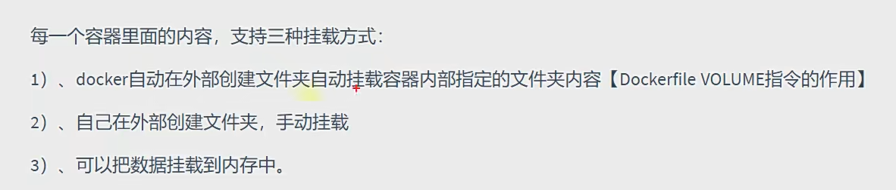
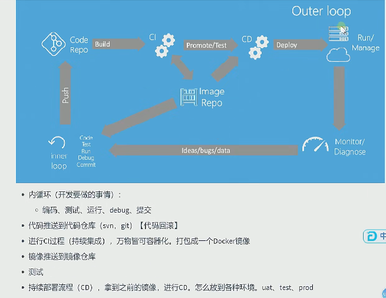

# 入门

蓝绿部署:                                           

​	蓝环境: 稳定部署v1

​	绿环境: 测试v2,蓝绿切换

CI/CD 持续集成/持续部署

DevOps 开发与运维的合体

# 容器化

隔离原理: 

​	namespace(命名空间隔离)

​	cgroups 资源限制()


安装 yum配置, 安装docker


```python
alpine:超级件经典linux版本 只有5mb
没有alpine 就是centos 会大一些
Ctrl + c 退出 

1. 下载镜像 dockr pull xxx:版本
2. docker images 查看已下载镜像
	镜像管理操作 docker image --help
3. docker run xxx:版本号 启动镜像
4. dockr rm xxx:版本号 删运行的容器
    
    默认前台启动 一般加上 -d 后台启动
5. dockr rmi xxx:版本号 # 删镜像 -f 强制删
6. 删除全部镜像 docker rmi -f $(docker images -aq)
7. docker create [设置项] 镜像名 [启动] [启动参数..]
	docker create --name myredis
     -p 6379:6379 redis
状态是已建好	 需要 docker start xxx
docker pause xxx
8. docker logs -f mynginxs
9. docker attach xxx 绑定控制台
10. docker exec -it xxx /bin/bash(控制台)
	exit 退出
11. docker inspect 镜像/容器/volume 等的详情
12. docker cp [OPTIONS] name:/    /export
13. docker diff xxx 
14. docker commit -a ggq -m "first commit" xxx myxxx:v4 
	docker images 就会有, 一般运行中的容器会一直更改, 就要用commit
15. docker login 
16. Dockerhub网站
docker tag myxxx:tagname       oneyeartwoyear/ggq_bigdata_env:v1
17. docker push oneyeartwoyear/ggq_bigdata_env:v1
18 docker export -o xxx.tar xxx: 方便优盘传输
19. docker import xxx.tar xxx:tagname


```

> ## exec
>
>                                                                         

>## 镜像推送细节
>
>
>
>

>## docker build
>
>ls
>
>Dockerfile(这是一个文件)
>
>docker build -t xxx:xxx -f Dockerfile ./
>
>

容器挂载




**docker-compose**

写一个yaml 指定所有需要的启动的容器

# CI/DI





## Jenkins


# kubernetes K8S  CRI (Container Runtime Interface)