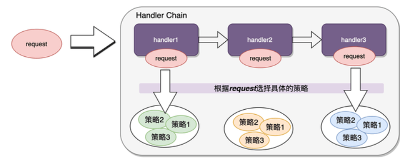

## 策略模式&责任链模式

责任链:

​	场景一: 一个请求可以有多个handler进行处理, 具体使用哪些需要动态确定

​	AOP: 通过递归实现责任链, 将通知方法包装成责任链的每一个节点, 巧妙利用责任链模式完成了目标方法的处理增强

策略模式:

- 优化if-else, 按需选择
- 扩展策略点可插拔: beanpostprocessor 就是模版加策略 可选用不同策略改变bean属性
- SpringBoot配合conditional自动装配符合按需的思想

两者结合: 

​	一个请求可以有多个handler进行处理, 每一个handler也有不同的策略

