# SpringBoot 


后端返回静态页面需要的注解的原理, 与静态页面的渲染结构,梳理其中关节

> controller中的方法中的参数由请求URL或请求体中传入
>
> theamleaf是动态模版引擎是在后端(返回视图之前)进行渲染
>
> The rendering of the Thymeleaf template is done by the Spring MVC framework during the view resolution phase. After the controller method has returned the view name, Spring MVC looks for a view resolver that can resolve the view name to an actual view. In this case, the view resolver will look for a Thymeleaf template with the name admin/user-list.html and render it with the data from the Map object.
>
> 渲染方式: 
>
> @RequestMapping方法中第一个map<String,Object> 的参数都是用来与theamleaf这种与view传递数据的 map.put(key,value)
>
> 只需要在theamleaf使用对应语法获取key对应数据即可


# Spring5

## 5.2进步方向

基于JDK8进行更新

函数式编程:

接口默认方法: 减少大量的接口实现编写, 只关注有用的, 接口提供默认的实现

@Nullable和@NonNull的严格声明

通过约定哪些不用注解来减少反射, 扫描损耗性能通过建立索引来减少扫描, 通过配置减少代理(todo)

servlet 与webflux  两个都是web, servlet类似同步, webflux类似异步

spring底层的netty使用(todo)

## 设计思想

对Bean的生命周期进行管理, 更好的服务于代码运行, 上下文存储了各种程序运行的信息, 就像写算法一样, 去挑选数据结构高效的存储与访问要用的数据,  将要完成的复杂功能进行分步逐步完成: 比如fresh容器 , 用面向对象的思想完成功能实现

## 看源码目的:

了解运行机制, 优化使用性能,  能够实现更加复杂的功能(更加灵活的使用, 实现定制化)

例如: Spring 集成类似Mybatis这种其他框架的思路

例如: SpringBoot 可插拔式的插件集成

最后才是应付面试()

# 手写Spring

实现IOC容器

> 注册Bean, 将Bean放入容器, 使用Bean的时候进行自动注入
>
> 自动注入依靠后置处理器机制, 实现AOP, 事务

Class类型:Class是一个类的模版, 可以通过类的Class获取这个类的方法,属性,注解信息等

**@Interface** 

> @Retention和@Target
>
> 是元注解，它们用于指定注解的保留策略和作用域
>
> 

# 第0章 Spring内置的能够使用的工具速查

## 注册Bean到IOC容器

### 1. BeanDefinition


通过创建一个BD可以设置BD的类型等,然后调用容器注册BD方法注册bean到容器中, 

我们还可以通过BeanDefinition设置一个Bean的其他属性

```java
beanDefinition.setScope("prototype"); // 设置作用域
beanDefinition.setInitMethodName("init"); // 设置初始化方法
beanDefinition.setLazyInit(true); // 设置懒加载
```

和申明式事务、编程式事务类似，通过<bean/>，@Bean，@Component等申明式方式所定义的Bean，最终都会被Spring解析为对应的BeanDefinition对象，并放入Spring容器中。

## BeanDefinitionReader
注解 单个注解读取器, xml读取器, 包扫描reader对扫描到的类解析

### AnnotatedBeanDefinitionReader

BDreader可以直接把某个类转换为BeanDefinition，并且会解析该类上的注解，比如

注意：它能解析的注解是：@Conditional，**@Scope**、@Lazy、@Primary、@DependsOn、@Role、@Description

### XmlBeanDefinitionReader

可以解析<bean/>标签


### ClassPathBeanDefinitionScanner

ClassPathBeanDefinitionScanner是扫描器，但是它的作用和BeanDefinitionReader类似，它可以进行扫描，扫描某个包路径，对扫描到的类进行解析，比如，扫描到的类上如果存在@Component注解，那么就会把这个类解析为一个BeanDefinition


### 事件发布

先定义一个事件监听器 实现ApplicationListener接口 onApplication(event)方法

然后发布一个事件：

```java
// 可以用ApplicationEventListener.publishEvent()

context.publishEvent("kkk");
// 这个底层用的就是上面的
//执行到publish之后 事件监听就会执行onApplicationEvent方法
```

## 类型转化
```java
@Value("ggq")
public User user;
// 报错 类型不匹配
```


### PropertyEditor

这其实是JDK中提供的类型转化工具类


### ConversionService

Spring中提供的类型转化服务，它比PropertyEditor更强大


```java
@Bean
public ConversionServiceFactoryBean conversionService() {
 ConversionServiceFactoryBean conversionServiceFactoryBean = new ConversionServiceFactoryBean();
 conversionServiceFactoryBean.setConverters(Collections.singleton(new StringToUserConverter()));

 return conversionServiceFactoryBean;
}
```

### TypeConverter

整合了PropertyEditor和ConversionService的功能，是Spring内部用的


## OrderComparator

OrderComparator是Spring所提供的一种比较器，可以用来根据@Order注解或实现Ordered接口来执行值进行笔记，从而可以进行排序。


## MetadataReader、ClassMetadata、AnnotationMetadata

在Spring中需要去解析类的信息，比如类名、类中的方法、类上的注解，这些都可以称之为类的元数据，所以Spring中对类的元数据做了抽象，并提供了一些工具类。

MetadataReader表示类的元数据读取器，默认实现类为**SimpleMetadataReader**。比如：


需要注意的是，SimpleMetadataReader去解析类时，使用的**ASM技术**。

> 并不是等Java类加载到JVM在解析,而是直接读取字节码文件

为什么要使用ASM技术，Spring启动的时候需要去扫描，如果指定的包路径比较宽泛，那么扫描的类是非常多的，那如果在Spring启动时就把这些类全部加载进JVM了，这样不太好，所以使用了ASM技术。

## ExcludeFilter和IncludeFilter

这两个Filter是Spring扫描过程中用来过滤的。ExcludeFilter表示**排除过滤器**，IncludeFilter表示**包含过滤器**。

比如以下配置，表示扫描com.zhouyu这个包下面的所有类，但是排除UserService类，也就是就算它上面有@Component注解也不会成为Bean。

FilterType分为：

1. ANNOTATION：表示是否包含某个注解
2. ASSIGNABLE_TYPE：表示是否是某个类
3. ASPECTJ：表示否是符合某个Aspectj表达式
4. REGEX：表示是否符合某个正则表达式
5. CUSTOM：自定义

在Spring的扫描逻辑中，默认会添加一个AnnotationTypeFilter给includeFilters，表示默认情况下Spring扫描过程中会认为类上有@Component注解的就是Bean。


# 第一章 Spring底层核心原理解析

Spring串讲,从整体上了解Spring

1. Bean的生命周期底层原理
2. 依赖注入底层原理
3. 初始化底层方法
4. (推断构造方法底层方法)
5. AOP底层原理
6. 事务底层原理

## Spring的使用


        //run方法返回一个IOC容器


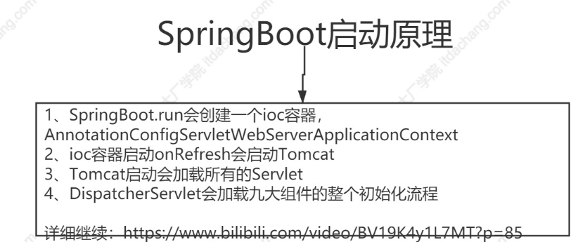


## Spring中是如何创建一个对象？


## Bean的创建过程

Bean的大概创建生命周期

1. 推断构造函数实例化一个对象
   1. 默认无参构造
   2. 选择指定
   3. 有参推断
2. 依赖注入
3. 之后Aware回调(判断是否实现各种XxxxAware接口,实现接口的各种setXxxx放方法)
4. 初始化前:判断是否存在@PostConstruct方法,存在则调用(初始化前)
5. 初始化:是否实现InitaillizingBean接口,如果实现则要实现其的afterPropertySet()方法
6. 初始化后:最后判断需不需要AOP,如果不需要那么Bean就创建完了,否则进行动态代理生成代理对象
   1. AOP大致流程

如果当前Bean是原型Bean，那么后续没有其他动作，不会存入一个Map，下次getBean时会再次执行上述创建过程，得到一个新的Bean对象。

## AOP大致流程

AOP就是进行动态代理，在创建一个Bean的过程中，Spring在最后一步会去判断当前正在创建的这个Bean是不是需要进行AOP，如果需要则会进行动态代理。
​

如何判断当前Bean对象需不需要进行AOP:

利用cglib进行AOP的大致流程：

1. 生成代理类UserServiceProxy，代理类继承UserService
4. 代理类中的test()方法被执行时的逻辑如下：
   1. 执行切面逻辑（@Before）
   2. 调用target.test()

当我们从Spring容器得到UserService的Bean对象时，拿到的就是UserServiceProxy所生成的对象，也就是代理对象。
​

UserService代理对象.test()--->执行切面逻辑--->target.test()，注意target对象不是代理对象，而是被代理对象。

## Spring事务

当我们在某个方法上加了@Transactional注解后，就表示该方法在调用时会开启Spring事务，而这个方法所在的类所对应的Bean对象会是该类的代理对象。
​

Spring事务的代理对象执行某个方法时的步骤：

1. 判断当前执行的方法是否存在@Transactional注解
2. 如果存在，则利用事务管理器（TransactionMananger）新建一个数据库连接
3. 修改数据库连接的autocommit为false
4. 执行target.test()，执行程序员所写的业务逻辑代码，也就是执行sql
5. 执行完了之后如果没有出现异常，则提交，否则回滚

Spring事务是否会失效的判断标准：**某个加了@Transactional注解的方法被调用时，要判断到底是不是直接被代理对象调用的，如果是则事务会生效，如果不是则失效。**

> 失效的例子


# 第二章 Bean生命周期

### 1. 生成BeanDefinition


Spring扫描的底层实现：


1. 首先，通过ResourcePatternResolver获得指定包路径下的所有`.class`文件（Spring源码中将此文件包装成了Resource对象）
2. 遍历每个Resource对象
3. 利用MetadataReaderFactory解析Resource对象得到MetadataReader（在Spring源码中MetadataReaderFactory具体的实现类为CachingMetadataReaderFactory，MetadataReader的具体实现类为SimpleMetadataReader）
4. 利用MetadataReader进行excludeFilters和includeFilters，以及条件注解@Conditional的筛选（条件注解并不能理解：某个类上是否存在@Conditional注解，如果存在则调用注解中所指定的类的match方法进行匹配，匹配成功则通过筛选，匹配失败则pass掉。）
5. 筛选通过后，基于metadataReader生成ScannedGenericBeanDefinition
6. 再基于metadataReader判断是不是对应的类是不是接口或抽象类
7. 如果筛选通过，那么就表示扫描到了一个Bean，将ScannedGenericBeanDefinition加入结果集

MetadataReader表示类的元数据读取器，主要包含了一个AnnotationMetadata，功能有

值得注意的是，CachingMetadataReaderFactory解析某个.class文件得到MetadataReader对象是利用的**ASM**技术，并没有加载这个类到JVM。并且，最终得到的ScannedGenericBeanDefinition对象，**beanClass属性存储的是当前类的名字，而不是class对象**。（beanClass属性的类型是Object，它即可以存储类的名字，也可以存储class对象）
​

最后，上面是说的通过扫描得到BeanDefinition对象，我们还可以通过直接定义BeanDefinition，或解析spring.xml文件的<bean/>，或者@Bean注解得到BeanDefinition对象。（后续课程会分析@Bean注解是怎么生成BeanDefinition的）。

### 2. 合并BeanDefinition(类似父子类) mbd

通过扫描得到所有BeanDefinition之后，就可以根据BeanDefinition创建Bean对象了，但是在Spring中支持父子BeanDefinition，和Java父子类类似，但是完全不是一回事。

父子BeanDefinition实际用的比较少，使用是这样的，比如：

```java
<bean id="parent" class="com.zhouyu.service.Parent" scope="prototype"/>
<bean id="child" class="com.zhouyu.service.Child"/>
```

这么定义的情况下，child是单例Bean。

```java
<bean id="parent" class="com.zhouyu.service.Parent" scope="prototype"/>
<bean id="child" class="com.zhouyu.service.Child" parent="parent"/>
```

但是这么定义的情况下，child就是原型Bean了。
​

因为child的父BeanDefinition是parent，所以会**继承parent上所定义的scope属性**。
​

而在根据child来生成Bean对象之前，需要进行BeanDefinition的合并，得到完整的child的BeanDefinition。
​

### 3. 加载类

BeanDefinition合并之后，就可以去创建Bean对象了，而创建Bean就必须实例化对象，而实例化就必须先加载当前BeanDefinition所对应的class，在AbstractAutowireCapableBeanFactory类的createBean()方法中，一开始就会调用：

```java
Class<?> resolvedClass = resolveBeanClass(mbd, beanName);
```

这行代码就是去加载类，该方法是这么实现的：

```java
if (mbd.hasBeanClass()) {
 return mbd.getBeanClass();
}
if (System.getSecurityManager() != null) {
 return AccessController.doPrivileged((PrivilegedExceptionAction<Class<?>>) () ->
  doResolveBeanClass(mbd, typesToMatch), getAccessControlContext());
 }
else {
 return doResolveBeanClass(mbd, typesToMatch);
}
public boolean hasBeanClass() {
 return (this.beanClass instanceof Class);
}
```

如果beanClass属性的类型是Class，那么就直接返回，如果不是，则会根据类名进行加载（doResolveBeanClass方法所做的事情）

会利用BeanFactory所设置的类加载器来加载类，如果没有设置，则默认使用**ClassUtils.getDefaultClassLoader()**所返回的类加载器来加载。

#### **ClassUtils.getDefaultClassLoader()**

1. 优先返回当前线程中的ClassLoader
2. 线程中类加载器为null的情况下，返回ClassUtils类的类加载器
3. 如果ClassUtils类的类加载器为空，那么则表示是Bootstrap类加载器加载的ClassUtils类，那么则返回系统类加载器

### 4. 实例化前

当前BeanDefinition对应的类成功加载后，就可以实例化对象了，但是...
​

在Spring中，实例化对象之前，Spring提供了一个扩展点，允许用户来控制是否在某个或某些Bean实例化之前做一些启动动作。这个扩展点叫**InstantiationAwareBeanPostProcessor.postProcessBeforeInstantiation()**。比如：
​

```java
@Component
public class ZhouyuBeanPostProcessor implements InstantiationAwareBeanPostProcessor {

 @Override
 public Object postProcessBeforeInstantiation(Class<?> beanClass, String beanName) throws BeansException {
  if ("userService".equals(beanName)) {
   System.out.println("实例化前");
  }
  return null;
 }
}
```

如上代码会导致，在userService这个Bean实例化前，会进行打印。
​

值得注意的是，postProcessBeforeInstantiation()是有返回值的，如果这么实现：

```java
@Component
public class ZhouyuBeanPostProcessor implements InstantiationAwareBeanPostProcessor {

 @Override
 public Object postProcessBeforeInstantiation(Class<?> beanClass, String beanName) throws BeansException {
  if ("userService".equals(beanName)) {
   System.out.println("实例化前");
   return new UserService();
  }
  return null;
 }
}
```


userService这个Bean，在实例化前会直接返回一个由我们所定义的UserService对象。如果是这样，表示不需要Spring来实例化了，并且后续的Spring依赖注入也不会进行了，会跳过一些步骤，直接执行初始化后这一步。


### 5. 实例化

在这个步骤中就会根据BeanDefinition去创建一个对象了。

#### 5.1 Supplier创建对象

首先判断BeanDefinition中是否设置了Supplier，如果设置了则调用Supplier的get()得到对象。
​

得直接使用BeanDefinition对象来设置Supplier，比如：

```java
AbstractBeanDefinition beanDefinition = BeanDefinitionBuilder.genericBeanDefinition().getBeanDefinition();
beanDefinition.setInstanceSupplier(new Supplier<Object>() {
 @Override
 public Object get() {
  return new UserService();
 }
});
context.registerBeanDefinition("userService", beanDefinition);
```

#### 5.2 工厂方法创建对象

如果没有设置Supplier，则检查BeanDefinition中是否设置了factoryMethod，也就是工厂方法，有两种方式可以设置factoryMethod，比如：
​

方式一：

```java
<bean id="userService" class="com.zhouyu.service.UserService" factory-method="createUserService" />
```

对应的UserService类为：

```java
public class UserService {

 public static UserService createUserService() {
  System.out.println("执行createUserService()");
  UserService userService = new UserService();
  return userService;
 }

 public void test() {
  System.out.println("test");
 }

}
```

方式二：

```java
<bean id="commonService" class="com.zhouyu.service.CommonService"/>
<bean id="userService1" factory-bean="commonService" factory-method="createUserService" />
```

对应的CommonService的类为：

```java
public class CommonService {

 public UserService createUserService() {
  return new UserService();
 }
}
```


Spring发现当前BeanDefinition方法设置了工厂方法后，就会区分这两种方式，然后调用工厂方法得到对象。
​

值得注意的是，我们通过@Bean所定义的BeanDefinition，是存在factoryMethod和factoryBean的，也就是和上面的方式二非常类似，@Bean所注解的方法就是factoryMethod，AppConfig对象就是factoryBean。如果@Bean所所注解的方法是static的，那么对应的就是方式一。

#### 5.3 推断构造方法

第一节已经讲过一遍大概原理了，后面有一节课单独分析源码实现。推断完构造方法后，就会使用构造方法来进行实例化了。
​

额外的，在推断构造方法逻辑中除开会去选择构造方法以及查找入参对象意外，会还判断是否在对应的类中是否存在使用**@Lookup注解**了方法。如果存在则把**该方法封装为LookupOverride对象并添加到BeanDefinition中。**
**​**

在实例化时，如果判断出来当前BeanDefinition中没有LookupOverride，那就直接用构造方法反射得到一个实例对象。如果存在LookupOverride对象，也就是类中存在@Lookup注解了的方法，那就会**生成一个代理对象**。
​


@Lookup注解就是**方法注入**，使用demo如下：

```java
@Component
public class UserService {

 private OrderService orderService;

 public void test() {
  OrderService orderService = createOrderService();
  System.out.println(orderService);
 }

 @Lookup("orderService")
 public OrderService createOrderService() {
  return null;
 }

}
```

### 6. BeanDefinition的后置处理

Bean对象实例化出来之后，接下来就应该给对象的属性赋值了。在真正给属性赋值之前，Spring又提供了一个扩展点**MergedBeanDefinitionPostProcessor.postProcessMergedBeanDefinition()**，可以对此时的BeanDefinition进行加工，比如：

```java
@Component
public class ZhouyuMergedBeanDefinitionPostProcessor implements MergedBeanDefinitionPostProcessor {

 @Override
 public void postProcessMergedBeanDefinition(RootBeanDefinition beanDefinition, Class<?> beanType, String beanName) {
  if ("userService".equals(beanName)) {
   beanDefinition.getPropertyValues().add("orderService", new OrderService());
  }
 }
}
```


在Spring源码中，AutowiredAnnotationBeanPostProcessor就是一个MergedBeanDefinitionPostProcessor，它的postProcessMergedBeanDefinition()中会去**查找注入点**，并缓存在AutowiredAnnotationBeanPostProcessor对象的一个Map中（injectionMetadataCache）。

### 7. 实例化后

在处理完BeanDefinition后，Spring又设计了一个扩展点：**InstantiationAwareBeanPostProcessor.postProcessAfterInstantiation()**，比如：
​

```java
@Component
public class ZhouyuInstantiationAwareBeanPostProcessor implements InstantiationAwareBeanPostProcessor {

 @Override
 public boolean postProcessAfterInstantiation(Object bean, String beanName) throws BeansException {

  if ("userService".equals(beanName)) {
   UserService userService = (UserService) bean;
   userService.test();
  }

  return true;
 }
}
```

上述代码就是对userService所实例化出来的对象进行处理。
​

**这个扩展点，在Spring源码中基本没有怎么使用。**

### 8. 自动注入

这里的自动注入指的是Spring的自动注入，后续依赖注入课程中单独讲
​

### 9. 处理属性

这个步骤中，就会处理@Autowired、@Resource、@Value等注解，也是通过**InstantiationAwareBeanPostProcessor.postProcessProperties()**扩展点来实现的，比如我们甚至可以实现一个自己的自动注入功能，比如：

```java
@Component
public class ZhouyuInstantiationAwareBeanPostProcessor implements InstantiationAwareBeanPostProcessor {

 @Override
 public PropertyValues postProcessProperties(PropertyValues pvs, Object bean, String beanName) throws BeansException {
  if ("userService".equals(beanName)) {
   for (Field field : bean.getClass().getFields()) {
    if (field.isAnnotationPresent(ZhouyuInject.class)) {
     field.setAccessible(true);
     try {
      field.set(bean, "123");
     } catch (IllegalAccessException e) {
      e.printStackTrace();
     }
    }
   }
  }

  return pvs;
 }
}
```

关于@Autowired、@Resource、@Value的底层源码，会在后续的依赖注入课程中详解。

### 10. 执行Aware回调

完成了属性赋值之后，Spring会执行一些回调，包括：

1. BeanNameAware：回传beanName给bean对象。
2. BeanClassLoaderAware：回传classLoader给bean对象。
3. BeanFactoryAware：回传beanFactory给对象。

### 11. 初始化前

初始化前，也是Spring提供的一个扩展点：**BeanPostProcessor.postProcessBeforeInitialization()**，比如

```java
@Component
public class ZhouyuBeanPostProcessor implements BeanPostProcessor {

 @Override
 public Object postProcessBeforeInitialization(Object bean, String beanName) throws BeansException {
  if ("userService".equals(beanName)) {
   System.out.println("初始化前");
  }

  return bean;
 }
}
```

利用初始化前，可以对进行了依赖注入的Bean进行处理。
​

在Spring源码中：

1. InitDestroyAnnotationBeanPostProcessor会在初始化前这个步骤中执行@PostConstruct的方法，
2. ApplicationContextAwareProcessor会在初始化前这个步骤中进行其他Aware的回调：
   1. EnvironmentAware：回传环境变量
   2. EmbeddedValueResolverAware：回传占位符解析器
   3. ResourceLoaderAware：回传资源加载器
   4. ApplicationEventPublisherAware：回传事件发布器
   5. MessageSourceAware：回传国际化资源
   6. ApplicationStartupAware：回传应用其他监听对象，可忽略
   7. ApplicationContextAware：回传Spring容器ApplicationContext

### 12. 初始化

1. 查看当前Bean对象是否实现了InitializingBean接口，如果实现了就调用其afterPropertiesSet()方法
2. 执行BeanDefinition中指定的初始化方法

### 13. 初始化后

这是Bean创建生命周期中的最后一个步骤，也是Spring提供的一个扩展点：**BeanPostProcessor.postProcessAfterInitialization()**，比如：

```java
@Component
public class ZhouyuBeanPostProcessor implements BeanPostProcessor {

 @Override
 public Object postProcessAfterInitialization(Object bean, String beanName) throws BeansException {
  if ("userService".equals(beanName)) {
   System.out.println("初始化后");
  }

  return bean;
 }
}
```

可以在这个步骤中，对Bean最终进行处理，Spring中的**AOP就是基于初始化后实现**的，**初始化后返回的对象才是最终的Bean对象**。

### 总结BeanPostProcessor

1. InstantiationAwareBeanPostProcessor.postProcessBeforeInstantiation()
2. 实例化
3. MergedBeanDefinitionPostProcessor.postProcessMergedBeanDefinition()
4. InstantiationAwareBeanPostProcessor.postProcessAfterInstantiation()
5. 自动注入
6. InstantiationAwareBeanPostProcessor.postProcessProperties()
7. Aware对象
8. BeanPostProcessor.postProcessBeforeInitialization()
9. 初始化
10. BeanPostProcessor.postProcessAfterInitialization()

# 第三章 IOC启动 

## AC.run

SpringApplication调用的run方法执行流程如下： ``````` 


  \1. 初始化监听器，以及添加到SpringApplication的自定义监听器。 

  \2. 发布ApplicationStartedEvent事件，如果想监听ApplicationStartedEvent事件，你可以这样定义：public class ApplicationStartedListener implements ApplicationListener，然后通过SpringApplication.addListener(..)添加进去即可。 

  \3. 装配参数和环境，确定是web环境还是非web环境。 

  \4. 装配完环境后，就触发ApplicationEnvironmentPreparedEvent事件。 

  \5. 如果SpringApplication的showBanner属性被设置为true，则打印启动的Banner。 

  \6. 创建ApplicationContext，会根据是否是web环境，来决定创建什么类型的ApplicationContext。 

  \7. 装配Context的环境变量，注册Initializers、beanNameGenerator等。 

  \8. 发布ApplicationPreparedEvent事件。 

  \9. 注册springApplicationArguments、springBootBanner，加载资源等 

  \10. 遍历调用所有SpringApplicationRunListener的contextLoaded()方法。 

  \11. 调用ApplicationContext的refresh()方法,装配context beanfactory等非常重要的核心组件。 

  \12. 查找当前ApplicationContext中是否注册有CommandLineRunner，如果有，则遍历执行它们。 

  \13. 发布ApplicationReadyEvent事件，启动完毕，表示服务已经可以开始正常提供服务了。通常我们这里会监听这个事件来打印一些监控性质的日志，表示应用正常启动了。


## 前言分析


通常，我们说的Spring启动，就是构造ApplicationContext对象以及调用refresh()方法的过程。
​

首先，Spring启动过程主要做了这么几件事情：

1. 构造一个BeanFactory对象
2. 解析配置类，得到BeanDefinition，并注册到BeanFactory中
   1. 解析@ComponentScan，此时就会完成扫描
   2. 解析@Import
   3. 解析@Bean
   4. ...
3. 因为ApplicationContext还支持国际化，所以还需要初始化MessageSource对象
4. 因为ApplicationContext还支持事件机制，所以还需要初始化ApplicationEventMulticaster对象
5. 把用户定义的ApplicationListener对象添加到ApplicationContext中，等Spring启动完了就要发布事件了
6. 创建**非懒加载的单例**Bean对象，并存在BeanFactory的单例池中。
7. 调用Lifecycle Bean的start()方法
8. 发布**ContextRefreshedEvent**事件

由于Spring启动过程中要创建非懒加载的单例Bean对象，那么就需要用到BeanPostProcessor，所以Spring在启动过程中就需要做两件事：

1. 生成默认的BeanPostProcessor对象，并添加到BeanFactory中
   1. AutowiredAnnotationBeanPostProcessor：处理@Autowired、@Value
   2. CommonAnnotationBeanPostProcessor：处理@Resource、@PostConstruct、@PreDestroy
   3. ApplicationContextAwareProcessor：处理ApplicationContextAware等回调
2. 找到外部用户所定义的BeanPostProcessor对象（类型为BeanPostProcessor的Bean对象），并添加到BeanFactory中

## Spring自带的BeanPostProcessor类

1. BeanPostProcessor
2. InstantiationAwareBeanPostProcessor
3. MergeBeanDefinitionAwareBeanPostProcessor
4. SmartInstantiationAwareBeanPostProcessor

## spring的启动流程

### this()

1. 首先要创建一个BeanFactory比较常见的是AnnotationConfigApplicationContext(隐藏会组合一个defaultListableBeanfactory对象来作为一个存储各种信息的工厂)
   1. 先创建reader读取各种bean定义信息,后续为了加载底层功能的后置处理器
      1. 注册一个注解配置处理器,给工厂准备些解析器等基础组件(传入的是一个自带的rootBeanDefinition)注册到default
      2. 注册核心组件()
   2. 给工厂准备些基础组件(各种解析器),给工厂注册核心组件
      1. AnnotatitionConfigurationClassBeanfactory(BeanFactoryPostProcessor)处理配置类
      2. AutowiredAnnotationBeanPostProcessor(SmartInstantiationAwareBeanPostProcessor)
      3. CommonAnnotationBeanPostProcessor(普通JSR250支持@PostContruct @PreDestroy @Resource)
      4. JPA支持后置处理器
      5. EventListenerMethorPostProcessor(事件功能(事件方法)的后置处理器)
      6. DefaultListenerFactory(事件工厂)
   3. 创建一个scanner准备一些环境变量

### register(MainConfig)

1. reader来注册所有配置类,
   1. 完善主配置类的定义信息(解析@Lazy @ Primary @DependsOn @ Description)
   2. 把主配置注册进去

###  refresh()

1. 准备上下文环境
2. 获取this()准备好的工厂
3. 预准备工厂
   1. 给工厂设置必要的工具比如:el表达式解析器,资源解析器,基本的后置处理器(ApplicationContextAwareProcessor判断当前组件是否实现了xxxaware接口)
   2. 还注册了一些单实例Bean: 系统属性,系统环境
4. 后置处理BeanFactory(空方法)
5. 执行工厂的后置增强
   1. ConfigurationClassPostProcessor解析配置类后置处理器在此工作
      1. 通过一个代理PostProecessorRegistrationDelegate管理所有后置处理器的执行
      2. 在工厂左右定义信息中获取配置类的信息使用parser进行配置类解析
      3. 处理@Lazy,@ComponentScan,@PropertySource@Import等注解将所有的Bean定义信息全部准备好
      4. (利用反射把BeanClass的所有元数据准备好放入BeanDefinitionMap中)
6. 注册Bean的后置处理器
   1. for创建所有后置处理器对象
   2. 工厂提前保存所有处理器,方便后面创建Bean使用
7. 初始化国际化组件
8. 初始化事件多播器组件
   1. 看容器是否有(用户自己定义的)
   2. 没有就注册个默认的
   3. 放入单例池
9. OnRefresh()留给子类继续增强处理逻辑
10. 注册监听器
    1. 获取容器中定义的所有ApplicationListener并保存起来
11. 完成工厂初始化
    1. 遍历所有BeanName创建Bean对象
    2. 详情参照Bean初始化
12. finishRefresh() 最后的一些清理,时间发送等

## Bean初始化+生命周期

> todo循环引用

## Bean的销毁过程

Bean销毁是发送在Spring容器关闭过程中的。
​

在Spring容器关闭时，比如：

```java
AnnotationConfigApplicationContext context = new AnnotationConfigApplicationContext(AppConfig.class);
UserService userService = (UserService) context.getBean("userService");
userService.test();

// 容器关闭
context.close();
```

在Bean创建过程中，在最后（初始化之后），有一个步骤会去判断当前创建的Bean是不是DisposableBean：

1. 当前Bean是否实现了DisposableBean接口
2. 或者，当前Bean是否实现了AutoCloseable接口
3. BeanDefinition中是否指定了destroyMethod
4. 调用DestructionAwareBeanPostProcessor.requiresDestruction(bean)进行判断
   1. ApplicationListenerDetector中直接使得ApplicationListener是DisposableBean
   2. InitDestroyAnnotationBeanPostProcessor中使得拥有@PreDestroy注解了的方法就是DisposableBean
5. 把符合上述任意一个条件的Bean适配成DisposableBeanAdapter对象，并存入disposableBeans中（一个LinkedHashMap）

在Spring容器关闭过程时：

1. 首先发布ContextClosedEvent事件
2. 调用lifecycleProcessor的onCloese()方法
3. 销毁单例Bean
   1. 遍历disposableBeans
      1. 把每个disposableBean从单例池中移除
      2. 调用disposableBean的destroy()
      3. 如果这个disposableBean还被其他Bean依赖了，那么也得销毁其他Bean
      4. 如果这个disposableBean还包含了inner beans，将这些Bean从单例池中移除掉 (inner bean参考https://docs.spring.io/spring-framework/docs/current/spring-framework-reference/core.html#beans-inner-beans)
   2. 清空manualSingletonNames，是一个Set，存的是用户手动注册的单例Bean的beanName
   3. 清空allBeanNamesByType，是一个Map，key是bean类型，value是该类型所有的beanName数组
   4. 清空singletonBeanNamesByType，和allBeanNamesByType类似，只不过只存了单例Bean

****

这里涉及到一个设计模式：**适配器模式**

在销毁时，Spring会找出实现了DisposableBean接口的Bean。
​

但是我们在定义一个Bean时，如果这个Bean实现了DisposableBean接口，或者实现了AutoCloseable接口，或者在BeanDefinition中指定了destroyMethodName，那么这个Bean都属于“DisposableBean”，这些Bean在容器关闭时都要调用相应的销毁方法。

所以，这里就需要进行适配，将实现了DisposableBean接口、或者AutoCloseable接口等适配成实现了DisposableBean接口，所以就用到了DisposableBeanAdapter。

会把实现了AutoCloseable接口的类封装成DisposableBeanAdapter，而DisposableBeanAdapter实现了DisposableBean接口。

## BeanFactoryPostProcessor


BeanPostProcessor表示Bean的后置处理器，是用来对Bean进行加工的，类似的，BeanFactoryPostProcessor理解为BeanFactory的后置处理器，用来用对BeanFactory进行加工的。
​

Spring支持用户定义BeanFactoryPostProcessor的实现类Bean，来对BeanFactory进行加工，比如：

```java
@Component
public class ZhouyuBeanFactoryPostProcessor implements BeanFactoryPostProcessor {

 @Override
 public void postProcessBeanFactory(ConfigurableListableBeanFactory beanFactory) throws BeansException {
  BeanDefinition beanDefinition = beanFactory.getBeanDefinition("userService");
  beanDefinition.setAutowireCandidate(false);
 }
}
```

以上代码，就利用了BeanFactoryPostProcessor来拿到BeanFactory，然后获取BeanFactory内的某个BeanDefinition对象并进行修改，注意这一步是发生在Spring启动时，创建单例Bean之前的，所以此时对BeanDefinition就行修改是会生效的。
​

注意：在ApplicationContext内部有一个核心的DefaultListableBeanFactory，它实现了ConfigurableListableBeanFactory和BeanDefinitionRegistry接口，所以ApplicationContext和DefaultListableBeanFactory是可以注册BeanDefinition的，但是ConfigurableListableBeanFactory是不能注册BeanDefinition的，只能获取BeanDefinition，然后做修改。

所以Spring还提供了一个BeanFactoryPostProcessor的子接口：**BeanDefinitionRegistryPostProcessor**
​

## BeanDefinitionRegistryPostProcessor

```java
public interface BeanDefinitionRegistryPostProcessor extends BeanFactoryPostProcessor {

 void postProcessBeanDefinitionRegistry(BeanDefinitionRegistry registry) throws BeansException;

}
```

我们可以看到BeanDefinitionRegistryPostProcessor继承了BeanFactoryPostProcessor接口，并新增了一个方法，注意方法的参数为BeanDefinitionRegistry，所以如果我们提供一个类来实现BeanDefinitionRegistryPostProcessor，那么在postProcessBeanDefinitionRegistry()方法中就可以注册BeanDefinition了。比如：
​

```java
@Component
public class ZhouyuBeanDefinitionRegistryPostProcessor implements BeanDefinitionRegistryPostProcessor {

 @Override
 public void postProcessBeanDefinitionRegistry(BeanDefinitionRegistry registry) throws BeansException {
  AbstractBeanDefinition beanDefinition = BeanDefinitionBuilder.genericBeanDefinition().getBeanDefinition();
  beanDefinition.setBeanClass(User.class);
  registry.registerBeanDefinition("user", beanDefinition);
 }

 @Override
 public void postProcessBeanFactory(ConfigurableListableBeanFactory beanFactory) throws BeansException {
  BeanDefinition beanDefinition = beanFactory.getBeanDefinition("userService");
  beanDefinition.setAutowireCandidate(false);
 }
}
```

## 如何理解refresh()？

```java
/**
  * Load or refresh the persistent representation of the configuration,
  * which might an XML file, properties file, or relational database schema.
  * <p>As this is a startup method, it should destroy already created singletons
  * if it fails, to avoid dangling resources. In other words, after invocation
  * of that method, either all or no singletons at all should be instantiated.
  * @throws BeansException if the bean factory could not be initialized
  * @throws IllegalStateException if already initialized and multiple refresh
  * attempts are not supported
  */
 void refresh() throws BeansException, IllegalStateException;
```

这是ConfigurableApplicationContext接口上refresh()方法的注释，意思是：加载或刷新持久化的配置，可能是XML文件、属性文件或关系数据库中存储的。由于这是一个启动方法，如果失败，它应该销毁已经创建的单例，以避免暂用资源。换句话说，在调用该方法之后，应该实例化所有的单例，或者根本不实例化单例 。

有个理念需要注意：**ApplicationContext关闭之后不代表JVM也关闭了，ApplicationContext是属于JVM的，说白了ApplicationContext也是JVM中的一个对象。**
**​**

在Spring的设计中，也提供可以刷新的ApplicationContext和不可以刷新的ApplicationContext。比如：

```java
AbstractRefreshableApplicationContext extends AbstractApplicationContext
```

就是可以刷新的

```java
GenericApplicationContext extends AbstractApplicationContext
```

就是不可以刷新的。

AnnotationConfigApplicationContext继承的是GenericApplicationContext，所以它是不能刷新的。
AnnotationConfigWebApplicationContext继承的是AbstractRefreshableWebApplicationContext，所以它是可以刷的。

上面说的**不能刷新是指不能重复刷新，只能调用一次refresh方法，第二次时会报错。**

## refresh()底层原理流程

底层原理流程图：https://www.processon.com/view/link/5f60a7d71e08531edf26a919

下面以AnnotationConfigApplicationContext为例子，来介绍refresh的底层原理。

1. 在调用AnnotationConfigApplicationContext的构造方法之前，会调用父类GenericApplicationContext的无参构造方法，会构造一个BeanFactory，为**DefaultListableBeanFactory**。

2. 构造AnnotatedBeanDefinitionReader（

   主要作用添加一些基础的PostProcessor，同时可以通过reader进行BeanDefinition的注册

   ），同时对BeanFactory进行设置和添加

   PostProcessor

   （后置处理器）

   1. 设置dependencyComparator：AnnotationAwareOrderComparator，它是一个Comparator，是用来进行排序的，会获取某个对象上的**Order注解**或者通过实现**Ordered接口**所定义的值进行排序，在日常开发中可以利用这个类来进行排序。
   2. 设置autowireCandidateResolver：ContextAnnotationAutowireCandidateResolver，用来解析某个Bean能不能进行自动注入，比如某个Bean的autowireCandidate属性是否等于true
   3. 向BeanFactory中添加**ConfigurationClassPostProcessor**对应的BeanDefinition，它是一个BeanDefinitionRegistryPostProcessor，并且实现了PriorityOrdered接口
   4. 向BeanFactory中添加**AutowiredAnnotationBeanPostProcessor**对应的BeanDefinition，它是一个InstantiationAwareBeanPostProcessorAdapter，MergedBeanDefinitionPostProcessor
   5. 向BeanFactory中添加CommonAnnotationBeanPostProcessor对应的BeanDefinition，它是一个InstantiationAwareBeanPostProcessor，InitDestroyAnnotationBeanPostProcessor
   6. 向BeanFactory中添加EventListenerMethodProcessor对应的BeanDefinition，它是一个BeanFactoryPostProcessor，SmartInitializingSingleton
   7. 向BeanFactory中添加DefaultEventListenerFactory对应的BeanDefinition，它是一个EventListenerFactory

3. 构造ClassPathBeanDefinitionScanner（

   主要作用可以用来扫描得到并注册BeanDefinition

   ），同时进行设置：

   1. 设置**this.includeFilters = AnnotationTypeFilter(Component.class)**
   2. 设置environment
   3. 设置resourceLoader

4. 利用reader注册AppConfig为BeanDefinition，类型为AnnotatedGenericBeanDefinition

5. **接下来就是调用refresh方法**

6. prepareRefresh()：

   1. 记录启动时间
   2. 可以允许子容器设置一些内容到Environment中
   3. 验证Environment中是否包括了必须要有的属性

7. obtainFreshBeanFactory()：进行BeanFactory的refresh，在这里会去调用子类的refreshBeanFactory方法，具体子类是怎么刷新的得看子类，然后再调用子类的getBeanFactory方法，重新得到一个BeanFactory

8. prepareBeanFactory(beanFactory)：

   1. 设置beanFactory的类加载器

   2. 设置表达式解析器：StandardBeanExpressionResolver，用来解析Spring中的表达式

   3. 添加PropertyEditorRegistrar：ResourceEditorRegistrar，PropertyEditor类型转化器注册器，用来注册一些默认的PropertyEditor

   4. 添加一个Bean的后置处理器：ApplicationContextAwareProcessor，是一个BeanPostProcessor，用来执行EnvironmentAware、ApplicationEventPublisherAware等回调方法

   5. 添加

      ignoredDependencyInterface

      ：可以向这个属性中添加一些接口，如果某个类实现了这个接口，并且这个类中的某些set方法在接口中也存在，那么这个set方法在自动注入的时候是不会执行的，比如EnvironmentAware这个接口，如果某个类实现了这个接口，那么就必须实现它的setEnvironment方法，而这是一个set方法，和Spring中的autowire是冲突的，那么Spring在自动注入时是不会调用setEnvironment方法的，而是等到回调Aware接口时再来调用（注意，这个功能仅限于xml的autowire，@Autowired注解是忽略这个属性的）

      1. EnvironmentAware
      2. EmbeddedValueResolverAware
      3. ResourceLoaderAware
      4. ApplicationEventPublisherAware
      5. MessageSourceAware
      6. ApplicationContextAware
      7. 另外其实在构造BeanFactory的时候就已经提前添加了另外三个：
      8. BeanNameAware
      9. BeanClassLoaderAware
      10. BeanFactoryAware

   6. 添加

      resolvableDependencies

      ：在byType进行依赖注入时，会先从这个属性中根据类型找bean

      1. BeanFactory.class：当前BeanFactory对象
      2. ResourceLoader.class：当前ApplicationContext对象
      3. ApplicationEventPublisher.class：当前ApplicationContext对象
      4. ApplicationContext.class：当前ApplicationContext对象

   7. 添加一个Bean的后置处理器：ApplicationListenerDetector，是一个BeanPostProcessor，用来判断某个Bean是不是ApplicationListener，如果是则把这个Bean添加到ApplicationContext中去，注意一个ApplicationListener只能是单例的

   8. 添加一个Bean的后置处理器：LoadTimeWeaverAwareProcessor，是一个BeanPostProcessor，用来判断某个Bean是不是实现了LoadTimeWeaverAware接口，如果实现了则把ApplicationContext中的loadTimeWeaver回调setLoadTimeWeaver方法设置给该Bean。

   9. 添加一些单例bean到单例池：

      1. "environment"：Environment对象
      2. "systemProperties"：System.getProperties()返回的Map对象
      3. "systemEnvironment"：System.getenv()返回的Map对象

9. postProcessBeanFactory(beanFactory) ： 提供给AbstractApplicationContext的子类进行扩展，具体的子类，可以继续向BeanFactory中再添加一些东西

10. invokeBeanFactoryPostProcessors(beanFactory)：

    执行BeanFactoryPostProcessor

    1. 此时在BeanFactory中会存在一个BeanFactoryPostProcessor：**ConfigurationClassPostProcessor**，它也是一个**BeanDefinitionRegistryPostProcessor**
    2. **第一阶段**
    3. 从BeanFactory中找到类型为BeanDefinitionRegistryPostProcessor的beanName，也就是**ConfigurationClassPostProcessor**， 然后调用BeanFactory的getBean方法得到实例对象
    4. 执行**ConfigurationClassPostProcessor的postProcessBeanDefinitionRegistry()**方法:
       1. 解析AppConfig类
       2. 扫描得到BeanDefinition并注册
       3. 解析@Import，@Bean等注解得到BeanDefinition并注册
       4. 详细的看另外的笔记，专门分析了**ConfigurationClassPostProcessor是如何工作的**
       5. 在这里，我们只需要知道在这一步会去得到BeanDefinition，而这些BeanDefinition中可能存在BeanFactoryPostProcessor和BeanDefinitionRegistryPostProcessor，所以执行完ConfigurationClassPostProcessor的postProcessBeanDefinitionRegistry()方法后，还需要继续执行其他BeanDefinitionRegistryPostProcessor的postProcessBeanDefinitionRegistry()方法
    5. 执行其他BeanDefinitionRegistryPostProcessor的**postProcessBeanDefinitionRegistry()**方法
    6. 执行所有BeanDefinitionRegistryPostProcessor的**postProcessBeanFactory()**方法
    7. **第二阶段**
    8. 从BeanFactory中找到类型为BeanFactoryPostProcessor的beanName，而这些BeanFactoryPostProcessor包括了上面的BeanDefinitionRegistryPostProcessor
    9. 执行还没有执行过的BeanFactoryPostProcessor的**postProcessBeanFactory()**方法

11. 到此，所有的BeanFactoryPostProcessor的逻辑都执行完了，主要做的事情就是得到BeanDefinition并注册到BeanFactory中

12. registerBeanPostProcessors(beanFactory)：因为上面的步骤完成了扫描，这个过程中程序员可能自己定义了一些BeanPostProcessor，在这一步就会把BeanFactory中所有的BeanPostProcessor找出来并实例化得到一个对象，并添加到BeanFactory中去（属性**beanPostProcessors**），最后再重新添加一个ApplicationListenerDetector对象（之前其实就添加了过，这里是为了把ApplicationListenerDetector移动到最后）

13. initMessageSource()：如果BeanFactory中存在一个叫做"**messageSource**"的BeanDefinition，那么就会把这个Bean对象创建出来并赋值给ApplicationContext的messageSource属性，让ApplicationContext拥有**国际化**的功能

14. initApplicationEventMulticaster()：如果BeanFactory中存在一个叫做"**applicationEventMulticaster**"的BeanDefinition，那么就会把这个Bean对象创建出来并赋值给ApplicationContext的applicationEventMulticaster属性，让ApplicationContext拥有**事件发布**的功能

15. onRefresh()：提供给AbstractApplicationContext的子类进行扩展，没用

16. registerListeners()：从BeanFactory中获取ApplicationListener类型的beanName，然后添加到ApplicationContext中的事件广播器**applicationEventMulticaster**中去，到这一步因为FactoryBean还没有调用getObject()方法生成Bean对象，所以这里要在根据类型找一下ApplicationListener，记录一下对应的beanName

17. finishBeanFactoryInitialization(beanFactory)：完成BeanFactory的初始化，主要就是**实例化非懒加载的单例Bean**，单独的笔记去讲。

18. finishRefresh()：BeanFactory的初始化完后，就到了Spring启动的最后一步了

19. 设置ApplicationContext的lifecycleProcessor，默认情况下设置的是DefaultLifecycleProcessor

20. 调用lifecycleProcessor的onRefresh()方法，如果是DefaultLifecycleProcessor，那么会获取所有类型为Lifecycle的Bean对象，然后调用它的start()方法，这就是ApplicationContext的生命周期扩展机制

21. 发布**ContextRefreshedEvent**事件

## 执行BeanFactoryPostProcessor

1. 执行通过ApplicationContext添加进来的BeanDefinitionRegistryPostProcessor的postProcessBeanDefinitionRegistry()方法
2. 执行BeanFactory中实现了PriorityOrdered接口的BeanDefinitionRegistryPostProcessor的postProcessBeanDefinitionRegistry()方法
3. 执行BeanFactory中实现了Ordered接口的BeanDefinitionRegistryPostProcessor的postProcessBeanDefinitionRegistry()方法
4. 执行BeanFactory中其他的BeanDefinitionRegistryPostProcessor的postProcessBeanDefinitionRegistry()方法
5. 执行上面所有的BeanDefinitionRegistryPostProcessor的postProcessBeanFactory()方法
6. 执行通过ApplicationContext添加进来的BeanFactoryPostProcessor的postProcessBeanFactory()方法
7. 执行BeanFactory中实现了PriorityOrdered接口的BeanFactoryPostProcessor的postProcessBeanFactory()方法
8. 执行BeanFactory中实现了Ordered接口的BeanFactoryPostProcessor的postProcessBeanFactory()方法
9. 执行BeanFactory中其他的BeanFactoryPostProcessor的postProcessBeanFactory()方法

## Lifecycle的使用

Lifecycle表示的是ApplicationContext的生命周期，可以定义一个SmartLifecycle来监听ApplicationContext的启动和关闭：

```java
@Component
public class ZhouyuLifecycle implements SmartLifecycle {

 private boolean isRunning = false;

 @Override
 public void start() {
  System.out.println("启动");
  isRunning = true;
 }

 @Override
 public void stop() {
        // 要触发stop()，要调用context.close()，或者注册关闭钩子（context.registerShutdownHook();）
  System.out.println("停止");
  isRunning = false;
 }

 @Override
 public boolean isRunning() {
  return isRunning;
 }
}
```

## 解析配置类

解析配置类流程图：https://www.processon.com/view/link/5f9512d5e401fd06fda0b2dd
解析配置类思维脑图：https://www.processon.com/view/link/614c83cae0b34d7b342f6d14

1. 在启动Spring时，需要传入一个AppConfig.class给ApplicationContext，ApplicationContext会根据AppConfig类封装为一个BeanDefinition，这种BeanDefinition我们把它称为配置类BeanDefinition。
2. ConfigurationClassPostProcessor中会把配置类BeanDefinition取出来
3. 构造一个ConfigurationClassParser用来解析配置类BeanDefinition，并且会生成一个配置类对象ConfigurationClass
4. 如果配置类上存在@Component注解，那么**解析配置类中的内部类（这里有递归，如果内部类也是配置类的话）**
5. 如果配置类上存在@PropertySource注解，那么则解析该注解，并得到PropertySource对象，并添加到environment中去
6. 如果配置类上存在@ComponentScan注解，那么则解析该注解，进行扫描，扫描得到一系列的BeanDefinition对象，然后判断这些BeanDefinition是不是也是配置类BeanDefinition（只要存在@Component注解就是配置类，所以基本上扫描出来的都是配置类），如果是则继续解析该配置类，**（也有递归）**，并且会生成对应的ConfigurationClass
7. 如果配置类上存在@Import注解，那么则判断Import的类的类型：
   1. 如果是ImportSelector，那么调用执行selectImports方法得到类名，然后在把这个类当做配置类进行解析**（也是递归）**
   2. 如果是ImportBeanDefinitionRegistrar，那么则生成一个ImportBeanDefinitionRegistrar实例对象，并添加到配置类对象中（ConfigurationClass）的**importBeanDefinitionRegistrars**属性中。
8. 如果配置类上存在@ImportResource注解，那么则把导入进来的资源路径存在配置类对象中的**importedResources**属性中。
9. 如果配置类中存在@Bean的方法，那么则把这些方法封装为BeanMethod对象，并添加到配置类对象中的**beanMethods**属性中。
10. 如果配置类实现了某些接口，则看这些接口内是否定义了@Bean的默认方法
11. 如果配置类有父类，则把父类当做配置类进行解析
12. AppConfig这个配置类会对应一个ConfigurationClass，同时在解析的过程中也会生成另外的一些ConfigurationClass，接下来就利用reader来进一步解析ConfigurationClass
    1. 如果ConfigurationClass是通过@Import注解导入进来的，则把这个类生成一个BeanDefinition，同时解析这个类上@Scope,@Lazy等注解信息，并注册BeanDefinition
    2. 如果ConfigurationClass中存在一些BeanMethod，也就是定义了一些@Bean，那么则解析这些@Bean，并生成对应的BeanDefinition，并注册
    3. 如果ConfigurationClass中导入了一些资源文件，比如xx.xml，那么则解析这些xx.xml文件，得到并注册BeanDefinition
    4. 如果ConfigurationClass中导入了一些ImportBeanDefinitionRegistrar，那么则执行对应的registerBeanDefinitions进行BeanDefinition的注册

### 总结一下

1. 解析AppConfig类，生成对应的ConfigurationClass
2. 再扫描，扫描到的类都会生成对应的BeanDefinition，并且同时这些类也是ConfigurationClass
3. 再解析ConfigurationClass的其他信息，比如@ImportResource注解的处理，@Import注解的处理，@Bean注解的处理

# 第四章 依赖注入

## Spring中到底有几种依赖注入的方式？

首先分两种：

1. 手动注入
2. 自动注入

### 手动注入

在XML中定义Bean时，就是手动注入，因为是**程序员手动给某个属性指定了值**。

```java
<bean name="userService" class="com.luban.service.UserService">
 <property name="orderService" ref="orderService"/>
</bean>
```

上面这种底层是通过**set方法**进行注入。

```java
<bean name="userService" class="com.luban.service.UserService">
 <constructor-arg index="0" ref="orderService"/>
</bean>
```

上面这种底层是通过**构造方法**进行注入。

所以手动注入的底层也就是分为两种：

1. set方法注入
2. 构造方法注入

### 自动注入

自动注入又分为两种：

1. XML的autowire自动注入
2. @Autowired注解的自动注入

### XML的autowire自动注入

在XML中，我们可以在定义一个Bean时去指定这个Bean的自动注入模式：

1. byType
2. byName
3. constructor
4. default
5. no

比如：

```java
<bean id="userService" class="com.luban.service.UserService" autowire="byType"/>
```

这么写，表示Spring会自动的给userService中所有的属性自动赋值（**不需要**这个属性上有@Autowired注解，但需要这个属性有对应的**set方法**）。

在创建Bean的过程中，在填充属性时，Spring会去解析当前类，把**当前类的所有方法**都解析出来，Spring会去解析每个方法得到对应的PropertyDescriptor对象，PropertyDescriptor中有几个属性：

1. name：这个name并不是方法的名字，而是拿方法名字进过处理后的名字
   1. **如果方法名字以“get”开头，比如“getXXX”,那么name=XXX**
   2. **如果方法名字以“is”开头，比如“isXXX”,那么name=XXX**
   3. **如果方法名字以“set”开头，比如“setXXX”,那么name=XXX**
2. **readMethodRef：表示get方法的Method对象的引用**
3. **readMethodName：表示get方法的名字**
4. **writeMethodRef：表示set方法的Method对象的引用**
5. **writeMethodName：表示set方法的名字**
6. **propertyTypeRef：如果有get方法那么对应的就是返回值的类型，如果是set方法那么对应的就是set方法中唯一参数的类型**

**get方法的定义是：** 方法参数个数为0个，并且 （方法名字以"get"开头 或者 方法名字以"is"开头并且方法的返回类型为boolean）

**set方法的定义是：**方法参数个数为1个，并且 （方法名字以"set"开头并且方法返回类型为void）

所以，Spring在通过byName的自动填充属性时流程是：

1. 找到所有set方法所对应的XXX部分的名字
2. 根据XXX部分的名字去获取bean

Spring在通过byType的自动填充属性时流程是：

1. 获取到set方法中的唯一参数的参数类型，并且根据该类型去容器中获取bean
2. 如果找到多个，会报错。

以上，分析了autowire的byType和byName情况，那么接下来分析constructor，constructor表示通过构造方法注入，其实这种情况就比较简单了，没有byType和byName那么复杂。
​

如果是constructor，那么就可以不写set方法了，当某个bean是通过构造方法来注入时，spring利用构造方法的参数信息从Spring容器中去找bean，找到bean之后作为参数传给构造方法，从而实例化得到一个bean对象，并完成属性赋值（属性赋值的代码得程序员来写）。

我们这里先不考虑一个类有多个构造方法的情况，后面单独讲**推断构造方法**。我们这里只考虑只有一个有参构造方法。

其实构造方法注入相当于byType+byName，普通的byType是根据set方法中的参数类型去找bean，找到多个会报错，而constructor就是通过构造方法中的参数类型去找bean，如果找到多个会根据参数名确定。

另外两个：

1. no，表示关闭autowire
2. default，表示默认值，我们一直演示的某个bean的autowire，而也可以直接在<beans>标签中设置autowire，如果设置了，那么<bean>标签中设置的autowire如果为default，那么则会用<beans>标签中设置的autowire。

可以发现XML中的自动注入是挺强大的，那么问题来了，**为什么我们平时都是用的@Autowired注解呢？而没有用上文说的这种自动注入方式呢？**

@Autowired注解相当于XML中的autowire属性的**注解方式的替代**。这是在官网上有提到的。

```java
Essentially, the @Autowired annotation provides the same capabilities as described in Autowiring Collaborators but with more fine-grained control and wider applicability
```

翻译一下：
从本质上讲，@Autowired注解提供了与autowire相同的功能，但是拥有更细粒度的控制和更广泛的适用性。

注意：**更细粒度的控制**。

XML中的autowire控制的是整个bean的所有属性，而@Autowired注解是直接写在某个属性、某个set方法、某个构造方法上的。

再举个例子，如果一个类有多个构造方法，那么如果用XML的autowire=constructor，你无法控制到底用哪个构造方法，而你可以用@Autowired注解来直接指定你想用哪个构造方法。

同时，用@Autowired注解，还可以控制，哪些属性想被自动注入，哪些属性不想，这也是细粒度的控制。

但是@Autowired无法区分byType和byName，@Autowired是先byType，如果找到多个则byName。

那么XML的自动注入底层其实也就是:

1. set方法注入
2. 构造方法注入

### @Autowired注解的自动注入

上文说了@Autowired注解，是byType和byName的结合。

@Autowired注解可以写在：

1. 属性上：先根据**属性类型**去找Bean，如果找到多个再根据**属性名**确定一个
2. 构造方法上：先根据方法**参数类型**去找Bean，如果找到多个再根据**参数名**确定一个
3. set方法上：先根据方法**参数类型**去找Bean，如果找到多个再根据**参数名**确定一个

而这种底层到了：

1. 属性注入
2. set方法注入
3. 构造方法注入

## 寻找注入点

在创建一个Bean的过程中，Spring会利用AutowiredAnnotationBeanPostProcessor的**postProcessMergedBeanDefinition()**找出注入点并缓存，找注入点的流程为：

1. 遍历当前类的所有的属性字段Field

2. 查看字段上是否存在@Autowired、@Value、@Inject中的其中任意一个，存在则认为该字段是一个注入点

3. 如果字段是static的，则不进行注入

   1. > 怎么判断

4. 获取@Autowired中的required属性的值

5. 将字段信息构造成一个**AutowiredFieldElement对象**，作为一个**注入点对象**添加到currElements集合中。

6. 遍历当前类的所有方法Method

7. 判断当前Method是否是**桥接方法**，如果是找到原方法

8. 查看方法上是否存在@Autowired、@Value、@Inject中的其中任意一个，存在则认为该方法是一个注入点

9. 如果方法是static的，则不进行注入

10. 获取@Autowired中的required属性的值

11. 将方法信息构造成一个**AutowiredMethodElement对象**，作为一个**注入点对象**添加到currElements集合中。

12. 遍历完当前类的字段和方法后，将**遍历父类**的，直到没有父类。

13. 最后将currElements集合封装成一个InjectionMetadata对象，作为当前Bean对于的注入点集合对象，并缓存。

### static的字段或方法为什么不支持


```java
@Component
@Scope("prototype")
public class OrderService {


}
```


```java
@Component
@Scope("prototype")
public class UserService  {

 @Autowired
 private static OrderService orderService;

 public void test() {
  System.out.println("test123");
 }

}
```

看上面代码，UserService和OrderService都是原型Bean，假设Spring支持static字段进行自动注入，那么现在调用两次

1. UserService userService1 = context.getBean("userService")
2. UserService userService2 = context.getBean("userService")


问此时，userService1的orderService值是什么？还是它自己注入的值吗？
​

答案是不是，一旦userService2 创建好了之后，static orderService字段的值就发生了修改了，从而出现bug。

### 桥接方法

```java
public interface UserInterface<T> {
 void setOrderService(T t);
}
@Component
public class UserService implements UserInterface<OrderService> {

 private OrderService orderService;

 @Override
 @Autowired
 public void setOrderService(OrderService orderService) {
  this.orderService = orderService;
 }

 public void test() {
  System.out.println("test123");
 }

}
```

UserService对应的字节码为：

```java
// class version 52.0 (52)
// access flags 0x21
// signature Ljava/lang/Object;Lcom/zhouyu/service/UserInterface<Lcom/zhouyu/service/OrderService;>;
// declaration: com/zhouyu/service/UserService implements com.zhouyu.service.UserInterface<com.zhouyu.service.OrderService>
public class com/zhouyu/service/UserService implements com/zhouyu/service/UserInterface {

  // compiled from: UserService.java

  @Lorg/springframework/stereotype/Component;()

  // access flags 0x2
  private Lcom/zhouyu/service/OrderService; orderService

  // access flags 0x1
  public <init>()V
   L0
    LINENUMBER 12 L0
    ALOAD 0
    INVOKESPECIAL java/lang/Object.<init> ()V
    RETURN
   L1
    LOCALVARIABLE this Lcom/zhouyu/service/UserService; L0 L1 0
    MAXSTACK = 1
    MAXLOCALS = 1

  // access flags 0x1
  public setOrderService(Lcom/zhouyu/service/OrderService;)V
  @Lorg/springframework/beans/factory/annotation/Autowired;()
   L0
    LINENUMBER 19 L0
    ALOAD 0
    ALOAD 1
    PUTFIELD com/zhouyu/service/UserService.orderService : Lcom/zhouyu/service/OrderService;
   L1
    LINENUMBER 20 L1
    RETURN
   L2
    LOCALVARIABLE this Lcom/zhouyu/service/UserService; L0 L2 0
    LOCALVARIABLE orderService Lcom/zhouyu/service/OrderService; L0 L2 1
    MAXSTACK = 2
    MAXLOCALS = 2

  // access flags 0x1
  public test()V
   L0
    LINENUMBER 23 L0
    GETSTATIC java/lang/System.out : Ljava/io/PrintStream;
    LDC "test123"
    INVOKEVIRTUAL java/io/PrintStream.println (Ljava/lang/String;)V
   L1
    LINENUMBER 24 L1
    RETURN
   L2
    LOCALVARIABLE this Lcom/zhouyu/service/UserService; L0 L2 0
    MAXSTACK = 2
    MAXLOCALS = 1

  // access flags 0x1041
  public synthetic bridge setOrderService(Ljava/lang/Object;)V
  @Lorg/springframework/beans/factory/annotation/Autowired;()
   L0
    LINENUMBER 11 L0
    ALOAD 0
    ALOAD 1
    CHECKCAST com/zhouyu/service/OrderService
    INVOKEVIRTUAL com/zhouyu/service/UserService.setOrderService (Lcom/zhouyu/service/OrderService;)V
    RETURN
   L1
    LOCALVARIABLE this Lcom/zhouyu/service/UserService; L0 L1 0
    MAXSTACK = 2
    MAXLOCALS = 2
}
```

可以看到在UserSerivce的字节码中有两个setOrderService方法：

1. public setOrderService(Lcom/zhouyu/service/OrderService;)V
2. public synthetic bridge setOrderService(Ljava/lang/Object;)V

并且都是存在@Autowired注解的。
​

所以在Spring中需要处理这种情况，当遍历到桥接方法时，得找到原方法。

## 注入点进行注入

Spring在**AutowiredAnnotationBeanPostProcessor**的**postProcessProperties()**方法中，会遍历所找到的注入点依次进行注入。
​

### 字段注入

1. 遍历所有的**AutowiredFieldElement对象。**
2. 将对应的字段封装为**DependencyDescriptor对象**。
3. 调用BeanFactory的resolveDependency()方法，传入**DependencyDescriptor对象**，进行依赖查找，找到当前字段所匹配的Bean对象。
4. 将**DependencyDescriptor对象**和所找到的**结果对象beanName**封装成一个**ShortcutDependencyDescriptor对象**作为缓存，比如如果当前Bean是原型Bean，那么下次再来创建该Bean时，就可以直接拿缓存的结果对象beanName去BeanFactory中去那bean对象了，不用再次进行查找了
5. 利用反射将结果对象赋值给字段。


### Set方法注入

1. 遍历所有的**AutowiredMethodElement对象**
2. 遍历将对应的方法的参数，将每个参数封装成**MethodParameter对象**
3. 将**MethodParameter对象**封装为**DependencyDescriptor对象**
4. 调用BeanFactory的resolveDependency()方法，传入**DependencyDescriptor对象**，进行依赖查找，找到当前方法参数所匹配的Bean对象。
5. 将**DependencyDescriptor对象**和所找到的**结果对象beanName**封装成一个**ShortcutDependencyDescriptor对象**作为缓存，比如如果当前Bean是原型Bean，那么下次再来创建该Bean时，就可以直接拿缓存的结果对象beanName去BeanFactory中去那bean对象了，不用再次进行查找了
6. 利用反射将找到的所有结果对象传给当前方法，并执行。

上节课我们讲了Spring中的自动注入(byName,byType)和@Autowired注解的工作原理以及源码分析，那么今天这节课，我们来分析还没讲完的，剩下的核心的方法：

```java
@Nullable
Object resolveDependency(DependencyDescriptor descriptor, @Nullable String requestingBeanName,
  @Nullable Set<String> autowiredBeanNames, @Nullable TypeConverter typeConverter) throws BeansException;
```

该方法表示，传入一个依赖描述（DependencyDescriptor），该方法会根据该依赖描述从BeanFactory中找出对应的唯一的一个Bean对象。

下面来分析一下**DefaultListableBeanFactory**中**resolveDependency()**方法的具体实现，**具体流程图**：
https://www.processon.com/view/link/5f8d3c895653bb06ef076688

## findAutowireCandidates()实现

**根据类型找beanName的底层流程**：https://www.processon.com/view/link/6135bb430e3e7412ecd5d1f2
**对应执行流程图为**：https://www.processon.com/view/link/5f8fdfa8e401fd06fd984f20
​

1. 找出BeanFactory中类型为type的所有的Bean的名字，注意是名字，而不是Bean对象，因为我们可以根据BeanDefinition就能判断和当前type是不是匹配，不用生成Bean对象
2. 把resolvableDependencies中key为type的对象找出来并添加到result中
3. 遍历根据type找出的beanName，判断当前beanName对应的Bean是不是能够被自动注入
4. 先判断beanName对应的BeanDefinition中的autowireCandidate属性，如果为false，表示不能用来进行自动注入，如果为true则继续进行判断
5. 判断当前type是不是泛型，如果是泛型是会把容器中所有的beanName找出来的，如果是这种情况，那么在这一步中就要获取到泛型的真正类型，然后进行匹配，如果当前beanName和当前泛型对应的真实类型匹配，那么则继续判断
6. 如果当前DependencyDescriptor上存在@Qualifier注解，那么则要判断当前beanName上是否定义了Qualifier，并且是否和当前DependencyDescriptor上的Qualifier相等，相等则匹配
7. 经过上述验证之后，当前beanName才能成为一个可注入的，添加到result中

## 关于依赖注入中泛型注入的实现

首先在Java反射中，有一个Type接口，表示类型，具体分类为：

1. raw types：也就是普通Class
2. parameterized types：对应ParameterizedType接口，泛型类型
3. array types：对应GenericArrayType，泛型数组
4. type variables：对应TypeVariable接口，表示类型变量，也就是所定义的泛型，比如T、K
5. primitive types：基本类型，int、boolean

大家可以好好看看下面代码所打印的结果：
​

```java
public class TypeTest<T> {

 private int i;
 private Integer it;
 private int[] iarray;
 private List list;
 private List<String> slist;
 private List<T> tlist;
 private T t;
 private T[] tarray;

 public static void main(String[] args) throws NoSuchFieldException {

  test(TypeTest.class.getDeclaredField("i"));
  System.out.println("=======");
  test(TypeTest.class.getDeclaredField("it"));
  System.out.println("=======");
  test(TypeTest.class.getDeclaredField("iarray"));
  System.out.println("=======");
  test(TypeTest.class.getDeclaredField("list"));
  System.out.println("=======");
  test(TypeTest.class.getDeclaredField("slist"));
  System.out.println("=======");
  test(TypeTest.class.getDeclaredField("tlist"));
  System.out.println("=======");
  test(TypeTest.class.getDeclaredField("t"));
  System.out.println("=======");
  test(TypeTest.class.getDeclaredField("tarray"));

 }

 public static void test(Field field) {

  if (field.getType().isPrimitive()) {
   System.out.println(field.getName() + "是基本数据类型");
  } else {
   System.out.println(field.getName() + "不是基本数据类型");
  }

  if (field.getGenericType() instanceof ParameterizedType) {
   System.out.println(field.getName() + "是泛型类型");
  } else {
   System.out.println(field.getName() + "不是泛型类型");
  }

  if (field.getType().isArray()) {
   System.out.println(field.getName() + "是普通数组");
  } else {
   System.out.println(field.getName() + "不是普通数组");
  }

  if (field.getGenericType() instanceof GenericArrayType) {
   System.out.println(field.getName() + "是泛型数组");
  } else {
   System.out.println(field.getName() + "不是泛型数组");
  }

  if (field.getGenericType() instanceof TypeVariable) {
   System.out.println(field.getName() + "是泛型变量");
  } else {
   System.out.println(field.getName() + "不是泛型变量");
  }

 }

}
```

Spring中，但注入点是一个泛型时，也是会进行处理的，比如：
​

```java
@Component
public class UserService extends BaseService<OrderService, StockService> {

 public void test() {
  System.out.println(o);
 }

}

public class BaseService<O, S> {

 @Autowired
 protected O o;

 @Autowired
 protected S s;
}
```


1. Spring扫描时发现UserService是一个Bean
2. 那就取出注入点，也就是BaseService中的两个属性o、s
3. 接下来需要按注入点类型进行注入，但是o和s都是泛型，所以Spring需要确定o和s的具体类型。
4. 因为当前正在创建的是UserService的Bean，所以可以通过`userService.getClass().getGenericSuperclass().getTypeName()`获取到具体的泛型信息，比如`com.zhouyu.service.BaseService<com.zhouyu.service.OrderService, com.zhouyu.service.StockService>`
5. 然后再拿到UserService的父类BaseService的泛型变量：` for (TypeVariable<? extends Class<?>> typeParameter : userService.getClass().getSuperclass().getTypeParameters()) { System._out_.println(typeParameter.getName()); }`
6. 通过上面两段代码，就能知道，o对应的具体就是OrderService，s对应的具体类型就是StockService
7. 然后再调用`oField.getGenericType()`就知道当前field使用的是哪个泛型，就能知道具体类型了


## @Qualifier的使用

定义两个注解：

```java
@Target({ElementType.TYPE, ElementType.FIELD})
@Retention(RetentionPolicy.RUNTIME)
@Qualifier("random")
public @interface Random {
}
@Target({ElementType.TYPE, ElementType.FIELD})
@Retention(RetentionPolicy.RUNTIME)
@Qualifier("roundRobin")
public @interface RoundRobin {
}
```


定义一个接口和两个实现类，表示负载均衡：

```java
public interface LoadBalance {
 String select();
}
```


```java
@Component
@Random
public class RandomStrategy implements LoadBalance {

 @Override
 public String select() {
  return null;
 }
}
@Component
@RoundRobin
public class RoundRobinStrategy implements LoadBalance {

 @Override
 public String select() {
  return null;
 }
}
```


使用：

```java
@Component
public class UserService  {

 @Autowired
 @RoundRobin
 private LoadBalance loadBalance;

 public void test() {
  System.out.println(loadBalance);
 }

}
```


## @Resource

@Resource注解底层工作流程图：
https://www.processon.com/view/link/5f91275f07912906db381f6e

# 第五章 循环依赖 

## 什么是循环依赖？

很简单，就是A对象依赖了B对象，B对象依赖了A对象。

比如：

```java
// A依赖了B
class A{
 public B b;
}

// B依赖了A
class B{
 public A a;
}
```

那么循环依赖是个问题吗？

如果不考虑Spring，循环依赖并不是问题，因为对象之间相互依赖是很正常的事情。

比如

```java
A a = new A();
B b = new B();

a.b = b;
b.a = a;
```

这样，A,B就依赖上了。

但是，在Spring中循环依赖就是一个问题了，为什么？
因为，在Spring中，一个对象并不是简单new出来了，而是会经过一系列的Bean的生命周期，就是因为Bean的生命周期所以才会出现循环依赖问题。当然，在Spring中，出现循环依赖的场景很多，有的场景Spring自动帮我们解决了，而有的场景则需要程序员来解决，下文详细来说。

要明白Spring中的循环依赖，得先明白Spring中Bean的生命周期。

## Bean的生命周期

这里不会对Bean的生命周期进行详细的描述，只描述一下大概的过程。

Bean的生命周期指的就是：在Spring中，Bean是如何生成的？

被Spring管理的对象叫做Bean。Bean的生成步骤如下：

1. Spring扫描class得到BeanDefinition
2. 根据得到的BeanDefinition去生成bean
3. 首先根据class推断构造方法
4. 根据推断出来的构造方法，反射，得到一个对象（暂时叫做原始对象）
5. 填充原始对象中的属性（依赖注入）
6. 如果原始对象中的某个方法被AOP了，那么则需要根据原始对象生成一个代理对象
7. 把最终生成的代理对象放入单例池（源码中叫做singletonObjects）中，下次getBean时就直接从单例池拿即可

可以看到，对于Spring中的Bean的生成过程，步骤还是很多的，并且不仅仅只有上面的7步，还有很多很多，比如Aware回调、初始化等等，这里不详细讨论。

可以发现，在Spring中，构造一个Bean，包括了new这个步骤（第4步构造方法反射）。

得到一个原始对象后，Spring需要给对象中的属性进行依赖注入，那么这个注入过程是怎样的？

比如上文说的A类，A类中存在一个B类的b属性，所以，当A类生成了一个原始对象之后，就会去给b属性去赋值，此时就会根据b属性的类型和属性名去BeanFactory中去获取B类所对应的单例bean。如果此时BeanFactory中存在B对应的Bean，那么直接拿来赋值给b属性；如果此时BeanFactory中不存在B对应的Bean，则需要生成一个B对应的Bean，然后赋值给b属性。

问题就出现在第二种情况，如果此时B类在BeanFactory中还没有生成对应的Bean，那么就需要去生成，就会经过B的Bean的生命周期。

那么在创建B类的Bean的过程中，如果B类中存在一个A类的a属性，那么在创建B的Bean的过程中就需要A类对应的Bean，但是，触发B类Bean的创建的条件是A类Bean在创建过程中的依赖注入，所以这里就出现了循环依赖：

ABean创建-->依赖了B属性-->触发BBean创建--->B依赖了A属性--->需要ABean（但ABean还在创建过程中）

从而导致ABean创建不出来，BBean也创建不出来。

这是循环依赖的场景，但是上文说了，在Spring中，通过某些机制帮开发者解决了部分循环依赖的问题，这个机制就是**三级缓存**。

## 三级缓存

三级缓存是通用的叫法。
一级缓存为：**singletonObjects**
二级缓存为：**earlySingletonObjects**
三级缓存为**：singletonFactories**
**​**

**先稍微解释一下这三个缓存的作用，后面详细分析：**

- **singletonObjects**中缓存的是已经经历了完整生命周期的bean对象。
- **earlySingletonObjects**比singletonObjects多了一个early，表示缓存的是早期的bean对象。早期是什么意思？表示Bean的生命周期还没走完就把这个Bean放入了earlySingletonObjects。
- **singletonFactories**中缓存的是ObjectFactory，表示对象工厂，表示用来创建早期bean对象的工厂。

## 解决循环依赖思路分析

先来分析为什么缓存能解决循环依赖。

上文分析得到，之所以产生循环依赖的问题，主要是：

A创建时--->需要B---->B去创建--->需要A，从而产生了循环


那么如何打破这个循环，加个中间人（缓存）


A的Bean在创建过程中，在进行依赖注入之前，先把A的原始Bean放入缓存（提早暴露，只要放到缓存了，其他Bean需要时就可以从缓存中拿了），放入缓存后，再进行依赖注入，此时A的Bean依赖了B的Bean，如果B的Bean不存在，则需要创建B的Bean，而创建B的Bean的过程和A一样，也是先创建一个B的原始对象，然后把B的原始对象提早暴露出来放入缓存中，然后在对B的原始对象进行依赖注入A，此时能从缓存中拿到A的原始对象（虽然是A的原始对象，还不是最终的Bean），B的原始对象依赖注入完了之后，B的生命周期结束，那么A的生命周期也能结束。

因为整个过程中，都只有一个A原始对象，所以对于B而言，就算在属性注入时，注入的是A原始对象，也没有关系，因为A原始对象在后续的生命周期中在堆中没有发生变化。

从上面这个分析过程中可以得出，只需要一个缓存就能解决循环依赖了，那么为什么Spring中还需要**singletonFactories**呢？

这是难点，基于上面的场景想一个问题：如果A的原始对象注入给B的属性之后，A的原始对象进行了AOP产生了一个代理对象，此时就会出现，对于A而言，它的Bean对象其实应该是AOP之后的代理对象，而B的a属性对应的并不是AOP之后的代理对象，这就产生了冲突。

**B依赖的A和最终的A不是同一个对象**。

AOP就是通过一个BeanPostProcessor来实现的，这个BeanPostProcessor就是AnnotationAwareAspectJAutoProxyCreator，它的父类是AbstractAutoProxyCreator，而在Spring中AOP利用的要么是JDK动态代理，要么CGLib的动态代理，所以如果给一个类中的某个方法设置了切面，那么这个类最终就需要生成一个代理对象。

一般过程就是：A类--->生成一个普通对象-->属性注入-->基于切面生成一个代理对象-->把代理对象放入singletonObjects单例池中。

而AOP可以说是Spring中除开IOC的另外一大功能，而循环依赖又是属于IOC范畴的，所以这两大功能想要并存，Spring需要特殊处理。

如何处理的，就是利用了第三级缓存**singletonFactories**。

首先，singletonFactories中存的是某个beanName对应的ObjectFactory，在bean的生命周期中，生成完原始对象之后，就会构造一个ObjectFactory存入singletonFactories中。这个ObjectFactory是一个函数式接口，所以支持Lambda表达式：**() -> getEarlyBeanReference(beanName, mbd, bean)**

上面的Lambda表达式就是一个ObjectFactory，执行该Lambda表达式就会去执行getEarlyBeanReference方法，而该方法如下：

```java
protected Object getEarlyBeanReference(String beanName, RootBeanDefinition mbd, Object bean) {
 Object exposedObject = bean;
 if (!mbd.isSynthetic() && hasInstantiationAwareBeanPostProcessors()) {
  for (BeanPostProcessor bp : getBeanPostProcessors()) {
   if (bp instanceof SmartInstantiationAwareBeanPostProcessor) {
    SmartInstantiationAwareBeanPostProcessor ibp = (SmartInstantiationAwareBeanPostProcessor) bp;
    exposedObject = ibp.getEarlyBeanReference(exposedObject, beanName);
   }
  }
 }
 return exposedObject;
}
```

该方法会去执行SmartInstantiationAwareBeanPostProcessor中的getEarlyBeanReference方法，而这个接口下的实现类中只有两个类实现了这个方法，一个是AbstractAutoProxyCreator，一个是InstantiationAwareBeanPostProcessorAdapter，它的实现如下：

```java
// InstantiationAwareBeanPostProcessorAdapter
@Override
public Object getEarlyBeanReference(Object bean, String beanName) throws BeansException {
 return bean;
}
// AbstractAutoProxyCreator
@Override
public Object getEarlyBeanReference(Object bean, String beanName) {
 Object cacheKey = getCacheKey(bean.getClass(), beanName);
 this.earlyProxyReferences.put(cacheKey, bean);
 return wrapIfNecessary(bean, beanName, cacheKey);
}
```

在整个Spring中，默认就只有AbstractAutoProxyCreator真正意义上实现了getEarlyBeanReference方法，而该类就是用来进行AOP的。上文提到的AnnotationAwareAspectJAutoProxyCreator的父类就是AbstractAutoProxyCreator。

那么getEarlyBeanReference方法到底在干什么？
首先得到一个cachekey，cachekey就是beanName。
然后把beanName和bean（这是原始对象）存入earlyProxyReferences中
调用wrapIfNecessary进行AOP，得到一个代理对象。

那么，什么时候会调用getEarlyBeanReference方法呢？回到循环依赖的场景中


**左边文字**：
这个ObjectFactory就是上文说的labmda表达式，中间有getEarlyBeanReference方法，注意存入singletonFactories时并不会执行lambda表达式，也就是不会执行getEarlyBeanReference方法

**右边文字**：
从singletonFactories根据beanName得到一个ObjectFactory，然后执行ObjectFactory，也就是执行getEarlyBeanReference方法，此时会得到一个A原始对象经过AOP之后的代理对象，然后把该代理对象放入earlySingletonObjects中，注意此时并没有把代理对象放入singletonObjects中，那什么时候放入到singletonObjects中呢？

我们这个时候得来理解一下earlySingletonObjects的作用，此时，我们只得到了A原始对象的代理对象，这个对象还不完整，因为A原始对象还没有进行属性填充，所以此时不能直接把A的代理对象放入singletonObjects中，所以只能把代理对象放入earlySingletonObjects，假设现在有其他对象依赖了A，那么则可以从earlySingletonObjects中得到A原始对象的代理对象了，并且是A的同一个代理对象。

当B创建完了之后，A继续进行生命周期，而A在完成属性注入后，会按照它本身的逻辑去进行AOP，而此时我们知道A原始对象已经经历过了AOP，所以对于A本身而言，不会再去进行AOP了，那么怎么判断一个对象是否经历过了AOP呢？会利用上文提到的earlyProxyReferences，在AbstractAutoProxyCreator的postProcessAfterInitialization方法中，会去判断当前beanName是否在earlyProxyReferences，如果在则表示已经提前进行过AOP了，无需再次进行AOP。

对于A而言，进行了AOP的判断后，以及BeanPostProcessor的执行之后，就需要把A对应的对象放入singletonObjects中了，但是我们知道，应该是要把A的代理对象放入singletonObjects中，所以此时需要从earlySingletonObjects中得到代理对象，然后入singletonObjects中。

**整个循环依赖解决完毕。**

## 总结

至此，总结一下三级缓存：

1. **singletonObjects**：缓存经过了**完整生命周期**的bean
2. **earlySingletonObjects**：缓存**未经过完整生命周期的bean**，如果某个bean出现了循环依赖，就会**提前**把这个暂时未经过完整生命周期的bean放入earlySingletonObjects中，这个bean如果要经过AOP，那么就会把代理对象放入earlySingletonObjects中，否则就是把原始对象放入earlySingletonObjects，但是不管怎么样，就是是代理对象，代理对象所代理的原始对象也是没有经过完整生命周期的，所以放入earlySingletonObjects我们就可以统一认为是**未经过完整生命周期的bean。**
3. **singletonFactories**：缓存的是一个ObjectFactory，也就是一个Lambda表达式。在每个Bean的生成过程中，经过**实例化**得到一个原始对象后，都会提前基于原始对象暴露一个Lambda表达式，并保存到三级缓存中，这个Lambda表达式**可能用到，也可能用不到**，如果当前Bean没有出现循环依赖，那么这个Lambda表达式没用，当前bean按照自己的生命周期正常执行，执行完后直接把当前bean放入singletonObjects中，如果当前bean在依赖注入时发现出现了循环依赖（当前正在创建的bean被其他bean依赖了），则从三级缓存中拿到Lambda表达式，并执行Lambda表达式得到一个对象，并把得到的对象放入二级缓存（(如果当前Bean需要AOP，那么执行lambda表达式，得到就是对应的代理对象，如果无需AOP，则直接得到一个原始对象)）。
4. 其实还要一个缓存，就是**earlyProxyReferences**，它用来记录某个原始对象是否进行过AOP了。

### 

### 反向分析一下singletonFactories

为什么需要**singletonFactories**？假设没有**singletonFactories**，只有**earlySingletonObjects**，earlySingletonObjects是二级缓存，它内部存储的是为经过完整生命周期的bean对象，Spring原有的流程是出现了循环依赖的情况下：

1. 先从singletonFactories中拿到lambda表达式，这里肯定是能拿到的，因为每个bean**实例化之后**，**依赖注入之前**，就会生成一个lambda表示放入singletonFactories中
2. 执行lambda表达式，得到结果，将结果放入earlySingletonObjects中


那如果没有singletonFactories，该如何把原始对象或AOP之后的代理对象放入earlySingletonObjects中呢？何时放入呢？
​

首先，将原始对象或AOP之后的代理对象放入earlySingletonObjects中的有两种：

1. 实例化之后，依赖注入之前：如果是这样，那么对于每个bean而言，都是在依赖注入之前会去进行AOP，这是不符合bean生命周期步骤的设计的。
2. 真正发现某个bean出现了循环依赖时：按现在Spring源码的流程来说，就是getSingleton(String beanName, boolean allowEarlyReference)中，是在这个方法中判断出来了当前获取的这个bean在创建中，就表示获取的这个bean出现了循环依赖，那在这个方法中该如何拿到原始对象呢？更加重要的是，该如何拿到AOP之后的代理对象呢？难道在这个方法中去循环调用BeanPostProcessor的初始化后的方法吗？不是做不到，不太合适，代码太丑。**最关键的是在这个方法中该如何拿到原始对象呢？**还是得需要一个Map，预习把这个Bean实例化后的对象存在这个Map中，那这样的话还不如直接用第一种方案，但是第一种又直接打破了Bean生命周期的设计。


所以，我们可以发现，现在Spring所用的singletonFactories，为了调和不同的情况，在singletonFactories中存的是lambda表达式，这样的话，只有在出现了循环依赖的情况，才会执行lambda表达式，才会进行AOP，也就说只有在出现了循环依赖的情况下才会打破Bean生命周期的设计，如果一个Bean没有出现循环依赖，那么它还是遵守了Bean的生命周期的设计的。

**推断构造方法流程图**：https://www.processon.com/view/link/5f97bc717d9c0806f291d7eb
​


AutowiredAnnotationBeanPostProcessor中推断构造方法不同情况思维脑图：https://www.processon.com/view/link/6146def57d9c08198c58bb26
​

Spring中的一个bean，需要实例化得到一个对象，而实例化就需要用到构造方法。

一般情况下，一个类只有一个构造方法：

1. 要么是无参的构造方法
2. 要么是有参的构造方法

如果只有**一个无参**的构造方法，那么实例化就只能使用这个构造方法了。
如果只有**一个有参**的构造方法，那么实例化时能使用这个构造方法吗？要分情况讨论：

1. 使用AnnotationConfigApplicationContext，会使用这个构造方法进行实例化，那么Spring会根据构造方法的参数信息去寻找bean，然后传给构造方法
2. 使用ClassPathXmlApplicationContext，表示使用XML的方式来使用bean，要么在XML中指定构造方法的参数值(手动指定)，要么配置**autowire=constructor**让Spring**自动**去寻找bean做为构造方法参数值。

上面是只有一个构造方法的情况，那么如果有多个构造方法呢？

又分为两种情况，多个构造方法中存不存在无参的构造方法。

分析：一个类存在多个构造方法，那么Spring进行实例化之前，该如何去确定到底用哪个构造方法呢？

1. 如果开发者指定了想要使用的构造方法，那么就用这个构造方法
2. 如果开发者没有指定想要使用的构造方法，则看开发者有没有让Spring自动去选择构造方法
3. 如果开发者也没有让Spring自动去选择构造方法，则Spring利用无参构造方法，如果没有无参构造方法，则报错

针对第一点，开发者可以通过什么方式来指定使用哪个构造方法呢？

1. xml中的<constructor-arg>标签，这个标签表示构造方法参数，所以可以根据这个确定想要使用的构造方法的参数个数，从而确定想要使用的构造方法
2. 通过@Autowired注解，@Autowired注解可以写在构造方法上，所以哪个构造方法上写了@Autowired注解，表示开发者想使用哪个构造方法，当然，它和第一个方式的不同点是，通过xml的方式，我们直接指定了构造方法的参数值，而通过@Autowired注解的方式，需要Spring通过byType+byName的方式去找到符合条件的bean作为构造方法的参数值

再来看第二点，如果开发者没有指定想要使用的构造方法，则看开发者有没有让Spring自动去选择构造方法，对于这一点，只能用在ClassPathXmlApplicationContext，因为通过AnnotationConfigApplicationContext没有办法去指定某个bean可以自动去选择构造方法，而通过ClassPathXmlApplicationContext可以在xml中指定某个bean的autowire为constructor，虽然这个属性表示通过构造方法自动注入，所以需要自动的去选择一个构造方法进行自动注入，因为是构造方法，所以顺便是进行实例化。

当然，还有一种情况，就是多个构造方法上写了@Autowired注解，那么此时Spring会报错。
但是，因为@Autowired还有一个属性required，默认为ture，所以一个类中，只有能一个构造方法标注了@Autowired或@Autowired（required=true），有多个会报错。但是可以有多个@Autowired（required=false）,这种情况下，需要Spring从这些构造方法中去自动选择一个构造方法。

## 源码思路

1. AbstractAutowireCapableBeanFactory类中的createBeanInstance()方法会去创建一个Bean实例
2. 根据BeanDefinition加载类得到Class对象
3. 如果BeanDefinition绑定了一个Supplier，那就调用Supplier的get方法得到一个对象并直接返回
4. 如果BeanDefinition中存在**factoryMethodName**，那么就**调用该工厂方法**得到一个bean对象并返回
5. 如果BeanDefinition已经自动构造过了，那就调用autowireConstructor()自动构造一个对象
6. 调用SmartInstantiationAwareBeanPostProcessor的determineCandidateConstructors()方法得到哪些构造方法是可以用的
7. 如果存在可用得构造方法，或者当前BeanDefinition的autowired是AUTOWIRE_CONSTRUCTOR，或者BeanDefinition中指定了构造方法参数值，或者创建Bean的时候指定了构造方法参数值，那么就调用**autowireConstructor()**方法自动构造一个对象
8. 最后，如果不是上述情况，就根据无参的构造方法实例化一个对象

### **autowireConstructor()**

1. 先检查是否指定了具体的构造方法和构造方法参数值，或者在BeanDefinition中缓存了具体的构造方法或构造方法参数值，如果存在那么则直接使用该构造方法进行实例化
2. 如果没有确定的构造方法或构造方法参数值，那么
   1. 如果没有确定的构造方法，那么则找出类中所有的构造方法
   2. 如果只有一个无参的构造方法，那么直接使用无参的构造方法进行实例化
   3. 如果有多个可用的构造方法或者当前Bean需要自动通过构造方法注入
   4. 根据所指定的构造方法参数值，确定所需要的最少的构造方法参数值的个数
   5. 对所有的构造方法进行排序，参数个数多的在前面
   6. 遍历每个构造方法
   7. 如果不是调用getBean方法时所指定的构造方法参数值，那么则根据构造方法参数类型找值
   8. 如果时调用getBean方法时所指定的构造方法参数值，就直接利用这些值
   9. 如果根据当前构造方法找到了对应的构造方法参数值，那么这个构造方法就是可用的，但是不一定这个构造方法就是最佳的，所以这里会涉及到是否有多个构造方法匹配了同样的值，这个时候就会用值和构造方法类型进行匹配程度的打分，找到一个最匹配的

****

****

## 为什么分越少优先级越高？

主要是计算找到的bean和构造方法参数类型匹配程度有多高。

假设bean的类型为A，A的父类是B，B的父类是C，同时A实现了接口D
如果构造方法的参数类型为A，那么完全匹配，得分为0
如果构造方法的参数类型为B，那么得分为2
如果构造方法的参数类型为C，那么得分为4
如果构造方法的参数类型为D，那么得分为1

可以直接使用如下代码进行测试：

```java
Object[] objects = new Object[]{new A()};

// 0
System.out.println(MethodInvoker.getTypeDifferenceWeight(new Class[]{A.class}, objects));

// 2
System.out.println(MethodInvoker.getTypeDifferenceWeight(new Class[]{B.class}, objects));

// 4
System.out.println(MethodInvoker.getTypeDifferenceWeight(new Class[]{C.class}, objects));

// 1
System.out.println(MethodInvoker.getTypeDifferenceWeight(new Class[]{D.class}, objects));
```

所以，我们可以发现，越匹配分数越低。

## @Bean的情况

首先，Spring会把@Bean修饰的方法解析成BeanDefinition：

1. 如果方法是static的，那么解析出来的BeanDefinition中：
   1. factoryBeanName为AppConfig所对应的beanName，比如"appConfig"
   2. factoryMethodName为对应的方法名，比如"aService"
   3. factoryClass为AppConfig.class
2. 如果方法不是static的，那么解析出来的BeanDefinition中：
   1. factoryBeanName为null
   2. factoryMethodName为对应的方法名，比如"aService"
   3. factoryClass也为AppConfig.class

在由@Bean生成的BeanDefinition中，有一个重要的属性isFactoryMethodUnique，表示factoryMethod是不是唯一的，在普通情况下@Bean生成的BeanDefinition的isFactoryMethodUnique为true，但是如果出现了方法重载，那么就是特殊的情况，比如：

```java
 @Bean
 public static AService aService(){
  return new AService();
 }

 @Bean
 public AService aService(BService bService){
  return new AService();
 }
```

虽然有两个@Bean，但是肯定只会生成一个aService的Bean，那么Spring在处理@Bean时，也只会生成一个aService的BeanDefinition，比如Spring先解析到第一个@Bean，会生成一个BeanDefinition，此时isFactoryMethodUnique为true，但是解析到第二个@Bean时，会判断出来beanDefinitionMap中已经存在一个aService的BeanDefinition了，那么会把之前的这个BeanDefinition的isFactoryMethodUnique修改为false，并且不会生成新的BeanDefinition了。
​

并且后续在根据BeanDefinition创建Bean时，会根据isFactoryMethodUnique来操作，如果为true，那就表示当前BeanDefinition只对应了一个方法，那也就是只能用这个方法来创建Bean了，但是如果isFactoryMethodUnique为false，那就表示当前BeanDefition对应了多个方法，需要和推断构造方法的逻辑一样，去选择用哪个方法来创建Bean。

# 第六章 Spring之整合Mybatis

> mybatis-spring jar包
>
> JDK动态代理返回xxxMapper代理类

注册组件的整合


## 整合核心思路

由很多框架都需要和Spring进行整合，而整合的核心思想就是把其他框架所产生的对象放到Spring容器中，让其成为Bean。

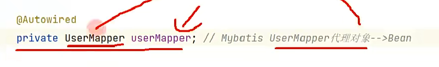\

比如Mybatis，Mybatis框架可以单独使用，而单独使用Mybatis框架就需要用到Mybatis所提供的一些类构造出对应的对象，然后使用该对象，就能使用到Mybatis框架给我们提供的功能，和Mybatis整合Spring就是为了将这些对象放入Spring容器中成为Bean，只要成为了Bean，在我们的Spring项目中就能很方便的使用这些对象了，也就能很方便的使用Mybatis框架所提供的功能了。

## 实现简易mybatis

### mybatis使用/需求分析

1. 根据类型注入Mapper增强类型(将增强类型注册到容器)
   1. 多个Mapper写活


给构造器指定值

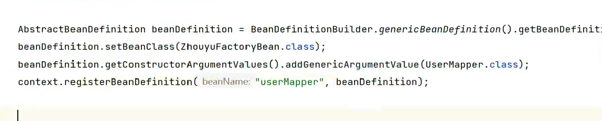

通过后置处理器增强


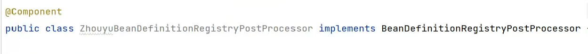


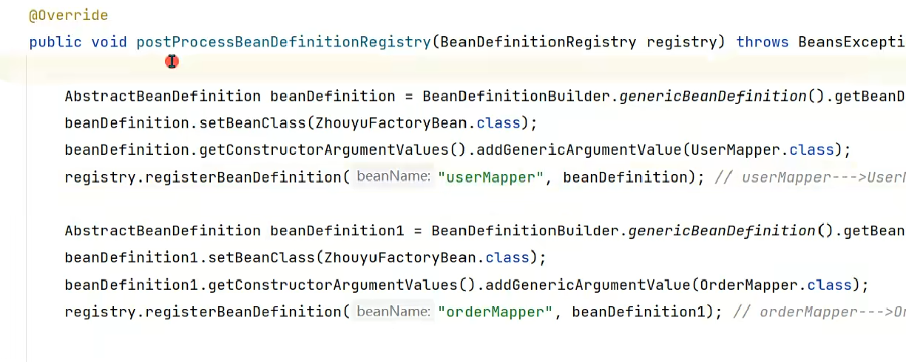

写死不好,想要拿到扫描路径

也可以写

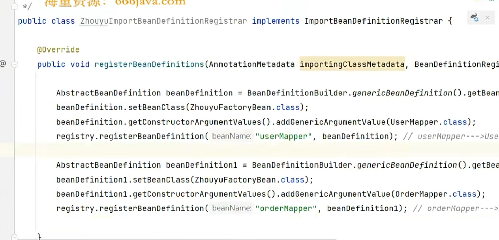

这个 接口会给你一些工具 比如这个注解原信息

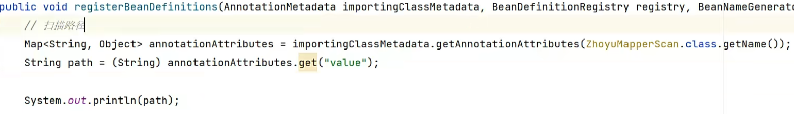


### spring自带Scanner 但是不关心接口 ,可mybatis只关心接口 需要重写扫描器的逻辑

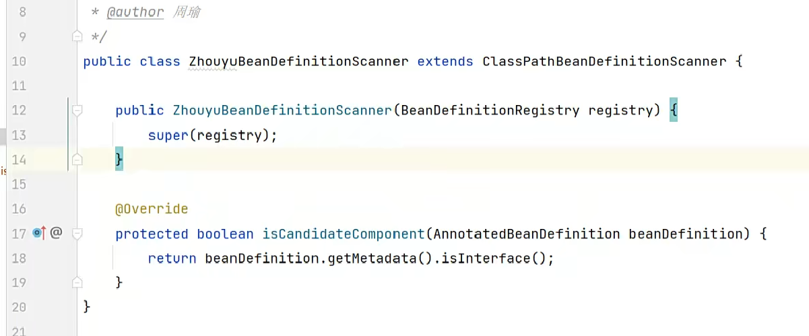 


### 两个判断 带component和另一个sbd才能被扫描器扫入 

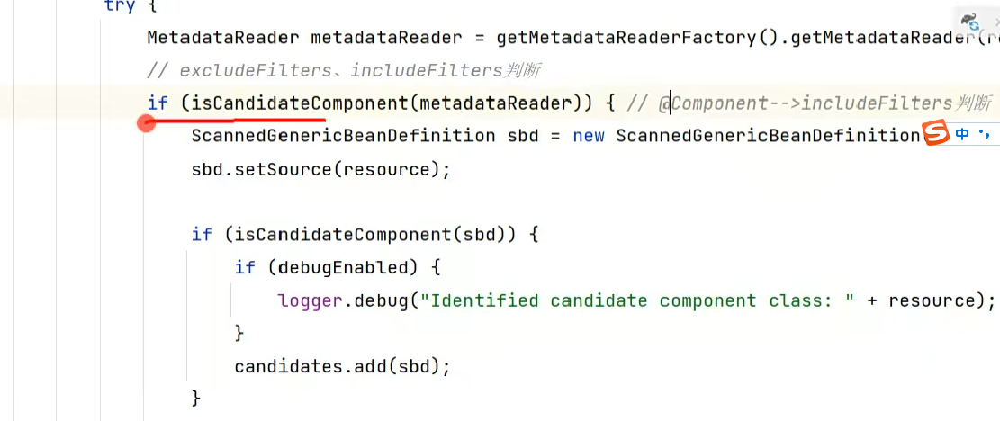

mybatis解决: 

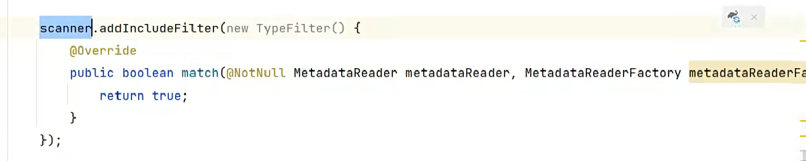 

不符合要求 Beandefinition里是接口mapper  需要 是factoryBean里的代理类

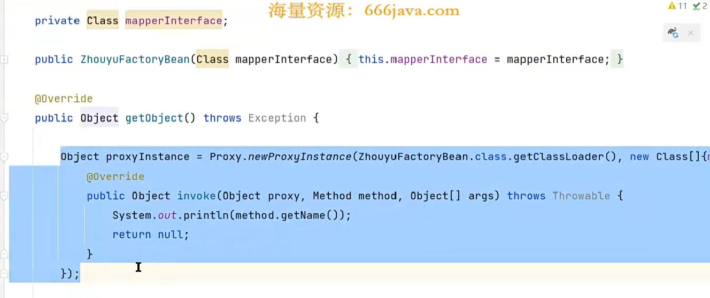

解决


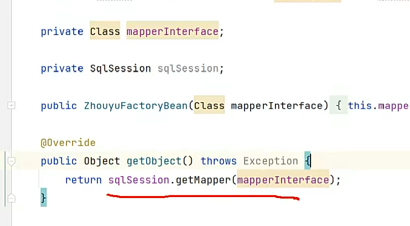


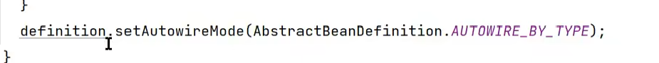 

## Mybatis-Spring 1.3.2版本底层源码执行流程

1. 通过@MapperScan导入了MapperScannerRegistrar类
2. MapperScannerRegistrar类实现了ImportBeanDefinitionRegistrar接口，所以Spring在启动时会调用MapperScannerRegistrar类中的registerBeanDefinitions方法
3. 在registerBeanDefinitions方法中定义了一个ClassPathMapperScanner对象，用来扫描mapper
4. 设置ClassPathMapperScanner对象可以扫描到接口，因为在Spring中是不会扫描接口的
5. 同时因为ClassPathMapperScanner中重写了isCandidateComponent方法，导致isCandidateComponent只会认为接口是备选者Component
6. 通过利用Spring的扫描后，会把接口扫描出来并且得到对应的BeanDefinition
7. 接下来把扫描得到的BeanDefinition进行修改，把BeanClass修改为MapperFactoryBean，把AutowireMode修改为byType
8. 扫描完成后，Spring就会基于BeanDefinition去创建Bean了，相当于每个Mapper对应一个FactoryBean
9. 在MapperFactoryBean中的getObject方法中，调用了getSqlSession()去得到一个sqlSession对象，然后根据对应的Mapper接口生成一个Mapper接口代理对象，这个代理对象就成为Spring容器中的Bean
10. sqlSession对象是Mybatis中的，一个sqlSession对象需要SqlSessionFactory来产生
11. MapperFactoryBean的AutowireMode为byType，所以Spring会自动调用set方法，有两个set方法，一个setSqlSessionFactory，一个setSqlSessionTemplate，而这两个方法执行的前提是根据方法参数类型能找到对应的bean，所以Spring容器中要存在SqlSessionFactory类型的bean或者SqlSessionTemplate类型的bean。
12. 如果你定义的是一个SqlSessionFactory类型的bean，那么最终也会被包装为一个SqlSessionTemplate对象，并且赋值给sqlSession属性
13. 而在SqlSessionTemplate类中就存在一个getMapper方法，这个方法中就产生一个Mapper接口代理对象
14. 到时候，当执行该代理对象的某个方法时，就会进入到Mybatis框架的底层执行流程，详细的请看下图

Spring整合Mybatis之后SQL执行流程：
https://www.processon.com/view/link/6152cc385653bb6791db436c

## Mybatis-Spring 2.0.6版本(最新版)底层源码执行流程

1. 通过@MapperScan导入了MapperScannerRegistrar类
2. MapperScannerRegistrar类实现了ImportBeanDefinitionRegistrar接口，所以Spring在启动时会调用MapperScannerRegistrar类中的registerBeanDefinitions方法
3. **在registerBeanDefinitions方法中注册一个MapperScannerConfigurer类型的BeanDefinition**
4. 而MapperScannerConfigurer实现了BeanDefinitionRegistryPostProcessor接口，所以Spring在启动过程中时会调用它的postProcessBeanDefinitionRegistry()方法
5. 在postProcessBeanDefinitionRegistry方法中会生成一个ClassPathMapperScanner对象，然后进行扫描
6. 后续的逻辑和1.3.2版本一样。

带来的好处是，可以不使用@MapperScan注解，而可以直接定义一个Bean，比如：

```java
@Bean
public MapperScannerConfigurer mapperScannerConfigurer() {
 MapperScannerConfigurer mapperScannerConfigurer = new MapperScannerConfigurer();
 mapperScannerConfigurer.setBasePackage("com.luban");
 return mapperScannerConfigurer;
}
```

## Spring整合Mybatis后一级缓存失效问题

先看下图：
Spring整合Mybatis之后SQL执行流程：
https://www.processon.com/view/link/6152cc385653bb6791db436c
​

Mybatis中的一级缓存是基于SqlSession来实现的，所以在执行同一个sql时，如果使用的是同一个SqlSession对象，那么就能利用到一级缓存，提高sql的执行效率。
​

但是在Spring整合Mybatis后，如果没有执行某个方法时，该方法上没有加@Transactional注解，也就是没有开启Spring事务，那么后面在执行具体sql时，没执行一个sql时都会新生成一个SqlSession对象来执行该sql，这就是我们说的一级缓存失效（也就是没有使用同一个SqlSession对象），而如果开启了Spring事务，那么该Spring事务中的多个sql，在执行时会使用同一个SqlSession对象，从而一级缓存生效，具体的底层执行流程在上图。
​

个人理解：实际上Spring整合Mybatis后一级缓存失效并**不是问题**，是正常的实现，因为，一个方法如果没有开启Spring事务，那么在执行sql时候，那就是每个sql单独一个事务来执行，也就是单独一个SqlSession对象来执行该sql，如果开启了Spring事务，那就是多个sql属于同一个事务，那自然就应该用一个SqlSession来执行这多个sql。所以，在没有开启Spring事务的时候，SqlSession的一级缓存并不是**失效**了，而是存在的生命周期太短了（执行完一个sql后就被销毁了，下一个sql执行时又是一个新的SqlSession了）。
​

# 第七章 AOP

## 动态代理

代理模式的解释：为**其他对象**提供一种**代理**以控制对这个对象的访问，增强一个类中的某个方法，对程序进行扩展。

比如，现在存在一个UserService类：

```java
public class UserService  {

 public void test() {
  System.out.println("test...");
 }

}
```

此时，我们new一个UserService对象，然后执行test()方法，结果是显而易见的。
​

如果我们现在想在**不修改UserService类的源码**前提下，给test()增加额外逻辑，那么就可以使用动态代理机制来创建UserService对象了，比如：

```java
UserService target = new UserService();

// 通过cglib技术
Enhancer enhancer = new Enhancer();
enhancer.setSuperclass(UserService.class);

// 定义额外逻辑，也就是代理逻辑
enhancer.setCallbacks(new Callback[]{new MethodInterceptor() {
 @Override
 public Object intercept(Object o, Method method, Object[] objects, MethodProxy methodProxy) throws Throwable {
  System.out.println("before...");
  Object result = methodProxy.invoke(target, objects);
  System.out.println("after...");
  return result;
 }
}});

// 动态代理所创建出来的UserService对象
UserService userService = (UserService) enhancer.create();

// 执行这个userService的test方法时，就会额外会执行一些其他逻辑
userService.test();
```

得到的都是UserService对象，但是执行test()方法时的效果却不一样了，这就是代理所带来的效果。

上面是通过cglib来实现的代理对象的创建，是基于**父子类**的，被代理类（UserService）是父类，代理类是子类，代理对象就是代理类的实例对象，代理类是由cglib创建的，对于程序员来说不用关心。
​

除开cglib技术，jdk本身也提供了一种创建代理对象的动态代理机制，但是它只能代理接口，也就是UserService得先有一个接口才能利用jdk动态代理机制来生成一个代理对象，比如：

```java
public interface UserInterface {
 public void test();
}

public class UserService implements UserInterface {

 public void test() {
  System.out.println("test...");
 }

}
```

利用JDK动态代理来生成一个代理对象：

```java
UserService target = new UserService();

// UserInterface接口的代理对象
Object proxy = Proxy.newProxyInstance(UserService.class.getClassLoader(), new Class[]{UserInterface.class}, new InvocationHandler() {
 @Override
 public Object invoke(Object proxy, Method method, Object[] args) throws Throwable {
  System.out.println("before...");
  Object result = method.invoke(target, args);
  System.out.println("after...");
  return result;
 }
});

UserInterface userService = (UserInterface) proxy;
userService.test();
```

如果你把new Class[]{UserInterface.class}，替换成new Class[]{UserService.class}，允许代码会直接报错：

```java
Exception in thread "main" java.lang.IllegalArgumentException: com.zhouyu.service.UserService is not an interface
```

表示一定要是个接口。
​

由于这个限制，所以产生的代理对象的类型是UserInterface，而不是UserService，这是需要注意的。

## ProxyFactory

上面我们介绍了两种动态代理技术，那么在Spring中进行了封装，封装出来的类叫做ProxyFactory，表示是创建代理对象的一个工厂，使用起来会比上面的更加方便，比如：

```java
UserService target = new UserService();

ProxyFactory proxyFactory = new ProxyFactory();
proxyFactory.setTarget(target);
proxyFactory.addAdvice(new MethodInterceptor() {
 @Override
 public Object invoke(MethodInvocation invocation) throws Throwable {
     //增强所有的方法
  System.out.println("before...");
  Object result = invocation.proceed();
  System.out.println("after...");
  return result;
 }
});

UserInterface userService = (UserInterface) proxyFactory.getProxy();
userService.test();
```

通过ProxyFactory，我们可以不再关系到底是用cglib还是jdk动态代理了，ProxyFactory会帮我们去判断，如果UserService实现了接口，那么ProxyFactory底层就会用jdk动态代理，如果没有实现接口，就会用cglib技术，上面的代码，就是由于UserService实现了UserInterface接口，所以最后产生的代理对象是UserInterface类型。

//

```java
 				//增强逻辑
				Object result = null;
                // 判断哪些方法需要增强
                if ("selectAll".equals(method.getName())) {
                    //权限校验
                    System.out.println("权限校验");
                    //执行被代理类的目标方法
                    result = methodProxy.invokeSuper(proxy, args);
                    //日志记录
                    System.out.println("日志记录");
                } else {
                    //不是addUser和deleteUser执行目标方法
                    result = methodProxy.invokeSuper(proxy, args);
                }
                return result;
```


## Advice的分类

1. Before Advice：方法之前执行
2. After returning advice：方法return后执行
3. After throwing advice：方法抛异常后执行
4. After (finally) advice：方法执行完finally之后执行，这是最后的，比return更后
5. Around advice：这是功能最强大的Advice，可以自定义执行顺序


看课上给的代码例子将一目了然
​

## Advisor的理解

跟Advice类似的还有一个Advisor的概念，一个Advisor是有一个Pointcut和一个Advice组成的，通过Pointcut可以指定要需要被代理的逻辑，比如一个UserService类中有两个方法，**按上面的例子，这两个方法都会被代理，被增强，那么我们现在可以通过Advisor，来控制到具体代理哪一个方法**，比如： 

```java
  UserService target = new UserService();

  ProxyFactory proxyFactory = new ProxyFactory();
  proxyFactory.setTarget(target);
  proxyFactory.addAdvisor(new PointcutAdvisor() {
   @Override
   public Pointcut getPointcut() {
    return new StaticMethodMatcherPointcut() {
     @Override
     public boolean matches(Method method, Class<?> targetClass) {
      return method.getName().equals("testAbc");
     }
    };
   }

   @Override
   public Advice getAdvice() {
    return new MethodInterceptor() {
        //注意是覆写invoke方法的方法拦截器
     @Override
     public Object invoke(MethodInvocation invocation) throws Throwable {
      System.out.println("before...");
      Object result = invocation.proceed();
      System.out.println("after...");
      return result;
     }
    };
   }
	// 这一步
   @Override
   public boolean isPerInstance() {
    return false;
   }
  });

  UserInterface userService = (UserInterface) proxyFactory.getProxy();
  userService.test();
```

上面代码表示，产生的代理对象，只有在执行testAbc这个方法时才会被增强，会执行额外的逻辑，而在执行其他方法时是不会增强的。
​

## 创建代理对象的方式

1. proxyFactoryBean 类似proxyfacoty(只能单个Bean增强)返回一个代理对象放到IOC容器中 指定一个Advice
2. 根据Beanname (BeanNameAutoProxyCreater) 指定一个Advice
3. 找所有Advisor根据Advisor中的PointCut和Advice信息，确定要代理的Bean以及代理逻辑

上面介绍了Spring中所提供了ProxyFactory、Advisor、Advice、PointCut等技术来实现代理对象的创建，但是我们在使用Spring时，我们并不会直接这么去使用ProxyFactory，比如说，我们希望ProxyFactory所产生的代理对象能直接就是Bean，能直接从Spring容器中得到UserSerivce的代理对象，而这些，Spring都是支持的，只不过，作为开发者的我们肯定得告诉Spring，那些类需要被代理，代理逻辑是什么。

### ProxyFactoryBean

```java
@Bean
public ProxyFactoryBean userServiceProxy(){
 UserService userService = new UserService();

 ProxyFactoryBean proxyFactoryBean = new ProxyFactoryBean();
 proxyFactoryBean.setTarget(userService);
 proxyFactoryBean.addAdvice(new MethodInterceptor() {
  @Override
  public Object invoke(MethodInvocation invocation) throws Throwable {
   System.out.println("before...");
   Object result = invocation.proceed();
   System.out.println("after...");
   return result;
  }
 });
 return proxyFactoryBean;
}
```

通过这种方法来定义一个UserService的Bean，并且是经过了AOP的。但是这种方式**只能针对某一个Bean**。它是一个FactoryBean，所以利用的就是FactoryBean技术，间接的将UserService的代理对象作为了Bean。
​

ProxyFactoryBean还有额外的功能，比如可以把某个Advise或Advisor定义成为Bean，然后在ProxyFactoryBean中进行设置

```java
@Bean
public MethodInterceptor zhouyuAroundAdvise(){
 return new MethodInterceptor() {
  @Override
  public Object invoke(MethodInvocation invocation) throws Throwable {
   System.out.println("before...");
   Object result = invocation.proceed();
   System.out.println("after...");
   return result;
  }
 };
}

@Bean
public ProxyFactoryBean userService(){
 UserService userService = new UserService();
 
    ProxyFactoryBean proxyFactoryBean = new ProxyFactoryBean();
 proxyFactoryBean.setTarget(userService);
 proxyFactoryBean.setInterceptorNames("zhouyuAroundAdvise");
 return proxyFactoryBean;
}
```


### BeanNameAutoProxyCreator

ProxyFactoryBean得自己指定被代理的对象，那么我们可以通过BeanNameAutoProxyCreator来通过指定某个bean的名字，来对该bean进行代理

```java
@Bean
public BeanNameAutoProxyCreator beanNameAutoProxyCreator() {
 BeanNameAutoProxyCreator beanNameAutoProxyCreator = new BeanNameAutoProxyCreator();
 beanNameAutoProxyCreator.setBeanNames("userSe*");
 beanNameAutoProxyCreator.setInterceptorNames("zhouyuAroundAdvise");
 beanNameAutoProxyCreator.setProxyTargetClass(true);

    return beanNameAutoProxyCreator;
}
```

通过BeanNameAutoProxyCreator可以对**批量的Bean**进行AOP，并且指定了代理逻辑，指定了一个InterceptorName，也就是一个Advise，前提条件是这个Advise也得是一个Bean，这样Spring才能找到的，但是BeanNameAutoProxyCreator的缺点很明显，它**只能根据beanName来指定想要代理的Bean**。
​

### DefaultAdvisorAutoProxyCreator

```java
@Bean
public DefaultPointcutAdvisor defaultPointcutAdvisor(){
 NameMatchMethodPointcut pointcut = new NameMatchMethodPointcut();
 pointcut.addMethodName("test");

    DefaultPointcutAdvisor defaultPointcutAdvisor = new DefaultPointcutAdvisor();
 defaultPointcutAdvisor.setPointcut(pointcut);
 defaultPointcutAdvisor.setAdvice(new ZhouyuAfterReturningAdvise());

    return defaultPointcutAdvisor;
}

@Bean
public DefaultAdvisorAutoProxyCreator defaultAdvisorAutoProxyCreator() {
 
    DefaultAdvisorAutoProxyCreator defaultAdvisorAutoProxyCreator = new DefaultAdvisorAutoProxyCreator();

 return defaultAdvisorAutoProxyCreator;
}
```

通过DefaultAdvisorAutoProxyCreator会直接去**找所有Advisor类型的Bean**，根据Advisor中的PointCut和Advice信息，确定要代理的Bean以及代理逻辑。

但是，我们发现，通过这种方式，我们得依靠某一个类来实现定义我们的Advisor，或者Advise，或者Pointcut，那么这个步骤能不能更加简化一点呢？
​

对的，通过**注解**！

比如我们能不能只定义一个类，然后通过在类中的方法上通过某些注解，来定义PointCut以及Advice，可以的，比如：

```java
@Aspect
@Component
public class ZhouyuAspect {

 @Before("execution(public void com.zhouyu.service.UserService.test())")
 public void zhouyuBefore(JoinPoint joinPoint) {
  System.out.println("zhouyuBefore");
 }

}
```

通过上面这个类，我们就直接定义好了所要代理的方法(通过一个表达式)，以及代理逻辑（被@Before修饰的方法），简单明了，这样对于Spring来说，它要做的就是来解析这些注解了，解析之后得到对应的Pointcut对象、Advice对象，生成Advisor对象，扔进ProxyFactory中，进而产生对应的代理对象，具体怎么解析这些注解就是**@EnableAspectJAutoProxy注解**所要做的事情了，后面详细分析。

## 对Spring AOP的理解

OOP表示面向对象编程，是一种编程思想，AOP表示面向切面编程，也是一种编程思想，而我们上面所描述的就是Spring为了让程序员更加方便的做到面向切面编程所提供的技术支持，换句话说，就是Spring提供了一套机制，可以让我们更加容易的来进行AOP，所以这套机制我们也可以称之为Spring AOP。
​

但是值得注意的是，上面所提供的注解的方式来定义Pointcut和Advice，Spring并不是首创，首创是AspectJ，而且也不仅仅只有Spring提供了一套机制来支持AOP，还有比如 JBoss 4.0、aspectwerkz等技术都提供了对于AOP的支持。而刚刚说的注解的方式，Spring是依赖了AspectJ的，或者说，Spring是直接把AspectJ中所定义的那些注解直接拿过来用，自己没有再重复定义了，不过也仅仅只是把注解的定义赋值过来了，每个注解具体底层是怎么解析的，还是Spring自己做的，所以我们在用Spring时，如果你想用@Before、@Around等注解，是需要单独引入aspecj相关jar包的，比如：

```java
compile group: 'org.aspectj', name: 'aspectjrt', version: '1.9.5'
compile group: 'org.aspectj', name: 'aspectjweaver', version: '1.9.5'
```

值得注意的是：AspectJ是在编译时对字节码进行了修改，是直接在UserService类对应的字节码中进行增强的，也就是可以理解为是在编译时就会去解析@Before这些注解，然后得到代理逻辑，加入到被代理的类中的字节码中去的，所以如果想用AspectJ技术来生成代理对象 ，是需要用单独的AspectJ编译器的。我们在项目中很少这么用，我们仅仅只是用了@Before这些注解，而我们在启动Spring的过程中，Spring会去解析这些注解，然后利用动态代理机制生成代理对象的。
​

IDEA中使用Aspectj：https://blog.csdn.net/gavin_john/article/details/80156963

## AOP中的概念

1. Aspect：表示切面，比如被@Aspect注解的类就是切面，可以在切面中去定义Pointcut、Advice等等
2. Join point：表示连接点，表示一个程序在执行过程中的一个点，比如一个方法的执行，比如一个异常的处理，在Spring AOP中，一个连接点通常表示一个方法的执行。
3. Advice：表示通知，表示在一个特定连接点上所采取的动作。Advice分为不同的类型，后面详细讨论，在很多AOP框架中，包括Spring，会用Interceptor拦截器来实现Advice，并且在连接点周围维护一个Interceptor链
4. Pointcut：表示切点，用来匹配一个或多个连接点，Advice与切点表达式是关联在一起的，Advice将会执行在和切点表达式所匹配的连接点上
5. Introduction：可以使用@DeclareParents来给所匹配的类添加一个接口，并指定一个默认实现
6. Target object：目标对象，被代理对象
7. AOP proxy：表示代理工厂，用来创建代理对象的，在Spring Framework中，要么是JDK动态代理，要么是CGLIB代理
8. Weaving：表示织入，表示创建代理对象的动作，这个动作可以发生在编译时期（比如Aspejctj），或者运行时，比如Spring AOP


## Advice在Spring AOP中对应API

上面说到的Aspject中的注解，其中有五个是用来定义Advice的，表示代理逻辑，以及执行时机：

1. @Before
2. @AfterReturning
3. @AfterThrowing
4. @After
5. @Around


我们前面也提到过，Spring自己也提供了类似的执行实际的实现类：

1. 接口MethodBeforeAdvice，继承了接口BeforeAdvice
2. 接口AfterReturningAdvice
3. 接口ThrowsAdvice
4. 接口AfterAdvice
5. 接口MethodInterceptor


Spring会把五个注解解析为对应的Advice类：

1. @Before：AspectJMethodBeforeAdvice，实际上就是一个MethodBeforeAdvice
2. @AfterReturning：AspectJAfterReturningAdvice，实际上就是一个AfterReturningAdvice
3. @AfterThrowing：AspectJAfterThrowingAdvice，实际上就是一个MethodInterceptor
4. @After：AspectJAfterAdvice，实际上就是一个MethodInterceptor
5. @Around：AspectJAroundAdvice，实际上就是一个MethodInterceptor

## TargetSource的使用

在我们日常的AOP中，被代理对象就是Bean对象，是由BeanFactory给我们创建出来的，但是Spring AOP中提供了TargetSource机制，可以让我们用来自定义逻辑来创建**被代理对象**。
​

比如之前所提到的**@Lazy注解，当加在属性上时，会产生一个代理对象赋值给这个属性**，产生代理对象的代码为：

```java
protected Object buildLazyResolutionProxy(final DependencyDescriptor descriptor, final @Nullable String beanName) {
  BeanFactory beanFactory = getBeanFactory();
  Assert.state(beanFactory instanceof DefaultListableBeanFactory,
    "BeanFactory needs to be a DefaultListableBeanFactory");
  final DefaultListableBeanFactory dlbf = (DefaultListableBeanFactory) beanFactory;

  TargetSource ts = new TargetSource() {
   @Override
   public Class<?> getTargetClass() {
    return descriptor.getDependencyType();
   }
   @Override
   public boolean isStatic() {
    return false;
   }
   @Override
   public Object getTarget() {
    Set<String> autowiredBeanNames = (beanName != null ? new LinkedHashSet<>(1) : null);
    Object target = dlbf.doResolveDependency(descriptor, beanName, autowiredBeanNames, null);
    if (target == null) {
     Class<?> type = getTargetClass();
     if (Map.class == type) {
      return Collections.emptyMap();
     }
     else if (List.class == type) {
      return Collections.emptyList();
     }
     else if (Set.class == type || Collection.class == type) {
      return Collections.emptySet();
     }
     throw new NoSuchBeanDefinitionException(descriptor.getResolvableType(),
       "Optional dependency not present for lazy injection point");
    }
    if (autowiredBeanNames != null) {
     for (String autowiredBeanName : autowiredBeanNames) {
      if (dlbf.containsBean(autowiredBeanName)) {
       dlbf.registerDependentBean(autowiredBeanName, beanName);
      }
     }
    }
    return target;
   }
   @Override
   public void releaseTarget(Object target) {
   }
  };

  ProxyFactory pf = new ProxyFactory();
  pf.setTargetSource(ts);
  Class<?> dependencyType = descriptor.getDependencyType();
  if (dependencyType.isInterface()) {
   pf.addInterface(dependencyType);
  }
  return pf.getProxy(dlbf.getBeanClassLoader());
 }
```

这段代码就利用了ProxyFactory来生成代理对象，以及使用了TargetSource，以达到代理对象在执行某个方法时，调用TargetSource的getTarget()方法**实时**得到一个**被代理对象**。


## ProxyFactory选择cglib或jdk动态代理原理

ProxyFactory在生成代理对象之前需要决定到底是使用JDK动态代理还是CGLIB技术：

```java
// config就是ProxyFactory对象

// optimize为true,或proxyTargetClass为true,或用户没有给ProxyFactory对象添加interface
if (config.isOptimize() || config.isProxyTargetClass() || hasNoUserSuppliedProxyInterfaces(config)) {
 Class<?> targetClass = config.getTargetClass();
 if (targetClass == null) {
  throw new AopConfigException("TargetSource cannot determine target class: " +
    "Either an interface or a target is required for proxy creation.");
 }
    // targetClass是接口，直接使用Jdk动态代理
 if (targetClass.isInterface() || Proxy.isProxyClass(targetClass)) {
  return new JdkDynamicAopProxy(config);
 }
    // 使用Cglib
 return new ObjenesisCglibAopProxy(config);
}
else {
    // 使用Jdk动态代理
 return new JdkDynamicAopProxy(config);
}
```

### 

## 代理对象创建过程

### JdkDynamicAopProxy

1. 在构造JdkDynamicAopProxy对象时，会先拿到被代理对象自己所实现的接口，并且额外的增加SpringProxy、Advised、DecoratingProxy三个接口，组合成一个Class[]，并赋值给proxiedInterfaces属性
2. 并且检查这些接口中是否定义了equals()、hashcode()方法
3. 执行`Proxy.newProxyInstance(classLoader, this.proxiedInterfaces, this)`，得到代理对象，**JdkDynamicAopProxy**作为InvocationHandler，代理对象在执行某个方法时，会进入到JdkDynamicAopProxy的**invoke()**方法中

### ObjenesisCglibAopProxy

1. 创建Enhancer对象
2. 设置Enhancer的superClass为通过ProxyFactory.setTarget()所设置的对象的类
3. 设置Enhancer的interfaces为通过ProxyFactory.addInterface()所添加的接口，以及SpringProxy、Advised、DecoratingProxy接口
4. 设置Enhancer的Callbacks为DynamicAdvisedInterceptor
5. 最后创建一个代理对象，代理对象在执行某个方法时，会进入到DynamicAdvisedInterceptor的intercept()方法中

## 代理对象执行过程

1. 在使用ProxyFactory创建代理对象之前，需要往ProxyFactory先添加Advisor
2. 代理对象在执行某个方法时，会把ProxyFactory中的Advisor拿出来和当前正在执行的方法进行匹配筛选
3. 把和方法所匹配的Advisor适配成MethodInterceptor
4. 把和当前方法匹配的MethodInterceptor链，以及被代理对象、代理对象、代理类、当前Method对象、方法参数封装为MethodInvocation对象
5. 调用MethodInvocation的proceed()方法，开始执行各个MethodInterceptor以及被代理对象的对应方法
6. 按顺序调用每个MethodInterceptor的invoke()方法，并且会把MethodInvocation对象传入invoke()方法
7. 直到执行完最后一个MethodInterceptor了，就会调用invokeJoinpoint()方法，从而执行被代理对象的当前方法

### 各注解对应的MethodInterceptor

- @Before

  对应的是AspectJMethodBeforeAdvice，在进行动态代理时会把AspectJMethodBeforeAdvice转成

  MethodBeforeAdviceInterceptor

  - 先执行advice对应的方法
  - 再执行MethodInvocation的proceed()，会执行下一个Interceptor，如果没有下一个Interceptor了，会执行target对应的方法

- @After

  对应的是AspectJAfterAdvice，直接实现了

  MethodInterceptor

  - 先执行MethodInvocation的proceed()，会执行下一个Interceptor，如果没有下一个Interceptor了，会执行target对应的方法
  - 再执行advice对应的方法

- @Around

  对应的是AspectJAroundAdvice，直接实现了

  MethodInterceptor

  - 直接执行advice对应的方法，由@Around自己决定要不要继续往后面调用

- @AfterThrowing

  对应的是AspectJAfterThrowingAdvice，直接实现了

  MethodInterceptor

  - 先执行MethodInvocation的proceed()，会执行下一个Interceptor，如果没有下一个Interceptor了，会执行target对应的方法
  - 如果上面抛了Throwable，那么则会执行advice对应的方法

- @AfterReturning

  对应的是AspectJAfterReturningAdvice，在进行动态代理时会把AspectJAfterReturningAdvice转成

  AfterReturningAdviceInterceptor

  - 先执行MethodInvocation的proceed()，会执行下一个Interceptor，如果没有下一个Interceptor了，会执行target对应的方法
  - 执行上面的方法后得到最终的方法的返回值
  - 再执行Advice对应的方法

## AbstractAdvisorAutoProxyCreator

DefaultAdvisorAutoProxyCreator的父类是AbstractAdvisorAutoProxyCreator。

**AbstractAdvisorAutoProxyCreator**非常强大以及重要，只要Spring容器中存在这个类型的Bean，就相当于开启了AOP，AbstractAdvisorAutoProxyCreator实际上就是一个BeanPostProcessor，所以在创建某个Bean时，就会进入到它对应的生命周期方法中，比如：在某个Bean**初始化之后**，会调用wrapIfNecessary()方法进行AOP，底层逻辑是，AbstractAdvisorAutoProxyCreator会找到所有的Advisor，然后判断当前这个Bean是否存在某个Advisor与之匹配（根据Pointcut），如果匹配就表示当前这个Bean有对应的切面逻辑，需要进行AOP，需要产生一个代理对象。

## @EnableAspectJAutoProxy

这个注解主要就是往Spring容器中添加了一个**AnnotationAwareAspectJAutoProxyCreator**类型的Bean。

**AspectJAwareAdvisorAutoProxyCreator**继承了**AbstractAdvisorAutoProxyCreator**，重写了findCandidateAdvisors()方法，**AbstractAdvisorAutoProxyCreator**只能找到所有Advisor类型的Bean对象，但是**AspectJAwareAdvisorAutoProxyCreator**除开可以找到所有Advisor类型的Bean对象，还能把@Aspect注解所标注的Bean中的@Before等注解及方法进行解析，并生成对应的Advisor对象。
​

所以，我们可以理解@EnableAspectJAutoProxy，其实就是像Spring容器中添加了一个AbstractAdvisorAutoProxyCreator类型的Bean，从而开启了AOP，并且还会解析@Before等注解生成Advisor。

# 第八章 事务

增强已有类的组合

## @EnableTransactionManagement工作原理

开启Spring事务本质上就是增加了一个Advisor，但我们使用@EnableTransactionManagement注解来开启Spring事务是，该注解代理的功能就是向Spring容器中添加了两个Bean：

1. AutoProxyRegistrar
2. ProxyTransactionManagementConfiguration

AutoProxyRegistrar主要的作用是向Spring容器中注册了一个**InfrastructureAdvisorAutoProxyCreator**的Bean。
而InfrastructureAdvisorAutoProxyCreator继承了**AbstractAdvisorAutoProxyCreator**，所以这个类的主要作用就是**开启自动代理**的作用，也就是一个**BeanPostProcessor**，会在**初始化后**步骤中去寻找Advisor类型的Bean，并判断当前某个Bean是否有匹配的Advisor，是否需要利用动态代理产生一个代理对象。
​


ProxyTransactionManagementConfiguration是一个配置类，它又定义了另外三个bean：

1. BeanFactoryTransactionAttributeSourceAdvisor：一个Advisor
2. AnnotationTransactionAttributeSource：相当于BeanFactoryTransactionAttributeSourceAdvisor中的Pointcut
3. TransactionInterceptor：相当于BeanFactoryTransactionAttributeSourceAdvisor中的Advice

**AnnotationTransactionAttributeSource**就是用来判断某个类上是否存在@Transactional注解，或者判断某个方法上是否存在@Transactional注解的。
​

**TransactionInterceptor**就是代理逻辑，当某个类中存在@Transactional注解时，到时就产生一个代理对象作为Bean，代理对象在执行某个方法时，最终就会进入到TransactionInterceptor的invoke()方法。

## Spring事务基本执行原理

一个Bean在执行Bean的创建生命周期时，会经过InfrastructureAdvisorAutoProxyCreator的初始化后的方法，会判断当前当前Bean对象是否和BeanFactoryTransactionAttributeSourceAdvisor匹配，匹配逻辑为判断该Bean的类上是否存在@Transactional注解，或者类中的某个方法上是否存在@Transactional注解，如果存在则表示该Bean需要进行动态代理产生一个代理对象作为Bean对象。
​

该代理对象在执行某个方法时，会再次判断当前执行的方法是否和BeanFactoryTransactionAttributeSourceAdvisor匹配，如果匹配则执行该Advisor中的TransactionInterceptor的invoke()方法，执行基本流程为：

1. 利用所配置的PlatformTransactionManager事务管理器新建一个数据库连接
2. 修改数据库连接的autocommit为false
3. 执行MethodInvocation.proceed()方法，简单理解就是执行业务方法，其中就会执行sql
4. 如果没有抛异常，则提交
5. 如果抛了异常，则回滚


## Spring事务详细执行流程

Spring事务执行流程图：https://www.processon.com/view/link/5fab6edf1e0853569633cc06

## Spring事务传播机制

在开发过程中，经常会出现一个方法调用另外一个方法，那么这里就涉及到了多种场景，比如a()调用b()：

1. a()和b()方法中的所有sql需要在同一个事务中吗？
2. a()和b()方法需要单独的事务吗？
3. a()需要在事务中执行，b()还需要在事务中执行吗？
4. 等等情况...

所以，这就要求Spring事务能支持上面各种场景，这就是Spring事务传播机制的由来。那Spring事务传播机制是如何实现的呢?
​

先来看上述几种场景中的一种情况，a()在一个事务中执行，调用b()方法时需要新开一个事务执行：
​

1. 首先，代理对象执行a()方法前，先利用事务管理器新建一个数据库连接a
2. 将数据库连接a的autocommit改为false
3. 把数据库连接a设置到ThreadLocal中
4. 执行a()方法中的sql
5. 执行a()方法过程中，调用了b()方法（注意用代理对象调用b()方法）
   1. 代理对象执行b()方法前，判断出来了当前线程中已经存在一个数据库连接a了，表示当前线程其实已经拥有一个Spring事务了，则进行**挂起**
   2. 挂起就是把ThreadLocal中的数据库连接a从ThreadLocal中移除，并放入一个**挂起资源对象**中
   3. 挂起完成后，再次利用事务管理器新建一个数据库连接b
   4. 将数据库连接b的autocommit改为false
   5. 把数据库连接b设置到ThreadLocal中
   6. 执行b()方法中的sql
   7. b()方法正常执行完，则从ThreadLocal中拿到数据库连接b进行提交
   8. 提交之后会恢复所挂起的数据库连接a，这里的恢复，其实只是把在**挂起资源对象**中所保存的数据库连接a再次设置到ThreadLocal中
6. a()方法正常执行完，则从ThreadLocal中拿到数据库连接a进行提交

这个过程中最为核心的是：**在执行某个方法时，判断当前是否已经存在一个事务，就是判断当前线程的ThreadLocal中是否存在一个数据库连接对象，如果存在则表示已经存在一个事务了。**

## Spring事务传播机制分类


**其中，以非事务方式运行，表示以非Spring事务运行，表示在执行这个方法时，Spring事务管理器不会去建立数据库连接，执行sql时，由Mybatis或JdbcTemplate自己来建立数据库连接来执行sql。**

## 案例分析

### 情况1

```java
@Component
public class UserService {
 @Autowired
 private UserService userService;

 @Transactional
 public void test() {
  // test方法中的sql
  userService.a();
 }

 @Transactional
 public void a() {
  // a方法中的sql
 }
}
```

默认情况下传播机制为**REQUIRED，表示当前如果没有事务则新建一个事务，如果有事务则在当前事务中执行。**
**​**

所以上面这种情况的执行流程如下：

1. 新建一个数据库连接conn
2. 设置conn的autocommit为false
3. 执行test方法中的sql
4. 执行a方法中的sql
5. 执行conn的commit()方法进行提交

### 情况2

假如是这种情况

```java
@Component
public class UserService {
 @Autowired
 private UserService userService;

 @Transactional
 public void test() {
  // test方法中的sql
  userService.a();
        int result = 100/0;
 }

 @Transactional
 public void a() {
  // a方法中的sql
 }
}
```

所以上面这种情况的执行流程如下：

1. 新建一个数据库连接conn
2. 设置conn的autocommit为false
3. 执行test方法中的sql
4. 执行a方法中的sql
5. 抛出异常
6. 执行conn的rollback()方法进行回滚，所以两个方法中的sql都会回滚掉

### 情况3

假如是这种情况：

```java
@Component
public class UserService {
 @Autowired
 private UserService userService;

 @Transactional
 public void test() {
  // test方法中的sql
  userService.a();
 }

 @Transactional
 public void a() {
  // a方法中的sql
        int result = 100/0;
 }
}
```

所以上面这种情况的执行流程如下：

1. 新建一个数据库连接conn
2. 设置conn的autocommit为false
3. 执行test方法中的sql
4. 执行a方法中的sql
5. 抛出异常
6. 执行conn的rollback()方法进行回滚，所以两个方法中的sql都会回滚掉

### 情况4

如果是这种情况：

```java
@Component
public class UserService {
 @Autowired
 private UserService userService;

 @Transactional
 public void test() {
  // test方法中的sql
  userService.a();
 }

 @Transactional(propagation = Propagation.REQUIRES_NEW)
 public void a() {
  // a方法中的sql
  int result = 100/0;
 }
}
```

所以上面这种情况的执行流程如下：

1. 新建一个数据库连接conn
2. 设置conn的autocommit为false
3. 执行test方法中的sql
4. 又新建一个数据库连接conn2
5. 执行a方法中的sql
6. 抛出异常
7. 执行conn2的rollback()方法进行回滚
8. **继续抛异常，对于test()方法而言，它会接收到一个异常，然后抛出**
9. 执行conn的rollback()方法进行回滚，最终还是两个方法中的sql都回滚了

## Spring事务强制回滚

正常情况下，a()调用b()方法时，如果b()方法抛了异常，但是在a()方法捕获了，那么a()的事务还是会正常提交的，但是有的时候，我们捕获异常可能仅仅只是不把异常信息返回给客户端，而是为了返回一些更友好的错误信息，而这个时候，我们还是希望事务能回滚的，那这个时候就得告诉Spring把当前事务回滚掉，做法就是：

```java
@Transactional
public void test(){
 
    // 执行sql
 try {
  b();
 } catch (Exception e) {
  // 构造友好的错误信息返回
  TransactionAspectSupport.currentTransactionStatus().setRollbackOnly();
 }
    
}

public void b() throws Exception {
 throw new Exception();
}
```

## TransactionSynchronization

Spring事务有可能会提交，回滚、挂起、恢复，所以Spring事务提供了一种机制，可以让程序员来监听当前Spring事务所处于的状态。
​

```java
@Component
public class UserService {

 @Autowired
 private JdbcTemplate jdbcTemplate;

 @Autowired
 private UserService userService;

 @Transactional
 public void test(){
  TransactionSynchronizationManager.registerSynchronization(new TransactionSynchronization() {

   @Override
   public void suspend() {
    System.out.println("test被挂起了");
   }

   @Override
   public void resume() {
    System.out.println("test被恢复了");
   }

   @Override
   public void beforeCommit(boolean readOnly) {
    System.out.println("test准备要提交了");
   }

   @Override
   public void beforeCompletion() {
    System.out.println("test准备要提交或回滚了");
   }

   @Override
   public void afterCommit() {
    System.out.println("test提交成功了");
   }

   @Override
   public void afterCompletion(int status) {
    System.out.println("test提交或回滚成功了");
   }
  });

  jdbcTemplate.execute("insert into t1 values(1,1,1,1,'1')");
  System.out.println("test");
  userService.a();
 }

 @Transactional(propagation = Propagation.REQUIRES_NEW)
 public void a(){
  TransactionSynchronizationManager.registerSynchronization(new TransactionSynchronization() {

   @Override
   public void suspend() {
    System.out.println("a被挂起了");
   }

   @Override
   public void resume() {
    System.out.println("a被恢复了");
   }

   @Override
   public void beforeCommit(boolean readOnly) {
    System.out.println("a准备要提交了");
   }

   @Override
   public void beforeCompletion() {
    System.out.println("a准备要提交或回滚了");
   }

   @Override
   public void afterCommit() {
    System.out.println("a提交成功了");
   }

   @Override
   public void afterCompletion(int status) {
    System.out.println("a提交或回滚成功了");
   }
  });

  jdbcTemplate.execute("insert into t1 values(2,2,2,2,'2')");
  System.out.println("a");
 }


}
```

# 第九章 Spring MVC请求流程源码

Spring集成Sring MVC (无SpringBoot) 

```java
public class MyApplicationInitializer implements WebApplicationInitializer {
    @Override
    public void onStartup(ServletContext servletContext) throws ServletException {
        //注册DispatcherServlet到容器里
    }
}
// todo
```

启动Tomcat

Servlet规范定义接口,tomcat通过SPI机制加载	

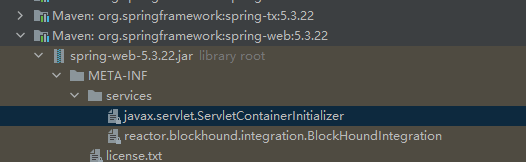

实现是

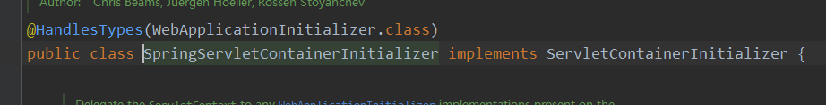

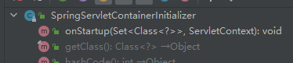

> @HandlerTypes(感兴趣的类) 

```java
@HandlesTypes(WebApplicationInitializer.class)
public class SpringServletContainerInitializer implements ServletContainerInitializer {

	//....
	@Override
	public void onStartup(@Nullable Set<Class<?>> webAppInitializerClasses, ServletContext servletContext)
			throws ServletException {

		List<WebApplicationInitializer> initializers = Collections.emptyList();// 这里面会有我们自己写的myWebApplicationInitializer

		if (webAppInitializerClasses != null) {
			initializers = new ArrayList<>(webAppInitializerClasses.size());
			for (Class<?> waiClass : webAppInitializerClasses) {

				if (!waiClass.isInterface() && !Modifier.isAbstract(waiClass.getModifiers()) &&
						WebApplicationInitializer.class.isAssignableFrom(waiClass)) {
					try {
						initializers.add((WebApplicationInitializer)
								ReflectionUtils.accessibleConstructor(waiClass).newInstance());
					}
					catch (Throwable ex) {
						throw new ServletException("Failed to instantiate WebApplicationInitializer class", ex);
					}
				}
			}
		}

		if (initializers.isEmpty()) {
			servletContext.log("No Spring WebApplicationInitializer types detected on classpath");
			return;
		}

		servletContext.log(initializers.size() + " Spring WebApplicationInitializers detected on classpath");
		AnnotationAwareOrderComparator.sort(initializers);
		for (WebApplicationInitializer initializer : initializers) {
			initializer.onStartup(servletContext);
		}
	}

}
```


**SpringMVC —请求源码流程**

有道云链接：http://note.youdao.com/noteshare?id=ec3ca523300ad31d7f6f673b9e92bbeb&sub=1D1BF1D55D0148879F53878CB24F8214

​            [SpringMVC —请求源码流程](#5649-1633956404886)        

​            [前言](#9720-1633943710618)        

​            [从Servlet到SpringMVC](#7952-1633943708207)        

​            [传统Servlet：](#3090-1633943822464)        

​            [SpringMVC](#3281-1633954997326)        

​            [SpringMVC的具体执行流程：](#4263-1633961029989)        

​            [HandlerMapping](#5426-1634015715432)        

**前言**

Spring官网的MVC模块介绍：

Spring Web MVC is the original web framework built on the Servlet API and has been included in the Spring Framework from the very beginning. The formal name, “Spring Web MVC,” comes from the name of its source module (spring-webmvc), but it is more commonly known as “Spring MVC”.

Spring Web MVC是基于Servlet API构建的原始Web框架，从一开始就已包含在Spring框架中。正式名称“ Spring Web MVC”来自其源模块的名称（spring-webmvc），但它通常被称为“ Spring MVC”。 

**从Servlet到SpringMVC**

**最典型的MVC就是JSP + servlet + javabean的模式。**

**传统Servlet：**

​    

**弊端：**

1.xml下配置servlet的映射非常麻烦 **开发效率低**

2.必须要继承父类、重写方法   **侵入性强**

2.如果想在一个Servlet中处理同一业务模块的的功能**分发给不同方法进行处理非常麻烦**

3.**参数解析麻烦**:单个参数（转换类型）--->pojo对象      Json文本--->pojo对象

4.**数据响应麻烦:**pojo对象--->json    ...  Content-type

5.跳转页面麻烦,   对path的控制、  如果使用其他模板也很麻烦 、设置编码麻烦...等等...

所以SpringMVC 就是在Servlet的基础上进行了封装，帮我把这些麻烦事都给我们做了。 

Web框架的升级是一个不断偷懒的过程

从最开始的Servlet到现在的SpringMVC、SpringBoot等等

**SpringMVC** 

**基于xml的实现方式：**

1.给Servlet容器配置一个DispatcherServlet（web.xml )

2.添加SpringMVC的配置信息

- 继承类/实现接口 方式：

​                 implements HttpRequestHandler               

不同的*HandlerMapping*

​                <!--通过设置属性的方式去设置映射路径--> <bean class="org.springframework.web.servlet.handler.SimpleUrlHandlerMapping"> <property name="mappings">    <props>        <prop key="httpRequest">simpleController</prop>    </props> </property> <!--BeanNameUrlHandlerMapping 一定要为Controller设置一个有效映射地址的名字  如  @Controller("/xxxx")-->              

- 注解方式：

配置控制器@Controller和处理方法的映射—@RequstMapping 即可

其实SpringMVC请求原理很简单：说白了就是用一个DispatcherServlet 封装了一个Servlet的调度中心， 由调度中心帮我们调用我们的处理方法：

在这个过程中调度中心委托给各个组件执行具体工作 ，比如帮我们映射方法请求、帮我解析参数、调用处理方法、响应数据和页面 等

这就相当于你在家自己做饭和去饭店吃饭的区别了，  在家你买菜、洗菜、蒸饭、炒菜、洗碗都得自己来.

饭店都给你做好了， 你只要分服务员说你吃什么、就能得到响应.     殊不知呢， 你只是说了吃什么（请求）， 后厨（DispatcherServlet）就有配菜员你给找到菜单-对应的食材（映射） 、切菜员切菜（解析参数）、   厨师给你炒菜（调用处理方法）、装盘（处理返回值)、 抄完给你端出来（响应）

**SpringMVC的具体执行流程：**

Spring MVC 是围绕前端控制器模式设计的，其中：中央 Servlet DispatcherServlet 为请求处理流程提供统一调度，实际工作则交给可配置组件执行。这个模型是灵活的且开放的，我们可以通过自己去定制这些组件从而进行定制自己的工作流。

 

​    

DispatcherServlet： 前端调度器 ， 负责将请求拦截下来分发到各控制器方法中

HandlerMapping: 负责根据请求的URL和配置@RequestMapping映射去匹配， 匹配到会返回Handler（具体控制器的方法）

HandlerAdaper: 负责调用Handler-具体的方法-  返回视图的名字  Handler将它封装到ModelAndView(封装视图名，request域的数据）

ViewReslover: 根据ModelAndView里面的视图名地址去找到具体的jsp封装在View对象中

View：进行视图渲染（将jsp转换成html内容 --这是Servlet容器的事情了） 最终response到的客户端

1. 用户发送请求至前端控制器DispatcherServlet

2. DispatcherServlet收到请求调用处理器映射器HandlerMapping。

3. 1. 处理器映射器根据请求url找到具体的处理器，生成处理器执行链HandlerExecutionChain(包括处理器对象和处理器拦截器)一并返回给DispatcherServlet。

4. DispatcherServlet根据处理器Handler获取处理器适配器HandlerAdapter,执行HandlerAdapter处理一系列的操作，如：参数封装，数据格式转换，数据验证等操作

5. 执行处理器Handler(Controller，也叫页面控制器)。

6. 1. Handler执行完成返回ModelAndView
   2. HandlerAdapter将Handler执行结果ModelAndView返回到DispatcherServlet

7. DispatcherServlet将ModelAndView传给ViewReslover视图解析器

8. 1. ViewReslover解析后返回具体View

9. DispatcherServlet对View进行渲染视图（即将模型数据model填充至视图中）。

10. DispatcherServlet响应用户。

 

**整个调用过程其实都在doDispatch中体现了：**

1. 用户发送请求至前端控制器DispatcherServlet

- 由于它是个Servlet会先进入service方法——>doGet/doPost——>processRequestdoService——>doDispatch	 ↓
- 这个doDispatch非常重要--体现了整个请求流程

​                protected void doDispatch(HttpServletRequest request, HttpServletResponse response) throws Exception {      try {            try {          // 文件上传相关         processedRequest = checkMultipart(request);         multipartRequestParsed = (processedRequest != request);                 // DispatcherServlet收到请求调用处理器映射器HandlerMapping。        // 处理器映射器根据请求url找到具体的处理器，生成处理器执行链HandlerExecutionChain(包括处理器对象和处理器拦截器)一并返回给DispatcherServlet。         mappedHandler = getHandler(processedRequest);         if (mappedHandler == null) {            noHandlerFound(processedRequest, response);            return;         }          4.DispatcherServlet根据处理器Handler获取处理器适配器HandlerAdapter,         HandlerAdapter ha = getHandlerAdapter(mappedHandler.getHandler());          // Process last-modified header, if supported by the handler.  HTTP缓存相关         String method = request.getMethod();         boolean isGet = HttpMethod.GET.matches(method);         if (isGet || HttpMethod.HEAD.matches(method)) {            long lastModified = ha.getLastModified(request, mappedHandler.getHandler());            if (new ServletWebRequest(request, response).checkNotModified(lastModified) && isGet) {               return;            }         }         // 前置拦截器         if (!mappedHandler.applyPreHandle(processedRequest, response)) {            // 返回false就不进行后续处理了            return;         }          // 执行HandlerAdapter处理一系列的操作，如：参数封装，数据格式转换，数据验证等操作         // 执行处理器Handler(Controller，也叫页面控制器)。         // Handler执行完成返回ModelAndView         // HandlerAdapter将Handler执行结果ModelAndView返回到DispatcherServlet         mv = ha.handle(processedRequest, response, mappedHandler.getHandler());          if (asyncManager.isConcurrentHandlingStarted()) {            return;         }         // 如果没有视图，给你设置默认视图  json忽略         applyDefaultViewName(processedRequest, mv);         //后置拦截器         mappedHandler.applyPostHandle(processedRequest, response, mv);      }      catch (Exception ex) {         dispatchException = ex;      }      catch (Throwable err) {         // As of 4.3, we're processing Errors thrown from handler methods as well,         // making them available for @ExceptionHandler methods and other scenarios.         dispatchException = new NestedServletException("Handler dispatch failed", err);      }      // DispatcherServlet将ModelAndView传给ViewReslover视图解析器      // ViewReslover解析后返回具体View      // DispatcherServlet对View进行渲染视图（即将模型数据model填充至视图中）。      // DispatcherServlet响应用户。      processDispatchResult(processedRequest, response, mappedHandler, mv, dispatchException);   }   catch (Exception ex) {      triggerAfterCompletion(processedRequest, response, mappedHandler, ex);   }   catch (Throwable err) {      triggerAfterCompletion(processedRequest, response, mappedHandler,            new NestedServletException("Handler processing failed", err));   }   finally {      if (asyncManager.isConcurrentHandlingStarted()) {         // Instead of postHandle and afterCompletion         if (mappedHandler != null) {            mappedHandler.applyAfterConcurrentHandlingStarted(processedRequest, response);         }      }      else {         // Clean up any resources used by a multipart request.         if (multipartRequestParsed) {            cleanupMultipart(processedRequest);         }      }   }              

**详细过程我们课程中分析....**

**HandlerMapping**

在整个过程中，涉及到非常多的组件，每个组件解析各个环节，其中**HandlerMapping最为重要它是用来映射请求的**，我们就着重介绍下HandlerMapping的解析过程和请求映射过程：

附上流程图：

https://www.processon.com/view/link/615ea79e1efad4070b2d6707

​    

# 第十章 Spring MVC父子容器

**1、Spring整合SpringMVC**

**特性：**

说到Spring整合SpringMVC唯一的体现就是父子容器：

- 通常我们会设置父容器（Spring）管理Service、Dao层的Bean, 子容器(SpringMVC)管理Controller的Bean .   
- 子容器可以访问父容器的Bean, 父容器无法访问子容器的Bean。

**实现：**


也就是**零配置（零xml）的放式**来说明SpringMVC的原理！！

此方式作为我们本文重点介绍，也是很多人缺失的一种方式， 其实早在Spring3+就已经提供， 只不过我们直到SpringBoot才使用该方式进行自动配置， 这也是很多人从xml调到SpringBoot不适应的原因， 因为你缺失了这个版本。  所以我们以这种方式作为源码切入点既可以理解到XML的方式又能兼顾到SpringBoot的方式 。


**3、实现基于SPI规范的SpringMVC** 

**TulingStarterInitializer**   

- 此类继承AbstractAnnotationConfigDispatcherServletInitializer 这是个啥？ 待会我们讲原理来介绍
- getRootConfigClasses 提供父容器的配置类
- getServletConfigClasses 提供子容器的配置类
- getServletMappings 设置DispatcherServlet的映射

​                 public  class TulingStarterInitializer extends AbstractAnnotationConfigDispatcherServletInitializer {    /**    * 方法实现说明:IOC 父容器的启动类    * @author:xsls    * @date:2019/7/31 22:12    */   @Override   protected Class<?>[] getRootConfigClasses() {      return new Class[]{RootConfig.class};   }    /**    * 方法实现说明 IOC子容器配置 web容器配置    * @author:xsls    * @date:2019/7/31 22:12    */   @Override   protected Class<?>[] getServletConfigClasses() {      return new Class[]{WebAppConfig.class};   }    /**    * 方法实现说明    * @author:xsls    * @return: 我们前端控制器DispatcherServlet的拦截路径    * @exception:    * @date:2019/7/31 22:16    */   @Override   protected String[] getServletMappings() {      return new String[]{"/"};              

**RootConfig**

- 父容器的配置类  =以前的spring.xml
- 扫描的包排除掉@Controller

​                @Configuration @ComponentScan(basePackages = "com.tuling",excludeFilters = {      @ComponentScan.Filter(type = FilterType.ANNOTATION,value={RestController.class,Controller.class}),      @ComponentScan.Filter(type = ASSIGNABLE_TYPE,value =WebAppConfig.class ), }) public class RootConfig {              

**WebAppConfig**

- 子容器的配置类  =以前的spring-mvc.xml
- 扫描的包：包含掉@Controller

​                 @Configuration @ComponentScan(basePackages = {"com.tuling"},includeFilters = {      @ComponentScan.Filter(type = FilterType.ANNOTATION,value = {RestController.class, Controller.class}) },useDefaultFilters =false) @EnableWebMvc   // ≈<mvc:annotation-driven/> public class WebAppConfig implements WebMvcConfigurer{    /**    * 配置拦截器    * @return    */   @Bean   public TulingInterceptor tulingInterceptor() {      return new TulingInterceptor();   }    /**    * 文件上传下载的组件    * @return    */   @Bean   public MultipartResolver multipartResolver() {      CommonsMultipartResolver multipartResolver = new CommonsMultipartResolver();      multipartResolver.setDefaultEncoding("UTF-8");      multipartResolver.setMaxUploadSize(1024*1024*10);      return multipartResolver;   }    /**    * 注册处理国际化资源的组件    * @return    */ /* @Bean   public AcceptHeaderLocaleResolver localeResolver() {      AcceptHeaderLocaleResolver acceptHeaderLocaleResolver = new AcceptHeaderLocaleResolver();      return acceptHeaderLocaleResolver;   }*/    @Override   public void addInterceptors(InterceptorRegistry registry) {      registry.addInterceptor(tulingInterceptor()).addPathPatterns("/*");   }    /**    * 方法实现说明:配置试图解析器    * @author:xsls    * @exception:    * @date:2019/8/6 16:23    */   @Bean   public InternalResourceViewResolver internalResourceViewResolver() {      InternalResourceViewResolver viewResolver = new InternalResourceViewResolver();      viewResolver.setSuffix(".jsp");      viewResolver.setPrefix("/WEB-INF/jsp/");      return viewResolver;   }     @Override   public void configureMessageConverters(List<HttpMessageConverter<?>> converters) {      converters.add(new MappingJackson2HttpMessageConverter());   }               

自己去添加个Controller进行测试

OK， 现在可以访问你的SpringMVC了

**4、SPI的方式****SpringMVC启动原理**

接着我们来看看SPI方式的原理是什么：

SpringMVC 大致可以分为   启动 和请求  2大部分，  所以我们本文先研究启动部分 

**流程图：**

​    

 **源码流程**

1. 外置Tomcat启动的时候通过SPI 找到我们应用中的/META-INF/service/javax.servlet.ServletContainerInitializer

​    

1. 调用SpringServletContainerInitializer.onStartUp()

​    

- 1. 调用onStartUp()前会先找到@HandlesTypes(WebApplicationInitializer.**class**) 所有实现了WebApplicationInitializer的类，传入到OnStartup的webAppInitializerClasses参数中，并传入Servlet上下文对象。
  2. 重点关注这组类：他们组成了父子容器

​    

1. 找到所有WebApplicationInitializer的实现类后， 不是接口、不是抽象则通过反射进行实例化（所以，你会发现内部实现类都是抽象的，你想让其起作用我们必须添加一个自定义实现类，在下文提供我的自定义实现类）
2. 调用所有上一步实例化后的对象的onStartup方法

​    

​    

\1. 首先来到**AbstractDispatcherServletInitializer**#onStartup再执行super.onStartup(servletContext);

​                @Override public void onStartup(ServletContext servletContext) throws ServletException {   //实例化我们的spring root上下文   super.onStartup(servletContext);   //注册我们的DispatcherServlet   创建我们spring web 上下文对象   registerDispatcherServlet(servletContext);              

**创建父容器——ContextLoaderListener**

2.父类**AbstractContextLoaderInitializer**#onStartup执行registerContextLoaderListener(servletContext);

1. createRootApplicationContext()该方法中会**创建父容器**

2. 1. 该方法是抽象方法，实现类是AbstractAnnotationConfigDispatcherServletInitializer

   2. 1. 调用getRootConfigClasses();方法获取父容器配置类（此抽象方法在我们自定义的子类中实现提供我们自定义的映射路径 ）
      2. 创建父容器，注册配置类

​    

1. 会创建ContextLoaderListener并通过ServletContext注册

​    

看完大家是不是感觉跟我们XML的配置ContextLoaderListener对上了：

​    

**创建子容器——DispatcherServlet**

3.回到**AbstractDispatcherServletInitializer**#onStartup再执行registerDispatcherServlet(servletContext);

​    

**registerDispatcherServlet方法说明：**

1. 调用createServletApplicationContext**创建子容器**

2. 1. 该方法是抽象方法，实现类是AbstractAnnotationConfigDispatcherServletInitializer

   2. 1. 创建子容器（下图很明显不多介绍）
      2. 调用抽象方法：getServletConfigClasses();获得配置类（此抽象方法在我们自定义的子类中实现提供我们自定义的配置类 ）
      3. 配置类除了可以通过ApplicationContext()构造函数的方式传入 ， 也可以通过这种方式动态添加，不知道了吧~	

​    

1. 调用createDispatcherServlet(servletAppContext);创建DispatcherServlet
2. 设置启动时加载：registration.setLoadOnStartup(1);
3. 调用抽象方法设置映射路径：getServletMappings()（此抽象方法在我们自定义的子类中实现提供我们自定义的映射路径 ）

看完大家是不是感觉跟我们XML的配置DispatcherServlet对上了

​    

**4. 初始化ContextLoaderListener**

​    

ContextLoaderListener加载过程比较简单：

外置tomcat会帮我们调用ContextLoaderListener#contextInitialized 进行初始化

1. xml的方式下会判断容器为空时创建父容器
2. 在里面会调用父容器的refresh方法加载
3. 将父容器存入到Servlet域中供子容器使用

​    

**5. 初始化DispatcherServlet**

​    

可以看到流程比ContextLoaderListener流程更多

外置tomcat会帮我们调用DispatcherServlet#init()  进行初始化--->重点关注：initWebApplicationContext方法

1. *getWebApplicationContext*(getServletContext())获得父容器（从之前的Servlet域中拿到）
2. cwac.setParent(rootContext);给子容器设置父容器
3. 调用configureAndRefreshWebApplicationContext(cwac);

​    

- 1. 注册一个监听器（该监听会初始化springmvc所需信息）

  2. 1. ContextRefreshedEvent可以看到该监听器监听的是容器refreshed事件， 会在finishRefresh中发布

  3. 刷新容器

​    

**当执行refresh 即加载ioc容器  完了会调用finishRefresh():**

1. publishEvent(**new** ContextRefreshedEvent(**this**));发布ContextRefreshedEvent事件
2. 触发上面的ContextRefreshListener监听器：

---->FrameworkServlet.**this**.onApplicationEvent(event);

-------->onRefresh(event.getApplicationContext());

-------------->initStrategies(context);

​                protected void initStrategies(ApplicationContext context) {   //初始化我们web上下文对象的 用于文件上传下载的解析器对象   initMultipartResolver(context);   //初始化我们web上下文对象用于处理国际化资源的   initLocaleResolver(context);   //主题解析器对象初始化   initThemeResolver(context);   //初始化我们的HandlerMapping   initHandlerMappings(context);   //实例化我们的HandlerAdapters   initHandlerAdapters(context);   //实例化我们处理器异常解析器对象   initHandlerExceptionResolvers(context);   initRequestToViewNameTranslator(context);   //给DispatcherSerlvet的ViewResolvers处理器   initViewResolvers(context);   initFlashMapManager(context);              

这里面的每一个方法不用太细看，  就是给SpringMVC准备初始化的数据，  为后续SpringMVC处理请求做准备

基本都是从容器中拿到已经配置的Bean（RequestMappingHandlerMapping、RequestMappingHandlerAdapter、HandlerExceptionResolver  ）放到dispatcherServlet中做准备:

​    

​    

​    

**...**

但是这些Bean又是从哪来的呢？？  来来来， 回到我们的WebAppConfig

我们使用的一个@EnableWebMvc  

1. 导入了DelegatingWebMvcConfiguration@Import(DelegatingWebMvcConfiguration.**class**)
2. DelegatingWebMvcConfiguration的父类就配置了这些Bean
3. 而且我告诉你SpringBoot也是用的这种方式，

​    

**总结**

1. Tomcat在启动时会通过SPI注册 ContextLoaderListener和DispatcherServlet对象

2. 1. 同时创建父子容器

   2. 1. 分别创建在ContextLoaderListener初始化时创建父容器设置配置类
      2. 在DispatcherServlet初始化时创建子容器 即2个ApplicationContext实例设置配置类 

3. Tomcat在启动时执行ContextLoaderListener和DispatcherServlet对象的初始化方法， 执行容器refresh进行加载

4. 在子容器加载时 创建SpringMVC所需的Bean和预准备的数据：(通过配置类+@EnableWebMvc配置（DelegatingWebMvcConfiguration）——可实现WebMvcConfigurer进行定制扩展）

5. 1. RequestMappingHandlerMapping，它会处理@RequestMapping 注解
   2. RequestMappingHandlerAdapter，则是处理请求的适配器，确定调用哪个类的哪个方法，并且构造方法参数，返回值。
   3. HandlerExceptionResolver  错误视图解析器
   4. addDefaultHttpMessageConverters 添加默认的消息转换器（解析json、解析xml）
   5. 等....

6. 子容器需要注入父容器的Bean时（比如Controller中需要@Autowired Service的Bean）;  会先从子容器中找，没找到会去父容器中找： 详情见AbstractBeanFactory#doGetBean方法

​                /**  * 一般情况下,只有Spring 和SpringMvc整合的时才会有父子容器的概念,  * 作用： * 比如我们的Controller中注入Service的时候，发现我们依赖的是一个引用对象，那么他就会调用getBean去把service找出来 * 但是当前所在的容器是web子容器，那么就会在这里的 先去父容器找 */ BeanFactory parentBeanFactory = getParentBeanFactory(); //若存在父工厂,且当前的bean工厂不存在当前的bean定义,那么bean定义是存在于父beanFacotry中 if (parentBeanFactory != null && !containsBeanDefinition(beanName)) {   //获取bean的原始名称   String nameToLookup = originalBeanName(name);   //若为 AbstractBeanFactory 类型，委托父类处理   if (parentBeanFactory instanceof AbstractBeanFactory) {      return ((AbstractBeanFactory) parentBeanFactory).doGetBean(            nameToLookup, requiredType, args, typeCheckOnly);   }   else if (args != null) {      //  委托给构造函数 getBean() 处理      return (T) parentBeanFactory.getBean(nameToLookup, args);   }   else {      // 没有 args，委托给标准的 getBean() 处理      return parentBeanFactory.getBean(nameToLookup, requiredType);   }              

**用几道面试题做个总结:**

 **Spring和SpringMVC为什么需要父子容器？不要不行吗？**

就实现层面来说不用子父容器也可以完成所需功能（参考：SpringBoot就没用子父容器）

1. 所以父子容器的主要作用应该是早期Spring为了划分框架边界。有点单一职责的味道。service、dao层我们一般使用spring框架来管理、controller层交给springmvc管理
2. 规范整体架构 使 父容器service无法访问子容器controller、子容器controller可以访问父容器 service
3. 方便子容器的切换。如果现在我们想把web层从spring mvc替换成struts，那么只需要将spring-mvc.xml替换成Struts的配置文件struts.xml即可，而spring-core.xml不需要改变。 
4. 为了节省重复bean创建

**是否可以把所有Bean都通过Spring容器来管理？（Spring的applicationContext.xml中配置全局扫描)**

不可以，这样会导致我们请求接口的时候产生404。 如果所有的Bean都交给父容器，SpringMVC在初始化HandlerMethods的时候（initHandlerMethods）无法根据Controller的handler方法注册HandlerMethod，并没有去查找父容器的bean；

也就无法根据请求URI 获取到 HandlerMethod来进行匹配.

​    

**是否可以把我们所需的Bean都放入Spring-mvc子容器里面来管理（springmvc的spring-servlet.xml中配置全局扫描）?**

**可以** ， 因为父容器的体现无非是为了获取子容器不包含的bean, 如果全部包含在子容器完全用不到父容器了， 所以是可以全部放在springmvc子容器来管理的。

虽然可以这么做不过一般应该是不推荐这么去做的，一般人也不会这么干的。**如果你的项目里有用到事物、或者aop记得也需要把这部分配置需要放到Spring-mvc子容器的配置文件来，不然一部分内容在子容器和一部分内容在父容器,可能就会导致你的事物或者AOP不生效**。     所以如果aop或事物如果不生效也有可能是通过父容器(spring)去增强子容器(Springmvc)，也就无法增强 这也是很多同学会遇到的问题。

# 第十一章 Mybatis

本章着重介绍MyBatis执行Sql的流程，关于在执行过程中缓存、动态SQl生成等细节不在本章中体现 

还是以之前的查询作为列子： 

之前提到拿到sqlSession之后就能进行各种CRUD操作了，所以我们就从sqlSession.getMapper这个方法开始分析，看下整个Sql的执行流程是怎么样的。

**openSession的过程:**


Executor分成两大类，一类是CacheExecutor，另一类是普通Executor。

普通Executor又分为三种基本的Executor执行器，SimpleExecutor、ReuseExecutor、BatchExecutor。

- SimpleExecutor：每执行一次update或select，就开启一个Statement对象，用完立刻关闭Statement对象。
- ReuseExecutor：执行update或select，以sql作为key查找Statement对象，存在就使用，不存在就创建，用完后，不关闭Statement对象，而是放置于Map内，供下一次使用。简言之，就是重复使用Statement对象。
- BatchExecutor：执行update（没有select，JDBC批处理不支持select），将所有sql都添加到批处理中（addBatch()），等待统一执行（executeBatch()），它缓存了多个Statement对象，每个Statement对象都是addBatch()完毕后，等待逐一执行executeBatch()批处理。与JDBC批处理相同。

作用范围：Executor的这些特点，都严格限制在SqlSession生命周期范围内。

CacheExecutor其实是封装了普通的Executor，和普通的区别是在查询前先会查询缓存中是否存在结果，如果存在就使用缓存中的结果，如果不存在还是使用普通的Executor进行查询，再将查询出来的结果存入缓存。

​    

到此为止，我们已经获得了SqlSession，拿到SqlSession就可以执行各种CRUD方法了。

**简单总结**

- 拿到SqlSessionFactory对象后，会调用SqlSessionFactory的openSesison方法，这个方法会创建一个Sql执行器（Executor），这个Sql执行器会代理你配置的拦截器方法。
- 获得上面的Sql执行器后，会创建一个SqlSession（默认使用DefaultSqlSession）,这个SqlSession中也包含了Configration对象，所以通过SqlSession也能拿到全局配置；
- 获得SqlSession对象后就能执行各种CRUD方法了。

SQL的具体执行流程见后续博客。

一些重要类总结：

- SqlSessionFactory
- SqlSessionFactoryBuilder
- SqlSession（默认使用DefaultSqlSession）
- Executor接口
- Plugin、InterceptorChain的pluginAll方法

**获取Mapper的流程**

进入sqlSession.getMapper方法，会发现调的是Configration对象的getMapper方法：

public T getMapper(Class type, SqlSession sqlSession) {   //mapperRegistry实质上是一个Map，里面注册了启动过程中解析的各种Mapper.xml   //mapperRegistry的key是接口的Class类型   //mapperRegistry的Value是MapperProxyFactory,用于生成对应的MapperProxy（动态代理类）   return mapperRegistry.getMapper(type, sqlSession); }

进入getMapper方法： 

public T getMapper(Class type, SqlSession sqlSession) {   final MapperProxyFactory mapperProxyFactory = (MapperProxyFactory) knownMappers.get(type);   //如果配置文件中没有配置相关Mapper,直接抛异常   if (mapperProxyFactory == null) {    throw new BindingException("Type " + type + " is not known to the MapperRegistry.");   }   try {    //关键方法    return mapperProxyFactory.newInstance(sqlSession);   } catch (Exception e) {    throw new BindingException("Error getting mapper instance. Cause: " + e, e);   }  }

进入MapperProxyFactory的newInstance方法：

public class MapperProxyFactory<T> {  private final Class mapperInterface;  private final Map methodCache = new ConcurrentHashMap();  public MapperProxyFactory(Class mapperInterface) {   this.mapperInterface = mapperInterface;  }  public Class getMapperInterface() {   return mapperInterface;  }  public Map getMethodCache() {   return methodCache;  }  //生成Mapper接口的动态代理类MapperProxy，MapperProxy实现了InvocationHandler 接口  @SuppressWarnings("unchecked")  protected T newInstance(MapperProxy mapperProxy) {   return (T) Proxy.newProxyInstance(mapperInterface.getClassLoader(), new Class[] { mapperInterface }, mapperProxy);  }   public T newInstance(SqlSession sqlSession) {   final MapperProxy mapperProxy = new MapperProxy(sqlSession, mapperInterface, methodCache);   return newInstance(mapperProxy);  } }

获取Mapper的流程总结如下：

​    

**Mapper方法的执行流程**

下面是动态代理类MapperProxy，调用Mapper接口的所有方法都会先调用到这个代理类的invoke方法（注意由于Mybatis中的Mapper接口没有实现类，所以MapperProxy这个代理对象中没有委托类，也就是说MapperProxy干了代理类和委托类的事情）。好了下面重点看下invoke方法。

 //MapperProxy代理类 public class MapperProxy<T> implements InvocationHandler, Serializable {  private static final long serialVersionUID = -6424540398559729838L;  private final SqlSession sqlSession;  private final Class mapperInterface;  private final Map methodCache;  public MapperProxy(SqlSession sqlSession, Class mapperInterface, Map methodCache) {   this.sqlSession = sqlSession;   this.mapperInterface = mapperInterface;   this.methodCache = methodCache;  }  @Override  public Object invoke(Object proxy, Method method, Object[] args) throws Throwable {   try {    if (Object.class.equals(method.getDeclaringClass())) {     return method.invoke(this, args);    } else if (isDefaultMethod(method)) {     return invokeDefaultMethod(proxy, method, args);    }   } catch (Throwable t) {    throw ExceptionUtil.unwrapThrowable(t);   }   //获取MapperMethod，并调用MapperMethod   final MapperMethod mapperMethod = cachedMapperMethod(method);   return mapperMethod.execute(sqlSession, args);  }

MapperProxy的invoke方法非常简单，主要干的工作就是创建MapperMethod对象或者是从缓存中获取MapperMethod对象。获取到这个对象后执行execute方法。

所以这边需要进入MapperMethod的execute方法：这个方法判断你当前执行的方式是增删改查哪一种，并通过SqlSession执行相应的操作。（这边以sqlSession.selectOne这种方式进行分析~）

 

public Object execute(SqlSession sqlSession, Object[] args) {   Object result;   //判断是CRUD那种方法   switch (command.getType()) {    case INSERT: {   Object param = method.convertArgsToSqlCommandParam(args);     result = rowCountResult(sqlSession.insert(command.getName(), param));     break;    }    case UPDATE: {     Object param = method.convertArgsToSqlCommandParam(args);     result = rowCountResult(sqlSession.update(command.getName(), param));     break;    }    case DELETE: {     Object param = method.convertArgsToSqlCommandParam(args);     result = rowCountResult(sqlSession.delete(command.getName(), param));     break;    }    case SELECT:     if (method.returnsVoid() && method.hasResultHandler()) {      executeWithResultHandler(sqlSession, args);      result = null;     } else if (method.returnsMany()) {      result = executeForMany(sqlSession, args);     } else if (method.returnsMap()) {      result = executeForMap(sqlSession, args);     } else if (method.returnsCursor()) {      result = executeForCursor(sqlSession, args);     } else {      Object param = method.convertArgsToSqlCommandParam(args);      result = sqlSession.selectOne(command.getName(), param);     }     break;    case FLUSH:     result = sqlSession.flushStatements();     break;    default:     throw new BindingException("Unknown execution method for: " + command.getName());   }   if (result == null && method.getReturnType().isPrimitive() && !method.returnsVoid()) {    throw new BindingException("Mapper method '" + command.getName()      + " attempted to return null from a method with a primitive return type (" + method.getReturnType() + ").");   }   return result;  }

详细流程图

https://www.processon.com/view/link/5efc23966376891e81f2a37e

sqlSession.selectOne方法会会调到DefaultSqlSession的selectList方法。这个方法获取了获取了MappedStatement对象，并最终调用了Executor的query方法。

public List selectList(String statement, Object parameter, RowBounds rowBounds) {   try {    MappedStatement ms = configuration.getMappedStatement(statement);    return executor.query(ms, wrapCollection(parameter), rowBounds, Executor.NO_RESULT_HANDLER);   } catch (Exception e) {    throw ExceptionFactory.wrapException("Error querying database. Cause: " + e, e);   } finally {    ErrorContext.instance().reset();   }  }

然后，通过一层一层的调用（这边省略了缓存操作的环节，会在后面的文章中介绍），最终会来到doQuery方法， 这儿咱们就随便找个Excutor看看doQuery方法的实现吧，我这儿选择了SimpleExecutor:

Copy

public List doQuery(MappedStatement ms, Object parameter, RowBounds rowBounds, ResultHandler resultHandler, BoundSql boundSql) throws SQLException {   Statement stmt = null;   try {    Configuration configuration = ms.getConfiguration();    //内部封装了ParameterHandler和ResultSetHandler    StatementHandler handler = configuration.newStatementHandler(wrapper, ms, parameter, rowBounds, resultHandler, boundSql);    stmt = prepareStatement(handler, ms.getStatementLog());    //StatementHandler封装了Statement, 让 StatementHandler 去处理    return handler.query(stmt, resultHandler);   } finally {    closeStatement(stmt);   }  }

接下来，咱们看看StatementHandler 的一个实现类 PreparedStatementHandler（这也是我们最常用的，封装的是PreparedStatement）, 看看它使怎么去处理的：

Copy

public List query(Statement statement, ResultHandler resultHandler) throws SQLException {   //到此，原形毕露， PreparedStatement, 这个大家都已经滚瓜烂熟了吧   PreparedStatement ps = (PreparedStatement) statement;   ps.execute();   //结果交给了ResultSetHandler 去处理,处理完之后返回给客户端   return resultSetHandler. handleResultSets(ps);  }

到此，整个调用流程结束。

​    

**简单总结**

这边结合获取SqlSession的流程，做下简单的总结：

- SqlSessionFactoryBuilder解析配置文件，包括属性配置、别名配置、拦截器配置、环境（数据源和事务管理器）、Mapper配置等；解析完这些配置后会生成一个Configration对象，这个对象中包含了MyBatis需要的所有配置，然后会用这个Configration对象创建一个SqlSessionFactory对象，这个对象中包含了Configration对象；
- 拿到SqlSessionFactory对象后，会调用SqlSessionFactory的openSesison方法，这个方法会创建一个Sql执行器（Executor组件中包含了Transaction对象），这个Sql执行器会代理你配置的拦截器方法。
- 获得上面的Sql执行器后，会创建一个SqlSession（默认使用DefaultSqlSession）,这个SqlSession中也包含了Configration对象和上面创建的Executor对象，所以通过SqlSession也能拿到全局配置；
- 获得SqlSession对象后就能执行各种CRUD方法了。

以上是获得SqlSession的流程，下面总结下本博客中介绍的Sql的执行流程：

- 调用SqlSession的getMapper方法，获得Mapper接口的动态代理对象MapperProxy，调用Mapper接口的所有方法都会调用到MapperProxy的invoke方法（动态代理机制）；
- MapperProxy的invoke方法中唯一做的就是创建一个MapperMethod对象，然后调用这个对象的execute方法，sqlSession会作为execute方法的入参；
- 往下，层层调下来会进入Executor组件（如果配置插件会对Executor进行动态代理）的query方法，这个方法中会创建一个StatementHandler对象，这个对象中同时会封装ParameterHandler和ResultSetHandler对象。调用StatementHandler预编译参数以及设置参数值，使用ParameterHandler来给sql设置参数。

Executor组件有两个直接实现类，分别是BaseExecutor和CachingExecutor。CachingExecutor静态代理了BaseExecutor。Executor组件封装了Transction组件，Transction组件中又分装了Datasource组件。

- 调用StatementHandler的增删改查方法获得结果，ResultSetHandler对结果进行封装转换，请求结束。

Executor、StatementHandler 、ParameterHandler、ResultSetHandler，Mybatis的插件会对上面的四个组件进行动态代理。

**Mybatis-插件原理**

链接：http://note.youdao.com/noteshare?id=80acf548788cef82ffb924f043241365&sub=FAE1C62BE5C4422EBA80EF27A171C067

**重要类**

- MapperRegistry：本质上是一个Map，其中的key是Mapper接口的全限定名，value的MapperProxyFactory；
- MapperProxyFactory：这个类是MapperRegistry中存的value值，在通过sqlSession获取Mapper时，其实先获取到的是这个工厂，然后通过这个工厂创建Mapper的动态代理类；
- MapperProxy：实现了InvocationHandler接口，Mapper的动态代理接口方法的调用都会到达这个类的invoke方法；
- MapperMethod：判断你当前执行的方式是增删改查哪一种，并通过SqlSession执行相应的操作；
- SqlSession：作为MyBatis工作的主要顶层API，表示和数据库交互的会话，完成必要数据库增删改查功能；
- Executor：MyBatis执行器，是MyBatis 调度的核心，负责SQL语句的生成和查询缓存的维护；

StatementHandler:封装了JDBC Statement操作，负责对JDBC statement 的操作，如设置参数、将Statement结果集转换成List集合。

ParameterHandler:负责对用户传递的参数转换成JDBC Statement 所需要的参数，

ResultSetHandler:负责将JDBC返回的ResultSet结果集对象转换成List类型的集合；

TypeHandler:负责java数据类型和jdbc数据类型之间的映射和转换

MappedStatement:MappedStatement维护了一条节点的封装，

SqlSource:负责根据用户传递的parameterObject，动态地生成SQL语句，将信息封装到BoundSql对象中，并返回

BoundSql:表示动态生成的SQL语句以及相应的参数信息

Configuration:MyBatis所有的配置信息都维持在Configuration对象之中。

**调试主要关注点**

- MapperProxy.invoke方法：MyBatis的所有Mapper对象都是通过动态代理生成的，任何方法的调用都会调到invoke方法，这个方法的主要功能就是创建MapperMethod对象，并放进缓存。所以调试时我们可以在这个位置打个断点，看下是否成功拿到了MapperMethod对象，并执行了execute方法。
- MapperMethod.execute方法：这个方法会判断你当前执行的方式是增删改查哪一种，并通过SqlSession执行相应的操作。Debug时也建议在此打个断点看下。
- DefaultSqlSession.selectList方法：这个方法获取了获取了MappedStatement对象，并最终调用了Executor的query方法；

**问题：**

1.请介绍下MyBatissql语句的解析过程原理

2.请介绍下MyBatis缓存的原理

3.请介绍下MyBatis插件的原理


# 第十二章Spring容器(Beanfactory整体架构)

## BeanFactory

BeanFactory表示Bean**工厂**，所以很明显，BeanFactory会负责创建Bean，并且提供获取Bean的API。
​

而ApplicationContext是BeanFactory的一种，在Spring源码中，是这么定义的：
​

```java
public interface ApplicationContext extends EnvironmentCapable, ListableBeanFactory, HierarchicalBeanFactory,
  MessageSource, ApplicationEventPublisher, ResourcePatternResolver {

            ...
}
```


所以，我们可以直接来使用**DefaultListableBeanFactory**，而不用使用ApplicationContext的某个实现类，比如：

```java
DefaultListableBeanFactory beanFactory = new DefaultListableBeanFactory();

AbstractBeanDefinition beanDefinition = BeanDefinitionBuilder.genericBeanDefinition().getBeanDefinition();
beanDefinition.setBeanClass(User.class);

beanFactory.registerBeanDefinition("user", beanDefinition);

System.out.println(beanFactory.getBean("user"));
```


**DefaultListableBeanFactory是非常强大的，支持很多功能，可以通过查看DefaultListableBeanFactory的类继承实现结构来看**


**这部分现在看不懂没关系，源码熟悉一点后回来再来看都可以。**

它实现了很多接口，表示，它拥有很多功能：

1. AliasRegistry：支持别名功能，一个名字可以对应多个别名
2. BeanDefinitionRegistry：可以注册、保存、移除、获取某个BeanDefinition
3. BeanFactory：Bean工厂，可以根据某个bean的名字、或类型、或别名获取某个Bean对象
4. SingletonBeanRegistry：可以直接注册、获取某个**单例**Bean
5. SimpleAliasRegistry：它是一个类，实现了AliasRegistry接口中所定义的功能，支持别名功能
6. ListableBeanFactory：在BeanFactory的基础上，增加了其他功能，可以获取所有BeanDefinition的beanNames，可以根据某个类型获取对应的beanNames，可以根据某个类型获取{类型：对应的Bean}的映射关系
7. HierarchicalBeanFactory：在BeanFactory的基础上，添加了获取父BeanFactory的功能
8. DefaultSingletonBeanRegistry：它是一个类，实现了SingletonBeanRegistry接口，拥有了直接注册、获取某个**单例**Bean的功能
9. ConfigurableBeanFactory：在HierarchicalBeanFactory和SingletonBeanRegistry的基础上，添加了设置父BeanFactory、类加载器（表示可以指定某个类加载器进行类的加载）、设置Spring EL表达式解析器（表示该BeanFactory可以解析EL表达式）、设置类型转化服务（表示该BeanFactory可以进行类型转化）、可以添加BeanPostProcessor（表示该BeanFactory支持Bean的后置处理器），可以合并BeanDefinition，可以销毁某个Bean等等功能
10. FactoryBeanRegistrySupport：支持了FactoryBean的功能
11. AutowireCapableBeanFactory：是直接继承了BeanFactory，在BeanFactory的基础上，支持在创建Bean的过程中能对Bean进行自动装配
12. AbstractBeanFactory：实现了ConfigurableBeanFactory接口，继承了FactoryBeanRegistrySupport，这个BeanFactory的功能已经很全面了，但是不能自动装配和获取beanNames
13. ConfigurableListableBeanFactory：继承了ListableBeanFactory、AutowireCapableBeanFactory、ConfigurableBeanFactory
14. AbstractAutowireCapableBeanFactory：继承了AbstractBeanFactory，实现了AutowireCapableBeanFactory，拥有了自动装配的功能
15. DefaultListableBeanFactory：继承了AbstractAutowireCapableBeanFactory，实现了ConfigurableListableBeanFactory接口和BeanDefinitionRegistry接口，所以DefaultListableBeanFactory的功能很强大

## ApplicationContext

上面有分析到，ApplicationContext是个接口，实际上也是一个BeanFactory，不过比BeanFactory更加强大，比如：
​

1. HierarchicalBeanFactory：拥有获取父BeanFactory的功能
2. ListableBeanFactory：拥有获取beanNames的功能
3. ResourcePatternResolver：资源加载器，可以一次性获取多个资源（文件资源等等）
4. EnvironmentCapable：可以获取运行时环境（没有设置运行时环境功能）
5. ApplicationEventPublisher：拥有广播事件的功能（没有添加事件监听器的功能）
6. MessageSource：拥有国际化功能


具体的功能演示，后面会有。

我们先来看ApplicationContext两个比较重要的实现类：

1. AnnotationConfigApplicationContext
2. ClassPathXmlApplicationContext

### AnnotationConfigApplicationContext


**这部分现在看不懂没关系，源码熟悉一点后回来再来看都可以。**

1. ConfigurableApplicationContext：继承了ApplicationContext接口，增加了，添加事件监听器、添加BeanFactoryPostProcessor、设置Environment，获取ConfigurableListableBeanFactory等功能
2. AbstractApplicationContext：实现了ConfigurableApplicationContext接口
3. GenericApplicationContext：继承了AbstractApplicationContext，实现了BeanDefinitionRegistry接口，拥有了所有ApplicationContext的功能，并且可以注册BeanDefinition，注意这个类中有一个属性(DefaultListableBeanFactory **beanFactory**)
4. AnnotationConfigRegistry：可以单独注册某个为类为BeanDefinition（可以处理该类上的**@Configuration注解**，已经可以处理**@Bean注解**），同时可以扫描
5. AnnotationConfigApplicationContext：继承了GenericApplicationContext，实现了AnnotationConfigRegistry接口，拥有了以上所有的功能

### ClassPathXmlApplicationContext


它也是继承了AbstractApplicationContext，但是相对于AnnotationConfigApplicationContext而言，功能没有AnnotationConfigApplicationContext强大，比如不能注册BeanDefinition

### 国际化

> 创建两个国际化文件 
>
> 一个设置为test = a 
>
> 一个设置为test = b

先定义一个MessageSource:

```java
@Bean
public MessageSource messageSource() {
 ResourceBundleMessageSource messageSource = new ResourceBundleMessageSource();
 messageSource.setBasename("messages");
 return messageSource;
}
```

有了这个Bean，你可以在你任意想要进行国际化的地方使用该MessageSource。
同时，因为ApplicationContext也拥有国家化的功能，所以可以直接这么用：

```java
context.getMessage("test", null, new Locale("en"))
```

> 输出 b

> 实际使用 就是一个类实现ApplicationContextAware 来回调进行使用

### 资源加载

ApplicationContext还拥有资源加载的功能，比如，可以直接利用ApplicationContext获取某个文件的内容：

```java
AnnotationConfigApplicationContext context = new AnnotationConfigApplicationContext(AppConfig.class);
// 获取一个文件
Resource resource = context.getResource("file://D:\\IdeaProjects\\spring-framework\\luban\\src\\main\\java\\com\\luban\\entity\\User.java");
System.out.println(resource.contentLength()); // 获得字符长度
```

你可以想想，如果你不使用ApplicationContext，而是自己来实现这个功能，就比较费时间了。

还比如你可以：

```java
AnnotationConfigApplicationContext context = new AnnotationConfigApplicationContext(AppConfig.class);

Resource resource = context.getResource("file://D:\\IdeaProjects\\spring-framework-5.3.10\\tuling\\src\\main\\java\\com\\zhouyu\\service\\UserService.java");
System.out.println(resource.contentLength());
System.out.println(resource.getFilename());

Resource resource1 = context.getResource("https://www.baidu.com");
System.out.println(resource1.contentLength());
System.out.println(resource1.getURL());

Resource resource2 = context.getResource("classpath:spring.xml");
System.out.println(resource2.contentLength());
System.out.println(resource2.getURL());
```

还可以一次性获取多个：

```java
Resource[] resources = context.getResources("classpath:com/zhouyu/*.class");
for (Resource resource : resources) {
 System.out.println(resource.contentLength());
 System.out.println(resource.getFilename());
}
```

### 获取运行时环境

```java
AnnotationConfigApplicationContext context = new AnnotationConfigApplicationContext(AppConfig.class);

Map<String, Object> systemEnvironment = context.getEnvironment().getSystemEnvironment();
// 系统环境变量
System.out.println(systemEnvironment);

System.out.println("=======");

Map<String, Object> systemProperties = context.getEnvironment().getSystemProperties();
//java环境变量
System.out.println(systemProperties);

System.out.println("=======");

MutablePropertySources propertySources = context.getEnvironment().getPropertySources();
// 包含前两者和加的配置文件
System.out.println(propertySources);

System.out.println("=======");
// 具体的获取值
System.out.println(context.getEnvironment().getProperty("NO_PROXY"));
System.out.println(context.getEnvironment().getProperty("sun.jnu.encoding"));
System.out.println(context.getEnvironment().getProperty("zhouyu"));
```

注意，可以利用

```java
加载配置类上面
@PropertySource("classpath:spring.properties")
    //创建对应的配置文件
MutablePropertySources propertySources = context.getEnvironment().getPropertySources();
System.out.println(propertySources);

```

来使得某个properties文件中的参数添加到运行时环境中

# 第十三章 实践

Spring的使用 与 真正实现的逻辑代码(增强代码/业务代码)

## Bean生命周期(重要紧急)

理解各个生命周期的作用与记忆,

## 依赖注入实现

通过Spring提供的组件(解析器等)实现具体Bean后置处理器的逻辑,解析注解等

## 整合Mybatis

其他框架注册Bean到容器中并有些定制处理的实现(BeanDefinition,BeanFacory的增强),解析配置类等等

逻辑: 

## AOP与事务(重要紧急)

可涉及到aop,事务,对Bean进行增强

aop: AbstractAdvisorAutoProxyCreator实际上就是一个BeanPostProcessor在初始化后进行增强

逻辑: 使用自带的ProxyFactory生成代理类替换需要增强的类

# 第十四章 使用


# SpringBoot

@SpringBootApplication

- **@EnableAutoConfiguration**

  - 告诉boot开启自动配置, 帮我们加载自动配置类
  - @AutoConfigurationPackage
    - 获取包路径信息, 生成一个Bean注册到容器
  - **@Import(EACIselector)**
    - 选择器注册了组件**SpringFactoriesLoader.loadFactoryNanme, 去类路径下META-INF/spring.factory找到@EAC注解类全类名对应的值(即SPI机制写的接口名,SpringBoot有默认实现, 通过SPI将这些组件注册到容器中)**剩下的就是Spring的事了

- @SpringBootConfiguration

  - @Configuration 这也是个配置类是个组件 

- @ComponentScan

  - 扫描包 默认扫描@SBA类所在的包及其子包

    

## SPI机制

其实就是根据Servlet厂商（服务提供商）提供要求的一个接口，  在固定的目录（META-INF/services）放上以接口全类名 为命名的文件， 文件中放入接口的实现的全类名，该类由我们自己实现，按照这种约定的方式（即SPI规范），服务提供商会调用文件中实现类的方法， 从而完成扩展。

[SPI演示案例](https://github.com/xulisha123/sample_code/tree/main/spi-parent)： 

假设我们自己是服务提供商： 现在要求的一个接口 IUserDao

1.在固定的目录放上接口的文件名


2.文件中放入实现类（该实现类由你实现）：

一行一个实现类。

3.通过java.util.ServiceLoader提供的ServiceLoader就可以完成SPI的实现类加载

​                public class App {    public static void main(String[] args) {        ServiceLoader<IUserDao> daos = ServiceLoader.load(IUserDao.class);        for (IUserDao dao : daos) {            dao.save();        }    }     

## 自定义starter


## SpringBoot启动流程


# 面试总结

## Spring 设计目标,理念,核心是什么

- 一站式轻量级应用开发平台
- IoC(inversion of control)容器对对象进行管理,依赖反转将依赖关系交给容器达到解耦的目的
- IoC与AOP, IOC容器管理对象以及之间的依赖关系, AOP实现动态非侵入功能增强, 把遍布于应用各层的功能分离出来形成可重用的功能组件

## IoC的作用与实现原理

- 管理对象的创建与依赖关系
- 托管了类的整个生命周期
- 工厂模式与反射机制: 

## BeanFactory与ApplicationContext的区别

https://blog.csdn.net/m0_45406092/article/details/114655627

BeanFactory是低级容器, 包含Bean定义信息, 读取Bean配置, 完成Bean的加载, 初始化,  控制Bean的生命周期, 维护Bean之间的依赖关系

ApplicationContext除了有所有功能外还有额外功能, 比如国际化,同时加载多个配置文, 除编程式new之外还可声明式(对web应用进行支持)ContextLoaderListen(https://blog.51cto.com/lsieun/1828581), 强大的事件机制(当AC发布了一个事件, 所有扩展了ApplicationListener的Bean都会接受事件,并进行相应处理 )


加载方式不同: 

- BeanFactory 只有在使用到某个bean时才会加载实例化, 这样就不会发现已存在Spring配置问题, 比如如果有一个属性未注入, 直至第一次调用才发现异常
- AC则是一次性创建好所有bean: 占用空间, 启动较慢

## 什么是依赖注入

实现松耦合, 没有依赖注入时, 在组件内部创建对象都是具体的子类, 依赖注入声明接口后可以注入各种子类, 基础是多态机制与反射机制


## Spring AOP 与AspectJ aop方式

关键是代理模式

AspectJ 是静态代理, 即编译阶段将切面织入到字节码, 运行的时候是增强后的AOP对象

Spring AOP是动态代理, 不改变字节码, 而是在内存生成一个组合了原对象的的AOP对象, 在对应切点怎强, 回调原对象方法


