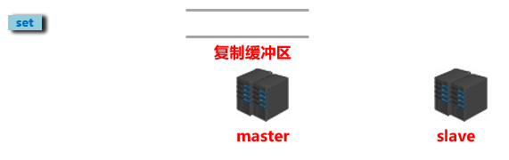
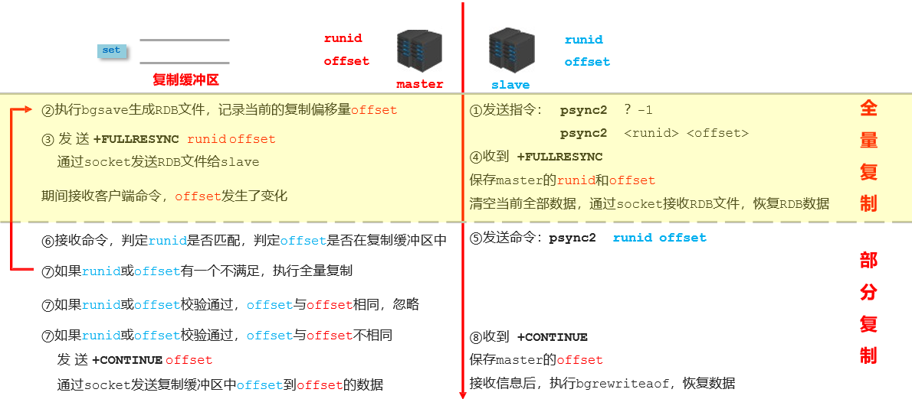
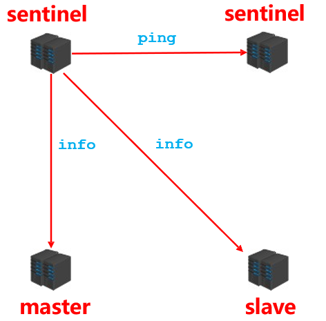
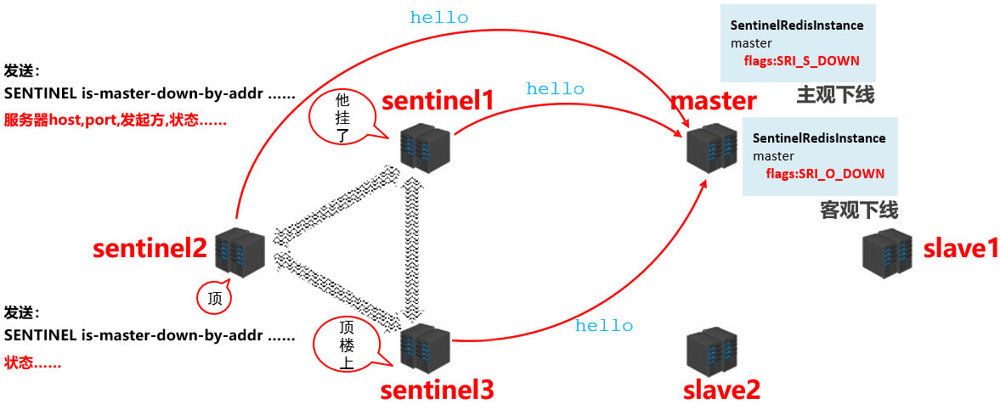
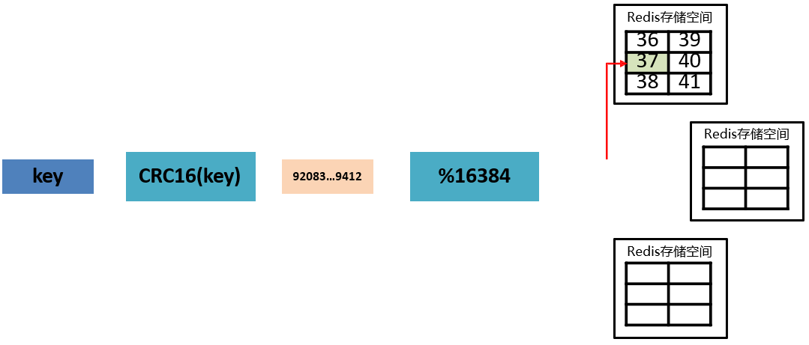

# 进阶

将一些耗时查询或者频繁使用的弄到缓存, 非阻塞IO多路复用,执行命令依然是单线程,

双写一致: 

- 最强一致 读写串行到一个队列中
- 双删 DelayQueue 随着JVM丢失更新的风险, 放在MQ 编码复杂
- 数据变更 删除缓存 还未更新数据库, 去读缓存落空 查数据库旧数据怎么办: 保证删除更新的原子性 

并发竞争

- 多个客户端对同一个key操作, 如果顺序错了就会导致数据错了
- redis天然cas  写缓存都是从mysql中查 mysql保存时间戳查出来的时间戳比缓存里的新才可以写, 否则就不能用旧数据覆盖

定期删除 + 惰性删除 + 内存淘汰机制(所有键/ 设置了过期时间的的key)

高并发主写从读 支持读高并发与水平扩容

- 第一次注册从节点时master传RDB(可以直接在内存, 也可以落盘)到slave, slave先写到磁盘在加载到内存中, 支持断点续传功能(host与ip不靠谱有run id)
- slave不会过期key 主节点过期会给slave同步一条del命令
- slave保存master host和ip 定时任务check是否有master, 提一下run id

持久化

- RDB可能是每5分种fork子线程生成rdb, 可能会导致服务卡顿且如果丢失数据就是丢失5分钟甚至更长的数据
- AOF则每隔1s,append-only 不用寻道 更快, AOF有时会不可用, RDB更加健壮
- 所以最好同时开启

哨兵集群高可用

> todo

雪崩, 穿透, 击穿

> todo

redis cluster

> todo


# 零、日常基础使用


> 一些配置 与说明


 

(守护进程)daemonize yes

启动: 

```shell
#可能需要进入redis目录
redis-server /usr/local/redis/redis.conf
redis-cli
auth (可以不写用户)密码

keys*
```

关闭

```bash
redis-cli shutdown
```


使用RedisDesktopManager连接远程服务器redis

修改 .conf 

​	bind 0.0.0.0 允许所有主机 127.~ 只允许本机

​	protectmode yes  只允许本机 no  允许所有主机

​	requierpass  密码


服务器防火墙开放 6379端口就ok

# 一、多线程VS单线程

## Redis工作线程是单线程的,整个Redis来说，是多线程的；

主要是指Redis的网络IO和键值对读写是由一个线程来完成的，Redis在处理客户端的请求时包括获取 (socket 读)、解析、执行、内容返回 (socket 写) 等都由一个顺序串行的主线程处理，这就是所谓的“单线程”。这也是Redis对外提供键值存储服务的主要流程。

但Redis的其他功能，比如持久化、异步删除、集群数据同步等等，其实是由额外的线程执行的。
Redis工作线程是单线程的，但是，整个Redis来说，是多线程的；


## 单线程快的原因

1 避免上下文切换：因为是单线程模型，因此就避免了不必要的上下文切换和多线程竞争，这就省去了多线程切换带来的时间和性能上的消耗，而且单线程不会导致死锁问题的发生

2 即使使用单线程模型也并发的处理多客户端的请求，主要使用的是多路复用和非阻塞 IO；

3 对于 Redis 系统来说，主要的性能瓶颈是内存或者网络带宽而并非 CPU。


## 单线程的弊病

正常情况下使用 del 指令可以很快的删除数据，而当被删除的 key 是一个非常大的对象时，例如时包含了成千上万个元素的 hash 集合时，那么 del 指令就会造成 Redis 主线程卡顿。

这就是redis3.x单线程时代最经典的故障，大key删除的头疼问题，

由于redis是单线程的，del  bigKey .....
等待很久这个线程才会释放，类似加了一个synchronized锁，你可以想象高并发下，程序堵成什么样子？

在Redis 4.0就引入了多个线程来实现数据的异步惰性删除等功能，
但是其处理读写请求的仍然只有一个线程，所以仍然算是狭义上的单线程


Redis将所有数据放在内存中，内存的响应时长大约为100纳秒，对于小数据包，Redis服务器可以处理8W到10W的QPS，

这也是Redis处理的极限了，对于80%的公司来说，单线程的Redis已经足够使用了。

## 默认单线程

在Redis6.0中，多线程机制默认是关闭的，如果需要使用多线程功能，需要在redis.conf中完成两个设置


1.设置io-thread-do-reads配置项为yes，表示启动多线程。

2。设置线程个数。关于线程数的设置，官方的建议是如果为 4 核的 CPU，建议线程数设置为 2 或 3，如果为 8 核 CPU 建议线程数设置为 6，线程数一定要小于机器核数，线程数并不是越大越好。


# 二、 五种数据类型


## 1. String	

### 1.1 常用指令

```shell
set key value
get key

同时设置/获取多个键值  
MGET key [key ....]
MSET key value [key value ....]

数值增减
INCR key
增加指定的整数 
INCRBY key increment
递减数值 
DECR key
减少指定的整数
DECRBY key decrement

获取字符串长度
STRLEN key

分布式锁
setnx key value
set key value [EX seconds] [PX milliseconds] [NX|XX]
```

### 1.2 应用场景	

比如抖音无限点赞某个视频或者商品，点一下加一次

## 2. Hash

Map<String,Map<Object,Object>>

### 2.1常用指令

```shell
一次设置一个字段值
HSET key field value
一次获取一个字段值
HGET key field
一次设置多个字段值
HMSET key field value [field value ...]
一次获取多个字段值
HMGET key field [field ....]
获取所有字段值
hgetall key
获取某个key内的全部数量
hlen
删除一个key
hdel
```


### 2.2应用场景

​	Map<String,Map<Object,Object>>

​	hset key field value 

​	JD早期购物车 中小场可用

​		新增商品 → hset shopcar:uid1024 334488 1

​		新增商品 → hset shopcar:uid1024 334477 1

​		增加商品数量 → hincrby shopcar:uid1024 334477 1

​		商品总数 → hlen shopcar:uid1024

​		全部选择 → hgetall shopcar:uid1024


## 3. List

一个双端链表的结构，容量是2的32次方减1个元素，大概40多亿，主要功能有push/pop等，一般用在栈、队列、消息队列等场景。

### 3.1 常用指令

```shell
向列表左边添加元素
LPUSH key value [value ...]
向列表右边添加元素
RPUSH key value [value ....]
查看列表
LRANGE key start stop
获取列表中元素的个数
LLEN key
```


### 3.2 应用场景	

微信订阅号消息,关注了作者,如果作者发布了文章 就会向关注的list添加

​		1 订阅了的公众号和CSDN发布了文章分别是 11 和 22

​		2 ggq关注了他们两个，只要他们发布了新文章，就会安装进ggq的List

 		  lpush likearticle:ggqid    11 22

​		3 查看ggq自己的号订阅的全部文章，类似分页，下面0~10就是一次显示10条

​		  lrange likearticle:ggqid 0 9

​	商品评论

​		商品ID key 和 value评论信息

​		按时间顺序


## 4. Set

### 4.1 常用指令

```she
添加元素
SADD key member [member ...]
删除元素
SREM key member [member ...]
遍历集合中的所有元素
SMEMBERS key
判断元素是否在集合中
SISMEMBER key member
获取集合中的元素总数
SCARD key
从集合中随机弹出一个元素，元素不删除
SRANDMEMBER key [数字]
从集合中随机弹出一个元素，出一个删一个
SPOP key [数字]

集合运算
SDIFF key [key ...] # 属于A但不属于B的元素构成的集合
SINTER key [key ...] # 属于A同时也属于B的共同拥有的元素构成的集合
SUNION key [key ...] # 属于A或者属于B的元素合并后的集合

```

### 4.2 应用场景

抽奖

1 用户ID，立即参与按钮

sadd key 用户ID

2 显示已经有多少人参与了，上图23208人参加

SCARD key

3 抽奖(从set中任意选取N个中奖人)

SRANDMEMBER key 2    随机抽奖2个人，元素不删除

SPOP key 3             随机抽奖3个人，元素会删除

​	集合运算 共同好友,共同关注

​	可能认识的人


## 5. sortedSet(Zset)

向有序集合中加入一个元素和该元素的分数

### 5.1

```shell
ZADD key score member [score member ...]

按照元素分数从小到大的顺序返回索引从start到stop之间的所有元素
ZRANGE key start stop [WITHSCORES]
获取元素的分数
ZSCORE key member
删除元素
ZREM key member [member ...]
获取指定分数范围的元素
ZRANGEBYSCORE key min max [WITHSCORES] [LIMIT offset count]
增加某个元素的分数
ZINCRBY key increment member
获取集合中元素的数量
ZCARD key
获得指定分数范围内的元素个数
ZCOUNT key min max
按照排名范围删除元素
ZREMRANGEBYRANK key start stop
获取元素的排名
ZRANK key member # 从小到大
ZREVRANK key member # 从大到小
```


### 5.2 应用场景

​	商品排行

​	抖音热搜 incrby

​	展示多少条 zrange min max

### 5.3 案例实战

# 三、数据结构

### 字典

散列表采用拉链法解决哈希冲突, 扩容: rehash 渐进式 会有个过程,在过程中会在两个字典进行查询, 扩容完成后释放一个

### 跳跃表

有序集合, 不需要进行旋转等维护平衡性, 方便实现, 支持无锁(todo)

# 四、使用场景

### 计数器

可以对 String 进行自增自减运算，从而实现计数器功能。

Redis 这种内存型数据库的读写性能非常高，很适合存储频繁读写的计数量。

### 缓存

将热点数据放到内存中，设置内存的最大使用量以及淘汰策略来保证缓存的命中率。

### 查找表

例如 DNS 记录就很适合使用 Redis 进行存储。

查找表和缓存类似，也是利用了 Redis 快速的查找特性。但是查找表的内容不能失效，而缓存的内容可以失效，因为缓存不作为可靠的数据来源。

### 消息队列

List 是一个双向链表，可以通过 lpush 和 rpop 写入和读取消息

不过最好使用 Kafka、RabbitMQ 等消息中间件。

### 会话缓存

可以使用 Redis 来统一存储多台应用服务器的会话信息。

当应用服务器不再存储用户的会话信息，也就不再具有状态，一个用户可以请求任意一个应用服务器，从而更容易实现高可用性以及可伸缩性。

### 分布式锁实现

在分布式场景下，无法使用单机环境下的锁来对多个节点上的进程进行同步。

可以使用 Redis 自带的 SETNX 命令实现分布式锁，除此之外，还可以使用官方提供的 RedLock 分布式锁实现。

### 其它

Set 可以实现交集、并集等操作，从而实现共同好友等功能。

ZSet 可以实现有序性操作，从而实现排行榜等功能。

# 五、键的过期时间

内存中的数据可以通过TTL指令获取其状态

TTL返回的值有三种情况：正数，-1，-2

- **正数**：代表该数据在内存中还能存活的时间
- **-1**：永久有效的数据
- **-2** ：已经过期的数据 或被删除的数据 或 未定义的数据

**删除策略就是针对已过期数据的处理策略**

Redis 可以为每个键设置过期时间，当键过期时，会自动删除该键。

对于散列表这种容器，只能为整个键设置过期时间（整个散列表），而不能为键里面的单个元素设置过期时间。

# 六、数据淘汰策略

可以设置内存最大使用量，当内存使用量超出时，会施行数据淘汰策略。

Redis 具体有 6 种淘汰策略：

|      策略       |                         描述                         |
| :-------------: | :--------------------------------------------------: |
|  volatile-lru   | 从已设置过期时间的数据集中挑选最近最少使用的数据淘汰 |
|  volatile-ttl   |   从已设置过期时间的数据集中挑选将要过期的数据淘汰   |
| volatile-random |      从已设置过期时间的数据集中任意选择数据淘汰      |
|   allkeys-lru   |       从所有数据集中挑选最近最少使用的数据淘汰       |
| allkeys-random  |          从所有数据集中任意选择数据进行淘汰          |
|   noeviction    |                     禁止驱逐数据                     |

作为内存数据库，出于对性能和内存消耗的考虑，Redis 的淘汰算法实际实现上并非针对所有 key，而是抽样一小部分并且从中选出被淘汰的 key。

使用 Redis 缓存数据时，为了提高缓存命中率，需要保证缓存数据都是热点数据。可以将内存最大使用量设置为热点数据占用的内存量，然后启用 allkeys-lru 淘汰策略，将最近最少使用的数据淘汰。

Redis 4.0 引入了 volatile-lfu 和 allkeys-lfu 淘汰策略，LFU 策略通过统计访问频率，将访问频率最少的键值对淘汰。

# 七、持久化

Redis 是内存型数据库，为了保证数据在断电后不会丢失，需要将内存中的数据持久化到硬盘上。

# 八、RDB 持久化

将某个时间点的所有数据都存放到硬盘上。

可以将快照复制到其它服务器从而创建具有相同数据的服务器副本。

如果系统发生故障，将会丢失最后一次创建快照之后的数据。

如果数据量很大，保存快照的时间会很长。

# 九、AOF 持久化

将写命令添加到 AOF 文件（Append Only File）的末尾。

使用 AOF 持久化需要设置同步选项，从而确保写命令同步到磁盘文件上的时机。这是因为对文件进行写入并不会马上将内容同步到磁盘上，而是先存储到缓冲区，然后由操作系统决定什么时候同步到磁盘。有以下同步选项：

|   选项   |         同步频率         |
| :------: | :----------------------: |
|  always  |     每个写命令都同步     |
| everysec |       每秒同步一次       |
|    no    | 让操作系统来决定何时同步 |

- always 选项会严重减低服务器的性能；
- everysec 选项比较合适，可以保证系统崩溃时只会丢失一秒左右的数据，并且 Redis 每秒执行一次同步对服务器性能几乎没有任何影响；
- no 选项并不能给服务器性能带来多大的提升，而且也会增加系统崩溃时数据丢失的数量。

随着服务器写请求的增多，AOF 文件会越来越大。Redis 提供了一种将 AOF 重写的特性，能够去除 AOF 文件中的冗余写命令。

# 十、事务

一个事务包含了多个命令，服务器在执行事务期间，不会改去执行其它客户端的命令请求。

事务中的多个命令被一次性发送给服务器，而不是一条一条发送，这种方式被称为流水线，它可以减少客户端与服务器之间的网络通信次数从而提升性能。

Redis 最简单的事务实现方式是使用 MULTI 和 EXEC 命令将事务操作包围起来。

# 十一、事件

Redis 服务器是一个事件驱动程序。

### 文件事件

服务器通过套接字与客户端或者其它服务器进行通信，文件事件就是对套接字操作的抽象。

Redis 基于 Reactor 模式开发了自己的网络事件处理器，使用 I/O 多路复用程序来同时监听多个套接字，并将到达的事件传送给文件事件分派器，分派器会根据套接字产生的事件类型调用相应的事件处理器。

<div align="center">  </div><br>

### 时间事件

服务器有一些操作需要在给定的时间点执行，时间事件是对这类定时操作的抽象。

时间事件又分为：

- 定时事件：是让一段程序在指定的时间之内执行一次；
- 周期性事件：是让一段程序每隔指定时间就执行一次。

Redis 将所有时间事件都放在一个无序链表中，通过遍历整个链表查找出已到达的时间事件，并调用相应的事件处理器。

### 事件的调度与执行

服务器需要不断监听文件事件的套接字才能得到待处理的文件事件，但是不能一直监听，否则时间事件无法在规定的时间内执行，因此监听时间应该根据距离现在最近的时间事件来决定。

事件调度与执行由 aeProcessEvents 函数负责，伪代码如下：

```python
def aeProcessEvents():
    # 获取到达时间离当前时间最接近的时间事件
    time_event = aeSearchNearestTimer()
    # 计算最接近的时间事件距离到达还有多少毫秒
    remaind_ms = time_event.when - unix_ts_now()
    # 如果事件已到达，那么 remaind_ms 的值可能为负数，将它设为 0
    if remaind_ms < 0:
        remaind_ms = 0
    # 根据 remaind_ms 的值，创建 timeval
    timeval = create_timeval_with_ms(remaind_ms)
    # 阻塞并等待文件事件产生，最大阻塞时间由传入的 timeval 决定
    aeApiPoll(timeval)
    # 处理所有已产生的文件事件
    procesFileEvents()
    # 处理所有已到达的时间事件
    processTimeEvents()
```

将 aeProcessEvents 函数置于一个循环里面，加上初始化和清理函数，就构成了 Redis 服务器的主函数，伪代码如下：

```python
def main():
    # 初始化服务器
    init_server()
    # 一直处理事件，直到服务器关闭为止
    while server_is_not_shutdown():
        aeProcessEvents()
    # 服务器关闭，执行清理操作
    clean_server()
```

从事件处理的角度来看，服务器运行流程如下：

<div align="center">  </div><br>

# 十二、复制

通过使用 slaveof host port 命令来让一个服务器成为另一个服务器的从服务器。

一个从服务器只能有一个主服务器，并且不支持主主复制。

### 连接过程

1. 主服务器创建快照文件，发送给从服务器，并在发送期间使用缓冲区记录执行的写命令。快照文件发送完毕之后，开始向从服务器发送存储在缓冲区中的写命令；

2. 从服务器丢弃所有旧数据，载入主服务器发来的快照文件，之后从服务器开始接受主服务器发来的写命令；

3. 主服务器每执行一次写命令，就向从服务器发送相同的写命令。

### 主从链

随着负载不断上升，主服务器可能无法很快地更新所有从服务器，或者重新连接和重新同步从服务器将导致系统超载。为了解决这个问题，可以创建一个中间层来分担主服务器的复制工作。中间层的服务器是最上层服务器的从服务器，又是最下层服务器的主服务器。

<div align="center">  </div><br>

# 十三、Sentinel

Sentinel（哨兵）可以监听集群中的服务器，并在主服务器进入下线状态时，自动从从服务器中选举出新的主服务器。

# 十四、分片

分片是将数据划分为多个部分的方法，可以将数据存储到多台机器里面，这种方法在解决某些问题时可以获得线性级别的性能提升。

假设有 4 个 Redis 实例 R0，R1，R2，R3，还有很多表示用户的键 user:1，user:2，... ，有不同的方式来选择一个指定的键存储在哪个实例中。

- 最简单的方式是范围分片，例如用户 id 从 0\~1000 的存储到实例 R0 中，用户 id 从 1001\~2000 的存储到实例 R1 中，等等。但是这样需要维护一张映射范围表，维护操作代价很高。
- 还有一种方式是哈希分片，使用 CRC32 哈希函数将键转换为一个数字，再对实例数量求模就能知道应该存储的实例。

根据执行分片的位置，可以分为三种分片方式：

- 客户端分片：客户端使用一致性哈希等算法决定键应当分布到哪个节点。
- 代理分片：将客户端请求发送到代理上，由代理转发请求到正确的节点上。
- 服务器分片：Redis Cluster。

# 十五、一个简单的论坛系统分析

该论坛系统功能如下：

- 可以发布文章；
- 可以对文章进行点赞；
- 在首页可以按文章的发布时间或者文章的点赞数进行排序显示。

### 文章信息

文章包括标题、作者、赞数等信息，在关系型数据库中很容易构建一张表来存储这些信息，在 Redis 中可以使用 HASH 来存储每种信息以及其对应的值的映射。

Redis 没有关系型数据库中的表这一概念来将同种类型的数据存放在一起，而是使用命名空间的方式来实现这一功能。键名的前面部分存储命名空间，后面部分的内容存储 ID，通常使用 : 来进行分隔。例如下面的 HASH 的键名为 article:92617，其中 article 为命名空间，ID 为 92617。

<div align="center">  </div><br>

### 点赞功能

当有用户为一篇文章点赞时，除了要对该文章的 votes 字段进行加 1 操作，还必须记录该用户已经对该文章进行了点赞，防止用户点赞次数超过 1。可以建立文章的已投票用户集合来进行记录。

为了节约内存，规定一篇文章发布满一周之后，就不能再对它进行投票，而文章的已投票集合也会被删除，可以为文章的已投票集合设置一个一周的过期时间就能实现这个规定。

<div align="center">  </div><br>

### 对文章进行排序

为了按发布时间和点赞数进行排序，可以建立一个文章发布时间的有序集合和一个文章点赞数的有序集合。（下图中的 score 就是这里所说的点赞数；下面所示的有序集合分值并不直接是时间和点赞数，而是根据时间和点赞数间接计算出来的）

<div align="center">  </div><br>

## 参考资料

- Carlson J L. Redis in Action[J]. Media.johnwiley.com.au, 2013.
- [黄健宏. Redis 设计与实现 [M]. 机械工业出版社, 2014.](http://redisbook.com/index.html)
- [REDIS IN ACTION](https://redislabs.com/ebook/foreword/)
- [Skip Lists: Done Right](http://ticki.github.io/blog/skip-lists-done-right/)
- [论述 Redis 和 Memcached 的差异](http://www.cnblogs.com/loveincode/p/7411911.html)
- [Redis 3.0 中文版- 分片](http://wiki.jikexueyuan.com/project/redis-guide)
- [Redis 应用场景](http://www.scienjus.com/redis-use-case/)
- [Using Redis as an LRU cache](

# 第六章 redis新类型bitmap/hyperloglgo/GEO

存的进+取得快+多统计

## 亿级系统中常见的四种统计统计的类型

1. 聚合统计

   1. 统计多个集合元素的聚合结果，就是前面讲解过的交差并等集合统计
   2. 交并差集和聚合函数的应用

2. 排序统计

   1. 抖音视频最新评论留言的场景，请你设计一个展现列表。

      考察你的数据结构和设计思路

   2. 设计案例和回答思路

      1. 每个商品评价对应一个List集合，这个List包含了对这个商品的所有评论，而且会按照评论时间保存这些评论，

         每来一个新评论就用LPUSH命令把它插入List的队头。但是，如果在演示第二页前，又产生了一个新评论，

         第2页的评论不一样了。原因：

         List是通过元素在List中的位置来排序的，当有一个新元素插入时，原先的元素在List中的位置都后移了一位，

         原来在第1位的元素现在排在了第2位，当LRANGE读取时，就会读到旧元素。

         

         

         在⾯对需要展示最新列表、排行榜等场景时，

         如果数据更新频繁或者需要分页显示，建议使⽤ZSet

3. 二值统计

   1. 集合元素的取值就只有0和1两种。

      在钉钉上班签到打卡的场景中，我们只用记录有签到(1)或没签到(0) bitmap

      

4. 基数统计

   1. 指统计⼀个集合中不重复的元素个数 见hyperloglog

## 1. BitMap

### 1.1 常用指令


### 1.2应用场景

​	按字节(8位)扩容	

​	setbit key offset value 偏移位从0开始算 value 只能是01

​	由0和1状态表现的二进制位的bit数组

​	用于状态统计

​			

## 2. HyperLogLog

### 2.1 常用指令


### 2.2应用场景

## 3. GEO

### 3.1 常用指令


### 3.2应用场景


# 第七章 布隆过滤器

​	由一个初值都为零的bit数组和多个哈希函数构成，

​	用来快速判断某个数据是否存在

​	判断结果没有的一定没有,有的大概率有 只添加不删除

​	多重hash 

## linux安装布隆过滤器的两种方式

1. 采用docker安装RedisBloom，推荐

   1. Redis 在 4.0 之后有了插件功能（Module），可以使用外部的扩展功能，

      可以使用 RedisBloom 作为 Redis 布隆过滤器插件。

   2. docker run -p 6379:6379 --name=redis6379bloom -d redislabs/rebloom

      

   3. docker exec -it redis6379bloom /bin/bash 

      1. redis-cli


## 常用指令

```shell
bf.reserve key error_rate的值 initial_size 的值 默认的error_rate是 0.01，
默认的initial_size是 100。
bf.add key 值
bf.exists key 值
bf.madd 一次添加多个元素
bf.mexists 一次查询多个元素是否存在
```


# Redis高级(具体操作)

## 1. 数据过期删除

#### 1.2.2 定时删除

创建一个定时器，当key设置有过期时间，且过期时间到达时，由定时器任务立即执行对键的删除操作

- **优点**：节约内存，到时就删除，快速释放掉不必要的内存占用
- **缺点**：CPU压力很大，无论CPU此时负载量多高，均占用CPU，会影响redis服务器响应时间和指令吞吐量
- **总结**：用处理器性能换取存储空间（拿时间换空间）

#### 1.2.3 惰性删除

数据到达过期时间，不做处理。等下次访问该数据时，我们需要判断

1. 如果未过期，返回数据
2. 发现已过期，删除，返回不存在

- **优点**：节约CPU性能，发现必须删除的时候才删除
- **缺点**：内存压力很大，出现长期占用内存的数据
- **总结**：用存储空间换取处理器性能（拿时间换空间）

#### 1.2.4 定期删除

定时删除和惰性删除这两种方案都是走的极端，那有没有折中方案？

我们来讲redis的定期删除方案：

- Redis启动服务器初始化时，读取配置server.hz的值，默认为10 即每100ms一次

- 每秒钟执行server.hz次**serverCron()**-------->**databasesCron()**--------->**activeExpireCycle()**

- **activeExpireCycle()**对每个expires[*]逐一进行检测，每次执行耗时：250ms/server.hz

- 对某个expires[*]检测时，随机挑选W个key检测

```markdown
  如果key超时，删除key

  如果一轮中删除的key的数量>W*25%，循环该过程

  如果一轮中删除的key的数量≤W*25%，检查下一个expires[*]，0-15循环

  W取值=ACTIVE_EXPIRE_CYCLE_LOOKUPS_PER_LOOP属性值
```

- 参数current_db用于记录**activeExpireCycle()** 进入哪个expires[*] 执行

- 如果activeExpireCycle()执行时间到期，下次从current_db继续向下执行

总的来说：定期删除就是周期性轮询redis库中的时效性数据，采用随机抽取的策略，利用过期数据占比的方式控制删除频度

- **特点1**：CPU性能占用设置有峰值，检测频度可自定义设置
- **特点2**：内存压力不是很大，长期占用内存的冷数据会被持续清理
- **总结**：周期性抽查存储空间（随机抽查，重点抽查）

### 1.3 数据淘汰策略（逐出算法）

#### 1.3.1 淘汰策略概述

什么叫数据淘汰策略？什么样的应用场景需要用到数据淘汰策略？

#### 1.3.2 策略配置

影响数据淘汰的相关配置如下：

1：最大可使用内存，即占用物理内存的比例，默认值为0，表示不限制。生产环境中根据需求设定，通常设置在50%以上

```properties
maxmemory ?mb
```

2：每次选取待删除数据的个数，采用随机获取数据的方式作为待检测删除数据

```properties
maxmemory-samples count
```

3：对数据进行删除的选择策略

```properties
maxmemory-policy policy
```

那数据删除的策略policy到底有几种呢？一共是**3类8种**

**第一类**：检测易失数据（可能会过期的数据集server.db[i].expires ）

```properties
volatile-lru：挑选最近最少使用的数据淘汰
volatile-lfu：挑选最近使用次数最少的数据淘汰
volatile-ttl：挑选将要过期的数据淘汰
volatile-random：任意选择数据淘汰
```

**第二类**：检测全库数据（所有数据集server.db[i].dict ）

```properties
allkeys-lru：挑选最近最少使用的数据淘汰
allkeLyRs-lfu：：挑选最近使用次数最少的数据淘汰
allkeys-random：任意选择数据淘汰，相当于随机
```

**第三类**：放弃数据驱逐

```properties
no-enviction（驱逐）：禁止驱逐数据(redis4.0中默认策略)，会引发OOM(Out Of Memory)
```

注意：这些策略是配置到哪个属性上？怎么配置？如下所示

```properties
maxmemory-policy volatile-lru
```

**数据淘汰策略配置依据**

 使用INFO命令输出监控信息，查询缓存 hit 和 miss 的次数，根据业务需求调优Redis配置

## 2.主从复制

### 


- 高并发

  > 应用要提供某一业务要能支持很多客户端同时访问的能力，我们称为并发，高并发意思就很明确了

- 高性能

  >性能带给我们最直观的感受就是：速度快，时间短

- 高可用

  > **可用性**：一年中应用服务正常运行的时间占全年时间的百分比


#### 2.1.3 主从复制的作用

- 读写分离：master写、slave读，提高服务器的读写负载能力
- 负载均衡：基于主从结构，配合读写分离，由slave分担master负载，并根据需求的变化，改变slave的数 量，通过多个从节点分担数据读取负载，大大提高Redis服务器并发量与数据吞吐量
- 故障恢复：当master出现问题时，由slave提供服务，实现快速的故障恢复
- 数据冗余：实现数据热备份，是持久化之外的一种数据冗余方式
- 高可用基石：基于主从复制，构建哨兵模式与集群，实现Redis的高可用方案


#### 2.2.1 主从复制的工作流程（三个阶段）

##### 2.2.1.1 阶段一：建立连接

建立slave到master的连接，使master能够识别slave，并保存slave端口号

流程如下：

1. 步骤1：设置master的地址和端口，保存master信息
2. 步骤2：建立socket连接
3. 步骤3：发送ping命令（定时器任务）
4. 步骤4：身份验证
5. 步骤5：发送slave端口信息

至此，主从连接成功！

当前状态：

slave：保存master的地址与端口

master：保存slave的端口

总体：之间创建了连接的socket

**master和slave互联**

接下来就要通过某种方式将master和slave连接到一起

方式一：客户端发送命令

```properties
slaveof masterip masterport
```

方式二：启动服务器参数

```properties
redis-server --slaveof masterip masterport
```

方式三：服务器配置（**主流方式**）

```properties
slaveof masterip masterport
```

slave系统信息

```properties
master_link_down_since_seconds
masterhost & masterport
```

master系统信息

```properties
uslave_listening_port(多个)
```

**主从断开连接**

断开slave与master的连接，slave断开连接后，不会删除已有数据，只是不再接受master发送的数据

```properties
slaveof no one
```

**授权访问**

master客户端发送命令设置密码

```properties
requirepass password
```

master配置文件设置密码

```properties
config set requirepass password
config get requirepass
```

slave客户端发送命令设置密码

```properties
auth password
```

slave配置文件设置密码

```properties
masterauth password
```

slave启动服务器设置密码

```properties
redis-server –a password
```


##### 2.2.1.2 阶段二：数据同步

- 在slave初次连接master后，复制master中的所有数据到slave
- 将slave的数据库状态更新成master当前的数据库状态

同步过程如下：

1. 步骤1：请求同步数据
2. 步骤2：创建RDB同步数据
3. 步骤3：恢复RDB同步数据
4. 步骤4：请求部分同步数据
5. 步骤5：恢复部分同步数据

至此，数据同步工作完成！

当前状态：

slave：具有master端全部数据，包含RDB过程接收的数据

master：保存slave当前数据同步的位置

总体：之间完成了数据克隆


**数据同步阶段master说明**

1：如果master数据量巨大，数据同步阶段应避开流量高峰期，避免造成master阻塞，影响业务正常执行

2：复制缓冲区大小设定不合理，会导致数据溢出。如进行全量复制周期太长，进行部分复制时发现数据已经存在丢失的情况，必须进行第二次全量复制，致使slave陷入死循环状态。

```properties
repl-backlog-size ?mb
```

3. master单机内存占用主机内存的比例不应过大，建议使用50%-70%的内存，留下30%-50%的内存用于执 行bgsave命令和创建复制缓冲区



**数据同步阶段slave说明**

1. 为避免slave进行全量复制、部分复制时服务器响应阻塞或数据不同步，建议关闭此期间的对外服务

```properties
   slave-serve-stale-data yes|no
```

2. 数据同步阶段，master发送给slave信息可以理解master是slave的一个客户端，主动向slave发送命令

3. 多个slave同时对master请求数据同步，master发送的RDB文件增多，会对带宽造成巨大冲击，如果master带宽不足，因此数据同步需要根据业务需求，适量错峰

4. slave过多时，建议调整拓扑结构，由一主多从结构变为树状结构，中间的节点既是master，也是 slave。注意使用树状结构时，由于层级深度，导致深度越高的slave与最顶层master间数据同步延迟 较大，数据一致性变差，应谨慎选择

##### 2.2.1.3 阶段三：命令传播

- 当master数据库状态被修改后，导致主从服务器数据库状态不一致，此时需要让主从数据同步到一致的状态，同步的动作称为命令传播
- master将接收到的数据变更命令发送给slave，slave接收命令后执行命令

**命令传播阶段的部分复制**

命令传播阶段出现了断网现象：

网络闪断闪连：忽略

短时间网络中断：部分复制

长时间网络中断：全量复制


这里我们主要来看部分复制，部分复制的三个核心要素

1. 服务器的运行 id（run id）
2. 主服务器的复制积压缓冲区
3. 主从服务器的复制偏移量

- 服务器运行ID（runid）

```markdown
概念：服务器运行ID是每一台服务器每次运行的身份识别码，一台服务器多次运行可以生成多个运行id

组成：运行id由40位字符组成，是一个随机的十六进制字符
例如：fdc9ff13b9bbaab28db42b3d50f852bb5e3fcdce

作用：运行id被用于在服务器间进行传输，识别身份
如果想两次操作均对同一台服务器进行，必须每次操作携带对应的运行id，用于对方识别

实现方式：运行id在每台服务器启动时自动生成的，master在首次连接slave时，会将自己的运行ID发送给slave，
slave保存此ID，通过info Server命令，可以查看节点的runid
```

- 复制缓冲区

```markdown
概念：复制缓冲区，又名复制积压缓冲区，是一个先进先出（FIFO）的队列，用于存储服务器执行过的命令，每次传播命令，master都会将传播的命令记录下来，并存储在复制缓冲区
	复制缓冲区默认数据存储空间大小是1M
	当入队元素的数量大于队列长度时，最先入队的元素会被弹出，而新元素会被放入队列
作用：用于保存master收到的所有指令（仅影响数据变更的指令，例如set，select）

数据来源：当master接收到主客户端的指令时，除了将指令执行，会将该指令存储到缓冲区中
```


复制缓冲区内部工作原理：

组成

- 偏移量

  >概念：一个数字，描述复制缓冲区中的指令字节位置
  >
  >分类：
  >
  >- master复制偏移量：记录发送给所有slave的指令字节对应的位置（多个）
  >- slave复制偏移量：记录slave接收master发送过来的指令字节对应的位置（一个）
  >
  >作用：同步信息，比对master与slave的差异，当slave断线后，恢复数据使用
  >
  >数据来源：
  >
  >- master端：发送一次记录一次
  >- slave端：接收一次记录一次

- 字节值

工作原理

- 通过offset区分不同的slave当前数据传播的差异
- master记录已发送的信息对应的offset
- slave记录已接收的信息对应的offset


#### 2.2.2 流程更新(全量复制/部分复制)

我们再次的总结一下主从复制的三个阶段的工作流程：



#### 2.2.3 心跳机制

什么是心跳机制？

进入命令传播阶段候，master与slave间需要进行信息交换，使用心跳机制进行维护，实现双方连接保持在线

master心跳：

- 内部指令：PING
- 周期：由repl-ping-slave-period决定，默认10秒
- 作用：判断slave是否在线
- 查询：INFO replication  获取slave最后一次连接时间间隔，lag项维持在0或1视为正常

slave心跳任务

- 内部指令：REPLCONF ACK {offset}
- 周期：1秒
- 作用1：汇报slave自己的复制偏移量，获取最新的数据变更指令
- 作用2：判断master是否在线

心跳阶段注意事项：

- 当slave多数掉线，或延迟过高时，master为保障数据稳定性，将拒绝所有信息同步

```properties
min-slaves-to-write 2
min-slaves-max-lag 8
```

slave数量少于2个，或者所有slave的延迟都大于等于8秒时，强制关闭master写功能，停止数据同步

- slave数量由slave发送REPLCONF ACK命令做确认


- slave延迟由slave发送REPLCONF ACK命令做确认


至此：我们可以总结出完整的主从复制流程：


### 2.3 主从复制常见问题

#### 2.3.1 频繁的全量复制

- 伴随着系统的运行，master的数据量会越来越大，一旦master重启，runid将发生变化，会导致全部slave的全量复制操作


内部优化调整方案：

1：master内部创建master_replid变量，使用runid相同的策略生成，长度41位，并发送给所有slave

2：在master关闭时执行命令shutdown save，进行RDB持久化,将runid与offset保存到RDB文件中

```markdown
repl-id  repl-offset

通过redis-check-rdb命令可以查看该信息
```

3：master重启后加载RDB文件，恢复数据，重启后，将RDB文件中保存的repl-id与repl-offset加载到内存中

```markdown
master_repl_id=repl  master_repl_offset =repl-offset

通过info命令可以查看该信息
```

作用：本机保存上次runid，重启后恢复该值，使所有slave认为还是之前的master


- 第二种出现频繁全量复制的问题现象：网络环境不佳，出现网络中断，slave不提供服务


问题原因：复制缓冲区过小，断网后slave的offset越界，触发全量复制

最终结果：slave反复进行全量复制

解决方案：修改复制缓冲区大小

```properties
repl-backlog-size ?mb
```

建议设置如下：

1.测算从master到slave的重连平均时长second

2.获取master平均每秒产生写命令数据总量write_size_per_second

3.最优复制缓冲区空间 = 2 * second * write_size_per_second


#### 2.3.2 频繁的网络中断

- 问题现象：master的CPU占用过高 或 slave频繁断开连接


问题原因

```markdown
slave每1秒发送REPLCONFACK命令到master

当slave接到了慢查询时（keys * ，hgetall等），会大量占用CPU性能

master每1秒调用复制定时函数replicationCron()，比对slave发现长时间没有进行响应
```

最终结果：master各种资源（输出缓冲区、带宽、连接等）被严重占用

解决方案：通过设置合理的超时时间，确认是否释放slave

```properties
repl-timeout seconds
```

该参数定义了超时时间的阈值（默认60秒），超过该值，释放slave


- 问题现象：slave与master连接断开


问题原因

```markdown
master发送ping指令频度较低

master设定超时时间较短

ping指令在网络中存在丢包
```

解决方案：提高ping指令发送的频度

```properties
repl-ping-slave-period seconds
```

超时时间repl-time的时间至少是ping指令频度的5到10倍，否则slave很容易判定超时

#### 2.3.3 数据不一致

问题现象：多个slave获取相同数据不同步

问题原因：网络信息不同步，数据发送有延迟

解决方案

```markdown
优化主从间的网络环境，通常放置在同一个机房部署，如使用阿里云等云服务器时要注意此现象

监控主从节点延迟（通过offset）判断，如果slave延迟过大，暂时屏蔽程序对该slave的数据访问
```

```properties
slave-serve-stale-data	yes|no
```

开启后仅响应info、slaveof等少数命令（慎用，除非对数据一致性要求很高）

## 3.哨兵模式

**哨兵**

哨兵(sentinel) 是一个分布式系统，用于对主从结构中的每台服务器进行**监控**，当出现故障时通过**投票**机制**选择**新的master并将所有slave连接到新的master。


#### 3.1.2 哨兵作用

哨兵的作用：

- 监控：监控master和slave

  不断的检查master和slave是否正常运行

  master存活检测、master与slave运行情况检测


- 通知（提醒）：当被监控的服务器出现问题时，向其他（哨兵间，客户端）发送通知


- 自动故障转移：断开master与slave连接，选取一个slave作为master，将其他slave连接新的master，并告知客户端新的服务器地址

注意：哨兵也是一台redis服务器，只是不提供数据相关服务，通常哨兵的数量配置为单数

### 3.2 启用哨兵

配置哨兵

- 配置一拖二的主从结构（利用之前的方式启动即可）

- 配置三个哨兵（配置相同，端口不同），参看sentinel.conf

1：设置哨兵监听的主服务器信息， sentinel_number表示参与投票的哨兵数量

```properties
sentinel monitor master_name  master_host	master_port	 sentinel_number
```

2：设置判定服务器宕机时长，该设置控制是否进行主从切换

```properties
sentinel down-after-milliseconds master_name	million_seconds
```

3：设置故障切换的最大超时时

```properties
sentinel failover-timeout master_name	million_seconds
```

4：设置主从切换后，同时进行数据同步的slave数量，数值越大，要求网络资源越高，数值越小，同步时间越长

```properties
sentinel parallel-syncs master_name sync_slave_number
```


- 启动哨兵

```properties
redis-sentinel filename
```

### 3.3 哨兵工作原理

哨兵在进行主从切换过程中经历三个阶段

- 监控
- 通知
- 故障转移

#### 3.3.1 监控

用于同步各个节点的状态信息



- 获取各个sentinel的状态（是否在线）


- 获取master的状态

```markdown
master属性
	prunid
	prole：master
各个slave的详细信息	
```

- 获取所有slave的状态（根据master中的slave信息）

```markdown
slave属性
	prunid
	prole：slave
	pmaster_host、master_port
	poffset
```

其内部的工作原理具体如下：


#### 3.3.2 通知

sentinel在通知阶段要不断的去获取master/slave的信息，然后在各个sentinel之间进行共享，具体的流程如下：


#### 3.3.3 故障转移

当master宕机后sentinel是如何知晓并判断出master是真的宕机了呢？我们来看具体的操作流程



当sentinel认定master下线之后，此时需要决定更换master，那这件事由哪个sentinel来做呢？这时候sentinel之间要进行选举，如下图所示：


在选举的时候每一个人手里都有一票，而每一个人的又都想当这个处理事故的人，那怎么办？大家就开始抢，于是每个人都会发出一个指令，在内网里边告诉大家我要当选举人，比如说现在的sentinel1和sentinel4发出这个选举指令了，那么sentinel2既能接到sentinel1的也能接到sentinel4的，接到了他们的申请以后呢，sentinel2他就会把他的一票投给其中一方，投给谁呢？谁先过来我投给谁，假设sentinel1先过来，所以这个票就给到了sentinel1。那么给过去以后呢，现在sentinel1就拿到了一票，按照这样的一种形式，最终会有一个选举结果。对应的选举最终得票多的，那自然就成为了处理事故的人。需要注意在这个过程中有可能会存在失败的现象，就是一轮选举完没有选取，那就会接着进行第二轮第三轮直到完成选举。

接下来就是由选举胜出的sentinel去从slave中选一个新的master出来的工作，这个流程是什么样的呢？

首先它有一个在服务器列表中挑选备选master的原则

- 不在线的OUT


- 响应慢的OUT


- 与原master断开时间久的OUT


- 优先原则

  ​	优先级
  ​		offset
  ​		runid

选出新的master之后，发送指令（ sentinel ）给其他的slave：

- 向新的master发送slaveof no one


- 向其他slave发送slaveof 新masterIP端口


**总结**：故障转移阶段

1. 发现问题，主观下线与客观下线
2. 竞选负责人
3. 优选新master
4. 新master上任，其他slave切换master，原master作为slave故障恢复后连接

## 4.集群cluster

现状问题：业务发展过程中遇到的峰值瓶颈

- redis提供的服务OPS可以达到10万/秒，当前业务OPS已经达到10万/秒
- 内存单机容量达到256G，当前业务需求内存容量1T
- 使用集群的方式可以快速解决上述问题

### 4.1 集群简介

集群就是使用网络将若干台计算机联通起来，并提供统一的管理方式，使其对外呈现单机的服务效果


**集群作用：**

- 分散单台服务器的访问压力，实现负载均衡
- 分散单台服务器的存储压力，实现可扩展性
- 降低单台服务器宕机带来的业务灾难


### 4.2 Cluster集群结构设计

**数据存储设计：**

1. 通过算法设计，计算出key应该保存的位置

2. 将所有的存储空间计划切割成16384份，每台主机保存一部分

   注意：每份代表的是一个存储空间，不是一个key的保存空间

3. 将key按照计算出的结果放到对应的存储空间



那redis的集群是如何增强可扩展性的呢？譬如我们要增加一个集群节点


当我们查找数据时，集群是如何操作的呢？

- 各个数据库相互通信，保存各个库中槽的编号数据
- 一次命中，直接返回
- 一次未命中，告知具体位置


### 4.3 Cluster集群结构搭建

首先要明确的几个要点：

- 配置服务器（3主3从）
- 建立通信（Meet）
- 分槽（Slot）
- 搭建主从（master-slave）

**Cluster配置**

- 是否启用cluster，加入cluster节点

```properties
cluster-enabled yes|no
```

- cluster配置文件名，该文件属于自动生成，仅用于快速查找文件并查询文件内容

```properties
cluster-config-file filename
```

- 节点服务响应超时时间，用于判定该节点是否下线或切换为从节点

```properties
cluster-node-timeout milliseconds
```

- master连接的slave最小数量

```properties
cluster-migration-barrier min_slave_number
```

**Cluster节点操作命令**

-  查看集群节点信息

```properties
cluster nodes
```

- 更改slave指向新的master

```properties
cluster replicate master-id
```

- 发现一个新节点，新增master

```properties
cluster meet ip:port
```

- 忽略一个没有solt的节点

```properties
cluster forget server_id
```

- 手动故障转移

```properties
cluster failover
```

**集群操作命令：**

- 创建集群

```properties
redis-cli –-cluster create masterhost1:masterport1 masterhost2:masterport2  masterhost3:masterport3 [masterhostn:masterportn …] slavehost1:slaveport1  slavehost2:slaveport2 slavehost3:slaveport3 -–cluster-replicas n
```

注意：master与slave的数量要匹配，一个master对应n个slave，由最后的参数n决定

master与slave的匹配顺序为第一个master与前n个slave分为一组，形成主从结构


- 添加master到当前集群中，连接时可以指定任意现有节点地址与端口

```properties
redis-cli --cluster add-node new-master-host:new-master-port now-host:now-port
```

- 添加slave

```properties
redis-cli --cluster add-node new-slave-host:new-slave-port master-host:master-port --cluster-slave --cluster-master-id masterid
```

- 删除节点，如果删除的节点是master，必须保障其中没有槽slot

```properties
redis-cli --cluster del-node del-slave-host:del-slave-port del-slave-id
```

- 重新分槽，分槽是从具有槽的master中划分一部分给其他master，过程中不创建新的槽

```properties
redis-cli --cluster reshard new-master-host:new-master:port --cluster-from src-  master-id1, src-master-id2, src-master-idn --cluster-to target-master-id --  cluster-slots slots
```

注意：将需要参与分槽的所有masterid不分先后顺序添加到参数中，使用，分隔

指定目标得到的槽的数量，所有的槽将平均从每个来源的master处获取

- 重新分配槽，从具有槽的master中分配指定数量的槽到另一个master中，常用于清空指定master中的槽

```properties
redis-cli --cluster reshard src-master-host:src-master-port --cluster-from src-  master-id --cluster-to target-master-id --cluster-slots slots --cluster-yes
```

## 5.企业级解决方案

### 5.1 缓存预热

**场景**：“宕机”

服务器启动后迅速宕机

**问题排查**：

1.请求数量较高，大量的请求过来之后都需要去从缓存中获取数据，但是缓存中又没有，此时从数据库中查找数据然后将数据再存入缓存，造成了短期内对redis的高强度操作从而导致问题

2.主从之间数据吞吐量较大，数据同步操作频度较高

**解决方案：**

- 前置准备工作：

1.日常例行统计数据访问记录，统计访问频度较高的热点数据

2.利用LRU数据删除策略，构建数据留存队列例如：storm与kafka配合

- 准备工作：

1.将统计结果中的数据分类，根据级别，redis优先加载级别较高的热点数据

2.利用分布式多服务器同时进行数据读取，提速数据加载过程

3.热点数据主从同时预热

- 实施：

4.使用脚本程序固定触发数据预热过程

5.如果条件允许，使用了CDN（内容分发网络），效果会更好


**总的来说**：缓存预热就是系统启动前，提前将相关的缓存数据直接加载到缓存系统。避免在用户请求的时候，先查询数据库，然后再将数据缓存的问题！用户直接查询事先被预热的缓存数据！

### 5.2 缓存雪崩

**场景**：数据库服务器崩溃，一连串的场景会随之儿来

1.系统平稳运行过程中，忽然数据库连接量激增

2.应用服务器无法及时处理请求

3.大量408，500错误页面出现

4.客户反复刷新页面获取数据

5.数据库崩溃

6.应用服务器崩溃

7.重启应用服务器无效

8.Redis服务器崩溃

9.Redis集群崩溃

10.重启数据库后再次被瞬间流量放倒


**问题排查**：

1.在一个较短的时间内，缓存中较多的key集中过期

2.此周期内请求访问过期的数据，redis未命中，redis向数据库获取数据

3.数据库同时接收到大量的请求无法及时处理

4.Redis大量请求被积压，开始出现超时现象

5.数据库流量激增，数据库崩溃

6.重启后仍然面对缓存中无数据可用

7.Redis服务器资源被严重占用，Redis服务器崩溃

8.Redis集群呈现崩塌，集群瓦解

9.应用服务器无法及时得到数据响应请求，来自客户端的请求数量越来越多，应用服务器崩溃

10.应用服务器，redis，数据库全部重启，效果不理想


总而言之就两点：短时间范围内，大量key集中过期


**解决方案**

- 思路：

1.更多的页面静态化处理

2.构建多级缓存架构

​	Nginx缓存+redis缓存+ehcache缓存

3.检测Mysql严重耗时业务进行优化

​	对数据库的瓶颈排查：例如超时查询、耗时较高事务等

4.灾难预警机制

​	监控redis服务器性能指标

​		CPU占用、CPU使用率

​		内存容量

​		查询平均响应时间

​		线程数

5.限流、降级

短时间范围内牺牲一些客户体验，限制一部分请求访问，降低应用服务器压力，待业务低速运转后再逐步放开访问

- 落地实践：

1.LRU与LFU切换

2.数据有效期策略调整

​	根据业务数据有效期进行分类错峰，A类90分钟，B类80分钟，C类70分钟

​	过期时间使用固定时间+随机值的形式，稀释集中到期的key的数量

3.超热数据使用永久key

4.定期维护（自动+人工）

​	对即将过期数据做访问量分析，确认是否延时，配合访问量统计，做热点数据的延时

5.加锁：慎用！


**总的来说**：缓存雪崩就是瞬间过期数据量太大，导致对数据库服务器造成压力。如能够有效避免过期时间集中，可以有效解决雪崩现象的 出现（约40%），配合其他策略一起使用，并监控服务器的运行数据，根据运行记录做快速调整。

### 5.3 缓存击穿

**场景**：还是数据库服务器崩溃，但是跟之前的场景有点不太一样

1.系统平稳运行过程中

2.数据库连接量瞬间激增

3.Redis服务器无大量key过期

4.Redis内存平稳，无波动

5.Redis服务器CPU正常

6.数据库崩溃

**问题排查：**

1.Redis中某个key过期，该key访问量巨大

2.多个数据请求从服务器直接压到Redis后，均未命中

3.Redis在短时间内发起了大量对数据库中同一数据的访问


总而言之就两点：单个key高热数据，key过期


**解决方案**：

1.预先设定

​	以电商为例，每个商家根据店铺等级，指定若干款主打商品，在购物节期间，加大此类信息key的过期时长 注意：购物节不仅仅指当天，以及后续若干天，访问峰值呈现逐渐降低的趋势

2.现场调整

​	监控访问量，对自然流量激增的数据延长过期时间或设置为永久性key

3.后台刷新数据

​	启动定时任务，高峰期来临之前，刷新数据有效期，确保不丢失

4.二级缓存

​	设置不同的失效时间，保障不会被同时淘汰就行

5.加锁

​	分布式锁，防止被击穿，但是要注意也是性能瓶颈，慎重！


**总的来说**：缓存击穿就是单个高热数据过期的瞬间，数据访问量较大，未命中redis后，发起了大量对同一数据的数据库访问，导致对数 据库服务器造成压力。应对策略应该在业务数据分析与预防方面进行，配合运行监控测试与即时调整策略，毕竟单个key的过 期监控难度较高，配合雪崩处理策略即可。

### 5.4 缓存穿透

**场景**：数据库服务器又崩溃了，跟之前的一样吗？

1.系统平稳运行过程中

2.应用服务器流量随时间增量较大

3.Redis服务器命中率随时间逐步降低

4.Redis内存平稳，内存无压力

5.Redis服务器CPU占用激增

6.数据库服务器压力激增

7.数据库崩溃


**问题排查：**

1.Redis中大面积出现未命中

2.出现非正常URL访问


**问题分析**：

- 获取的数据在数据库中也不存在，数据库查询未得到对应数据
- Redis获取到null数据未进行持久化，直接返回
- 下次此类数据到达重复上述过程
- 出现黑客攻击服务器

**解决方案**：

1.缓存null

​	对查询结果为null的数据进行缓存（长期使用，定期清理），设定短时限，例如30-60秒，最高5分钟

2.白名单策略

​	提前预热各种分类数据id对应的bitmaps，id作为bitmaps的offset，相当于设置了数据白名单。当加载正常数据时放行，加载异常数据时直接拦截（效率偏低）

​	使用布隆过滤器（有关布隆过滤器的命中问题对当前状况可以忽略）

2.实施监控

​	实时监控redis命中率（业务正常范围时，通常会有一个波动值）与null数据的占比

​		非活动时段波动：通常检测3-5倍，超过5倍纳入重点排查对象

​		活动时段波动：通常检测10-50倍，超过50倍纳入重点排查对象

​	根据倍数不同，启动不同的排查流程。然后使用黑名单进行防控（运营）

4.key加密

​	问题出现后，临时启动防灾业务key，对key进行业务层传输加密服务，设定校验程序，过来的key校验

​	例如每天随机分配60个加密串，挑选2到3个，混淆到页面数据id中，发现访问key不满足规则，驳回数据访问


**总的来说**：缓存击穿是指访问了不存在的数据，跳过了合法数据的redis数据缓存阶段，每次访问数据库，导致对数据库服务器造成压力。通常此类数据的出现量是一个较低的值，当出现此类情况以毒攻毒，并及时报警。应对策略应该在临时预案防范方面多做文章。

无论是黑名单还是白名单，都是对整体系统的压力，警报解除后尽快移除。

### 5.5 性能指标监控

redis中的监控指标如下：

- 性能指标：Performance

>响应请求的平均时间:
>
>```properties
>latency
>```
>
>平均每秒处理请求总数
>
>```properties
>instantaneous_ops_per_sec
>```
>
>缓存查询命中率（通过查询总次数与查询得到非nil数据总次数计算而来）
>
>```properties
>hit_rate(calculated)
>
>```

- 内存指标：Memory

>当前内存使用量
>
>```properties
>used_memory
>```
>
>内存碎片率（关系到是否进行碎片整理）
>
>```properties
>mem_fragmentation_ratio
>```
>
>为避免内存溢出删除的key的总数量
>
>```properties
>evicted_keys
>```
>
>基于阻塞操作（BLPOP等）影响的客户端数量
>
>```properties
>blocked_clients
>```

- 基本活动指标：Basic_activity

>当前客户端连接总数
>
>```properties
>connected_clients
>```
>
>当前连接slave总数
>
>```properties
>connected_slaves
>```
>
>最后一次主从信息交换距现在的秒
>
>```properties
>master_last_io_seconds_ago
>```
>
>key的总数
>
>```properties
>keyspace
>```

- 持久性指标：Persistence

>当前服务器最后一次RDB持久化的时间
>
>```properties
>rdb_last_save_time
>```
>
>当前服务器最后一次RDB持久化后数据变化总量
>
>```properties
>rdb_changes_since_last_save
>```


- 错误指标：Error

>被拒绝连接的客户端总数（基于达到最大连接值的因素）
>
>```properties
>rejected_connections
>```
>
>key未命中的总次数
>
>```properties
>keyspace_misses
>```
>
>主从断开的秒数
>
>```properties
>master_link_down_since_seconds
>```


要对redis的相关指标进行监控，我们可以采用一些用具：

- CloudInsight Redis
- Prometheus
- Redis-stat
- Redis-faina
- RedisLive
- zabbix

也有一些命令工具：

- benchmark

>测试当前服务器的并发性能
>
>```properties
>redis-benchmark [-h ] [-p ] [-c ] [-n <requests]> [-k ]
>```
>
>范例1：50个连接，10000次请求对应的性能
>
>```properties
>redis-benchmark
>```
>
>范例2：100个连接，5000次请求对应的性能
>
>```properties
>redis-benchmark -c 100 -n 5000
>```
>

- redis-cli

  ​	monitor：启动服务器调试信息

>```properties
>monitor
>```

  	slowlog：慢日志

>获取慢查询日志
>
>```properties
>slowlog [operator]
>```
>
>​	get ：获取慢查询日志信息
>
>​	len ：获取慢查询日志条目数
>
>​	reset ：重置慢查询日志
>
>相关配置
>
>```properties
>slowlog-log-slower-than 1000 #设置慢查询的时间下线，单位：微妙
>slowlog-max-len 100	#设置慢查询命令对应的日志显示长度，单位：命令数
>```


Redis使用操作系统的多进程COW（Copy On Write）机制来实现快照持久化。

Redis在持久化时会调用glibc的函数fork产生一个子进程，快照持久化交给子进程处理，父进程继续提供服务。子进程生成时和父进程共用代码段和数据段。也就是说这时间父子进程共享内存数据，因此在分离的一瞬间，内存消耗几乎没有。接下来子内存进行数据持久化，他仅仅是读取，不会修改内存。而父进程对外提供服务，修改数据，但是操作系统的COW机制会进行数据段页面的分离，数据段由操作系统的页面组合而成，父进程修改数据时，COW机制就将数据所在页复制一份出来，父进程在这个复制出来的数据也修改，此时原数据页也就是子线程访问的数据页还是原样，也就是子进程所看到的数据在子进程产生的一瞬间就已经凝固了，可以安心复制，这也是为什么这种持久化方法称为快照原因。 随着父进程的修改，会有越来越多的页面被赋值，但是最多也就是全复制，达到原内存空间的二倍，但是这在大数据量情况下很难发生，因为总会有冷数据存在，而且可能占据多数，所以复制的一般只会是其中的一部分。另外提一下：一个页面的大小是4K。

### 1.2 AOF日志

AOF日志是连续性的增量备份，记录的是修改内存数据的指令记录文本。这样就可以通过对一个空的Redis实例顺序执行记录的命令，也就是重放，来复原实例。Redis在收到修改指令后，会先进行校验，如果没问题，会首先把指令追加记录磁盘上的AOF日志中，然后再执行指令，这样即使突发宕机，重放时也能重放到这个指令。

AOF日志随着运行时间的增长会变的越来越庞大，Redis重启时需要加载AOF日志进行指令重放所需的时间也会更加漫长，所以需要定期对AOF重写，进行瘦身。

#### 1.2.1 AOF重写

AOF重写原理就是开辟一个子进程，然后将内存数据遍历并转换成指令，再记录到一个新的AOF文件中，完毕后再将期间发生的增量AOF日志追加到新的AOF日志中，替换旧的AOF文件，就完成了AOF重写的工作，完成了瘦身。

#### 1.2.2 fsync

AOF日志是以文件方式存在的，程序对AOF日志进行操作时，实际上是先将内容写到内核为文件描述符分配的一块内存缓存上，然后内核异步将数据写入磁盘的。

但是如果机器突然宕机，内存缓存中的数据还没来的及写入磁盘，就会出现日志的丢失。Linux的gilbc提了了fsync(int fd)函数来强制把指定文件的内存缓存数据写入到磁盘中，实时使用fsync就能保证AOF日志不丢失。但是fsync涉及到磁盘写入，相较于内存操作会慢很多，如果每一个指令都fsync一次，Redis纯内存操作所带来的优势就不存在了。

因此目前主流的做法是Redis每隔1s执行一个fsync，1s是可配置的，可以根据需要配置。这样就在保持高效能的同时尽可能的减少日志丢失。Redis也提供了另外两种策略：一种是永不fsync，由操作系统决定什么时间将内存缓存同步到磁盘，这样无法掌控，很不安全。另一种是一次指令fsync一次，然后不会丢日志，单缺点上面也说过了，生产并不推荐。

Redis4.0新增了异步模型，可以打开fsync的异步处理开关，此时主线程不进行fsync，而是生成任务放到专门的fsync队列中去，由专门的fsync异步线程处理。

### 1.3 持久化选在从节点

无论是快照还是AOF，都比较消耗资源。快照需要遍历整个内存，大块磁盘读写加重系统负载。AOF的fsync是一个耗时的IO操作，也会影响Redis性能，加重系统IO负担。因此Redis的持久化一般并不安排在主节点，而是在从节点进行，从节点没有客户端请求的压力，资源比较充足。但是如果出现网络分区，从节点连不上主节点，而主节点又宕机了，就会出现数据丢失产生数据一致性的问题。因此生产环境需要做好网络连通性检测，保证出现问题时能快速修复，除此之外可以再挂一个从节点，这样只要有一个从节点数据同步正常，数据就不会丢失。

### 1.4 Redis4.0的混合持久化

Redis重启时，很少使用RDB来恢复数据，因为会丢失最后一次快照之后的数据。但是使用AOF日志重放，效率上又会慢很多。因此Redis4.0提供了混合持久化的策略，就是RDB和AOF同时使用。RDB正常持久化，而AOF不在记录全量指令，而是记录每次RDB快照之后的增量AOF，这样Redis重启时就可以先加载RDB的内容，然后再重放AOF日志，效率大大提升。


# 第八章 缓存预热+缓存雪崩+缓存击穿+缓存穿透

## 缓存预热

统计热点数据(访问频率高的)提前存入缓存中(数据多 多服务并行写)

具体 nginx + lua 将访问量上报到消息队列(?)

​	要统计出来当前最新的实时的热数据是哪些，我们就得将商品详情页访问的请求对应的流量，日志，实时上报	到kafka中


## 缓存雪崩


发生: 

​	redis主机挂了，Redis 全盘崩溃,

​	比如缓存中有大量数据同时过期

解决: 


​	主从+哨兵 

​	集群

​	ehcache本地缓存 + Hystrix或者阿里sentinel限流&降级

​	开启Redis持久化机制aof/rdb，尽快恢复缓存集群

## 缓存穿透

发生: 

​	请求去查询一条记录，先redis后mysql发现都查询不到该条记录，

​	但是请求每次都会打到数据库上面去，导致后台数据库压力暴增，

​	这种现象我们称为缓存穿透，这个redis变成了一个摆设。。。。。。

​	简单说就是本来无一物，既不在Redis缓存中，也不在数据库中

危害:

​	第一次来查询后，一般我们有回写redis机制

​	第二次来查的时候redis就有了，偶尔出现穿透现象一般情况无关紧要

解决: 

1. 方案1：空对象缓存或者缺省值

   1. 一般ok

   2. but 黑客会对你的系统进行攻击，拿一个不存在的id 去查询数据，会产生大量的请求到数据库去查询。

      可能会导致你的数据库由于压力过大而宕掉

2. 方案2：Google布隆过滤器Guava解决缓存穿透 只能单机使用

   1. Guava 中布隆过滤器的实现算是比较权威的，

      所以实际项目中我们不需要手动实现一个布隆过滤器

3. 方案3：Redis布隆过滤器解决缓存穿透

   1. 

4. 


## 缓存击穿

发生: 

​	大量的请求同时查询一个 key 时，

​	此时这个key正好失效了，就会导致大量的请求都打到数据库上面去

​	简单说就是热点key突然失效了，暴打mysql

危害: 

​	会造成某一时刻数据库请求量过大，压力剧增。

解决

1. 

2. 方案2：对于访问频繁的热点key，干脆就不设置过期时间

3. 方案3：互斥独占锁防止击穿

   1. 多个线程同时去查询数据库的这条数据，那么我们可以在第一个查询数据的请求上使用一个 互斥锁来锁住它。

      其他的线程走到这一步拿不到锁就等着，等第一个线程查询到了数据，然后做缓存。后面的线程进来发现已经有缓存了，就直接走缓存。

      


### 案例


# 第九章  Redis分布式锁

# 第十一 章 经典五种数据类型底层实现

## dictEntry

启动流程到内部的表:


### 源码结构体及解析


> 将dictEntry理解 <String(sds),redisObject> 不一定全对
>
> **key 是字符串**，但是 Redis 没有直接使用 C 的字符数组，而是**存储在redis自定义的 SDS**(简单动态字符串,simple dynimic string)中。
>
> **value 既不是直接作为字符串存储，也不是直接存储在 SDS 中，而是存储在redisObject 中。**
>
> set hello word为例，因为Redis是KV键值对的数据库，每个键值对都会有一个dictEntry(源码位置：dict.h)，
>
> 里面指向了key和value的指针，next 指向下一个 dictEntry。

## redisObject


> 
>
> 
>
> 

后面的类型会加深对redisObject的理解

## Sring

### String的三种编码格式


#### int

当字符串键值的内容可以用一个64位有符号整形来表示时，Redis会将键值转化为long型来进行存储，此时即对应 OBJ_ENCODING_INT 编码类型。内部的内存结构表示如下:


Redis 启动时会预先建立 10000 个分别存储 0~9999 的 redisObject 变量作为共享对象，这就意味着如果 set字符串的键值在 0~10000 之间的话，则可以 直接指向共享对象 而不需要再建立新对象，此时键值不占空间！

set k1 123

set k2 123


保存long 型(长整型)的64位(8个字节)有符号整数 	最多19位只能整数浮点数就是字符串值了

#### embstr


对于长度小于 44的字符串，Redis 对键值采用OBJ_ENCODING_EMBSTR 方式，EMBSTR 顾名思义即：embedded string，表示嵌入式的String。从内存结构上来讲 即字符串 sds结构体与其对应的 redisObject 对象分配在同一块连续的内存空间，字符串sds嵌入在redisObject对象之中一样。


代表 embstr 格式的 **SDS**(Simple Dynamic String 简单动态字符串),保存长度小于44字节的字符串


Redis中字符串的实现,SDS有多种结构（sds.h）：

sdshdr5、(2^5=32byte)

sdshdr8、(2 ^ 8=256byte)

sdshdr16、(2 ^ 16=65536byte=64KB)

sdshdr32、 (2 ^ 32byte=4GB)

sdshdr64，2的64次方byte＝17179869184G用于存储不同的长度的字符串。

len 表示 SDS 的长度，使我们在获取字符串长度的时候可以在 O(1)情况下拿到，而不是像 C 那样需要遍历一遍字符串。

alloc 可以用来计算 free 就是字符串已经分配的未使用的空间，有了这个值就可以引入预分配空间的算法了，而不用去考虑内存分配的问题。

buf 表示字符串数组，真存数据的。


#### raw

保存长度大于44字节的字符串

当字符串的键值为长度大于44的超长字符串时，Redis 则会将键值的内部编码方式改为OBJ_ENCODING_RAW格式，这与OBJ_ENCODING_EMBSTR编码方式的不同之处在于，此时动态字符串sds的内存与其依赖的redisObject的内存不再连续了


### set hello 观察以String为例的redisObject

实际上**五种常用的数据类型的任何一种，都是通过 redisObject 来存储**的。


> debug指令可能出现异常
>
> (error) ERR DEBUG command not allowed. If the enable-debug-command option is set to "local", you can run it from a local connection, otherwise you need to set this option in the configuration file, and then restart the server  需要设置参数
>
> 
>
> 直接加一行


raw >= 44位


### 流程图


## Hash

### 概述

hash-max-ziplist-entries：使用压缩列表保存时哈希**集合**中的**最大元素个数**。

hash-max-ziplist-value：使用压缩列表保存哈希集合中**单个元素的最大长度**。

结论: 

1.哈希对象保存的键值对数量小于 512 个；

2.所有的键值对的健和值的字符串长度都小于等于 64byte（一个英文字母一个字节） 时用ziplist，反之用hashtable

>  ziplist升级到hashtable可以，反过来降级不可以
>
>  一旦从压缩列表转为了哈希表，Hash类型就会一直用哈希表进行保存而不会再转回压缩列表了。
>
>  在节省内存空间方面哈希表就没有压缩列表高效了。


> 后面会讲 回来再看


### hash的两种编码格式

#### ziplist(压缩列表)


Ziplist 压缩列表是一种紧凑编码格式，总体思想是多花时间来换取节约空间，即以部分读写性能为代价，来换取极高的内存空间利用率，

因此只会用于 **字段个数少，且字段值也较小** 的场景。压缩列表内存利用率极高的原因与其**连续内存**的特性是分不开的

>  想想我们的学过的一种GC垃圾回收机制：标记--压缩算法
>
>  当一个 hash对象 只包含少量键值对且每个键值对的键和值要么就是小整数要么就是长度比较短的字符串，那么它用 ziplist 作为底层实现
>
>  不懂 todo


ziplist是一个经过特殊编码的**双向链表**，它不存储指向上一个链表节点和指向下一个链表节点的指针，而是**存储上一个节点长度**和**当前节点长度**，通过牺牲部分读写性能，来换取高效的内存空间利用率，节约内存，是一种时间换空间的思想。只用在字段个数少，字段值小的场景里面

##### ZipList结构

**本质上是字节数组**

zlend是一个单字节255(1111 1111)，用做ZipList的结尾标识符。见下：压缩列表结构：由zlbytes、zltail、zllen、entry、zlend这五部分组成


##### ziplistEntry结构


压缩列表zlentry节点结构：每个zlentry由前一个节点的长度、encoding和entry-data三部分组成


前节点：(**前节点占用的内存字节数**)表示**前1个zlentry的长度**，prev_len有两种取值情况：1字节或5字节。**取值1字节时**，表示上一个entry的长度**小于254字节**。虽然1字节的值能表示的数值范围是0到255，但是压缩列表中zlend的取值默认是255，因此，就默认用**255表示整个压缩列表的结束**，其他表示长度的**地方**就不能再用255这个值了。所以，当上一个entry长度小于254字节时，prev_len取值为1字节，**否则**，就取值为5字节。

enncoding：记录节点的content保存数据的类型和长度。

content：保存实际数据内容


```c
typedef struct zlentry {   // 压缩列表节点

  // prevrawlen是前一个节点的长度

  //prevrawlensize是指prevrawlen的大小，有1字节和5字节两种

  unsigned int prevrawlensize, prevrawlen;   

  // len为当前节点长度 lensize为编码len所需的字节大小

  unsigned int lensize, len;  

   // 当前节点的header大小

  unsigned int headersize;  

  // 节点的编码方式

  unsigned char encoding; 

  // 指向节点的指针

  unsigned char *p;  

} zlentry;


```


##### 压缩列表的遍历

通过指向表**尾节点**的位置指针**p1**, 减去节点的previous_entry_length(**前一个结点的长度**)，得到前一个节点起始地址的指针。如此循环，从表尾遍历到表头节点。从表尾向表头遍历操作就是使用这一原理实现的，只要我们拥有了一个指向某个节点起始地址的指针，那么通过这个指针以及这个节点的previous_entry_length属性程序就可以**一直向前一个节点回溯**，最终到达压缩列表的表头节点。

##### 存取情况


#### hashtable


在 Redis 中，hashtable 被称为字典（dictionary），它是一个数组+链表的结构

##### OBJ_ENCODING_HT源码分析

OBJ_ENCODING_HT 这种编码方式内部才是真正的哈希表结构，或称为字典结构，其可以实现O(1)复杂度的读写操作，因此效率很高。

在 Redis内部，从 OBJ_ENCODING_HT类型到底层真正的散列表数据结构是一层层嵌套下去的，组织关系见面图：


源代码：dict.h


## List

### list的一种编码格式

list用quicklist来存储，quicklist存储了一个双向链表，每个节点都是一个ziplist


在低版本的Redis中，list采用的底层数据结构是ziplist+linkedList；


高版本的Redis中底层数据结构是quicklist(它替换了ziplist+linkedList)，而quicklist也用到了ziplist


quicklist 实际上是 zipList 和 linkedList 的混合体，**它将 linkedList按段切分，每一段使用 zipList 来紧凑存储**，多个 zipList 之间使用双向指针串接起来。


案例:


(1) ziplist压缩配置：list-compress-depth 0

   表示一个quicklist两端不被压缩的节点个数。这里的**节点是指quicklist双向链表**的节点，而不是指ziplist里面的数据项个数

参数list-compress-depth的取值含义如下：两端各有x个端点不压缩

0: 是个特殊值，**表示都不压缩**。这是**Redis的默认值**。

1: 表示quicklist两端各有1个节点不压缩，中间的节点压缩。

2: 表示quicklist两端各有2个节点不压缩，中间的节点压缩。

3: 表示quicklist两端各有3个节点不压缩，中间的节点压缩。

**依此类推**…

(2) ziplist中entry配置：list-max-ziplist-size -2

当取**正值**的时候，表示**按照数据项个数来限定每个quicklist节点上的ziplist长度**。比如，当这个参数配置成5的时候，表示**每个quicklist节点的ziplist最多包含5个数据项**。当取负值的时候，表示按照占用字节数来**限定每个quicklist节点上的ziplist长度**。这时，它只能取-1到-5这五个值，

每个值含义如下：

-5: 每个quicklist节点上的ziplist大小不能超过64 Kb。（注：1kb => 1024 bytes）

-4: 每个quicklist节点上的ziplist大小不能超过32 Kb。

-3: 每个quicklist节点上的ziplist大小不能超过16 Kb。

-2: 每个quicklist节点上的ziplist大小不能超过8 Kb。（-2是Redis给出的默认值）

-1: 每个quicklist节点上的ziplist大小不能超过4 Kb。


### 源码分析


## Set

### Set的两种编码格式

intset

hashtable 

案例

Redis用intset或hashtable存储set。**如果元素都是整数类型，就用intset存储**。

**如果不是整数类型**，就用hashtable（**数组+链表**的存来储结构）。key就是元素的值，value为null。


### 源码分析


## Zset

### ZSet的两种编码格式

ziplist

skiplist

**案例:** 

当有序集合中包含的**元素数量超过服务器属性** server.zset_max_ziplist_entries 的值（默认值为 **128** ），

或者有序集合中**新添加元素的 member 的长度**大于服务器属性 server.zset_max_ziplist_value 的值（默认值为 **64** ）时，

**redis会使用跳跃表作为有序集合的底层实现**。

**否则会使用ziplist作为有序集合的底层实现**


### 源码分析


## skipList

跳表是可以实现二分查找的有序链表

skiplist是一种以空间换取时间的结构。

由于链表，无法进行二分查找，因此**借鉴数据库索引的思想，提取出链表中关键节点（索引），先在关键节点上查找，再进入下层链表查找。**


提取多层关键节点，就形成了跳跃表

**总结来讲 跳表 = 链表 + 多级索引**


  解决方法：升维，也叫空间换时间。


跳表查询的时间复杂度分析

首先每一级索引我们提升了2倍的跨度，那就是减少了2倍的步数，所以是n/2、n/4、n/8以此类推；

第 k 级索引结点的个数就是 n/(2^k)；

假设索引有 h 级， 最高的索引有2个结点；n/(2^h) = 2, 从这个公式我们可以求得 h = log2(N)-1；

所以最后得出跳表的时间复杂度是O(logN)

跳表查询的空间复杂度分析


首先原始链表长度为n

如果索引是每2个结点有一个索引结点，每层索引的结点数：n/2, n/4, n/8 ... , 8, 4, 2 以此类推；

或者所以是每3个结点有一个索引结点，每层索引的结点数：n/3, n/9, n/27 ... , 9, 3, 1 以此类推；

所以空间复杂度是O(n)；

跳表是一个最典型的空间换时间解决方案，而且只有在数据量较大的情况下才能体现出来优势。而且应该是读多写少的情况下才能使用，所以它的适用范围应该还是比较有限的

维护成本相对要高 - 新增或者删除时需要把所有索引都更新一遍；

最后在新增和删除的过程中的更新，时间复杂度也是O(log n)

# 第十二章 Redis与MySQL数据双写一致性工程落地案例

## 1. canal

### 是什么

Canal是基于MySQL变更日志增量订阅和消费的组件

canal [kə'næl]，中文翻译为 水道/管道/沟渠/运河，主要用途是用于 MySQL 数据库增量日志数据的订阅、消费和解析，是阿里巴巴开发并开源的，采用Java语言开发；

历史背景是早期阿里巴巴因为杭州和美国双机房部署，存在跨机房数据同步的业务需求，实现方式主要是基于业务 trigger（触发器） 获取增量变更。从2010年开始，阿里巴巴逐步尝试采用解析数据库日志获取增量变更进行同步，由此衍生出了canal项目；

### 能干嘛

1. 数据库镜像
2. 数据库实时备份
3. 索引构建和实时维护(拆分异构索引、倒排索引等)
4. 业务 cache 刷新
5. 带业务逻辑的增量数据处理

## 2. 相关面试

### 2.1 MySQL的主从复制


MySQL的主从复制将经过如下步骤：

1、当 master 主服务器上的数据发生改变时，则将其改变写入二进制事件日志文件中；

2、salve 从服务器会在一定时间间隔内对 master 主服务器上的二进制日志进行探测，探测其是否发生过改变，

如果探测到 master 主服务器的二进制事件日志发生了改变，则开始一个 I/O Thread 请求 master 二进制事件日志；

3、同时 master 主服务器为每个 I/O Thread 启动一个dump Thread，用于向其发送二进制事件日志；

4、slave 从服务器将接收到的二进制事件日志保存至自己本地的中继日志文件中；

5、salve 从服务器将启动 SQL Thread 从中继日志中读取二进制日志，在本地重放，使得其数据和主服务器保持一致；

6、最后 I/O Thread 和 SQL Thread 将进入睡眠状态，等待下一次被唤醒；

### 2.2 canal工作原理

canal 工作原理

canal 模拟 MySQL slave 的交互协议，伪装自己为 MySQL slave ，向 MySQL master 发送dump 协议

MySQL master 收到 dump 请求，开始推送 binary log 给 slave (即 canal )

canal 解析 binary log 对象(原始为 byte 流)


## mysql-canal-redis双写一致性Coding


# 第十三章 缓存双写一致性之更新策略探讨

查的时候缓存没有则查数据库

更新 则先删除缓存在更新数据库, 然后在延迟后删除: 防止缓存删除失败 导致读旧数据, 删除而不是更新 是因为不知道这个数据会不会被频繁访问到, 比如表跟新了很多次 但却并没有读


缓存双写一致性，谈谈你的理解

如果redis中有数据 需要和数据库中的值相同

如果redis中无数据 数据库中的值要是最新值

缓存按照操作来分，有细分2种

​	只读缓存

​	读写缓存

​		同步直写策略：写缓存时也同步写数据库，缓存和数据库中的数据⼀致；

​		对于读写缓存来说，要想保证缓存和数据库中的数据⼀致，就要采⽤同步直写策略


**数据库和缓存一致性的几种更新策略**

## 目的

给缓存设置过期时间，是保证最终一致性的解决方案。

我们可以对存入缓存的数据设置过期时间，所有的写操作以数据库为准，对缓存操作只是尽最大努力即可。也就是说如果数据库写成功，缓存更新失败，那么只要到达过期时间，则后面的读请求自然会从数据库中读取新值然后回填缓存，达到一致性，切记以mysql的数据库写入库为准。


上述方案和后续落地案例是调研后的主流+成熟的做法，但是考虑到各个公司业务系统的差距，

不是100%绝对正确，不保证绝对适配全部情况，请同学们自行酌情选择打法，合适自己的最好。


## 先更新数据库，再更新缓存

### 问题

 1 先更新mysql的某商品的库存，当前商品的库存是100，更新为99个。

 2 先更新mysql修改为99成功，然后更新redis。

 3 此时假设异常出现，更新redis失败了，这导致mysql里面的库存是99而redis里面的还是100 。

 4 上述发生，会让数据库里面和缓存redis里面数据不一致，读到脏数据

## 先删除缓存，再更新数据库

### 问题

表示更新数据库可能失败

1 A线程先成功删除了redis里面的数据，然后去更新mysql，此时mysql正在更新中，还没有结束。（比如网络延时）

B突然出现要来读取缓存数据。

异常问题2: 

2 此时redis里面的数据是空的，B线程来读取，先去读redis里数据(已经被A线程delete掉了)，此处出来2个问题：

2.1 B从mysql获得了旧值

​    B线程发现redis里没有(缓存缺失)马上去mysql里面读取，从数据库里面读取来的是旧值。

2.2 B会把获得的旧值写回redis 

   获得旧值数据后返回前台并回写进redis(刚被A线程删除的旧数据有极大可能又被写回了)。

3

A线程更新完mysql，发现redis里面的缓存是脏数据，A线程直接懵逼了，o(╥﹏╥)o

两个并发操作，一个是更新操作，另一个是查询操作，A更新操作删除缓存后，B查询操作没有命中缓存，B先把老数据读出来后放到缓存中，然后A更新操作更新了数据库。

于是，在缓存中的数据还是老的数据，导致**缓存中的数据是脏**的，而且还一直这样脏下去了。

4 总结流程：

（1）请求A进行写操作，删除缓存后，工作正在进行中......A还么有彻底更新完

（2）请求B开工，查询redis发现缓存不存在

（3）请求B继续，去数据库查询得到了myslq中的旧值

（4）请求B将旧值写入redis缓存

（5）请求A将新值写入mysql数据库 

上述情况就会导致不一致的情形出现。


时间

线程A

线程B

出现的问题

t1

请求A进行写操作，删除缓存后，工作正在进行中......


t2


1 缓存中读取不到，立刻读mysql，由于A还没有对mysql更新完，读到的是旧值。

2 还把从mysql读取的旧值，写回了redis

1 A还更新完mysql，导致B读到了旧值


2 线程B遵守回写机制，把旧值写回redis，导致其它请求读取的还是旧值，A白干了。

t3

更新mysql数据库的值，over


redis是被B写回的旧值，

mysql是被A更新的新值。

出现了，数据不一致问题。

**总结**

先删除缓存，再更新数据库

如果数据库更新失败，导致B线程请求再次访问缓存时，发现redis里面没数据，缓存缺失，再去读取mysql时，从数据库中读取到旧值

### 解决方案


多个线程同时去查询数据库的这条数据，那么我们可以在第一个查询数据的请求上使用一个 互斥锁来锁住它。

其他的线程走到这一步拿不到锁就等着，等第一个线程查询到了数据，然后做缓存。

后面的线程进来发现已经有缓存了，就直接走缓存。

#### **延时双删**


#### **双删方案面试题**

##### **这个删除该休眠多久呢**

线程Asleep的时间，就需要大于线程B读取数据再写入缓存的时间。

这个时间怎么确定呢？

在业务程序运行的时候，统计下线程读数据和写缓存的操作时间，自行评估自己的项目的读数据业务逻辑的耗时，

以此为基础来进行估算。然后写数据的休眠时间则在读数据业务逻辑的耗时基础上加百毫秒即可。

这么做的目的，就是确保读请求结束，写请求可以删除读请求造成的缓存脏数据。

##### 当前演示的效果是mysql单机，如果mysql主从读写分离架构如何？

（1）请求A进行写操作，删除缓存

（2）请求A将数据写入数据库了，

（3）请求B查询缓存发现，缓存没有值

（4）请求B去从库查询，这时，还没有完成主从同步，因此查询到的是旧值

（5）请求B将旧值写入缓存

（6）数据库完成主从同步，从库变为新值 上述情形，就是数据不一致的原因。还是使用双删延时策略。

只是，睡眠时间修改为在主从同步的延时时间基础上，加几百ms

##### 这种同步淘汰策略，吞吐量降低怎么办？


## 先更新数据库，再删除缓存

### **问题**

时间

线程A

线程B

出现的问题

t1

删除数据库中的值

t2

缓存中立刻命中，此时B读取的是缓存旧值。

**A还没有来得及删除缓存的值，导致B缓存命中读到旧值**。

t3

更新缓存的数据，over

先更新数据库，再删除缓存

**假如缓存删除失败或者来不及，导致请求再次访问redis时缓存命中，读取到的是缓存旧值**

### 解决方案


1 可以把要删除的缓存值或者是**要更新的数据库值**暂存到消息队列中（例如使用Kafka/RabbitMQ等）。

2 当程序没有能够成功地删除缓存值或者是更新数据库值时，可以从消息队列中重新读取这些值，然后再次进行删除或更新。

3 如果能够**成功地删除或更新，我们就要把这些值从消息队列中去除**，以免重复操作，此时，我们也可以保证数据库和缓存的数据一致了，否则还需要再次进行重试

4 如果重试超过的一定次数后还是没有成功，我们就需要向业务层发送报错信息了，通知运维人员。

## 总结

### 方案2和方案3用那个？利弊如何

在大多数业务场景下，我们会把Redis作为只读缓存使用。假如定位是只读缓存来说，

理论上我们既可以先删除缓存值再更新数据库，也可以先更新数据库再删除缓存，但是没有完美方案，两害相衡趋其轻的原则

个人建议是，优先使用先更新数据库，再删除缓存的方案。理由如下：

1 先删除缓存值再更新数据库，有可能导致请求因缓存缺失而访问数据库，给数据库带来压力，严重导致打满mysql。

2 如果业务应用中读取数据库和写缓存的时间不好估算，那么，延迟双删中的等待时间就不好设置。

 多补充一句：如果使用先更新数据库，再删除缓存的方案

如果业务层要求必须读取一致性的数据，那么我们就需要在更新数据库时，先在Redis缓存客户端暂存并发读请求，等数据库更新完、缓存值删除后，再读取数据，从而保证数据一致性。


