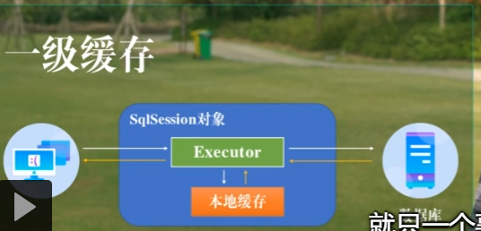
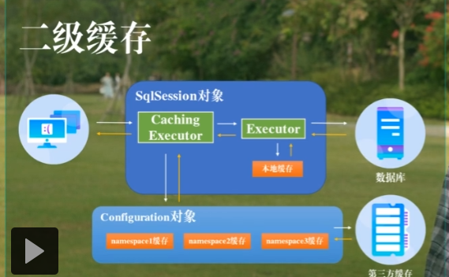

前类中查找一个方法快捷键: Ctrl + F12 

# 常用注解

### 1、@TableId

MyBatis-Plus在实现增删改查时，会默认将id作为主键列，并在插入数据时，默认基于雪花算法的策略生成id，这个雪花算法在这里就不明讲了。

当使用@TableId(value = "id")语句时，若实体类和表中表示主键的不是id，而是其他字段，例如代码中的uid，MyBatis-Plus会自动识别uid为主键列，否则就会报这样的错误：


当使用@TableId(value = "id",type = IdType.AUTO)语句时，代表着使用数据库的自增策略，注意，该类型请确保数据库设置了id自增，否则无效！

当然呢，@TableId的功能，也可以写在application.yml配置文件中，配置如下：

```
mybatis-plus:
  global-config:
    banner: false
    db-config:
      # 配置MyBatis-Plus操作表的默认前缀
      table-prefix: "t_"
      # 配置MyBatis-Plus的主键策略
      id-type: auto
  # 配置MyBatis日志
  configuration:
    log-impl: org.apache.ibatis.logging.stdout.StdOutImpl
```

### 2、@TableField

MyBatis-Plus在执行SQL语句时，要保证实体类中的属性名和表中的字段名一致，否则就会报错，语句@TableField(value = "is_deleted")代表着让数据库表中is_deleted与实体类中isDeleted字段名一样。

**注意：**

- 若实体类中的属性使用的是驼峰命名风格，而表中的字段使用的是下划线命名风格
  例如实体类属性userName，表中字段user_name，此时MyBatis-Plus会自动将下划线命名风格转化为驼峰命名风格
- 若实体类中的属性和表中的字段不满足上述条件，例如实体类属性name，表中字段username，此时需要在实体类属性上使用@TableField("username")设置属性所对应的字段名

### 3、@TableLogic

**在讲这个注解之前，我们先认识一下逻辑删除。**

- 物理删除：真实删除，将对应数据从数据库中删除，之后查询不到此条被删除的数据
- 逻辑删除：假删除，将对应数据中代表是否被删除字段的状态修改为“被删除状态”，之后在数据库中仍旧能看到此条数据记录
- 使用场景：可以进行数据恢复


在我的数据库表中，is_delete为1时，代表着逻辑上的删除，is_delete为0时，表示没有删除

注解@TableLogic的使用，就代表着该类中的属性是逻辑删除的属性

**注意：**

- 在测试逻辑删除的时候，真正执行的是修改UPDATE t_user SET is_deleted=1 WHERE id=? AND is_deleted=0
- 测试查询功能，被逻辑删除的数据默认不会被查询SELECT id,username AS name,age,email,is_deleted FROM t_user WHERE is_deleted=0

在学习mybatis-plus分页插件的时候，我们需要配置拦截器，看代码：

```
@Configuration
public class MybatisPlusConfig {
    @Bean
    public MybatisPlusInterceptor mybatisPlusInterceptor() {
        MybatisPlusInterceptor interceptor = 
                new MybatisPlusInterceptor();
 
        interceptor.addInnerInterceptor
                (new PaginationInnerInterceptor(DbType.MYSQL));
        return interceptor;
    }
}
```


### 4、@Version

在我们学习乐观锁的时候，肯定见过如下代码：

```
@Data
@TableName("t_product")
public class Product {
    private Long id;
    private String name;
    private Integer price;
    @Version
    private Integer version;
}
@Configuration
public class MybatisPlusConfig {
    @Bean
    public MybatisPlusInterceptor mybatisPlusInterceptor() {
        MybatisPlusInterceptor interceptor =
                new MybatisPlusInterceptor();
        //分页插件
        interceptor.addInnerInterceptor
                (new PaginationInnerInterceptor(DbType.MYSQL));
        //乐观锁插件
        interceptor.addInnerInterceptor(new OptimisticLockerInnerInterceptor());
        return interceptor;
    }
}
```

而这个注解@Version就是实现乐观锁的重要注解，当要更新数据库中的数据时，例如价格，version 就会加 1，如果where语句中的version版本不对，则更新失败。


# CRUD 接口

## [#](https://baomidou.com/pages/49cc81/#service-crud-接口)Service CRUD 接口

说明:

- 通用 Service CRUD 封装[IService (opens new window)](https://gitee.com/baomidou/mybatis-plus/blob/3.0/mybatis-plus-extension/src/main/java/com/baomidou/mybatisplus/extension/service/IService.java)接口，进一步封装 CRUD 采用 `get 查询单行` `remove 删除` `list 查询集合` `page 分页` 前缀命名方式区分 `Mapper` 层避免混淆，
- 泛型 `T` 为任意实体对象
- 建议如果存在自定义通用 Service 方法的可能，请创建自己的 `IBaseService` 继承 `Mybatis-Plus` 提供的基类
- 对象 `Wrapper` 为 [条件构造器](https://baomidou.com/01.指南/02.核心功能/wrapper.html)

### [#](https://baomidou.com/pages/49cc81/#save)Save

```java
// 插入一条记录（选择字段，策略插入）
boolean save(T entity);
// 插入（批量）
boolean saveBatch(Collection<T> entityList);
// 插入（批量）
boolean saveBatch(Collection<T> entityList, int batchSize);
```


#### [#](https://baomidou.com/pages/49cc81/#参数说明)参数说明

|     类型      |   参数名   |     描述     |
| :-----------: | :--------: | :----------: |
|       T       |   entity   |   实体对象   |
| Collection<T> | entityList | 实体对象集合 |
|      int      | batchSize  | 插入批次数量 |

### [#](https://baomidou.com/pages/49cc81/#saveorupdate)SaveOrUpdate

```java
// TableId 注解存在更新记录，否插入一条记录
boolean saveOrUpdate(T entity);
// 根据updateWrapper尝试更新，否继续执行saveOrUpdate(T)方法
boolean saveOrUpdate(T entity, Wrapper<T> updateWrapper);
// 批量修改插入
boolean saveOrUpdateBatch(Collection<T> entityList);
// 批量修改插入
boolean saveOrUpdateBatch(Collection<T> entityList, int batchSize);
```

#### [#](https://baomidou.com/pages/49cc81/#参数说明-2)参数说明

|     类型      |    参数名     |               描述               |
| :-----------: | :-----------: | :------------------------------: |
|       T       |    entity     |             实体对象             |
|  Wrapper<T>   | updateWrapper | 实体对象封装操作类 UpdateWrapper |
| Collection<T> |  entityList   |           实体对象集合           |
|      int      |   batchSize   |           插入批次数量           |

### [#](https://baomidou.com/pages/49cc81/#remove)Remove

```java
// 根据 entity 条件，删除记录
boolean remove(Wrapper<T> queryWrapper);
// 根据 ID 删除
boolean removeById(Serializable id);
// 根据 columnMap 条件，删除记录
boolean removeByMap(Map<String, Object> columnMap);
// 删除（根据ID 批量删除）
boolean removeByIds(Collection<? extends Serializable> idList);
```


#### [#](https://baomidou.com/pages/49cc81/#参数说明-3)参数说明

|                类型                |    参数名    |          描述           |
| :--------------------------------: | :----------: | :---------------------: |
|             Wrapper<T>             | queryWrapper | 实体包装类 QueryWrapper |
|            Serializable            |      id      |         主键 ID         |
|        Map<String, Object>         |  columnMap   |     表字段 map 对象     |
| Collection<? extends Serializable> |    idList    |      主键 ID 列表       |

### [#](https://baomidou.com/pages/49cc81/#update)Update

```java
// 根据 UpdateWrapper 条件，更新记录 需要设置sqlset
boolean update(Wrapper<T> updateWrapper);
// 根据 whereWrapper 条件，更新记录
boolean update(T updateEntity, Wrapper<T> whereWrapper);
// 根据 ID 选择修改
boolean updateById(T entity);
// 根据ID 批量更新
boolean updateBatchById(Collection<T> entityList);
// 根据ID 批量更新
boolean updateBatchById(Collection<T> entityList, int batchSize);
```


#### [#](https://baomidou.com/pages/49cc81/#参数说明-4)参数说明

|     类型      |    参数名     |               描述               |
| :-----------: | :-----------: | :------------------------------: |
|  Wrapper<T>   | updateWrapper | 实体对象封装操作类 UpdateWrapper |
|       T       |    entity     |             实体对象             |
| Collection<T> |  entityList   |           实体对象集合           |
|      int      |   batchSize   |           更新批次数量           |

### [#](https://baomidou.com/pages/49cc81/#get)Get

```java
// 根据 ID 查询
T getById(Serializable id);
// 根据 Wrapper，查询一条记录。结果集，如果是多个会抛出异常，随机取一条加上限制条件 wrapper.last("LIMIT 1")
T getOne(Wrapper<T> queryWrapper);
// 根据 Wrapper，查询一条记录
T getOne(Wrapper<T> queryWrapper, boolean throwEx);
// 根据 Wrapper，查询一条记录
Map<String, Object> getMap(Wrapper<T> queryWrapper);
// 根据 Wrapper，查询一条记录
<V> V getObj(Wrapper<T> queryWrapper, Function<? super Object, V> mapper);
```


#### [#](https://baomidou.com/pages/49cc81/#参数说明-5)参数说明

|            类型             |    参数名    |              描述               |
| :-------------------------: | :----------: | :-----------------------------: |
|        Serializable         |      id      |             主键 ID             |
|         Wrapper<T>          | queryWrapper | 实体对象封装操作类 QueryWrapper |
|           boolean           |   throwEx    |   有多个 result 是否抛出异常    |
|              T              |    entity    |            实体对象             |
| Function<? super Object, V> |    mapper    |            转换函数             |

### [#](https://baomidou.com/pages/49cc81/#list)List

```java
// 查询所有
List<T> list();
// 查询列表
List<T> list(Wrapper<T> queryWrapper);
// 查询（根据ID 批量查询）
Collection<T> listByIds(Collection<? extends Serializable> idList);
// 查询（根据 columnMap 条件）
Collection<T> listByMap(Map<String, Object> columnMap);
// 查询所有列表
List<Map<String, Object>> listMaps();
// 查询列表
List<Map<String, Object>> listMaps(Wrapper<T> queryWrapper);
// 查询全部记录
List<Object> listObjs();
// 查询全部记录
<V> List<V> listObjs(Function<? super Object, V> mapper);
// 根据 Wrapper 条件，查询全部记录
List<Object> listObjs(Wrapper<T> queryWrapper);
// 根据 Wrapper 条件，查询全部记录
<V> List<V> listObjs(Wrapper<T> queryWrapper, Function<? super Object, V> mapper);

```

#### [#](https://baomidou.com/pages/49cc81/#参数说明-6)参数说明

|                类型                |    参数名    |              描述               |
| :--------------------------------: | :----------: | :-----------------------------: |
|             Wrapper<T>             | queryWrapper | 实体对象封装操作类 QueryWrapper |
| Collection<? extends Serializable> |    idList    |          主键 ID 列表           |
|        Map<String, Object>         |  columnMap   |         表字段 map 对象         |
|    Function<? super Object, V>     |    mapper    |            转换函数             |

### [#](https://baomidou.com/pages/49cc81/#page)Page

```java
// 无条件分页查询
IPage<T> page(IPage<T> page);
// 条件分页查询
IPage<T> page(IPage<T> page, Wrapper<T> queryWrapper);
// 无条件分页查询
IPage<Map<String, Object>> pageMaps(IPage<T> page);
// 条件分页查询
IPage<Map<String, Object>> pageMaps(IPage<T> page, Wrapper<T> queryWrapper);
```


#### [#](https://baomidou.com/pages/49cc81/#参数说明-7)参数说明

|    类型    |    参数名    |              描述               |
| :--------: | :----------: | :-----------------------------: |
|  IPage<T>  |     page     |            翻页对象             |
| Wrapper<T> | queryWrapper | 实体对象封装操作类 QueryWrapper |

### [#](https://baomidou.com/pages/49cc81/#count)Count

```java
// 查询总记录数
int count();
// 根据 Wrapper 条件，查询总记录数
int count(Wrapper<T> queryWrapper);
```


#### [#](https://baomidou.com/pages/49cc81/#参数说明-8)参数说明

|    类型    |    参数名    |              描述               |
| :--------: | :----------: | :-----------------------------: |
| Wrapper<T> | queryWrapper | 实体对象封装操作类 QueryWrapper |

### [#](https://baomidou.com/pages/49cc81/#chain)Chain

#### [#](https://baomidou.com/pages/49cc81/#query)query

```java
// 链式查询 普通
QueryChainWrapper<T> query();
// 链式查询 lambda 式。注意：不支持 Kotlin
LambdaQueryChainWrapper<T> lambdaQuery();

// 示例：
query().eq("column", value).one();
lambdaQuery().eq(Entity::getId, value).list();
```


#### [#](https://baomidou.com/pages/49cc81/#update-2)update

```java
// 链式更改 普通
UpdateChainWrapper<T> update();
// 链式更改 lambda 式。注意：不支持 Kotlin
LambdaUpdateChainWrapper<T> lambdaUpdate();

// 示例：
update().eq("column", value).remove();
lambdaUpdate().eq(Entity::getId, value).update(entity);
```


## [#](https://baomidou.com/pages/49cc81/#mapper-crud-接口)Mapper CRUD 接口

说明:

- 通用 CRUD 封装[BaseMapper (opens new window)](https://gitee.com/baomidou/mybatis-plus/blob/3.0/mybatis-plus-core/src/main/java/com/baomidou/mybatisplus/core/mapper/BaseMapper.java)接口，为 `Mybatis-Plus` 启动时自动解析实体表关系映射转换为 `Mybatis` 内部对象注入容器
- 泛型 `T` 为任意实体对象
- 参数 `Serializable` 为任意类型主键 `Mybatis-Plus` 不推荐使用复合主键约定每一张表都有自己的唯一 `id` 主键
- 对象 `Wrapper` 为 [条件构造器](https://baomidou.com/01.指南/02.核心功能/wrapper.html)

### [#](https://baomidou.com/pages/49cc81/#insert)Insert

```java
// 插入一条记录
int insert(T entity);
```


#### [#](https://baomidou.com/pages/49cc81/#参数说明-9)参数说明

| 类型 | 参数名 |   描述   |
| :--: | :----: | :------: |
|  T   | entity | 实体对象 |

### [#](https://baomidou.com/pages/49cc81/#delete)Delete

```java
// 根据 entity 条件，删除记录
int delete(@Param(Constants.WRAPPER) Wrapper<T> wrapper);
// 删除（根据ID 批量删除）
int deleteBatchIds(@Param(Constants.COLLECTION) Collection<? extends Serializable> idList);
// 根据 ID 删除
int deleteById(Serializable id);
// 根据 columnMap 条件，删除记录
int deleteByMap(@Param(Constants.COLUMN_MAP) Map<String, Object> columnMap);
```


#### [#](https://baomidou.com/pages/49cc81/#参数说明-10)参数说明

|                类型                |  参数名   |                 描述                 |
| :--------------------------------: | :-------: | :----------------------------------: |
|             Wrapper<T>             |  wrapper  |  实体对象封装操作类（可以为 null）   |
| Collection<? extends Serializable> |  idList   | 主键 ID 列表(不能为 null 以及 empty) |
|            Serializable            |    id     |               主键 ID                |
|        Map<String, Object>         | columnMap |           表字段 map 对象            |

### [#](https://baomidou.com/pages/49cc81/#update-3)Update

```java
// 根据 whereWrapper 条件，更新记录
int update(@Param(Constants.ENTITY) T updateEntity, @Param(Constants.WRAPPER) Wrapper<T> whereWrapper);
// 根据 ID 修改
int updateById(@Param(Constants.ENTITY) T entity);
```


#### [#](https://baomidou.com/pages/49cc81/#参数说明-11)参数说明

|    类型    |    参数名     |                             描述                             |
| :--------: | :-----------: | :----------------------------------------------------------: |
|     T      |    entity     |               实体对象 (set 条件值,可为 null)                |
| Wrapper<T> | updateWrapper | 实体对象封装操作类（可以为 null,里面的 entity 用于生成 where 语句） |

### [#](https://baomidou.com/pages/49cc81/#select)Select

```java
// 根据 ID 查询
T selectById(Serializable id);
// 根据 entity 条件，查询一条记录
T selectOne(@Param(Constants.WRAPPER) Wrapper<T> queryWrapper);

// 查询（根据ID 批量查询）
List<T> selectBatchIds(@Param(Constants.COLLECTION) Collection<? extends Serializable> idList);
// 根据 entity 条件，查询全部记录
List<T> selectList(@Param(Constants.WRAPPER) Wrapper<T> queryWrapper);
// 查询（根据 columnMap 条件）
List<T> selectByMap(@Param(Constants.COLUMN_MAP) Map<String, Object> columnMap);
// 根据 Wrapper 条件，查询全部记录
List<Map<String, Object>> selectMaps(@Param(Constants.WRAPPER) Wrapper<T> queryWrapper);
// 根据 Wrapper 条件，查询全部记录。注意： 只返回第一个字段的值
List<Object> selectObjs(@Param(Constants.WRAPPER) Wrapper<T> queryWrapper);

// 根据 entity 条件，查询全部记录（并翻页）
IPage<T> selectPage(IPage<T> page, @Param(Constants.WRAPPER) Wrapper<T> queryWrapper);
// 根据 Wrapper 条件，查询全部记录（并翻页）
IPage<Map<String, Object>> selectMapsPage(IPage<T> page, @Param(Constants.WRAPPER) Wrapper<T> queryWrapper);
// 根据 Wrapper 条件，查询总记录数
Integer selectCount(@Param(Constants.WRAPPER) Wrapper<T> queryWrapper);
```


#### [#](https://baomidou.com/pages/49cc81/#参数说明-12)参数说明

|                类型                |    参数名    |                   描述                   |
| :--------------------------------: | :----------: | :--------------------------------------: |
|            Serializable            |      id      |                 主键 ID                  |
|             Wrapper<T>             | queryWrapper |    实体对象封装操作类（可以为 null）     |
| Collection<? extends Serializable> |    idList    |   主键 ID 列表(不能为 null 以及 empty)   |
|        Map<String, Object>         |  columnMap   |             表字段 map 对象              |
|              IPage<T>              |     page     | 分页查询条件（可以为 RowBounds.DEFAULT） |

## [#](https://baomidou.com/pages/49cc81/#mapper-层-选装件)mapper 层 选装件

说明:

选装件位于 `com.baomidou.mybatisplus.extension.injector.methods` 包下 需要配合[Sql 注入器](https://baomidou.com/pages/42ea4a/)使用,[案例(opens new window)](https://gitee.com/baomidou/mybatis-plus-samples/tree/master/mybatis-plus-sample-sql-injector)
使用详细见[源码注释(opens new window)](https://gitee.com/baomidou/mybatis-plus/tree/3.0/mybatis-plus-extension/src/main/java/com/baomidou/mybatisplus/extension/injector/methods)

### [#](https://baomidou.com/pages/49cc81/#alwaysupdatesomecolumnbyid)[AlwaysUpdateSomeColumnById(opens new window)](https://gitee.com/baomidou/mybatis-plus/blob/3.0/mybatis-plus-extension/src/main/java/com/baomidou/mybatisplus/extension/injector/methods/AlwaysUpdateSomeColumnById.java)

```java
int alwaysUpdateSomeColumnById(T entity);
```


### [#](https://baomidou.com/pages/49cc81/#insertbatchsomecolumn)[insertBatchSomeColumn(opens new window)](https://gitee.com/baomidou/mybatis-plus/blob/3.0/mybatis-plus-extension/src/main/java/com/baomidou/mybatisplus/extension/injector/methods/InsertBatchSomeColumn.java)

```java
int insertBatchSomeColumn(List<T> entityList);
```


### [#](https://baomidou.com/pages/49cc81/#logicdeletebyidwithfill)[logicDeleteByIdWithFill(opens new window)](https://gitee.com/baomidou/mybatis-plus/blob/3.0/mybatis-plus-extension/src/main/java/com/baomidou/mybatisplus/extension/injector/methods/LogicDeleteByIdWithFill.java)

```java
int logicDeleteByIdWithFill(T entity);
```

## [#](https://baomidou.com/pages/49cc81/#activerecord-模式)ActiveRecord 模式

说明:

- 实体类只需继承 Model 类即可进行强大的 CRUD 操作
- 需要项目中已注入对应实体的BaseMapper

### [#](https://baomidou.com/pages/49cc81/#操作步骤)操作步骤：

- 继承 [Model(opens new window)](https://gitee.com/baomidou/mybatis-plus/blob/3.0/mybatis-plus-extension/src/main/java/com/baomidou/mybatisplus/extension/activerecord/Model.java)

```java
class User extends Model<User>{
    // fields...
}
```

- 调用`CRUD`方法(演示部分api，仅供参考)

```java
User user = new User();
user.insert();
user.selectAll();
user.updateById();
user.deleteById();
// ...
```

## [#](https://baomidou.com/pages/49cc81/#simplequery-工具类)SimpleQuery 工具类

说明:

- 对`selectList`查询后的结果用`Stream`流进行了一些封装，使其可以返回一些指定结果，简洁了api的调用
- 需要项目中已注入对应实体的BaseMapper
- 使用方式见: [测试用例(opens new window)](https://gitee.com/baomidou/mybatis-plus/blob/3.0/mybatis-plus/src/test/java/com/baomidou/mybatisplus/test/toolkit/SimpleQueryTest.java)
- 对于下方参数`peeks`，其类型为`Consumer...`，可一直往后叠加操作例如：`List<Long> ids = SimpleQuery.list(Wrappers.lambdaQuery(), Entity::getId, System.out::println, user -> userNames.add(user.getName()));`

### [#](https://baomidou.com/pages/49cc81/#keymap)keyMap

```java
// 查询表内记录，封装返回为Map<属性,实体>
Map<A, E> keyMap(LambdaQueryWrapper<E> wrapper, SFunction<E, A> sFunction, Consumer<E>... peeks);
// 查询表内记录，封装返回为Map<属性,实体>，考虑了并行流的情况
Map<A, E> keyMap(LambdaQueryWrapper<E> wrapper, SFunction<E, A> sFunction, boolean isParallel, Consumer<E>... peeks);
```


##### [#](https://baomidou.com/pages/49cc81/#参数说明-13)参数说明

|         类型          |   参数名   |                      描述                       |
| :-------------------: | :--------: | :---------------------------------------------: |
|           E           |   entity   |                    实体对象                     |
|           A           | attribute  |         实体属性类型,也是map中key的类型         |
| LambdaQueryWrapper<E> |  wrapper   |             支持lambda的条件构造器              |
|    SFunction<E, A>    | sFunction  | 实体中属性的getter,用于封装后map中作为key的条件 |
|        boolean        | isParallel |           为true时底层使用并行流执行            |
|    Consumer<E>...     |   peeks    |                可叠加的后续操作                 |

### [#](https://baomidou.com/pages/49cc81/#map)map

```java
// 查询表内记录，封装返回为Map<属性,属性>
Map<A, P> map(LambdaQueryWrapper<E> wrapper, SFunction<E, A> keyFunc, SFunction<E, P> valueFunc, Consumer<E>... peeks);
// 查询表内记录，封装返回为Map<属性,属性>，考虑了并行流的情况
Map<A, P> map(LambdaQueryWrapper<E> wrapper, SFunction<E, A> keyFunc, SFunction<E, P> valueFunc, boolean isParallel, Consumer<E>... peeks);
```

1
2
3
4

##### [#](https://baomidou.com/pages/49cc81/#参数说明-14)参数说明

|         类型          |   参数名   |               描述                |
| :-------------------: | :--------: | :-------------------------------: |
|           E           |   entity   |             实体对象              |
|           A           | attribute  |  实体属性类型,也是map中key的类型  |
|           P           | attribute  | 实体属性类型,也是map中value的类型 |
| LambdaQueryWrapper<E> |  wrapper   |      支持lambda的条件构造器       |
|    SFunction<E, A>    |  keyFunc   |     封装后map中作为key的条件      |
|    SFunction<E, P>    | valueFunc  |    封装后map中作为value的条件     |
|        boolean        | isParallel |    为true时底层使用并行流执行     |
|    Consumer<E>...     |   peeks    |         可叠加的后续操作          |

### [#](https://baomidou.com/pages/49cc81/#group)group

```java
// 查询表内记录，封装返回为Map<属性,List<实体>>
Map<K, List<T>> group(LambdaQueryWrapper<T> wrapper, SFunction<T, A> sFunction, Consumer<T>... peeks);
// 查询表内记录，封装返回为Map<属性,List<实体>>，考虑了并行流的情况
Map<K, List<T>> group(LambdaQueryWrapper<T> wrapper, SFunction<T, K> sFunction, boolean isParallel, Consumer<T>... peeks);
// 查询表内记录，封装返回为Map<属性,分组后对集合进行的下游收集器>
M group(LambdaQueryWrapper<T> wrapper, SFunction<T, K> sFunction, Collector<? super T, A, D> downstream, Consumer<T>... peeks);
// 查询表内记录，封装返回为Map<属性,分组后对集合进行的下游收集器>，考虑了并行流的情况
M group(LambdaQueryWrapper<T> wrapper, SFunction<T, K> sFunction, Collector<? super T, A, D> downstream, boolean isParallel, Consumer<T>... peeks);
```

1
2
3
4
5
6
7
8

##### [#](https://baomidou.com/pages/49cc81/#参数说明-15)参数说明

|         类型          |   参数名   |                  描述                   |
| :-------------------: | :--------: | :-------------------------------------: |
|           T           |   entity   |                实体对象                 |
|           K           | attribute  |     实体属性类型,也是map中key的类型     |
|           D           |     -      | 下游收集器返回类型,也是map中value的类型 |
|           A           |     -      |            下游操作中间类型             |
|           M           |     -      |         最终结束返回的Map<K, D>         |
| LambdaQueryWrapper<E> |  wrapper   |         支持lambda的条件构造器          |
|    SFunction<E, A>    | sFunction  |   分组依据，封装后map中作为key的条件    |
|  Collector<T, A, D>   | downstream |               下游收集器                |
|        boolean        | isParallel |       为true时底层使用并行流执行        |
|    Consumer<T>...     |   peeks    |            可叠加的后续操作             |

### [#](https://baomidou.com/pages/49cc81/#list-2)list

```java
// 查询表内记录，封装返回为List<属性>
List<A> list(LambdaQueryWrapper<E> wrapper, SFunction<E, A> sFunction, Consumer<E>... peeks);
// 查询表内记录，封装返回为List<属性>，考虑了并行流的情况
List<A> list(LambdaQueryWrapper<E> wrapper, SFunction<E, A> sFunction, boolean isParallel, Consumer<E>... peeks);
```

1
2
3
4

##### [#](https://baomidou.com/pages/49cc81/#参数说明-16)参数说明

|         类型          |   参数名   |               描述                |
| :-------------------: | :--------: | :-------------------------------: |
|           E           |   entity   |             实体对象              |
|           A           | attribute  | 实体属性类型,也是list中元素的类型 |
| LambdaQueryWrapper<E> |  wrapper   |      支持lambda的条件构造器       |
|    SFunction<E, A>    | sFunction  |        封装后list中的元素         |
|        boolean        | isParallel |    为true时底层使用并行流执行     |
|    Consumer<E>...     |   peeks    |         可叠加的后续操作          |

# 条件构造器

说明:

- 以下出现的第一个入参`boolean condition`表示该条件**是否**加入最后生成的sql中，例如：query.like(StringUtils.isNotBlank(name), Entity::getName, name) .eq(age!=null && age >= 0, Entity::getAge, age)
- 以下代码块内的多个方法均为从上往下补全个别`boolean`类型的入参,默认为`true`
- 以下出现的泛型`Param`均为`Wrapper`的子类实例(均具有`AbstractWrapper`的所有方法)
- 以下方法在入参中出现的`R`为泛型,在普通wrapper中是`String`,在LambdaWrapper中是**函数**(例:`Entity::getId`,`Entity`为实体类,`getId`为字段`id`的**getMethod**)
- 以下方法入参中的`R column`均表示数据库字段,当`R`具体类型为`String`时则为数据库字段名(**字段名是数据库关键字的自己用转义符包裹!**)!而不是实体类数据字段名!!!,另当`R`具体类型为`SFunction`时项目runtime不支持eclipse自家的编译器!!!
- 以下举例均为使用普通wrapper,入参为`Map`和`List`的均以`json`形式表现!
- 使用中如果入参的`Map`或者`List`为**空**,则不会加入最后生成的sql中!!!
- 有任何疑问就点开源码看,看不懂**函数**的[点击我学习新知识(opens new window)](https://www.jianshu.com/p/613a6118e2e0)

警告:

不支持以及不赞成在 RPC 调用中把 Wrapper 进行传输

1. wrapper 很重
2. 传输 wrapper 可以类比为你的 controller 用 map 接收值(开发一时爽,维护火葬场)
3. 正确的 RPC 调用姿势是写一个 DTO 进行传输,被调用方再根据 DTO 执行相应的操作
4. 我们拒绝接受任何关于 RPC 传输 Wrapper 报错相关的 issue 甚至 pr

## [#](https://baomidou.com/pages/10c804/#abstractwrapper)AbstractWrapper

说明:

QueryWrapper(LambdaQueryWrapper) 和 UpdateWrapper(LambdaUpdateWrapper) 的父类
用于生成 sql 的 where 条件, entity 属性也用于生成 sql 的 where 条件
注意: entity 生成的 where 条件与 使用各个 api 生成的 where 条件**没有任何关联行为**

### [#](https://baomidou.com/pages/10c804/#alleq)allEq


 


```java
allEq(Map<R, V> params)
allEq(Map<R, V> params, boolean null2IsNull)
allEq(boolean condition, Map<R, V> params, boolean null2IsNull)
```

1
2
3

- 全部

  eq

  (或个别

  isNull

  )

  个别参数说明:

  `params` : `key`为数据库字段名,`value`为字段值
  `null2IsNull` : 为`true`则在`map`的`value`为`null`时调用 [isNull](https://baomidou.com/pages/10c804/#isnull) 方法,为`false`时则忽略`value`为`null`的

- 例1: `allEq({id:1,name:"老王",age:null})`--->`id = 1 and name = '老王' and age is null`

- 例2: `allEq({id:1,name:"老王",age:null}, false)`--->`id = 1 and name = '老王'`


 


```java
allEq(BiPredicate<R, V> filter, Map<R, V> params)
allEq(BiPredicate<R, V> filter, Map<R, V> params, boolean null2IsNull)
allEq(boolean condition, BiPredicate<R, V> filter, Map<R, V> params, boolean null2IsNull) 
```

1
2
3

个别参数说明:

`filter` : 过滤函数,是否允许字段传入比对条件中
`params` 与 `null2IsNull` : 同上

- 例1: `allEq((k,v) -> k.indexOf("a") >= 0, {id:1,name:"老王",age:null})`--->`name = '老王' and age is null`
- 例2: `allEq((k,v) -> k.indexOf("a") >= 0, {id:1,name:"老王",age:null}, false)`--->`name = '老王'`

### [#](https://baomidou.com/pages/10c804/#eq)eq


 


```java
eq(R column, Object val)
eq(boolean condition, R column, Object val)
```

1
2

- 等于 =
- 例: `eq("name", "老王")`--->`name = '老王'`

### [#](https://baomidou.com/pages/10c804/#ne)ne


 


```java
ne(R column, Object val)
ne(boolean condition, R column, Object val)
```

1
2

- 不等于 <>
- 例: `ne("name", "老王")`--->`name <> '老王'`

### [#](https://baomidou.com/pages/10c804/#gt)gt


 


```java
gt(R column, Object val)
gt(boolean condition, R column, Object val)
```

1
2

- 大于 >
- 例: `gt("age", 18)`--->`age > 18`

### [#](https://baomidou.com/pages/10c804/#ge)ge


 


```java
ge(R column, Object val)
ge(boolean condition, R column, Object val)
```

1
2

- 大于等于 >=
- 例: `ge("age", 18)`--->`age >= 18`

### [#](https://baomidou.com/pages/10c804/#lt)lt


 


```java
lt(R column, Object val)
lt(boolean condition, R column, Object val)
```

1
2

- 小于 <
- 例: `lt("age", 18)`--->`age < 18`

### [#](https://baomidou.com/pages/10c804/#le)le


 


```java
le(R column, Object val)
le(boolean condition, R column, Object val)
```

1
2

- 小于等于 <=
- 例: `le("age", 18)`--->`age <= 18`

### [#](https://baomidou.com/pages/10c804/#between)between


 


```java
between(R column, Object val1, Object val2)
between(boolean condition, R column, Object val1, Object val2)
```

1
2

- BETWEEN 值1 AND 值2
- 例: `between("age", 18, 30)`--->`age between 18 and 30`

### [#](https://baomidou.com/pages/10c804/#notbetween)notBetween


 


```java
notBetween(R column, Object val1, Object val2)
notBetween(boolean condition, R column, Object val1, Object val2)
```

1
2

- NOT BETWEEN 值1 AND 值2
- 例: `notBetween("age", 18, 30)`--->`age not between 18 and 30`

### [#](https://baomidou.com/pages/10c804/#like)like


 


```java
like(R column, Object val)
like(boolean condition, R column, Object val)
```

1
2

- LIKE '%值%'
- 例: `like("name", "王")`--->`name like '%王%'`

### [#](https://baomidou.com/pages/10c804/#notlike)notLike


 


```java
notLike(R column, Object val)
notLike(boolean condition, R column, Object val)
```

1
2

- NOT LIKE '%值%'
- 例: `notLike("name", "王")`--->`name not like '%王%'`

### [#](https://baomidou.com/pages/10c804/#likeleft)likeLeft


 


```java
likeLeft(R column, Object val)
likeLeft(boolean condition, R column, Object val)
```

1
2

- LIKE '%值'
- 例: `likeLeft("name", "王")`--->`name like '%王'`

### [#](https://baomidou.com/pages/10c804/#likeright)likeRight


 


```java
likeRight(R column, Object val)
likeRight(boolean condition, R column, Object val)
```

1
2

- LIKE '值%'
- 例: `likeRight("name", "王")`--->`name like '王%'`

### [#](https://baomidou.com/pages/10c804/#isnull)isNull


 


```java
isNull(R column)
isNull(boolean condition, R column)
```

1
2

- 字段 IS NULL
- 例: `isNull("name")`--->`name is null`

### [#](https://baomidou.com/pages/10c804/#isnotnull)isNotNull


 


```java
isNotNull(R column)
isNotNull(boolean condition, R column)
```

1
2

- 字段 IS NOT NULL
- 例: `isNotNull("name")`--->`name is not null`

### [#](https://baomidou.com/pages/10c804/#in)in


 


```java
in(R column, Collection<?> value)
in(boolean condition, R column, Collection<?> value)
```

1
2

- 字段 IN (value.get(0), value.get(1), ...)
- 例: `in("age",{1,2,3})`--->`age in (1,2,3)`


 


```java
in(R column, Object... values)
in(boolean condition, R column, Object... values)
```

1
2

- 字段 IN (v0, v1, ...)
- 例: `in("age", 1, 2, 3)`--->`age in (1,2,3)`

### [#](https://baomidou.com/pages/10c804/#notin)notIn


 


```java
notIn(R column, Collection<?> value)
notIn(boolean condition, R column, Collection<?> value)
```

1
2

- 字段 NOT IN (value.get(0), value.get(1), ...)
- 例: `notIn("age",{1,2,3})`--->`age not in (1,2,3)`


 


```java
notIn(R column, Object... values)
notIn(boolean condition, R column, Object... values)
```

1
2

- 字段 NOT IN (v0, v1, ...)
- 例: `notIn("age", 1, 2, 3)`--->`age not in (1,2,3)`

### [#](https://baomidou.com/pages/10c804/#insql)inSql


 


```java
inSql(R column, String inValue)
inSql(boolean condition, R column, String inValue)
```

1
2

- 字段 IN ( sql语句 )
- 例: `inSql("age", "1,2,3,4,5,6")`--->`age in (1,2,3,4,5,6)`
- 例: `inSql("id", "select id from table where id < 3")`--->`id in (select id from table where id < 3)`

### [#](https://baomidou.com/pages/10c804/#notinsql)notInSql


 


```java
notInSql(R column, String inValue)
notInSql(boolean condition, R column, String inValue)
```

1
2

- 字段 NOT IN ( sql语句 )
- 例: `notInSql("age", "1,2,3,4,5,6")`--->`age not in (1,2,3,4,5,6)`
- 例: `notInSql("id", "select id from table where id < 3")`--->`id not in (select id from table where id < 3)`

### [#](https://baomidou.com/pages/10c804/#groupby)groupBy


 


```java
groupBy(R... columns)
groupBy(boolean condition, R... columns)
```

1
2

- 分组：GROUP BY 字段, ...
- 例: `groupBy("id", "name")`--->`group by id,name`

### [#](https://baomidou.com/pages/10c804/#orderbyasc)orderByAsc


 


```java
orderByAsc(R... columns)
orderByAsc(boolean condition, R... columns)
```

1
2

- 排序：ORDER BY 字段, ... ASC
- 例: `orderByAsc("id", "name")`--->`order by id ASC,name ASC`

### [#](https://baomidou.com/pages/10c804/#orderbydesc)orderByDesc


 


```java
orderByDesc(R... columns)
orderByDesc(boolean condition, R... columns)
```

1
2

- 排序：ORDER BY 字段, ... DESC
- 例: `orderByDesc("id", "name")`--->`order by id DESC,name DESC`

### [#](https://baomidou.com/pages/10c804/#orderby)orderBy

 


```java
orderBy(boolean condition, boolean isAsc, R... columns)
```

1

- 排序：ORDER BY 字段, ...
- 例: `orderBy(true, true, "id", "name")`--->`order by id ASC,name ASC`

### [#](https://baomidou.com/pages/10c804/#having)having


 


```java
having(String sqlHaving, Object... params)
having(boolean condition, String sqlHaving, Object... params)
```

1
2

- HAVING ( sql语句 )
- 例: `having("sum(age) > 10")`--->`having sum(age) > 10`
- 例: `having("sum(age) > {0}", 11)`--->`having sum(age) > 11`

### [#](https://baomidou.com/pages/10c804/#func)func


 


```java
func(Consumer<Children> consumer)
func(boolean condition, Consumer<Children> consumer)
```

1
2

- func 方法(主要方便在出现if...else下调用不同方法能不断链)
- 例: `func(i -> if(true) {i.eq("id", 1)} else {i.ne("id", 1)})`

### [#](https://baomidou.com/pages/10c804/#or)or


 


```java
or()
or(boolean condition)
```

1
2

- 拼接 OR

  注意事项:

  主动调用`or`表示紧接着下一个**方法**不是用`and`连接!(不调用`or`则默认为使用`and`连接)

- 例: `eq("id",1).or().eq("name","老王")`--->`id = 1 or name = '老王'`


 


```java
or(Consumer<Param> consumer)
or(boolean condition, Consumer<Param> consumer)
```

1
2

- OR 嵌套
- 例: `or(i -> i.eq("name", "李白").ne("status", "活着"))`--->`or (name = '李白' and status <> '活着')`

### [#](https://baomidou.com/pages/10c804/#and)and


 


```java
and(Consumer<Param> consumer)
and(boolean condition, Consumer<Param> consumer)
```

1
2

- AND 嵌套
- 例: `and(i -> i.eq("name", "李白").ne("status", "活着"))`--->`and (name = '李白' and status <> '活着')`

### [#](https://baomidou.com/pages/10c804/#nested)nested


 


```java
nested(Consumer<Param> consumer)
nested(boolean condition, Consumer<Param> consumer)
```

1
2

- 正常嵌套 不带 AND 或者 OR
- 例: `nested(i -> i.eq("name", "李白").ne("status", "活着"))`--->`(name = '李白' and status <> '活着')`

### [#](https://baomidou.com/pages/10c804/#apply)apply


 


```java
apply(String applySql, Object... params)
apply(boolean condition, String applySql, Object... params)
```

1
2

- 拼接 sql

  注意事项:

  该方法可用于数据库**函数** 动态入参的`params`对应前面`applySql`内部的`{index}`部分.这样是不会有sql注入风险的,反之会有!

- 例: `apply("id = 1")`--->`id = 1`

- 例: `apply("date_format(dateColumn,'%Y-%m-%d') = '2008-08-08'")`--->`date_format(dateColumn,'%Y-%m-%d') = '2008-08-08'")`

- 例: `apply("date_format(dateColumn,'%Y-%m-%d') = {0}", "2008-08-08")`--->`date_format(dateColumn,'%Y-%m-%d') = '2008-08-08'")`

### [#](https://baomidou.com/pages/10c804/#last)last


 


```java
last(String lastSql)
last(boolean condition, String lastSql)
```

1
2

- 无视优化规则直接拼接到 sql 的最后

  注意事项:

  只能调用一次,多次调用以最后一次为准 有sql注入的风险,请谨慎使用

- 例: `last("limit 1")`

### [#](https://baomidou.com/pages/10c804/#exists)exists


 


```java
exists(String existsSql)
exists(boolean condition, String existsSql)
```

1
2

- 拼接 EXISTS ( sql语句 )
- 例: `exists("select id from table where age = 1")`--->`exists (select id from table where age = 1)`

### [#](https://baomidou.com/pages/10c804/#notexists)notExists


 


```java
notExists(String notExistsSql)
notExists(boolean condition, String notExistsSql)
```

1
2

- 拼接 NOT EXISTS ( sql语句 )
- 例: `notExists("select id from table where age = 1")`--->`not exists (select id from table where age = 1)`

## [#](https://baomidou.com/pages/10c804/#querywrapper)QueryWrapper

说明:

继承自 AbstractWrapper ,自身的内部属性 entity 也用于生成 where 条件
及 LambdaQueryWrapper, 可以通过 new QueryWrapper().lambda() 方法获取

### [#](https://baomidou.com/pages/10c804/#select)select


 


```java
select(String... sqlSelect)
select(Predicate<TableFieldInfo> predicate)
select(Class<T> entityClass, Predicate<TableFieldInfo> predicate)
```

1
2
3

- 设置查询字段

  说明:

  以上方法分为两类.
  第二类方法为:过滤查询字段(主键除外),入参不包含 class 的调用前需要`wrapper`内的`entity`属性有值! 这两类方法重复调用以最后一次为准

- 例: `select("id", "name", "age")`

- 例: `select(i -> i.getProperty().startsWith("test"))`

## [#](https://baomidou.com/pages/10c804/#updatewrapper)UpdateWrapper

说明:

继承自 `AbstractWrapper` ,自身的内部属性 `entity` 也用于生成 where 条件
及 `LambdaUpdateWrapper`, 可以通过 `new UpdateWrapper().lambda()` 方法获取!

### [#](https://baomidou.com/pages/10c804/#set)set

```java
set(String column, Object val)
set(boolean condition, String column, Object val)
```

1
2

- SQL SET 字段
- 例: `set("name", "老李头")`
- 例: `set("name", "")`--->数据库字段值变为**空字符串**
- 例: `set("name", null)`--->数据库字段值变为`null`

### [#](https://baomidou.com/pages/10c804/#setsql)setSql

```java
setSql(String sql)
```

1

- 设置 SET 部分 SQL
- 例: `setSql("name = '老李头'")`

### [#](https://baomidou.com/pages/10c804/#lambda)lambda

- 获取 `LambdaWrapper`
  在`QueryWrapper`中是获取`LambdaQueryWrapper`
  在`UpdateWrapper`中是获取`LambdaUpdateWrapper`

## [#](https://baomidou.com/pages/10c804/#使用-wrapper-自定义sql)使用 Wrapper 自定义SQL

注意事项:

需要`mybatis-plus`版本 >= `3.0.7` param 参数名要么叫`ew`,要么加上注解`@Param(Constants.WRAPPER)` 使用`${ew.customSqlSegment}` 不支持 `Wrapper` 内的entity生成where语句

### [#](https://baomidou.com/pages/10c804/#kotlin持久化对象定义最佳实践)kotlin持久化对象定义最佳实践

# Mybatis 缓存机制





将mybatis的接口调用通过与数据库建立SQLsession(内含Executor里有localcache)转化为SQL语句

一级缓存,针对一个事务里的查询,每个事务简历一个SQLsession

如果查询ID相同(xml中的表示SQL语句的ID相同)并且预编译的SQL相同,查询的参数相同,则会从localcache中找到这个缓存,因为是根据这三个生成的hash作为key,结果作为value存储,



二级缓存,caching Executor作为装饰器门面

Mapper的xml中会有namespace级的缓存,难以支持服务器集群