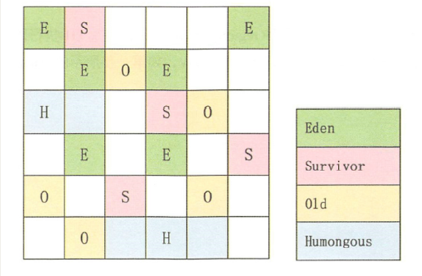

title: JVM
tags:

  - JVM
categories:
  - 八股
keywords: JVM句号 
description: JVM总结。
date: 2022-9-01 11:51:56


# 	第一章 字节码篇

## 分析一个对象的创建字节码

D:\IDEA\projects\Pinduo>javap -verbose -p out/production/Pinduo/P1/djp1/Main.class

```java
//
// Source code recreated from a .class file by IntelliJ IDEA
// (powered by FernFlower decompiler)
//

package P1.djp1;

public class Main {
    public Main() {
    }

    public static void main(String[] args) {
        new Object();
    }
}
```

```
D:\IDEA\projects\Pinduo>javap -verbose -p out/production/Pinduo/P1/djp1/Main.class
Classfile /D:/IDEA/projects/Pinduo/out/production/Pinduo/P1/djp1/Main.class
  Last modified 2022年9月23日; size 418 bytes
  MD5 checksum 339314e49862fe3b31f3c66703efb5ca
  Compiled from "Main.java"
public class P1.djp1.Main
  minor version: 0
  major version: 52
  flags: (0x0021) ACC_PUBLIC, ACC_SUPER
  this_class: #3                          // P1/djp1/Main
  super_class: #2                         // java/lang/Object
  interfaces: 0, fields: 0, methods: 2, attributes: 1
Constant pool:
   #1 = Methodref          #2.#19         // java/lang/Object."<init>":()V
   #2 = Class              #20            // java/lang/Object
   #3 = Class              #21            // P1/djp1/Main
   #4 = Utf8               <init>
   #5 = Utf8               ()V
   #6 = Utf8               Code
   #7 = Utf8               LineNumberTable
   #8 = Utf8               LocalVariableTable
   #9 = Utf8               this
  #10 = Utf8               LP1/djp1/Main;
  #11 = Utf8               main
  #12 = Utf8               ([Ljava/lang/String;)V
  #13 = Utf8               args
  #14 = Utf8               [Ljava/lang/String;
  #15 = Utf8               o
  #16 = Utf8               Ljava/lang/Object;
  #17 = Utf8               SourceFile
  #18 = Utf8               Main.java
  #19 = NameAndType        #4:#5          // "<init>":()V
  #20 = Utf8               java/lang/Object
  #21 = Utf8               P1/djp1/Main
{
  public P1.djp1.Main();
    descriptor: ()V
    flags: (0x0001) ACC_PUBLIC
    Code:
      stack=1, locals=1, args_size=1
         0: aload_0
         1: invokespecial #1                  // Method java/lang/Object."<init>":()V
         4: return
      LineNumberTable:
        line 7: 0
      LocalVariableTable:
        Start  Length  Slot  Name   Signature
            0       5     0  this   LP1/djp1/Main;

  public static void main(java.lang.String[]);
    descriptor: ([Ljava/lang/String;)V
    flags: (0x0009) ACC_PUBLIC, ACC_STATIC
    Code:
      stack=2, locals=2, args_size=1
         0: new           #2                  // class java/lang/Object
         3: dup
         4: invokespecial #1                  // Method java/lang/Object."<init>":()V
         7: astore_1
         8: return
      LineNumberTable:
        line 11: 0
        line 13: 8
      LocalVariableTable:
        Start  Length  Slot  Name   Signature
            0       9     0  args   [Ljava/lang/String;
            8       1     1     o   Ljava/lang/Object;
}
SourceFile: "Main.java"

```

```
D:\IDEA\projects\Pinduo>javap -c out/production/Pinduo/P1/djp1/Main.class
Compiled from "Main.java"
public class P1.djp1.Main {
  public P1.djp1.Main();
    Code:
       0: aload_0
       1: invokespecial #1                  // Method java/lang/Object."<init>":()V
       4: return

  public static void main(java.lang.String[]);
    Code:
       0: new           #2                  // class java/lang/Object
       3: dup
       4: invokespecial #1                  // Method java/lang/Object."<init>":()V
       7: astore_1
       8: return
}

```

> NEW ：如果找不到Class对象，则进行类加载。加载成功后，则在堆中分配内存，从Object 开始到本类路径上的所有属性值都要分配内存。分配完毕之后，进行零值初始化。在分配过程中，注意引用是占据存储空间的，它是一个变量，占用4个字节。这个指令完毕后，将指向实例对象的引用变量压入虚拟机栈顶。
> DUP ：在栈顶复制该引用变量，这时的栈顶有两个指向堆内实例对象的引用变量。如果 方法有参数，还需要把参数压人操作栈中。两个引用变量的目的不同，其中压至底下的引用用于赋值，或者保存到局部变量表，另一个栈顶的引用变量作为句柄调用相关方法。
> INVOKESPECIAL ：调用对象实例方法，通过栈顶的引用变量调用＜init> 方法。

# 第二章 类的加载


## 1. 概述

实现JVM需要考虑的

1. 类加载器
2. 执行引擎

> Bootstrap -> Ext -> App(也叫系统) 组合关系 但是 有一个GetParent方法

> URLcl ->  Ext -> App 

Java代码执行流程

java.exe调用底层jvm. dll创建jvm虚拟机 -> c++代码创建引导类加载器 -> 引导类负责创建其他类加载器 -> app类加载器加载主类 -> jvm执行main方法入口


## 2. 类加载过程(生命周期)

#### 2.1. 加载阶段

3. 在磁盘查找并通过IO读入字节码文件
2. 使用类的时候比如new对象,**在内存中生成一个代表这个类的java.lang.Class对象**

**数组类的加载**

创建数组类的情况稍微有些特殊，因为数组类本身并不是由类加载器负责创建，而是由JVM在运行时根据需要而直接创建的，但数组的元素类型仍然需要依靠类加载器去创建。

#### 2.2. 链接阶段

链接分为三个子阶段：验证 -> 准备 -> 解析

##### 验证(Verify)

校验字节码的正确性

##### 准备(Prepare)

简言之，为类的静态变量分配内存，并将其初始化为默认值。

1. 为类变量（static变量）分配内存并且设置该类变量的默认初始值，即零值
2. 这里不包含用final修饰的static，因为final在编译的时候就会分配好了默认值，准备阶段会显式初始化
3. 注意：这里不会为实例变量分配初始化，类变量会分配在方法区中，而实例变量是会随着对象一起分配到Java堆中


##### 解析(Resolve)

将符号引用转换为指针或句柄

> 疑惑:  通过保存符号引用而不是指针来节省空间(疑惑 怎么也要存对应关系的啊会有一份指针的实体)

静态链接(类加载阶段的转换) : 类加载阶段的符号引用转化为直接引用  

1. **将常量池内的符号引用转换为直接引用的过程**
2. 事实上，解析操作往往会伴随着JVM在执行完初始化之后再执行
3. 符号引用就是一组符号来描述所引用的目标。符号引用的字面量形式明确定义在《java虚拟机规范》的class文件格式中。直接引用就是直接指向目标的指针、相对偏移量或一个间接定位到目标的句柄
4. 解析动作主要针对类或接口、字段、类方法、接口方法、方法类型等。对应常量池中的CONSTANT Class info、CONSTANT Fieldref info、CONSTANT Methodref info等

**符号引用**

- 反编译 class 文件后可以查看符号引用，下面带# 的就是符号引用


简言之，将类、接口、字段和方法的符号引用转为直接引用。

1.具体描述:


举例：输出操作System.out.println()对应的字节码：

invokevirtual #24 

以方法为例，Java虚拟机为每个类都准备了一张方法表，将其所有的方法都列在表中，当需要调用一个类的方法的时候，只要知道这个方法在方法表中的偏移量就可以直接调用该方法。通过解析操作，符号引用就可以转变为目标方法在类中方法表中的位置，从而使得方法被成功调用。

2.小结： 

所谓解析就是将符号引用转为直接引用，也就是得到类、字段、方法在内存中的指针或者偏移量。因此，可以说，如果直接引用存在，那么可以肯定系统中存在该类、方法或者字段。但只存在符号引用，不能确定系统中一定存在该结构。

#### 2.3. 初始化阶段

对类的静态变量赋真正的值, 执行静态代码块

类的初始化时机: 略


##### clinit()

1. 初始化阶段就是执行类构造器方法`<clinit>()`的过程
2. 此方法不需定义，是javac编译器自动收集类中的所有**类变量**的赋值动作和静态代码块中的语句合并而来。也就是说，当我们代码中包含static变量的时候，就会有clinit方法
3. `<clinit>()`方法中的指令按语句在源文件中出现的顺序执行
4. `<clinit>()`不同于类的构造器。（关联：构造器是虚拟机视角下的`<init>()`）
5. 若该类具有父类，JVM会保证子类的`<clinit>()`执行前，父类的`<clinit>()`已经执行完毕
6. 虚拟机必须保证一个类的`<clinit>()`方法在多线程下被同步加锁

> IDEA 中安装 JClassLib Bytecode viewer 插件，可以很方便的看字节码。安装过程可以自行百度

**Java编译器并不会为所有的类都产生clinit()初始化方法。哪些类在编译为字节码后，字节码文件中将不会包含()方法？**

- 一个类中并没有声明任何的类变量，也没有静态代码块时

- 一个类中声明类变量，但是没有明确使用类变量的初始化语句以及静态代码块来执行初始化操作时

- 一个类中包含static final修饰的基本数据类型的字段，这些类字段初始化语句采用编译时常量表达式

查看下面这个代码的字节码，可以发现有一个`<clinit>()`方法。

```java
JAVA
public class ClassInitTest {
   private static int num = 1;

   static{
       num = 2;
       number = 20;
       System.out.println(num);
       //System.out.println(number);//报错：非法的前向引用。即在定义之前使用
   }

   /**
    * 1、linking之prepare: number = 0 --> initial: 20 --> 10
    * 2、这里因为静态代码块出现在声明变量语句前面，所以之前被准备阶段为0的number变量会
    * 首先被初始化为20，再接着被初始化成10（这也是面试时常考的问题哦）
    *
    */
   private static int number = 10;

    public static void main(String[] args) {
        System.out.println(ClassInitTest.num);//2
        System.out.println(ClassInitTest.number);//10
    }
}
```

虚拟机必须保证一个类的`<clinit>()`方法在多线程下被同步加锁 

#####  **类的初始化情况：主动使用vs被动使用**

Java程序对类的使用分为两种：主动使用 和 被动使用。

##### **主动使用的说明：**

Class只有在必须要首次使用的时候才会被装载，Java虚拟机不会无条件地装载Class类型。Java虚拟机规定，一个类或接口在初次使用前，必须要进行初始化。这里指的“使用”，是指主动使用。

主动使用只有下列几种情况：（即：如果出现如下的情况，则会对类进行初始化操作。而初始化操作之前的加载、验证、准备已经完成。）

1. 当创建一个类的实例时，比如使用new关键字，或者通过反射、克隆、反序列化。

2. 当调用类的静态方法时，即当使用了字节码invokestatic指令。

3. 当使用类、接口的静态字段时(final修饰特殊考虑)，比如，使用getstatic或者putstatic指令。

4. 当使用java.lang.reflect包中的方法反射类的方法时。比如：Class.forName("com.atguigu.java.Test")

   1. > todo

5. 当初始化子类时，如果发现其父类还没有进行过初始化，则需要先触发其父类的初始化。

6. 如果一个接口定义了default方法，那么直接实现或者间接实现该接口的类的初始化，该接口要在其之前被初始化。

   1. > todo

7. 当虚拟机启动时，用户需要指定一个要执行的主类（包含main()方法的那个类），虚拟机会先初始化这个主类。

8. 当初次调用 MethodHandle 实例时，初始化该 MethodHandle 指向的方法所在的类。（涉及解析REF_getStatic、REF_putStatic、REF_invokeStatic方法句柄对应的类）

   1. > todo


#### 


## 3. 类的加载器

### 2. 类加载机制的必要性

- 避免在开发中遇到 java.lang.ClassNotFoundException异常或java.lang.NoClassDefFoundError异常时，手足无措。只有了解类加载器的加载机制才能够在出现异常的时候快速地根据错误异常日志定位问题和解决问题

- 需要支持类的动态加载或需要对编译后的字节码文件进行加解密操作时，就需要与类加载器打交道了。

- 开发人员可以在程序中编写自定义类加载器来重新定义类的加载规则，以便实现一些自定义的处理逻辑。

### 3. 加载的类是唯一的吗?

1.何为类的唯一性？

对于任意一个类，都需要由加载它的类加载器和这个类本身一同确认其在Java虚拟机中的唯一性。每一个类加载器，都拥有一个独立的类名称空间：比较两个类是否相等，只有在这两个类是由同一个类加载器加载的前提下才有意义。否则，即使这两个类源自同一个Class文件，被同一个虚拟机加载，只要加载他们的类加载器不同，那这两个类就必定不相等。

2.命名空间

- 每个类加载器都有自己的命名空间，命名空间由该加载器及所有的父加载器所加载的类组成

- 在同一命名空间中，不会出现类的完整名字（包括类的包名）相同的两个类

- 在不同的命名空间中，有可能会出现类的完整名字（包括类的包名）相同的两个类

在大型应用中，我们往往借助这一特性，来运行同一个类的不同版本。

### 4. 类加载的特性

#### 双亲委派


双亲委派模型:  如果一个类加载器加载类时在自己的缓存中没有, 则会先找父加载器, 找到头都不行 就自己加载

首先避免重复加载类, 父亲加载过的子类就不会再加载, 其次防止核心比如String这种不会被自己写的覆盖


#### 全盘委托

当一个ClassLoader装载一个类时除非显示使用另一个类加载器负责全部有自己负责

#### 自己定义一个ClassLoader

> 继承ClassLoader类 , 两个核心方法LoadClass(双亲委派), findclass(空方法) 重写这个空方法

```java
public class MyClassLoaderTest {
2 static class MyClassLoader extends ClassLoader {
3 private String classPath;
4
5 public MyClassLoader(String classPath) {
6 this.classPath = classPath;
7 }
8
9 private byte[] loadByte(String name) throws Exception {
10 name = name.replaceAll("\\.", "/");
11 FileInputStream fis = new FileInputStream(classPath + "/" + name
12 + ".class");
13 int len = fis.available();
14 byte[] data = new byte[len];
15 fis.read(data);
16 fis.close();
17 return data;
18 }
19
20 protected Class<?> findClass(String name) throws ClassNotFoundException {
21 try {
22 byte[] data = loadByte(name);
23 //defineClass将一个字节数组转为Class对象，这个字节数组是class文件读取后最终的字节
数组。
24 return defineClass(name, data, 0, data.length);
25 } catch (Exception e) {
26 e.printStackTrace();
27 throw new ClassNotFoundException();
28 }
29 }
30
31 }
32
33 public static void main(String args[]) throws Exception {
34 //初始化自定义类加载器，会先初始化父类ClassLoader，其中会把自定义类加载器的父加载
器设置为应用程序类加载器AppClassLoader
35 MyClassLoader classLoader = new MyClassLoader("D:/test");
36 //D盘创建 test/com/tuling/jvm 几级目录，将User类的复制类User1.class丢入该目录
37 Class clazz = classLoader.loadClass("com.tuling.jvm.User1");
38 Object obj = clazz.newInstance();
39 Method method = clazz.getDeclaredMethod("sout", null);
40 method.invoke(obj, null);
41 System.out.println(clazz.getClassLoader().getClass().getName());
42 }
43 }
44
45 运行结果：
46 =======自己的加载器加载类调用方法=======
47 com.tuling.jvm.MyClassLoaderTest$MyClassLoader
```


#### 打破双亲委派

重写loadClass方法不去获取父类而是自己加载


#### Tomcat打破双亲委派

web容器


通常类加载机制有三个基本特征：

- 双亲委派模型。但不是所有类加载都遵守这个模型，有的时候，启动类加载器所加载的类型，是可能要加载用户代码的，比如JDK内部的ServiceProvider/ServiceLoader机制，用户可以在标准API框架上，提供自己的实现，JDK也需要提供些默认的参考实现。例如，Java 中JNDI、JDBC、文件系统、Cipher等很多方面，都是利用的这种机制，这种情况就不会用双亲委派模型去加载，而是利用所谓的上下文加载器。

- 可见性。子类加载器可以访问父加载器加载的类型，但是反过来是不允许的。不然，因为缺少必要的隔离，我们就没有办法利用类加载器去实现容器的逻辑。

- 单一性。由于父加载器的类型对于子加载器是可见的，所以父加载器中加载过的类型，就不会在子加载器中重复加载。但是注意，类加载器“邻居”间，同一类型仍然可以被加载多次，因为互相并不可见。

  

### 5. 类加载器的分类说明

JVM支持两种类型的类加载器，分别为引导类加载器（Bootstrap ClassLoader）和自定义类加载器（User-Defined ClassLoader）。

从概念上来讲，自定义类加载器一般指的是程序中由开发人员自定义的一类类加载器，但是Java虚拟机规范却没有这么定义，而是将所有派生于抽象类ClassLoader的类加载器都划分为自定义类加载器。

#### **子父类的关系**

- 除了顶层的启动类加载器外，其余的类加载器都应当有自己的“父类”加载器。 

- 不同类加载器看似是继承（Inheritance）关系，实际上是包含关系。在下层加载器中，包含着上层加载器的引用。


#### **启动类加载器（引导类加载器，Bootstrap ClassLoader）**

- 这个类加载使用C/C++语言实现的，嵌套在JVM内部。
- 它用来加载Java的核心库（JAVA_HOME/jre/lib/rt.jar或sun.boot.class.path路径下的内容）。用于提供JVM自身需要的类。

- 并不继承自java.lang.ClassLoader，没有父加载器。
- 出于安全考虑，Bootstrap启动类加载器只加载包名为java、javax、sun等开头的类

- 加载扩展类和应用程序类加载器，并指定为他们的父类加载器。

#### 扩展类加载器（Extension ClassLoader）

- Java语言编写，由sun.misc.Launcher$ExtClassLoader实现。

- 继承于ClassLoader类

- 父类加载器为启动类加载器

- 从java.ext.dirs系统属性所指定的目录中加载类库，或从JDK的安装目录的jre/lib/ext子目录下加载类库。如果用户创建的JAR放在此目录下，也会自动由扩展类加载器加载。


#### 应用程序类加载器（系统类加载器，AppClassLoader）

- java语言编写，由sun.misc.Launcher$AppClassLoader实现

- 继承于ClassLoader类

- 父类加载器为扩展类加载器

- 它负责加载环境变量classpath或系统属性 java.class.path 指定路径下的类库 

- 应用程序中的类加载器默认是系统类加载器。

- 它是用户自定义类加载器的默认父加载器

- 通过ClassLoader的getSystemClassLoader()方法可以获取到该类加载器

#### 用户自定义类加载器

- 在Java的日常应用程序开发中，类的加载几乎是由上述3种类加载器相互配合执行的。在必要时，我们还可以自定义类加载器，来定制类的加载方式。
- 体现Java语言强大生命力和巨大魅力的关键因素之一便是,Java开发者可以自定义类加载器来实现类库的动态加载，加载源可以是本地的JAR包，也可以是网络上的远程资源。
- 通过类加载器可以实现非常绝妙的插件机制，这方面的实际应用案例举不胜举。例如，著名的OSGI组件框架，再如Eclipse的插件机制。类加载器为应用程序提供了一种动态增加新功能的机制，这种机制无须重新打包发布应用程序就能实现。
- 同时，自定义加载器能够实现应用隔离，例如 Tomcat，Spring等中间件和组件框架都在内部实现了自定义的加载器，并通过自定义加载器隔离不同的组件模块。这种机制比C/C++程序要好太多，想不修改C/C++程序就能为其新增功能，几乎是不可能的，仅仅一个兼容性便能阻挡住所有美好的设想。
- 所有用户自定义类加载器通常需要继承于抽象类java.lang.ClassLoader。

> 待复习tomcat机制

## 4. cl源码剖析及相关机制


# 第三章 运行时数据区


Spring Boot程序的JVM参数设置格式(Tomcat启动直接加在bin目录下catalina.sh文件里)： 1 java ‐Xms2048M ‐Xmx2048M ‐Xmn1024M ‐Xss512K ‐XX:MetaspaceSize=256M ‐XX:MaxMetaspaceSize=256M ‐jar microservice‐eurek a‐server.jar

关于元空间的JVM参数有两个：-XX:MetaspaceSize=N和XX:MaxMetaspaceSize=N -XX：MaxMetaspaceSize： 设置元空间最大值， 默认是-1， 即不限制， 或者说只受限于本地内存大小。 -XX：MetaspaceSize： 指定元空间触发Fullgc的初始阈值， 以字节为单位，默认是21M，达到该值就会触发 full gc进行类型卸载， 同时收集器会对该值进行调整： 如果释放了大量的空间， 就适当降低该值； 如果释放了很少的空间， 那么在不超 过-XX：MaxMetaspaceSize（如果设置了的话） 的情况下， 适当提高该值。 由于调整元空间的大小需要Full GC，这是非常昂贵的操作，如果应用在启动的时候发生大量Full GC，通常都是由于永久代或元空间发生 了大小调整，基于这种情况，一般建议在JVM参数中将MetaspaceSize和MaxMetaspaceSize设置成一样的值，并设置得比初始值要大， 对于8G物理内存的机器来说，一般我会将这两个值都设置为256M。

## 1. 程序计数寄存器（Program Counter Register）


每个线程都有它自己的程序计数器，是线程私有的，生命周期与线程的生命周期保持一致。
它是唯一一个在Java 虚拟机规范中没有规定任何OutOtMemoryError 情况的区域。

**使用PC寄存器存储字节码指令地址有什么用呢？**

（为什么使用PC寄存器记录当前线程的执行地址呢？）线程切换

因为CPU需要不停的切换各个线程，这时候切换回来以后，就得知道接着从哪开始继续执行。

JVM的字节码解释器就需要通过改变PC寄存器的值来明确下一条应该执行什么样的字节码指令。

**PC寄存器为什么会被设定为线程私有？**

我们都知道所谓的多线程在一个特定的时间段内只会执行其中某一个线程的方法，CPU会不停地做任务切换，这样必然导致经常中断或恢复，如何保证分毫无差呢？为了能够准确地记录各个线程正在执行的当前字节码指令地址，最好的办法自然是为每一个线程都分配一个PC寄存器，这样一来各个线程之间便可以进行独立计算，从而不会出现相互干扰的情况。

## 2. JVM栈

### 概述

不存在GC ; 存在OOM

**StackOverFlowError？OutOfMemoryError？**

- Java 虚拟机规范允许Java栈的大小是动态的或者是固定不变的。
- 如果采用固定大小的Java虚拟机栈，那每一个线程的Java虚拟机栈容量可以在线程创建的时候独立选定。如果线程请求分配的栈容量超过Java虚拟机栈允许的最大容量，Java虚拟机将会抛出一个 StackOverflowError 异常。
- 如果Java虚拟机栈可以动态扩展，并且在尝试扩展的时候无法申请到足够的内存，或者在创建新的线程时没有足够的内存去创建对应的虚拟机栈，那Java虚拟机将会抛出—个 OutOfMemoryError 异常。

**如何设置栈内存的大小？ -Xss size (即：-XX:ThreadStackSize)** 

- 一般默认为512k-1024k，取决于操作系统。
- 栈的大小直接决定了函数调用的最大可达深度。

```java
public class Main {

    private static int count = 1;
    public static void main(String[] args) {
        System.out.println(count++);
        main(args);
    }

}
SOF
```

OOM: 死循环创建线程

**方法和栈桢之间存在怎样的关系？**

- 在这个线程上正在执行的每个方法都各自对应一个栈帧（Stack Frame）。

- 栈帧是一个内存区块，是一个数据集，维系着方法执行过程中的各种数据信息。

### 栈帧内部结构

#### 0. 概述

每个栈帧中存储着：

- 局部变量表（Local Variables）
- 操作数栈（Operand Stack）（或表达式栈）
- 动态链接(Dynamic Linking) （或指向运行时常量池的方法引用）
- 方法返回地址（Return Address）（或方法正常退出或者异常退出的定义）
- 一些附加信息


#### 1. 局部变量表

局部变量表（local variables)

- 局部变量表也被称之为局部变量数组或本地变量表

- **定义为一个数字数组，主要用于存储方法参数和定义在方法体内的局部变量**，这些数据类型包括各类基本数据类型(8种)、对象引用（reference），以及returnAddress类型。

- 局部变量表所需的**容量大小**是在编译期确定下来的，并保存在**方法的Code属性的maximum local variables数据项**中。在方法**运行期间是不会改变**局部变量表的大小的。

- 方法嵌套调用的次数由栈的大小决定。一般来说，栈越大，方法嵌套调用次数越多。**对一个函数而言，它的参数和局部变量越多，使得局部变量表膨胀，它的栈帧就越大**，以满足方法调用所需传递的信息增大的需求。进而函数调用就会占用更多的栈空间，导致其嵌套调用次数就会减少。

- **局部变量表中的变量只在当前方法调用中有效**。在方法执行时，虚拟机通过使用局部变量表完成参数值到参数变量列表的传递过程。当方法调用结束后，随着方法栈帧的销毁，局部变量表也会随之销毁。

##### slot


- 参数值的存放总是在局部变量数组的index为0开始，到数组长度-1的索引结束。
- **局部变量表，最基本的存储单元是Slot**（变量槽）

- 在局部变量表里，32位以内的类型只占用一个slot（包括returnAddress类型），64位的类型（long和double)占用两个slot。
- byte 、short 、char 在存储前被转换为int，boolean 也被转换为int，0 表示false ，非0 表示true。
- long 和double 则占据两个Slot。
- **JVM会为局部变量表中的每一个Slot都分配一个访问索引，通过这个索引即可成功访问到局部变量表中指定的局部变量值**

- 当一个实例方法被调用的时候，它的方法参数和方法体内部定义的局部变量将会按照顺序被复制到局部变量表中的每一个Slot上
- 如果需要访问局部变量表中一个64bit的局部变量值时，只需要使用前一个索引即可。(比如：访问long或double类型变量）

- **如果当前帧是由构造方法或者实例方法创建的，那么该对象引用this将会存放在index为0的slot处**，其余的参数按照参数表顺序继续排列。


栈帧中的局部变量表中的槽位是可以重用的，如果一个局部变量过了其作用域，那么在其作用域之后申明的新的局部变量就很有可能会复用过期局部变量的槽位，从而达到节省资源的目的。

- 参数表分配完毕之后，再根据方法体内定义的变量的顺序和作用域分配。
- 我们知道类**变量**表有两次初始化的机会，第一次是在**“准备阶段**”，执行系统初始化，对**类变量设置零值**，另一次则是在“**初始化**”阶段，**赋予程序员在代码中定义的初始值**。
- 和类变量初始化不同的是，局部变量表不存在系统初始化的过程，这意味着一旦定义了局部变量则必须人为的初始化，否则无法使用。

 public void test() {
int i;
   System.*out*.println(i);
 }

这样的代码是错误的，没有赋值不能够使用。

**局部变量表中的变量也是重要的垃圾回收根节点，只要被局部变量表中直接或间接引用的对象都不会被回收。**

#### 2. 操作数栈

操作数栈（Operand Stack）

- 我们说Java虚拟机的解释引擎是基于栈的执行引擎，其中的栈指的就是操作数栈。
- 每一个独立的**栈帧中**除了包含局部变量表以外，还包含一个后进先出（Last-In-First-Out）的操作数栈，也可以称之为**表达式栈**（Expression Stack）。
- 操作数栈就是**JVM执行引擎的一个工作区**，当一个方法刚开始执行的时候，一个新的栈帧也会随之被创建出来，这个方法的操作数栈是空的。
- 每一个操作数栈都会拥有一个明确的栈深度用于存储数值，其**所需的最大深度在编译期就定义好**了，保存在**方法的Code**属性中，为**max_stack**的值。
- 栈中的任何一个元素都是可以任意的Java数据类型。
- 32bit的类型占用一个栈单位深度
- 64bit的类型占用两个栈单位深度
- 操作数栈，**在方法执行过程中，根据字节码指令**，并非采用访问索引的方式来进行数据访问的，而是只能通过标准的入栈（push）和**出栈（pop）操作，往栈中写入数据或提取数据来完成一次数据访问。**
- **某些字节码指令将值压入操作数栈，其余的字节码指令将操作数取出栈。使用它们后再把结果压入栈。比如：执行复制、交换、求和等操作**
- 如果被调用的方法带有返回值的话，其**返回值将会被压入当前栈帧的操作数栈**中，并**更新PC寄存器中下一条需要执行的字节码指令**。


**栈顶缓存技术**

前面提过，基于栈式架构的虚拟机所使用的零地址指令更加紧凑，但完成一项操作的时候必然需要使用更多的入栈和出栈指令，这同时也就意味着将需要更多的指令分派（instruction dispatch）次数和内存读/写次数。

由于操作数是存储在内存中的，因此频繁地执行内存读/写操作必然会影响执行速度。为了解决这个问题，HotSpot JVM的设计者们提出了栈顶缓存（ToS，Top-of-Stack Cashing）技术，将栈顶元素全部缓存在**物理CPU的寄存器**中，以此降低对内存的读/写次数，提升执行引擎的执行效率。

#### 3. 动态链接

动态链接（或指向运行时常量池的方法引用）

- 每一个栈帧内部都包含一个**指向运行时常量池中该栈帧所属方法的引用**。包含这个引用的目的就是为了支持当前方法的代码能够实现**动态链接（Dynamic Linking）**。比如：**invokedynamic**指令

- 在Java源文件被编译到字节码文件中时，所有的变量和方法引用都作为符号引用（Symbolic Reference）保存在class文件的常量池里。比如：描述一个方法调用了另外的其他方法时，就是通过常量池中指向方法的符号引用来表示的，那么**动态链接的作用就是为了将这些符号引用转换为调用方法的直接引用**。

public void testGetSum(){*
*int i = getSum();
int j = 10;
}


#### 4. 方法返回地址

- 存放调用该方法的pc寄存器的值。

- 一个方法的结束，有两种方式：
- 正常执行完成
- 出现未处理的异常，非正常退出

- 无论通过哪种方式退出，在方法退出后都返回到该方法被调用的位置。方法正常退出时，调用者的pc计数器的值作为返回地址，即调用该方法的指令的下一条指令的地址。而通过异常退出的，返回地址是要通过异常表来确定，栈帧中一般不会保存这部分信息。

#### 5. 一些附加信息

栈帧中还允许携带与Java虚拟机实现相关的一些附加信息。例如，对程序调试提供支持的信息。

### 面试扩展问题

问题一：栈溢出的情况?

栈溢出:StackOverflowError;

举个简单的例子:在main方法中调用main方法,就会不断压栈执行,直到栈溢出;

栈的大小可以是固定大小的,也可以是动态变化（动态扩展）的。

如果是固定的,可以通过-Xss设置栈的大小;

如果是动态变化的,当栈大小到达了整个内存空间不足了,就是抛出OutOfMemory异常(java.lang.OutOfMemoryError)

问题二：调整栈大小,就能保证不出现溢出吗?

不能。因为调整栈大小,只会减少出现溢出的可能,栈大小不是可以无限扩大的,所以不能保证不出现溢出

问题三：分配的栈内存越大越好吗?

不是,因为增加栈大小，会造成每个线程的栈都变的很大,使得一定的栈空间下,能创建的线程数量会变小

问题四：垃圾回收是否会涉及到虚拟机栈?

不会;垃圾回收只会涉及到方法区和堆中,方法区和堆也会存在溢出的可能;

程序计数器,只记录运行下一行的地址,不存在溢出和垃圾回收;

虚拟机栈和本地方法栈,都是只涉及压栈和出栈,可能存在栈溢出,不存在垃圾回收。

问题五：方法中定义的局部变量是否线程安全?

具体问题具体分析,见分析代码:

```java
/**方法中定义的局部变量是否线程安全?   具体问题具体分析
 * @author shkstart
 * @create 15:53
 */
public class LocalVariableThreadSafe {
//s1的声明方式是线程安全的,因为线程私有，在线程内创建的s1 ，不会被其它线程调用
public static void method1() {
//StringBuilder:线程不安全
StringBuilder s1 = new StringBuilder();
        s1.append("a");
        s1.append("b");
//...
}

//stringBuilder的操作过程：是线程不安全的，
    // 因为stringBuilder是外面传进来的，有可能被多个线程调用
public static void method2(StringBuilder stringBuilder) {
        stringBuilder.append("a");
        stringBuilder.append("b");
//...
}

//stringBuilder的操作：是线程不安全的；因为返回了一个stringBuilder，
    // stringBuilder有可能被其他线程共享
public static StringBuilder method3() {
        StringBuilder stringBuilder = new StringBuilder();
        stringBuilder.append("a");
        stringBuilder.append("b");
return stringBuilder;
    }

//stringBuilder的操作：是线程安全的；因为返回了一个stringBuilder.toString()相当于new了一个String，
    // 所以stringBuilder没有被其他线程共享的可能
public static String method4() {
        StringBuilder stringBuilder = new StringBuilder();
        stringBuilder.append("a");
        stringBuilder.append("b");
return stringBuilder.toString();

/**
         * 结论：如果局部变量在内部产生并在内部消亡的，那就是线程安全的
         */
}
}
```


## 3. 本地方法接口与本地方法栈

Java使用起来非常方便，然而有些层次的任务用Java实现起来不容易，或者我们对程序的效率很在意时，问题就来了。

- 与Java环境外交互：

有时Java应用需要与Java外面的环境交互，这是本地方法存在的主要原因。你可以想想Java需要与一些底层系统，如操作系统或某些硬件交换信息时的情况。本地方法正是这样一种交流机制：它为我们提供了一个非常简洁的接口，而且我们无需去了解Java应用之外的繁琐的细节。

- 与操作系统交互：

JVM支持着Java语言本身和运行时库，它是Java程序赖以生存的平台，它由一个解释器（解释字节码）和一些连接到本地代码的库组成。然而不管怎样，它毕竟不是一个完整的系统，它经常依赖于一些底层系统的支持。这些底层系统常常是强大的操作系统。通过使用本地方法，我们得以用Java实现了jre的与底层系统的交互，甚至JVM的一些部分就是用C写的。还有，如果我们要使用一些Java语言本身没有提供封装的操作系统的特性时，我们也需要使用本地方法。

- Sun's Java

Sun的解释器是用C实现的，这使得它能像一些普通的C一样与外部交互。jre大部分是用Java实现的，它也通过一些本地方法与外界交互。例如：类java.lang.Thread 的 setPriority()方法是用Java实现的，但是它实现调用的是该类里的本地方法setPriority0()。这个本地方法是用C实现的，并被植入JVM内部，在Windows 95的平台上，这个本地方法最终将调用Win32 SetPriority() API。这是一个本地方法的具体实现由JVM直接提供，更多的情况是本地方法由外部的动态链接库（external dynamic link library）提供，然后被JVM调用。

## 4. 堆

### 概述

- 《Java虚拟机规范》中对Java堆的描述是：所有的**对象实例以及数组**都应当在运行时分配在堆上。（The heap is the run-time data area from which memory for all class instances and arrays is allocated ) 数组和对象可能永远不会存储在栈上，因为栈帧中保存引用，这个引用指向对象或者数组在堆中的位置。

- 我要说的是：“几乎”所有的对象实例都在这里分配内存。——从实际使用角度看的。


所有的线程共享Java堆，在这里还可以划分线程私有的缓冲区（Thread Local Allocation Buffer, TLAB)。

### 堆的内部结构


- 几乎所有的Java对象都是在Eden区被new出来的。
- 绝大部分的Java对象的销毁都在新生代进行了。
- IBM 公司的专门研究表明，新生代中 80% 的对象都是“朝生夕死”的。

### 如何设置堆内存大小？

#### 如何设置新生代与老年代比例？

- 下面这参数开发中一般不会调：

  

  - 配置新生代与老年代在堆结构的占比。
  - 默认**-XX:NewRatio=2**，表示新生代占1，老年代占2，新生代占整个堆的1/3
  - 可以修改-XX:NewRatio=4，表示新生代占1，老年代占4，新生代占整个堆的1/5

  - 可以使用选项”**-Xmn**”设置新生代最大内存大小

  - 这个参数一般使用默认值就可以了。

  

#### 如何设置Eden、幸存者区比例？

- 在HotSpot中，Eden空间和另外两个Survivor空间缺省所占的比例是8:1:1
- 当然开发人员可以通过选项“**-XX:SurvivorRatio**”调整这个空间比例。比如**-XX:SurvivorRatio=8**

#### OOM举例

​	

#### 参数设置小结

- 什么是空间分配担保策略？（渣打银行）
- 什么是空间分配担保策略？（顺丰）
- 什么是空间分配担保策略？（腾讯、百度）

```
/**
 * 测试堆空间常用的jvm参数：
 * -XX:+PrintFlagsInitial : 查看所有的参数的默认初始值
 * -XX:+PrintFlagsFinal  ：查看所有的参数的最终值（可能会存在修改，不再是初始值）
 *      具体查看某个参数的指令： jps：查看当前运行中的进程
 *                             jinfo -flag SurvivorRatio 进程id
 *
 * -Xms：初始堆空间内存 （默认为物理内存的1/64）
 * -Xmx：最大堆空间内存（默认为物理内存的1/4）
 * -Xmn：设置新生代的大小。(初始值及最大值)
 * -XX:NewRatio：配置新生代与老年代在堆结构的占比
 * -XX:SurvivorRatio：设置新生代中Eden和S0/S1空间的比例
 * -XX:MaxTenuringThreshold：设置新生代垃圾的最大年龄
 * -XX:+PrintGCDetails：输出详细的GC处理日志
 * 打印gc简要信息：① -XX:+PrintGC   ② -verbose:gc
 * -XX:HandlePromotionFailure：是否设置空间分配担保
 */
```

### 对象分配

1.new的对象先放伊甸园区。此区有大小限制。

2.**当伊甸园的空间填满时，程序又需要创建对象**，JVM的垃圾回收器将对伊甸园区进行垃圾回收(**Minor GC/YGC**)，将伊甸园区中的不再被其他对象所引用的对象进行销毁。再加载新的对象放到伊甸园区

3.**然后将伊甸园中的剩余对象移动到幸存者0区**。

4**.如果再次触发垃圾回收**，**此时上次幸存下来的放到幸存者0区的，如果没有回收，就会放到幸存者1区**。

5.**如果再次经历垃圾回收，此时会重新放回幸存者0区，接着再去幸存者1区**。

6.啥时候能去养老区呢？**可以设置次数。默认是15次。**

- 可以设置参数：**-XX:MaxTenuringThreshold=** 设置对象晋升老年代的年龄阈值。

7.在养老区，相对悠闲。**当养老区内存不足时，再次触发GC：Major GC**，进行养老区的内存清理。

8.若养老区执行了Major GC之后发现依然**无法进行对象的保存**，就会产生OOM异常


##### 空间分配担保

1、在发生**Minor GC**之前，虚拟机会检查老年代最大可用的连续空间是否大于**新生代**所有对象的总空间。

- 如果大于，则此次Minor GC是安全的

- 如果小于，则虚拟机会查看**-XX:HandlePromotionFailure**设置值是否允担保失败。

  - 如果HandlePromotionFailure=true，那么会继续检查

    **老年代最大可用连续空间是否大于历次晋升到老年代的对象的平均大小**

    。

    - 如果大于，**则尝试进行一次Minor GC，但这次Minor GC依然是有风险的；**
    - 如果小于，**则进行一次Full GC**。

  - 如果HandlePromotionFailure=**false**，**则进行一次Full GC**。

## 5. 方法区


### 1. 栈、堆、方法区的关系


### 2. 什么是TLAB？

- 从内存模型而不是垃圾收集的角度，对Eden区域继续进行划分，JVM为每个线程分配了一个私有缓存区域，它包含在Eden空间内。
- 据我所知所有OpenJDK衍生出来的JVM都提供了TLAB的设计。


### 3. 方法区在哪里

《Java虚拟机规范》中明确说明: “尽管所有的方法区在逻辑上是属于堆的一部分，但一些简单的实现可能不会选择去进行垃圾收集或者进行压缩。” 但对于HotSpotJVM而言，方法区还有一个别名叫做Non-Heap(非堆)，目的就是要和堆分开。

所以，方法区看作是一块独立于Java 堆的内存空间。


### 4. 方法区的理解

方法区（Method Area）与Java堆一样，是各个线程共享的内存区域。
方法区在JVM启动的时候被创建，并且它的实际的物理内存空间中和Java堆区一样都可以是不连续的。
方法区的大小，跟堆空间一样，可以选择固定大小或者可扩展。
方法区的大小决定了系统可以保存多少个类，如果系统定义了太多的类，导致方法区溢出，虚拟机同样会抛出内存溢出错误：java.lang.OutOfMemoryError: PermGen space 或者 java.lang.OutOfMemoryError: Metaspace
加载大量的第三方的jar包；Tomcat部署的工程过多（30-50个）；大量动态的生成反射类
关闭JVM就会释放这个区域的内存。

### 5. 方法区的演进

到了JDK 8，终于完全废弃了永久代的概念，改用与JRockit、J9一样在本地内存中实现的元空间（Metaspace）来代替

元空间的本质和永久代类似，都是对JVM规范中方法区的实现。不过元空间与永久代最大的区别在于：元空间不在虚拟机设置的内存中，而是使用本地内存。
永久代、元空间二者并不只是名字变了，内部结构也调整了。
根据《Java虚拟机规范》的规定，如果方法区无法满足新的内存分配需求时，将抛出OOM异常。

### 6. 设置方法区内存的大小

- 方法区的大小不必是固定的，jvm可以根据应用的需要动态调整。
- jdk7及以前：
- 通过-XX:PermSize来设置永久代初始分配空间。默认值是20.75M
- -XX:MaxPermSize来设定永久代最大可分配空间。32位机器默认是64M，64位机器模式是82M
- 当JVM加载的类信息容量超过了这个值，会报异常OutOfMemoryError:PermGen space 。


- jdk8及以后：
- 元数据区大小可以使用参数-XX:MetaspaceSize和-XX:MaxMetaspaceSize指定,替代上述原有的两个参数。
- 默认值依赖于平台。windows下，-XX:MetaspaceSize是21M，-XX:MaxMetaspaceSize 的值是-1，即没有限制。
- 与永久代不同，如果不指定大小，默认情况下，虚拟机会耗尽所有的可用系统内存。如果元数据区发生溢出，虚拟机一样会抛出异常OutOfMemoryError: Metaspace
- -XX:MetaspaceSize：设置初始的元空间大小。对于一个64位的服务器端JVM来说，其默认的-XX:MetaspaceSize值为21MB。这就是初始的高水位线，一旦触及这个水位线，Full GC将会被触发并卸载没用的类（即这些类对应的类加载器不再存活），然后这个高水位线将会重置。新的高水位线的值取决于GC后释放了多少元空间。如果释放的空间不足，那么在不超过MaxMetaspaceSize时，适当提高该值。如果释放空间过多，则适当降低该值。
- 如果初始化的高水位线设置过低，上述高水位线调整情况会发生很多次。通过垃圾回收器的日志可以观察到Full GC多次调用。为了避免频繁地GC ，建议将-XX:MetaspaceSize设置为一个相对较高的值。

在JDK8 及以上版本中，设定MaxPermSize 参数， JVM在启动时并不会报错，但是会提示：

Java HotSpot 64Bit Server VM warning:

ignoring option MaxPermSize=2560m; support was removed in 8.0 。


# 第四章 对象的内存布局


## 0 . 对象创建new : 

- 类加载检查,  没加载则执行类加载的执行流程
- 加载检查通过后分配内存, 对象大小确定
- 初始化: 相应内存置为0值, 保证不赋值能直接使用
- 设置对象头: 
- 对象分配:
  - 逃逸分析 标量替换 栈上分析
  - 不是大对象先在TLAB看能否存下, 不能则在年轻代分配, 年轻代不够则minorGC , 将部分年轻代回收/ 或转移到老年代腾出空间,
  - 老年代空间担保, minor GC是否进行 


## 1. 对象的实例化

### 1.1 有几种创建对象的方式

> 实操 todo

1. new

   1. 变形1: Xxx静态方法的new
   2. 变形2: XxxBuilder/XxxFactory的静态方法

2. Class的newInstance()

3. Constructor的newInstance()

4. clone()

5. 反序列化

6. 第三发库Objenesis,利用了asm字节码技术,动态生成Constructor

   1. 典型用途：

      需要在不调用构造函数的情况下实例化对象是一项相当特殊的任务，但是在某些情况下这是有用的：

      - 序列化，远程调用和持久化-对象需要被实例化并恢复到特定的状态，而不需要调用代码

      - 代理、 AOP 库和 mock 对象-类可以被子类继承而子类不用担心父类的构造器

      - 容器框架-对象可以以非标准的方式动态地实例化

   2. Spring中的封装的元数据读取器等就是利用了asm,需要注意的是，SimpleMetadataReader去解析类时，使用的**ASM技术**。

      > 并不是等Java类加载到JVM在解析,而是直接读取字节码文件

      为什么要使用ASM技术，Spring启动的时候需要去扫描，如果指定的包路径比较宽泛，那么扫描的类是非常多的，那如果在Spring启动时就把这些类全部加载进JVM了，这样不太好，所以使用了ASM技术。

### 1.2 创建对象的过程

#### 1.2.1 从字节码角度看待对象创建过程 : 见字节码篇

#### 1.2.2 从执行步骤角度分析

1. 判断对象对应的类是否加载,链接,初始化

   1. 虚拟机遇到一条new指令，首先去检查这个指令的参数能否在Metaspace的常量池中定位到一个类的符号引用，并且检查这个符号引用代表的类是否已经被加载、解析和初始化。（即判断类元信息是否存在）。

      - 如果没有，那么在双亲委派模式下，使用当前类加载器以ClassLoader+包名+类名为Key进行查找对应的.class 文件。

      - 如果没有找到文件，则抛出ClassNotFoundException 异常。
      - 如果找到，则进行类加载，并生成对应的Class类对象。

2. 为对象分配内存

   1. 指针碰撞

      1. 如果内存规整，使用指针碰撞

      如果内存是规整的，那么虚拟机将采用的是指针碰撞法（Bump The Pointer）来为对象分配内存。意思是所有用过的内存在一边，空闲的内存在另外一边，中间放着一个指针作为分界点的指示器，分配内存就仅仅是把指针向空闲那边挪动一段与对象大小相等的距离罢了。 如果垃圾收集器选择的是Serial、ParNew这种基于压缩算法的，虚拟机采用这种分配方式。 一般使用带有compact（整理）过程的收集器时，使用指针碰撞。

   2. 空闲列表

      1. 如果内存不规整，虚拟机需要维护一个列表，使用空闲列表分配

      如果内存不是规整的，已使用的内存和未使用的内存相互交错，那么虚拟机将采用的是空闲列表法来为对象分配内存。意思是虚拟机维护了一个列表，记录上哪些内存块是可用的，再分配的时候从列表中找到一块足够大的空间划分给对象实例，并更新列表上的内容。这种分配方式称为“空闲列表（Free List）”。

3. 处理并发安全问题

   1. 在分配内存空间时，另外一个问题是及时保证new对象时候的线程安全性：创建对象是非常频繁的操作，虚拟机需要解决并发问题。 虚拟机采用了两种方式解决并发问题:
      - CAS ( Compare And Swap ）失败重试、区域加锁：保证指针更新操作的原子性;
      - TLAB 把内存分配的动作按照线程划分在不同的空间之中进行，即每个线程在Java堆中预先分配一小块内存，称为本地线程分配缓冲区，（TLAB ，Thread Local Allocation Buffer）虚拟机是否使用TLAB，可以通过-XX:+/-UseTLAB参数来设定。

4. 初始化分配到的空间

   1. 内存分配结束，虚拟机将分配到的内存空间都初始化为零值（不包括对象头）。这一步保证了对象的实例字段在Java代码中可以不用赋初始值就可以直接使用，程序能访问到这些字段的数据类型所对应的零值。

5. 设置对象的对象头

   1. 将对象的所属类（即类的元数据信息）、对象的HashCode和对象的GC信息、锁信息等数据存储在对象的对象头中。这个过程的具体设置方式取决于JVM实现。

6. 执行init方法进行初始化

   1. 在Java程序的视角看来，初始化才正式开始。初始化成员变量，执行实例化代码块，调用类的构造方法，并把堆内对象的首地址赋值给引用变量。

      因此一般来说（由字节码中是否跟随有invokespecial指令所决定），new指令之后会接着就是执行方法，把对象按照程序员的意愿进行初始化，这样一个真正可用的对象才算完全创建出来。


## 2. 对象的内存布局

1. 对象头

   1. 对象头：它主要包括两部分。

      - 一个是对象自身的运行时元数据(mark word)。
      - 哈希值(hashcode)：对象在堆空间中都有一个首地址值，栈空间的引用根据这个地址指向堆中的对象，这就是哈希值起的作用

      - GC分代年龄：对象首先是在Eden中创建的，在经过多次GC后，如果没有被进行回收，就会在survivor中来回移动，其对应的年龄计数器会发生变化，达到阈值后会进入养老区

      - 锁状态标志，在同步中判断该对象是否是锁

      - 线程持有的锁

      - 线程偏向ID

      - 偏向时间戳

      - 另一个是类型指针，指向元数据区的类元数据InstanceKlass，确定该对象所属的类型

      - 此外，如果对象是一个数组，对象头中还必须有一块用于记录数组的长度的数据。
      - 因为正常对象元数据就知道对象的确切大小。所以数组必须得知道长度。

2. 实例数据

   1. 作用：

      它是对象真正存储的有效信息，包括程序代码中定义的各种类型的字段（包括从父类继承下来的和本身拥有的字段）。

      这里需要遵循的一些规则：

      相同宽度的字段总是被分配在一起

      父类中定义的变量会出现在子类之前（因为父类的加载是优先于子类加载的）

      如果CompactFields参数为true(默认为true)：子类的窄变量可能插入到父类变量的空隙

3. 对齐填充

   1. 对齐填充：不是必须的，也没特别含义，仅仅起到占位符的作用

## 3. 对象的访问定位

1. 句柄访问
   1. 
      - 实现：堆需要划分出一块内存来做句柄池，reference中存储对象的句柄池地址，句柄中包含对象实例与类型数据各自具体的地址信息。
      - 好处：reference中存储稳定句柄地址，对象被移动（垃圾收集时移动对象很普遍）时只会改变句柄中实例数据指针，reference本身不需要被修改。
2. 直接使用指针访问
   1. 
      - 实现：reference中存储的就是对象的地址，如果只是访问对象本身的话，就不需要多一次间接访问的开销。
      - 好处：速度更快，java中对象访问频繁，每次访问都节省了一次指针定位的时间开销。


HotSpot这里主要使用第2种方式：直接指针访问

JVM可以通过对象引用准确定位到Java堆区中的instanceOopDesc对象，这样既可成功访问到对象的实例信息，当需要访问目标对象的具体类型时，JVM则会通过存储在instanceOopDesc中的元数据指针定位到存储在方法区中的instanceKlass对象上。

# 第五章 执行引擎篇


# 第六章 垃圾回收篇

优化: 尽量保证对象在年轻代

从次数上讲：
频繁收集Young区
较少收集Old区
基本不动Perm区（或元空间）

串行化垃圾回收

并行化垃圾回收


## 1.垃圾回收算法

### 1.1标记算法

#### 1.1.1引用计数法

**原理**：

对于一个对象A，只要有任何一个对象引用了A ，则A 的引用计数器就加1，当引用失效时，引用计数器就减1。


- 引用计数算法，是很多语言的资源回收选择，例如因人工智能而更加火热的Python，它更是同时支持引用计数和垃圾收集机制。

- 具体哪种最优是要看场景的，业界有大规模实践中仅保留引用计数机制，以提高吞吐量的尝试。

- Python如何解决循环引用？
  - **手动解除**：很好理解，就是在合适的时机，解除引用关系。
  - **使用弱引用weakref**， weakref是Python提供的标准库，旨在解决循环引用。

#### 1.1.2可达性分析算法

**原理**：

其原理简单来说，就是**将对象及其引用关系看作一个图**，**选定活动的对象作为 GC Roots**，然后**跟踪引用链条**，**如果一个对象和GC Roots之间不可达，也就是不存在引用链条，那么即可认为是可回收对象**。

##### GC root

在Java 语言中， GC Roots 包括以下几类元素：

- 虚拟机栈中引用的对象
  - 比如：各个线程被调用的方法中使用到的参数、局部变量等。
  - 本地方法栈内JNI(通常说的本地方法)引用的对象
- 类静态属性引用的对象
  - 比如：Java类的引用类型静态变量
- 方法区中常量引用的对象
  - 比如：字符串常量池（String Table）里的引用
- 所有被同步锁synchronized持有的对象
- Java虚拟机内部的引用。
- 基本数据类型对应的Class对象，一些常驻的异常对象（如：NullPointerException、OutOfMemoryError），系统类加载器。
- 反映java虚拟机内部情况的JMXBean、JVMTI中注册的回调、本地代码缓存等。


- **除了这些固定的GC Roots集合以外**，根据用户所选用的垃圾收集器以及当前回收的内存区域不同，**还可以有其他对象“临时性”地加入**，共同构成完整GC Roots集合。比如：分代收集和局部回收（Partial GC）。

  - > 不太了解细节

- 如果只针对Java堆中的某一块区域进行垃圾回收（比如：典型的只针对新生代），必须考虑到内存区域是虚拟机自己的实现细节，更不是孤立封闭的，**这个区域的对象完全有可能被其他区域的对象所引用**，这时候就需要一并将关联的区域对象也加入GC Roots集合中去考虑，才能保证可达性分析的准确性。

- 小技巧：

由于Root 采用栈方式存放变量和指针，所以如果**一个指针，它保存了堆内存里面的对象**，**但是自己又不存放在堆内存里面，那它就是一个Root 。**

##### STW

- 如果要使用可达性分析算法来判断内存是否可回收，那么分析工作必须在一个能保障一致性的快照中进行。这点不满足的话分析结果的准确性就无法保证。

- 这点也是导致GC进行时必须“Stop The World”的一个重要原因。
- 即使是号称（几乎）不会发生停顿的CMS收集器中，枚举根节点时也是必须要停顿的。


### 1.2.清除算法

#### 标记清除

标记-清除（Mark - Sweep）算法

执行过程：标记非垃圾, 将非垃圾清除


注意：何为清除?

- 这里所谓的清除并不是真的置空，而是把需要清除的对象地址保存在空闲的地址列表里。下次有新对象需要加载时，判断垃圾的位置空间是否够，如果够，就存放。

#### 复制算法

核心思想：

将活着的内存空间分为两块，每次只使用其中一块，在垃圾回收时将正在使用的内存中的存活对象复制到未被使用的内存块中，之后清除正在使用的内存块中的所有对象，交换两个内存的角色，最后完成垃圾回收。


优点：

- 没有标记和清除过程，实现简单，运行高效
- 复制过去以后保证空间的连续性，不会出现“碎片”问题。

缺点：

- 此算法的缺点也是很明显的，就是需要两倍的内存空间。
- 对于G1这种分拆成为大量region的GC，复制而不是移动，意味着GC需要维护region之间对象引用关系，不管是内存占用或者时间开销也不小。 

特别的：

- 如果系统中的存活对象很多，复制算法不会很理想。因为复制算法需要复制的存活对象数量并不会太大,或者说非常低才行。


#### 标记压缩

标记-压缩（或标记-整理、Mark - Compact）算法

第二阶段将所有的存活对象压缩到内存的一端，按顺序排放。

二者的本质差异在于标记-清除算法是一种非移动式的回收算法，标记-压缩是移动式的。是否移动回收后的存活对象是一项优缺点并存的风险决策。

可以看到，标记的存活对象将会被整理，按照内存地址依次排列，而未被标记的内存会被清理掉。如此一来，当我们需要给新对象分配内存时，JVM只需要持有一个内存的起始地址即可，这比维护一个空闲列表显然少了许多开销。

指针碰撞（Bump the Pointer）

如果内存空间以规整和有序的方式分布，即已用和未用的内存都各自一边，彼此之间维系着一个记录下一次分配起始点的标记指针，当为新对象分配内存时，只需要通过修改指针的偏移量将新对象分配在第一个空闲内存位置上，这种分配方式就叫做指针碰撞（Bump the Pointer）。 

优点：（此算法消除了“标记-清除”和“复制”两个算法的弊端。）

- 消除了标记/清除算法当中，内存区域分散的缺点，我们需要给新对象分配内存时，JVM只需要持有一个内存的起始地址即可。

- 消除了复制算法当中，内存减半的高额代价。

缺点：

- 从效率上来说，标记-压缩算法要低于复制算法。

- 效率不高，不仅要标记所有存活对象，还要整理所有存活对象的引用地址。
- 对于老年代每次都有大量对象存活的区域来说，极为负重。

- 移动对象的同时，如果对象被其他对象引用，则还需要调整引用的地址。

- 移动过程中，需要全程暂停用户应用程序。即：STW

#### 分代收集算法


在Java程序运行的过程中，会产生大量的对象，其中有些对象是与业务信息相关，比如Http请求中的Session对象、线程、Socket连接，这类对象跟业务直接挂钩，因此生命周期比较长。但是还有一些对象，主要是程序运行过程中生成的临时变量，这些对象生命周期会比较短，比如：String对象，由于其不变类的特性，系统会产生大量的这些对象，有些对象甚至只用一次即可回收。


- 年轻代(Young Gen)

年轻代特点：区域相对老年代较小，对象生命周期短、存活率低，回收频繁。

这种情况复制算法的回收整理，速度是最快的。复制算法的效率只和当前存活对象大小有关，因此很适用于年轻代的回收。而复制算法内存利用率不高的问题，通过hotspot中的两个survivor的设计得到缓解。

- 老年代(Tenured Gen)

老年代特点：区域较大，对象生命周期长、存活率高，回收不及年轻代频繁。

一般是由标记-清除或者是标记-清除与标记-整理的混合实现。

- Mark阶段的开销与存活对象的数量成正比。
- Sweep阶段的开销与所管理区域的大小成正相关。
- Compact阶段的开销与存活对象的数据成正比。

以HotSpot中的CMS回收器为例，CMS是基于Mark-Sweep实现的，对于对象的回收效率很高。而对于碎片问题，CMS采用基于Mark-Compact算法的Serial Old回收器作为补偿措施：当内存回收不佳（碎片导致的Concurrent Mode Failure时），将采用Serial Old执行Full GC以达到对老年代内存的整理。

#### 分区算法

分区算法：---G1 GC使用的算法

每一个小区间都独立使用，独立回收。这种算法的好处是可以控制一次回收多少个小区间。

一般来说，在相同条件下，堆空间越大，一次GC时所需要的时间就越长，有关GC产生的停顿也越长。将一块大的内存区域分割成多个小块，根据目标的停顿时间，每次合理地回收若干个小区间，而不是整个堆空间，从而减少一次GC所产生的停顿。




## 2.相关概念

### System.gc()

System.gc()和Runtime.getRunTime().gc()会做什么事情？ (字节跳动)

- **显式触发Full GC**，同时对老年代和新生代进行回收，尝试释放被丢弃对象占用的内存。

- 然而System.gc()调用**附带一个免责声明，无法保证对垃圾收集器的调用**。

  


### finalize()方法详解

finalize()方法详解，前言，finalize()是Object的protected方法，子类可以覆盖该方法以实现资源清理工作，GC在回收对象之前调用该方法。

finalize的作用

 但Java中的finalize的调用具有**不确定性**

(2)不建议用finalize方法完成“非内存资源”的清理工作，但建议用于：① **清理本地对象(通过JNI创建的对象)**；② **作为确保某些非内存资源(如Socket、文件等)释放的一个补充：在finalize方法中显式调用其他资源释放方法。**

### 内存泄漏与内存溢出

**内存溢出**

- 内存溢出相对于内存泄漏来说，尽管更容易被理解，但是同样的，内存溢出也是引发程序崩溃的罪魁祸首之一。

- 由于GC一直在发展，所有一般情况下，除非应用程序占用的内存增长速度非常快，造成垃圾回收已经跟不上内存消耗的速度，否则不太容易出现**OOM**的情况。

- 大多数情况下，GC会进行各种年龄段的垃圾回收，实在不行了就放大招，来一次独占式的Full GC操作，这时候会回收大量的内存，供应用程序继续使用。

- javadoc中对OutOfMemoryError的解释是，**没有空闲内存，并且垃圾收集器也无法提供更多内存**。

OOM之前必回调用GC?

- 这里面隐含着一层意思是，在抛出OutOfMemoryError之前，通常垃圾收集器会被触发，尽其所能去清理出空间。
- 例如：在引用机制分析中，涉及到JVM会去尝试回收软引用指向的对象等。
- 在java.nio.BIts.reserveMemory()方法中，我们能清楚的看到，System.gc()会被调用，以清理空间。

- 当然，也不是在任何情况下垃圾收集器都会被触发的
- 比如，我们去分配一个超大对象，类似一个超大数组超过堆的最大值，JVM可以判断出垃圾收集并不能解决这个问题，所以直接抛出OutOfMemoryError。

**内存泄漏**

何为内存泄漏（memory leak）。

只有对象不会再被程序用到了，但是GC又不能回收他们的情况，才叫内存泄漏。

但实际情况很多时候一些不太好的实践（或疏忽）会**导致对象的生命周期变得很长甚至导致OOM，也可以叫做宽泛意义上的“内存泄漏”**。

对象 X 引用对象 Y，X 的生命周期比 Y 的生命周期长；

那么当Y生命周期结束的时候，X依然引用着Y，这时候，垃圾回收期是不会回收对象Y的；

如果对象X还引用着生命周期比较短的A、B、C，对象A又引用着对象 a、b、c，这样就可能造成大量无用的对象不能被回收，进而占据了内存资源，造成内存泄漏，直到内存溢出。


**Java中内存泄漏的8种情况**

1. 静态集合类，如HashMap、LinkedList等等。如果这些容器为静态的，那么它们的生命周期与JVM程序一致，则容器中的对象在程序结束之前将不能被释放，从而造成内存泄漏。简单而言，**长生命周期的对象持有短生命周期对象的引用，尽管短生命周期的对象不再使用，但是因为长生命周期对象持有它的引用而导致不能被回收**。

```java
public class MemoryLeak {
static List *list* = new ArrayList();

public void oomTests() {
    Object obj = new Object();//局部变量
*list*.add(obj);
  }
}
```

2. 单例模式

   1. 单例模式，和静态集合导致内存泄露的原因类似，因为单例的静态特性，它的生命周期和 JVM 的生命周期一样长，所以如果单例对象如果持有外部对象的引用，那么这个外部对象也不会被回收，那么就会造成内存泄漏。

3. 内部类持有外部类

   1. 内部类持有外部类，如果一个外部类的实例对象的方法返回了一个内部类的实例对象。

      这个内部类对象被长期引用了，即使那个外部类实例对象不再被使用，但由于内部类持有外部类的实例对象，这个外部类对象将不会被垃圾回收，这也会造成内存泄漏。

      ```java
      public class HandlerDemoActivity extends Activity implements OnClickListener {
        private static final int MESSAGE_INCRESE = 0;
        private static final int MESSAGE_DECRESE = 1;
        private TextView tv_demo_number;
        private Button btn_demo_increase;
        private Button btn_demo_decrease;
        private Button btn_demo_pause;
        private Handler handler = new Handler(){
           //回调方法
           public void handleMessage(android.os.Message msg) {
             String strNum = tv_demo_number.getText().toString();
             //转换为整型数据,获取当前显示的数值
             int num = Integer.parseInt(strNum);
             switch(msg.what){
             case MESSAGE_INCRESE:
                num++;
                tv_demo_number.setText(num + "");
                if(num == 20){
                  Toast.makeText(HandlerDemoActivity.this, "已达到最大值", 0).show();
                  btn_demo_pause.setEnabled(false);
                  return;
                }
                //发送延迟的+1的消息
                sendEmptyMessageDelayed(MESSAGE_INCRESE, 300);//指的是延迟处理，而不是延迟发送
                break;
             case MESSAGE_DECRESE:
                num--;
                tv_demo_number.setText(num + "");
                if(num == 0){
                  Toast.makeText(HandlerDemoActivity.this, "已达到最小值", 0).show();
                  btn_demo_pause.setEnabled(false);
                  return;
                }
                //发送延迟的-1的消息
                sendEmptyMessageDelayed(MESSAGE_DECRESE, 300);//指的是延迟处理，而不是延迟发送
                break;
             }
           }
        };
        @Override
        protected void onCreate(Bundle savedInstanceState) {
           super.onCreate(savedInstanceState);
           setContentView(R.layout.activity_handler_demo);
           init();
        }
        private void init() {
           tv_demo_number = (TextView) findViewById(R.id.tv_demo_number);
           btn_demo_increase = (Button) findViewById(R.id.btn_demo_increase);
           btn_demo_decrease = (Button) findViewById(R.id.btn_demo_decrease);
           btn_demo_pause = (Button) findViewById(R.id.btn_demo_pause);
           btn_demo_increase.setOnClickListener(this);
           btn_demo_decrease.setOnClickListener(this);
           btn_demo_pause.setOnClickListener(this);
        }
        @Override
        public void onClick(View v) {
           ....
        }
      }
      
      ```

      

4. 各种连接，如数据库连接、网络连接和IO连接等

5. 变量不合理的作用域

6. 改变哈希值

7. 缓存泄漏

8. 监听器和回调

### 垃圾回收的并行与并发


并发和并行，在谈论垃圾收集器的上下文语境中，它们可以解释如下： 

- 并行（Parallel）：指多条垃圾收集线程并行工作，但此时用户线程仍处于等待状态。
- 如ParNew、Parallel Scavenge、Parallel Old；
- 串行（Serial）
- 相较于并行的概念，单线程执行。

- 并发（Concurrent）：指用户线程与垃圾收集线程同时执行（但不一定是并行的，可能会交替执行），垃圾回收线程在执行时不会停顿用户程序的运行。
- 用户程序在继续运行，而垃圾收集程序线程运行于另一个CPU上； 
- 如：CMS、G1


### 安全点与安全区域

安全点(Safepoint)

程序执行时并非在所有地方都能停顿下来开始 GC，只有在特定的位置才能停顿下来开始GC，这些位置称为“安全点（Safepoint）”。


设置一个中断标志，各个线程运行到Safe Point的时候主动轮询这个标志，如果中断标志为真，则将自己进行中断挂起。

安全区域(Safe Region)


安全区域是指在一段代码片段中，对象的引用关系不会发生变化，在这个区域中的任何位置开始GC都是安全的。我们也可以把 Safe Region 看做是被扩展了的 Safepoint。

实际执行时：

1、当线程运行到Safe Region的代码时，首先标识已经进入了Safe Region，如果这段时间内发生GC，JVM会忽略标识为Safe Region状态的线程；

2、当线程即将离开Safe Region时，会检查JVM是否已经完成GC，如果完成了，则继续运行，否则线程必须等待直到收到可以安全离开Safe Region的信号为止；

### 5种引用

#### 强引用（Strong Reference）——不回收

默认的引用类型。

所以，强引用是造成Java内存泄漏的主要原因之一。

强引用例子：


#### 软引用（Soft Reference）— 内存不足即回收

软引用是用来描述一些还有用，但非必需的对象。在系统将要发生内存溢出异常前，会把这些对象列进回收范围之中进行第二次回收，如果这次回收还没有足够的内存，才会抛出内存溢出异常。

软引用通常用来实现内存敏感的缓存。比如：高速缓存就有用到软引用。如果还有空闲内存，就可以暂时保留缓存，当内存不足时清理掉，这样就保证了使用缓存的同时，不会耗尽内存。

#### 弱引用（Weak Reference）—发现即回收

#### 虚引用（Phantom Reference）—对象回收跟踪

也称为“幽灵引用”或者“幻影引用”，是所有引用类型中最弱的一个。

一个对象是否有虚引用的存在，完全不会决定对象的生命周期。如果一个对象仅持有虚引用，那么它和没有引用几乎是一样的，随时都可能被垃圾回收器回收。

它不能单独使用，也无法通过虚引用来获取被引用的对象。当试图通过虚引用的get()方法取得对象时，总是null。

为一个对象设置虚引用关联的唯一目的在于跟踪垃圾回收过程。比如：能在这个对象被收集器回收时收到一个系统通知。

- 虚引用必须和引用队列一起使用。虚引用在创建时必须提供一个引用队列作为参数。当垃圾回收器准备回收一个对象时，如果发现它还有虚引用，就会在回收对象后，将这个虚引用加入引用队列，以通知应用程序对象的回收情况。

- 由于虚引用可以跟踪对象的回收时间，因此，也可以将一些资源释放操作放置在虚引用中执行和记录。

- 在JDK 1.2版之后提供了PhantomReference类来实现虚引用。

##### 终结器引用(Final reference)

> 不太懂

- 它用以实现对象的finalize()方法，也可以称为终结器引用。

- 无需手动编码，其内部配合引用队列使用。

- 在GC时，终结器引用入队。由Finalizer线程通过终结器引用找到被引用对象并调用它的finalize()方法，第二次GC时才能回收被引用对象。

## 3.垃圾回收器


### GC评估指标

评估GC的性能指标：吞吐量(throughput)

- 吞吐量就是CPU用于运行用户代码的时间与CPU总消耗时间的比值，即吞吐量 = 运行用户代码时间 /（运行用户代码时间 + 垃圾收集时间）。


评估GC的性能指标：暂停时间(pause time)

- “暂停时间”是指一个时间段内应用程序线程暂停，让GC线程执行的状态


### 垃圾回收器都有哪些？

#### Serial GC：串行回收

分代来说是 两款回收器

年轻代: 单线程复制

老年代: 标记清除 


#### ParNew GC：并行回收

仅新生代多线程。


- 对于新生代，回收次数频繁，使用并行方式高效。
- 对于老年代，回收次数少，使用串行方式节省资源。（CPU并行需要切换线程，串行可以省去切换线程的资源）

- 因为除Serial外，目前只有ParNew GC能与CMS收集器配合工作


#### Parallel GC：吞吐量优先


- Parallel Old收集器采用了标记-压缩算法，但同样也是基于并行回收和”Stop-the-World”机制。


- 在程序吞吐量优先的应用场景中， Parallel 收集器和Parallel Old收集器的组合，在Server模式下的内存回收性能很不错。
- 在Java8中，默认是此垃圾收集器。

- 自适应模式: 在这种模式下，年轻代的大小、Eden和Survivor的比例、晋升老年代的对象年龄等参数会被自动调整，已达到在堆大小、吞吐量和停顿时间之间的平衡点。
- 在手动调优比较困难的场合，可以直接使用这种自适应的方式，仅指定虚拟机的最大堆、目标的吞吐量（GCTimeRatio）和停顿时间（MaxGCPauseMills），让虚拟机自己完成调优工作。

#### CMS：低延迟

-  实现了让垃圾收集线程与用户线程同时工作。

-  CMS收集器的关注点是尽可能缩短垃圾收集时用户线程的停顿时间。
-  目前很大一部分的Java应用集中在互联网站或者B/S系统的服务端上，这类应用尤其重视服务的响应速度，希望系统停顿时间最短，以给用户带来较好的体验。CMS收集器就非常符合这类应用的需求。

-  CMS的垃圾收集算法采用标记-清除算法，并且也会”Stop-the-world”

新生代只能选择ParNew或者Serial收集器中的一个。

在G1出现之前，CMS使用还是非常广泛的。一直到今天，仍然有很多系统使用CMS GC。


初始标记（STW）：暂时时间非常短，标记与GC Roots直接关联的对象。

并发标记（最耗时）：从GC Roots开始遍历整个对象图的过程。不会停顿用户线程

重新标记：（STW）：修复并发标记环节，因为用户线程的执行，导致数据的不一致性问题

并发清理（最耗时）


目前所有的垃圾收集器都做不到完全不需要“Stop-the-World”，只是尽可能地缩短暂停时间。

由于最耗费时间的并发标记与并发清除阶段都不需要暂停工作，所以整体的回收是低停顿的。

确保应用程序用户线程有足够的内存可用。因此，CMS收集器不能像其他收集器那样等到老年代几乎完全被填满了再进行收集，而是当堆内存使用率达到某一阈值时，便开始进行回收，以确保应用程序在CMS工作过程中依然有足够的空间支持应用程序运行。要是CMS运行期间预留的内存无法满足程序需要，就会出现一次“Concurrent Mode Failure”失败，这时虚拟机将启动后备预案：临时启用 Serial Old 收集器来重新进行老年代的垃圾收集，这样停顿时间就很长了。

CMS收集器的垃圾收集算法采用的是标记—清除算法,只能够选择空闲列表（Free List）执行内存分配。


有人会觉得既然Mark Sweep会造成内存碎片,那么为什么不把算法换成Mark Compact呢?

答案其实很简答，因为当并发清除的时候，用Compact整理内存的话，原来的用户线程使用的内存还怎么用呢？要保证用户线程能继续执行，前提的它运行的资源不受影响嘛。Mark-Compact更适合“Stop the World”这种场景下使用


1）会产生内存碎片，导致并发清除后，用户线程可用的空间不足。在无法分配大对象的情况下，不得不提前触发Full GC。

2）总吞吐量会降低

3）CMS收集器无法处理浮动垃圾。可能出现“Concurrent Mode Failure”失败而导致另一次 Full GC 的产生。新产生的垃圾对象没有被及时回收

小结：

请记住以下口令：

如果你想要最小化地使用内存和并行开销，请选Serial GC；

如果你想要最大化应用程序的吞吐量，请选Parallel GC；

如果你想要最小化GC的中断或停顿时间，请选CMS GC。

- JDK9新特性：CMS被标记为Deprecate了(JEP291)
- JDK14新特性：删除CMS垃圾回收器(JEP363)

  

#### G1 GC：区域化分代式


目标是在**延迟可控**的情况下获得**尽可能高的吞吐量**，

- G1 GC有计划地避免在整个Java 堆中进行全区域的垃圾收集。G1 跟踪各个 Region 里面的垃圾堆积的价值大小（回收所获得的空间大小以及回收所需时间的经验值），在后台维护一个优先列表，每次根据允许的收集时间，优先回收价值最大的Region。

  


在jdk8中还不是默认的垃圾回收器，需要使用-XX:+UseG1GC来启用。

- 在JDK1.7版本正式启用，是JDK 9以后的默认GC选项，取代了CMS 回收器。

与其他 GC 收集器相比，G1使用了全新的分区算法，其特点如下所示：

- 并行性：G1在回收期间，可以有多个GC线程同时工作，有效利用多核计算能力。此时用户线程STW
- 并发性：G1拥有与应用程序交替执行的能力，部分工作可以和应用程序同时执行，因此，一般来说，不会在整个回收阶段发生完全阻塞应用程序的情况
- 分代收集
- 从分代上看，G1依然属于分代型垃圾回收器，它会区分年轻代和老年代，年轻代依然有Eden区和Survivor区。但从堆的结构上看，它不要求整个Eden区、年轻代或者老年代都是连续的，也不再坚持固定大小和固定数量。
- 将堆空间分为若干个区域（Region）,这些区域中包含了逻辑上的年轻代和老年代。
- 和之前的各类回收器不同，它同时兼顾年轻代和老年代。对比其他回收器，或者工作在年轻代，或者工作在老年代；

c


- 空间整合
- CMS：“标记-清除”算法、内存碎片、若干次GC后进行一次碎片整理
- G1将内存划分为一个个的region。内存的回收是以region作为基本单位的。Region之间是复制算法，但整体上实际可看作是标记-压缩（Mark-Compact）算法，两种算法都可以避免内存碎片。这种特性有利于程序长时间运行，分配大对象时不会因为无法找到连续内存空间而提前触发下一次 GC。尤其是当Java堆非常大的时候，G1的优势更加明显。

- 可预测的停顿时间模型（即：软实时soft real-time）

能让使用者明确指定在一个长度为 M 毫秒的时间片段内，消耗在垃圾收集上的时间不得超过 N 毫秒。

- 由于分区的原因，G1可以只选取部分区域进行内存回收，这样缩小了回收的范围，因此对于全局停顿情况的发生也能得到较好的控制。
- 相比于CMS GC，G1未必能做到CMS在最好情况下的延时停顿，但是最差情况要好很多。 

缺点：

相较于CMS，G1还不具备全方位、压倒性优势。比如在用户程序运行过程中，G1无论是为了垃圾收集产生的内存占用（Footprint）还是程序运行时的额外执行负载（Overload）都要比CMS要高。

从经验上来说，在小内存应用上CMS的表现大概率会优于G1，而G1在大内存应用上则发挥其优势。平衡点在6-8GB之间。


G1的设计原则就是简化JVM性能调优，开发人员只需要简单的三步即可完成调优：

第一步：开启G1垃圾收集器

第二步：设置堆的最大内存

第三步：设置最大的停顿时间

G1中提供了三种垃圾回收模式：YoungGC、Mixed GC和Full GC，在不同的条件下被触发。


分区Region：化整为零

使用 G1 收集器时，它将整个Java堆划分成约2048个大小相同的独立Region块，每个Region块大小根据堆空间的实际大小而定，整体被控制在1MB到32MB之间，且为2的N次幂，即1MB,2MB,4MB,8MB,16MB,32MB。可以通过-XX:G1HeapRegionSize设定。所有的Region大小相同，且在JVM生命周期内不会被改变。

虽然还保留有新生代和老年代的概念，但新生代和老年代不再是物理隔离的了，它们都是一部分Region（不需要连续）的集合。通过Region的动态分配方式实现逻辑上的连续。


- 一个 region 有可能属于 Eden，Survivor 或者 Old/Tenured 内存区域。但是一个region只可能属于一个角色。图中的 E 表示该region属于Eden内存区域，S表示属于Survivor内存区域，O表示属于Old内存区域。图中空白的表示未使用的内存空间。
- G1 垃圾收集器还增加了一种新的内存区域，叫做 Humongous 内存区域，如图中的 H 块。主要用于存储大对象，如果超过1.5个region，就放到H。

设置H的原因：


##### 垃圾回收过程

G1 GC的垃圾回收过程主要包括如下三个环节：

- 年轻代GC （Young GC）

- 老年代并发标记过程 （Concurrent Marking）

- 混合回收（Mixed GC）

- （如果需要，单线程、独占式、高强度的Full GC还是继续存在的。它针对GC的评估失败提供了一种失败保护机制，即强力回收。）


顺时针，young gc -> young gc + concurrent mark-> Mixed GC顺序，进行垃圾回收。

应用程序分配内存，当年轻代的Eden区用尽时开始年轻代回收过程；G1的年轻代收集阶段是一个并行的独占式收集器。在年轻代回收期，G1 GC暂停所有应用程序线程，启动多线程执行年轻代回收。然后从年轻代区间移动存活对象到Survivor区间或者老年区间，也有可能是两个区间都会涉及。

当堆内存使用达到一定值（默认45%）时，开始老年代并发标记过程。

标记完成马上开始混合回收过程。对于一个混合回收期，G1 GC从老年区间移动存活对象到空闲区间，这些空闲区间也就成为了老年代的一部分。和年轻代不同，老年代的G1回收器和其他GC不同，G1的老年代回收器不需要整个老年代被回收，一次只需要扫描/回收一小部分老年代的Region就可以了。同时，这个老年代Region是和年轻代一起被回收的。

举个例子：一个Web服务器，Java进程最大堆内存为4G，每分钟响应1500个请求，每45秒钟会新分配大约2G的内存。G1会每45秒钟进行一次年轻代回收，每31个小时整个堆的使用率会达到45%，会开始老年代并发标记过程，标记完成后开始四到五次的混合回收。

G1回收器垃圾回收过程: Remembered Set

- 一个对象被不同区域引用的问题
- 一个Region不可能是孤立的，一个Region中的对象可能被其他任意Region中对象引用，判断对象存活时，是否需要扫描整个Java堆才能保证准确？
- 在其他的分代收集器，也存在这样的问题（而G1更突出）
- 回收新生代也不得不同时扫描老年代？
- 这样的话会降低Minor GC的效率；

- 解决方法：
- 无论G1还是其他分代收集器，JVM都是使用Remembered Set来避免全局扫描：
- 每个Region都有一个对应的Remembered Set；
- 每次Reference类型数据写操作时，都会产生一个Write Barrier暂时中断操作；
- 然后检查将要写入的引用指向的对象是否和该Reference类型数据在不同的Region（其他收集器：检查老年代对象是否引用了新生代对象）；
- 如果不同，通过CardTable把相关引用信息记录到引用指向对象的所在Region对应的Remembered Set中；
- 当进行垃圾收集时，在GC根节点的枚举范围加入Remembered Set；就可以保证不进行全局扫描，也不会有遗漏。


G1回收过程一：年轻代GC

JVM启动时，G1先准备好Eden区，程序在运行过程中不断创建对象到Eden区，当Eden空间耗尽时，G1会启动一次年轻代垃圾回收过程。

年轻代垃圾回收只会回收Eden区和Survivor区。

YGC时，首先G1停止应用程序的执行（Stop-The-World），G1创建回收集（Collection Set），回收集是指需要被回收的内存分段的集合，年轻代回收过程的回收集包含年轻代Eden区和Survivor区所有的内存分段。


然后开始如下回收过程：

第一阶段，扫描根。

根是指static变量指向的对象，正在执行的方法调用链条上的局部变量等。根引用连同RSet记录的外部引用作为扫描存活对象的入口。

第二阶段，更新RSet。

处理dirty card queue(见备注)中的card，更新RSet。此阶段完成后，RSet可以准确的反映老年代对所在的内存分段中对象的引用。

第三阶段，处理RSet。

识别被老年代对象指向的Eden中的对象，这些被指向的Eden中的对象被认为是存活的对象。

第四阶段，复制对象。

此阶段，对象树被遍历，Eden区内存段中存活的对象会被复制到Survivor区中空的内存分段，Survivor区内存段中存活的对象如果年龄未达阈值，年龄会加1，达到阀值会被会被复制到Old区中空的内存分段。如果Survivor空间不够，Eden空间的部分数据会直接晋升到老年代空间。

第五阶段，处理引用。

处理Soft，Weak，Phantom，Final，JNI Weak 等引用。最终Eden空间的数据为空，GC停止工作，而目标内存中的对象都是连续存储的，没有碎片，所以复制过程可以达到内存整理的效果，减少碎片。

G1回收过程二：并发标记过程

\1. 初始标记阶段：标记从根节点直接可达的对象。这个阶段是STW的，并且会触发一次年轻代GC。

\2. 根区域扫描（Root Region Scanning）：G1 GC扫描Survivor区直接可达的老年代区域对象，并标记被引用的对象。这一过程必须在young GC之前完成。

3.并发标记(Concurrent Marking)：在整个堆中进行并发标记(和应用程序并发执行)，此过程可能被young GC中断。在并发标记阶段，若发现区域对象中的所有对象都是垃圾，那这个区域会被立即回收。同时，并发标记过程中，会计算每个区域的对象活性(区域中存活对象的比例)。

\4. 再次标记(Remark)： 由于应用程序持续进行，需要修正上一次的标记结果。是STW的。G1中采用了比CMS更快的初始快照算法:snapshot-at-the-beginning (SATB)。

\5. 独占清理(cleanup,STW)：计算各个区域的存活对象和GC回收比例，并进行排序，识别可以混合回收的区域。为下阶段做铺垫。是STW的。

- 这个阶段并不会实际上去做垃圾的收集

\6. 并发清理阶段：识别并清理完全空闲的区域。

G1回收过程三：混合回收

当越来越多的对象晋升到老年代old region时，为了避免堆内存被耗尽，虚拟机会触发一个混合的垃圾收集器，即Mixed GC，该算法并不是一个Old GC，除了回收整个Young Region，还会回收一部分的Old Region。这里需要注意：是一部分老年代，而不是全部老年代。可以选择哪些Old Region进行收集，从而可以对垃圾回收的耗时时间进行控制。也要注意的是Mixed GC并不是Full GC。

- 并发标记结束以后，老年代中百分百为垃圾的内存region被回收了，部分为垃圾的内存region被计算了出来。默认情况下，这些老年代的内存分段会分8次（可以通过-XX:G1MixedGCCountTarget设置）被回收。
- 混合回收的回收集（Collection Set）包括八分之一的老年代内存分段，Eden区内存分段，Survivor区内存分段。混合回收的算法和年轻代回收的算法完全一样，只是回收集多了老年代的内存分段。具体过程请参考上面的年轻代回收过程。 
- 由于老年代中的内存分段默认分8次回收，G1会优先回收垃圾多的内存分段。垃圾占内存分段比例越高的，越会被先回收。并且有一个阈值会决定内存分段是否被回收，-XX:G1MixedGCLiveThresholdPercent，默认为65%，意思是垃圾占内存分段比例要达到65%才会被回收。如果垃圾占比太低，意味着存活的对象占比高，在复制的时候会花费更多的时间。
- 混合回收并不一定要进行8次。有一个阈值-XX:G1HeapWastePercent，默认值为10%，意思是允许整个堆内存中有10%的空间被浪费，意味着如果发现可以回收的垃圾占堆内存的比例低于10%，则不再进行混合回收。因为GC会花费很多的时间但是回收到的内存却很少。

G1回收可选的过程四：Full GC

 G1的初衷就是要避免Full GC的出现。但是如果上述方式不能正常工作，G1会停止应用程序的执行（Stop-The-World），使用单线程的内存回收算法进行垃圾回收，性能会非常差，应用程序停顿时间会很长。

要避免Full GC的发生，一旦发生需要进行调整。什么时候会发生Full GC呢？比如堆内存太小，当G1在复制存活对象的时候没有空的内存分段可用，则会回退到full gc，这种情况可以通过增大内存解决。

导致G1Full GC的原因可能有两个：

- Evacuation（回收阶段）的时候没有足够的to-space来存放晋升的对象；
- 并发处理过程完成之前空间耗尽。

G1回收器优化建议

- 年轻代大小
- 避免使用-Xmn或-XX:NewRatio等相关选项显式设置年轻代大小
- 固定年轻代的大小会覆盖暂停时间目标

- 暂停时间目标不要太过严苛
- G1 GC的吞吐量目标是90%的应用程序时间和10%的垃圾回收时间
- 评估G1 GC的吞吐量时，暂停时间目标不要太严苛。目标太过严苛表示你愿意承受更多的垃圾回收开销，而这些会直接影响到吞吐量。

补充：

从Oracle官方透露出来的信息可获知，回收阶段（Evacuation）其实本也有想过设计成与用户程序一起并发执行，但这件事情做起来比较复杂，考虑到G1只是回收一部分Region，停顿时间是用户可控制的，所以并不迫切去实现，而选择把这个特性放到了G1之后出现的低延迟垃圾收集器（即ZGC）中。另外，还考虑到G1不是仅仅面向低延迟，停顿用户线程能够最大幅度提高垃圾收集效率，为了保证吞吐量所以才选择了完全暂停用户线程的实现方案。


截止JDK 1.8，一共有7款不同的垃圾收集器。每一款不同的垃圾收集器都有不同的特点，在具体使用的时候，需要根据具体的情况选用不同的垃圾收集器。


ZGC

，在尽可能对吞吐量影响不大的前提下，实现在任意堆内存大小下都可以把垃圾收集的停顿时间限制在十毫秒以内的低延迟。

ZGC：是一款基于Region内存布局的，（暂时）不设分代的，使用了读屏障、染色指针和内存多重映射等技术来实现可并发的标记-压缩算法的，以低延迟为首要目标的一款垃圾收集器。

ZGC的工作过程可以分为4个阶段：并发标记-并发预备重分配-并发重分配-并发重映射等。

ZGC几乎在所有地方并发执行的，除了初始标记的是STW的。所以停顿时间几乎就耗费在初始标记上，这部分的实际时间是非常少的。

测试数据：


在ZGC的强项停顿时间测试上，它毫不留情的将Parallel、G1拉开了两个数量级的差距。无论平均停顿、95%停顿、99%停顿、99.9%停顿，还是最大停顿时间，ZGC都能毫不费劲控制在10毫秒以内。

虽然ZGC还在试验状态，没有完成所有特性，但此时性能已经相当亮眼，用“令人震惊、革命性”来形容，不为过。

未来将在服务端、大内存、低延迟应用的首选垃圾收集器。

jdk14新特性

JEP 364：ZGC应用在macOS上

JEP 365：ZGC应用在Windows上

- JDK14之前，ZGC仅Linux才支持。

- 尽管许多使用ZGC的用户都使用类Linux的环境，但在Windows和macOS上，人们也需要ZGC进行开发部署和测试。许多桌面应用也可以从ZGC中受益。因此，ZGC特性被移植到了Windows和macOS上。

- 现在mac或Windows上也能使用ZGC了，示例如下：

  -XX:+UnlockExperimentalVMOptions -XX:+UseZGC


AliGC是阿里巴巴JVM团队基于G1算法， 面向大堆(LargeHeap)应用场景。

指定场景下的对比：


当然，其他厂商也提供了各种独具一格的GC实现，例如比较有名的低延迟GC，Zing（https://www.infoq.com/articles/azul_gc_in_detail），有兴趣可以参考提供的链接。


# JVM面试

## Java内存区域

### 说一下 JVM 的主要组成部分及其作用？

Class loader(类装载)、Execution engine(执行引擎)；两个组件为Runtime data area(运行时数据区)、Native Interface(本地接口)。

- Class loader(类装载)：根据给定的全限定名类名(如：java.lang.Object)来装载class文件到运行时数据区中的方法区。
- Execution engine（执行引擎）：执行字节码中的指令。
- Native Interface(本地接口)：与native libraries交互，是与其它编程语言交互的接口。
- Runtime data area(运行时数据区域)：这就是我们常说的JVM的内存。

**作用** ：首先通过编译器把 Java 代码转换成字节码，类加载器（ClassLoader）再把字节码加载到内存中，将其放在运行时数据区（Runtime data area）的方法区内，而字节码文件只是 JVM 的一套指令集规范，并不能直接交给底层操作系统去执行，因此需要特定的解释器执行引擎（Execution Engine），将字节码翻译成底层系统指令，再交由 CPU 去执行，而这个过程中需要调用其他语言的本地库接口（Native Interface）来实现整个程序的功能。


### @$说一下 JVM 运行时数据区

- Java 堆（Java Heap）：Java 虚拟机中内存最大的一块，是被所有线程共享的，几乎所有的对象实例都在这里分配内存；
- 方法区（Method Area）：用于存储已被虚拟机加载的类信息、常量、静态变量、即时编译后的代码等数据。
- Java 虚拟机栈（Java Virtual Machine Stacks）：用于存储局部变量表、操作数栈、动态链接、方法出口等信息；
- 本地方法栈（Native Method Stack）：与虚拟机栈的作用是一样的，只不过虚拟机栈是服务 Java 方法的，而本地方法栈是为虚拟机调用 Native 方法服务的；
- 程序计数器（Program Counter Register）：当前线程所执行的字节码的行号指示器，字节码解释器的工作是通过改变这个计数器的值，来选取下一条需要执行的字节码指令，分支、循环、跳转、异常处理、线程恢复等基础功能，都需要依赖这个计数器来完成；


### 深拷贝和浅拷贝

浅拷贝（shallowCopy）只是增加了一个指针指向已存在的内存地址

深拷贝（deepCopy）是增加了一个指针并且申请了一个新的内存，使这个增加的指针指向这个新的内存，

使用深拷贝的情况下，不会出现浅拷贝时释放同一个内存的错误。


### 说一下堆栈的区别？

|              | 堆                                                           | 栈                                                           |
| ------------ | ------------------------------------------------------------ | ------------------------------------------------------------ |
| 物理地址     | 物理地址分配是不连续的，因此性能慢些。在GC的时候需要考虑到不连续的分配，所以有各种垃圾回收算法。 | 栈使用的是数据结构中的栈，具有先进后出的规则，物理地址分配是连续的，因此性能快 |
| 分配内存时机 | 堆因为是不连续的，所以分配的内存是在`运行期`确认的，因此大小不固定。一般堆大小远远大于栈。 | 栈是连续的，所以分配的内存大小要在`编译期`就确认，大小是固定的。 |
| 存放的内容   | 堆存放的是对象的实例和数组。此区域更关注的是数据的存储       | 栈存放：局部变量，操作数栈，返回结果。此区域更关注的是程序方法的执行。 |
| 程序的可见度 | 堆对于整个应用程序都是共享的、可见的。                       | 栈对当前线程是可见的，是线程私有。他的生命周期和线程相同。   |


## HotSpot虚拟机对象探秘

### @$对象的创建

说到对象的创建，首先让我们看看 `Java` 中提供的几种对象创建方式：

| Header                             | 解释             |
| :--------------------------------- | :--------------- |
| 使用new关键字                      | 调用了构造函数   |
| 使用Class的newInstance方法         | 调用了构造函数   |
| 使用Constructor类的newInstance方法 | 调用了构造函数   |
| 使用clone方法                      | 没有调用构造函数 |
| 使用反序列化                       | 没有调用构造函数 |

下面是对象创建的主要流程：


虚拟机遇到一条new指令时，先检查常量池是否已经加载相应的类，如果没有，必须先执行相应的类加载。类加载通过后，接下来分配内存。若Java堆中内存是绝对规整的，使用“指针碰撞“方式分配内存；如果不是规整的，就从空闲列表中分配，叫做”空闲列表“方式。划分内存时还需要考虑一个问题-并发，也有两种方式：CAS同步处理，或者本地线程分配缓冲(Thread Local Allocation Buffer, TLAB)。然后将分配到的内存空间都初始化为零值，接着是做一些必要的对象设置(元信息、哈希码...)，最后执行`<init>`方法。


### 为对象分配内存

类加载完成后，接着会在Java堆中划分一块内存分配给对象。内存分配根据Java堆是否规整，有两种方式：

- 指针碰撞：如果Java堆的内存是规整，即所有用过的内存放在一边，而空闲的的放在另一边。分配内存时将位于中间的指针指示器向空闲的内存移动一段与对象大小相等的距离，这样便完成分配内存工作。
- 空闲列表：如果Java堆的内存不是规整的，则需要由虚拟机维护一个列表来记录哪些内存是可用的，这样在分配的时候可以从列表中查询到足够大的内存分配给对象，并在分配后更新列表记录。

选择哪种分配方式是由 Java 堆是否规整来决定的，而 Java 堆是否规整又由所采用的垃圾收集器是否带有压缩整理功能决定。


### 处理并发安全问题

在虚拟机中对象的创建是一个非常频繁的行为，哪怕只是修改一个指针所指向的位置，在并发情况下也是不安全的，可能出现正在给对象 A 分配内存，指针还没来得及修改，对象 B 又同时使用了原来的指针来分配内存的情况。解决这个问题有两种方案：

- 对内存分配的动作进行同步处理（采用 CAS + 失败重试来保障更新操作的原子性）；
- 把内存分配的动作按照线程划分在不同的空间之中进行，即每个线程在 Java 堆中预先分配一小块内存，称为本地线程分配缓冲（Thread Local Allocation Buffer, TLAB）。哪个线程要分配内存，就在哪个线程的 TLAB 上分配。只有 TLAB 用完并分配新的 TLAB 时，才需要同步锁。通过-XX:+UseTLAB参数来设定虚拟机是否使用TLAB。


### 对象的访问定位

`Java`程序需要通过 `JVM` 栈上的引用访问堆中的具体对象。对象的访问方式取决于 `JVM` 虚拟机的实现。目前主流的访问方式有 **句柄** 和 **直接指针** 两种方式。

> **指针：** 一种内存地址，代表一个对象在内存中的地址。
>
> **句柄：** 可以理解为指向指针的指针，维护着对象的指针。句柄不直接指向对象，而是指向对象的指针（句柄不发生变化，指向固定内存地址），再由对象的指针指向对象的真实内存地址。

#### 句柄访问

`Java`堆中划分出一块内存来作为**句柄池**，引用中存储对象的**句柄地址**，而句柄中包含了**对象实例数据**与**对象类型数据**各自的**具体地址**信息，具体构造如下图所示：


**优势**：引用中存储的是**稳定**的句柄地址，在对象被移动（垃圾收集时移动对象是非常普遍的行为）时只会改变**句柄中**的**实例数据指针**，而**引用**本身不需要修改。


#### 直接指针

如果使用**直接指针**访问，**引用** 中存储的直接就是**对象地址**。


**优势**：速度更**快**，节省了**一次指针定位**的时间开销。由于对象的访问在`Java`中非常频繁，因此这类开销积少成多后也是非常可观的执行成本。HotSpot 中采用的就是这种方式。


## 内存溢出异常

### @$Java会存在内存泄漏吗？请简单描述

内存泄漏是指不再被使用的对象或者变量一直存在于内存中。理论上来说，Java是有GC垃圾回收机制的，也就是说，不再被使用的对象，会被GC自动回收掉，自动从内存中清除。

但是，即使这样，Java也还是存在着内存泄漏的情况，Java导致内存泄露的原因很明确：长生命周期的对象持有短生命周期对象的引用就很可能发生内存泄露，尽管短生命周期对象已经不再需要，但是因为长生命周期对象持有它的引用而导致不能被回收，这就是Java中内存泄露的发生场景。


## 垃圾收集器

### 简述Java垃圾回收机制，GC是什么？垃圾回收器的基本原理是什么？垃圾回收器可以马上回收内存吗？有什么办法主动通知虚拟机进行垃圾回收？

Java垃圾回收机制：GC 是垃圾收集的意思（Gabage Collection），在java中，程序员是不需要显示的去释放一个对象的内存的，而是由虚拟机自行执行，这就是垃圾回收机制，垃圾回收机制有效的防止了内存泄露

垃圾回收器的基本原理：在JVM中，有一个垃圾回收线程，它是低优先级的，在正常情况下是不会执行的，只有在虚拟机空闲或者当前堆内存不足时，才会触发执行，扫描那些没有被引用的对象，并将它们添加到要回收的集合中，进行回收。

垃圾回收器可以马上回收内存吗？：程序员不能实时的对某个对象或所有对象调用垃圾回收器进行垃圾回收。但可以手动执行System.gc()主动通知虚拟机进行垃圾回收，但是Java语言规范并不能保证GC一定会执行。


### Java 中都有哪些引用类型？强引用、软引用、弱引用、幻象引用有什么区别？具体使用场景是什么？

在Java语言中，除了基本数据类型外，其他的都是指向各类对象的对象引用，根据其生命周期的长短，将引用分为4类。

不同的引用类型，主要体现的是对象不同的可达性状态和对垃圾收集的影响。

- 强引用：最常见的普通对象引用，通过关键字new创建的对象所关联的引用就是强引用，发生 gc 的时候不会被回收。
- 软引用：软引用的生命周期比强引用短一些。有用但不是必须的对象，在发生内存溢出之前会被回收。应用场景：软引用通常用来实现内存敏感的缓存。如果还有空闲内存，就可以暂时保留缓存，当内存不足时清理掉，这样就保证了使用缓存的同时，不会耗尽内存。
- 弱引用：弱引用的生命周期比软引用短。有用但不是必须的对象，在下一次GC时会被回收。应用场景：弱应用同样可用于内存敏感的缓存。
- 虚引用（幽灵引用/幻象引用）：无法通过虚引用获得对象，用 PhantomReference 实现虚引用。应用场景：虚引用的用途是在这个对象被 gc 时返回一个系统通知。


### 怎么判断对象是否可以被回收？在Java中，对象什么时候可以被垃圾回收

垃圾收集器在做垃圾回收的时候，首先需要判定的就是哪些内存是需要被回收的，哪些对象是「存活」的，是不可以被回收的；哪些对象已经「死掉」了，需要被回收。

一般有两种方法来判断：

- 引用计数器法：为每个对象创建一个引用计数器，有对象引用时计数器 +1，引用被释放时计数 -1，当计数器为 0 时就可以被回收。它有一个缺点不能解决循环引用的问题；
- 可达性分析算法：当一个对象到GC Roots不可达时，在下一个垃圾回收周期中尝试回收该对象。定义一系列的 GC ROOT 为起点。从起点开始向下开始搜索，搜索走过的路径称为引用链。当一个对象到 GC ROOT没有任何引用链相连的话，则对象可以判定是可以被回收的。

可达性分析算法详答

1. 当不能从GC Root寻找一条路径到达该对象时，将进行第一次标记。
2. 第一次标记后检查对象是否重写了finalize() 和是否已经被调用了finalize()方法。若没有重写finalize()方法或已经被调用，则进行回收。
3. 在已经重写finalize()方法且未调用的情况下，将对象加入一个F-Queue 的队列中，稍后进行第二次检查
4. 在第二次标记之前，对象如果执行finalize()方法并完成自救，对象则不会被回收。否则完成第二次标记，进行回收。值得注意的是finalize()方法并不可靠。

虚拟机默认采用的是可达性分析算法。

可以作为 GC ROOT 的对象包括：

1. 栈中引用的对象；
2. 静态变量、常量引用的对象；
3. 本地方法栈 native 方法引用的对象。


### JVM中的永久代中会发生垃圾回收吗

垃圾回收一般不会发生在永久代，如果永久代满了或者是超过了临界值，会触发完全垃圾回收(Full GC)。通过查看垃圾收集器的输出信息，就会发现永久代也是被回收的。所以正确的设置永久代大小可以有效避免Full GC。

Java8中已经移除了永久代，新加了一个叫做元数据区的native内存区，现在大多数的类元数据分配在本地化内存中。


### @$说一下 JVM 有哪些垃圾回收算法？

- 标记-清除算法：标记无用对象，然后进行清除回收。缺点：效率不高，无法清除垃圾碎片。
- 复制算法：按照容量划分两个大小相等的内存区域，当一块用完的时候将活着的对象复制到另一块上，然后再把已使用的那块内存空间清理掉。缺点：内存使用率不高，只有原来的一半。
- 标记-整理算法：标记无用对象，让所有存活的对象都向一端移动，然后清除掉端边界以外的内存。
- 分代收集算法：根据对象存活周期的不同将内存划分为几块，一般是新生代和老年代，新生代采用复制算法，老年代采用标记整理算法。


#### 标记-清除算法

标记无用对象，然后进行清除回收。

标记-清除算法（Mark-Sweep）是一种常见的基础垃圾收集算法，它将垃圾收集分为两个阶段：

- 标记阶段：标记出可以回收的对象。
- 清除阶段：回收被标记的对象所占用的空间。

标记-清除算法之所以是基础的，是因为后面讲到的垃圾收集算法都是在此算法的基础上进行改进的。

**优点**：实现简单，不需要对象进行移动。

**缺点**：由于标记的过程需要遍历所有的 GC ROOT，清除的过程也要遍历堆中所有的对象，标记、清除过程效率低，产生大量不连续的内存碎片，提高了垃圾回收的频率。

标记-清除算法的执行的过程如下图所示


#### 复制算法

为了解决标记-清除算法的效率不高的问题，产生了复制算法。把内存空间划为两个相等的区域，每次只使用其中一个区域。垃圾收集时，遍历当前使用的区域，把存活对象复制到另外一个区域中，最后将已使用的内存空间一次清理掉。

**优点**：按顺序分配内存即可，实现简单、运行高效，不用考虑内存碎片。

**缺点**：可用的内存大小缩小为原来的一半，对象存活率高时会频繁进行复制。

复制算法的执行过程如下图所示


#### 标记-整理算法

在新生代中可以使用复制算法，但是在老年代就不能选择复制算法了，因为老年代的对象存活率会较高，这样会有较多的复制操作，导致效率变低。标记-清除算法可以应用在老年代中，但是它效率不高，在内存回收后容易产生大量内存碎片。因此就出现了一种标记-整理算法（Mark-Compact）算法，与标记-清除算法不同的是，在标记可回收的对象后将所有存活的对象压缩到内存的一端，使他们紧凑的排列在一起，然后对端边界以外的内存进行回收。回收后，已用和未用的内存都各自一边。

**优点**：解决了标记-清除算法存在的内存碎片问题。

**缺点**：需要进行局部对象移动，一定程度上降低了效率。

标记-整理算法的执行过程如下图所示


#### 分代收集算法

当前商业虚拟机都采用**分代收集**的垃圾收集算法。分代收集算法，顾名思义是根据对象的**存活周期**将内存划分为几块。一般包括**新生代**、**老年代**，新生代采用复制算法，老年代采用标记-整理算法，注：Java8中已经移除了永久代，添加了元数据区。如图所示：


**垃圾收集算法小结**


### @$说一下 JVM 有哪些垃圾回收器？

如果说垃圾收集算法是内存回收的方法论，那么垃圾收集器就是内存回收的具体实现。下图展示了7种作用于不同分代的收集器，其中用于回收新生代的收集器包括Serial、ParNew、Parallel Scavenge，回收老年代的收集器包括Serial Old、Parallel Old、CMS，还有用于回收整个Java堆的G1收集器。不同收集器之间的连线表示它们可以搭配使用。


- Serial收集器(复制算法)：新生代单线程收集器，标记和清理都是单线程，优点是简单高效；
- ParNew收集器 (复制算法)：新生代并行收集器，实际上是Serial收集器的多线程版本，在多核CPU环境下有着比Serial更好的表现；
- Parallel Scavenge收集器 (复制算法)：新生代并行收集器，追求高吞吐量，高效利用 CPU。吞吐量 = 用户线程时间/(用户线程时间+GC线程时间)，高吞吐量可以高效率的利用CPU时间，尽快完成程序的运算任务，适合后台应用等对交互相应要求不高的场景；
- Serial Old收集器 (标记-整理算法)：老年代单线程收集器，Serial收集器的老年代版本；
- Parallel Old收集器 (标记-整理算法)：老年代并行收集器，吞吐量优先，Parallel Scavenge收集器的老年代版本；
- CMS(Concurrent Mark Sweep)收集器(标记-清除算法)：老年代并行收集器，追求最短GC回收停顿时间，具有高并发、低停顿的特点；
- G1(Garbage First)收集器 (标记-整理算法)：Java堆并行收集器，G1收集器是JDK1.7提供的一个新收集器，G1收集器基于“标记-整理”算法实现，也就是说不会产生内存碎片。此外，G1收集器不同于之前的收集器的一个重要特点是：G1回收的范围是整个Java堆(包括新生代，老年代)，而前六种收集器回收的范围仅限于新生代或老年代。


### 新生代垃圾回收器和老年代垃圾回收器都有哪些？有什么区别？

- 新生代回收器：Serial、ParNew、Parallel Scavenge
- 老年代回收器：Serial Old、Parallel Old、CMS
- 整堆回收器：G1

**新生代垃圾回收器一般采用的是复制算法**

**老年代垃圾回收器一般采用的是标记-整理的算法**


### 详细介绍一下 CMS 垃圾回收器？

CMS 是英文 Concurrent Mark-Sweep 的简称，是以牺牲吞吐量为代价来获得最短回收停顿时间的垃圾回收器。对于要求服务器响应速度的应用上，这种垃圾回收器非常适合。

在启动 JVM 的参数加上“-XX:+UseConcMarkSweepGC”来指定使用 CMS 垃圾回收器。

CMS 使用的是标记-清除的算法实现的，所以在 gc 的时候会产生大量的内存碎片，当剩余内存不能满足程序运行要求时，系统将会出现 Concurrent Mode Failure，临时 CMS 会采用 Serial Old 回收器进行垃圾清除，此时的性能将会被降低。

CMS 收集器是以获取最短停顿时间为目标的收集器。相对于其他的收集器 STW 的时间更短暂，可以并行收集是它的特点，同时它基于**标记-清除**算法。整个 GC 过程分为4步：

1. **初始标记**：标记 GC ROOT 能关联到的对象，需要 STW；
2. **并发标记**：从 GCRoots 的直接关联对象开始遍历整个对象图的过程，不需要 STW；
3. **重新标记**：为了修正并发标记期间，因用户程序继续运作而导致标记产生改变的标记，需要 STW；
4. **并发清除**：清理删除掉标记阶段判断的已经死亡的对象，不需要 STW。

从整个过程来看，并发标记和并发清除的耗时最长，但是不需要停止用户线程。而初始标记和重新标记的耗时较短，但是需要停止用户线程。总体而言，整个过程造成的停顿时间较短，大部分时候是可以和用户线程一起工作的。


### G1垃圾回收器的原理了解吗？


G1 作为 JDK9 之后的服务端默认收集器，不再区分年轻代和老年代进行垃圾回收。

把内存划分为多个 Region，每个 Region 的大小可以通过 **-XX:G1HeapRegionSize** 设置，大小为1~32M。

对于大对象的存储则衍生出 **Humongous** 的概念。超过 Region 大小一半的对象会被认为是大对象，而超过整个 Region 大小的对象被认为是超级大对象，将会被存储在连续的 N 个 Humongous Region 中。

G1 在进行回收的时候会在后台维护一个优先级列表，每次根据用户设定允许的收集停顿时间优先回收收益最大的 Region。

G1 的回收过程分为以下四个步骤：

1. **初始标记**：标记 GC ROOT 能关联到的对象，需要 STW；
2. **并发标记**：从 GCRoots 的直接关联对象开始遍历整个对象图的过程，扫描完成后还会重新处理并发标记过程中产生变动的对象；
3. **最终标记**：短暂暂停用户线程，再处理一次，需要 STW；
4. **筛选回收**：更新 Region 的统计数据，对每个 Region 的回收价值和成本排序，根据用户设置的停顿时间制定回收计划。再把Region 中存活对象复制到空的 Region，同时清理旧的 Region。需要 STW。

总的来说除了并发标记之外，其他几个过程也还是需要短暂的 STW。G1 的目标是在停顿和延迟可控的情况下尽可能提高吞吐量。


### 简述分代垃圾回收器是怎么工作的？

根据对象的**存活周期**将堆内存划分：老年代和新生代，新生代默认的空间占比总空间的 1/3，老年代的默认占比是 2/3。

新生代使用的是复制算法，新生代里有 3 个分区：Eden、From Survivor、To Survivor，它们的默认占比是 8:1:1，它的执行流程如下：

- 把 Eden + From Survivor 存活的对象放入 To Survivor 区；
- 清空 Eden 和 From Survivor 分区；
- From Survivor 和 To Survivor 分区交换，From Survivor 变 To Survivor，To Survivor 变 From Survivor。

每次在 From Survivor 到 To Survivor 移动存活的对象，年龄就 +1，当年龄到达 15（默认配置是 15）时，升级为老年代。大对象会直接进入老年代。

老年代当空间占用到达某个值之后就会触发全局垃圾回收，一般使用标记整理算法。

以上这些循环往复就构成了整个分代垃圾回收的整体执行流程。


## 内存分配策略

### @$简述java内存分配与回收策略以及Minor GC和Major GC

所谓自动内存管理，最终要解决的也就是内存分配和内存回收两个问题。前面我们介绍了内存回收，这里我们再来聊聊内存分配。

对象的内存分配通常是在 Java 堆上分配（随着虚拟机优化技术的诞生，某些场景下也会在栈上分配，后面会详细介绍），对象主要分配在新生代的 Eden 区，如果启动了本地线程缓冲，则线程优先在 TLAB 上分配。少数情况下也会直接在老年代上分配。总的来说分配规则不是百分百固定的，其细节取决于哪一种垃圾收集器组合以及虚拟机相关参数有关，但是虚拟机对于内存的分配还是会遵循以下几种「普世」规则：

#### 对象优先在 Eden 区分配

多数情况，对象都在新生代 Eden 区分配。当 Eden 区没有足够的空间进行分配时，虚拟机将会发起一次 Minor GC。如果本次 GC 后还是没有足够的空间，则将启用分配担保机制在老年代中分配内存。

这里我们提到 Minor GC，如果你仔细观察过 GC 日常，通常我们还能从日志中发现 Major GC/Full GC。

- **Minor GC** 是指发生在新生代的 GC，因为 Java 对象大多都是朝生夕死，所以 Minor GC 非常频繁，一般回收速度也非常快；
- **Major GC/Full GC** 是指发生在老年代的 GC，出现了 Major GC 通常会伴随至少一次 Minor GC。Major GC 的速度通常会比 Minor GC 慢 10 倍以上。

#### 大对象直接进入老年代

所谓大对象是指需要大量连续内存空间的对象，频繁出现大对象是致命的，会导致在内存还有不少空间的情况下提前触发 GC，以获取足够的连续空间来安置新对象。

新生代使用的是复制算法，如果大对象直接在新生代分配，就会导致 Eden 区和两个 Survivor 区之间发生大量的内存复制，因此对于大对象都会直接在老年代进行分配。

#### 长期存活对象将进入老年代

虚拟机采用分代收集的思想来管理内存，会给每个对象定义了一个对象年龄的计数器，对象在 Eden 区出生，经过一次 Minor GC 对象年龄就会加 1，当年龄达到一定程度（默认 15） 就会被晋升到老年代，也就是长期存活对象将进入老年代。


## 虚拟机类加载机制

### 简述Java类加载机制？类加载机制的原理

Java中的所有类，都需要由类加载器装载到JVM中才能运行，同时对数据进行验证，准备，解析和初始化，最终形成可以被虚拟机直接使用的类型。

类加载器本身也是一个类，而它的工作就是把class文件从硬盘读取到内存中。在写程序的时候，我们几乎不需要关心类的加载，因为这些都是隐式装载的，除非我们有特殊的需求，像是反射，就需要显式的加载所需要的类。

类装载方式，有两种 ：

- 隐式装载， 程序在运行过程中当碰到通过new 等方式生成对象时，隐式调用类装载器加载对应的类到jvm中

- 显式装载， 通过class.forname()等方法，显式加载需要的类

Java中类的加载是动态的，它并不会一次性将所有类全部加载后再运行，而是保证程序运行的基础类(像是基类)完全加载到jvm中，至于其他类，则在需要的时候才加载，这是为了节省内存开销。


### 什么是类加载器，类加载器有哪些?

类加载器负责将字节码文件的类加载到虚拟机内存中。

主要有一下四种类加载器:

- 启动类加载器（Bootstrap ClassLoader）：用来加载Java核心类库，无法被Java程序直接引用。即用来加载JAVA_HOME/jre/lib目录中的，或者被 -Xbootclasspath 参数所指定的路径中并且被虚拟机识别的类库；
- 扩展类加载器（Extension ClassLoader）：用来加载 Java 的扩展库。负责加载JAVA_HOME/jre/lib/ext目录或-Djava.ext.dir系统变量指定的路径中的所有类库；
- 应用程序类加载器（Application ClassLoader）：用来加载用户类路径（classpath）上的指定类库，我们可以直接使用这个类加载器。一般情况，如果我们没有自定义类加载器，默认就是用这个加载器。
- 用户自定义类加载器：通过继承 java.lang.ClassLoader类的方式实现用户自定义类加载器。


### 说一下类装载的执行过程？


类装载分为以下 5 个步骤：

- 加载：根据查找路径找到相应的 class 文件然后导入；
- 验证：检查加载的 class 文件的正确性；
- 准备：给类中的静态变量分配内存空间；
- 解析：虚拟机将常量池中的符号引用替换成直接引用的过程。符号引用可以理解为一个标识，而直接引用直接指向内存中的地址；
- 初始化：对静态变量和静态代码块执行初始化工作。


### @$什么是双亲委派模型？双亲委派模型工作流程是怎样的？双亲委派模型的好处是什么？

在介绍双亲委派模型之前先说下类加载器。对于任意一个类，都需要由加载它的类加载器和这个类本身一同确立在 JVM 中的唯一性，每一个类加载器，都有一个独立的类名称空间。类加载器就是根据指定全限定名称将 class 文件加载到 JVM 内存，然后再转化为 class 对象。


双亲委派模型：如果一个类加载器收到了类加载的请求，它首先不会自己去加载这个类，而是把这个请求委派给父类加载器去加载，每一层的类加载器都是如此，这样所有的加载请求都会被传送到顶层的启动类加载器中，只有当父加载器无法完成加载请求（它的搜索范围中没找到所需的类）时，子加载器才会尝试去加载此类。

**自下而上检查类是否已经被加载，自上而下尝试加载类**

双亲委派模型工作流程：

1. 当Application ClassLoader 收到一个类加载请求时，他首先不会自己去尝试加载这个类，而是将这个请求委派给父类加载器Extension ClassLoader去完成。
2. 当Extension ClassLoader收到一个类加载请求时，他首先也不会自己去尝试加载这个类，而是将请求委派给父类加载器Bootstrap ClassLoader去完成。 
3. Bootstrap ClassLoader尝试加载此类，如果Bootstrap ClassLoader加载失败，就会让Extension ClassLoader尝试加载。
4. Extension ClassLoader尝试加载此类，如果Extension ClassLoader也加载失败，就会让Application ClassLoader尝试加载。
5. Application ClassLoader尝试加载此类，如果Application ClassLoader也加载失败，就会让自定义加载器尝试加载。
6. 如果均加载失败，就会抛出ClassNotFoundException异常。

双亲委派模型的好处：**保证核心类库不被覆盖**。如果没有使用双亲委派模型，由各个类加载器自行加载的话，如果用户自己编写了一个称为java.lang.Object的类，并放在程序的ClassPath中，那系统将会出现多个不同的Object类， Java类型体系中最基础的行为就无法保证，应用程序也将会变得一片混乱。


## JVM调优

### 说一下 JVM 调优的工具？

JDK 自带了很多监控工具，都位于 JDK 的 bin 目录下，其中最常用的是 jconsole 和 jvisualvm 这两款可视化监控工具。

- jconsole：JDK 自带的可视化管理工具，用于对 JVM 中的内存、线程和类等进行监控，对垃圾回收算法有很详细的跟踪，功能简单；
- jvisualvm：JDK 自带的全能分析工具，可以分析：内存快照、线程快照、程序死锁、监控内存的变化、gc 变化等，功能强大。

常用的故障检测，监视，修理工具

| 工具名称                               | 主要作用                                       |
| -------------------------------------- | ---------------------------------------------- |
| jps (JVM Process Status Tool)          | 显示系统中所有的虚拟机进程                     |
| jstat (JVM Statistics Monitoring Tool) | 收集虚拟机各方面的运行数据                     |
| jinfo (Configuration Info for Java)    | 显示虚拟机配置信息                             |
| jmap (Memory Map for Java)             | 生成虚拟机的内存转储快照                       |
| jhat (JVM Heap Dump Browser)           | 分析堆内存转储快照，不推荐使用，消耗资源而且慢 |
| jstack (Stack Trace for Java）         | 显示线程堆栈快照                               |


### 谈谈你的GC调优思路?

谈到调优，这一定是针对特定场景、特定目的的事情， 对于 GC 调优来说，首先就需要清楚调优的目标是什么？从性能的角度看，通常关注三个方面，内存占用（footprint）、延时（latency）和吞吐量（throughput）

基本的调优思路可以总结为：

- 理解应用需求和问题，确定调优目标。假设，我们开发了一个应用服务，但发现偶尔会出现性能抖动，出现较长的服务停顿。评估用户可接受的响应时间和业务量，将目标简化为，希望 GC 暂停尽量控制在 200ms 以内，并且保证一定标准的吞吐量。
- 掌握 JVM 和 GC 的状态，定位具体问题，确定是否有 GC 调优的必要。具体有很多方法，比如，通过 jstat 等工具查看 GC 等相关状态，可以开启 GC 日志，或者是利用操作系统提供的诊断工具等。例如，通过追踪 GC 日志，就可以查找是不是 GC 在特定时间发生了长时间的暂停，进而导致了应用响应不及时。
- 接着需要思考选择的 GC 类型是否符合我们的应用特征，具体问题表现在哪里。是 Minor GC 过长，还是 Mixed GC 等出现异常停顿情况；如果不是，考虑切换到什么类型，如 CMS 和 G1 都是更侧重于低延迟的 GC 选项。
- 通过分析确定具体调整的参数或者软硬件配置。
- 验证是否达到调优目标，如果达到目标，即可以考虑结束调优；否则，重复进行分析、调整、验证。


### @$常用的 JVM 调优的参数都有哪些？

1、性能调优要做到有的放矢，根据实际业务系统的特点，以一定时间的JVM日志记录为依据，进行有针对性的调整、比较和观察。

2、性能调优是个无止境的过程，要综合权衡调优成本和更换硬件成本的大小，使用最经济的手段达到最好的效果。

3、性能调优不仅仅包括JVM的调优，还有服务器硬件配置、操作系统参数、中间件线程池、数据库连接池、数据库本身参数以及具体的数据库表、索引、分区等的调整和优化。

4、通过特定工具检查代码中存在的性能问题并加以修正是一种比较经济快捷的调优方法。

常用的 JVM 调优的参数


- -Xms2g：初始化堆大小为 2g；

- -Xmx2g：堆最大内存为 2g；

- -Xmn1g：新生代内存大小为1g；-XX:NewSize 新生代大小，-XX:MaxNewSize 新生代最大值，-Xmn 则是相当于同时配置 -XX:NewSize 和 -XX:MaxNewSize 为一样的值；

- -XX:NewRatio=2：设置新生代的和老年代的内存比例为 1:2，即新生代占堆内存的1/3，老年代占堆内存的2/3；

- -XX:SurvivorRatio=8：设置新生代 Eden 和 两个Survivor 比例为 8:1:1；

- –XX:+UseParNewGC：对新生代使用并行垃圾回收器。

- -XX:+UseParallelOldGC：对老年代并行垃圾回收器。

- -XX:+UseConcMarkSweepGC：以牺牲吞吐量为代价来获得最短回收停顿时间的垃圾回收器。对于要求服务器响应速度的应用上，这种垃圾回收器非常适合。

- -XX:+PrintGC：开启打印 gc 信息；

- -XX:+PrintGCDetails：打印 gc 详细信息。

  

