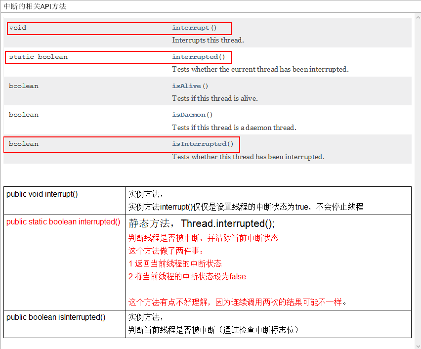
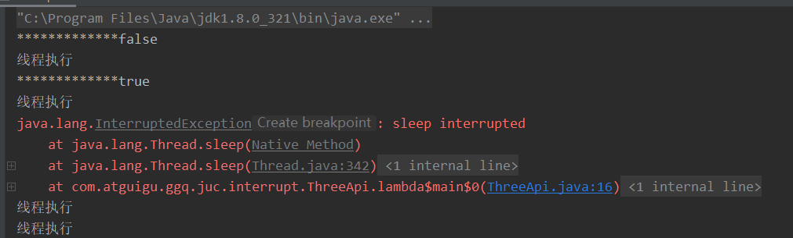
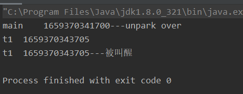

# 八股


## 线程池

池化技术: 减少创建于销毁次数,

execute() 只能执行runnable, submit可run 可call 所以submit方便异常处理和可获得返回值

 


## 并发容器

ConcurrentHashMap 只锁定当前链表或红黑树的首节点

CopyOrRight保证最终一致性, 读写分离, 无法保证实时

threadlocal是每一个线程一份的变量, 为了将一些状态与线程绑定,经典使用场景比如JDBC的连接与线程挂钩线程A操作库A线程B操作库B不会互相影响,session管理等, 避免资源在多个线程共享, 注意局部变量的生命周期, 很容易内存泄漏

threadlocalMap <弱引用,强引用>  有可能key被回收value不被回收导致内存泄漏, 所以必须每次用完必须调用他的remove方法

阻塞队列就是封装了生产者消费者的那个队列,很好的控制了线程间的通信


## AQS

抽象队列同步器框架,  当请求的共享资源空闲则将当前请求的线程作为工作线程, 如果不空闲则阻塞, AQS将这些阻塞线程作为队列的结点存储, 是一套线程阻塞等待及被唤醒时锁分配的机制

重入性 state累加应该是cas符合的才会进入 unlock累减 直到为0才能被别的线程进入

## 锁升级

对象(.class对象和普通对象) 作为锁每一个static /普通 共享资源的访问都需要获得对象头的允许才能进行, 正常无锁,任意线程都可访问, 有同步资源则  对象头会存储上次执行的线程ID 第二个来的如果还是上次的线程ID可以直接进入执行同步代码块,节省了持有锁释放锁的这种重型操作的开销, 如果第二个线程ID与对象头中的不一致则会升级为自旋锁,(自旋的道理在于直接让线程去阻塞然后再调度也是有开销的, 不如先让他while获取锁一段时间, 即自旋一段时间,之后再进行线程调度)如果超出限定条件(比如一定的自旋次数) 则会升级为真正的重型锁: 当一个线程获取到了锁, 其他等待获取锁的线程都会阻塞 重型锁依赖操作系统原语有用户态与和核心态的切换,开销真的很大

## 上下文切换

线程切换需要保存当前运行状态, 切换一个线程需要加载线程上次的运行状态

## callable VS runnable

callable: call() 能捕获运行时异常并处理 run则不行 , callable可以有返回值, 具体FutureTast.get(), 会阻塞主进程, 不调用则不会阻塞

## Start() vs run()

start() 只能调用一次, 真正启动一个线程去完成任务,无需等待run方法代码执行完毕, 而run只是覆写了一个方法


## 线程生命周期

五种:


就绪: 等待cpu调度

执行: 正在cpu执行

阻塞: 因为一些原因暂时放弃cpu

- 等待阻塞: wait()方法, 进入等待队列
- 同步阻塞: 获取同步锁失败, JVM将线程放到锁池
- 其他阻塞: 通过调用sleep,或join或发出IO请求, 当sleep时间超时, join执行完成, IO完成 重新转入就绪

死亡: 因异常退出run方法或正常退出


JVM:

就绪: 可能是正在运行, 也可能是在就绪队列等待被分配cpu时间片

阻塞: 通过synchronized获取锁失败

等待: wait(), join()

计时等待: 同等待 只是需要时间限制


##  volatile  synchronize

### volatile 

volatile 修饰变量关键字可以保证可见性与有序性
（1）当对volatile变量执行写操作后JMM会把工作内存中的最新变量值强行刷新到主内存，写操作会导致其他线程里的缓存无效（CPU嗅探总线，主存中更改的数据地址与自己缓存对比，若一致则失效）
（2） 防止指令重排 在volatile前后加上内存屏障 （各种屏障都是保证同步，简单来说在屏障之后的写操作必须等待屏障之前的写操作完成才可以执行，读操作则不受影响）
缺点不具有原子性
volatile的实现是轻量级的 性能优于 synchronized 

### synchronize

1 synchronized 隐性锁 依赖monitor
2 每个对象会与一个monitor相关联
  （1）当监视器被占用时，就会处于锁定状态，监视器的获得过程是排他的。如果某线程已经占用了监视器，则其他线程会进入阻塞状态等待锁的释放
  （2）执行完成退出监视器
修饰实例方法 修饰类方法 修饰代码块 （注意锁粒度）

## 同步器AQS

底层CAS（抽象队列同步器）定义了一套多线程访问共享资源的同步器框架
利用CLH队列锁实现 将获取不到线程的进程放入

## JMM（Java内存模型)

JVM中的共享数据可能被分配到CPU中的寄存器中，主内存RAM中
若分配到寄存器中，每个CPU都有自己的 一个CPU不能读取其他CPU上的内容，如果两个线程分别运行在不同CPU上，无法看到数据的变化

CPU不直接从主存读取数据，先把RAM中数据读到Cache缓存中再把Cache的数据读到寄存器中，CPU中线程对数据更新，可能只是更新到写缓冲器，还没有到达Cache更不用说主存 分配到主存中  运行在另一个CPU中的线程无法看到共享数据的更新

CPU具有缓存同步 共享数据的更新必须被写入cache 这个过程就是冲刷处理缓存

JMM对这些进行规定 ：每个线程之间的共享数据都存储在主内存中
		每个线程都有一个私有的工作内存（是一个抽象的概念，他涵盖寄存器，写缓冲器，其他硬件的优化）
		每个线程从主内存中把数据读取到本地工作内存中，在工作内存中保存共享数据的副本，工作内存仅对当前线程可见

## 同步方法

wait(): 释放锁 用于通信

Thread.sleep() 不释放锁 用于暂停

yield() 从运行转为就绪, 只会给优先级高的机会

notify() 由JVM唤醒一个线程

notifyall() 只是唤醒竞争锁不是直接获得锁

## wait notify all 为什么定义在Object 


# 指令重排

计算机在执行程序时，为了提高性能，编译器和处理器常常会对指令做重排。

## 为什么指令重排序可以提高性能？

简单地说，每一个指令都会包含多个步骤，每个步骤可能使用不同的硬件。因此，**流水线技术**产生了，它的原理是指令1还没有执行完，就可以开始执行指令2，而不用等到指令1执行结束之后再执行指令2，这样就大大提高了效率。

但是，流水线技术最害怕**中断**，恢复中断的代价是比较大的，所以我们要想尽办法不让流水线中断。指令重排就是减少中断的一种技术。

我们分析一下下面这个代码的执行情况：

```
JAVA
a = b + c;
d = e - f ;
```

先加载b、c（**注意，即有可能先加载b，也有可能先加载c**），但是在执行add(b,c)的时候，需要等待b、c装载结束才能继续执行，也就是增加了停顿，那么后面的指令也会依次有停顿,这降低了计算机的执行效率。

为了减少这个停顿，我们可以先加载e和f,然后再去加载add(b,c),这样做对程序（串行）是没有影响的,但却减少了停顿。既然add(b,c)需要停顿，那还不如去做一些有意义的事情。

综上所述，**指令重排对于提高CPU处理性能十分必要。虽然由此带来了乱序的问题，但是这点牺牲是值得的。**

指令重排一般分为以下三种：

- **编译器优化重排**

  编译器在**不改变单线程程序语义**的前提下，可以重新安排语句的执行顺序。

- **指令并行重排**

  现代处理器采用了指令级并行技术来将多条指令重叠执行。如果**不存在数据依赖性**(即后一个执行的语句无需依赖前面执行的语句的结果)，处理器可以改变语句对应的机器指令的执行顺序。

- **内存系统重排**

  由于处理器使用缓存和读写缓存冲区，这使得加载(load)和存储(store)操作看上去可能是在乱序执行，因为三级缓存的存在，导致内存与缓存的数据同步存在时间差。

指令重排可以保证串行语义一致, 不保证多线程一致

## as-if-serial语义

as-if-serial语义的意思是：不管编译器和CPU如何重排序，必须保证在单线程情况下程序的结果是正确的。 以下数据有依赖关系，不能重排序。


# 主内存与工作内存之间的交互

为了保证数据交互时数据的正确性，Java内存模型中定义了8种操作来完成这个交互过程，这8种操作本身都是原子性的。虚拟机实现时必须保证下面 提及的每一种操作都是原子的、不可再分的。


> (1)lock:作用于主内存的变量，它把一个变量标识为一条线程独占的状态。
>
> (2)unlock:作用于主内存的变量，它把一个处于锁定状态的变量释放出来，释放后的变量才可以被其它线程锁定。
>
> (3)read:作用于主内存的变量，它把一个变量的值从主内存传输到线程的工作内存中，以便随后的load动作使用。
>
> (4)load:作用于工作内存的变量，它把read操作从主内存中得到的变量值放入工作内存的变量副本中。
>
> (5)use:作用于工作内存的变量，它把工作内存中一个变量的值传递给执行引擎，每当虚拟机遇到一个需要使用到变量的值的字节码指令时都会执行这个操作。
>
> (6)assign:作用于工作内存的变量，它把一个从执行引擎接收到的值赋给工作内存的变量，每当虚拟机遇到一个给变量赋值的字节码指令时执行这个操作。
>
> (7)store:作用于工作内存的变量，它把工作内存中一个变量的值传送到主内存中，以便随后的write使用。
>
> (8)write:作用于主内存的变量，它把store操作从工作内存中得到的变量的值放入主内存的变量中。

注意:

1. 如果对一个变量执行lock操作，将会清空工作内存中此变量的值
2. 对一个变量执行unlock操作之前，必须先把此变量同步到主内存中
3. lock和unlock操作只有加锁才会有。synchronized就是通过这样来保证可见性的。

# happens-before

## 什么是happens-before?

**不改变程序的执行结果（单线程程序和正确同步了的多线程程序），编译器和处理器怎么优化都行**

而对于程序员，JMM提供了**happens-before规则**（JSR-133规范），满足了程序员的需求——**简单易懂，并且提供了足够强的内存可见性保证。**换言之，程序员只要遵循happens-before规则，那他写的程序就能保证在JMM中具有强的内存可见性。

JMM使用happens-before的概念来定制两个操作之间的执行顺序。这两个操作可以在一个线程以内，也可以是不同的线程之间。因此，JMM可以通过happens-before关系向程序员提供跨线程的内存可见性保证。

happens-before关系的定义如下：

1. 如果一个操作happens-before另一个操作，那么第一个操作的执行结果将对第二个操作可见，而且第一个操作的执行顺序排在第二个操作之前。
2. **两个操作之间存在happens-before关系，并不意味着Java平台的具体实现必须要按照happens-before关系指定的顺序来执行。如果重排序之后的执行结果，与按happens-before关系来执行的结果一致，那么JMM也允许这样的重排序。**

as-if-serial语义保证单线程内重排序后的执行结果和程序代码本身应有的结果是一致的，happens-before关系保证正确同步的多线程程序的执行结果不被重排序改变。

总之，**如果操作A happens-before操作B，那么操作A在内存上所做的操作对操作B都是可见的，不管它们在不在一个线程。**

# volatile

volatile不保证原子性，只保证可见性和禁止指令重排

```java
private static volatile SingletonDemo instance = null;

    private SingletonDemo() {
        System.out.println(Thread.currentThread().getName() + "\t 执行单例构造函数");
    }

    public static SingletonDemo getInstance(){

        if(instance == null){
            synchronized (SingletonDemo.class){
                if(instance == null){
                    instance = new SingletonDemo(); //pos_1
                }
            }
        }
        return instance;
    }
```

**pos_1处的代码转换成汇编代码如下**

```
SHELL
0x01a3de1d: movb $0×0,0×1104800(%esi);
0x01a3de24: lock addl $0×0,(%esp);
```

# 中断

## 中断API



## 如何停止线程

### 使用中断标志位

```java
package com.atguigu.ggq.juc.interrupt;

import java.util.concurrent.TimeUnit;

public class ThreeApi {
    public static void main(String[] args) {
        Thread t1 = new Thread(()->{
            while(true){
//                System.out.println("线程执行");
                if(Thread.currentThread().isInterrupted()){   // 线程自己实现中断
                    System.out.println("线程中断");
                    break;
                }
                System.out.println("线程执行");
//                try {
//                    TimeUnit.SECONDS.sleep(1);
//                } catch (InterruptedException e) {
               	  	//Thread.currentThread().interrupt();  错误1 不加这行, 错误2 加
//                    e.printStackTrace();// 抛出(注意这里代码是catch 异常已抛出过了)这个异常时 标志位变为false了 
//                }
            }
        },"t1");
        t1.start();
        System.out.println("*************"+t1.isInterrupted());
        try {
            TimeUnit.MILLISECONDS.sleep(1);
        } catch (InterruptedException e) {
            e.printStackTrace();
        }
        t1.interrupt();
        System.out.println("*************"+t1.isInterrupted());
    }
}

```

```java
正常结果
*************false
线程执行
线程执行
线程执行
线程执行
线程执行
线程执行
*************true
线程中断

Process finished with exit code 0

```

>  错误结果1(如果线程被block) + sleep

```java
抛出异常后 线程会一直执行
```



>  错误结果2 抛出异常 但线程关闭 添加捕获异常时的中断


### (优雅的关闭)使用 volatile Boolean

```java
public class Vol {
    private static volatile boolean flag;
    public static void main(String[] args) {
        Thread t1 = new Thread(()->{
            while(!flag) {
    			//do
            }
        },"t1");
        t1.start();
        flag = true;

    }
}
```

### 使用AutomaticBoolean

```java
public class Ato {
    private static final AtomicBoolean flag = new AtomicBoolean(true);
    public static void main(String[] args) {
        Thread t1 = new Thread(()->{
            while(flag.get()) {
                //do
            }
        },"t1");
        t1.start();
        flag.set(false);

    }
}
```

## Executor 的中断操作

调用 Executor 的 shutdown() 方法会等待线程都执行完毕之后再关闭，但是如果调用的是 shutdownNow() 方法，则相当于调用每个线程的 interrupt() 方法。

以下使用 Lambda 创建线程，相当于创建了一个匿名内部线程。

```java
public static void main(String[] args) {
    ExecutorService executorService = Executors.newCachedThreadPool();
    executorService.execute(() -> {
        try {
            Thread.sleep(2000);
            System.out.println("Thread run");
        } catch (InterruptedException e) {
            e.printStackTrace();
        }
    });
    executorService.shutdownNow();
    System.out.println("Main run");
}
```

```html
Main run
java.lang.InterruptedException: sleep interrupted
    at java.lang.Thread.sleep(Native Method)
    at ExecutorInterruptExample.lambda$main$0(ExecutorInterruptExample.java:9)
    at ExecutorInterruptExample$$Lambda$1/1160460865.run(Unknown Source)
    at java.util.concurrent.ThreadPoolExecutor.runWorker(ThreadPoolExecutor.java:1142)
    at java.util.concurrent.ThreadPoolExecutor$Worker.run(ThreadPoolExecutor.java:617)
    at java.lang.Thread.run(Thread.java:745)
```

如果只想中断 Executor 中的一个线程，可以通过使用 submit() 方法来提交一个线程，它会返回一个 Future\<?\> 对象，通过调用该对象的 cancel(true) 方法就可以中断线程。

```java
Future<?> future = executorService.submit(() -> {
    // ..
});
future.cancel(true);
```


# LockSupport

## 是什么

LockSupport是用来创建锁和其他同步类的基本线程阻塞原语。

下面这句话，后面详细说
LockSupport中的park() 和 unpark() 的作用分别是阻塞线程和解除阻塞线程

## 3种让线程等待和唤醒的方法

方式1：使用Object中的wait()方法让线程等待，使用Object中的notify()方法唤醒线程

> 创建一个对象作为锁对象 
>
> Object类中的wait、notify、notifyAll用于线程等待和唤醒的方法，都必须在synchronized内部执行（必须用到关键字synchronized）。
>
> 先wait后notify才OK

方式2：使用JUC包中Condition的await()方法让线程等待，使用signal()方法唤醒线程

>Lock lock = new ReentrantLock(); 
>
>lock.lock(); lock.unlock();
>
>线程先要获得并持有锁，必须在锁块(synchronized或lock)中 
>
>必须要先等待后唤醒，线程才能够被唤醒

以上两种 使用不当 会有非法monitor状态异常

方式3：LockSupport类可以阻塞当前线程以及唤醒指定被阻塞的线程

> LockSupport类使用了一种名为Permit（许可）的概念来做到阻塞和唤醒线程的功能， 每个线程都有一个许可(permit)，
> permit只有两个值1和零，默认是零。
> 可以把许可看成是一种(0,1)信号量（Semaphore），但与 Semaphore 不同的是，许可的累加上限是1。默认0

park 把什么搁置 设为0 不许可 阻塞当前线程

unpark(t) 设为1 可执行 唤醒 t 不会抛什么异常	\

```java
public class T1
{
    public static void main(String[] args)
    {
        Thread t1 = new Thread(() -> {
            try { TimeUnit.SECONDS.sleep(3); } catch (InterruptedException e) { e.printStackTrace(); }
            System.out.println(Thread.currentThread().getName()+"\t"+System.currentTimeMillis());
            LockSupport.park(); //执行park无效
            System.out.println(Thread.currentThread().getName()+"\t"+System.currentTimeMillis()+"---被叫醒");
        },"t1");
        t1.start();

        try { TimeUnit.SECONDS.sleep(1); } catch (InterruptedException e) { e.printStackTrace(); }

        LockSupport.unpark(t1); // 先执行
        System.out.println(Thread.currentThread().getName()+"\t"+System.currentTimeMillis()+"---unpark over");
    }
}
```




​	


