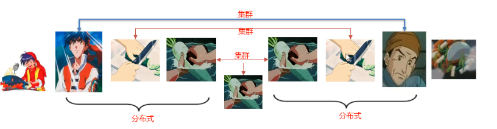
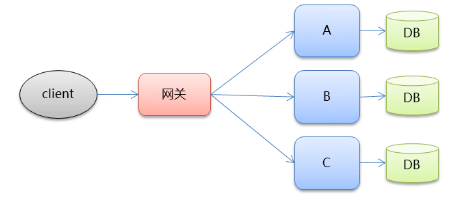
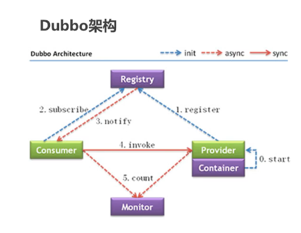
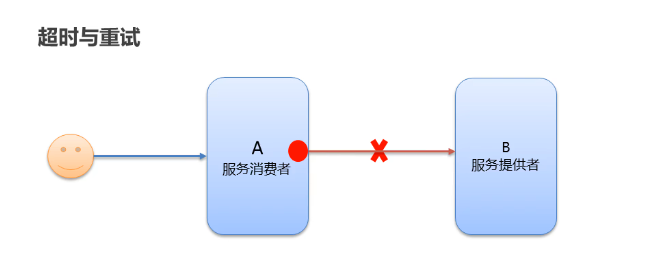
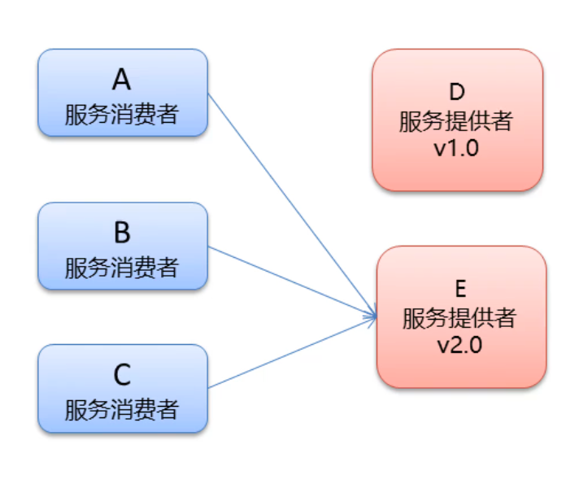
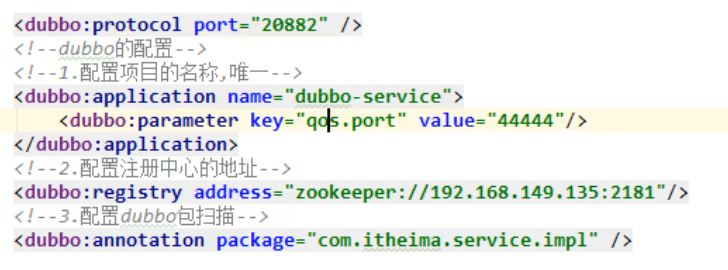
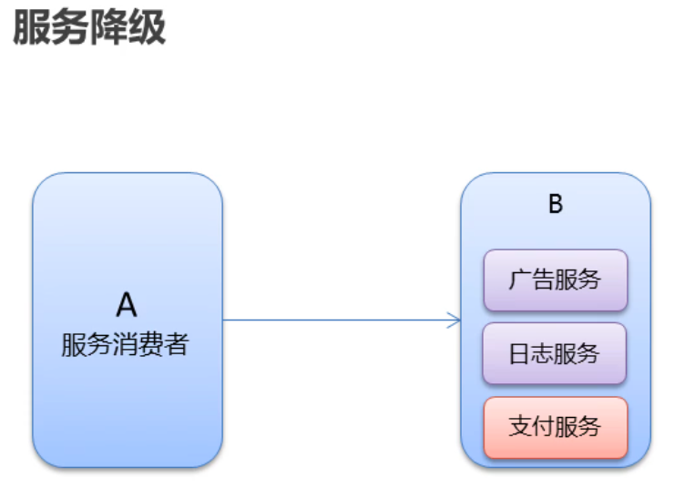
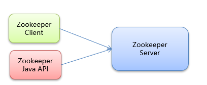
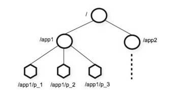

# 微服务架构

	1. 服务组件化
	1. 服务间交互采用restful 风格
	1. 去中心化 :每个服务有自己的私有数据库持久化系统
	1. 自动化部署:把应用拆分为一个一个独立的单个服务,方便自动化部署,测试,运维


1.传统集中式架构

​	开发速度快

​	并发能力差

​	代码耦合度高,维护困难

​	容错率低

2.垂直拆分

​	一个数据库,多个系统模块

​	拆分实现了流量分担,解决并发

​	可针对不同模块进行优化

​	方便水平扩展(集群化),负载均衡,容错率高

​	系统间相互独立,会有很多重复开发,影响开发效率

3.分布式服务

​	垂直应用越来越多,应用交互不可避免

​	系统间相互调用,调高代码复用和效率

​	系统间耦合度高,调用关系错综复杂,难以维护

​		服务提供方一旦产生变更,所有消费方都需要变更


4.面向服务架构(SOA)

​	中间增加一层ESB,用来连接各个服务结点,集成不同系统,不同协议的服务

​	做消息的转化解释和路由工作

​	ESB产品实现复杂,服务粒度较大,	ESB包含的功能如:负载均衡,流量控制

​		加密处理,服务监控,异常处理等等

​	集成整合所有服务,数据转换使运维,测试部署困难

​	所有服务通过一个通路通信,降低通信速度

​	通常松耦合 基于socket工作在会话层,自定义数据格式,速度快,效率高

5.微服务架构

​	基于TCP工作在应用层,规定了数据传输格式

​	服务粒度小,使用轻量级通信,通常是HTTP API 

​	各服务可使用不同的编程语言实现,以及不同的数据存储技术

​	服务间相互独立

​	并保持最低限度的集中式管理

​	

***

> 网关给用户提供统一的方式接入微服务,在网关层处理所有的非业务功能,例如身份验证,监控,负载均衡,缓存,请求分片与管理,静态响应处理,服务端通过服务注册中心进行服务注册和管理

# dubbo

## 1-今日内容

 分布式系统中的相关概念

dubbo 概述

dubbo快速入门

dubbo的高级特性


### 2.2-互联网项目架构-目标


	●QPS: Query Per Second每秒查询数。
	●TPS: Transactions Per Second每秒事务数。
	●一个事务是指一 个客户机向服务器发送请求然后服务器做出反应的过程。客户机在发送请求时开始计时，收到服务器响应后结束
	计时，以此来计算使用的时间和完成的事务个数。
	●一个页面的一次访问，只会形成一 个TPS; 但-次页面请求，可能产生多次对服务器的请求，就会有多个QPS
	  QPS>=并发连接数>= TPS

**大型互联网项目架构目标**:

​	●**高性能:**提供快速的访问体验。
​	●**高可用:**网站服务- 可以正常访问

### 2.3-集群和分布式

集群和分布式，
●集群:很多“人”一起，干一样的事。
●一个业务模块，部署在多台服务器上。
●分布式:很多"人”一起，干不样的事。这些不一样的事， 合起来是一件大事。





### 2.4-架构演进


**分布式架构：**是指在垂直架构的基础上,将公共业务模块抽取出来,作为独立的服务供其他调用者消费，以实现服务的共享和重用。底层通过RPC（远程过程调用实现）
	**RPC:** Remote Procedure Call远程过程调用。有非常多的协议和技术来都实现了RPC的过程。比如: HTTP REST风格，Java RMI规范、WebService SOAP协议Hession等等。

**分布式架构存在的问题:**
​	●服务提供方- -旦产生变更,所有消费方都需要变更。


**微服务架构：**

●微服务架构是在SOA上做的升华,微服务架构强调的一个重点是“业务需要彻底的组件化和服务化”，原有的单个
业务系统会拆分为多个可以独立开发、设计、运行的小应用。这些小应用之间通过服务完成交互和集成。


**特点:**
●服务实现组件化:开发者可以自由选择开发技术。也不需要协调其他团队
●服务之间交互一 般使用REST API
●去中心化:每个微服务有自己私有的数据库持久化业务数据
●自动化部署:把应用拆分成为一 个个独立的单个服务,方便自动化部署、测试、运维





## 3-dubbo 概述

**Dubbo概念**

●Dubbo是阿里巴巴公司开源的一个高性能、轻量级的Java RPC框架。
●致力于提供高性能和透明化的RPC远程服务调用方案,以及SOA服务治理方案。
●官网: htp://ubbo.apache.orgo


节点角色说明: .
●Provider: 暴露服务的服务提供方
●Container: 服务运行容器
●Consumer: 调用远程服务的服务消费方
●Registry: 服务注册与发现的注册中心
●Monitor:统计服务的调用次数和调用时间的监控中心

## 5-dubbo高级特性

### 5.1dubbo-admin安装

dubbo- admin
	●dubbo-admin管理平台，是图形化的服务管理页面
	●从注册中心中获取到所有的提供者 /消费者进行配置管理
	●路由规则、动态配置、服务降级、访问控制、权重调整、负载均衡等管理功能
	●dubbo- admin是一个前后端分离的项目。前端使用vue，后端使用springboot
	●安装dubbo-admin其实就是部署该项目


### 5.3序列化


1. dubbo 内部已经将序列化和反序列化的过程内部封装了
2. 我们只需要在定义pojo类时**实现seriali zable接口**即可
3. 一般会定义一 个公共的pojo模块,让生产者和消费者都依赖该模块。


User对象未实现serializable接口

错误信息：


解决办法：

```java
User implements Serializable
```


### 5.4地址缓存


**注册中心挂了，服务是否可以正常访问？**

1.  可以，因为dubbo服务消费者在第一-次调用时，会将服务提供方地址缓存到本地，以后在调用则不会访问注册中心。
2.  当服务提供者地址发生变化时，注册中心会通知服务消费者。




### 5.5 超时


- 服务消费者在调用服务提供者的时候发生了阻塞、等待的情形,这个时候,服务消费者会直等待下去。
- 在某个峰值时刻，大量的请求都在同时请求服务消费者,会造成线程的大量堆积，势必会造成雪崩。
- dubbo利用超时机制来解决这个问题，设置-个超时时间, 在这个时间段内，无法完成服务访问,则自动断开连接。
- 使用timeout属性配置超时时间，默认值1000，单位毫秒

```java
//timeout 超时时间 单位毫秒  retries 重试次数
@Service(timeout = 3000,retries=0)
```


### 5.6重试




1. 设置了超时时间，在这个时间段内，无法完成服务访问,则自动断开连接。
2. 如果出现网络抖动,则这一-次请求就会失败。
3. Dubbo提供重试机制来避免类似问题的发生。
4. 通过retries属性来设置重试次数。默认为2次

```java
//timeout 超时时间 单位毫秒  retries 重试次数
@Service(timeout = 3000,retries=0)
```

### 5.7多版本



**灰度发布:**当出现新功能时,会让一部分用户先使用新功能，用户反馈没问题时，再将所有用户迁移到新功能。

dubbo中使用version属性来设置和调用同一个接口的不同版本


生产者配置

```java
@Service(version="v2.0")
public class UserServiceImp12 implements UserService {...}
```

消费者配置

```java
@Reference(version = "v2.0")//远程注入
private UserService userService;
```


### 5.8负载均衡

**负载均衡策略(4种) :** 
**Random:**按权重随机，默认值。按权重设置随机概率。

**RoundRobin:** 按权重轮询。

**LeastActive:** 最少活跃调用数,相同活跃数的随机。

**ConsistentHash:**一 致性Hash,相同参数的请求总是发到同一提供者。


服务提供者配置

```java
@Service(weight = 100)
public class UserServiceImp12 implements UserService {...}
```


application.xml 配置parameter key



消费者配置

```java
//@Reference(loadbalance = "roundrobin")
//@Reference(loadbalance = "leastactive")
//@Reference(loadbalance = "consistenthash")
@Reference(loadbalance = "random")//默认 按权重随机
private UserService userService;
```

### 5.9集群容错


**集群容错模式:**
	**Failover Cluster:**失败重试。默认值。当出现失败，重试其它服务器，默认重试2次，使用retries配置。一般用于读操作
	**Failfast Cluster :**快速失败,发起-次调用，失败立即报错。通常用于写操作。
	**Failsafe Cluster:**失败安全，出现异常时，直接忽略。返回一个空结果。
	**Failback Cluster:**失败自动恢复,后台记录失败请求,定时重发。
	**Forking Cluster :**并行调用多个服务器，只要一个成功即返回。
	**Broadcast Cluster:** 广播调用所有提供者,逐个调用，任意一台报错则报错。

消费者配置

```java
@Reference(cluster = "failover")//远程注入
private UserService userService;
```

### 5.10服务降级

**服务降级**：当服务器压力剧增的情况下，根据实际业务情况及流量，对一些服务和页面有策略的不处理或换种简单的方式处理，从而释放服务器资源以保证**核心交易**正常运作或高效运作

**服务降级方式:**
**mock= force:return null**：表示消费方对该服务的方法调用都直接返回null值,不发起远程调用。用来屏蔽不重要服务不可用时对调用方的影响。

**mock=fail:return null**：表示消费方对该服务的方法调用在失败后，再返回null值,不抛异常。用来容忍不重要服务不稳定时对调用方的影响




消费方配置

```java
//远程注入
@Reference(mock =“ force :return null")//不再调用userService的服务
private UserService userService;
```


## 总结

### 概述

SOA,RPC框架 用Zookeeper作为注册中心 


### 超时,重试,负载均衡,灰度发布(多版本)

@Service(timeout = ,retries =  ,version="")  同spring @service一致采用dubbo包 用于服务发布

@Reference(loadbalance = "",version = "")) 类似Autowire 用于服务发现

//@Reference(loadbalance = "roundrobin")
//@Reference(loadbalance = "leastactive")
//@Reference(loadbalance = "consistenthash")
@Reference(loadbalance = "random")//默认 按权重随机

@Service(timeout = 3000,retries=0)

@Reference(version = "v2.0")//远程注入

private UserService userService;

### 集群容错

**Failover Cluster:**失败重试。默认值。当出现失败，重试其它服务器，默认重试2次，使用retries配置。一般用于读操作
	**Failfast Cluster :**快速失败,发起-次调用，失败立即报错。通常用于写操作。
	**Failsafe Cluster:**失败安全，出现异常时，直接忽略。返回一个空结果。
	**Failback Cluster:**失败自动恢复,后台记录失败请求,定时重发。
	**Forking Cluster :**并行调用多个服务器，只要一个成功即返回。
	**Broadcast Cluster:** 广播调用所有提供者,逐个调用，任意一台报错则报错。

消费者配置

```java
@Reference(cluster = "failover")//远程注入
private UserService userService;
```

### 服务降级

**服务降级**：当服务器压力剧增的情况下，根据实际业务情况及流量，对一些服务和页面有策略的不处理或换种简单的方式处理，从而释放服务器资源以保证**核心交易**正常运作或高效运作

**服务降级方式:**
**mock= force:return null**：表示消费方对该服务的方法调用都直接返回null值,不发起远程调用。用来屏蔽不重要服务不可用时对调用方的影响。

**mock=fail:return null**：表示消费方对该服务的方法调用在失败后，再返回null值,不抛异常。用来容忍不重要服务不稳定时对调用方的影响


消费方配置

```java
//远程注入
@Reference(mock =“ force :return null")//不再调用userService的服务
private UserService userService;
```

分布式 很多人一起干不一样的事 合起来是一件大事

0-5 共六步

> 图片 todo

### 功能

  1. 一个RPC框架 远程过程调用,能够将单体上的应用的各个模块变成分布式,关键是call过程,通过zookeeper注册中心(服务治理)

     1. zookeepper 是一个树结构,结点可以存储信息 / 根节点 

        1. 分布式锁的实现

           1. 临时有序结点,选取顺序最小的 每个线程申请都会生成一结点,

              2. 集群治理
                 3. 其他高级特性
                      		心跳
                        		负载均衡
                        		容灾
                        		服务注册/发现


                   	4. 配置管理
    
    服务提供者将服务信息注册到服务中心,消费者对生产者进行调用,会在本地存有地址和端口缓存,如果服务提供者的地址端口信息等进行更新,zookeepper会通知消费者更新缓存
    
    1. (在下次调用时更新还是一更改就更新?思考:一更改就更新,会有缓存的嗅探()好处是只要缓存命中就能保证服务的可靠性,如果调用时更新,缓存的意义就不大了,)
    
    还有 monitor (sentinel(或duboo-admin)对rpc进行监控)

### 特性

1. 序列化

2. 地址缓存

3. 超时与重试

   1. 消费者的请求阻塞,等待的时候,dubbo设置了超时机制,无法完成服务访问则自动断开连接(基于TCP的连接?)
   2. 如果出现网络抖动,请求失败,通过retries设置重传次数 默认2

4. 多版本

   1. 用version属性来调用同一个接口的不同版本

5. 负载均衡选用哪个服务

   1. random :按权重随机,每个默认都为100
   2. roundRobin权重轮询
   3. LeastActive最少活跃调用,相同活跃随机
   4. ConsistentHash 一致性hash,相同参数的请求总是发到同一提供者

   6)集群容错 

#  Zookeeper

## 1)初识 Zookeeper

### 1.1)Zookeeper概念

•Zookeeper 是 Apache Hadoop 项目下的一个子项目，是一个树形目录服务。


•Zookeeper 提供的主要功能包括：

•配置管理

•分布式锁

•集群管理


#### **2.2.2、启动ZooKeeper**

```shell
cd /opt/zooKeeper/apache-zooKeeper-3.5.6-bin/bin/
#启动
 ./zkServer.sh  start
```


看到上图表示ZooKeeper成功启动

**3、查看ZooKeeper状态**

```shell
./zkServer.sh status
```

zookeeper启动成功。standalone代表zk没有搭建集群，现在是单节点


zookeeper没有启动


## 3)ZooKeeper 命令操作

### 3.1)Zookeeper命令操作数据模型

•ZooKeeper 是一个树形目录服务,其数据模型和Unix的文件系统目录树很类似，拥有一个层次化结构。

•这里面的每一个节点都被称为： ZNode，每个节点上都会保存自己的数据和节点信息。 

• 节点可以拥有子节点，同时也允许少量（1MB）数据存储在该节点之下。

•节点可以分为四大类：

•PERSISTENT 持久化节点 

•EPHEMERAL 临时节点 ：-e

•PERSISTENT_SEQUENTIAL 持久化顺序节点 ：-s

•EPHEMERAL_SEQUENTIAL 临时顺序节点  ：-es


### **3.2)Zookeeper命令操作服务端命令**

•启动 ZooKeeper 服务: ./zkServer.sh start

•查看 ZooKeeper 服务状态: ./zkServer.sh status

•停止 ZooKeeper 服务: ./zkServer.sh stop 

•重启 ZooKeeper 服务: ./zkServer.sh restart 



### **3.3)Zookeeper客户端常用命令**

•连接ZooKeeper服务端

```shell
./zkCli.sh –server ip:port
```

•断开连接

```shell
quit
```

•查看命令帮助

```shell
help
```

•显示指定目录下节点

```
ls 目录
```

•创建节点

```
create /节点path value
```

•获取节点值

```
get /节点path
```

•设置节点值

```
set /节点path value
```

•删除单个节点

```
delete /节点path
```

•删除带有子节点的节点

```
deleteall /节点path
```


### 3.4)客户端命令-创建临时有序节点

•创建临时节点

```
create -e /节点path value
```

•创建顺序节点

```
create -s /节点path value
```

•查询节点详细信息

```
ls –s /节点path 
```

•czxid：节点被创建的事务ID 

•ctime: 创建时间 

•mzxid: 最后一次被更新的事务ID 

•mtime: 修改时间 

•pzxid：子节点列表最后一次被更新的事务ID

•cversion：子节点的版本号 

•dataversion：数据版本号 

•aclversion：权限版本号 

•ephemeralOwner：用于临时节点，代表临时节点的事务ID，如果为持久节点则为0 

•dataLength：节点存储的数据的长度 

•numChildren：当前节点的子节点个数 



## 4)ZooKeeper JavaAPI 操作

### 4.1)urator介绍

•Curator 是 Apache ZooKeeper 的Java客户端库。

•常见的ZooKeeper Java API ：

•原生Java API

•ZkClient

•Curator

•Curator 项目的目标是简化 ZooKeeper 客户端的使用。

•Curator 最初是 Netfix 研发的,后来捐献了 Apache 基金会,目前是 Apache 的顶级项目。

•官网：http://curator.apache.org/

### 4.2)JavaAPI操作建立连接

1，搭建项目

创建项目curator-zk

引入pom和日志文件

资料文件夹下pom.xml和log4j.properties


2、创建测试类，使用curator连接zookeeper

```java
@Before
public void testConnect() {
    //重试策略
    RetryPolicy retryPolicy = new ExponentialBackoffRetry(3000, 10);
    //2.第二种方式
    //CuratorFrameworkFactory.builder();
    client = CuratorFrameworkFactory.builder()
        .connectString("192.168.200.130:2181")
        .sessionTimeoutMs(60 * 1000)
        .connectionTimeoutMs(15 * 1000)
        .retryPolicy(retryPolicy)
        .namespace("itheima")
        .build();
    //开启连接
    client.start();
}
```

### 4.3)Zookeeper JavaAPI操作-创建节点

```java
/**
* 创建节点：create 持久 临时 顺序 数据
* 1. 基本创建 ：create().forPath("")
* 2. 创建节点 带有数据:create().forPath("",data)
* 3. 设置节点的类型：create().withMode().forPath("",data)
* 4. 创建多级节点  /app1/p1 ：create().creatingParentsIfNeeded().forPath("",data)
*/
@Test
public void testCreate() throws Exception {
    //2. 创建节点 带有数据
    //如果创建节点，没有指定数据，则默认将当前客户端的ip作为数据存储
    String path = client.create().forPath("/app2", "hehe".getBytes());
    System.out.println(path);
}
```

```java
@Test
public void testCreate2() throws Exception {
    //1. 基本创建
    //如果创建节点，没有指定数据，则默认将当前客户端的ip作为数据存储
    String path = client.create().forPath("/app1");
    System.out.println(path);
}
@Test
public void testCreate3() throws Exception {
    //3. 设置节点的类型
    //默认类型：持久化
    String path = client.create().withMode(CreateMode.EPHEMERAL).forPath("/app3");
    System.out.println(path);
}
@Test
public void testCreate4() throws Exception {
    //4. 创建多级节点  /app1/p1
    //creatingParentsIfNeeded():如果父节点不存在，则创建父节点
    String path = client.create().creatingParentsIfNeeded().forPath("/app4/p1");
    System.out.println(path);
}
```

### 4.4)ZookeeperJavaAPI操作-查询节点

```java
/**
* 查询节点：
* 1. 查询数据：get: getData().forPath()
* 2. 查询子节点： ls: getChildren().forPath()
* 3. 查询节点状态信息：ls -s:getData().storingStatIn(状态对象).forPath()
*/
@Test
public void testGet1() throws Exception {
    //1. 查询数据：get
    byte[] data = client.getData().forPath("/app1");
    System.out.println(new String(data));
}
```

```JAVA
@Test
public void testGet2() throws Exception {
    // 2. 查询子节点： ls
    List<String> path = client.getChildren().forPath("/");
    System.out.println(path);
}
@Test
public void testGet3() throws Exception {
    Stat status = new Stat();
    System.out.println(status);
    //3. 查询节点状态信息：ls -s
    client.getData().storingStatIn(status).forPath("/app1");
    System.out.println(status);
}
```

### 4.5)Zookeeper JavaAPI操作-修改节点

```JAVA
/**
* 修改数据
* 1. 基本修改数据：setData().forPath()
* 2. 根据版本修改: setData().withVersion().forPath()
* * version 是通过查询出来的。目的就是为了让其他客户端或者线程不干扰我。
*
* @throws Exception
*/
@Test
public void testSet() throws Exception {
	client.setData().forPath("/app1", "itcast".getBytes());
}
```

```JAVA
@Test
public void testSetForVersion() throws Exception {
    Stat status = new Stat();
    //3. 查询节点状态信息：ls -s
    client.getData().storingStatIn(status).forPath("/app1");
    int version = status.getVersion();//查询出来的 3
    System.out.println(version);
    client.setData().withVersion(version).forPath("/app1", "hehe".getBytes());
}
```

### 4.6)Zookeeper JavaAPI操作-删除节点

```JAVA
/**
* 删除节点： delete deleteall
* 1. 删除单个节点:delete().forPath("/app1");
* 2. 删除带有子节点的节点:delete().deletingChildrenIfNeeded().forPath("/app1");
* 3. 必须成功的删除:为了防止网络抖动。本质就是重试。  client.delete().guaranteed().forPath("/app2");
* 4. 回调：inBackground
* @throws Exception
*/
@Test
public void testDelete() throws Exception {
    // 1. 删除单个节点
    client.delete().forPath("/app1");
}
@Test
public void testDelete2() throws Exception {
    //2. 删除带有子节点的节点
    client.delete().deletingChildrenIfNeeded().forPath("/app4");
}
```

```JAVA
@Test
public void testDelete3() throws Exception {
    //3. 必须成功的删除
    client.delete().guaranteed().forPath("/app2");
}
@Test
public void testDelete4() throws Exception {
    //4. 回调
    client.delete().guaranteed().inBackground(new BackgroundCallback(){
        @Override
        public void processResult(CuratorFramework client, CuratorEvent event) throws Exception {
            System.out.println("我被删除了~");
            System.out.println(event);
        }
    }).forPath("/app1");
}
```

### 4.7)Zookeeper JavaAPI操作-Watch监听概述

•ZooKeeper 允许用户在指定节点上注册一些Watcher，并且在一些特定事件触发的时候，ZooKeeper 服务端会将事件通知到感兴趣的客户端上去，该机制是 ZooKeeper 实现分布式协调服务的重要特性。

•ZooKeeper 中引入了Watcher机制来实现了发布/订阅功能能，能够让多个订阅者同时监听某一个对象，当一个对象自身状态变化时，会通知所有订阅者。

•ZooKeeper 原生支持通过注册Watcher来进行事件监听，但是其使用并不是特别方便

​    需要开发人员自己反复注册Watcher，比较繁琐。

•Curator引入了 Cache 来实现对 ZooKeeper 服务端事件的监听。

•ZooKeeper提供了三种Watcher：

•NodeCache : 只是监听某一个特定的节点

•PathChildrenCache : 监控一个ZNode的子节点. 

•TreeCache : 可以监控整个树上的所有节点，类似于PathChildrenCache和NodeCache的组合


### 4.8Zookeeper JavaAPI操作-Watch监听-NodeCache

```java
/**
* 演示 NodeCache：给指定一个节点注册监听器
*/
@Test
public void testNodeCache() throws Exception {
    //1. 创建NodeCache对象
    final NodeCache nodeCache = new NodeCache(client,"/app1");
    //2. 注册监听
   	nodeCache.getListenable().addListener(new NodeCacheListener() {
        @Override
        public void nodeChanged() throws Exception {
            System.out.println("节点变化了~");
            //获取修改节点后的数据
            byte[] data = nodeCache.getCurrentData().getData();
            System.out.println(new String(data));
            }
        });
    	//3. 开启监听.如果设置为true，则开启监听是，加载缓冲数据
    	nodeCache.start(true);
    	while (true){
    }
}
```

### **4.9)Zookeeper** JavaAPI操作-Watch监听-PathChildrenCache

```java
@Test
public void testPathChildrenCache() throws Exception {
    //1.创建监听对象
    PathChildrenCache pathChildrenCache = new PathChildrenCache(client,"/app2",true);
    //2. 绑定监听器
    pathChildrenCache.getListenable().addListener(new PathChildrenCacheListener() {    			@Override
        public void childEvent(CuratorFramework client, PathChildrenCacheEvent event) throws Exception {
            System.out.println("子节点变化了~");
            System.out.println(event);
            //监听子节点的数据变更，并且拿到变更后的数据
            //1.获取类型
            PathChildrenCacheEvent.Type type = event.getType();
            //2.判断类型是否是update
            if(type.equals(PathChildrenCacheEvent.Type.CHILD_UPDATED)){
                System.out.println("数据变了！！！");
                byte[] data = event.getData().getData();
                System.out.println(new String(data));
            }
        }
    });
    //3. 开启
    pathChildrenCache.start();
    while (true){
    }
}
```

### **4.10)Zookeeper** JavaAPI操作-Watch监听-TreeCache

```java
/**
* 演示 TreeCache：监听某个节点自己和所有子节点们
*/
@Test
public void testTreeCache() throws Exception {
    //1. 创建监听器
    TreeCache treeCache = new TreeCache(client,"/app2");
    //2. 注册监听
    treeCache.getListenable().addListener(new TreeCacheListener() {
        @Override
        public void childEvent(CuratorFramework client, TreeCacheEvent event) throws Exception {
            System.out.println("节点变化了");
            System.out.println(event);
        }
    });
    //3. 开启
    treeCache.start();
    while (true){
    }
}
```

### 4.11)Zookeeper分布式锁-概念

•在我们进行单机应用开发，涉及并发同步的时候，我们往往采用synchronized或者Lock的方式来解决多线程间的代码同步问题，这时多线程的运行都是在同一个JVM之下，没有任何问题。

•但当我们的应用是分布式集群工作的情况下，属于多JVM下的工作环境，跨JVM之间已经无法通过多线程的锁解决同步问题。

•那么就需要一种更加高级的锁机制，来处理种跨机器的进程之间的数据同步问题——这就是分布式锁。


### **4.12)Zookeeper** 分布式锁-zookeeper分布式锁原理

•核心思想：当客户端要获取锁，则创建节点，使用完锁，则删除该节点。

1.客户端获取锁时，在lock节点下创建临时顺序节点。

2.然后获取lock下面的所有子节点，客户端获取到所有的子节点之后，如果发现自己创建的子节点序号最小，那么就认为该客户端获取到了锁。使用完锁后，将该节点删除。

3.如果发现自己创建的节点并非lock所有子节点中最小的，说明自己还没有获取到锁，此时客户端需要找到比自己小的那个节点，同时对其注册事件监听器，监听删除事件。

4.如果发现比自己小的那个节点被删除，则客户端的

​    Watcher会收到相应通知，此时再次判断自己创建的节点

​    是否是lock子节点中序号最小的，如果是则获取到了锁，

​    如果不是则重复以上步骤继续获取到比自己小的一个节点

​    并注册监听。


### **4.13)Zookeeper** 分布式锁-模拟12306售票案例

**Curator实现分布式锁API**

- 在Curator中有五种锁方案：

  - InterProcessSemaphoreMutex：分布式排它锁（非可重入锁）

  - InterProcessMutex：分布式可重入排它锁

  - InterProcessReadWriteLock：分布式读写锁

  - InterProcessMultiLock：将多个锁作为单个实体管理的容器

  - InterProcessSemaphoreV2：共享信号量


1,创建线程进行加锁设置

```java
public class Ticket12306 implements Runnable{
    private int tickets = 10;//数据库的票数
    private InterProcessMutex lock ;
    @Override
    public void run() {
        while(true){
            //获取锁
            try {
            lock.acquire(3, TimeUnit.SECONDS);
                if(tickets > 0){
                    System.out.println(Thread.currentThread()+":"+tickets);
                    Thread.sleep(100);
                    tickets--;
                }
            } catch (Exception e) {
                e.printStackTrace();
            }finally {
                //释放锁
                try {
                    lock.release();
                } catch (Exception e) {
                    e.printStackTrace();
                }

            }
        }
    }
}
```

2,创建连接，并且初始化锁

```java
public Ticket12306(){
    //重试策略
    RetryPolicy retryPolicy = new ExponentialBackoffRetry(3000, 10);
    //2.第二种方式
    //CuratorFrameworkFactory.builder();
    CuratorFramework client = CuratorFrameworkFactory.builder()
        .connectString("192.168.149.135:2181")
        .sessionTimeoutMs(60 * 1000)
        .connectionTimeoutMs(15 * 1000)
        .retryPolicy(retryPolicy)
        .build();
    //开启连接
    client.start();
    lock = new InterProcessMutex(client,"/lock");
}
```

3,运行多个线程进行测试

```java
public class LockTest {
    public static void main(String[] args) {
        Ticket12306 ticket12306 = new Ticket12306();
        //创建客户端
        Thread t1 = new Thread(ticket12306,"携程");
        Thread t2 = new Thread(ticket12306,"飞猪");
        t1.start();
        t2.start();
    }
}
```

## 5)ZooKeeper 集群搭建

### **5.1)Zookeeper**集群介绍

Leader选举：

•Serverid：服务器ID

  比如有三台服务器，编号分别是1,2,3。

  编号越大在选择算法中的权重越大。

•Zxid：数据ID

  服务器中存放的最大数据ID.值越大说明数据  越新，在选举算法中数据越新权重越大。

•在Leader选举的过程中，如果某台ZooKeeper

​    获得了超过半数的选票，

​    则此ZooKeeper就可以成为Leader了。

### 5.2)搭建要求

真实的集群是需要部署在不同的服务器上的，但是在我们测试时同时启动很多个虚拟机内存会吃不消，所以我们通常会搭建**伪集群**，也就是把所有的服务都搭建在一台虚拟机上，用端口进行区分。

我们这里要求搭建一个三个节点的Zookeeper集群（伪集群）。

### **5.3)准备工作**

重新部署一台虚拟机作为我们搭建集群的测试服务器。

（1）安装JDK  【此步骤省略】。

（2）Zookeeper压缩包上传到服务器
（3）将Zookeeper解压 ，建立/usr/local/zookeeper-cluster目录，将解压后的Zookeeper复制到以下三个目录

/usr/local/zookeeper-cluster/zookeeper-1

/usr/local/zookeeper-cluster/zookeeper-2

/usr/local/zookeeper-cluster/zookeeper-3

```shell
[root@localhost ~]# mkdir /usr/local/zookeeper-cluster
[root@localhost ~]# cp -r  apache-zookeeper-3.5.6-bin /usr/local/zookeeper-cluster/zookeeper-1
[root@localhost ~]# cp -r  apache-zookeeper-3.5.6-bin /usr/local/zookeeper-cluster/zookeeper-2
[root@localhost ~]# cp -r  apache-zookeeper-3.5.6-bin /usr/local/zookeeper-cluster/zookeeper-3
```

（4）创建data目录 ，并且将 conf下zoo_sample.cfg 文件改名为 zoo.cfg

```shell
mkdir /usr/local/zookeeper-cluster/zookeeper-1/data
mkdir /usr/local/zookeeper-cluster/zookeeper-2/data
mkdir /usr/local/zookeeper-cluster/zookeeper-3/data

mv  /usr/local/zookeeper-cluster/zookeeper-1/conf/zoo_sample.cfg  /usr/local/zookeeper-cluster/zookeeper-1/conf/zoo.cfg
mv  /usr/local/zookeeper-cluster/zookeeper-2/conf/zoo_sample.cfg  /usr/local/zookeeper-cluster/zookeeper-2/conf/zoo.cfg
mv  /usr/local/zookeeper-cluster/zookeeper-3/conf/zoo_sample.cfg  /usr/local/zookeeper-cluster/zookeeper-3/conf/zoo.cfg
```


（5） 配置每一个Zookeeper 的dataDir 和 clientPort 分别为2181  2182  2183

修改/usr/local/zookeeper-cluster/zookeeper-1/conf/zoo.cfg

```shell
vim /usr/local/zookeeper-cluster/zookeeper-1/conf/zoo.cfg

clientPort=2181
dataDir=/usr/local/zookeeper-cluster/zookeeper-1/data
```

修改/usr/local/zookeeper-cluster/zookeeper-2/conf/zoo.cfg

```shell
vim /usr/local/zookeeper-cluster/zookeeper-2/conf/zoo.cfg

clientPort=2182
dataDir=/usr/local/zookeeper-cluster/zookeeper-2/data
```

修改/usr/local/zookeeper-cluster/zookeeper-3/conf/zoo.cfg

```shell
vim /usr/local/zookeeper-cluster/zookeeper-3/conf/zoo.cfg

clientPort=2183
dataDir=/usr/local/zookeeper-cluster/zookeeper-3/data
```


### **5.4)配置集群**

（1）在每个zookeeper的 data 目录下创建一个 myid 文件，内容分别是1、2、3 。这个文件就是记录每个服务器的ID

```shell
echo 1 >/usr/local/zookeeper-cluster/zookeeper-1/data/myid
echo 2 >/usr/local/zookeeper-cluster/zookeeper-2/data/myid
echo 3 >/usr/local/zookeeper-cluster/zookeeper-3/data/myid
```


（2）在每一个zookeeper 的 zoo.cfg配置客户端访问端口（clientPort）和集群服务器IP列表。

集群服务器IP列表如下

```shell
vim /usr/local/zookeeper-cluster/zookeeper-1/conf/zoo.cfg
vim /usr/local/zookeeper-cluster/zookeeper-2/conf/zoo.cfg
vim /usr/local/zookeeper-cluster/zookeeper-3/conf/zoo.cfg

server.1=192.168.149.135:2881:3881
server.2=192.168.149.135:2882:3882
server.3=192.168.149.135:2883:3883
```

解释：server.服务器ID=服务器IP地址：服务器之间通信端口：服务器之间投票选举端口


 

### **5.5)启动集群**

启动集群就是分别启动每个实例。

```shell
/usr/local/zookeeper-cluster/zookeeper-1/bin/zkServer.sh start
/usr/local/zookeeper-cluster/zookeeper-2/bin/zkServer.sh start
/usr/local/zookeeper-cluster/zookeeper-3/bin/zkServer.sh start
```


 

启动后我们查询一下每个实例的运行状态

```shell
/usr/local/zookeeper-cluster/zookeeper-1/bin/zkServer.sh status
/usr/local/zookeeper-cluster/zookeeper-2/bin/zkServer.sh status
/usr/local/zookeeper-cluster/zookeeper-3/bin/zkServer.sh status
```


先查询第一个服务

 

Mode为follower表示是**跟随者**（从）

再查询第二个服务Mod 为leader表示是**领导者**（主）

 

查询第三个为跟随者（从）

 

### **5.6)模拟集群异常**

（1）首先我们先测试如果是从服务器挂掉，会怎么样

把3号服务器停掉，观察1号和2号，发现状态并没有变化

```shell
/usr/local/zookeeper-cluster/zookeeper-3/bin/zkServer.sh stop

/usr/local/zookeeper-cluster/zookeeper-1/bin/zkServer.sh status
/usr/local/zookeeper-cluster/zookeeper-2/bin/zkServer.sh status
```

 

由此得出结论，3个节点的集群，从服务器挂掉，集群正常

（2）我们再把1号服务器（从服务器）也停掉，查看2号（主服务器）的状态，发现已经停止运行了。

```shell
/usr/local/zookeeper-cluster/zookeeper-1/bin/zkServer.sh stop

/usr/local/zookeeper-cluster/zookeeper-2/bin/zkServer.sh status
```


 

由此得出结论，3个节点的集群，2个从服务器都挂掉，主服务器也无法运行。因为可运行的机器没有超过集群总数量的半数。

（3）我们再次把1号服务器启动起来，发现2号服务器又开始正常工作了。而且依然是领导者。

```shell
/usr/local/zookeeper-cluster/zookeeper-1/bin/zkServer.sh start

/usr/local/zookeeper-cluster/zookeeper-2/bin/zkServer.sh status
```


 

（4）我们把3号服务器也启动起来，把2号服务器停掉,停掉后观察1号和3号的状态。

```shell
/usr/local/zookeeper-cluster/zookeeper-3/bin/zkServer.sh start
/usr/local/zookeeper-cluster/zookeeper-2/bin/zkServer.sh stop

/usr/local/zookeeper-cluster/zookeeper-1/bin/zkServer.sh status
/usr/local/zookeeper-cluster/zookeeper-3/bin/zkServer.sh status
```


 

发现新的leader产生了~  

由此我们得出结论，当集群中的主服务器挂了，集群中的其他服务器会自动进行选举状态，然后产生新得leader 

（5）我们再次测试，当我们把2号服务器重新启动起来启动后，会发生什么？2号服务器会再次成为新的领导吗？我们看结果

```shell
/usr/local/zookeeper-cluster/zookeeper-2/bin/zkServer.sh start

/usr/local/zookeeper-cluster/zookeeper-2/bin/zkServer.sh status
/usr/local/zookeeper-cluster/zookeeper-3/bin/zkServer.sh status
```


 

我们会发现，2号服务器启动后依然是跟随者（从服务器），3号服务器依然是领导者（主服务器），没有撼动3号服务器的领导地位。

由此我们得出结论，当领导者产生后，再次有新服务器加入集群，不会影响到现任领导者。


## 6)Zookeeper 核心理论

**Zookeepe集群角色**

在ZooKeeper集群服中务中有三个角色：

•Leader 领导者 ：          

​	1. 处理事务请求

​	2. 集群内部各服务器的调度者

•Follower 跟随者 ：

​	1. 处理客户端非事务请求，转发事务请求给Leader服务器

​	2. 参与Leader选举投票

•Observer 观察者：

	1. 处理客户端非事务请求，转发事务请求给Leader服务器


# Spring Cloud


> 


Spring提供了一个RestTemplate模板工具类，对基于Http的客户端进行了封装，并且实现了对象与json的序列化和 反序列化，非常方便。RestTemplate并没有限定Http的客户端类型，而是进行了抽象，目前常用的3种都有支持： HttpClient OkHttp JDK原生的URLConnection（默认的）


## RestTemplate的使用

```java
import org.springframework.web.client.RestTemplate;
//注册bean
//使用方法 发动请求,接收响应,并且帮我们对响应结果进行反序列化
String url = "http://localhost/user/8";
User user = restTemplate.getForObject(url, User.class);
System.out.println(user);

```

Spring Cloud

## 实践1 编写消费者和生产者(无注册中心)

生产者:常规后端

​	spring boot应用, entity,service实现增删改查业务,controller接收请求调用业务进行处理,返回给请求者

消费者:简单controller使用restT请求生产者

网页访问消费者,消费者通过resttemplate(硬编码)请求生产者

存在的问题

- url硬编码

  如果变更,得不到通知地址将失效,不清楚服务状态,服务宕机也不知道

  (采用注册中心对服务进行治理

  ​	自动注册和发现

  ​		服务注册到注册中心(服务类型,联系方式)

  ​		消费者向服务中心订阅服务,选择服务类型,注册中心自动安排一个符合需求的服务

  ​	状态监管  "心跳(续约)机制" 定期通过http向Eureka刷新自己的状态

  ​	动态路由

- 一台生产者不具备高可用(集群解决,如何实现负载均衡)

- 容灾问题 

- 服务如何实现统一配置


## 实践2 搭建Eureka-server工程

### Eureka注册中心

EurekaServer主要功能:检查那些没有定期发送心跳的,记录服务,自我保护机制(todo)

EurekaClient主要功能: 从Server拉取服务列表,基于负载均衡算法对远程服务进行调用,定时续约,	设置剔除时间(?)


搭建

- 添加依赖

- 添加Eureka的服务注解

  @EnableEurekaServer 开启服务发现功能

  ```java
  @SpringBootApplication
  @EnableEurekaServer
  public class EurekaApplication {
  
      public static void main(String[] args) {
          SpringApplication.run(EurekaApplication.class);
      }
  
  }
  ```

  

- 编写配置

  ```yml
  server:
    port: 6868
  eureka:
    client:
      register-with-eureka: false #是否将自己注册到eureka中
      fetch-registry: false #是否从eureka中获取信息
      service-url:
        defaultZone: http://127.0.0.1:${server.port}/eureka/
      
  ```

- 启动测试	


客户端的注解是@EnableDiscoveryClient 

客户端常用配置:

- 续约间隔

- 服务失效时间

- 获取服务地址列表间隔时间

- ```java
  eureka:
    client:
      service-url:
        defaultZone: http://127.0.0.1:6868/eureka
    instance:
      prefer-ip-address: true  # 更倾向于使用ip，而不是host名
  ```

  


## 实践3 搭建Eureka集群

多机集群 只需要区分IP 端口号可相同

在本机模拟 在启动时修改VM options defaultzone复制个项目 修改端口号启动多个服务


客户端注册

添加注册

```java
eureka:
client:
service-url: # EurekaServer地址,多个地址以','隔开
defaultZone: http://127.0.0.1:10086/eureka,http://127.0.0.1:10087/eureka
```

生产者会向Eureka服务发起一个Rest请求,并携带自己的元数据信息,Eureka

将信息保存到双层map

```java
Map<name(服务ID),Map<localhost:user-service:8081(实例ID), > >
```

默认注册使用主机名或localHost 如果想用ip注册

```yml
//生产者中
eureka:
instance:
ip-address: 127.0.0.1 # ip地址
prefer-ip-address: true # 更倾向于使用ip，而不是host名
```


> 服务续约

```yml
eureka:
instance:
lease-expiration-duration-in-seconds: 90 
lease-renewal-interval-in-seconds: 30 
```

服务失效 默认 90s 认为服务宕机 从服务列表中移除

心跳 30s一次

> 获取服务列表

当服务消费者启动时，会检测 eureka.client.fetch-registry=true 参数的值，如果为true，则会从Eureka Server服务的列表拉取只读备份，然后缓存在本地。并且 每隔30秒 会重新拉取并更新数据。可以在 consumer-demo 项目中通过下面的参数来修改：

```yml
eureka:
client:
registry-fetch-interval-seconds: 30
```


失效剔除和自我保护

> 服务下线

当服务进行正常关闭操作时，它会触发一个服务下线的REST请求给Eureka Server，告诉服务注册中心：“我要下线 了”。服务中心接受到请求之后，将该服务置为下线状态

> 失效剔除

有时我们的服务可能由于内存溢出或网络故障等原因使得服务不能正常的工作，而服务注册中心并未收到“服务下 线”的请求。相对于服务提供者的“服务续约”操作，服务注册中心在启动时会创建一个定时任务，默认每隔一段时间 （默认为60秒）将当前清单中超时（默认为90秒）没有续约的服务剔除，这个操作被称为失效剔除。 可以通过 eureka.server.eviction-interval-timer-in-ms 参数对其进行修改，单位是毫秒。

> 自我保护

当服务未按时进行心跳续约时，Eureka会统计服务实例最近15分钟心跳续约的 比例是否低于了85%。在生产环境下，因为网络延迟等原因，心跳失败实例的比例很有可能超标，但是此时就把服务 剔除列表并不妥当，因为服务可能没有宕机。Eureka在这段时间内不会剔除任何服务实例，直到网络恢复正常。生 产环境下这很有效，保证了大多数服务依然可用，不过也有可能获取到失败的服务实例，因此服务调用者必须做好服 务的失败容错。 可以通过下面的配置来关停自我保护：

```yml
eureka:
server:
enable-self-preservation: false # 关闭自我保护模式（缺省为打开）
```


## 实践4 负载均衡Ribbon

在实际环境中往往会开启很多个 user-service的集群,此时discoveryClient 获取的服务列表有多个,到底该访问哪一个呢

​	负载均衡算法就是在多个实例列表中进行选择

Eureka中集成了 ribbon 简单修改代码即可(提供例如轮询(默认),随机等)


1.首先 配置两个 user-service实例 启动两个,动态设置启动端口号

2.在RestTemplate的bean方法上添加 @LoadBalanced注解

3.不再手动获取IP和端口 而是直接通过服务名称调用

```java
@GetMapping("{id}")
public User queryById(@PathVariable("id") Long id){
String url = "http://user-service/user/" + id;
User user = restTemplate.getForObject(url, User.class);
return user;
}
```

默认轮询,boot提供修改负载均衡配置入口

在消费者中加

```yml
user-service:
ribbon:
NFLoadBalancerRuleClassName: com.netflix.loadbalancer.RandomRule

```


## 实验5 熔断器Hystrix 服务降级

延迟和容错库,用于隔离访问远程访问,第三方库,防止出现级联失败

雪崩问题:微服务间一个请求可能需要调用多个微服务接口才能实现

如果某个服务异常,请求不会得到响应,则tomcat的这个线程不会释放,于是越来越多的用户到来,越来越多的线程阻塞,导致服务器资源耗尽,其他所有服务都不可用,形成雪崩效应,一个微服务的阻塞导致整个服务的瘫痪

熔断器Hystrix的解决手段:

- 线程隔离

  - 为每个依赖服务调用分配一个小的线程池

  - 如果线程池已满调用将被立即拒绝,默认不采用排队,加速失败判定时间

  - > 服务降级
    >
    > 如果线程池满,或请求超时会进行服务降级:优先保证核心服务,非核心不可用或弱可用

    

- 服务熔断

  - 断开服务,防止整个系统被拖垮

1.添加依赖

2.启动类开启熔断

@EnableCircuitBreaker

```YML
组合注解
@SpringCloudApplication
	@SpringBootApplication
	@EnableDiscoveryClient
	@EnableCircuitBreaker
	
```

3.编写降级逻辑

```java
package com.itheima.consumer.controller;
import com.itheima.consumer.pojo.User;
import com.netflix.hystrix.contrib.javanica.annotation.HystrixCommand;
import lombok.extern.slf4j.Slf4j;
import org.springframework.beans.factory.annotation.Autowired;
import org.springframework.cloud.client.ServiceInstance;
import org.springframework.cloud.client.discovery.DiscoveryClient;
import org.springframework.web.bind.annotation.GetMapping;
import org.springframework.web.bind.annotation.PathVariable;
import org.springframework.web.bind.annotation.RequestMapping;
import org.springframework.web.bind.annotation.RestController;
import org.springframework.web.client.RestTemplate;
import java.util.List;
@RestController
@RequestMapping("/consumer")
@Slf4j
public class ConsumerController {
@Autowired
private RestTemplate restTemplate;
@Autowired
private DiscoveryClient discoveryClient;
@GetMapping("{id}")
@HystrixCommand(fallbackMethod = "queryByIdFallback")
public String queryById(@PathVariable Long id){
String url = "http://localhost:9091/user/" + id;
//获取eureka中注册的user-service实例列表
/*List<ServiceInstance> serviceInstanceList =
discoveryClient.getInstances("user-service");
ServiceInstance serviceInstance = serviceInstanceList.get(0);
url = "http://" + serviceInstance.getHost() + ":" + serviceInstance.getPort()
+ "/user/" + id;*/
url = "http://user-service/user/" + id;
return restTemplate.getForObject(url, String.class);
}
public String queryByIdFallback(Long id){
log.error("查询用户信息失败。id：{}", id);
return "对不起，网络太拥挤了！";
    //相同的参数列表和返回值声明
}
}

```

不写方法 默认fallbcak

## 实践6 服务熔断

熔断器三个状态

关闭 所有请求正常访问

打开 所有请求都会被降级 ,请求次数不低于20次 失败比例 到达一半 触发熔断

半开 熔断器打开后会计时5s转为此状态(半开),释放部分请求,若都是健康的则关闭,否则保持打开,再次进行5s计时


源码阅读 配置 todo

## 实践7 Feigh(伪装)

把rest的请求进行隐藏,伪装成类似springMVC的controller一样 不用自己拼接url参数等等,一切交给Feign

```java
package com.itheima.consumer.client;
import com.itheima.consumer.pojo.User;
import org.springframework.cloud.openfeign.FeignClient;
import org.springframework.web.bind.annotation.GetMapping;
import org.springframework.web.bind.annotation.PathVariable;
@FeignClient("user-service")
public interface UserClient {
@GetMapping("/user/{id}")
User queryById(@PathVariable("id") Long id);
}

```

首先这是一个接口 feign会通过动态代理,帮我们生成实现类,跟mybatis的mapper很像

编写新的控制器类

```java
package com.itheima.consumer.controller;
import com.itheima.consumer.client.UserClient;
import com.itheima.consumer.pojo.User;
import lombok.extern.slf4j.Slf4j;
import org.springframework.beans.factory.annotation.Autowired;
import org.springframework.web.bind.annotation.GetMapping;
import org.springframework.web.bind.annotation.PathVariable;
import org.springframework.web.bind.annotation.RequestMapping;
import org.springframework.web.bind.annotation.RestController;
@RestController
@RequestMapping("/cf")
public class ConsumerFeignController {
@Autowired
private UserClient userClient;
@GetMapping("/{id}")
public User queryById(@PathVariable Long id){
return userClient.queryById(id);
}
}

```

在启动类开启feign功能

@EnableFeignClients


可以开启请求压缩 gzip减少通信过程中的性能损耗

```yml
feign:
compression:
request:
enabled: true # 开启请求压缩
response:
enabled: true # 开启响应压缩
```

```java
feign:
compression:
request:
enabled: true # 开启请求压缩
mime-types: text/html,application/xml,application/json # 设置压缩的数据类型
min-request-size: 2048 # 设置触发压缩的大小下限
//默认
```


### 日志级别(了解)

```java
logging:
level:
com.itheima: debug
```

```java
package com.itheima.consumer.config;
import feign.Logger;
import org.springframework.context.annotation.Bean;
import org.springframework.context.annotation.Configuration;
@Configuration
public class FeignConfig {
@Bean
Logger.Level feignLoggerLevel(){
//记录所有请求和响应的明细，包括头信息、请求体、元数据
return Logger.Level.FULL;
    /*NONE：不记录任何日志信息，这是默认值。
BASIC：仅记录请求的方法，URL以及响应状态码和执行时间
HEADERS：在BASIC的基础上，额外记录了请求和响应的头信息
FULL：记录所有请求和响应的明细，包括头信息、请求体、元数据。*/
}
}
```

观察日志


## 实践8 Gateway替代 netflix zuul

核心是一系列的过滤器,通过这些过滤器可以将客户端发送的请求转发(路由)到对应微服务,是加在整个微服务最前沿的防火墙和代理器,隐藏微服务结点IP端口信息,从而加强安全保护,本身也是一个微服务,需要注册到中心

核心功能:

​	路由:路由信息的组成:由一个ID,一个目的URL,一组断言工厂,一组Filter组成 如果路由断言为真,说明请求URL和配置路由匹配

​	断言: 网关中的断言函数输入类型是Spring5.0中的 ServerWebExchange,断言函数允许开发者去定义匹配来自于Http request中的任何信息比如请求头和参数

​	过滤器: 标准 spring WebFilter 网关中有两种filter  分别是 网关过滤器和 全局过滤器,过滤器将会对请求和响应进行修改处理


快速入门

创建项目(模块Maven)

### 1.引入依赖

```xml
<?xml version="1.0" encoding="UTF-8"?>
<project xmlns="http://maven.apache.org/POM/4.0.0"
xmlns:xsi="http://www.w3.org/2001/XMLSchema-instance"
xsi:schemaLocation="http://maven.apache.org/POM/4.0.0
http://maven.apache.org/xsd/maven-4.0.0.xsd">
<parent>
<artifactId>heima-springcloud</artifactId>
<groupId>com.itheima</groupId>
<version>1.0-SNAPSHOT</version>
</parent>
<modelVersion>4.0.0</modelVersion>
<groupId>com.itheima</groupId>
<artifactId>heima-gateway</artifactId>
<dependencies>
<dependency>
<groupId>org.springframework.cloud</groupId>
<artifactId>spring-cloud-starter-gateway</artifactId>
</dependency>
<dependency>
<groupId>org.springframework.cloud</groupId>
<artifactId>spring-cloud-starter-netflix-eureka-client</artifactId>
</dependency>
</dependencies>
</project>
```


### 2.编写启动类

```java
package com.itheima.gateway;
import org.springframework.boot.SpringApplication;
import org.springframework.boot.autoconfigure.SpringBootApplication;
import org.springframework.cloud.client.discovery.EnableDiscoveryClient;
@SpringBootApplication
@EnableDiscoveryClient
public class GatewayApplication {
public static void main(String[] args) {
SpringApplication.run(GatewayApplication.class, args);
}
}

```

### 3.编写配置

```yml
server:
port: 10010
spring:
application:
name: api-gateway
eureka:
client:
service-url:
defaultZone: http://127.0.0.1:10086/eureka
instance:
prefer-ip-address: true
```

### 4.编写路由规则

需要用网关来代理 User-service 看下当前 状态


修改网关配置

```yml
server:
port: 10010
spring:
application:
name: api-gateway
cloud:
gateway:
routes:
# 路由id，可以随意写
- id: user-service-route
# 代理的服务地址
uri: http://127.0.0.1:9091
# 路由断言，可以配置映射路径
predicates:
- Path=/user/**	#将符合Path规则的一切请求都代理到uri参数指定的地址
eureka:
client:
service-url:
defaultZone: http://127.0.0.1:10086/eureka
instance:
prefer-ip-address: true
```

### 5.启动测试


## spring cloud config 

通过修改git中的配置文件实现所有微服务的配置文件的修改

添加配置中心依赖


配置

```yml
server:
  port: 12000
spring:
  application:
    name: config-server
  cloud:
    config:
      server:
        git:
          uri: https://gitee.com/goheima/heima-config.git
eureka:
  client:
    service-url:
      defaultZone: http://127.0.0.1:10086/eureka
```


修改service 删除application

创建 bootstrap.yml

```yml
spring:
  cloud:
    config:
      # 要与仓库中的配置文件的application保持一致
      name: user
      # 要与仓库中的配置文件的profile保持一致
      profile: dev
      # 要与仓库中的配置文件所属的版本（分支）一样
      label: master
      discovery:
        # 使用配置中心
        enabled: true
        # 配置中心服务名
        service-id: config-server

eureka:
  client:
    service-url:
      defaultZone: http://127.0.0.1:10086/eureka
```


## Bus

Spring Cloud Bus作用：将git仓库的配置文件更新，在不重启系统的情况下实现及时同步到各个微服务

# Spring Cloud Alibaba

> 


