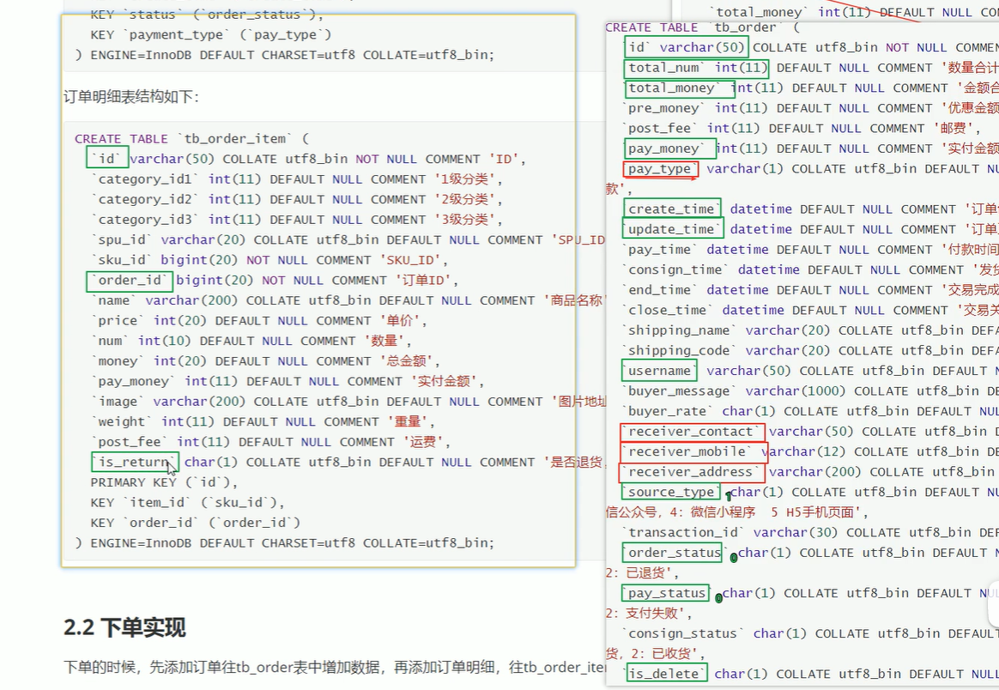
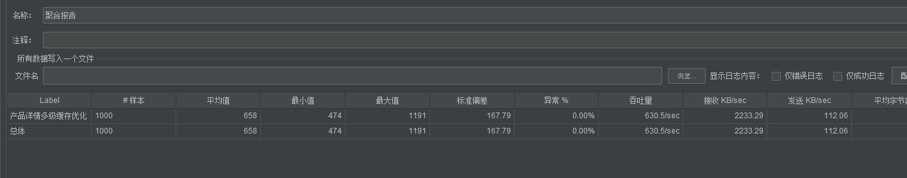
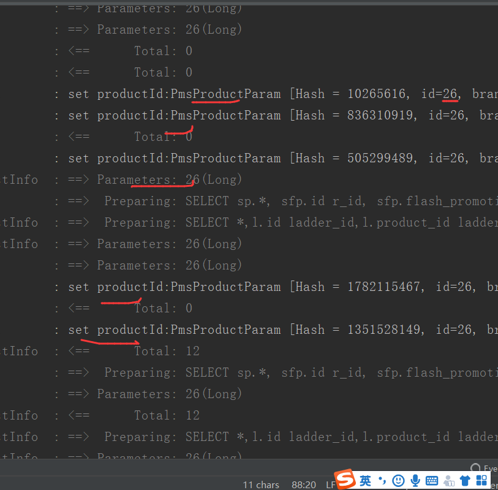
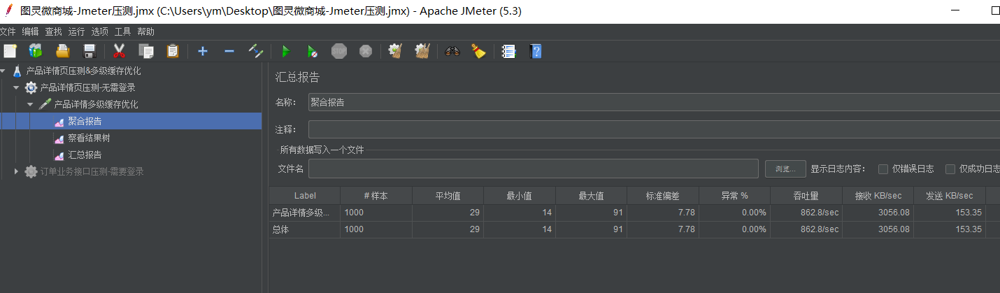

# 项目介绍

前后端分离的网上商城后端微服务项目


# 配置环境与启动项目

## Windows

上传OSS镜像

导入镜像

创建实例

> OSS与导入镜像地域要一致,否则会报invalid错


启动front项目 使用yarn即可 

> 会报找不到Python路径错误
>
> 要提前安装Python2.7 (与项目的构建相关 我也不懂为啥) 然后设置Python路径全局配置
>
> npm config set python "D:\Python27\python.exe"  # 你安装的路径

启动后端项目

确认Maven settings

> 需要将pom里自带的设置Maven的信息注释掉
>
> 出现找不到等报错 可以去找到目标目录删了重新加载

本地域名解析配置

> C:\Windows\System32\drivers\etc
>
> 127.0.0.1 tl.nacos.com  tlshopdb.com  tlshop.com


本机启动nacos

在黑窗体环境下切换目录到nacos/bin下

> startup.cmd -m standalone


配置数据库

> ```xml
> jdbc:mysql://tlshopdb.com:3306/micromall?
> ```
>
> root
>
> 123456

导入数据

> SQL yog 新建同名数据库导入 执行SQL脚本 选择.sql文件执行 即可 速度贼快

## Linux

目的

- 学习docker指令
- linux 实战,熟练掌握linux常用指令
- docker部署各种中间件的一些配置
- 学会在linux跑起来一个项目使用docker
- 探明项目的功能

已配好docker环境

### **MySQL安装**(已经安装好了)

- 下载MySQL5.7的docker镜像：

docker pull mysql:5.7

- 使用如下命令启动MySQL服务：

docker run -p 3306:3306 --name mysql  \ -v /mydata/mysql/log:/var/log/mysql \ -v /mydata/mysql/data:/var/lib/mysql \ -v /mydata/mysql/conf:/etc/mysql \ -e MYSQL_ROOT_PASSWORD=123456  \ -d mysql:5.7

> docker run -p 3306:3306 --name mysql  -v /mydata/mysql/log:/var/log/mysql -v /mydata/mysql/data:/var/lib/mysql  -v /mydata/mysql/conf:/etc/mysql  -e MYSQL_ROOT_PASSWORD=123456   -d mysql:5.7

> docker run -p 3306:3306 --name mysql 

- 参数说明

- - -p 3306:3306：将容器的3306端口映射到主机的3306端口
  - -v /mydata/mysql/conf:/etc/mysql：将配置文件夹挂在到主机
  - -v /mydata/mysql/log:/var/log/mysql：将日志文件夹挂载到主机
  - -v /mydata/mysql/data:/var/lib/mysql/：将数据文件夹挂载到主机
  - -e MYSQL_ROOT_PASSWORD=root：初始化root用户的密码

- 进入运行MySQL的docker容器：

docker exec -it mysql /bin/bash

- 使用MySQL命令打开客户端：

**mysql -uroot -proot --default-character-set=utf8**

- 创建mall数据库：

create database mall character set utf8

- 安装上传下载插件，并将document/sql/mall.sql上传到Linux服务器上：

yum -y install lrzsz

- 将mall.sql文件拷贝到mysql容器的/目录下：

docker cp /mydata/mall.sql mysql:/

- 将sql文件导入到数据库：

use mall; source /mall.sql;

- 创建一个reader:123456帐号并修改权限，使得任何ip都能访问：

grant all privileges on *.* to 'reader' @'%' identified by '123456';

### **Redis安装**

- 下载Redis5.0的docker镜像：

docker pull redis:5

- 使用如下命令启动Redis服务：

docker run -p 6379:6379 --name redis \ -v /mydata/redis/data:/data \ -d redis:5 redis-server --appendonly yes


- 进入Redis容器使用redis-cli命令进行连接：

docker exec -it redis redis-cli

​    

#### redis启动

> redis-server /usr/local/redis-5.0.2/redis.conf
>
> redis-cli
>
> auth 123456

### **Nginx安装**

- 下载Nginx1.10的docker镜像：

docker pull nginx:1.10

- 先运行一次容器（为了拷贝配置文件）：

docker run -p 80:80 --name nginx \ -v /mydata/nginx/html:/usr/share/nginx/html \ -v /mydata/nginx/logs:/var/log/nginx  \ -d nginx:1.10

- 将容器内的配置文件拷贝到指定目录：

docker container cp nginx:/etc/nginx /mydata/nginx/

- 修改文件名称：

mv nginx conf

- 终止并删除容器：

docker stop nginx docker rm nginx

- 使用如下命令启动Nginx服务：

docker run -p 80:80 --name nginx \ -v /mydata/nginx/html:/usr/share/nginx/html \ -v /mydata/nginx/logs:/var/log/nginx  \ -v /mydata/nginx/conf:/etc/nginx \ -d nginx:1.10

默认启动?

怎么查看启动的服务

### **RabbitMQ安装**

- 下载rabbitmq3.7.15的docker镜像：

docker pull rabbitmq:3.7.15

- 使用如下命令启动RabbitMQ服务：

docker run -p 5672:5672 -p 15672:15672 --name rabbitmq  -d rabbitmq:3.7.15

- 进入容器并开启管理功能：

> docker exec -it rabbitmq /bin/bash

>  rabbitmq-plugins enable rabbitmq_management

​    

- 开启防火墙：

firewall-cmd --zone=public --add-port=15672/tcp --permanent firewall-cmd --reload

- 访问地址查看是否安装成功：[http://192.168.3.101:15672](http://192.168.3.101:15672/)

​    

- 输入账号密码并登录：guest guest
- 创建帐号并设置其角色为管理员：mall mall

​    

- 创建一个新的虚拟host为：/mall

​    

- 点击mall用户进入用户配置页面

​    

- 给mall用户配置该虚拟host的权限

​    

### **Elasticsearch安装**

- 下载Elasticsearch7.6.2的docker镜像：

docker pull elasticsearch:7.6.2

- 修改虚拟内存区域大小，否则会因为过小而无法启动:

sysctl -w vm.max_map_count=262144

- 使用如下命令启动Elasticsearch服务：

docker run -p 9200:9200 -p 9300:9300 --name elasticsearch \ -e "discovery.type=single-node" \ -e "cluster.name=elasticsearch" \ -v /mydata/elasticsearch/plugins:/usr/share/elasticsearch/plugins \ -v /mydata/elasticsearch/data:/usr/share/elasticsearch/data \ -d elasticsearch:7.6.2

- 启动时会发现/usr/share/elasticsearch/data目录没有访问权限，只需要修改/mydata/elasticsearch/data目录的权限，再重新启动即可；

chmod 777 /mydata/elasticsearch/data/

- 安装中文分词器IKAnalyzer，并重新启动：

docker exec -it elasticsearch /bin/bash #此命令需要在容器中运行 elasticsearch-plugin install https://github.com/medcl/elasticsearch-analysis-ik/releases/download/v7.6.2/elasticsearch-analysis-ik-7.6.2.zip docker restart elasticsearch

- 开启防火墙：

firewall-cmd --zone=public --add-port=9200/tcp --permanent firewall-cmd --reload

- 访问会返回版本信息：[http://192.168.3.101:9200](http://192.168.3.101:9200/)

​    

### **Logstash安装**

- 下载Logstash7.6.2的docker镜像：

docker pull logstash:7.6.2

- 修改Logstash的配置文件logstash.conf中output节点下的Elasticsearch连接地址为es:9200，配置文件地址：/document/elk/logstash.conf

output {  elasticsearch {    hosts => "es:9200"    index => "mall-%{type}-%{+YYYY.MM.dd}"  } }

- 创建/mydata/logstash目录，并将Logstash的配置文件logstash.conf拷贝到该目录；

mkdir /mydata/logstash

- 使用如下命令启动Logstash服务；

docker run --name logstash -p 4560:4560 -p 4561:4561 -p 4562:4562 -p 4563:4563 \ --link elasticsearch:es \ -v /mydata/logstash/logstash.conf:/usr/share/logstash/pipeline/logstash.conf \ -d logstash:7.6.2

- 进入容器内部，安装json_lines插件。

logstash-plugin install logstash-codec-json_lines

### **Kibana安装**

- 下载Kibana7.6.2的docker镜像：

docker pull kibana:7.6.2

- 使用如下命令启动Kibana服务：

docker run --name kibana -p 5601:5601 \ --link elasticsearch:es \ -e "elasticsearch.hosts=http://es:9200" \ -d kibana:7.6.2

- 开启防火墙：

firewall-cmd --zone=public --add-port=5601/tcp --permanent firewall-cmd --reload

- 访问地址进行测试：[http://192.168.3.101:5601](http://192.168.3.101:5601/)

​    

### **MongoDB安装**

- 下载MongoDB4.2.5的docker镜像：

docker pull mongo:4.2.5

- 使用docker命令启动：

docker run -p 27017:27017 --name mongo \ -v /mydata/mongo/db:/data/db \ -d mongo:4.2.5

**Docker全部环境安装完成**

- 所有下载镜像文件：

REPOSITORY            TAG                 IMAGE ID            CREATED             SIZE redis                 5                   071538dbbd71        2 weeks ago         98.3MB mongo                 4.2.5               fddee5bccba3        3 months ago        388MB logstash              7.6.2               fa5b3b1e9757        4 months ago        813MB kibana                7.6.2               f70986bc5191        4 months ago        1.01GB elasticsearch         7.6.2               f29a1ee41030        4 months ago        791MB rabbitmq              3.7.15-management   6ffc11daa8d0        13 months ago       186MB mysql                 5.7                 7faa3c53e6d6        15 months ago       373MB registry              2                   f32a97de94e1        17 months ago       25.8MB nginx                 1.10                0346349a1a64        3 years ago         182MB java                  8                   d23bdf5b1b1b        3 years ago         643MB

- 所有运行在容器里面的应用：

​    

### **SpringBoot应用部署**

构建所有Docker镜像并上传

- 修改项目根目录下的pom.xml中的docker.host属性：

<properties>    <docker.host>http://192.168.3.101:2375docker.host> properties>

- 如果项目根目录的pom.mxl中docker-maven-plugin的节点被注释掉了就打开注释，使项目在打包时直接构建Docker镜像；

​    

- 直接双击根项目mall的package命令可以一次性打包所有应用的Docker镜像；

​    

REPOSITORY            TAG                 IMAGE ID            CREATED              SIZE mall/mall-portal      1.0-SNAPSHOT        70e0f76416a0        21 seconds ago       705MB mall/mall-search      1.0-SNAPSHOT        f3290bd1d0c7        41 seconds ago       725MB mall/mall-admin       1.0-SNAPSHOT        26557b93a106        About a minute ago   705MB

**部署mall-admin**

docker run -p 8080:8080 --name mall-admin \ --link mysql:db \ --link redis:redis \ -v /etc/localtime:/etc/localtime \ -v /mydata/app/admin/logs:/var/logs \ -d mall/mall-admin:1.0-SNAPSHOT

注意：如果想使用Logstash收集日志的话，需要将应用容器连接到Logstsh，添加如下配置即可；

--link logstash:logstash \

**部署mall-search**

docker run -p 8081:8081 --name mall-search \ --link elasticsearch:es \ --link mysql:db \ -v /etc/localtime:/etc/localtime \ -v /mydata/app/search/logs:/var/logs \ -d mall/mall-search:1.0-SNAPSHOT

**部署mall-port**

docker run -p 8085:8085 --name mall-portal \ --link mysql:db \ --link redis:redis \ --link mongo:mongo \ --link rabbitmq:rabbit \ -v /etc/localtime:/etc/localtime \ -v /mydata/app/portal/logs:/var/logs \ -d mall/mall-portal:1.0-SNAPSHOT

[开启防火墙](http://www.macrozheng.com/#/deploy/mall_deploy_docker?id=开启防火墙)

firewall-cmd --zone=public --add-port=8080/tcp --permanent firewall-cmd --zone=public --add-port=8081/tcp --permanent firewall-cmd --zone=public --add-port=8085/tcp --permanent firewall-cmd --reload

访问接口进行测试

- mall-admin的api接口文档地址：http://192.168.3.101:8080/swagger-ui.html

​    

- mall-search的api接口文档地址：http://192.168.3.101:8081/swagger-ui.html

​    

- mall-portal的api接口文档地址：http://192.168.3.101:8085/swagger-ui.html

​    


### 总结

#### ps

Linux中的ps命令是Process Status的缩写。ps命令用来列出系统中当前运行的那些进程。

ps命令列出的是当前那些进程的快照，就是执行ps命令的那个时刻的那些进程，如果想要动态的显示进程信息，就可以使用top命令。要对进程进行监测和控制，首先必须要了解当前进程的情况，也就是需要查看当前进程，而 ps 命令就是最基本同时也是非常强大的进程查看命令。使用该命令可以确定有哪些进程正在运行和运行的状态、进程是否结束、进程有没有僵死、哪些进程占用了过多的资源等等。总之大部分信息都是可以通过执行该命令得到的。

ps 为我们提供了进程的一次性的查看，它所提供的查看结果并不动态连续的；如果想对进程时间监控，应该用 top 工具。

linux上进程有5种状态


1. 运行(正在运行或在运行队列中等待)

2. 中断(休眠中, 受阻, 在等待某个条件的形成或接受到信号)

3. 不可中断(收到信号不唤醒和不可运行, 进程必须等待直到有中断发生)

4. 僵死(进程已终止, 但进程描述符存在, 直到父进程调用wait4()系统调用后释放)

5. 停止(进程收到SIGSTOP, SIGSTP, SIGTIN, SIGTOU信号后停止运行运行)

ps工具标识进程的5种状态码

D 不可中断 uninterruptible sleep (usually IO)

R 运行 runnable (on run queue)

S 中断 sleeping

T 停止 traced or stopped

Z 僵死 a defunct (”zombie”) process

语法


ps [option]

命令参数

a      显示所有进程

-a     显示同一终端下的所有程序

-A     显示所有进程

c      显示进程的真实名称

-N     反向选择

-e     等于“-A”

e      显示环境变量

f      显示程序间的关系

-H     显示树状结构

r      显示当前终端的进程

T      显示当前终端的所有程序

u      指定用户的所有进程

-au    显示较详细的资讯

-aux   显示所有包含其他使用者的行程

-C<命令>     列出指定命令的状况

--lines<行数>     每页显示的行数

--width<字符数>     每页显示的字符数

--help      显示帮助信息

--version     显示版本显示

部分使用实例


 ps -A           显示所有进程信息
 ps -u root    显示指定用户信息

 ps -ef          显示所有进程信息，连同命令行

 ps -ef | grep ssh    查找特定进程

 ps -l            将目前属于您自己这次登入的 PID 与相关信息列示出来

 ps aux          列出目前所有的正在内存当中的程序

ps -axjf        列出类似程序树的程序显示

ps aux | egrep '(cron|syslog)'       找出与 cron 与 syslog 这两个服务有关的 PID 号码

ps -aux | more      可以用 | 管道和 more 连接起来分页查看

 ps -aux > ps001.txt      把所有进程显示出来，并输出到ps001.txt文件

 ps -o pid,ppid,pgrp,session,tpgid,comm      输出指定的字段


F 代表这个程序的旗标 (flag)， 4 代表使用者为 super user

S 代表这个程序的状态 (STAT)，关于各 STAT 的意义将在内文介绍

UID 程序被该 UID 所拥有

PID 就是这个程序的 ID ！

PPID 则是其上级父程序的ID

**C CPU 使用的资源百分比**

PRI 这个是 Priority (优先执行序) 的缩写，详细后面介绍

NI 这个是 Nice 值，在下一小节我们会持续介绍

ADDR 这个是 kernel function，指出该程序在内存的那个部分。如果是个 running的程序，一般就是 "-"

SZ 使用掉的内存大小

WCHAN 目前这个程序是否正在运作当中，若为 - 表示正在运作

TTY 登入者的终端机位置

**TIME 使用掉的 CPU 时间。**

CMD 所下达的指令为何在预设的情况下， ps 仅会列出与目前所在的 bash shell 有关的 PID 而已，所以， 当我使用 ps -l 的时候，只有三个 PID。

USER：该 process 属于那个使用者账号的

PID ：该 process 的号码

%CPU：该 process 使用掉的 CPU 资源百分比

%MEM：该 process 所占用的物理内存百分比

VSZ ：该 process 使用掉的虚拟内存量 (Kbytes)

RSS ：该 process 占用的固定的内存量 (Kbytes)

STIME 启动时间

**TTY ：该 process 是在那个终端机上面运作，若与终端机无关，则显示 ?，另外， tty1-tty6 是本机上面的登入者程序，若为 pts/0 等等的，则表示为由网络连接进主机的程序。**

STAT：该程序目前的状态，主要的状态有

R ：该程序目前正在运作，或者是可被运作

S ：该程序目前正在睡眠当中 (可说是 idle 状态)，但可被某些讯号 (signal) 唤醒。

T ：该程序目前正在侦测或者是停止了

Z ：该程序应该已经终止，但是其父程序却无法正常的终止他，造成 zombie (疆尸) 程序的状态

START：该 process 被触发启动的时间

TIME ：**该 process 实际使用 CPU 运作的时间**

COMMAND：该程序的实际指令


ps -ef
UID          PID    PPID  C STIME TTY          TIME CMD

​										

#### docker run 

 --name="容器新名字"    为容器指定一个名称；

-d: 后台运行容器并返回容器ID，也即启动守护式容器(后台运行)；

 

-i：以交互模式运行容器，通常与 -t 同时使用；

-t：为容器重新分配一个伪输入终端，通常与 -i 同时使用；

也即启动交互式容器(前台有伪终端，等待交互)；

 

-P: 随机端口映射，大写P

-p: 指定端口映射，小写p

#### docker exec

docker exec [OPTIONS]  容器名称 COMMAND [ARG...]
OPTIONS说明：

-d，以后台方式执行命令；

-e，设置环境变量

-i，交互模式

-t，设置TTY

-u，用户名或UID，例如myuser:myusergroup


通常COMMAND只能是一条语句，为了支持多个命令的执行，需要将多个命令连接起来交给Shell，docker exec命令的使用示例如下：

sudo docker exec myContainer bash -c "cd /home/myuser/myproject && git fetch ssh://gerrit_server:29418/myparent/myproject ${GERRIT_REFSPEC} && git checkout FETCH_HEAD";
sudo docker exec myContainer bash -c "cd /home/myuser/myproject;git fetch ssh://gerrit_server:29418/myparent/myproject ${GERRIT_REFSPEC};git checkout FETCH_HEAD";

注意：对于已经暂停或停止了的容器，无法执行docker exec命令，如下将抛出异常：

docker pause myContainer 
docker exec myContainer ...

options    作用

-d    在后台运行命令
-i    即使没有附加也保持 STDIN 打开
-t    设置TTY
进入容器的 CLI 模式

-e    设置环境变量
-w    需要执行命令的目录
-u    指定访问容器的用户名
备注：其实还有几个 options，但是目前还没用到，要用的时候再写吧

实际栗子
执行 tomcat 容器的 startup.sh 脚本

docker exec -it tomcat7 startup.sh
进入容器的 CLI 模式(最常用)

docker exec -it tomcat7 bash
执行普通命令

docker exec -it tomcat7 pwd

指定工作目录执行命令

docker exec -it -w /usr tomcat7 pwd

以 root 用户身份进入容器(重点)

docker exec -it -uroot jenkins1 bash


#### linux入门："\"的作用


运行cellranger count，发现每行末尾有个\，遂查了下\的作用


```jsx
cellranger count --id=XPBShm \
 --transcriptome=/home/rstudio/opt/refdata-gex-GRCh38-and-mm10-2020-A \
 --fastqs=/home/rstudio/data/rawx/xpbs \
 --sample=XPBS \
 --r1-length 26 \
 --r2-length 98
```

作用有2

##### 1 作为转义符

反斜线符号“ \ ”在Bash中被解释为转义字符，用于去除一个单个字符的特殊意义，它保留了跟随在之后的字符的字面值，除了换行符（\n,\r）。

如果在反斜线之后一个换行字符立即出现，转义字符使行 得以继续，但是换行字符后必须紧跟命令，不能出现空格，遇到命令很长时使用反斜线很有效。

例一：


```ruby
[linux@linux ~]$ echo $HOME
/home/
[linux@linux ~]$ echo \$HOME
$HOME
```

例子中，反斜线去除了“ $ ”字符的特殊意义，保留字面值，从而不输出home目录路径。

##### 2. 作为换行符

例二：


```bash
export PATH=\

/bin:\
/sbin:\
/usr/bin:\
/usr/sbin:\
/usr/local/bin:\
/apps/bin:\
/apps/tools:\
/apps/tslib/bin\
```

例子中，反斜线使行得以继续，命令可以正常输入。

例二（反）


```bash
export PATH=\

  /bin:\
  /sbin:\
  /usr/bin:\
  /usr/sbin:\
  /usr/local/bin:\
  /apps/bin:\
  /apps/tools:\
  /apps/tslib/bin\
```

例子中就会出现错误：

/bin:: bad variable name/* /bin：错误变量名 */

因为在"+换行符"之后必须紧跟命令，不能有空格。


# 笔记

## 订单表设计

订单信息表

> 订单ID
>
> 数量合计
>
> 金额合计
>
> 用户名
>
> 收货人姓名
>
> 收货人地址
>
> 收货人电话
>
> 支付状态
>
> 订单状态
>
> 订单创建时间
>
> 订单更新时间

订单详情表

> 多级category
>
> spu
>
> sku
>
> 订单ID
>
> 商品名称
>
> 单价
>
> 数量
>
> 



DevOps： DevOps的意思就是开发和运维不再是分开的两个团队，而是你中有我，我中有 你的一个团队。我们现在开发和运维已经是一个团队了，但是运维方面的知识和 经验还需要持续提高。

持续交付： 持续交付的意思就是在不影响用户使用服务的前提下频繁把新功能发布给用户使用，要做到 这点非常非常难。我们现在两周一个版本，每次上线之后都会给不同的用户造成不同程度的 影响。 

容器化： 容器化的好处在于运维的时候不需要再关心每个服务所使用的技术栈了，每个服务都被无差 别地封装在容器里，可以被无差别地管理和维护，现在比较流行的工具是docker和k8s。 所以你也可以简单地把云原生理解为：云原生 = 微服务 + DevOps + 持续交付 + 容器化

## **商品模块业务场景介绍：**

 商品模块业务详解

​    

​    

​    

## **表的设计：打开游览器访问京东详细页**

**问题：**

  商品这块的数据库如何更好的设计，商品详细页显示这么多信息，是一张表还是多张表更好了？

这个问题到底是一张表还是多张表，我们判断依据是什么？我们判断商品详细页里面显示的这些信息他们的关系。通过他们的关系，我们才能知道到底是设计一张表还是多张表。

**一张表：**

如果是一张表存储所有数据的话，那么查询是非常方便的，这是其优点，但是你会发现存储的时候是不是很麻烦。不通类型不同大小不通商品等等都不一样，那这样的一张表设计起来实在是太复杂了。

**多张表：**

如果是多张表的话业务更加清晰，维护起来也更加方便，但是你会发现查询好像会非常的复杂，一个商品页面我们需要查很多的表和数据。

**解决**

我们正确的方式是根据不同的数据类型按不通的表进行存储


商品表的设计在设计这个表的时候，嗯，会画出它的实体关系图。嗯那你设计一张表的时候，你的查询十分方便，但是你的你设计这个表会很复杂，就是想要把各种各种情况，各种类型全部囊括进来，十分负责，所以选择按根据不同的类型。去跟显示不同的表进行存储。嗯商品有不同类型，就比如有吃的，穿的。还有其他用的。就可以根据分类来划分我们的礼品商品。嗯

## **需求分析**

**为什么商品需要分类？**

我们知道商品是有不通类型的，比如有吃的 比如有穿的比如还有其他的用的。不通的商品用途不一样。我们一开始就可以按分类来进行划分我们的商品，这个就有点像我们去看论坛的分类是一样的。

**第一个版本：商品+分类**

​    

**问题：此时有什么问题？：**

目前这个方案有什么问题了？我们慢慢发现一个问题，只有分类并不能适应所有的需求，比如nike鞋和nikeT恤，用户可能希望先看nike的所有商品，这个模型就不能满足。我们想在这个关系中，加入“品牌”概念

但是只有分类的时候并不能适应所有的需求，你只是比如说耐克鞋，耐克T恤，用户希望能先看耐克的所有商品，这个模型就不能满足，只要在加入品牌的概念。这样基本用户可以在通过分类或者品牌找到自己想要的商品。

**第二个版本：商品+分类+品牌**

​    

这样基本用户可以在首页上通过分类或者品牌找到自己想要的商品，也可以直接查看热门的商品和新上架的商品。

**问题：此时有什么问题？**

但是问题也来了，用户在进入分类后，展示在用户面前的是很多很多商品，用户希望再通过筛选查询出更接近他目标的商品？

> 用户在进入分类之后展示在湖面前的是很多很多商品，用户希望通过筛选查询出更接近他目标的商品。其实就加入了属性。比如说图案呀！嗯，之类的。

​    

**加入属性：**

于是优秀的产品设计师，设计出了类似这样的UI：

​    

​    

**第三个版本：商品+分类+品牌+属性**

 用户可以通过这些筛选条件进一步缩小自己的目标范围，那么问题又来了，这样的产品需求排在程序员面前，怎么去实现它？经过分析，我们找出了一个方法，我们知道商品之间的属性可能存在着较大的差别，比如牛仔裤它有版型、腰型、裤长等属性；而电脑它有CPU、显卡等属性，各类商品的属性是不同的。再进一步想，休闲裤也版型、腰型、裤长等属性；台式电脑或者笔记本电脑都有CPU、显卡等属性。所以我们得出：**一个分类对应若干属性，而一个属性，对应若干属性选项**，而一个具体商品又对应若干属性选项（例如具体一条牛仔裤，他的裤长：7分，裤型：直筒）。有点绕，仔细品味一下。

> 通过分类与品牌查询到相关的商品，再根据属性嗯，在写。来进一步缩小范围，比如牛仔裤，它有版型，腰型，裤长等属性，而电脑有CPU，显卡的出现。一个分类对应若干属性来一个性对应若干属性选项。一个具体商品有对应活该属性决定。各分类对应若干属性，一个属性对应若干属性选项。一个具体商品有对应若干属性选项。月底一条牛仔裤，它的裤长裤型的。


​    

 从图上可以看出，分类和属性的关系（例如：“牛仔裤”分类下有裤型、裤长、版型等属性）、属性和属性选项的关系（例如：裤长属性有长款、九分裤、七分裤的选项）、商品和属性选项的关系（例如某条牛仔裤的裤长是7分裤）。至此，我们知道一个商品的分类、品牌以及它有什么属性和对应的属性值。那么通过筛选条件，自然就可以查询出指定的商品。这里特别说一句，价格也是属性，不要设想用商品表中的价格字段去做计算。这不利于查询也增加了复杂度，让商家编辑人员用属性来设置并保证他的正确性。

​    

​    

这个页面展示商品的所有信息，按照之前的设计好像都可以满足。但是我们似乎感觉错过了什么，在图上右边我们发现该商品当前的颜色和尺寸，并且允许用户可以选择其他的颜色和尺寸。这给我们带来了疑惑，这里的“颜色”和“尺寸”是什么，一件商品的不同颜色不同尺寸是算一个商品还是多个商品。

> 

​    

**为什么要加入规格：**

**第四个版本：商品+分类+品牌+属性+规格**

经过思考后，我们发现我们混淆了两个概念——“商品”和“货品”。不同规格的货品作为独立的商品。比如一条裤子的有L尺寸、M尺寸、一个U盘有16G还是32G的，都是同样的货品，不同规格的商品。可以认为货品和商品是一对多的关系。弄清了这个概念，处理这个需求就容易多了，这里的“颜色”、“尺寸”我们就作为“规格”来处理，而红色、黑色；L号、M号我们视为规格的选项或者说规格值。一件货品对应若干规格，而具有某一规格值的货品就是商品。

spu：iphone12  sku：金色64 iphone12

​    

 好了，现在好像差不多了。基于这个模型可以满足基本的商品搜索、展示的需求。搜索引擎也可以根据这个模型数据生成对应的商品索引，达到准确搜索的目的。商品模块还会和其他模块一起协作，比如用户系统、订单系统、支付系统等。一般情况下我们会把商品业务独立出来做成“商品中心”的服务，集中处理商品查询、更新、发布等业务，支撑其他业务。

​    \

> 嗯，总结商品表的设计，商品表的设计主要是根据呃，用户对商品进行搜索，并且商家对用户对商家对商品进行展示来设计的。首先你用户想搜索到商品它需要进行分类查询，就是会有衣服啊，电子商品啊这种。设计成一个分类，那么在分类之后你还嗯会显示态度很还是是太多，还是需要进行一些区分？嗯，就比如说你的需求是只查看特步的。鞋子啊，或者特步的特步鞋或者特步。特步的衣服，然后就是你需要加还有品牌的概念。然后用户再去根据分类还有品牌来缩小它的具体范围。但是这样还是有很多的，很多的区分就比如说你需要嗯，你是你需要看他的具体的属性就是如何一个牛仔裤它的裤长。裤长，腰宽这种属性，这个属性呢是跟它的分类挂钩的，比如说你的裤子它就是一个就能把它的属性选项给出来。然后

> 嗯，表的设计，表的设计主要是基于用户的搜索需求与商家的展示需求来进行设计。嗯比较重要的有五张表，然后其他还有一些。关联表啊，一些这种就这种关系表，嗯，比较重要的就是你首先要有一个商品表就是你对，但是你的商品会十分复杂，你就要把它拆分成分类，就是你一个啊，不对。商品货品
>
> 就是分类和品牌之后你可以添加，你可以根据商品的属性再进行搜索，就比如说你的CPU，CPU，CPU型号呀，机身内存呀这些对应，然后每一个，每一个这些属性要对应着每一个属性选项。嗯，属性之后呢你对应的属性选项就比如说16G呀，那机身内存16G这些。但是你在真正的我看看去

**商品的搜索：**

​    搜索引擎elasticsearch

**商品的展示：**

## **三、商品模块展示技术难点**

商品详情页是展示商品详细信息的一个页面，承载在网站的大部分流量和订单的入口。京东商城目前有通用版、全球购、闪购、易车、惠买车、服装、拼购、今日抄底等许多套模板。各套模板的元数据是一样的，只是展示方式不一样。目前商品详情页个性化需求非常多，数据来源也是非常多的，而且许多基础服务做不了的都放我们这，因此我们需要一种架构能快速响应和优雅的解决这些需求问题。因此我们重新设计了商品详情页的架构，主要包括三部分：**商品详情页系统**、**商品详情页统一服务系统**和**商品详情页动态服务系统**；**商品详情页系统负责静的部分**，而**统一服务负责动**的部分，而**动态服务负责给内网其他系统提供一些数据服务**。

​    

**商品详情页前端结构**

前端展示可以分为这么几个维度：商品维度(标题、图片、属性等)、主商品维度（商品介绍、规格参数）、分类维度、商家维度、店铺维度等；另外还有一些实时性要求比较高的如实时价格、实时促销、广告词、配送至、预售等是通过异步加载。

​    

​    

SPU： Standard Product Unit （标准化产品单元）,SPU是商品信息聚合的最小单位，是一组可复用、易检索的标准化信息的集合，该集合描述了一个产品的特性。

SKU： Stock keeping unit(库存量单位) SKU即库存进出计量的单位（买家购买、商家进货、供应商备货、工厂生产都是依据SKU进行的），在服装、鞋类商品中使用最多最普遍。 例如纺织品中一个SKU通常表示：规格、颜色、款式。SKU是物理上不可分割的最小存货单元。

**单品页流量特点**

热点少，各种爬虫、比价软件抓取。

**静态处理**

thymeleaf等模板引擎

## **架构方案的问题：**

### **问题一：**

我们知道数据新增分:增量和全量数据

如果后台的小二新增了很多的商品，那我们都要对这些商品进行静态化，但是现在有个问题。那这些数据如何同步了？这是一个新增商品同步的问题，那这个问题怎么解决比较好了？。

​    

不同应用部署在不同服务器甚至在不同的机房不同的国家。

**1、通过网络同步的方式**  就是其中一台服务器静态化之后，然后把文件同步到其他应用服务器上去。比如我们的linux命令scp方式。这种方式虽然可行，但是我们发现问题还是蛮多的，有多少个节点就需要同步多少份，等于是商品的数量*服务器的应用数数。很显然这种办法不是最优的解决办法

如果上述办法无法解决，那我们就用另外的方案，同学们你们觉得还有其他的方案没有？

**2、定时任务:**可以在某个应用用一个定时任务，然后分别去执行数据库需要静态化的数据即可，可以解决上述1数据同步的问题，因为所有的任务都是在本机运行，就不需要数据同步了。但是也有一个问题。就是如何避免不通的机器跑的数据不要重复，也就是A和B定时任务都跑了一份商品。这个是这种方案需要解决的。（比较直观的就是上锁）

**3、消息中间件：**还有一种办法就是通过消息中间件来解决。订阅topic然后生成当前服务器静态化的页面。

### **问题二：**

我们的freemark它是数据要事先按我这个模板生产好的，那就是说一定你改了模板，如果要生效的话，需要重新在把数据取出来和我们这个模板进行匹配生产更多的的静态html文件。那这是一个比较大的问题

如果后台数据有变更呢?如何及时同步到其它服务端?

如果页面静态化了，我们搜索打开一个商品详细页，怎么知道要我需要的访问的静态页面？

万一我们模板需要修改了怎么办？

牵一发动全身。


​       **3.1、压测测试**

jmeter模板

​    

1、换数据库

2、分库分表

**3.2、后台**

 ```java
/**
 * 获取商品详情信息
 *
 * @param id 产品ID
 */
public PmsProductParam getProductInfo(Long id) {
   PmsProductParam productInfo = portalProductDao.getProductInfo(id);
    if (null == productInfo) {
        return null;
    }
    FlashPromotionParam promotion = flashPromotionProductDao.getFlashPromotion(id);
    if (!ObjectUtils.isEmpty(promotion)) {
        productInfo.setFlashPromotionCount(promotion.getRelation().get(0).getFlashPromotionCount());
        productInfo.setFlashPromotionLimit(promotion.getRelation().get(0).getFlashPromotionLimit());
        productInfo.setFlashPromotionPrice(promotion.getRelation().get(0).getFlashPromotionPrice());
        productInfo.setFlashPromotionRelationId(promotion.getRelation().get(0).getId());
        productInfo.setFlashPromotionEndDate(promotion.getEndDate());
        productInfo.setFlashPromotionStartDate(promotion.getStartDate());
        productInfo.setFlashPromotionStatus(promotion.getStatus());
    }
    return productInfo;
}
 ```

   

  **压测结果：**

5000并发

​    

### **后台优化：**

**redis缓存：**

redis设置：RedisConifg》RedisOpsUtil

```java
/**
 * 获取商品详情信息
 *
 * @param id 产品ID
 */
public PmsProductParam getProductInfo(Long id) {
    PmsProductParam productInfo = null;
    //从缓存Redis里找
    productInfo = redisOpsUtil.get(RedisKeyPrefixConst.PRODUCT_DETAIL_CACHE + id, PmsProductParam.class);
    if(null!=productInfo){
        return productInfo;
    }
    productInfo = portalProductDao.getProductInfo(id);
    if (null==productInfo) {
        log.warn("没有查询到商品信息,id:"+id);
        return null;
    }
    FlashPromotionParam promotion = flashPromotionProductDao.getFlashPromotion(id);
    if (!ObjectUtils.isEmpty(promotion)) {
        productInfo.setFlashPromotionCount(promotion.getRelation().get(0).getFlashPromotionCount());
        productInfo.setFlashPromotionLimit(promotion.getRelation().get(0).getFlashPromotionLimit());
        productInfo.setFlashPromotionPrice(promotion.getRelation().get(0).getFlashPromotionPrice());
        productInfo.setFlashPromotionRelationId(promotion.getRelation().get(0).getId());
        productInfo.setFlashPromotionEndDate(promotion.getEndDate());
        productInfo.setFlashPromotionStartDate(promotion.getStartDate());
        productInfo.setFlashPromotionStatus(promotion.getStatus());
    }
    redisOpsUtil.set(RedisKeyPrefixConst.PRODUCT_DETAIL_CACHE + id, productInfo, 3600, TimeUnit.SECONDS);
    return productInfo;
}

```

 

**好处：**

加入redis之后我们发现提高了可以把之前请求 数据库查询的商品都缓存到redis中，通过对redis的访问来减少对数据里的依赖，减少了依赖本质就是减少了磁盘IO。

### **问题：**

提高请求的吞吐量，除了减少磁盘IO，还有网络IO，我们可以发现，请求redis其实也会涉及到网络IO，我们所有的请求都要走xxx端口号。那有没有更好的优化思路了，来同学们你们鲜花在哪儿？


## 读多写少

有两种：

1、最终一致性方案：

设置超时时间来解决

​                redisOpsUtil.set(RedisKeyPrefixConst.PRODUCT_DETAIL_CACHE+id,productInfo,360,TimeUnit.SECONDS);              

2、实时一致性方案：

​      课程讲到 交易canal binlog

两个问题(高并发)、压缩的问题》减少内存




**现在有什么问题了？**



跟我们预期只set一次redis 是有出入，为何会这样子了？**并发问题**

当我第二次再去访问，此时此刻没有日志输出，说明全部走了缓存：

并发问题：并发编程》并发问题》锁的方式来实现 java并发 加锁方式（不适合》特殊》分布式）

分布式锁：redis、zookeeper



QPS立马就提高了很多。

**加入分布式锁:

```xml
<!--加入redisson-->
<dependency>
    <groupId>org.redisson</groupId>
    <artifactId>redisson</artifactId>
    <version>3.6.5</version>
</dependency>
```

setnx

**缓存应用场景：**

1、访问量大、QPS高、更新频率不是很高的业务

2、数据一致性要求不高


**缓存和数据库双写一致性问题：**

一致性问题是分布式常见问题，还可以再分为最终一致性和强一致性。数据库和缓存双写，就必然会存在不一致的问题。

答这个问题，先明白一个前提。就是如果对数据有强一致性要求，不能放缓存。

我们所做的一切，只能保证最终一致性。另外，我们所做的方案其实从根本上来说，只能说降低不一致发生的概率，无法完全避免。因此，有强一致性要求的数据，不能放缓存。

zk>临时顺序节点》原子性 线程创建如果可以创建成功，是否第一个 拿到了锁 

## 秒杀


****

保证幂等性: 唯一标识, 已经处理过了利用 Redis，用 orderId 作为唯一键。只有成功插入这个支付流水，才可以执行实际的支付扣款。

不要过早的优化

熟悉秒杀系统的业务和技术核心点、以及流程等

高并发: 

项目优化

并发导致数据不一致 库存扣减  数据库 select for update 悲观锁 尽量走索引 扫过的记录都会加锁 -> 乐观锁cas

高请求量 大量请求数据库受不了: 库存放到redis中 有库存才能下单, 问题: 各个项目查到的 redis缓存是本地的, 同步采用ZK一旦数据更改采用通知

异步下单: 采用MQ分流, 业务解耦, 天然排队

取消订单: 延迟消息, MQ生产端 重试, 服务端持久化, 主从同步,   

重复消费: 重复问题. 幂等性问题

限流 基于压测并发数限流, 处理异常快速失败, 防止拖垮

分布式事务:  XA有一个协调者 所有参与者都成够才提交事务 否则回滚 性能低

​						本地消息表: 消息生产方维护消息表记录消息状态, 消息经过MQ发送 如果发送失败进行重试, 消费方收到消息后做自己的本地事务, 失败则会通知生产方回滚,需定时扫描本地消息表, 把未处理完或失败在发送, 需要靠谱的对账补账逻辑

​						MQ事务消息

​						Seata 补偿事务


**秒杀系统设计**

分两部分内容；秒杀业务设计和秒杀技术实现。

秒杀场景下如何进行限流。 今天要做的内容： 

解决的问题：1、在秒杀页面，客户点击秒杀后，在前台弹出一个验证码，需要用户 输入验证码才能往后端发送请求，这样能够错开秒杀下单的时间。 

2、通过验证码，对后台下单请求进行保护，防止刷单，即绕开前端，直接往后端发 送请求。 在秒杀页面开始秒杀后，客户点击秒杀按钮，要在前台弹出一个验证 码，需要用户输入验证码才能往后端发请求，这样能够错开秒杀下单时 间。 

在我们的实现中，是要将memberId、producrId和验证码的值一起传入 后台，后台返回一个token。然后再根据这个tokne拼接一个后台秒杀地 址。

这个token会存入到redis中。实际秒杀时，会增加一个判断，检测 这个token是不是在redis中存在。如果不存在，就是机器刷单 、

电商项目中秒杀的实现流程 1、在tmll-admin中添加秒杀活动，在秒杀活动中先设置活动的开始日期和结束日期，然后添加商品。 这个秒杀活动信息会保存到mysql中。sms_flash_promotion_product_relation 表。 

同时，添加商品后会将活动商品保存到ZK中。(路 径/ZkLock/load_db/{productId})。然后，当访问到商城前端商品页时， http://lo calhost:8080/#/product/{productId}，会检查Redis中的产品信息缓存。如果 Redis中没有产品信息，就会重建Redis缓存。key为product:detail:cache:{ProdId} 然后进入商城的单品页 http://localhost:8080/#/product/32 ， 

product.vue 那个"立即购买"的按钮就会变成"立即秒杀" 点击立即秒杀就会进入秒杀页。

secKillDetail.vue 代码实现机制： 1、从Redis判断商品是否有秒杀活动。 一个商品要么就只能秒杀，要么就只能普通购买，这样是否合理？ 这就是为什么要单独独立出一套秒杀服务集群。 

2、发送后台请求申请验证码。后台返回验证码图片，并将验证码的计算结果保存 到Redis。 验证码的请求路径里header里的memeberId是怎么进去的。有什么用？ 生成验证码图片的这个请求要怎么防刷？

 3、保护后台请求接口。 输入验证码后，先验证输入的验证码结果，返回一个Token。这个Token会传 入到接下来的商品确认页面，同时会保存到Redis当中，表示当前用户有购买秒杀商 品的资格。有效期300秒，300秒内必须完成下单，否则就要重新申请秒杀资格。 

在后续的下单过程中，需要传入这个Token才能正常下单。 验证码如果输入错误，是如何判断的？

我们天天都在说三高，高并发、高可用、高可扩展，那到底应该如何去落地一个三 高的设计方案？ 构建大并发、高性能、高可用系统中几种通用的优化思路，可以抽象总结为“4 要 1 不要”原则。也就是：数据要尽量少、请求数要尽量少、路径要尽量短、依赖要尽量少，以及不要有单点。当然，这几点是你要努力的方向，具体操作时还是要密切 结合实际的场景和具体条件来进行。 

针对秒杀这个场景，其实方案设计往往比技术细节更为重要。因为你可以想象，每 一个秒杀环节的经典问题，都意味着互联网的秒杀业务出现过大的问题，这都是实 打实买来的教训。发现了问题之后才会有针对性的方案设计。那现在，我们整体来 回顾下电商的秒杀限流方案。 

错峰1：动静分离的本质是将包含浏览者信息的动态数据和不包含浏览者信息的静态资源区分开。例如在商品单品页，商品信息是不包含浏览者信息的，这部分就可以抽象出静态资源。而用户登录状态、cookie等这些动态数据也尽可能缓存起来，并且使缓存能够离用户更近。 

错峰2：秒杀答题的形式可以是多种多样的，目的是防止机器刷单，以及错开用户的下单时长。在秒杀场景下，答题速度靠后的请求自然就没有库存了，也可以减少系 统的请求量。 

错峰3：缓存的作用主要有两个，一是快速扣减库存，保护数据库流量，并且库存扣减完成后，快速通知Nginx，屏蔽后续请求；二是提前识别热点数据，并且针对热点数据提供优化处理。处理的方案主要是三个，一是优化，二是限制，三是隔离， 包括业务隔离、系统隔离、数据隔离。 

错峰4：单独提供秒杀服务集群，有利于减少秒杀商品的超大流量对普通商品的性能 冲击，不要让1%的商品影响到另外的99%。 后台错峰：这一部分是我们实战课程的重点。

首先想到的是使用MQ进行削峰。但是实际上，后端需要考虑的三高问题也远不止 MQ削峰这一步。每一个环节都需要考虑后端组件是否能够承载得住。例如秒杀服务集群，到底应该部署多大的集群？部署多少台机器呢？显然为了顶住秒杀的大流 量，秒杀集群就需要部署得非常大。但是，如果在大部分没有秒杀服务的时间内， 这个集群的资源就闲置得非常厉害。所以，虚拟化+云计算进行弹性部署也是非常重要的。在我们的项目实战课后面就会由诸葛老师给大家带来k8s和云部署的实战课程。 然后：在后端系统中，添加了Redis、MQ这样的一些中间产品。而这些产品集群本身，也存在效率低下、服务崩溃的风险。这样也就给系统整体带来了更多的风险点。那要怎么去屏蔽这些产品给系统带来的风险呢？

题外话 方案优先 > 技术优先。学习技术的同时，都要增加对软件问题的思考，很多同学 技术学得很快，但是缺乏思考。秒杀这种超大并发场景下的限流问题，不是任何一 个技术或者任何一个步骤可以限制住的，需要一个完整全面的方案才能保证业务稳定性。

例如针对前端验证问题，还有哪些优化方案？ 提前发Token。可以在秒杀前设置一个预约活动。 在活动中提前发放 token。例如一个秒杀活动有20W个商品，那就可以预先准备200W个 token。用户进行预约时，只发放200W个Token，其他人也能预约成功，但是其实没有获得token，那后面的秒杀，直接通过这个token就可 以过滤掉一大部分人。相当于没有token的人都只预约了个寂寞。这也是 互联网常用的一个套路。 

例如针对超卖问题，在之前的课程中，介绍了如何使用Redis分布式锁防超卖。针对同一个商品ID，使用一把分布式锁，确实可以很快很方便的 处理超卖问题。但是如果同时进行秒杀的商品多了呢？像京东、淘宝一 场大型的秒杀活动，同时有成千上万个商品要进行秒杀，那就意味着同 一时间Redis上锁解锁的操作会要执行成千上万次，这对Redis的性能消耗是相当巨大的，Redis就有可能升级成为新的性能瓶颈。这时该怎么 办？ 当然具体问题的解决方案从来不止一个，这里我们可以选择一种返璞归真的方案，把秒杀超卖的问题从分布式降级到本地JVM中，来获取极限性能。例如将秒杀服务接入配置中心，然后在秒杀服务开始前，由配置 中心给每个应用服务实例下发一个库存数量。然后每次下单，每个服务 器只管自己的库存数量，与其他应用服务器完全不进行库存同步，在各自的内存里扣减库存，这样就不会有超卖的情况发生。减少了网络消 耗，性能也能够进一步提升。 

这种方案可不可行呢？当然也会有一些问题需要去处理。有可能某给服 务器上的库存很快消耗完了，而其他的服务器上仍有库存。整个服务就会表现为你抢不到商品，但是在你后面抢商品的人却能抢到商品。(你们 在参与秒杀时有没有过这样的经历？)但是这在秒杀这种场景下，完全是可以接受的。另外，如果某一个应用服务器挂了，那给他分配的库存就会丢失。这时候又要怎么办？其实也没必要再去设置什么复杂的逻辑， 大不了少卖一点出去。反正都是售罄了，全卖完了，和卖了99%，其实 没什么区别。这时只需要统计好订单的数量(可以通过MQ来统计，也可 以通过Redis统计)，等秒杀活动的30分钟等待支付期过去后，再将没卖出去的库存重新丢回库存池，与没有付款而被取消的订单商品一起返场 售卖就可以了。这也是很多互联网公司目前采用的方案。 最后虽然我们是后台开发工程师，但是前端也必须要有所了解。今天我们关注的 这个问题，也不能只关注后端，需要前后端一起才能理解他的作用。