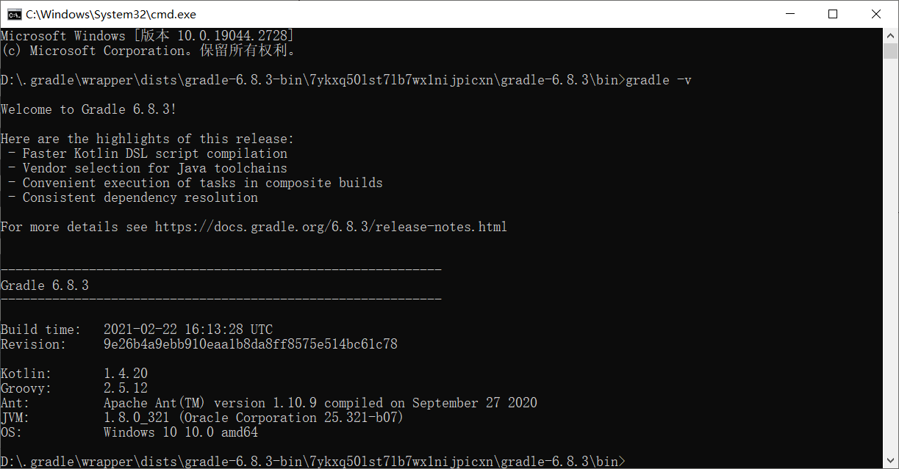
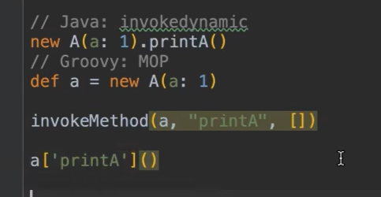
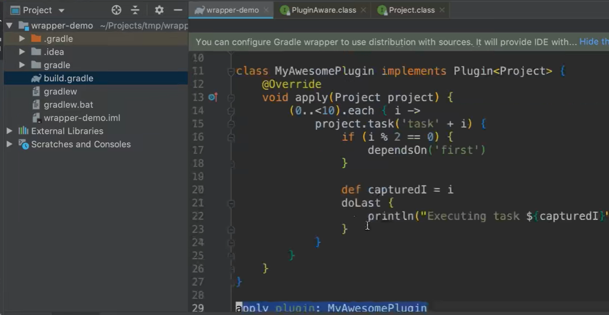
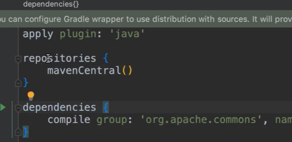
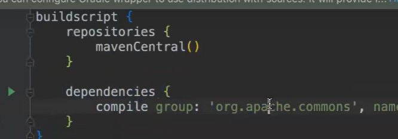

# gradle


## distribution(发行版本)


## Wrapper

用于保证项目迁移之后有同一个gradle版本的环境,  他会帮弄好环境

## GradleUserHome 在IDEA中配置 .gradle文件

.gradle中包含了gradle版本

> 

cache 类似.m2(本地构建) 但还会存储别的

## Daemon 

Maven每次启动JVM而gradle是每次启动一个clientJVM很小, 而daemon则常驻内存一直是热的,默认三小时后注销daemon, 也可启动时添加参数no daemon 3.0之前CI使用 daemon,4.0之后不用no daemon

## Grovvy



闭包: 

## gradle生命周期

初始化阶段

配置阶段

​	将gradle的中语句全部执行 

运行阶段

## 编写插件



apply的时候就是执行了一个方法



这些都是方法的调用

compile作用域:  构建工程的JVM的classpath(要想在build.gradle看下面1-1解释,buildSrc), 和真实项目的JVMclasspath(compile即可)

> 
>
> 1-1

## Gradl

5.0以上添加lombok

```groovy
plugins {
    id 'java'
}

group 'org.springframework'
version '5.3.5-SNAPSHOT'

repositories {
    mavenCentral()
}

dependencies {
    compile(project(":spring-context"))
    compile(project(":spring-aspects"))  //引入aop&切面模块
//    compile(project(":spring-jdbc")) //引入事务
//    // https://mvnrepository.com/artifact/mysql/mysql-connector-java
//    implementation group: 'mysql', name: 'mysql-connector-java', version: '5.1.49'
    testImplementation 'org.junit.jupiter:junit-jupiter-api:5.6.0'
    testRuntimeOnly 'org.junit.jupiter:junit-jupiter-engine'
    compileOnly 'org.projectlombok:lombok:1.18.20'
    annotationProcessor 'org.projectlombok:lombok:1.18.20'
    testCompileOnly 'org.projectlombok:lombok:1.18.20'
    testAnnotationProcessor 'org.projectlombok:lombok:1.18.20'
}

test {
    useJUnitPlatform()
}
```

