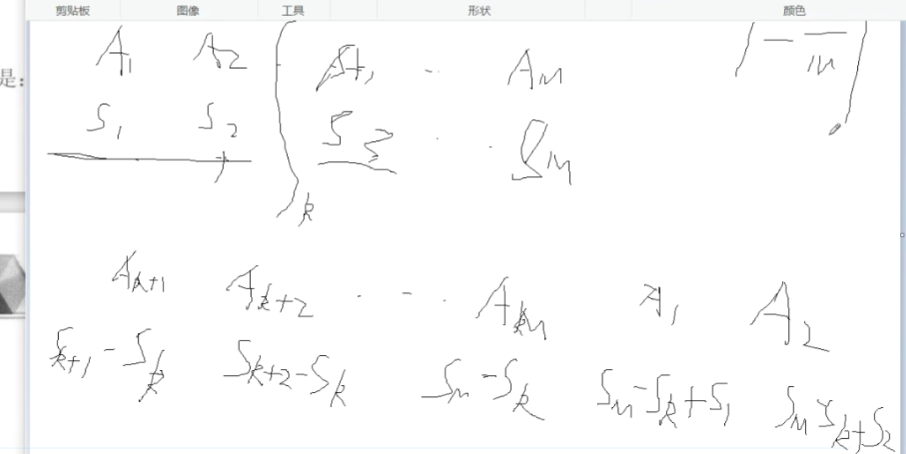
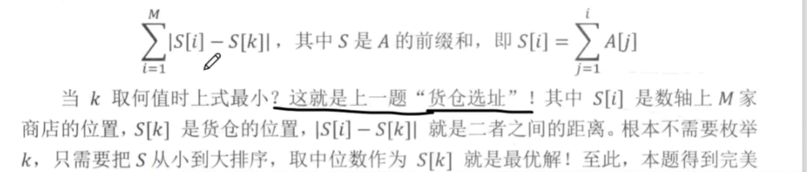

# 第K个数 力扣215

```java
// 快排的过程中找到, 对边界的理解: 个人喜欢全闭区间
// 递归的终点
class Solution {
    public int findKthLargest(int[] nums, int k) {
        int n = nums.length;
        k = n - k + 1;
        return quickSelect(nums,0,n-1,k); // 这里的k不是坐标
    }
    public int quickSelect(int[] q, int l, int r, int k) {
        if (l >= r) return q[l];
        int x = q[l], i = l - 1, j = r + 1;
        // 边界只关注j,防止死循环 
        // 快速分为两半[l,i],[j,r] 左小右大: 第一个q[l] 一定会被交换所以q[l] 在右半, 错位的情况特殊处理不能交换保证正确性: 因为循环至少会执行一次,
        while (i < j) {
            while(q[++i] < x);
            while(q[--j] > x);
            if (i < j) {
                int t = q[i];
                q[i] = q[j];
                q[j] = t;
            }
        }
        int lnum = j - l + 1;
        if (k <= lnum) return quickSelect(q,l,j,k);
        return quickSelect(q,j+1,r,k - lnum);
    }
}
// 快选的时间复杂度分析: 依据剩下的一半的大小: 最差每次只舍去一个n方,期望是每次舍去一半(1 + 1/2 + 1/4 ...)n 即不超过2n
// 快排每次因为要在两半同时接着进行循环里的操作 每层都是n 层高为期望为logn
```

# 均分纸牌

有N堆纸牌，编号分别为 1,2,…,N

每堆上有若干张，但纸牌总数必为 N 的倍数。

可以在任一堆上取若干张纸牌，然后移动。

移牌规则为：在编号为 1 的堆上取的纸牌，只能移到编号为 2 的堆上；在编号为 N 的堆上取的纸牌，只能移到编号为 N−1 的堆上；其他堆上取的纸牌，可以移到相邻左边或右边的堆上。

现在要求找出一种移动方法，用最少的移动次数使每堆上纸牌数都一样多。

例如 N=4，4 堆纸牌数分别为：(9,8,17,6)

移动 3 次可达到目的：

1. 从第三堆取四张牌放入第四堆，各堆纸牌数量变为:(9,8,13,10)
2. 从第三堆取三张牌放入第二堆，各堆纸牌数量变为:(9,11,10,10)
3. 从第二堆取一张牌放入第一堆，各堆纸牌数量变为:(10,10,10,10)

#### 输入格式

第一行包含整数 N。

第二行包含 N 个整数，A1,A2,…,AN 表示各堆的纸牌数量。

#### 输出格式

输出使得所有堆的纸牌数量都相等所需的最少移动次数。

#### 数据范围

1≤N≤1001≤N≤100,
1≤Ai≤100001≤Ai≤10000

#### 输入样例：

```
4
9 8 17 6
```

#### 输出样例：

```
3
```

#### 思路:

贪心算法:移动顺序无关,从左到右的顺序移动纸牌,如第l堆不满足平均值,则移动一次

分两种情况移动:

​	大于平均值: 将a[l]-v 移动到到l+1堆

​	小于平均值: 将v - a[l] 从l+1堆移动过来

为设计方便: 看做一种 a[l] = v, a[l+1] += a[l] - v


#### 代码:

```java
import java.util.Scanner;
public class Main {
	public static void main(String[] args) {
		Scanner sc = new Scanner(System.in);
		int N = sc.nextInt();
		int[] card  = new int[N];
		int sum = 0;
		int count = 0;//移动次数
		int v = 0;//平均数
		for (int i = 0; i < N; i++) {
			card[i] = sc.nextInt();
			sum += card[i];
		}
		v = sum/N;
		for (int i = 0; i < card.length; i++) {
			if (card[i] - v != 0) {
				card[i+1] += card[i] - v ;
                // card[i] = v //可以不用写
				count++;
			}
		}
		System.out.println(count);
	}
}

```


# 七夕祭(todo)

七夕节因牛郎织女的传说而被扣上了「情人节」的帽子。

于是 TYVJ 今年举办了一次线下七夕祭。

Vani 同学今年成功邀请到了 cl 同学陪他来共度七夕，于是他们决定去 TYVJ 七夕祭游玩。

TYVJ 七夕祭和 11 区的夏祭的形式很像。

矩形的祭典会场由 N 排 M 列共计 N×M 个摊点组成。

虽然摊点种类繁多，不过 cl 只对其中的一部分摊点感兴趣，比如章鱼烧、苹果糖、棉花糖、射的屋……什么的。

Vani 预先联系了七夕祭的负责人 zhq，希望能够通过恰当地布置会场，使得各行中 cl 感兴趣的摊点个数一样多，并且各列中 cl 感兴趣的摊点数也一样多。

不过 zhq 告诉 Vani，摊点已经随意布置完毕了，如果想满足 cl 的要求，唯一的调整方式就是交换两个相邻的摊点。

两个摊点相邻，当且仅当他们处在同一行或者同一列的相邻位置上。

由于 zhq 率领的 TYVJ 开发小组成功地扭曲了空间，每一行或每一列的第一个位置和最后一个位置也算作相邻。

现在 Vani 想知道他的两个要求最多能满足多少个。

在此前提下，至少需要交换多少次摊点。

#### 输入格式

第一行包含三个整数 N 和 M 和 T，T 表示 cl 对多少个摊点感兴趣。

接下来 T 行，每行两个整数 x,y，表示 cl 对处在第 x行第 y 列的摊点感兴趣。

#### 输出格式

首先输出一个字符串。

如果能满足 Vani 的全部两个要求，输出 both；

如果通过调整只能使得各行中 cl 感兴趣的摊点数一样多，输出 row；

如果只能使各列中 cl 感兴趣的摊点数一样多，输出 column；

如果均不能满足，输出 impossible。

如果输出的字符串不是 impossible， 接下来输出最小交换次数，与字符串之间用一个空格隔开。

#### 数据范围

1≤N,M≤100000
0≤T≤min(N∗M,100000),
1≤x≤N,
1≤y≤M

#### 输入样例：

```
2 3 4
1 3
2 1
2 2
2 3
```

#### 输出样例：

```
row 1
```

#### 思路:

> 1 2 3 4 5 只交换相邻两个人的一张牌 需要交换多少次每个人都一样 
>
> 设平均值为m =3, 取一个通俗的就可以带入所有的  
>
> 需要借(可为负): 
>
> 1: m-1 
>
> 2:   2-(m-1) = 3-m,   m - (3-m) = 2m -3
>
> 3:   3 - (2m-3) = 6 - 2m, m - (6-2m) = 3m - 6
>
> 4:  4-(3m-6) = 10 -3m, 4m - 10;
>
> 5: 5m - 15;
>
> 观察常数为前缀和, 如果不取首尾只能相邻  那就是前缀和的 每项绝对值相加
>
> 本题特定问题可以选取一个点做为分割点
>
> 转化为前缀和货仓选址问题(设置一个仓库位置 到其他所有点的总和距离最短,求中位数(要先排序))
>
> 最少交换次数 排成一个环 取每个数减去中位数的新数组的前缀和
>
> 





> 求出都减去平均值数组的前缀和做为新数组, 对新数组做为("货仓选址");


#### 代码:

```java
import java.util.*;

public class Main{
    static int N = 100005;
    static long[] row = new long[N], col = new long[N];
    public static void main(String[] args) {
        Scanner in = new Scanner(System.in);
        int n = in.nextInt();
        int m = in.nextInt();

        int T = in.nextInt();

        // 统计每行每列
        for (int i = 1; i <= T; i ++) {
            int x = in.nextInt();
            int y = in.nextInt();
            row[x] ++;
            col[y] ++;
        }
        for (int i = 1; i <= n; i++) {
            row[0] += row[i];
        }
        for (int i = 1; i <= m; i++) {
            col[0] += col[i];
        }


        if (T % n == 0 && T % m == 0) {
            long ans = get(row,n)+get(col,m);
            System.out.println("both" + " " + ans);
        } else if (T % n == 0) {
            System.out.println("row" + " " + get(row,n));
        } else if (T % m == 0) {
            System.out.println("column" + " " + get(col,m));
        } else {
            System.out.println("impossible");
        }
    }
    public static long get(long[] a, int n) {
        long avg = a[0] / n;
        long[] s = new long[N];
        for (int i = 1; i <= n; i++) {
            a[i] -= avg;
            s[i] = s[i-1] + a[i];
        }
        long ans = 0;
        Arrays.sort(s,1,n);
        long mid = s[(1 + n) / 2];
        for (int i = 1; i <= n; i++) {
            ans += Math.abs(s[i] - mid);
        }
        return ans;

    }
}
```

# 逆序对数量

给定一个长度为 n 的整数数列，请你计算数列中的逆序对的数量。

逆序对的定义如下：对于数列的第 i 个和第 j 个元素，如果满足 i<j 且 a[i]>a[j]，则其为一个逆序对；否则不是。

#### 输入格式

第一行包含整数 n，表示数列的长度。

第二行包含 n 个整数，表示整个数列。

#### 输出格式

输出一个整数，表示逆序对的个数。

#### 数据范围

1≤n≤100000，
数列中的元素的取值范围 [1,109][1,109]。

#### 输入样例：

```
6
2 3 4 5 6 1
```

#### 输出样例：

```
5
```

#### 思路:

分析左右两半部分，如果左半部分 q[i] 大于右半部分的 q[j]，那么从 i 到 mid 都可以和 j 组成逆序对，逆序对个数 res += mid - i + 1

#### 代码: 

```java
class Main{
    static int N = 100010;
    static long res = 0;
    static int[] q = new int[N];
    static int[] tmp = new int[N];
    public static void main(String[] args) throws IOException{
        BufferedReader br = new BufferedReader(new InputStreamReader(System.in));
        int n = Integer.parseInt(br.readLine());
        String[] s = br.readLine().split(" ");
        for(int i = 0; i < n; i++){
            q[i] = Integer.parseInt(s[i]);
        }
        
        mergeSort(0, n - 1);
        System.out.println(res);
    }
    public static void mergeSort(int l, int r){
        if(l >= r) return;
        int mid = l + r >> 1;
        mergeSort(l, mid);
        mergeSort(mid + 1, r);
        int k = 0, i = l, j = mid + 1;
        while(i <= mid && j <= r){
            if(q[i] <= q[j]) tmp[k++] = q[i++];
            else {
                res += mid - i + 1;
                tmp[k++] = q[j++];
            }
        }
        while(i <= mid) tmp[k++] = q[i++];
        while(j <= r) tmp[k++] = q[j++];
        for(i = l, j = 0; i <= r; i++, j++) q[i] = tmp[j]; 
    }
}
```

# 798. 差分矩阵


输入一个 nn 行 mm 列的整数矩阵，再输入 q 个操作，每个操作包含五个整数 x1,y1,x2,y2,x其中 (x1,y1) 和 (x2,y2) 表示一个子矩阵的左上角坐标和右下角坐标。

每个操作都要将选中的子矩阵中的每个元素的值加上 c。

请你将进行完所有操作后的矩阵输出。

#### 输入格式

第一行包含整数 n,m,q

接下来 n 行，每行包含 m 个整数，表示整数矩阵。

接下来 qq行，每行包含 5 个整数 x1,y1,x2,y2,c表示一个操作。

#### 输出格式

共 n 行，每行 m 个整数，表示所有操作进行完毕后的最终矩阵。

#### 数据范围

1≤n,m≤1000
1≤q≤100000,
1≤x1≤x2≤n,
1≤y1≤y2≤m,
−1000≤c≤1000,
−1000≤矩阵内元素的值≤1000

#### 输入样例：

```
3 4 3
1 2 2 1
3 2 2 1
1 1 1 1
1 1 2 2 1
1 3 2 3 2
3 1 3 4 1
```

#### 输出样例：

```
2 3 4 1
4 3 4 1
2 2 2 2
```

## Solution

```python
# 原数组是差分数组的前缀和
n, m, q = map(int, input().split())

s = [[0] * (m + 1) for _ in range(n + 1)]

for i in range(1, n + 1):
    s[i] = [0] + list(map(int,input().split()))

# +1 是因为存储是从1,1 开始 + 2是因为 对末尾不越界
a = [[0] * (m + 2) for _ in range(n + 2)]


def insert(x1, y1, x2, y2, c):
    a[x1][y1] += c
    a[x2 + 1][y1] -= c
    a[x1][y2 + 1] -= c
    a[x2 + 1][y2 + 1] += c


for i in range(1, n + 1):
    for j in range(1, m + 1):
        insert(i, j, i, j, s[i][j])

while q > 0:
    x1, y1, x2, y2, c = map(int, input().split())
    insert(x1, y1, x2, y2, c)
    q -= 1

for i in range(1, n +1):
    for j in range(1, m + 1):
        s[i][j] = s[i - 1][j] + s[i][j - 1] - s[i - 1][j - 1] + a[i][j]
        print(s[i][j], end=" ")
    print()
```

# 100. 增减序列

给定一个长度为 n 的数列 a1,a2,…,an，每次可以选择一个区间 [l,r][l,r]，使下标在这个区间内的数都加一或者都减一。

求至少需要多少次操作才能使数列中的所有数都一样，并求出在保证最少次数的前提下，最终得到的数列可能有多少种。

#### 输入格式

第一行输入正整数 nn。

接下来 nn 行，每行输入一个整数，第 i+1i+1 行的整数代表 aiai。

#### 输出格式

第一行输出最少操作次数。

第二行输出最终能得到多少种结果。

#### 数据范围

0<n≤1050<n≤105,
0≤ai<21474836480≤ai<2147483648

#### 输入样例：

```
4
1
1
2
2
```

#### 输出样例：

```
1
2
```

```python
# 差分数组
#，每一次选取Bi和Bj，2<=i,j<=n2<=i,j<=n,而且这两个数，一个为正数，一个为负数，至于为什么要是正负配对，因为我们是要这个B序列2~n都要为0，所以这样负数增加，正数减少，就可以最快地到达目标为0的状态。
# 至于那些无法配对的数BkBk可以选B1或者Bn+1，这两个不影响的数，进行修改
# 原数组是差分数组的前缀和
# 原数组都一样 意味着差分数组第一个数为这个数 其他都为0
# 最少操作数min(p,q)+abs(p−q)=max(p,q)，然后最终序列a可能会有abs(p−q)+1种情况。p为b序列中正数之和，而q为b序列中负数之和
# abs(p−q)+1中情况: 不能配队用操作第一个数 不操作第一个数
# insert(l,r,c ) d[l] += c d[r + 1] -= c 这种操作将后面每个数变成0 两两一组?


#  结论 最少操作 等于 max(z, -f)  不同结果的个数 abs(z + f) 个未配对的 选第一个数或最后一个没影响的减
#  减 for 0次 - abs(z + f) 次第一个数
n = int(input())

s = [0] * (n + 1)
a = [0] * (n + 2)

def insert(l, r, c):
    a[l] += c
    a[r + 1] -= c
    
for i in range(1, n + 1):
    s[i] = int(input())
    insert(i, i, s[i])
    
z, f = 0, 0
for i in range(2, n + 1):
    if a[i] > 0: z += a[i]
    else: f += a[i]
    
ans = max(z, -f)
#  减 for 0次 - abs(z + f) 次第一个数
count = 1 + abs(z + f)
    
print(ans)
print(count)


    

```

# 99. 激光炸弹

地图上有 NN 个目标，用整数 Xi,YiXi,Yi 表示目标在地图上的位置，每个目标都有一个价值 WiWi。

**注意**：不同目标可能在同一位置。

现在有一种新型的激光炸弹，可以摧毁一个包含 R×RR×R 个位置的正方形内的所有目标。

激光炸弹的投放是通过卫星定位的，但其有一个缺点，就是其爆炸范围，即那个正方形的边必须和 x，yx，y 轴平行。

求一颗炸弹最多能炸掉地图上总价值为多少的目标。

#### 输入格式

第一行输入正整数 NN 和 RR，分别代表地图上的目标数目和正方形的边长，数据用空格隔开。

接下来 NN 行，每行输入一组数据，每组数据包括三个整数 Xi,Yi,WiXi,Yi,Wi，分别代表目标的 xx 坐标，yy 坐标和价值，数据用空格隔开。

#### 输出格式

输出一个正整数，代表一颗炸弹最多能炸掉地图上目标的总价值数目。

#### 数据范围

0≤R≤1090≤R≤109
0<N≤100000<N≤10000,
0≤Xi,Yi≤50000≤Xi,Yi≤5000
0≤Wi≤10000≤Wi≤1000

#### 输入样例：

```
2 1
0 0 1
1 1 1
```

#### 输出样例：

```
1
```

## Solution

```python
T, r = map(int, input().split())

N = 5010

a = [[0] * N for _ in range(N)]
s = [[0] * N for _ in range(N)]

n = 0
for i in range(T):
    x, y, w = map(int, input().split())
    a[x][y] += w
    n = max(n, x)
    n = max(n, y)
  
n += 1  
for i in range(1, n + 1):
    for j in range(1, n + 1):
        s[i][j] = s[i-1][j] + s[i][j-1] -s[i-1][j-1] + a[i-1][j-1]
        

ans = 0
if r >= n: ans = s[n][n]

for i in range(r, n + 1):
    for j in range(r, n + 1):
        x1,y1,x2,y2 = i - r + 1, j - r + 1, i, j
        ans = max(ans, s[x2][y2] - s[x1-1][y2] - s[x2][y1-1] + s[x1-1][y1-1])
        
print(ans)
        
    
```

# 799. 最长连续不重复子数组


```python
set = [0] * 100010

n = int(input())
a = list(map(int, input().split()))
ans = 0
j = 0
for i in range(n):
    x = a[i]
    while set[x] > 0:
        out = a[j]
        set[out] -= 1
        j += 1
    set[x] += 1
    ans = max(i - j + 1, ans)

print(ans)
```


# 800. 数组元素的目标和

给定两个升序排序的有序数组 AA 和 BB，以及一个目标值 xx。

数组下标从 00 开始。

请你求出满足 A[i]+B[j]=xA[i]+B[j]=x 的数对 (i,j)(i,j)。

数据保证有唯一解。

#### 输入格式

第一行包含三个整数 n,m,xn,m,x，分别表示 AA 的长度，BB 的长度以及目标值 xx。

第二行包含 nn 个整数，表示数组 AA。

第三行包含 mm 个整数，表示数组 BB。

#### 输出格式

共一行，包含两个整数 ii 和 jj。

#### 数据范围

数组长度不超过 105105。
同一数组内元素各不相同。
1≤数组元素≤1091≤数组元素≤109

#### 输入样例：

```
4 5 6
1 2 4 7
3 4 6 8 9
```

#### 输出样例：

```
1 1
```

```python
# 没必要四指针

n, m, x = map(int, input().split())

a = list(map(int, input().split()))

b = list(map(int, input().split()))

j = m - 1
for i in range(n):
    while j > 0 and a[i] + b[j] > x: j -= 1
    if j > 0 and a[i] + b[j] == x:
        print(i,j)
        break
    
    
    
```

