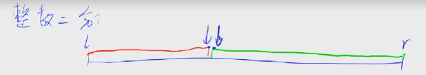
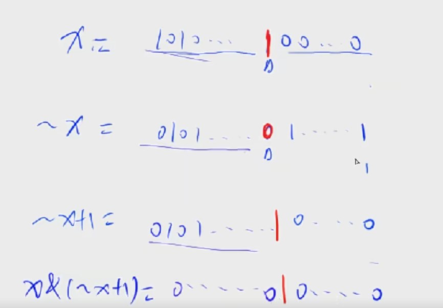
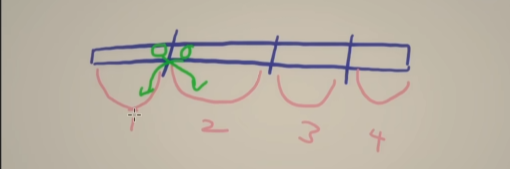

# 离散化

```
将范围大,数量稀疏的进行映射 使范围变小
一个数组存储每个要操作的下标并去重,然后排序
对原下标的操作需要find位置 映射数组相对位置关系
```


假定有一个无限长的数轴，数轴上每个坐标上的数都是 0。

现在，我们首先进行 n 次操作，每次操作将某一位置 x 上的数加 c。

接下来，进行 m 次询问，每个询问包含两个整数 l和 r，你需要求出在区间 [l,r][l,r] 之间的所有数的和。

#### 输入格式

第一行包含两个整数 n 和 m。

接下来 n 行，每行包含两个整数 x 和 c。

再接下来 m 行，每行包含两个整数 l 和 rr。

#### 输出格式

共 m 行，每行输出一个询问中所求的区间内数字和。

#### 数据范围

−109≤x≤109−109≤x≤109,
1≤n,m≤1051≤n,m≤105,
−109≤l≤r≤109−109≤l≤r≤109,
−10000≤c≤10000−10000≤c≤10000

#### 输入样例：

```
3 3
1 2
3 6
7 5
1 3
4 6
7 8
```

#### 输出样例：

```
8
0
5
```


```python
n, m = map(int, input().split())

g = set()
o = []
q = []

for i in range(n):
    x, c = map(int, input().split())
    o += [(x,c)]
    g.add(x)
    
for j in range(m):
    l, r = map(int, input().split())
    g.add(l)
    g.add(r)
    q +=[(l,r)]
    
a = list(g)
a.sort()

def find(t) -> int:
    l, r = 0, len(a) - 1
    while l <= r:
        mid = l + (r - l) // 2
        if a[mid] >= t:
            r = mid - 1
        else:
            l = mid + 1
    return l
    

lena = len(a) + 1
v = [0] * lena

for i in o:
    x, c = i
    v[find(x)] += c

s = [0] * lena

for i in range(1, lena):
    s[i] = v[i - 1] + s[i - 1]

for i in q:
    l, r = i
    print(s[find(r + 1)] - s[find(l)])
    
    
```


# 排序数组的最小交换次数 

```English
getMinSwaps(int[] arr, int n)
1. Create a vector of pair in C++ with first element as array alues and second element as array indices.
2. Sort the vector of pair according to the first element of the pairs.
3. Traverse the vector and check if the index mapped with the value is correct or not, if not then keep swapping until the element is placed correctly and keep counting the number of swaps.
```

## Example

```java
class Solution {
    void solution() {
        System.out.println("solution");
        int[] arr = {4, 2, 1, 3};
        int n = arr.length;
        System.out.println(getMinSwaps(arr,n));

    }
    int getMinSwaps(int[] arr, int n) {
        int[][] vec = new int[n][2];
        for (int i = 0; i < n; ++i) {
            vec[i][0] = arr[i];
            vec[i][1] = i;
            System.out.println("solution1");
        }
        Arrays.sort(vec,(a,b)->a[0] - b[0]);

        int cnt = 0;
        for (int i = 0; i < n; ++i) {

            if (vec[i][1] == i) {
                continue;
            }
            int t1 = vec[i][0], t2 = vec[i][1];
            int target = vec[i][1];
            vec[i][0] = vec[target][0];
            vec[i][1] = vec[target][1];
            vec[target][0] = t1;
            vec[target][1] = t2;
            if (i != vec[i][1]) {
                --i;
            }
            ++cnt;
        }
        return cnt;
    }

}
```

# 快排

## algorithm

```
//根据比较的基点不同 写法不同 防止死循环
0. if l >= r return ;
1. 选个基准点u = a[l], i = l - 1, j = r + 1
2. 让数组以a[j] 为分界点 左边(包括a[j])都小于u 右边都大于等于u
    while(i < j) 
        while(a[++i] < u);
        while(a[--j] > u);
        if (i < j)
            swap(a,i,j);
3. 以分界点进行递归 (l,j) (j+1,r)
	
```

## Example

```java
class Solution {
    int[] arr = {4, 2, 1, 3};
    int n = arr.length;
    public void solution() {
        quickSort(arr,0,n-1);
        for (int i = 0; i < n; i ++) {
            System.out.println(arr[i]);
        }
    }

    void quickSort(int[] a, int l, int r) {
        if (l >= r) return ;
        int u  = a[l], i = l - 1, j = r + 1;
        while (i < j) {
            while (a[++i] < u) ;
            while (a[--j] > u) ;

            if (i < j) {
                int t = a[i];
                a[i] = a[j];
                a[j] = t;
            }
        }

        quickSort(a,l,j);
        quickSort(a,j+1,r);
    }
}
```


# 归并排序

## algorithm

```
mergeSort(int[] arr, int l, int r, int[] temp)
1.后序遍历(l,mid), (mid+1,r)
2.合并: 结果保存在temp
	先考虑两个都不越界
	考虑左边没越界(右边越界),则将左边边加入到arr
	右边同理,两个if 则同时兼顾了
3.将temp复制到arr
```

## Example

```java
class Solution {
    int[] arr = {4, 2, 1, 3};
    int n = arr.length;

    public void solution() {
        int[] temp = new int[n];
        mergeSort(arr,0,n-1,temp);
        for (int i = 0; i < n; i ++) {
            System.out.println(arr[i]);
        }
    }

    void mergeSort(int[] a, int l, int r,int[] temp) {
        if (l >= r) return ;
        int mid = l + r >> 1;
        mergeSort(a,l,mid,temp);
        mergeSort(a,mid+1,r,temp);
        int i = l, j = mid + 1, k = 0;
        while(i <= mid && j <= r) {
            if (a[i] > a[j]) {
                temp[k++] = a[j++];
            } else {
                temp[k++] = a[i++];
            }
        }
        while (i <= mid) temp[k++] = a[i++];
        while (j <= r) temp[k++] = a[j++];
        for (i = l, j = 0; i <= r; i++, j++) a[i] = temp[j];
    }
}
```

# 二分查找

## Algorithm

二分:  根据某种性质将区间分为两半



即能求出左边红色边界 又能求出 右边的绿色的边界

```java
l = 0, r = n - 1;
while (l <= r) {
    
            int mid = r - (r - l) / 2;
    		// 假定一定数组里一定存在target 
    		// 如果刚好只有一个 并且刚好找到 nums[mid] = target   看似 r = mid + 1 可能会把结果舍去
    //但是其实l才是 最终结果 (l还会保留结果) 
    // 发明这个万能的真是一种天才 达到二分的目的
    // 这个条件将序列分成两半 能求出他的左右边界
            if (nums[mid] >= target) {
                r = mid - 1;
            } else {
                l = mid + 1;
            }
}

```


## Example

数的范围

```java
class Solution {
    int[] nums = {1, 2, 2, 3, 3, 4};
    int n = nums.length;
    public void solution() {
        int target = 3;
        int[] res = help(target);
        System.out.println(target+"的左边界下标:  "+res[0]+"  右边界下标: "+res[1]);
    }

    public  int[] help(int target) {
        int l = 1, r = n;
        while (l <= r) {
            int mid = r - (r - l) / 2;
            if (nums[mid] >= target) {
                r = mid - 1;
            } else {
                l = mid + 1;
            }
        }
        if (l > n || nums[l] != target) return new int[] {0,0};
        int left = l;
        r = n;
        while (l <= r) {
            int mid = r - (r - l) / 2;
            if (nums[mid] <= target) {
                l = mid + 1;
            } else {
                r = mid - 1;
            }
        }
        return new int[] {left,r};
    }

}
```

数的三次方根 

```JAVA
import java.io.*;

public class Main{
    public static void main(String[] args) throws IOException{
        final double ACC = 1e-8;
        BufferedReader in = new BufferedReader(new InputStreamReader(System.in));
        double x = Double.parseDouble(in.readLine());
        double l = -100, r = 100;
        while(r - l > ACC){
            double mid  = (l + r) / 2;
            if(mid * mid * mid > x) r = mid;
            else l = mid;
        }
        System.out.printf("%.6f", l);
    }
}
```

# 差分数组

## Algorithm

```java
简化对区间的操作
简化为只要一个Insert操作,将序列中[l, r]之间的每个数加上c。
差分数组的含义: 原数组a是差分数组b的前缀和 a[0] = 0,a下标从1开始
    将a中[l, r]之间的每个数加上c,对b来说 
    insert()
    	b[l] += c(l,end都加c),
		b[r+1] -= c
```

## Example

```python
n, m = map(int, input().split())

a = [0] + list(map(int, input().split()))

d = [0] * (n + 1)

def insert(l, r, c):
    d[l] += c
    if r + 1 <= n:
        d[r + 1] -= c

for i in range(1, n + 1):
    insert(i, i, a[i])
    
while m > 0:
    l, r, c = map(int, input().split())
    insert(l, r, c)
    m -= 1
    
for i in range(1, n + 1):
    d[i] = d[i - 1] + d[i]
    print(d[i], end=" ")
```


# 双指针

## Algorithm

```java
滑动窗口
for (int i = 0, j = 0; i < n; i++)
    // 默认将a[i] 加入
    while(j < i && check(i,j)/*a[i]与原有冲突需要缩小*/) j++; 
	//每道题的具体逻辑 统计结果等
核心思想:运用某些性质将暴力n方->0(n) 暴力枚举区间 ->
解释: 找到性质的末尾 处理完当前状态之后 ++ 就是新的开始
```

## Example

给定一个长度为n的整数序列，请找出最长的不包含重复的数的连续区间，输出它的长度。

```java
class Solution {
    int[] nums = {1, 2, 2, 3, 5};
    int n = nums.length;
    public void solution() {
        int res = help();
        System.out.println(res);

    }

    public int help() {
        Set<Integer> set = new HashSet<>();
        int res = 0;
        for (int i = 0, j = 0; i < n; i++) {
            int in = nums[i];
            while (j <= i && set.contains(in)) {
                set.remove(nums[j++]);
            }
            res = Math.max(res,i - j + 1);
            set.add(in);
        }
        return res;
    }

}
```

# 二进制

## 二进制数n的第k位是几

k 应该从0开始算

n >> k & 1;

## 返回x的最后一位1 lowbit(x)

x & -x 

-x = ~(取反)x + 1



最简单的应用: 一个数x 有几位1 每次去掉最后一个1 直到=0减了多少次就有多少次1

```java
public void solution() {
        int cnt = 0;
        int n = 7+ 16;
        while(n != 0) {
            n -= n & -n;
            cnt++;
        }
//        int res = help();
        System.out.println(cnt);

    }
```


# 贪心

## Example

\2463. 最小移动总距离

X 轴上有一些机器人和工厂。给你一个整数数组 `robot` ，其中 `robot[i]` 是第 `i` 个机器人的位置。再给你一个二维整数数组 `factory` ，其中 `factory[j] = [positionj, limitj]` ，表示第 `j` 个工厂的位置在 `positionj` ，且第 `j` 个工厂最多可以修理 `limitj` 个机器人。

每个机器人所在的位置 **互不相同** 。每个工厂所在的位置也 **互不相同** 。注意一个机器人可能一开始跟一个工厂在 **相同的位置** 。

所有机器人一开始都是坏的，他们会沿着设定的方向一直移动。设定的方向要么是 X 轴的正方向，要么是 X 轴的负方向。当一个机器人经过一个没达到上限的工厂时，这个工厂会维修这个机器人，且机器人停止移动。

**任何时刻**，你都可以设置 **部分** 机器人的移动方向。你的目标是最小化所有机器人总的移动距离。

请你返回所有机器人移动的最小总距离。测试数据保证所有机器人都可以被维修。

## Algorithm

> 贪心: 每一个工厂都是修连续的一部分机器人,但是并不确定修多少,需要dp(记忆化搜索)
>
> 证明
>
> 临项交换法: 反证
>
> 
>
> 如果 交换 则 总距离是变大了的
>
> 
>
> 记忆化搜索有:
>
> 原问题 : n个工厂修理m个机器人
>
> 子问题: 枚举 第一个工厂修了x个机器人,转换成n-1个工厂修m-x个机器人
>
> f(i,j)表示 
>
> 递推: 


