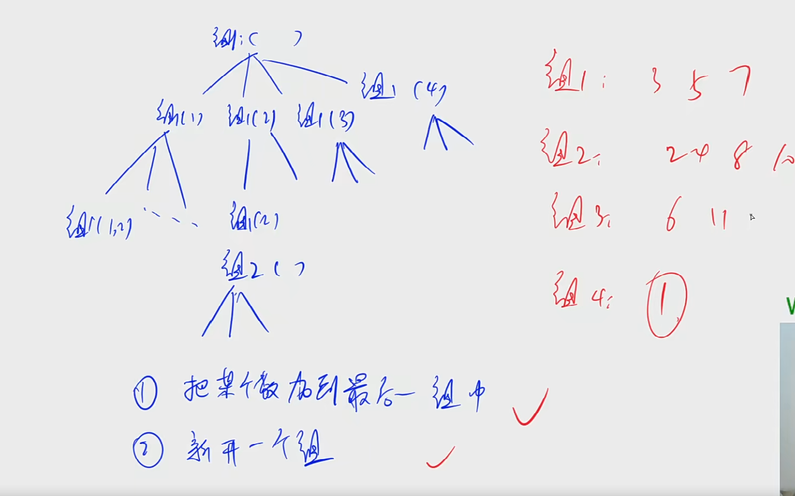

# 树的重心 简单dfs

### 题目描述

给定一颗树，树中包含n个结点（编号1~n）和n-1条无向边。

请你找到树的重心，并输出将重心删除后，剩余各个连通块中点数的最大值。

重心定义：重心是指树中的一个结点，如果将这个点删除后，剩余各个连通块中点数的最大值最小，那么这个节点被称为树的重心。

> 你以为的问题可能有时候是思路错了
>
> for 点, 记录剩余各个连通块中点数的最大值的最小值, 
>
> dfs 后序可以求出每个子树中点的数量的, 题目将点的总个数给出

## Solution

```java
public class Main {
    // 以u为根的子树中的结点数量
    public static int dfs(int root) {
        st[root] = true;
        int cur = 0;
        int sum = 0;
        for (int node : g[root]) {
            if (!st[node]){
                int num = dfs(node);
                sum += num;
                cur = Math.max(num,cur);
            }
        }
        cur = Math.max(n-sum-1,cur);
        res = Math.min(cur,res);
        return sum+1;
    }
}
```


# 1106.山峰山谷 获取边缘信息 todo

FGD小朋友特别喜欢爬山，在爬山的时候他就在研究山峰和山谷。

为了能够对旅程有一个安排，他想知道山峰和山谷的数量。

给定一个地图，为FGD想要旅行的区域，地图被分为 n×n 的网格，每个格子 (i,j)的高度 w(i,j) 是给定的。

若两个格子有公共顶点，那么它们就是相邻的格子，如与 (i,j) 相邻的格子有(i−1,j−1),(i−1,j),(i−1,j+1),(i,j−1),(i,j+1),(i+1,j−1),(i+1,j),(i+1,j+1)(i−1,j−1),(i−1,j),(i−1,j+1),(i,j−1),(i,j+1),(i+1,j−1),(i+1,j),(i+1,j+1)。

我们定义一个格子的集合 S 为山峰（山谷）当且仅当：

1. S 的所有格子都有相同的高度。
2. S 的所有格子都连通。
3. 对于 s 属于 S，与 s 相邻的 s′ 不属于 S，都有 ws>ws（山峰），或者 ws<ws′（山谷）。
4. 如果周围不存在相邻区域，则同时将其视为山峰和山谷。

你的任务是，对于给定的地图，求出山峰和山谷的数量，如果所有格子都有相同的高度，那么整个地图即是山峰，又是山谷。

#### 输入格式

第一行包含一个正整数 nn，表示地图的大小。

接下来一个 n×n 的矩阵，表示地图上每个格子的高度 ww。

#### 输出格式

共一行，包含两个整数，表示山峰和山谷的数量。

#### 数据范围

1≤n≤10001≤n≤1000,
0≤w≤1090≤w≤109

#### 输入样例1：

```
5
8 8 8 7 7
7 7 8 8 7
7 7 7 7 7
7 8 8 7 8
7 8 8 8 8
```

#### 输出样例1：

```
2 1
```

#### 输入样例2：

```
5
5 7 8 3 1
5 5 7 6 6
6 6 6 2 8
5 7 2 5 8
7 1 0 1 7
```

#### 输出样例2：

```
3 3
```

#### 样例解释

样例1：


样例2：


## Solution

```python
from collections import deque
from typing import Tuple

n = int(input())
# n, m = map(int, input().split())
# 定义一维 在用for创建二维
g = [list(map(int, input().split())) for _ in range(n)]

st = [[False] * n for _ in range(n)]

l_ans = 0
h_ans = 0


def bfs(sx, sy):
    global h_ans, l_ans
    queue = deque([(sx, sy)])
    st[sx][sy] = True
    l, h = 0 ,0
    
    while queue:
        x, y = queue.popleft()
        for i in range(x-1,x+2):
            for j in range(y-1,y+2):
                if i == x and j == y: continue
                if i < 0 or i >= n or j < 0 or j >= n: continue
                if g[i][j] > g[x][y]:
                    h += 1
                    continue
                if g[i][j] < g[x][y]:
                    l += 1
                    continue
                if st[i][j]: continue
                queue.append((i,j))
                st[i][j] = True
    if l == 0 and h == 0:
        l_ans += 1
        h_ans += 1
        print("既是山峰又是山谷")
    elif l == 0:
        l_ans += 1
        print("没有比自己矮的 所以是山谷")
    elif h == 0:
        h_ans += 1
        print("没有比自己高的 所以是山峰")
    print(l_ans,h_ans)
    print()
```


# 1076. 迷宫问题 记录路径	

> 每一步权重为1
>
> 记录路径: 暴力记录每条路径(记录从哪个点而来), 再根据终点倒推回起点
>
> bfs 根据建图 无向图不能回头, 有向图最短路, 别重复访问点, 即一个点能从多个地方到达,只记录第一次到达的(距离被更新则不进入),可以优化

```java
import java.util.*;

class Main{
    static int n;
    static int[][] g;
    static int[][][] d;  // 起点到ij的最短距离

    static int[] dx = {-1,0,1,0}, dy = {0,-1,0,1};
    public static void main(String[] args) {
        Scanner in = new Scanner(System.in);
        n = in.nextInt();

        g = new int[n][n];
        d = new int[n][n][3];

        for (int i = 0; i < n; i++) {
            for (int j = 0; j < n; j++) {
                g[i][j] = in.nextInt();
                d[i][j][0] = -1;
            }
        }
        bfs();
        int[] end = d[0][0];
        while (true) {
            System.out.println(end[1] + " " + end[2]);
            if (end[1] == n-1 && end[2] == n-1) break;
            end = d[end[1]][end[2]];

        }

    }
    static public void bfs() {
        Deque<int[]> q = new ArrayDeque<>();
        d[n-1][n-1][0] = 0;
        q.offer(new int[]{n-1,n-1});
        while (!q.isEmpty()) {
            int[] t = q.poll();
            for (int i = 0; i < 4; i++) {
                int a = t[0] + dx[i], b = t[1] + dy[i];
                if (a < 0 || a >= n || b < 0 || b >= n) continue;
                if (g[a][b] == 1 || d[a][b][0] != -1) continue;
                q.offer(new int[]{a,b});
                d[a][b][0] = d[t[0]][t[1]][0] + 1;
                d[a][b][1] = t[0];
                d[a][b][2] = t[1];
            }
        }
    }
}
```

# 845. 八数板 外部搜索

> 外部搜索,数据转换即可


# 1112. 迷宫 dfs python语法

```python
import sys
sys.setrecursionlimit(500000)

T = int(input())

def dfs(xa,ya,xb,yb,g,n,st)->bool:
    if g[xa][ya] == '#': return False
    st[xa][ya] = True
    if xa == xb and ya == yb: return True
    
    dx, dy = [-1,0,1,0], [0,-1,0,1]
    
    for i in range(4):
        a, b = xa + dx[i], ya + dy[i]
        if a < 0 or a >= n or b < 0 or b >= n: continue
        if st[a][b]: continue
        if dfs(a,b,xb,yb,g,n,st): return True
    
    return False
    
    
while T:
    n = int(input())
    g = [input() for _ in range(n)]
    xa, ya, xb, yb = map(int, input().split())
    st = [[False] * n for _ in range(n)]
    
    if dfs(xa,ya,xb,yb,g,n,st): print("YES")
    else: print("NO")
    T -= 1
```


# 分为互质组 最大团 todo



最大团