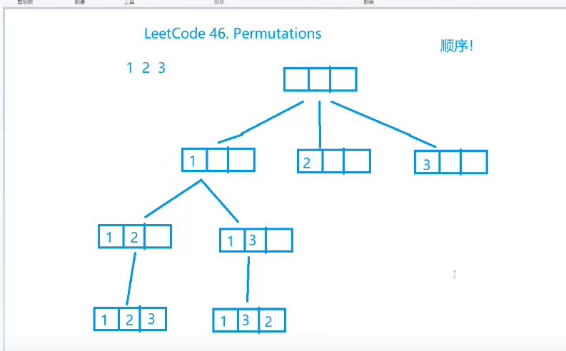
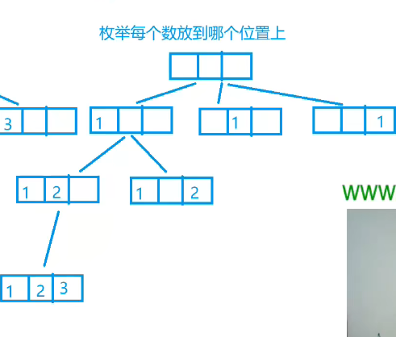
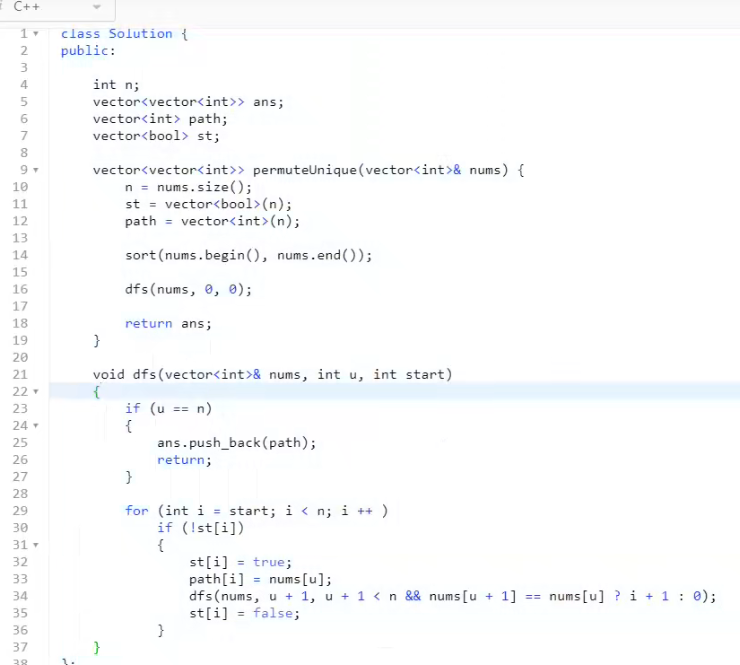
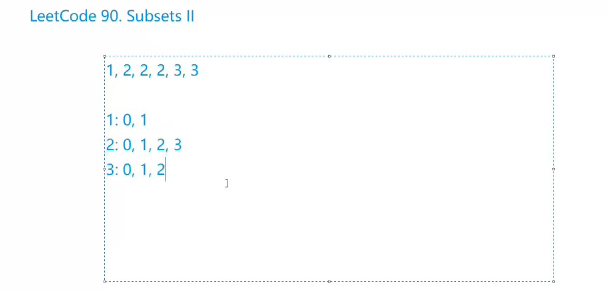

# Leetcode

### 79 单词搜索

```java
class Solution {
    
    int[] dx = {-1,0,1,0}, dy = {0,-1,0,1};
    int n, m;
    public boolean exist(char[][] board, String word) {
        //dfs
        n = board.length;
        m = board[0].length;
        for (int i = 0; i < n; i++) {
            for (int j = 0; j < m; j++) {
                if (dfs(board,i,j,word,0)) return true;
            }
        }
        return false;
        
    }
    public boolean dfs(char[][] board, int x, int y, String word, int u) {
        if (board[x][y] != word.charAt(u)) return false;
        if (u == word.length()-1) return true; 

        board[x][y]  = '.';
        for (int i = 0; i < 4; i++) {
            int a = x + dx[i], b = y + dy[i];
            if (a < 0 || a >= n || b < 0 || b >= m) continue;
            if (dfs(board,a,b,word,u+1)) return true;
        }
        board[x][y] = word.charAt(u);
        return false;
    }
}
```

### 46 全排列 无重复数

顺序一: 枚举每个位置放哪个数



顺序二: 枚举每个数放到那个位置上



```java
//第一种搜索顺序
class Solution {
    int n;
    boolean[] st;
    List<Integer> path = new ArrayList<>();
    List<List<Integer>> res = new ArrayList<>();
    public List<List<Integer>> permute(int[] nums) {
        n = nums.length;
        st = new boolean[n];
    
        dfs(0,nums,path);
        return res;
    }
    public void dfs(int u, int[] nums, List<Integer> path) {
        if (u == n) {
            res.add(new ArrayList(path));
            return ;
        }
        for (int i = 0; i < n; i++) {
            if (!st[i]) {
                path.add(nums[i]);
                st[i] = true;
                dfs(u + 1, nums, path);
                st[i] = false;
                path.remove(path.size() - 1);
            }
        }
    }
}
```

### 47 有重复数 全排列




```C++
class Solution {
    int n;
    List<Integer> path;
    List<List<Integer>> ans;
    boolean[] st;
    public List<List<Integer>> permuteUnique(int[] nums) {
        n = nums.length;
        st = new boolean[n];
        ans = new ArrayList<>();
        path = new ArrayList<>(n);
        Arrays.sort(nums);
        for (int i = 0; i < n; i++) {
            path.add(null);
        }
        dfs(nums,0,0);
        return ans;
    }   
    public void dfs(int[] nums, int u, int start) {
        if (u == n) {
            ans.add(new ArrayList<>(path));
            return ;
        }
        for (int i = start; i < n; i++) {
            if (!st[i]) {
                st[i] = true;
                path.set(i,nums[u]);
                dfs(nums,u+1,u+1 < n && nums[u] == nums[u+1] ? i+1 : 0);
                st[i] = false;
            }
        }
    }
}

```

### 78 子集

二进制枚举

```java
class Solution {
    int n;
    List<Integer> path;
    List<List<Integer>> ans;
    
    public List<List<Integer>> subsets(int[] nums) {
       //dfs 搜索顺序,枚举每个数选还是不选
       n = nums.length;
       path = new ArrayList<>();
       ans = new ArrayList<>();
       dfs(nums,0);
       return ans;
    }
    public void dfs(int[] nums, int u) {
        if (u == n) {
            ans.add(new ArrayList<>(path));
            return ;
        }
        int k = 1;
        for (int i = 0; i <= k; i++) {
            dfs(nums,u+1);
            path.add(nums[u]);
        }
        for (int i = 0; i <= k; i++) path.remove(path.size() - 1);
    }
}
```

```java
class Solution {
    int n;
    List<Integer> path;
    List<List<Integer>> ans;
    public List<List<Integer>> subsets(int[] nums) {
        // 搜索顺序 枚举每个数选还是不选
        n = nums.length;
        path = new ArrayList<>();
        ans = new ArrayList<>();
        dfs(nums,0);
        return ans;
    }
    public void dfs(int[] nums, int u) {
        if (u == n) {
            ans.add(new ArrayList(path));
            return ;
        }
        

        // 选第u位
        path.add(nums[u]);
        dfs(nums,u+1);
        path.remove(path.size() - 1);
        // 不选
        dfs(nums,u+1);
    }
}
```


### 90 子集II



先枚举每个数字,然后枚举每个数字选多少个

```java
class Solution {
    List<List<Integer>> res;
    List<Integer> path;
    int n;
    public List<List<Integer>> subsetsWithDup(int[] nums) {
        res = new ArrayList<>();
        path = new ArrayList<>();
        n = nums.length;
        Arrays.sort(nums);
        dfs(nums,0);
        return res;

    } 
    private void dfs(int[] nums, int u){
       if (u == n) {
           res.add(new ArrayList<>(path));
           return ;
       }           
       int k = 0;
       while(u + k < n && nums[u+k] == nums[u]) k++;
       for (int i = 0; i <= k; i++) {
           dfs(nums,u+k);
           path.add(nums[u]);
       }      
       for (int i = 0; i <= k; i++) path.remove(path.size()-1);

    }

}
```

### 216 组合总和III

```java
class Solution {
    List<Integer> path;
    List<List<Integer>> ans;
    public List<List<Integer>> combinationSum3(int k, int n) {
        // 组合 搜索顺序: 依次枚举每个数 是否选
        path = new ArrayList<>();
        ans = new ArrayList<>();
        dfs(1,k,n);
        return ans;
    }
    public void dfs(int u, int k,int n) {
        if (k == 0) {
            if (n == 0) {
                ans.add(new ArrayList<>(path));
            }
            return ;
        }
        if (u == 10) return ;
        
        dfs(u+1,k,n);
        
        path.add(u);
        dfs(u+1,k-1,n-u);
        path.remove(path.size() - 1);

    }

}

// 依次枚举每个位置 可以选哪些数

```

### 200 岛屿数量

```java
 boolean[][] st;
    int n;
    int m;
    int[] dx = {-1,0,1,0}, dy = {0,1,0,-1};
    public int numIslands(char[][] grid) {
        n = grid.length;
        m = grid[0].length;
        st = new boolean[n][m];
        int cnt = 0;
        for (int i = 0; i < n; i++) {
            for (int j = 0; j < m; j++) {
                if (grid[i][j] == '1' && !st[i][j]) {
                    bfs(grid,i,j);
                    cnt++;
                }
            }
        }
        return cnt;
    }
    public void bfs(char[][] g, int a, int b ) {
        
        Deque<int[]> q = new ArrayDeque<>();
        q.offer(new int[]{a,b});
        st[a][b] = true;
        while (!q.isEmpty()) {
            int[] t = q.poll();
            
            for (int i = 0; i < 4; i++) {
                int x = t[0] + dx[i], y = t[1] + dy[i];
                if (x >= n || x < 0 || y < 0 || y >= m || st[x][y] || g[x][y] != '1') continue;
                q.offer(new int[]{x,y});
                st[x][y] = true;
            }  
        }
    }
}
```


### 八皇后

