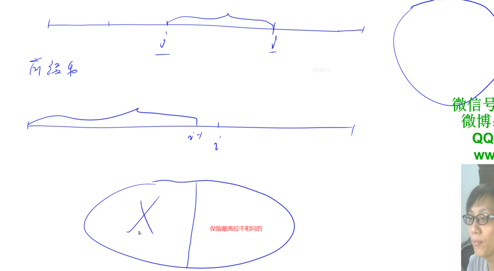

# 143. 最大异或树




次高位保存不相同的 以此类推 用一个trie

在给定的 $N$ 个整数 $A_1，A_2……A_N$ 中选出两个进行 $xor$（异或）运算，得到的结果最大是多少？

#### 输入格式

第一行输入一个整数 $N$。

第二行输入 $N$ 个整数 $A_1$～$A_N$。

#### 输出格式

输出一个整数表示答案。

#### 数据范围

$1 \le N \le 10^5$,
$0 \le A_i < 2^{31}$

#### 输入样例：

```
3
1 2 3
```

#### 输出样例：

```
3
```