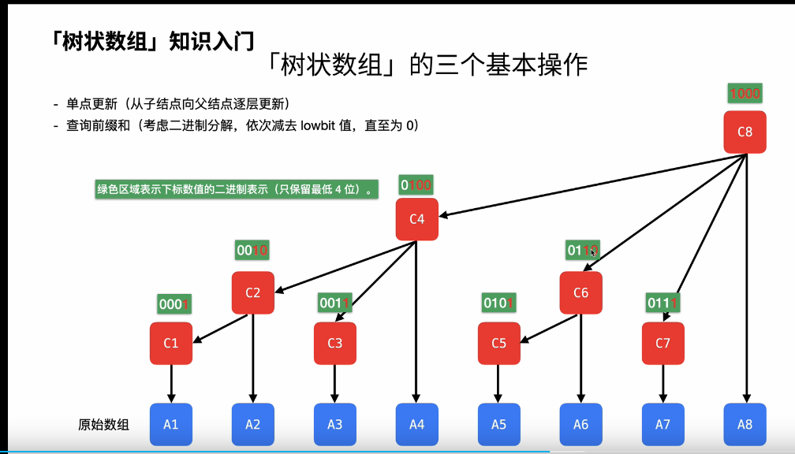

# Trie树

```c++
int son[N][26], cnt[N], idx;
// 0号点既是根节点，又是空节点
// son[][]存储树中每个节点的子节点
// cnt[]存储以每个节点结尾的单词数量
// 树是特殊的图 


// 插入一个字符串
void insert(char *str) // 建立有向边的过程 idx 是有向边的条数
{
    int p = 0;
    for (int i = 0; str[i]; i ++ )
    {
        int u = str[i] - 'a';  
        if (!son[p][u]) son[p][u] = ++ idx;
        p = son[p][u];
    }
    cnt[p] ++ ;  
}

// 查询字符串出现的次数
int query(char *str) // 
{
    int p = 0;
    for (int i = 0; str[i]; i ++ )
    {
        int u = str[i] - 'a';
        if (!son[p][u]) return 0;
        p = son[p][u];
    }
    return cnt[p];
}

作者：yxc
链接：https://www.acwing.com/blog/content/404/
来源：AcWing
著作权归作者所有。商业转载请联系作者获得授权，非商业转载请注明出处。
```


# 并查集

## 模板

```python
def root(i):
    while i != id[i]:
        id[i] = id[id[i]]
        i = id[i]
    return i
```

# KMP

给定一个字符串 SS，以及一个模式串 PP，所有字符串中只包含大小写英文字母以及阿拉伯数字。

模式串 PP 在字符串 SS 中多次作为子串出现。

求出模式串 PP 在字符串 SS 中所有出现的位置的起始下标。

#### 输入格式

第一行输入整数 NN，表示字符串 PP 的长度。

第二行输入字符串 PP。

第三行输入整数 MM，表示字符串 SS 的长度。

第四行输入字符串 SS。

#### 输出格式

共一行，输出所有出现位置的起始下标（下标从 00 开始计数），整数之间用空格隔开。

#### 数据范围

1≤N≤1051≤N≤105
1≤M≤1061≤M≤106

#### 输入样例：

```
3
aba
5
ababa
```

#### 输出样例：

```
0 2
```

```java
m = int(input())
p = input()
n = int(input())
s = input()


ne = [0] * m
j = 0
for i in range(m):
    while j > 0 and p[i] != p[j]:
        j = ne[j - 1]
    if p[i] == p[j]:
        j = j + 1
    ne[i] = j

j = 0
i = 0
while i < n:
    while j > 0 and s[i] != p[j]:
        j = ne[j - 1]
    if s[i] == p[j]:
        j = j + 1
    if j == m:
        print(i - m + 1,end=" ")
        j = ne[j-1]
    i += 1
```

# 树状数组



```java
class Solution {
    public int reversePairs(int[] nums) {
        // 离散化 只记录rank 
        int res = 0;
        int n = nums.length;
        int[] tmp = new int[n];
        System.arraycopy(nums, 0, tmp, 0, n);
        // 离散化
        Arrays.sort(tmp);
        for (int i = 0; i < n; ++i) {
            nums[i] = Arrays.binarySearch(tmp, nums[i]) + 1;
        }
        // 树状数组统计逆序对
        Bit bit = new Bit(n);
        for (int i = 0; i < n; i++) {
            res += bit.query(n) - bit.query(nums[i]);
            bit.add(nums[i],1);
        }
        return res;
    }
    class Bit {
        int[] tree;
        int n;
        Bit(int n) {
            this.n = n;
            this.tree = new int[n+1];
            // 下标0 忽略不用
        }
        public int lowbit(int x) {
            return x & (-x);
        }
        // 更新前缀和 自下向上
        // 子节点到父节点 只要+ lowbit 反之 则 -
        public void add(int x, int v) {
            for (int i = x; i <= n; i += lowbit(i))
                tree[i] += v;
        }
        // 比如查询 5 则查询的是比5大的出现的个数 
        // 查询的是 5的前缀和 
        public int query(int x) {
            int ret = 0;
            for (int i = x; i > 0; i -= lowbit(i)) 
                ret += tree[i];
            return ret;
        }
    }

}
```

https://www.bilibili.com/read/cv9904414?spm_id_from=333.999.0.0