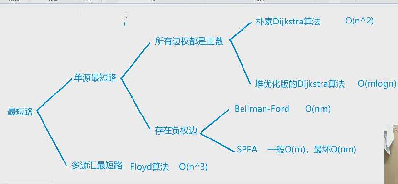
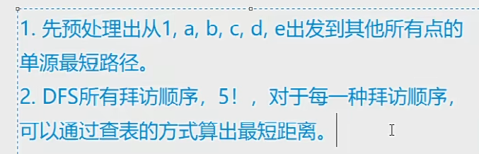

# 849. dijkstra求最短路 

```python
n, m = map(int, input().split())

N = 510
inf = 0x3f3f3f3f
g = [[inf] * N for _ in range(N)]
dist = [inf] * N
st = [False] * N

for _ in range(m):
    x, y, z = map(int, input().split())
    g[x][y] = min(g[x][y],z)

dist[1] = 0
for i in range(n):
    t = -1
    for j in range(1, n + 1):
        if not st[j] and (t == -1 or dist[t] > dist[j]):
            t = j 
    st[t] = True
    
    for j in range(1, n + 1):
        dist[j] = min(dist[j], dist[t] + g[t][j])
        

if (dist[n] > inf / 2): print(-1)
else: print(dist[n])
```


# 1129. 热浪

```python
from queue import Queue
n, m, start, end = map(int, input().split())

inf = 0x3f3f3f3f

g = [[] for _ in range(n + 1)]

for _ in range(m):
    x, y, z = map(int, input().split())
    g[x] += [(y,z)]
    g[y] += [(x,z)]
    
dist = [inf] * (n + 1)
dist[start] = 0

st = [False] * (n + 1)
q = Queue()
q.put(start)
st[start] = True

while not q.empty():
    t = q.get()
    st[t] = False
    
    for ne in g[t]:
        b, w = ne
        if dist[b] > dist[t] + w:
            dist[b] = dist[t] + w
            if not st[b]:
                q.put(b)

print(dist[end])
```

# 1128. 信使

```python
# spfa

from queue import Queue
N = 110
inf = 0x3f3f3f3f
n, m = map(int, input().split())

g = [[] for _ in range(N)]

dist = [inf] * N

st = [False] * N

dist[1] = 0

for _ in range(m):
    x, y, z = map(int, input().split())
    g[x] += [(y,z)]
    g[y] += [(x,z)]
    
q = Queue()

q.put(1)
st[1] = True

while not q.empty():
    t = q.get()
    st[t] = False
    
    for b, w in g[t]:
        if dist[b] > dist[t] + w:
            dist[b] = dist[t] + w
            if not st[b]:
                q.put(b)
                
flag = False

res = -1

for i in range(1, n + 1):
    if dist[i] == inf:
        flag = True
        break
    res = max(dist[i], res)
if flag: print(-1)
else: print(res)
```

```python
# dijkstra 堆优化
import heapq

n, m = map(int, input().split())

inf = 0x3f3f3f3f
dist = [inf] * (n + 1)
dist[1] = 0
g = [[] for _ in range(n + 1)]
st = [False] * (n + 1)

for _ in range(m):
    x, y, z = map(int, input().split())
    g[x] += [(y, z)]
    g[y] += [(x, z)]

q = []
heapq.heappush(q, (0, 1))
while q:
    d, t = heapq.heappop(q)

    if st[t]: continue
    st[t] = True

    for ne in g[t]:
        b, w = ne
        if dist[b] > dist[t] + w:
            dist[b] = dist[t] + w
            heapq.heappush(q, (dist[b], b))

flag = False
res = -1
for i in range(1, n + 1):
    if dist[i] == inf:
        flag = True
        break
    res = max(res, dist[i])

if flag:
    print(-1)
else:
    print(res)

```

# 新年好



```python
from queue import Queue

N, M, INF = 50010, 200010, 0x3f3f3f3f

g = [[] for _ in range(N)]

dist = [[INF] * N for _ in range(6)]

vis = [False] * 6

n, m = map(int, input().split())

source = [1] + list(map(int, input().split()))

ans = INF

# u: 第u个位置, start: 起点的下标 因为dist[start]才是对应最短路, 全局变量存储最值
def dfs(u, start, distance):
    global ans
    if u == 6:
        ans = min(ans, distance)
        return

    for i in range(1, 6):
        ne = source[i]
        if not vis[i]:
            vis[i] = True
            dfs(u + 1, i, dist[start][ne] + distance)
            vis[i] = False


def spfa(start, d):
    global N
    d[start] = 0
    q = Queue()
    q.put(start)
    st = [False] * N
    st[start] = True
    while not q.empty():
        t = q.get()
        st[t] = False

        for b, w in g[t]:
            if d[b] > d[t] + w:
                d[b] = d[t] + w
                if not st[b]:
                    q.put(b)
                    st[b] = True


for _ in range(m):
    x, y, z = map(int, input().split())
    g[x] += [(y, z)]
    g[y] += [(x, z)]

for i in range(6):
    spfa(source[i], dist[i])

dfs(1, 0, 0)

print(ans)

```

# 340. 通信线路

```python
# 二分找答案x, 性质 大于x的 变为1,(check最短路dist[n] 是否 > k , 大于k说明 超过k条大于x的, x 要 变大l = mid + 1才能让 最短路小于等于k ) 小于等于x的变为0 

from collections import deque
n, m, k = map(int, input().split())

g = [[] for _ in range(n + 1)]

for _ in range(m):
    a, b, w  = map(int, input().split())
    g[a] += [(b,w)]
    g[b] += [(a,w)]
    
def check(x) -> bool:
    global n, k
    st = [False] * (n + 1)
    q = deque([(0, 1)])
    dist = [0x3f3f3f3f] * (n + 1)
    dist[1] = 0
    while q:
        w, t = q.popleft()
        # print(w, t)
        if st[t]: continue
        st[t] = True
        
        for b, w in g[t]:
            v = 0
            if w > x:
                v = 1
            if dist[b] > dist[t] + v:
                dist[b] = dist[t] + v
                if v == 1:
                    q.append((dist[b],b))
                else:
                    q.appendleft((dist[b],b))
    # print(x, dist)
    return dist[n] > k

        
    

l, r = 0, int(1e6)
while l <= r:
    mid = l + r >> 1
    if check(mid):
        l = mid + 1
    else:
        r = mid - 1

if l == int(1e6 + 1):
    print(-1)
else: print(l)
    
```

# 342. 道路与航线


# 家谱树

```python
from collections import deque

n = int(input())

g = [[] for _ in range(n + 1)]
d = [0] * (n + 1)
for i in range(1, n + 1):
    g[i] = list(map(int, input().split()))
    g[i].pop()
    for e in g[i]:
        d[e] += 1
    

q = deque([])

for i in range(1, n + 1):
    if d[i] == 0:
        q.append(i)
    

while q:
    t = q.popleft()
    print(t, end=" ")
    for ne in g[t]:
        d[ne] -= 1
        if d[ne] == 0:
            q.append(ne)


    
    
```

