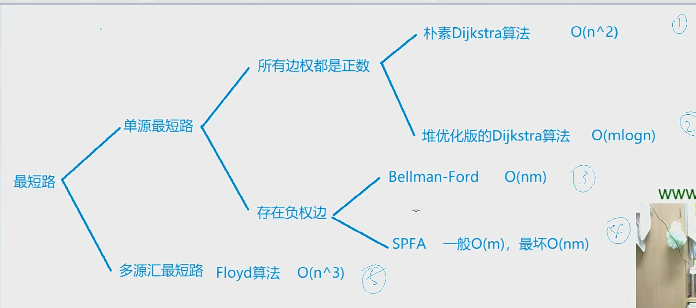
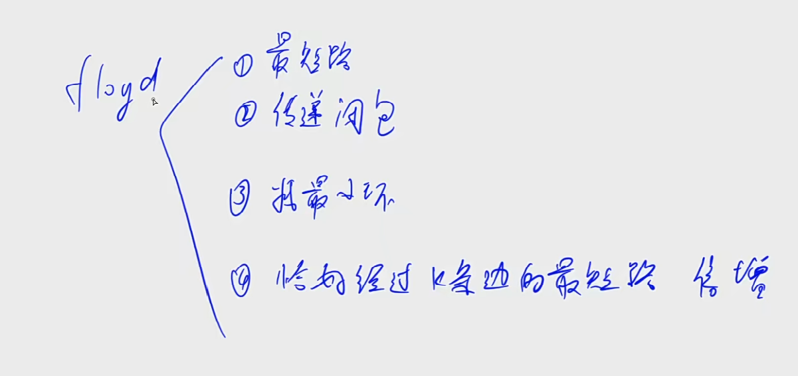
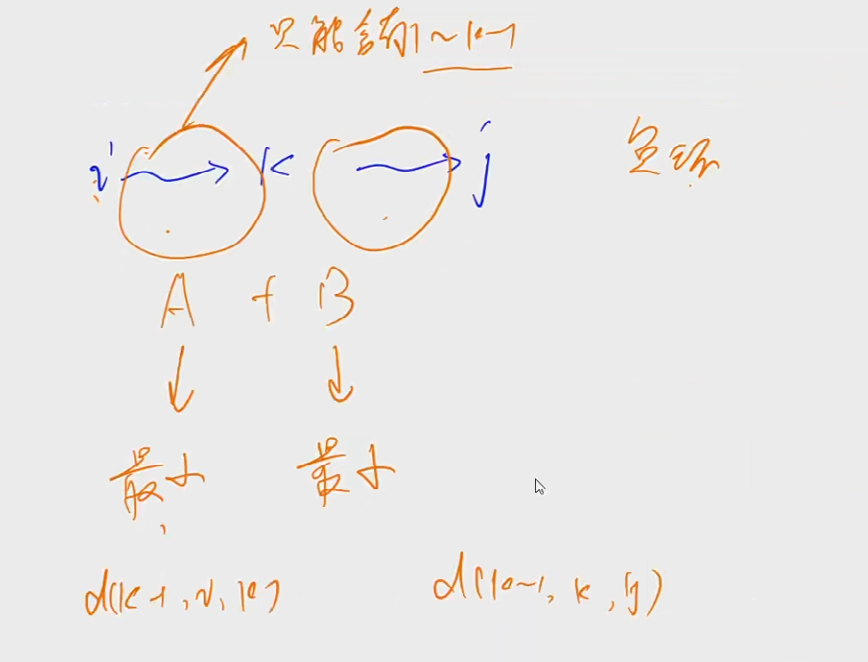

# 理论

## 最短路



n个点m条边的有向图, 起点start,除start所有点到起点距离为INF

单源且所有边权为正

朴素dijkstra:  第一步,从起点扩展出的每条边, 其中最短的那条边到达的点,到起点的距离一定是最短路(显然其他路径都比本条路径长), 之后将已确定最短路点当做新的起点(这一步的实现是用已确定的点扩展的边更新到达起点的距离), 根据实现每次只需从未确定点中找到距离起点最近的

朴素算法 根据初始化不初始化起点为已确定(一般性),那么一共需要n步确定n个点与起点的距离, 每步中需要找到未确定点到达起点最近的点(可堆优化(logm),可暴力(n)), 然后用这个点扩展更新与起点(暴力(n), 只用扩展(比n效果好的n))最新的距离

堆优化: 用堆存储扩展出的点(扩展出的点通过已确定的点能缩小距离才加入队列, 涉及到已被其他点更新距离)

单源且存在负边

bellman-ford基于动态规划, 具体的遍历过程原理(更新过程中有串联需要备份)稍有复杂, 记住两层循环的意义

spfa基于bellman-ford优化, 后继变小需要前驱变小, 只要结点变小则放入队列, 判负环:抽屉原理, 添加cnt数组

```c++
			if (dist[j] > dist[t] + w[i])
            {
                dist[j] = dist[t] + w[i];
                cnt[j] = cnt[t] + 1;
                if (cnt[j] >= n) return true;       // 如果从1号点到x的最短路中包含至少n个点（不包括自己），则说明存在环
                if (!st[j])
                {
                    q.push(j);
                    st[j] = true;
                }
            }

```


# 朴素dijkstra

## 证明

dijkstra 每一步都最近 第一次到达的点离起点最近

## Algorithm

```python
1. dist = [inf] * n + 1, dist[start] = 0
2. S: 当前已确定最短距离的点 用boolean数组存, for i in range(1,n + 1) t <- 不在S中的距离起点最近的点
	# 每轮迭代确定一个点的最短路径
    t = -1
	for i in range(1, n + 1):
		if (!st[i] && (t == -1 || dist[i] < dist[t])):
        	t = i
    #确定dist[t]是最小距离, 不会被更新 
    st[t] = true	
    
3. 用t更新其他所有点的距离
	for j in range(n):
		dist[j] = min(dist[j], dist[t] + g[t][j])

```

## Example

```python
n, m = map(int, input().split())

N = 510
inf = 0x3f3f3f3f
g = [[inf] * N for _ in range(N)]
dist = [inf] * N
st = [False] * N

for _ in range(m):
    x, y, z = map(int, input().split())
    g[x][y] = min(g[x][y], z)

dist[1] = 0
for i in range(n):
    t = -1
    for j in range(1, n + 1):
        if not st[j] and (t == -1 or dist[t] > dist[j]):
            t = j
    st[t] = True

    for j in range(1, n + 1):
        dist[j] = min(dist[j], dist[t] + g[t][j])

if (dist[n] > inf / 2):
    print(-1)
else:
    print(dist[n])
```

# 堆优化dijkstra

```python
class Solution {
    int INF = Integer.MAX_VALUE / 2;
    public int networkDelayTime(int[][] times, int n, int k) {
        //给的是边加边权重,n个网络结点
        int[] dis = dij(times,n,k);
        int ans = Integer.MIN_VALUE;
        for (int i  = 1; i <= n ; i++) {
            if (dis[i] == INF) {
                return -1;
            }
            ans = Math.max(dis[i],ans);
        }
        return ans;
    }

    int[] dist;
    List<int[]>[] g;
    boolean[] st;
    public int[] dij(int[][] edges, int n, int start) {
        g = new List[n+1];
        st = new boolean[n+1];
        for (int i = 0; i <= n; i++) {
            g[i] = new ArrayList<>();
        }
        for (int[] edge : edges) {
            g[edge[0]].add(new int[]{edge[1],edge[2]});
        }

        dist = new int[n+1]; // g是 n+1
        Arrays.fill(dist, INF);

        Queue<int[]> pq = new PriorityQueue<>((a,b)->{
            return a[1] - b[1];
        });

        dist[start] = 0;
        pq.offer(new int[]{start,0});

        while (!pq.isEmpty()) {
            int[] cur = pq.poll();
            int t = cur[0];
            int distance = cur[1];
			
            // if (distance > dist[t]) continue ; 与st作用相同
            if (st[t]) continue;
            st[t] = true;
    
            for (int[] next : g[t]) {
                int j = next[0];
                int d = distance + next[1];
                if (dist[j] > d) {
                    dist[j] = d;
                    pq.offer(new int[]{j,d});
                }
            }

        }
        return dist;
    }
}
```

```python
import heapq
n, m = map(int, input().split())
inf = 0x3f3f3f3f
g = [[] for _ in range(n + 1)]
for _ in range(m):
    x, y, z = map(int, input().split())
    g[x] += [(y,z)]
    
st = [False] * (n + 1)
dist = [inf] * (n + 1)
dist[1] = 0
q = []

heapq.heappush(q,(0,1)) #  默认第一个元素进行从小到大排序, 所以存储距离

while q:
    w, t = heapq.heappop(q)
    
    if st[t]: continue
    st[t] = True
    
    for ne in g[t]:
        j, d = ne
        if dist[j] > dist[t] + d:
            dist[j] = dist[t] + d
            heapq.heappush(q,(dist[t] + d,j))
            
if dist[n] == inf: print(-1)
else: print(dist[n])
    
    

    
```


# Bellman-ford算法

## Algorithm

```python
bellman核心思想: 


建图方式随便建只要能遍历到所有边

for n:    for n 循环的意义不超过n条边到达b最短路的距离, 
    所以如果第n次循环还能更新就代表存在负环(一条通路有n条边那么有n+1个点,一定有一个重复的点, 继续更新说明这个环的权值和为负,即负环)
    #spfa 对这步优化 只有dist[a] 变小 dist[b]才能变小 用队列存一个变小的a
 	for 所有边 a b w(a->b 的距离为w) m条边 
 		dist[b] = min(dist[b],dist[a] + w) # 
n-1次后能保证 dist[b] <= dist[a] + w
复杂度 n * m


```

## Example

给定一个 n 个点 m 条边的有向图，图中可能存在重边和自环， **边权可能为负数**。

请你求出从 11 号点到 nn 号点的最多经过 kk 条边的最短距离，如果无法从 11 号点走到 nn 号点，输出 `impossible`。

注意：图中可能 **存在负权回路** 。

#### 输入格式

第一行包含三个整数 n,m,k。

接下来 m 行，每行包含三个整数 x,y,z，表示存在一条从点 x 到点 y 的有向边，边长为 z。

点的编号为 1∼n。

#### 输出格式

输出一个整数，表示从 1 号点到 n 号点的最多经过 k 条边的最短距离。

如果不存在满足条件的路径，则输出 `impossible`。

#### 数据范围

1≤n,k≤500,
1≤m≤10000,
1≤x,y≤n，
任意边长的绝对值不超过 10000。

#### 输入样例：

```
3 3 1
1 2 1
2 3 1
1 3 3
```

#### 输出样例：

```
3
```

```python
inf = 0x3f3f3f3f

n, m, k = map(int, input().split())

edge = [list(map(int, input().split())) for _ in range(m)]

dist = [inf] * (n+1)

dist[1] = 0

for i in range(k):
    cpy = dist.copy()
    for j in range(m):
        a, b, w = edge[j]
        dist[b] = min(dist[b], cpy[a] + w)
if dist[n] >  inf / 2:
    print("impossible")
else: 
    print(dist[n])
```

# SPFA

```python
# 前驱更新后继才会更新
from queue import Queue
n, m = map(int, input().split())
inf = 0x3f3f3f3f
dist = [inf] * (n + 1)
g = [[] for _ in range(n + 1)]

for _ in range(m):
    x, y, z = map(int, input().split())
    g[x] += [(y,z)]
    
dist[1] = 0
st = [False] * (n + 1)

q = Queue()
q.put(1)
# 是否在队列
st[1] = True

while not q.empty():
    t = q.get()
    st[t] = False
    for ne in g[t]:
        b, w = ne
        if dist[b] > dist[t] + w:
            dist[b] = dist[t] + w
            if not st[b]:
                q.put(b)
                
if dist[n] > inf / 2: print("impossible")
else: print(dist[n])
```

# floyd算法 n^3






```python
基于动态规划 d[k,i,j]i到j只经过1-k这些点的最短距离 选第k个点和不选第k个点

初始化：
    for (int i = 1; i <= n; i ++ )
        for (int j = 1; j <= n; j ++ )
            if (i == j) d[i][j] = 0;
            else d[i][j] = INF;

// 算法结束后，d[a][b]表示a到b的最短距离
void floyd()
{
    for (int k = 1; k <= n; k ++ )
        for (int i = 1; i <= n; i ++ )
            for (int j = 1; j <= n; j ++ )
                d[i][j] = min(d[i][j], d[i][k] + d[k][j]);
}

```

## 总纲领


适用场景:   多远多汇最短路, n3方的复杂度内求出任意两个点之间的最短路(不包含负环)

- 最短路
- 传递闭包
- 找最小环
- 恰好经过K条边的最短路

流程:

```java
int INF 0x3f3f3f3f;
d(i,j) = i == j ? 0 : INF;
for (k = 1-n)
    for (i = 1-n)
        for (j = 1 - n)
            d(i,j) = min(d(i,j),d(i,k)+d(k,j));
```

证明: 基于dp

d[k,i,j] 集合 : 所有从i出发,最终走到j,且中间只经过结点编号不超过k的所有路径

属性 路径长度的最小值

状态计算: 集合划分 分为不包含结点k路径和所有包含k节点的路径,取这两个集合最小值

> d(k,i,j) = min(d(k-1,i,j),d[k-1,i,k] + d(k-1,k,j));
>
> 优化 去掉k维的正确性(证明等效性,有一个 0 的初始化可以忽略)

## AcWing 854. Floyd求最短路 

`难度：简单`

### 题目描述

给定一个n个点m条边的有向图，图中可能存在重边和自环，边权可能为负数。

再给定k个询问，每个询问包含两个整数x和y，表示查询从点x到点y的最短距离，如果路径不存在，则输出“impossible”。

数据保证图中不存在负权回路。

**输入格式**

第一行包含三个整数n，m，k

接下来m行，每行包含三个整数x，y，z，表示存在一条从点x到点y的有向边，边长为z。

接下来k行，每行包含两个整数x，y，表示询问点x到点y的最短距离。

**输出格式**

共k行，每行输出一个整数，表示询问的结果，若询问两点间不存在路径，则输出“impossible”。

**数据范围**

$1≤n≤200,$
$1≤k≤n^2$
$1≤m≤20000,$
图中涉及边长绝对值均不超过10000。

```r
输入样例：
3 3 2
1 2 1
2 3 2
1 3 1
2 1
1 3

输出样例：

impossible
1
```

### Solution

```java
// 0x3f3f3f3f 在 Int_MAX / 3  - MAX / 2之间 当做正无穷处理 
import java.io.*;
import java.util.*;

public class Main{
    static final int INF = 0x3f3f3f3f, N = 210;
    static int[][] g = new int[N][N];
    public static void main(String[] args) throws IOException {
        BufferedReader br = new BufferedReader(new InputStreamReader(System.in));
        BufferedWriter bw = new BufferedWriter(new OutputStreamWriter(System.out));
        String[] s = br.readLine().split(" ");
        int n = Integer.parseInt(s[0]);
        int m = Integer.parseInt(s[1]);
        int k = Integer.parseInt(s[2]);
        for (int i = 1; i <= n; i++) {
            for (int j = 1; j <= n; j++) {
                g[i][j] = i == j ? 0 : INF;
            }
        }
        while (m-- > 0) {
            s = br.readLine().split(" ");
            int x = Integer.parseInt(s[0]);
            int y = Integer.parseInt(s[1]);
            int z = Integer.parseInt(s[2]);
            g[x][y] = Math.min(g[x][y],z);
        }
        floyd(n);
        while (k-- > 0) {
            s = br.readLine().split(" ");
            int x = Integer.parseInt(s[0]);
            int y = Integer.parseInt(s[1]);
            if (g[x][y] > INF / 2) bw.write("impossible\n");
            else bw.write(g[x][y]+"\n");
        }
        bw.close();
        br.close();

    }
    public static void floyd(int n) {
        for (int k = 1; k <= n; k++)
            for (int i = 1; i <= n; i++)
                for (int j = 1; j <= n; j++)
                    g[i][j] = Math.min(g[i][j],g[i][k]+g[k][j]);
    }
}

```

# 最短路中级(与其他算法结合)


# 最小生成树

## 总纲领

给定一个图,求出连通所有点的最小(权值和)生成树

prim算法

	邻接矩阵图
	- 朴素 n方 从一个部落扩展到整个地球 每次选取最短的边 (集合外点到集合内点) 
	- 堆优化

克鲁斯卡尔

> 只需要存储边信息即可 将边大小从小到大排序
>
> 维护并查集 遍历到一条边如果为连接则连接 将结果添加到集合

证明:  如果不选这条边 那么最终生成的树里把这条边加上则会形成一个换 选这条边不会使总结果更差

## Prim

### AcWing 858. Prim算法求最小生成树 

`难度：简单`

### 题目描述

给定一个n个点m条边的无向图，图中可能存在重边和自环，边权可能为负数。

求最小生成树的树边权重之和，如果最小生成树不存在则输出impossible。

给定一张边带权的无向图G=(V, E)，其中V表示图中点的集合，E表示图中边的集合，n=|V|，m=|E|。

由V中的全部n个顶点和E中n-1条边构成的无向连通子图被称为G的一棵生成树，其中边的权值之和最小的生成树被称为无向图G的最小生成树。

**输入格式**

第一行包含两个整数n和m。

接下来m行，每行包含三个整数u，v，w，表示点u和点v之间存在一条权值为w的边。

**输出格式**

共一行，若存在最小生成树，则输出一个整数，表示最小生成树的树边权重之和，如果最小生成树不存在则输出impossible。

**数据范围**

$1≤n≤500,$
$1≤m≤105,$
图中涉及边的边权的绝对值均不超过10000。

```r
输入样例：

4 5
1 2 1
1 3 2
1 4 3
2 3 2
3 4 4

输出样例：

6
```

### Solution

```java
import java.io.*;
import java.util.*;

public class Main{
    static final int INF = 0x3f3f3f3f, N = 510;
    static int[][] g = new int[N][N];
    static boolean[] st = new boolean[N];
    public static void main(String[] args) throws IOException {
        BufferedReader br = new BufferedReader(new InputStreamReader(System.in));
//        BufferedWriter bw = new BufferedWriter(new OutputStreamWriter(System.out));
        String[] s = br.readLine().split(" ");
        int n = Integer.parseInt(s[0]);
        int m = Integer.parseInt(s[1]);

        for (int i = 1; i <= n; i++) {
            for (int j = 1; j <= n; j++) {
                g[i][j] = i == j ? 0 : INF;
            }
        }
        while (m-- > 0) {
            s = br.readLine().split(" ");
            int x = Integer.parseInt(s[0]);
            int y = Integer.parseInt(s[1]);
            int z = Integer.parseInt(s[2]);
            g[x][y] = Math.min(g[x][y],z);
        }

        System.out.println(prim(n));
//        bw.close();
        br.close();
    }
    public static int prim(int n) {
        int res = 0;
        for (int i = 1; i <= n; i++) {
            int t = -1;
            for (int j = 1; j <= n; j++) {
                if (!st[j] && (t == -1 || ) )
            }
        }
    }

}
```


# 拓扑排序

## 环检测算法

> dfs即可 拓扑排序的一部分
>
> bfs也可

## 拓扑排序

> 两种方式DFS与BFS

### DFS模板

现在你总共有 numCourses 门课需要选，记为 0 到 numCourses - 1。给你一个数组 prerequisites ，其中 prerequisites[i] = [ai, bi] ，表示在选修课程 ai 前 必须 先选修 bi 。

例如，想要学习课程 0 ，你需要先完成课程 1 ，我们用一个匹配来表示：[0,1] 。
返回你为了学完所有课程所安排的学习顺序。可能会有多个正确的顺序，你只要返回 任意一种 就可以了。如果不可能完成所有课程，返回 一个空数组 。

示例 1：

输入：numCourses = 2, prerequisites = [[1,0]]
输出：[0,1]
解释：总共有 2 门课程。要学习课程 1，你需要先完成课程 0。因此，正确的课程顺序为 [0,1] 。
示例 2：

输入：numCourses = 4, prerequisites = [[1,0],[2,0],[3,1],[3,2]]
输出：[0,2,1,3]
解释：总共有 4 门课程。要学习课程 3，你应该先完成课程 1 和课程 2。并且课程 1 和课程 2 都应该排在课程 0 之后。
因此，一个正确的课程顺序是 [0,1,2,3] 。另一个正确的排序是 [0,2,1,3] 。
示例 3：

输入：numCourses = 1, prerequisites = []
输出：[0]


```java
class Solution {
    List<Integer> seq;
    public int[] findOrder(int numCourses, int[][] prerequisites) {
        topo(prerequisites,numCourses);
        int n = seq.size();
        int[] ans = new int[n];
        for (int i = 0; i < n; i++) {
            ans[i] = seq.get(i)-1;
        }
        if (loop) return new int[]{};
        return ans;
    }
    List<Integer> g[];
    boolean[] instk;
    boolean[] vis;
    boolean loop;
    public void topo(int[][] edges, int n) {
        g = new List[n+1];
        for (int i = 1; i <= n; i++) {
            g[i] = new ArrayList<>();
        }
        for (int[] edge : edges) {
            g[edge[0]+1].add(edge[1]+1);
        }
        instk = new boolean[n+1];
        vis = new boolean[n+1];
        seq = new ArrayList<>();
        //防止不连通
        for (int i = 1; i <= n; i++) {
            dfs(i);
            if (loop) break;
        } 
    }
    public void dfs(int root) {
        if (vis[root]) {
            if (instk[root]) {
                loop = true;
            }
            return ;
        }
        instk[root] = vis[root] = true;
        for (int node : g[root]) {
            dfs(node);
        }
        seq.add(root);
        instk[root] = false;
    }
}
```

### BFS模板

```java
public int[] findOrder(int n, int[][] edges) {
        if (!topo(edges,n)) return new int[]{};
        return seq;
        
    }
    List<Integer> g[];
    // d[i] 存储 结点i的入度
    int[] d;
    int[] seq;
    public boolean topo(int[][] edges, int n) {
        g = new List[n];
        d = new int[n];
        seq = new int[n];
        for (int i = 0; i< n; i++) {
            g[i] = new ArrayList<>();
        }
        for (int[] edge : edges) {
            g[edge[1]].add(edge[0]);
            d[edge[0]] ++;
        }
        Deque<Integer> q = new ArrayDeque<>();
        for (int i = 0; i < n; i++) {
            if (d[i] == 0) {
                q.offer(i);
            }
        }
        int index = 0;
        while (!q.isEmpty()) {
            int t = q.poll();
            seq[index++] = t;
            for (int node : g[t]) {
                if (--d[node] == 0) {
                    q.offer(node);
                }
            }
        }
        return index == n;
    }
}
```


> 直观地说就是，让你把⼀幅图「拉平」，⽽且这个「拉平」的图⾥⾯，所有箭头⽅向都是⼀致的，⽐如上图 所有箭头都是朝右的。 很显然，如果⼀幅有向图中存在环，是⽆法进⾏拓扑排序的，因为肯定做不到所有箭头⽅向⼀致；反过来， 如果⼀幅图是「有向⽆环图」，那么⼀定可以进⾏拓扑排序。
>
> 拓扑排序是正常建有向图后序遍历的逆

``` java
class Solution {
    public int[][] buildMatrix(int k, int[][] rowConditions, int[][] colConditions) {
        int[][] ans = new int[k][k];
        int[] xs = new int[k + 1];
        int[] ys = new int[k + 1];
        List<Integer> rows = topo(rowConditions, k);
        List<Integer> cols = topo(colConditions, k);
        if(rows == null || cols == null) {
            return new int[0][];
        }
        for(int i = 0; i < k; i++) {
            xs[rows.get(i)] = i;
            ys[cols.get(i)] = i;
        }
        for(int i = 1; i <= k; i++) {
            ans[xs[i]][ys[i]] = i;
        }
        return ans;
    }
    
    List<Integer>[] g;
    boolean[] instk;
    boolean[] visited;
    List<Integer> seq;
    boolean loop;
    public void dfs(int root) {
        if(visited[root]) {
            if(instk[root]) {
                loop = true;
            }
            return;
        }
        visited[root] = instk[root] = true;
        for(int node : g[root]) {
            dfs(node);
        }
        seq.add(root);
        instk[root] = false;
    }
    public List<Integer> topo(int[][] edges, int n) {
        loop = false;
        g = new List[n + 1];
        for(int i = 0; i <= n; i++) {
            g[i] = new ArrayList();
        }
        for(int[] e : edges) {
            g[e[1]].add(e[0]);
        }
        instk = new boolean[n + 1];
        visited = new boolean[n + 1];
        seq = new ArrayList();
        for(int i = 1; i <= n; i++) {
            dfs(i);
        }
        return loop ? null : seq;
    }
}
```


# 二分图

无向图,把点划分到两个集合, 集合内部没有边, 当且仅当不含奇数环(边数为奇数的环)

染色法判断是否二分图, 

> 不一定是一个连通图 dfs的起点怎么弄:  无所谓对每一个点进行染色即可 , 每一个连通块只会被遍历一次, 通过是否染色进入
>
> 怎么判断矛盾: 在染色过程中染色冲突(就是染过色就不dfs了, 但是无向图是双边, 遍历所有边的同时会访问每个点两次第一次染色, 第二次判断染色冲突(父亲与儿子不能是同一个颜色)) 对每个连通块内部

```java
// 785力扣
class Solution {
    int n;
    int[] color;
    public boolean isBipartite(int[][] g) {
        n = g.length;
        color = new int[n];
        for (int i = 0; i < n; i++) {
            if (color[i] == 0) {
                if (!dfs(i,g,1)) {
                    return false;
                }
            }
        }
        return true;
    }

    public boolean dfs(int u, int[][] g, int c) {
        color[u] = c;
        for (int e: g[u]) {
            // if (i != 0 && e == 0) break;
            // int e = g[u][i];
            if (color[e] == 0) {
                if (!dfs(e,g,3-c)) {
                    return false;
                }
            } else {
                if (color[e] == c) return false;
            }
        }
        return true;
    }
}class Solution {
    int n;
    int[] color;
    public boolean isBipartite(int[][] g) {
        n = g.length;
        color = new int[n];
        for (int i = 0; i < n; i++) {
            if (color[i] == 0) {
                if (!dfs(i,g,1)) {
                    return false;
                }
            }
        }
        return true;
    }

    public boolean dfs(int u, int[][] g, int c) {
        color[u] = c;
        for (int e: g[u]) {
            // if (i != 0 && e == 0) break;
            // int e = g[u][i];
            if (color[e] == 0) {
                if (!dfs(e,g,3-c)) {
                    return false;
                }
            } else {
                if (color[e] == c) return false;
            }
        }
        return true;
    }
}
```


