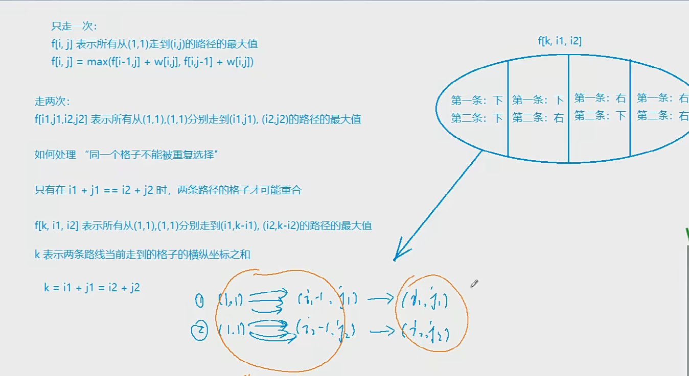
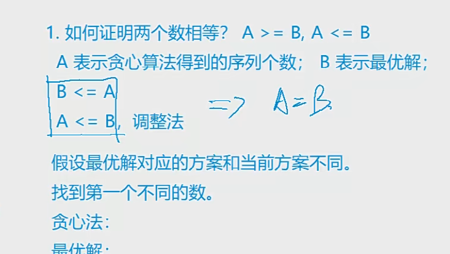
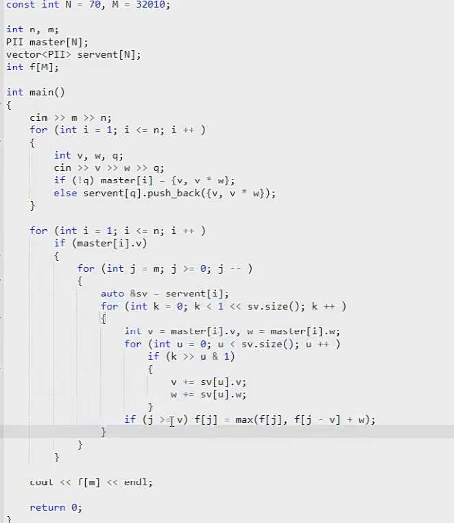
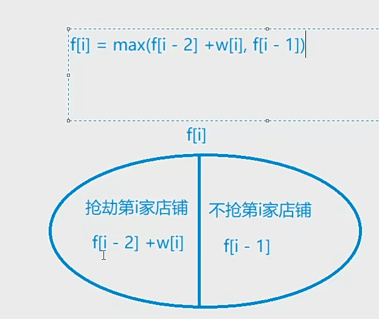

# 898. 数字三角形

给定一个如下图所示的数字三角形，从顶部出发，在每一结点可以选择移动至其左下方的结点或移动至其右下方的结点，一直走到底层，要求找出一条路径，使路径上的数字的和最大。

```
        7
      3   8
    8   1   0
  2   7   4   4
4   5   2   6   5
```

#### 输入格式

第一行包含整数 nn，表示数字三角形的层数。

接下来 nn 行，每行包含若干整数，其中第 ii 行表示数字三角形第 ii 层包含的整数。

#### 输出格式

输出一个整数，表示最大的路径数字和。

#### 数据范围

1≤n≤5001≤n≤500,
−10000≤三角形中的整数≤10000−10000≤三角形中的整数≤10000

#### 输入样例：

```
5
7
3 8
8 1 0 
2 7 4 4
4 5 2 6 5
```

#### 输出样例：

```
30
```

```python
n = int(input())

v = [list(map(int,input().split())) for _ in range(n)]

# f = [[0] * i for i in range(1,n+1)]
#
# f[n-1] = v[n-1]

for i in range(n-2,-1,-1):
    for j in range(0,i+1):
        v[i][j] += max(v[i+1][j],v[i+1][j+1])

print(v[0][0])
```


# 1015. 摘花生

Hello Kitty想摘点花生送给她喜欢的米老鼠。

她来到一片有网格状道路的矩形花生地(如下图)，从西北角进去，东南角出来。

地里每个道路的交叉点上都有种着一株花生苗，上面有若干颗花生，经过一株花生苗就能摘走该它上面所有的花生。

Hello Kitty只能向东或向南走，不能向西或向北走。

问Hello Kitty最多能够摘到多少颗花生。


#### 输入格式

第一行是一个整数T，代表一共有多少组数据。

接下来是T组数据。

每组数据的第一行是两个整数，分别代表花生苗的行数R和列数 C。

每组数据的接下来R行数据，从北向南依次描述每行花生苗的情况。每行数据有C个整数，按从西向东的顺序描述了该行每株花生苗上的花生数目M。

#### 输出格式

对每组输入数据，输出一行，内容为Hello Kitty能摘到得最多的花生颗数。

#### 数据范围

1≤T≤1001≤T≤100,
1≤R,C≤1001≤R,C≤100,
0≤M≤10000≤M≤1000

#### 输入样例：

```
2
2 2
1 1
3 4
2 3
2 3 4
1 6 5
```

#### 输出样例：

```
8
16
```

```python
# 摘花生思路
# 状态表示:
#   集合: 所有从(1,1)走到(i,j)的路线 虽然表示多种但最后要落实到一个属性
#   属性: max
# 状态计算: 对应集合的划分(如何算f[i,j])
#   划分依据: "最后一步" 从上面下来和从左边过来 f[i,j] = max(f[i-1,j],f[i,j-1] + v[i][j]
# 下标从(1,1)开始 则不需要初始化	


T = int(input())

while T:
    n, m = map(int, input().split())
    v = [list(map(int, input().split())) for _ in range(n)]
    f = [[0] * m for i in range(n)]
    f[0][0] = v[0][0]
    for i in range(1,n):
        f[i][0] = f[i-1][0] + v[i][0]
    for j in range(1,m):
        f[0][j] = f[0][j-1] + v[0][j]
    for i in range(1, n):
        for j in range(1, m):
            f[i][j] = max(f[i - 1][j], f[i][j - 1]) + v[i][j]
    print(f[n - 1][m - 1])
    T -= 1
```

# 1018. 最低通行费

一个商人穿过一个 N×NN×N 的正方形的网格，去参加一个非常重要的商务活动。

他要从网格的左上角进，右下角出。

每穿越中间 11 个小方格，都要花费 11 个单位时间。

商人必须在 (2N−1)(2N−1) 个单位时间穿越出去。

而在经过中间的每个小方格时，都需要缴纳一定的费用。

这个商人期望在规定时间内用最少费用穿越出去。

请问至少需要多少费用？

注意：不能对角穿越各个小方格（即，只能向上下左右四个方向移动且不能离开网格）。

#### 输入格式

第一行是一个整数，表示正方形的宽度 NN。

后面 NN 行，每行 NN 个不大于 100100 的正整数，为网格上每个小方格的费用。

#### 输出格式

输出一个整数，表示至少需要的费用。

#### 数据范围

1≤N≤1001≤N≤100

#### 输入样例：

```
5
1  4  6  8  10
2  5  7  15 17
6  8  9  18 20
10 11 12 19 21
20 23 25 29 33
```

#### 输出样例：

```
109
```

#### 样例解释

样例中，最小值为 109=1+2+5+7+9+12+19+21+33109=1+2+5+7+9+12+19+21+33。

```python
N = 110
n = int(input())
inf = 0x3f3f3f3f
v = [[0] * N for _ in range(N)]
f = [[inf] * N for _ in range(N)]
f[0][1] = 0
f[1][0] = 0

for i in range(1, n+1):
    v[i] = [0] + list(map(int, input().split()))

for i in range(1, n+1):
    for j in range(1, n+1):
        f[i][j] = min(f[i-1][j], f[i][j-1]) + v[i][j]

print(f[n][n])
```


# 1027. 方格取数




设有 N×N 的方格图，我们在其中的某些方格中填入正整数，而其它的方格中则放入数字0。如下图所示：


某人从图中的左上角 A 出发，可以向下行走，也可以向右行走，直到到达右下角的 B 点。

在走过的路上，他可以取走方格中的数（取走后的方格中将变为数字0）。

此人从 A 点到 B 点共走了两次，试找出两条这样的路径，使得取得的数字和为最大。

#### 输入格式

第一行为一个整数N，表示 N×N 的方格图。

接下来的每行有三个整数，第一个为行号数，第二个为列号数，第三个为在该行、该列上所放的数。

行和列编号从 11 开始。

一行“0 0 0”表示结束。

#### 输出格式

输出一个整数，表示两条路径上取得的最大的和。

#### 数据范围

N≤10

#### 输入样例：

```
8
2 3 13
2 6 6
3 5 7
4 4 14
5 2 21
5 6 4
6 3 15
7 2 14
0 0 0
```

#### 输出样例：

```
67
```

```python
#用 k 表示 k = i1+j1  = i2+ j2 用于判断是否重合
#

n = int(input())

f = [[[0] * (n + 1) for _ in range(n + 1)] for _ in range(n + n + 1)]

g = [[0] * (n + 1) for _ in range(n + 1)]

while True:
    x, y, w = map(int, input().split())
    if x == 0 and y == 0 and w == 0: break
    g[x][y] = w
    
for k in range(2, 2 * n + 1):
    for i1 in range(1, n + 1):
        for i2 in range(1, n + 1):
            j1, j2 = k - i1, k - i2
            if j1 > 0 and j1 <= n and j2 > 0 and j2 <= n:
                t = g[i1][j1]
                if i1 != i2: t += g[i2][j2]
                f[k][i1][i2] = max(f[k-1][i1][i2], f[k-1][i1-1][i2], f[k-1][i1][i2-1],f[k-1][i1-1][i2-1]) + t

print(f[n + n][n][n])
```


# 275. 传纸条


```python
n, m = map(int, input().split())

f = [[[0] * (n + 1) for _ in range(n + 1)] for _ in range(n + m + 1)]

g = [list(map(int, input().split())) for _ in range(n)]

for k in range(2, n + m + 1):
    for i1 in range(1, n + 1):
        for i2 in range(1, n + 1):
            j1, j2 = k - i1, k - i2
            if j1 > 0 and j1 <= m and j2 > 0 and j2 <= m:
                if i1 != i2 or k == 2 or k == n + m:
                    t = g[i1-1][j1-1] + g[i2-1][j2-1]
                    f[k][i1][i2] = max(f[k-1][i1][i2],f[k-1][i1-1][i2],f[k-1][i1][i2-1],f[k-1][i1-1][i2-1]) + t
                    

print(f[n + m][n][n])
```


## 


# 895. 最长上升子序列

给定一个长度为 N 的数列，求数值严格单调递增的子序列的长度最长是多少。

#### 输入格式

第一行包含整数 N。

第二行包含 N 个整数，表示完整序列。

#### 输出格式

输出一个整数，表示最大长度。

#### 数据范围

1≤N≤1000
−109≤数列中的数≤109

#### 输入样例：

```
7
3 1 2 1 8 5 6
```

#### 输出样例：

```
4
```

#### solution

```java
n = int(input())

a = list(map(int, input().split()))


f = [1] * n

ans = 1
for i in range(1, n):
    for j in range(i):
        if a[j] < a[i]:
            f[i] = max(f[i], f[j]+1)
    ans = max(f[i], ans)
print(ans)
```


# 1017. 怪盗基德的滑翔翼

怪盗基德是一个充满传奇色彩的怪盗，专门以珠宝为目标的超级盗窃犯。

而他最为突出的地方，就是他每次都能逃脱中村警部的重重围堵，而这也很大程度上是多亏了他随身携带的便于操作的滑翔翼。

有一天，怪盗基德像往常一样偷走了一颗珍贵的钻石，不料却被柯南小朋友识破了伪装，而他的滑翔翼的动力装置也被柯南踢出的足球破坏了。

不得已，怪盗基德只能操作受损的滑翔翼逃脱。

假设城市中一共有N幢建筑排成一条线，每幢建筑的高度各不相同。

初始时，怪盗基德可以在任何一幢建筑的顶端。

他可以选择一个方向逃跑，但是不能中途改变方向（因为中森警部会在后面追击）。

因为滑翔翼动力装置受损，他只能往下滑行（即：只能从较高的建筑滑翔到较低的建筑）。

他希望尽可能多地经过不同建筑的顶部，这样可以减缓下降时的冲击力，减少受伤的可能性。

请问，他最多可以经过多少幢不同建筑的顶部(包含初始时的建筑)？

#### 输入格式

输入数据第一行是一个整数K，代表有K组测试数据。

每组测试数据包含两行：第一行是一个整数N，代表有N幢建筑。第二行包含N个不同的整数，每一个对应一幢建筑的高度h，按照建筑的排列顺序给出。

#### 输出格式

对于每一组测试数据，输出一行，包含一个整数，代表怪盗基德最多可以经过的建筑数量。

#### 数据范围

1≤K≤100,
1≤N≤100,
0<h<10000

#### 输入样例：

```
3
8
300 207 155 299 298 170 158 65
8
65 158 170 298 299 155 207 300
10
2 1 3 4 5 6 7 8 9 10
```

#### 输出样例：

```
6
6
9
```

## 代码

```python
# 当然可以过 枚举了向左的起点 和向右的终点, 两者之间没影响
T = int(input())

while T > 0 :
    n = int(input())
    a = list(map(int, input().split(" ")))
    f = [1] * n
    g = [1] * n
    ans = 1
    for i in range(1, n):
        for j in range(i):
            if a[j] < a[i]:
                f[i] = max(f[i], f[j] + 1)
            elif a[j] > a[i]:
                g[i] = max(g[i], g[j] + 1)
        ans = max(ans, g[i], f[i])
        # ans = max(ans, f[i])
    print(ans)
    T -= 1
```


# 1014. 登山

五一到了，ACM队组织大家去登山观光，队员们发现山上一共有N个景点，并且决定按照顺序来浏览这些景点，即每次所浏览景点的编号都要大于前一个浏览景点的编号。

同时队员们还有另一个登山习惯，就是不连续浏览海拔相同的两个景点，并且一旦开始下山，就不再向上走了。

队员们希望在满足上面条件的同时，尽可能多的浏览景点，你能帮他们找出最多可能浏览的景点数么？

#### 输入格式

第一行包含整数N，表示景点数量。

第二行包含N个整数，表示每个景点的海拔。

#### 输出格式

输出一个整数，表示最多能浏览的景点数。

#### 数据范围

2≤N≤10002≤N≤1000

#### 输入样例：

```
8
186 186 150 200 160 130 197 220
```

```
100
114 87 90 88 106 146 126 146 54 85 106 80 99 110 64 67 106 73 65 57 149 106 140 53 98 131 65 127 96 140 83 103 124 72 59 97 89 121 105 136 130 138 51 65 67 150 104 56 128 95 141 80 132 146 136 135 55 116 115 103 150 77 131 147 99 114 88 87 79 126 134 57 150 137 140 112 123 70 79 109 60 139 131 98 136 96 58 72 69 110 71 148 86 96 86 75 107 80 95 91
```


#### 输出样例：

```
4


```

````
23
````


## Solution

```python
n = int(input())

a = list(map(int, input().split()))

f = [1] * n
g = [1] * n

ans = 1
for i in range(1, n):
    for j in range(i):
        if a[j] < a[i]:
            f[i] = max(f[i], f[j] + 1)
# 与上图不同 是不独立的
for i in range(n - 1, -1, -1):
    for j in range(n - 1, i, -1):
        if a[j] < a[i]:
            g[i] = max(g[i], g[j] + 1)


for i in range(n):
    # 为什么选定了f[i] g[i] 就是右边的最大值: 因为右边选的都要小于 a[i]
            ans = max(ans, f[i] + g[i] - 1)

print(ans)

```


# 482. 合唱队形

N 位同学站成一排，音乐老师要请其中的 (N−K) 位同学出列，使得剩下的 K位同学排成合唱队形。     

合唱队形是指这样的一种队形：设 K 位同学从左到右依次编号为 1，2…，K，他们的身高分别为 T1，T2，…，TK 则他们的身高满足 T1<…<Ti>Ti+1>…>TK(1≤i≤K)。     

你的任务是，已知所有 N 位同学的身高，计算最少需要几位同学出列，可以使得剩下的同学排成合唱队形。

#### 输入格式

输入的第一行是一个整数 N，表示同学的总数。

第二行有 N 个整数，用空格分隔，第 ii 个整数 TiTi 是第 ii 位同学的身高(厘米)。

#### 输出格式

输出包括一行，这一行只包含一个整数，就是最少需要几位同学出列。

#### 数据范围

2≤N≤100,
130≤Ti≤230

#### 输入样例：

```
8
186 186 150 200 160 130 197 220
```

#### 输出样例：

```
4
```

## Solution

```python
n = int(input())

a = list(map(int, input().split()))

f = [1] * n
g = [1] * n

ans = 1
for i in range(1, n):
    for j in range(i):
        if a[j] < a[i]:
            f[i] = max(f[i], f[j] + 1)

for i in range(n - 1, -1, -1):
    for j in range(n - 1, i, -1):
        if a[j] < a[i]:
            g[i] = max(g[i], g[j] + 1)


for i in range(n):
            ans = max(ans, f[i] + g[i] - 1)

print(n - ans)
```


# 1012. 友好城市

Palmia国有一条横贯东西的大河，河有笔直的南北两岸，岸上各有位置各不相同的N个城市。

北岸的每个城市有且仅有一个友好城市在南岸，而且不同城市的友好城市不相同。

每对友好城市都向政府申请在河上开辟一条直线航道连接两个城市，但是由于河上雾太大，政府决定避免任意两条航道交叉，以避免事故。

编程帮助政府做出一些批准和拒绝申请的决定，使得在保证任意两条航线不相交的情况下，被批准的申请尽量多。

#### 输入格式

第1行，一个整数N，表示城市数。

第2行到第n+1行，每行两个整数，中间用1个空格隔开，分别表示南岸和北岸的一对友好城市的坐标。

#### 输出格式

仅一行，输出一个整数，表示政府所能批准的最多申请数。

#### 数据范围

1≤N≤5000,
0≤xi≤10000

#### 输入样例：

```
7
22 4
2 6
10 3
15 12
9 8
17 17
4 2
```

#### 输出样例：

```
4
```

## Solution

```python
# 将第一维排序
# 求第二维的最长递增子序列
n = int(input())

a = [list(map(int, input().split())) for _ in range(n)]

a.sort()

f = [1] * n

ans = 1

for i in range(1, n):
    for j in range(i):
        if a[j][1] < a[i][1]:
            f[i] = max(f[i], f[j] + 1)
    ans = max(f[i], ans)

print(ans)

```


# 1016. 最长子序列和

一个数的序列 bibi，当 b1<b2<…<bSb1<b2<…<bS 的时候，我们称这个序列是上升的。

对于给定的一个序列(a1,a2,…,aNa1,a2,…,aN)，我们可以得到一些上升的子序列(ai1,ai2,…,aiKai1,ai2,…,aiK)，这里1≤i1<i2<…<iK≤N1≤i1<i2<…<iK≤N。

比如，对于序列(1,7,3,5,9,4,8)，有它的一些上升子序列，如(1,7),(3,4,8)等等。

这些子序列中和最大为18，为子序列(1,3,5,9)的和。

你的任务，就是对于给定的序列，求出最大上升子序列和。

注意，最长的上升子序列的和不一定是最大的，比如序列(100,1,2,3)的最大上升子序列和为100，而最长上升子序列为(1,2,3)。

#### 输入格式

输入的第一行是序列的长度N。

第二行给出序列中的N个整数，这些整数的取值范围都在0到10000(可能重复)。

#### 输出格式

输出一个整数，表示最大上升子序列和。

#### 数据范围

1≤N≤10001≤N≤1000

#### 输入样例：

```
7
1 7 3 5 9 4 8
```

#### 输出样例：

```
18
```

## Solution

```python
n = int(input())

a = list(map(int, input().split()))

f = [0] * n

ans = 0

for i in range(n):
    f[i] = a[i]
    for j in range(i):
        if a[j] < a[i]:
            f[i] = max(f[i],f[j] + a[i])
    ans = max(f[i], ans)
    
print(ans)
        
```


# 1010. 拦截导弹

某国为了防御敌国的导弹袭击，发展出一种导弹拦截系统。

但是这种导弹拦截系统有一个缺陷：虽然它的第一发炮弹能够到达任意的高度，但是以后每一发炮弹都不能高于前一发的高度。

某天，雷达捕捉到敌国的导弹来袭。

由于该系统还在试用阶段，所以只有一套系统，因此有可能不能拦截所有的导弹。

输入导弹依次飞来的高度（雷达给出的高度数据是不大于30000的正整数，导弹数不超过1000），计算这套系统最多能拦截多少导弹，如果要拦截所有导弹最少要配备多少套这种导弹拦截系统。

#### 输入格式

共一行，输入导弹依次飞来的高度。

#### 输出格式

第一行包含一个整数，表示最多能拦截的导弹数。

第二行包含一个整数，表示要拦截所有导弹最少要配备的系统数。

#### 数据范围

雷达给出的高度数据是不大于 3000030000 的正整数，导弹数不超过 10001000。

#### 输入样例：

```
389 207 155 300 299 170 158 65
```

#### 输出样例：

```
6
2
```

## Solution



```python
a = list(map(int, input().split()))

n = len(a)

f = [1] * n

# 如果按常规写法没有最长子序列的每个序列元素 怎么去掉 最长的子序列包含的那些: 记从哪个状态转移的过来的下标

# 简洁写法
# 统一考虑
# 389 207 155 300 299 170 158 65
# 从前往后: 第一一个装到一个子序列中, 后面的选择 让每个子序列的结尾尽可能的大(提升潜力) : 找到大于等于207(没有则新开)的最小值(贪心) 将207 加入
# 证明: 贪心法 与 最优解 的最后一个不同 进行交换进行证明
# 实现: 只存 每个序列的 尾部 尾部为单调递增的 增加 或者替换 还是递增
# 惊奇的发现: 同最长上升子序列 解法一致 得出子序列的全覆盖的最小方案数等于反链的最长长度

# 反链定理: 
a = list(map(int, input().split()))

n = len(a)

f = [1] * n
g = [1] * n

ans = 1
res = 1

for i in range(1, n):
    for j in range(i):
        if a[j] >= a[i]:
            f[i] = max(f[i], f[j] + 1)
        else:
            g[i] = max(g[i], g[j] + 1)
    ans = max(f[i], ans)
    res = max(g[i], res)
    

        
    
print(ans)
print(res)
# 
a = list(map(int, input().split()))
n = len(a)
f = [0] * n
cnt = 0
for i in range(n):
    # 非上升子序列的最小覆盖个数 以贪心为思想:保证个数的潜力 大于等于i的最小值(对于单调的而言是第一个大于等于他的)
    # 找到直接替换(加入一个已有的序列,并改变尾部)
    # 二分思想求最长上升子序列: 每个尾部尽可能小找到大于i的左边界 将它换了 cnt = max(cnt,l)
    l = 0
    r = cnt - 1
    while l <= r:
        mid = (l + r) // 2
        if f[mid] >= a[i]:
            r = mid - 1
        else:
            l = mid + 1
    f[l] = a[i]
    if l >= cnt:
        cnt += 1
print(cnt)


```


# 187. 导弹防御系统

爆搜 2的n次方

为了对抗附近恶意国家的威胁，RR 国更新了他们的导弹防御系统。

一套防御系统的导弹拦截高度要么一直 **严格单调** 上升要么一直 **严格单调** 下降。

例如，一套系统先后拦截了高度为 33 和高度为 44 的两发导弹，那么接下来该系统就只能拦截高度大于 44 的导弹。

给定即将袭来的一系列导弹的高度，请你求出至少需要多少套防御系统，就可以将它们全部击落。

#### 输入格式

输入包含多组测试用例。

对于每个测试用例，第一行包含整数 nn，表示来袭导弹数量。

第二行包含 nn 个**不同的**整数，表示每个导弹的高度。

当输入测试用例 n=0n=0 时，表示输入终止，且该用例无需处理。

#### 输出格式

对于每个测试用例，输出一个占据一行的整数，表示所需的防御系统数量。

#### 数据范围

1≤n≤501≤n≤50

#### 输入样例：

```
5
3 5 2 4 1
0 
```

#### 输出样例：

```
2
```

#### 样例解释

对于给出样例，最少需要两套防御系统。

一套击落高度为 3,43,4 的导弹，另一套击落高度为 5,2,15,2,1 的导弹。


# 896. 最长上升子序列II

不同长度子序列结尾的最小值: 

一定是单调递增的	:  找到 < a[i] 的最大值 如果二分找到小于t的右边界则 q[r+1] = num 如果找不到 则只能加在后面 q[len+1] = num

​																									增强增大的潜力

单调栈:  二分

给定一个长度为 N 的数列，求数值严格单调递增的子序列的长度最长是多少。

#### 输入格式

第一行包含整数 NN。

第二行包含 NN 个整数，表示完整序列。

#### 输出格式

输出一个整数，表示最大长度。

#### 数据范围

1≤N≤1000001≤N≤100000，
−109≤数列中的数≤109−109≤数列中的数≤109

#### 输入样例：

```
7
3 1 2 1 8 5 6
```

#### 输出样例：

```
4
```

## Solution

```python
      
```

# 897. 最长公共子序列

```python
n, m = map(int, input().split())

a = input()
b = input()

f = [[0] * (m+1) for _ in range(n+1)]

for i in range(1, n+1):
    for j in range(1, m+1):
        f[i][j] = max(f[i-1][j], f[i][j-1])
        if a[i-1] == b[j-1]:
            f[i][j] = max(f[i][j], f[i-1][j-1] + 1)

print(f[n][m])
```

# 272. 最长公共上升子序列


熊大妈的奶牛在小沐沐的熏陶下开始研究信息题目。

小沐沐先让奶牛研究了最长上升子序列，再让他们研究了最长公共子序列，现在又让他们研究最长公共上升子序列了。

小沐沐说，对于两个数列 AA 和 BB，如果它们都包含一段位置不一定连续的数，且数值是严格递增的，那么称这一段数是两个数列的公共上升子序列，而所有的公共上升子序列中最长的就是最长公共上升子序列了。

奶牛半懂不懂，小沐沐要你来告诉奶牛什么是最长公共上升子序列。

不过，只要告诉奶牛它的长度就可以了。

数列 AA 和 BB 的长度均不超过 30003000。

#### 输入格式

第一行包含一个整数 NN，表示数列 A，BA，B 的长度。

第二行包含 NN 个整数，表示数列 AA。

第三行包含 NN 个整数，表示数列 BB。

#### 输出格式

输出一个整数，表示最长公共上升子序列的长度。

#### 数据范围

1≤N≤30001≤N≤3000,序列中的数字均不超过 231−1231−1。

#### 输入样例：

```
4
2 2 1 3
2 1 2 3
```

#### 输出样例：

```
2
```

## Solution

```python
n = int(input())

a = list(map(int, input().split()))
b = list(map(int, input().split()))

#f[i][j] 所有前i个与前j个的, 以b[j] 为结尾的最长递增子序列的 长度最大值
f = [[0] * (n+1) for _ in range(n+1)]

for i in range(1,n+1):
    # 以a[i]为结尾的最长公共上升子序列长度
    maxv = 1
    for j in range(1,n+1):
        # 集合划分: 
        # 不包含a[i]
        f[i][j] = max(f[i][j], f[i-1][j])
    # 包含  a[i]
        if a[i-1] == b[j-1]:
            f[i][j] = max(maxv, f[i][j])
        # 以a[i] 之前的倒数第二个是哪个划分 b[1] ~ b[j]
        # 如果b[j] < a[i] 则可将max_v更新
        if b[j-1] < a[i-1]:
            maxv = max(maxv, f[i][j] + 1)

res = 0

for i in range(1,n+1):
    res = max(res, f[n][i])

print(res)
```


# 902. 最短编辑距离

给定两个字符串 AA 和 BB，现在要将 AA 经过若干操作变为 BB，可进行的操作有：

1. 删除–将字符串 AA 中的某个字符删除。
2. 插入–在字符串 AA 的某个位置插入某个字符。
3. 替换–将字符串 AA 中的某个字符替换为另一个字符。

现在请你求出，将 AA 变为 BB 至少需要进行多少次操作。

#### 输入格式

第一行包含整数 nn，表示字符串 AA 的长度。

第二行包含一个长度为 nn 的字符串 AA。

第三行包含整数 mm，表示字符串 BB 的长度。

第四行包含一个长度为 mm 的字符串 BB。

字符串中均只包含大小写字母。

#### 输出格式

输出一个整数，表示最少操作次数。

#### 数据范围

1≤n,m≤10001≤n,m≤1000

#### 输入样例：

```
10 
AGTCTGACGC
11 
AGTAAGTAGGC
```

#### 输出样例：

```
4
```

## Solution

```python
n = int(input())
a = input()
m = int(input())
b = input()

N = 1010
f = [[0] * N for _ in range(N)]

for i in range(1, n + 1): f[i][0] = i
for j in range(1, m + 1): f[0][j] = j

for i in range(1, n + 1):
    for j in range(1, m + 1):
        f[i][j] = min(f[i-1][j], f[i][j-1]) + 1
        if a[i-1] == b[j-1]:
            f[i][j] = min(f[i][j], f[i-1][j-1])
        else:
            f[i][j] = min(f[i][j], f[i-1][j-1] + 1)
            
print(f[n][m])
```


# 426. 开心的今明

金明今天很开心，家里购置的新房就要领钥匙了，新房里有一间他自己专用的很宽敞的房间。

更让他高兴的是，妈妈昨天对他说：“你的房间需要购买哪些物品，怎么布置，你说了算，只要不超过 NN 元钱就行”。

今天一早金明就开始做预算，但是他想买的东西太多了，肯定会超过妈妈限定的 NN 元。

于是，他把每件物品规定了一个重要度，分为 55 等：用整数 1∼51∼5 表示，第 55 等最重要。

他还从因特网上查到了每件物品的价格（都是整数元）。

他希望在不超过 NN 元（可以等于 NN 元）的前提下，使每件物品的价格与重要度的乘积的总和最大。 

设第 jj 件物品的价格为 v[j]v[j]，重要度为 w[j]w[j]，共选中了 kk 件物品，编号依次为 j1，j2，…，jkj1，j2，…，jk，则所求的总和为： 


v[j1]×w[j1]+v[j2]×w[j2]+…+v[jk]×w[jk]v[j1]×w[j1]+v[j2]×w[j2]+…+v[jk]×w[jk]


请你帮助金明设计一个满足要求的购物单。

#### 输入格式

输入文件的第 11 行，为两个正整数 NN 和 mm，用一个空格隔开。（其中 NN 表示总钱数，mm 为希望购买物品的个数） 

从第 22 行到第 m+1m+1 行，第 jj 行给出了编号为 j−1j−1 的物品的基本数据，每行有 22 个非负整数 vv 和 pp。（其中 vv 表示该物品的价格，pp 表示该物品的重要度）

#### 输出格式

输出文件只有一个正整数，为不超过总钱数的物品的价格与重要度乘积的总和的最大值（数据保证结果不超过 108108）。

#### 数据范围

1≤N<300001≤N<30000,
1≤m<251≤m<25,
0≤v≤100000≤v≤10000,
1≤p≤51≤p≤5

#### 输入样例：

```
1000 5
800 2
400 5
300 5
400 3
200 2
```

#### 输出样例：

```
3900
```

```python
m, n = map(int, input().split())

f = [0] * (m + 1)

for i in range(n):
    v, w = map(int, input().split())
    for j in range(m, v - 1, -1):
        f[j] = max(f[j], f[j - v] + v * w)

print(f[m])
```


# 1022. 宠物小精灵

宠物小精灵是一部讲述小智和他的搭档皮卡丘一起冒险的故事。

一天，小智和皮卡丘来到了小精灵狩猎场，里面有很多珍贵的野生宠物小精灵。

小智也想收服其中的一些小精灵。

然而，野生的小精灵并不那么容易被收服。

对于每一个野生小精灵而言，小智可能需要使用很多个精灵球才能收服它，而在收服过程中，野生小精灵也会对皮卡丘造成一定的伤害（从而减少皮卡丘的体力）。

当皮卡丘的体力小于等于0时，小智就必须结束狩猎（因为他需要给皮卡丘疗伤），而使得皮卡丘体力小于等于0的野生小精灵也不会被小智收服。

当小智的精灵球用完时，狩猎也宣告结束。

我们假设小智遇到野生小精灵时有两个选择：收服它，或者离开它。

如果小智选择了收服，那么一定会扔出能够收服该小精灵的精灵球，而皮卡丘也一定会受到相应的伤害；如果选择离开它，那么小智不会损失精灵球，皮卡丘也不会损失体力。

小智的目标有两个：主要目标是收服尽可能多的野生小精灵；如果可以收服的小精灵数量一样，小智希望皮卡丘受到的伤害越小（剩余体力越大），因为他们还要继续冒险。

现在已知小智的精灵球数量和皮卡丘的初始体力，已知每一个小精灵需要的用于收服的精灵球数目和它在被收服过程中会对皮卡丘造成的伤害数目。

请问，小智该如何选择收服哪些小精灵以达到他的目标呢？

#### 输入格式

输入数据的第一行包含三个整数：N，M，K，分别代表小智的精灵球数量、皮卡丘初始的体力值、野生小精灵的数量。

之后的K行，每一行代表一个野生小精灵，包括两个整数：收服该小精灵需要的精灵球的数量，以及收服过程中对皮卡丘造成的伤害。

#### 输出格式

输出为一行，包含两个整数：C，R，分别表示最多收服C个小精灵，以及收服C个小精灵时皮卡丘的剩余体力值最多为R。

#### 数据范围

0<N≤10000<N≤1000,
0<M≤5000<M≤500,
0<K≤1000<K≤100

#### 输入样例1：

```
10 100 5
7 10
2 40
2 50
1 20
4 20
```

#### 输出样例1：

```
3 30
```

#### 输入样例2：

```
10 100 5
8 110
12 10
20 10
5 200
1 110
```

#### 输出样例2：

```
0 100
```

## Solution

```python

V1, d, n = map(int, input().split())

f = [[0] * (d + 1) for _ in range(V1 + 1)]

for i in range(n):
    v1, v2 = map(int, input().split())
    for j in range(V1, v1 -1, -1):
        for k in range(d, v2 - 1, -1):
            f[j][k] = max(f[j][k], f[j - v1][k - v2] + 1)

res = f[V1][d-1]

for i in range(d):
    if f[V1][i] == res:
        print(res,d - i)
        break
```


# 1020. 潜水员


## 体积至少是j

潜水员为了潜水要使用特殊的装备。

他有一个带2种气体的气缸：一个为氧气，一个为氮气。

让潜水员下潜的深度需要各种数量的氧和氮。

潜水员有一定数量的气缸。

每个气缸都有重量和气体容量。

潜水员为了完成他的工作需要特定数量的氧和氮。

他完成工作所需气缸的总重的最低限度的是多少？

例如：潜水员有5个气缸。每行三个数字为：氧，氮的（升）量和气缸的重量：

```
3 36 120

10 25 129

5 50 250

1 45 130

4 20 119
```

如果潜水员需要5升的氧和60升的氮则总重最小为249（1，2或者4，5号气缸）。

你的任务就是计算潜水员为了完成他的工作需要的气缸的重量的最低值。

#### 输入格式

第一行有2个整数 m，n。它们表示氧，氮各自需要的量。

第二行为整数 kk 表示气缸的个数。

此后的 kk 行，每行包括ai，bi，ciai，bi，ci，3个整数。这些各自是：第 ii 个气缸里的氧和氮的容量及气缸重量。

#### 输出格式

仅一行包含一个整数，为潜水员完成工作所需的气缸的重量总和的最低值。

#### 数据范围

1≤m≤211≤m≤21,
1≤n≤791≤n≤79,
1≤k≤10001≤k≤1000,
1≤ai≤211≤ai≤21,
1≤bi≤791≤bi≤79,
1≤ci≤8001≤ci≤800

#### 输入样例：

```
5 60
5
3 36 120
10 25 129
5 50 250
1 45 130
4 20 119
```

#### 输出样例：

```
249
```

```python
N, M = 31, 90

f = [[0x3f3f3f3f] * M for _ in range(N)]
f[0][0] = 0

V1, V2 = map(int, input().split())

n = int(input())

for i in range(n):
    v1, v2, w = map(int, input().split())
    for j in range(N - 1, v1 - 1, -1):
        for k in range(M - 1, v2 - 1, -1):
            f[j][k] = min(f[j][k], f[j - v1][k - v2] + w)
            

res = 0x3f3f3f3f

for i in range(N - 1, V1 - 1, -1):
    for j in range(M - 1, V2 - 1, -1):
        res = min(res, f[i][j])

print(res)
```

```python
m, n = map(int, input().split())

k = int(input())

# 这里是至少
f = [[0x3f3f3f3f] * (n + 1) for _ in range(m + 1)]

f[0][0] = 0

for i in range(k):
    a, b, c = map(int, input().split())
    for j in range(m, -1, -1):
        for q in range(n, -1, -1):
            f[j][q] = min(f[j][q], f[max(0, j - a)][max(0, q - b)] + c)

print(f[m][n])
```


# 1019. 庆功会

为了庆贺班级在校运动会上取得全校第一名成绩，班主任决定开一场庆功会，为此拨款购买奖品犒劳运动员。

期望拨款金额能购买最大价值的奖品，可以补充他们的精力和体力。

#### 输入格式

第一行二个数n，m，其中n代表希望购买的奖品的种数，m表示拨款金额。

接下来n行，每行3个数，v、w、s，分别表示第I种奖品的价格、价值（价格与价值是不同的概念）和能购买的最大数量（买0件到s件均可）。

#### 输出格式

一行：一个数，表示此次购买能获得的最大的价值（注意！不是价格）。

#### 数据范围

n≤500,m≤6000n≤500,m≤6000,
v≤100,w≤1000,s≤10v≤100,w≤1000,s≤10

#### 输入样例：

```
5 1000
80 20 4
40 50 9
30 50 7
40 30 6
20 20 1
```

#### 输出样例：

```
1040
```

## Solution

```python
n, m = map(int, input().split())

f = [0] * (m + 1)
for i in range(n):
    v, w, s = map(int, input().split())
    for j in range(m, -1, -1):
        for k in range(s + 1):
            if (k * v) > j: break
            f[j] = max(f[j], f[j - k * v] + k * w)

print(f[m])
    
```


# 1013. 机器分配

```python
n, m = map(int, input().split())

a = [list(map(int, input().split())) for _ in range(n)]

f = [0] * (m + 1)

for i in range(n):
    for j in range(m, 0, -1):
        for k in range(1, j + 1):
            f[j] = max(f[j],f[j - k] + a[i][k-1])
            
print(f[m])
```

```python
n, m = map(int, input().split())

a = [list(map(int, input().split())) for _ in range(n)]

f = [0] * (m + 1)

for i in range(n):
    for j in range(m, 0, -1):
        for k in range(1, j + 1):
            f[j] = max(f[j],f[j - k] + a[i][k-1])
            
print(f[m])
```

# 487. 金明的预算方案

金明今天很开心，家里购置的新房就要领钥匙了，新房里有一间金明自己专用的很宽敞的房间。

更让他高兴的是，妈妈昨天对他说：“你的房间需要购买哪些物品，怎么布置，你说了算，只要不超过N元钱就行”。

今天一早，金明就开始做预算了，他把想买的物品分为两类：主件与附件，附件是从属于某个主件的，下表就是一些主件与附件的例子：


如果要买归类为附件的物品，必须先买该附件所属的主件。

每个主件可以有0个、1个或2个附件。

附件不再有从属于自己的附件。

金明想买的东西很多，肯定会超过妈妈限定的N元。

于是，他把每件物品规定了一个重要度，分为5等：用整数1~5表示，第5等最重要。

他还从因特网上查到了每件物品的价格（都是10元的整数倍）。

他希望在不超过N元（可以等于N元）的前提下，使每件物品的价格与重要度的乘积的总和最大。

设第j件物品的价格为v[j]，重要度为w[j]，共选中了k件物品，编号依次为j1，j2，…，jkj1，j2，…，jk，则所求的总和为：

v[j1]∗w[j1]+v[j2]∗w[j2]+…+v[jk]∗w[jk]v[j1]∗w[j1]+v[j2]∗w[j2]+…+v[jk]∗w[jk]（其中*为乘号）

请你帮助金明设计一个满足要求的购物单。

#### 输入格式

输入文件的第1行，为两个正整数，用一个空格隔开：N m，其中N表示总钱数，m为希望购买物品的个数。

从第2行到第m+1行，第j行给出了编号为j-1的物品的基本数据，每行有3个非负整数v p q，其中v表示该物品的价格，p表示该物品的重要度（1~5），q表示该物品是主件还是附件。

如果q=0，表示该物品为主件，如果q>0，表示该物品为附件，q是所属主件的编号。

#### 输出格式

输出文件只有一个正整数，为不超过总钱数的物品的价格与重要度乘积的总和的最大值（<200000）。

#### 数据范围

N<32000,m<60,v<10000N<32000,m<60,v<10000

#### 输入样例：

```
1000 5
800 2 0
400 5 1
300 5 1
400 3 0
500 2 0
```

#### 输出样例：

```
2200
```

```python

```




# 1023. 买书


## Solution

```python
n = int(input())

a = [10, 20, 50, 100]

f = [0] * (n + 1)

f[0] = 1


for i in range(4):
    for j in range(a[i], n+1):
        f[j] = f[j] + f[j - a[i]]

print(f[n])
```


# 1021. 货币系统

给你一个n种面值的货币系统，求组成面值为m的货币有多少种方案。

#### 输入格式

第一行，包含两个整数n和m。

接下来n行，每行包含一个整数，表示一种货币的面值。

#### 输出格式

共一行，包含一个整数，表示方案数。

#### 数据范围

n≤15,m≤3000n≤15,m≤3000

#### 输入样例：

```
3 10
1
2
5
```

#### 输出样例：

```
10
```

```python
n, m = map(int, input().split())

f = [0] * (m + 1)
f[0] = 1
for i in range(n):
    v = int(input())
    for j in range(v, m + 1):
        f[j] += f[j - v] 

print(f[m])
```


# 278. 数字组合

给定 NN 个正整数 A1,A2,…,ANA1,A2,…,AN，从中选出若干个数，使它们的和为 MM，求有多少种选择方案。

#### 输入格式

第一行包含两个整数 NN 和 MM。

第二行包含 NN 个整数，表示 A1,A2,…,ANA1,A2,…,AN。

#### 输出格式

包含一个整数，表示可选方案数。

#### 数据范围

1≤N≤1001≤N≤100,
1≤M≤100001≤M≤10000,
1≤Ai≤10001≤Ai≤1000,
答案保证在 int 范围内。

#### 输入样例：

```
4 4
1 1 2 2
```

#### 输出样例：

```
3
```

## Solution

```python
n, m = map(int, input().split())

a = list(map(int, input().split()))

f = [0] * (m + 1)
f[0] = 1


for i in range(n):
    for j in range(m, a[i] - 1, -1):
        f[j] += f[j - a[i]]
        
print(f[m])
    
```

# 货币系统

在网友的国度中共有 nn 种不同面额的货币，第 ii 种货币的面额为 a[i]a[i]，你可以假设每一种货币都有无穷多张。

为了方便，我们把货币种数为 nn、面额数组为 a[1..n]a[1..n] 的货币系统记作 (n,a)(n,a)。 

在一个完善的货币系统中，每一个非负整数的金额 xx 都应该可以被表示出，即对每一个非负整数 xx，都存在 nn 个非负整数 t[i]t[i] 满足 a[i]×t[i]a[i]×t[i] 的和为 xx。

然而，在网友的国度中，货币系统可能是不完善的，即可能存在金额 xx 不能被该货币系统表示出。

例如在货币系统 n=3, a=[2,5,9]n=3, a=[2,5,9] 中，金额 1,31,3 就无法被表示出来。 

两个货币系统 (n,a)(n,a) 和 (m,b)(m,b) 是等价的，当且仅当对于任意非负整数 xx，它要么均可以被两个货币系统表出，要么不能被其中任何一个表出。 

现在网友们打算简化一下货币系统。

他们希望找到一个货币系统 (m,b)(m,b)，满足 (m,b)(m,b) 与原来的货币系统 (n,a)(n,a) 等价，且 mm 尽可能的小。

他们希望你来协助完成这个艰巨的任务：找到最小的 mm。

#### 输入格式

输入文件的第一行包含一个整数 TT，表示数据的组数。

接下来按照如下格式分别给出 TT 组数据。 

每组数据的第一行包含一个正整数 nn。

接下来一行包含 nn 个由空格隔开的正整数 a[i]a[i]。

#### 输出格式

输出文件共有 TT 行，对于每组数据，输出一行一个正整数，表示所有与 (n,a)(n,a) 等价的货币系统 (m,b)(m,b) 中，最小的 mm。

#### 数据范围

1≤n≤1001≤n≤100,
1≤a[i]≤250001≤a[i]≤25000,
1≤T≤201≤T≤20

#### 输入样例：

```
2 
4 
3 19 10 6 
5 
11 29 13 19 17 
```

#### 输出样例：

```
2
5
```


# 货币系统II

```python
T = int(input())

while T:
    n = int(input())
    a = list(map(int, input().split()))
    a.sort()

    m = a[n - 1]
    f = [0] * (m + 1)
    f[0] = 1

    res = 0
    for i in range(0, n):
        # 第i个数能否被前i-1个数表示出来
        if f[a[i]] == 0:
            res += 1
        for j in range(a[i], m + 1):
            f[j] += f[j - a[i]]

    print(res)
    T -= 1
```


# 大盗阿福




```python
不用 f[i-2] 怎么表示出 能不能选第i家店铺 为了分清楚 可以用状态机分解为
f[i][0] 选
f[i][1] 不选 
这两种状态就很清楚了
```

```python
T = int(input())
while T:
    n = int(input())
    f = [[0] * 2 for _ in range(n + 1)]
    a = list(map(int, input().split()))
    
    for i in range(1, n + 1):
        f[i][0] = max(f[i-1][0],f[i-1][1])
        f[i][1] = f[i-1][0] + a[i - 1]
        
    print(max(f[n][0],f[n][1]))
    T -= 1
```

# 蒙德里安的梦想

求把 N×MN×M 的棋盘分割成若干个 1×21×2 的长方形，有多少种方案。

例如当 N=2，M=4N=2，M=4 时，共有 55 种方案。当 N=2，M=3N=2，M=3 时，共有 33 种方案。

如下图所示：


#### 输入格式

输入包含多组测试用例。

每组测试用例占一行，包含两个整数 NN 和 MM。

当输入用例 N=0，M=0N=0，M=0 时，表示输入终止，且该用例无需处理。

#### 输出格式

每个测试用例输出一个结果，每个结果占一行。

#### 数据范围

1≤N,M≤111≤N,M≤11

#### 输入样例：

```
1 2
1 3
1 4
2 2
2 3
2 4
2 11
4 11
0 0
```

#### 输出样例：

```
1
0
1
2
3
5
144
51205
```

```python
#问题转化: 确定行的方案数即可: 行摆放确定 则方案确定
while True:
    n, m = map(int, input().split())
    if n == 0 and m == 0: break
    
    f = [[0] * (1 << n) for _ in range(m + 1)]
    
    st = [True] * (1 << n)
    
    for i in range(1 << n):
        cnt = 0
        for j in range(n):
            if (i >> j) & 1:
                if cnt % 2 == 1: st[i] = False
                cnt = 0
            else: cnt += 1
        
        if cnt % 2 == 1: st[i] = False
    
    f[0][0] = 1
    
    for i in range(1, m + 1):
        for j in range(1 << n):
            for k in range(1 << n):
                if (j & k == 0) and st[j | k]:
                    f[i][j] += f[i-1][k]
    
    print(f[m][0])
    

```

