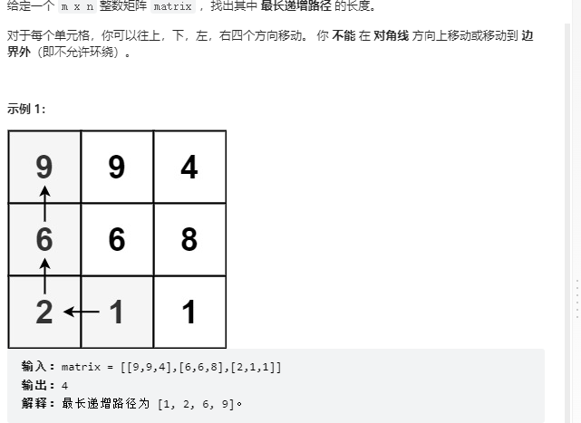
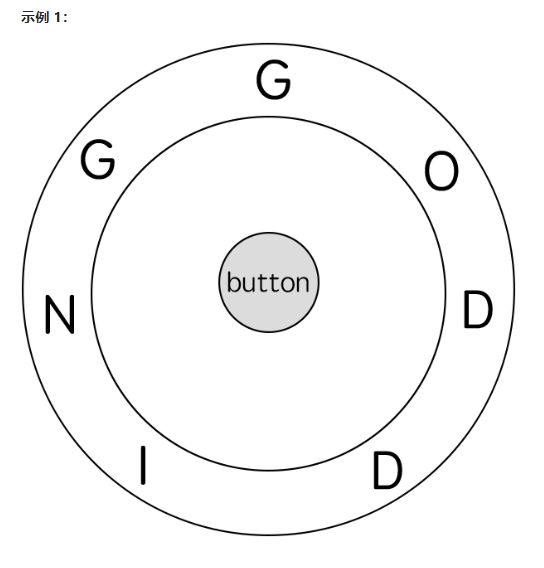

# 10. 正则表达式匹配

给你一个字符串 `s` 和一个字符规律 `p`，请你来实现一个支持 `'.'` 和 `'*'` 的正则表达式匹配。

- `'.'` 匹配任意单个字符
- `'*'` 匹配零个或多个前面的那一个元素

所谓匹配，是要涵盖 **整个** 字符串 `s`的，而不是部分字符串。

**示例 1：**

```
输入：s = "aa", p = "a"
输出：false
解释："a" 无法匹配 "aa" 整个字符串。
```

**示例 2:**

```
输入：s = "aa", p = "a*"
输出：true
解释：因为 '*' 代表可以匹配零个或多个前面的那一个元素, 在这里前面的元素就是 'a'。因此，字符串 "aa" 可被视为 'a' 重复了一次。
```

**示例 3：**

```
输入：s = "ab", p = ".*"
输出：true
解释：".*" 表示可匹配零个或多个（'*'）任意字符（'.'）。
```

 

**提示：**

- `1 <= s.length <= 20`
- `1 <= p.length <= 30`
- `s` 只包含从 `a-z` 的小写字母。
- `p` 只包含从 `a-z` 的小写字母，以及字符 `.` 和 `*`。
- 保证每次出现字符 `*` 时，前面都匹配到有效的字符

## Solution

```python
class Solution:
    def isMatch(self, s: str, p: str) -> bool:
        n, m = len(s), len(p)
        s = " " + s
        p = " " + p
        f = [[False] * (m+1) for _ in range(n+1)]
        f[0][0] = True

        for i in range(0, n + 1):
            for j in range(0, m + 1):
                if i == 0 and j == 0: f[i][j] = True
                if j + 1 <= m and p[j+1] == '*': continue
                if i > 0 and j > 0 and (p[j] == '.' or p[j] == s[i]):
                    f[i][j] = f[i-1][j-1] 
                if p[j] == '*' and j > 1:
                    f[i][j] = f[i][j-2] or f[i-1][j] and (s[i] == p[j-1] or p[j-1] == '.')
                print(i,j,f[i][j])
                    # f[i][j] = f[i][j-2] or f[i-1][j-2] and (s[i]与p[j-1]匹配) or f[i-2][j-2] and(s[i-1:i]与p[j-1]匹配)
                    # 
                    # f[i-1][j] =             f[i-1][j-2]                      or f[i-2][j-2] and (s[i-1]与p[j-1]匹配)
                    # 发现每一项都比上面的少一个(s[i]与p[j-1]匹配) = x左边加上 and x就能替代
                    
        return f[n][m]
```

# 44. 通配符匹配


## Solution

```java
class Solution {
    public boolean isMatch(String s, String p) {
        int n = s.length();
        int m = p.length();
        s = " " + s;
        p = " " + p;
        boolean[][] f = new boolean[n+1][m+1];
        for (int i = 0; i <= n; i++) {
            for (int j = 0; j <= m; j++) {
                char a = s.charAt(i), b = p.charAt(j);
                if (i == 0 && j == 0) f[i][j] = true;
                if ((i > 0 && j > 0) && (b == '?' || b == a)) f[i][j] = f[i-1][j-1];
                if (b == '*') {
                    // f[i][j] = f[i][j-1] || f[i-1][j-1] || f[i-2][j-1] ..
                    //    f[i-1][j] =            f[i-1][j-1] || f[i-2][j-1] 
                    if (i > 0) f[i][j] = f[i][j] || f[i-1][j];
                    if (j > 0) f[i][j] = f[i][j] || f[i][j-1];
                }
            }
        }
        return f[n][m];
    }
}
```


# 573.机器人的运动范围


地上有一个m行n列的方格，从坐标 `[0,0]` 到坐标 `[m-1,n-1]` 。一个机器人从坐标 `[0, 0] `的格子开始移动，它每次可以向左、右、上、下移动一格（不能移动到方格外），也不能进入行坐标和列坐标的数位之和大于k的格子。例如，当k为18时，机器人能够进入方格 [35, 37] ，因为3+5+3+7=18。但它不能进入方格 [35, 38]，因为3+5+3+8=19。请问该机器人能够到达多少个格子？

 

**示例 1：**

```
输入：m = 2, n = 3, k = 1
输出：3
```

**示例 2：**

```
输入：m = 3, n = 1, k = 0
输出：1
```

**提示：**

- `1 <= n,m <= 100`
- `0 <= k <= 20`


```java
class Solution {
    int res;
    public int movingCount(int m, int n, int k) {
        res = 0;
        //bfs,dfs(递归)四个方向 走回头路 坐标
        boolean[][] vis = new boolean[m][n];
        dfs(m,n,0,0,k,vis);
        return res;

    }
    private void dfs(int m, int n, int i, int j, int k,boolean[][] vis){
        if(i<0 || j<0 || i==m || j==n) return ;
        if(!checkIj(i,j,k)) return ;
        if(vis[i][j]) return; //干脆不走回头路
        res++;
        vis[i][j] = true;
        //缩小了规模 总有一天会跳出
        dfs(m,n,i+1,j,k,vis);
        dfs(m,n,i,j+1,k,vis);
        //下面这两步回溯会帮你干
        // dfs(m,n,i-1,j,k,vis);
        // dfs(m,n,i,j-1,k,vis);
    }
    //判断下标的数位之和 
    private boolean checkIj(int i, int j, int k){
        int comp = 0;
        while(i != 0 || j != 0){
            comp += i%10;
            comp += j%10;
            j /= 10;
            i /= 10;
        }
        return comp <= k;
    }
}
```

# 329. 矩阵中的最长递增路径



```java
class Solution {
    static final int[][] dirs = new int[][]{{1,0},{-1,0},{0,-1},{0,1}};
    public int longestIncreasingPath(int[][] matrix) {
        // dfs 记忆化
        int n = matrix.length;
        int m = matrix[0].length;
        int ans = 1;
        int[][] memo = new int[n][m];
        for (int i = 0; i < n; i++)
            for (int j = 0; j < m; j++) {
                ans = Math.max(ans,dfs(matrix,memo,i,j));
            }
        return ans;
    }
    private int dfs(int[][] matrix, int[][] memo, int row, int col) {
        if (memo[row][col] != 0) {
            return memo[row][col];
        }
        memo[row][col]++;
        int n = matrix.length;
        int m = matrix[0].length;
        for (int[] dir : dirs) {
            int newRow = row + dir[0], newCol = col + dir[1];
            if (newRow < 0 || newRow == n || newCol < 0 || newCol == m || matrix[newRow][newCol] <= matrix[row][col]) continue;
            memo[row][col] = Math.max(memo[row][col],dfs(matrix,memo,newRow,newCol) + 1);
        }
        return memo[row][col];
    }
}
```

# 514. 自由之路

电子游戏“辐射4”中，任务 “通向自由” 要求玩家到达名为 “Freedom Trail Ring” 的金属表盘，并使用表盘拼写特定关键词才能开门。

给定一个字符串 ring ，表示刻在外环上的编码；给定另一个字符串 key ，表示需要拼写的关键词。您需要算出能够拼写关键词中所有字符的最少步数。

最初，ring 的第一个字符与 12:00 方向对齐。您需要顺时针或逆时针旋转 ring 以使 key 的一个字符在 12:00 方向对齐，然后按下中心按钮，以此逐个拼写完 key 中的所有字符。

旋转 ring 拼出 key 字符 key[i] 的阶段中：

您可以将 ring 顺时针或逆时针旋转 一个位置 ，计为1步。旋转的最终目的是将字符串 ring 的一个字符与 12:00 方向对齐，并且这个字符必须等于字符 key[i] 。
如果字符 key[i] 已经对齐到12:00方向，您需要按下中心按钮进行拼写，这也将算作 1 步。按完之后，您可以开始拼写 key 的下一个字符（下一阶段）, 直至完成所有拼写。


示例 1：




输入: ring = "godding", key = "gd"
输出: 4
解释:
 对于 key 的第一个字符 'g'，已经在正确的位置, 我们只需要1步来拼写这个字符。 
 对于 key 的第二个字符 'd'，我们需要逆时针旋转 ring "godding" 2步使它变成 "ddinggo"。
 当然, 我们还需要1步进行拼写。
 因此最终的输出是 4。
示例 2:

输入: ring = "godding", key = "godding"
输出: 13


提示：

1 <= ring.length, key.length <= 100
ring 和 key 只包含小写英文字母
保证 字符串 key 一定可以由字符串  ring 旋转拼出

来源：力扣（LeetCode）
链接：https://leetcode.cn/problems/freedom-trail
著作权归领扣网络所有。商业转载请联系官方授权，非商业转载请注明出处。

```java
class Solution {
    int[][] memo;
    Map<Character,List<Integer>> map;
    public int findRotateSteps(String ring, String key) {
        //逆转顺转 每一步都最短 是不行的,比如DI 需要知道所有代价
        map = new HashMap<>();
        int n = ring.length();
        for (int i = 0; i < n; i++) {
            char c = ring.charAt(i);
            if (map.containsKey(c)) {
                map.get(c).add(i);
            } else {
                map.put(c,new ArrayList<>());
                map.get(c).add(i);
            }
        }
        memo = new int[ring.length()][key.length()];
        return dp(ring,key,0,0);
        
    }
    //i 当前12点   j 需要输入的字符位置 返回 包括j之后的最优
    
    public int dp(String ring, String key, int i, int j) {
        if (j == key.length()) return 0;
        if (memo[i][j] != 0) return memo[i][j];
        int best = Integer.MAX_VALUE;
        char c = key.charAt(j);
        for (int index : map.get(c)) {
            int next = dp(ring,key,index,j+1);
            //处理循环,因为next 固定 只需要找到最小的dealt 分支是由for循环完成的
            int delta = (int)Math.abs(index - i);
            delta = Math.min(delta,ring.length() - delta);

            best = Math.min(best,delta + 1 + next);
        }
        memo[i][j] = best;
        return best;

    }
}
```

