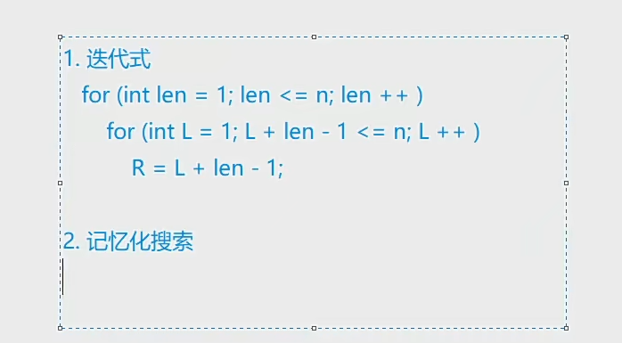
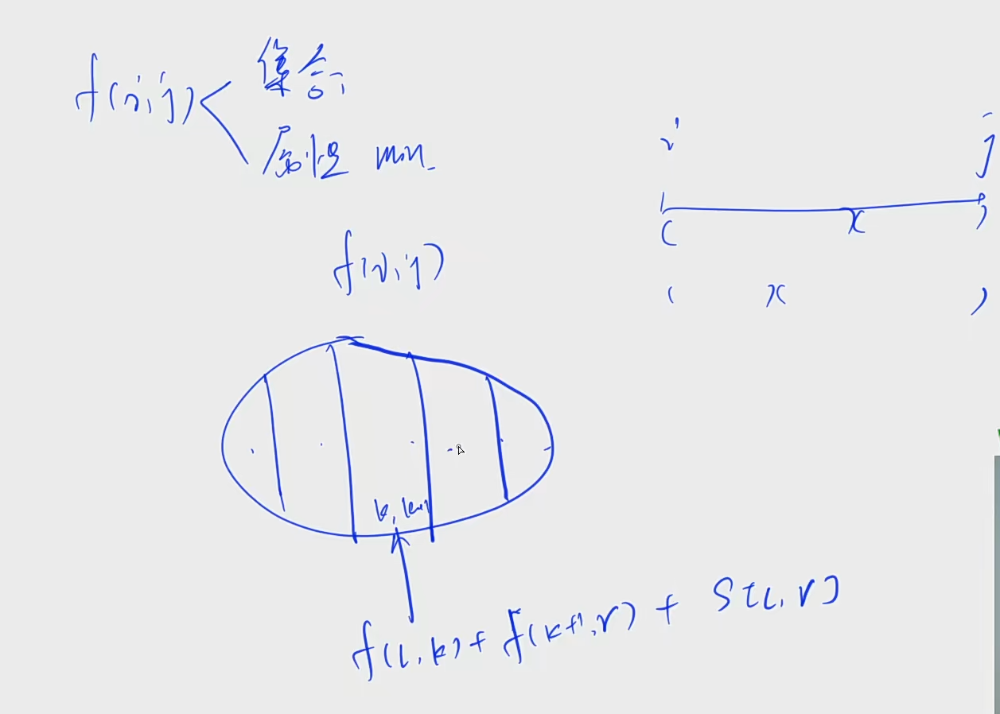
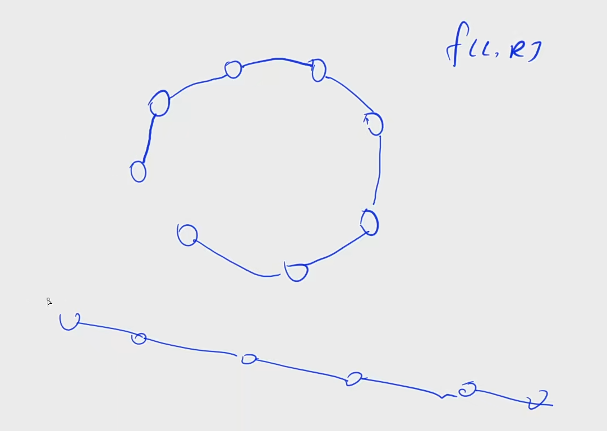
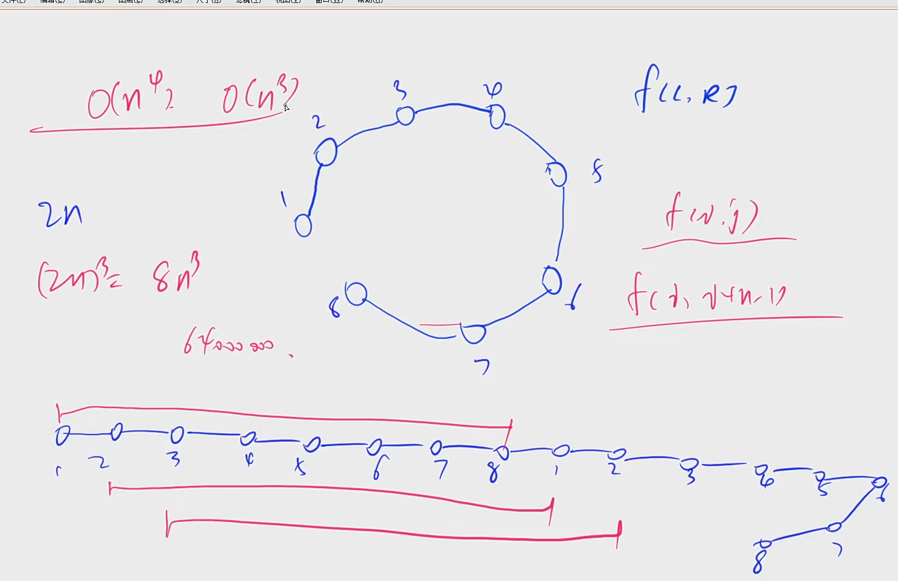

## 方法论


## 区间DP

### 模板




### 合并石子



设有 NN 堆石子排成一排，其编号为 1，2，3，…，N1，2，3，…，N。

每堆石子有一定的质量，可以用一个整数来描述，现在要将这 NN 堆石子合并成为一堆。

每次只能合并相邻的两堆，合并的代价为这两堆石子的质量之和，合并后与这两堆石子相邻的石子将和新堆相邻，合并时由于选择的顺序不同，合并的总代价也不相同。

例如有 44 堆石子分别为 `1 3 5 2`， 我们可以先合并 1、21、2 堆，代价为 44，得到 `4 5 2`， 又合并 1，21，2 堆，代价为 99，得到 `9 2` ，再合并得到 1111，总代价为 4+9+11=244+9+11=24；

如果第二步是先合并 2，32，3 堆，则代价为 77，得到 `4 7`，最后一次合并代价为 1111，总代价为 4+7+11=224+7+11=22。

问题是：找出一种合理的方法，使总的代价最小，输出最小代价。

#### 输入格式

第一行一个数 NN 表示石子的堆数 NN。

第二行 NN 个数，表示每堆石子的质量(均不超过 10001000)。

#### 输出格式

输出一个整数，表示最小代价。

#### 数据范围

1≤N≤3001≤N≤300

#### 输入样例：

```
4
1 3 5 2
```

#### 输出样例：

```
22
```

#### 代码

```java
import java.util.*;

class Main{
	public static void main(String[] args) {
        Scanner in = new Scanner(System.in);
        int n = in.nextInt();
        int N = n + 10;
        int[] w = new int[N];
        int[] s = new int[N];
        int[][] f = new int[N][N];
        for (int i = 1; i <= n ; i++) {
            w[i] = in.nextInt();
        }
        for (int  i = 1; i <= n; i++) s[i] = s[i-1] + w[i];
       	
        for (int len = 1; len <= n; len++) {
			for (int l == 1; i + len - 1 <= n; l++) {
                int r = i + len - 1;
                if (len == 1) f[l][r] = 0;
                else {
                    for (int k = l; k < r; k++) {
                        f[l][r] = Math.max(f[l][r],f[l][k] + f[k+1][r] + s[r] - s[l-1]);
                    }
                    
                }
            }
        }
        System.out.println(f[1][n])
    }
}
```


### 环形石子合并 可以首尾

n的四次方枚举缺口



优化

环形DP



```java
import java.util.*;

class Main{
    static final int INF = Integer.MAX_VALUE / 2;
	public static void main(String[] args) {
        Scanner in = new Scanner(System.in);
        int n = in.nextInt();
        int N = 2 * n + 10;
        int[] w = new int[N];
        int[] s = new int[N];
        int[][] f = new int[N][N];
        int[][] g = new int[N][N];
        for (int i = 1; i <= n ; i++) {
            w[i] = in.nextInt();
            w[i+n] = w[i];
        }
        for (int  i = 1; i <= 2 * n; i++) s[i] = s[i-1] + w[i];
        for (int i = 0; i < N; i++) {
            Arrays.fill(f[i],-INF);
            Arrays.fill(g[i],INF);
        }
       	
        for (int len = 1; len <= n; len++) {
			for (int l == 1; i + len - 1 <= 2 * n; l++) {
                int r = i + len - 1;
                if (len == 1) f[l][r] = 0;
                else {
                    for (int k = l; k < r; k++) {
                        f[l][r] = Math.max(f[l][r],f[l][k] + f[k+1][r] + s[r] - s[l-1]);
                        g[l][r] = Math.min(f[l][r],f[l][k] + f[k+1][r] + s[r] - s[l-1]);
                    }
                }
            }
        }
        int maxv = -INF, minv = INF;
        for (int i = 1; i <= n; i++) {
            maxv = Math.max(f[i][i+n-1]);
            minv = Math.min(g[i][i+n-1]);
        }
        
        System.out.println(minv);
        System.out.println(maxv);
        
    }
}
```

## leetcode

### 最长回文子串

```java
class Solution {
    public String longestPalindrome(String s) {
        int n = s.length();
        int N = n + 10;
        boolean[][] f = new boolean[N][N];
        int max = 0;
        int ll = 1;
        int rr = 1;
        for (int len = 1; len <= n; len++) {
            for (int l = 1; l + len - 1 <= n; l++) {
                int r = l + len -1;
                if (len == 1) f[l][r] = true;
                else if (len == 2) {
                    if (s.charAt(l-1) == s.charAt(r-1)) f[l][r] = true;
                }
                else {
                    f[l][r] = f[l+1][r-1] && s.charAt(l-1) == s.charAt(r-1);
                }
            
                if (f[l][r] && (r - l + 1 > max)) {
                    max = r - l + 1;
                    ll = l;
                    rr = r;
                }
            }
        }
        return s.substring(ll-1,rr);
    }   
}
```

