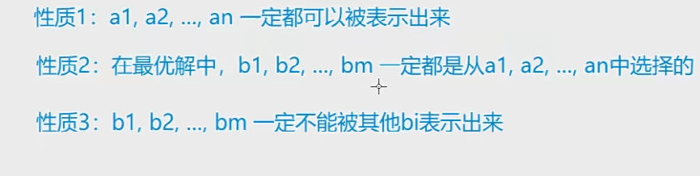

# 一. 二维数组dp

```python
单线程
f[i][j] 所有从起点走到i,j的集合

双线程
f[i1][i2][k] j1 = k - i1, j2 = k - i2
k 表示 横纵坐标之和 同时也能表示步数, 限制相同步数, 即当且仅当 i1 = i2 时 才能走到同一格:轨迹才能重合其他时都不会重合
    for k 
    	for i1
        	for i2 
            	两条路径 右下 x 右下
                t = g[i1][j1]
                i1 != i2 :  t+ = g[i2][j2]
                # k - 1 两个都退1步 同进退
                f[k][i1][i2] = max(k-1,i1,i2,| i1 -1,i2,| i2 -1,| i1 - 1,i2 -1)
                
                

```


# 二. 最长上升子序列

一种 f[i]: 以i为尾的最长子序列长度

贪心二分优化: f[i] 长度为i的的上升子序列最大潜力(最小)末尾


## Example

```python
a = list(map(int, input().split()))
n = len(a)
f = [0] * n
cnt = 0
for i in range(n):
    # 非上升子序列的最小覆盖个数 以贪心为思想:保证个数的潜力 大于等于i的最小值(对于单调的而言是第一个大于等于他的)
    # 找到直接替换(加入一个已有的序列,并改变尾部)
    # 二分思想求最长上升子序列: 每个尾部尽可能小找到大于i的左边界 将它换了 cnt = max(cnt,l)
    l = 0
    r = cnt - 1
    while l <= r:
        mid = (l + r) // 2
        if f[mid] >= a[i]:
            r = mid - 1
        else:
            l = mid + 1
    f[l] = a[i]
    if l >= cnt:
        cnt += 1
print(cnt)
```

# 三. 最长公共子序列

# 四. 背包

恰好装满: f = [- inf] * (m+1)

## 01背包

### Alogorithm

```python
集合: 从前i件物品选 背包容量为j的所有装配方案的集合
属性: 最大价值
集合划分:f[i][j] 01背包:  选第i件物品 | 不选第i件物品
             f[i-1][j-v[i]] + w[i] | f[i-1][j]
状态计算:  = max()

```

### Example

```python
n, m = map(int, input().split())

f = [[0] * (m + 1) for _ in range(n + 1)]

for i in range(1, n + 1):
    v, w = map(int, input().split())
    for j in range(m + 1):
        f[i][j] = f[i-1][j]
        if j >= v: f[i][j] = max(f[i][j], f[i-1][j-v] + w)
print(f[n][m])

# 滚动数组优化 只需要一维
# 优化: f[j] 背包容量为j时,从前i件物品选
n, m = map(int, input().split())

f = [0] * (m+1)

for i in range(n):
    v, w = map(int, input().split())
    # 正序会错 会导致f[j-v] 是已经算出来的用的是第i层的  而不是i-1层的
    for j in range(m, v-1, -1):
        f[j] = max(f[j], f[j-v] + w)
print(f[m])

```

​	

## 完全背包

### Algorithm

```python
与01背包不同的是 包含a[i] 的之后 还是要从前i件选
划分的区别: f[i][j] 选0件a[i] | 选1件. | 选 2件 | .. 选无穷件
    			f[i-1][j]	| f[i][j-v]
        可以从前往后遍历了
在表示下这: f[i][j-v]  从数学角度
```

### Example

### 极大独立集 货币系统二



枚举ai : 完全背包方案数

```python
T = int(input())

for _ in range(T):
    n = int(input())
    a = list(map(int, input().split()))
    a.sort()
    m = a[n-1]
       
    f = [0] * (m + 1)
    f[0] = 1
    
    res = 0
    for i in range(n):
        if f[a[i]] == 0: res += 1
        for j in range(a[i], m + 1):
             f[j] += f[j - a[i]]
        

    print(res)
```


## 多重背包

### Algorithm

```python
前两步一致
划分: 0件a[i] | 1 | 2 | .. | s[i] 件 a[i]
    
# 优化 二进制
s = 1023
0,1 2,3,4, ... 1023
1, 2, 4, 8, .. 512 能拼出来 每个组只能选一个

s = 200
1, 2, 4, 8, 16, 32, 64(最大的小于等于), 73
```

### Example


有 $N$ 种物品和一个容量是 $V$ 的背包。

第 $i$ 种物品最多有 $s_i$ 件，每件体积是 $v_i$，价值是 $w_i$。

求解将哪些物品装入背包，可使物品体积总和不超过背包容量，且价值总和最大。
输出最大价值。

#### 输入格式

第一行两个整数，$N，V$，用空格隔开，分别表示物品种数和背包容积。

接下来有 $N$ 行，每行三个整数 $v_i, w_i, s_i$，用空格隔开，分别表示第 $i$ 种物品的体积、价值和数量。

#### 输出格式

输出一个整数，表示最大价值。

#### 数据范围

$0 \lt N \le 1000$
$0 \lt V \le 2000$
$0 \lt v_i, w_i, s_i \le 2000$

##### 提示：

本题考查多重背包的二进制优化方法。

#### 输入样例

```
4 5
1 2 3
2 4 1
3 4 3
4 5 2
```

#### 输出样例：

```
10
```

```python
n, m = map(int, input().split())

f = [[0] * (m + 1) for _ in range(n + 1)]

for i in range(1, n + 1):
    v, w, s = map(int, input().split())
    for j in range(1, m + 1):
        for k in range(0, s+1):
            if k * v <= j:
                f[i][j] = max(f[i][j], f[i-1][j- k * v] + k * w)

print(f[n][m])

# n件物品 -> n * logs 向上取整
N = 25000

n, m = map(int, input().split())

f = [0] * (m + 1)

v = [0] * N

w = [0] * N

cnt = 0
for i in range(n):
    a, b, s = map(int, input().split())
    k = 1
    while(k <= s):
        cnt += 1
        v[cnt] = a * k
        w[cnt] = b * k
        s -= k
        k *= 2
    if s > 0:
        cnt += 1
        v[cnt] = a * s
        w[cnt] = b * s

n = cnt

for i in range(1, n+1):
    for j in range(m, v[i] - 1, -1):
        f[j] = max(f[j], f[j-v[i]] + w[i])
        
print(f[m])
        
    
```


## 分组背包

### Algorithm

```python
集合: 从前i组 容量j
每组只能选一个
集合划分:   不从第i组选 | 选i组第1个 | 选i组第k个
    		用的是上一层 可优化为倒着的
    		f[i-1][j] |  f[i-1][j-z[i][k]] + w[i][k]
```


### Example

有 $N$ 组物品和一个容量是 $V$ 的背包。

每组物品有若干个，同一组内的物品最多只能选一个。
每件物品的体积是 $v_{ij}$，价值是 $w_{ij}$，其中 $i$ 是组号，$j$ 是组内编号。

求解将哪些物品装入背包，可使物品总体积不超过背包容量，且总价值最大。

输出最大价值。

#### 输入格式

第一行有两个整数 $N，V$，用空格隔开，分别表示物品组数和背包容量。

接下来有 $N$ 组数据：

- 每组数据第一行有一个整数 $S_i$，表示第 $i$ 个物品组的物品数量；
- 每组数据接下来有 $S_i$ 行，每行有两个整数 $v_{ij}, w_{ij}$，用空格隔开，分别表示第 $i$ 个物品组的第 $j$ 个物品的体积和价值；

#### 输出格式

输出一个整数，表示最大价值。

#### 数据范围

$0 \lt N, V \le 100$
$0 \lt S_i \le 100$
$0 \lt v_{ij}, w_{ij} \le 100$

#### 输入样例

```
3 5
2
1 2
2 4
1
3 4
1
4 5
```

#### 输出样例：

```
8
```

```python
N = 110

n, m = map(int, input().split())

v = [[0] * N for _ in range(N)]
w = [[0] * N for _ in range(N)]

s = [0] * N

f = [0] * (m + 1)

for i in range(n):
    s[i] = int(input())
    for j in range(s[i]):
        v[i][j], w[i][j] = map(int, input().split())
    
for i in range(n):
    for j in range(m, -1, -1):
        for k in range(s[i]):
            if v[i][k] > j: continue
            f[j] = max(f[j], f[j-v[i][k]] + w[i][k])
            
print(f[m])

```


## 混合背包 01/多重/完全


### Example

有 NN 种物品和一个容量是 VV 的背包。

物品一共有三类：

- 第一类物品只能用1次（01背包）；
- 第二类物品可以用无限次（完全背包）；
- 第三类物品最多只能用 sisi 次（多重背包）；

每种体积是 vivi，价值是 wiwi。

求解将哪些物品装入背包，可使物品体积总和不超过背包容量，且价值总和最大。
输出最大价值。

#### 输入格式

第一行两个整数，N，VN，V，用空格隔开，分别表示物品种数和背包容积。

接下来有 NN 行，每行三个整数 vi,wi,sivi,wi,si，用空格隔开，分别表示第 ii 种物品的体积、价值和数量。

- si=−1si=−1 表示第 ii 种物品只能用1次；
- si=0si=0 表示第 ii 种物品可以用无限次；
- si>0si>0 表示第 ii 种物品可以使用 sisi 次；

#### 输出格式

输出一个整数，表示最大价值。

#### 数据范围

0<N,V≤10000<N,V≤1000
0<vi,wi≤10000<vi,wi≤1000
−1≤si≤1000−1≤si≤1000

#### 输入样例

```
4 5
1 2 -1
2 4 1
3 4 0
4 5 2
```

#### 输出样例：

```
8
```

```python
T = int(input())

while T:
    n = int(input())
    a = list(map(int, input().split()))
    a.sort()

    m = a[n - 1]
    f = [0] * (m + 1)
    f[0] = 1

    res = 0
    for i in range(0, n):
        # 第i个数能否被前i-1个数表示出来
        if f[a[i]] == 0:
            res += 1
        for j in range(a[i], m + 1):
            f[j] += f[j - a[i]]

    print(res)
    T -= 1
```


## 求最优解具体方案:

其实是最短路问题, 符合从哪个状态 转移过来 就输出路径

=> 求出一条最短路

#### Example

```python
n, m = map(int, input().split())

f = [[0] * (m + 1) for _ in range(n + 2)]

v = [0] * (n + 1)
w = [0] * (n + 1)

for i in range(1, n + 1):
    v[i], w[i] = map(int, input().split())
    
for i in range(n, 0, -1):
    for j in range(1, m + 1):
        f[i][j] = f[i+1][j]
        if j >= v[i]:
            f[i][j] = max(f[i+1][j -v[i]] + w[i], f[i][j])

j = m 
for i in range(1, n + 1):
    if j >= v[i] and f[i][j] == f[i+1][j-v[i]] + w[i]:
        print(i, end=" ")
        j -= v[i]

```


## 求最优解方案数

=> 最短路径的条数

注意求最优解的时候如果两条路都相等两个都要加

```python
n, m = map(int, input().split())

f = [0] * (m + 1)
g = [0] * (m + 1)
mod = int(1e9 + 7)
maxv = 0

g[0] = 1
for i in range(n):
    v, w = map(int, input().split())
    for j in range(m, v - 1, -1):
        t = f[j]
        f[j] = max(f[j], f[j - v] + w)
        cnt = 0
        if f[j] == t: cnt += g[j]
        if f[j] == f[j - v] + w: cnt += g[j - v]
        g[j] = cnt % mod
        maxv = max(f[j],maxv)
        
res = 0
for j in range(m + 1):
    if f[j] == maxv:
        res = (res + g[j]) % mod
# 方案数的理解: g[j] 恰好装满 而不是不超过 
print(res)
```


# 五. 状态机模型


# 六. 区间DP

## Alogorithm

```python
f[i][j]集合 第i堆石子到j堆石子合并成一堆的所有合并方式
j > i
划分: 最优一步合并的分界点 k = [i,j-1] (j-1 保证k+1不会出界)
    for k :
    	f[i][j] = max(f[i][j], f[i][k] + f[k+1][j] + s[j] - s[i-1])
```

## Example

```python
n = int(input())

s = [0] + list(map(int, input().split()))

f = [[0] * (n + 1) for _ in range(n + 1)]
for i in range(1, n + 1):
    s[i] += s[i-1]
    
for w in range(2, n + 1):
    for l in range(1, n - w + 2):
        # l + w - 1 <= n
        r = l + w - 1
        f[l][r] = int(1e8)
        for k in range(l,r):
            f[l][r] = min(f[l][r], f[l][k] + f[k+1][r] + s[r] - s[l-1])

print(f[1][n])
            


```

# 七. 连通性状态压缩DP

状态压缩

## 蒙德里安的梦想

```python
转换为放行
f[i][j] : 第i列放[二进制数枚举行数] 
划分: [i-1]二进制枚举
f[0][0] = 1 #第0列虚拟列 必须一行不选 所以[0][0] f[1][二进制枚举]计算时 枚举上一步的每种选择,在枚举本步的每种选择 合法: 上一步的每种选择不能有单数不选的情况(预处理), 上一步与本步不能都选(j & k == 0
		
```

# 八. 集合类状态压缩DP

## 韩明顿

给定一张 nn 个点的带权无向图，点从 0∼n−10∼n−1 标号，求起点 00 到终点 n−1n−1 的最短 Hamilton 路径。

Hamilton 路径的定义是从 00 到 n−1n−1 不重不漏地经过每个点恰好一次。

#### 输入格式

第一行输入整数 nn。

接下来 nn 行每行 nn 个整数，其中第 ii 行第 jj 个整数表示点 ii 到 jj 的距离（记为 a[i,j]a[i,j]）。

对于任意的 x,y,zx,y,z，数据保证 a[x,x]=0，a[x,y]=a[y,x]a[x,x]=0，a[x,y]=a[y,x] 并且 a[x,y]+a[y,z]≥a[x,z]a[x,y]+a[y,z]≥a[x,z]。

#### 输出格式

输出一个整数，表示最短 Hamilton 路径的长度。

#### 数据范围

1≤n≤201≤n≤20
0≤a[i,j]≤1070≤a[i,j]≤107

#### 输入样例：

```
5
0 2 4 5 1
2 0 6 5 3
4 6 0 8 3
5 5 8 0 5
1 3 3 5 0
```

#### 输出样例：

```
18
```

## Solution

```python
n = int(input())

g = [list(map(int, input().split())) for _ in range(n)]

f = [[0x3f3f3f3f] * n for _ in range(1 << n)]
f[1][0] = 0

for i in range(1 << n):
    
    for j in range(n):
        if i >> j & 1:
            for k in range(n):
                if i - (1 << j) >> k & 1:
                    f[i][j] = min(f[i][j],f[i - (1 << j)][k] + g[k][j])
print(f[(1 << n) - 1][n - 1])
                
```

# 九. 树形DP