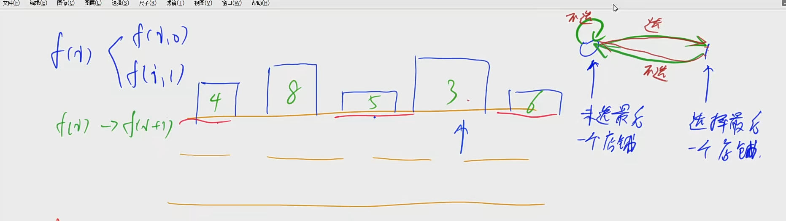
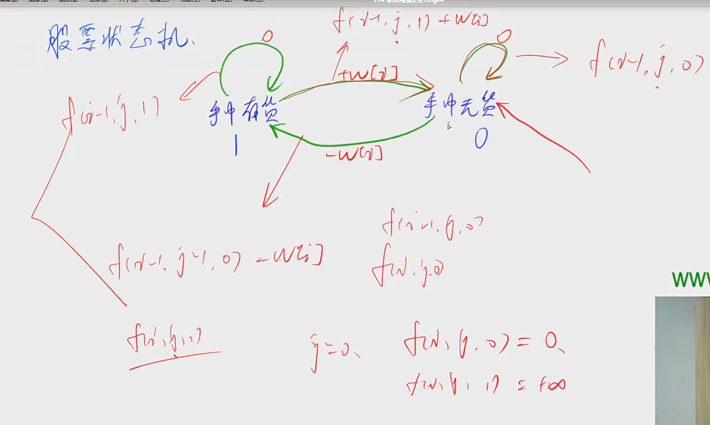
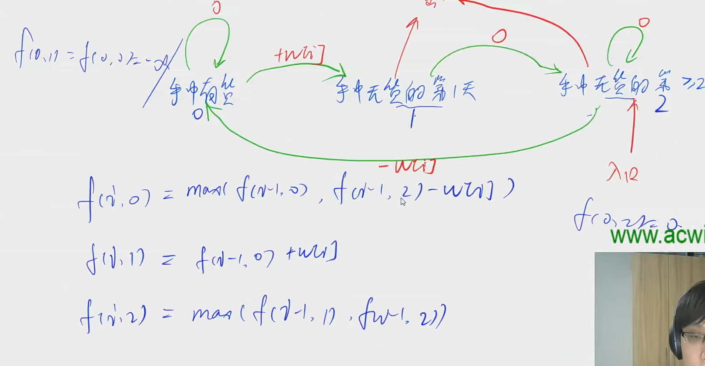

```java

import java.util.*;

class Main{
	public static void main(String[] args) {
        Scanner in = new Scanner(System.in);
        
    }
}
```


## 状态机模型

### 抢家劫舍为例



阿福是一名经验丰富的大盗。趁着月黑风高，阿福打算今晚洗劫一条街上的店铺。

这条街上一共有 N 家店铺，每家店中都有一些现金。

阿福事先调查得知，只有当他同时洗劫了两家相邻的店铺时，街上的报警系统才会启动，然后警察就会蜂拥而至。

作为一向谨慎作案的大盗，阿福不愿意冒着被警察追捕的风险行窃。

他想知道，在不惊动警察的情况下，他今晚最多可以得到多少现金？

#### 输入格式

输入的第一行是一个整数 T，表示一共有 T 组数据。

接下来的每组数据，第一行是一个整数 N ，表示一共有 N 家店铺。

第二行是 N 个被空格分开的正整数，表示每一家店铺中的现金数量。

每家店铺中的现金数量均不超过1000。

#### 输出格式

对于每组数据，输出一行。

该行包含一个整数，表示阿福在不惊动警察的情况下可以得到的现金数量。

#### 数据范围

$1 \le T \le 50$,
$1 \le N \le 10^5$

#### 输入样例：

```
2
3
1 8 2
4
10 7 6 14
```

#### 输出样例：

```
8
24
```

#### 样例解释

对于第一组样例，阿福选择第2家店铺行窃，获得的现金数量为8。

对于第二组样例，阿福选择第1和4家店铺行窃，获得的现金数量为10+14=24。

#### 代码

```java
import java.util.*;

class Main{
	public static void main(String[] args) {
        Scanner in = new Scanner(System.in);
        int n = in.nextInt();
        for (int i = 0; i < n; i++) {
            int m = nextInt();
            int[][] dp = new int[m+10][2]; // 0 不偷i家 
            for (int j = 1; j <= m; j++) {
				int v = in.nextInt();
                dp[j][0] = Math.max(dp[j-1][0],dp[j-1][1]);
                dp[j][1] = Math.max(dp[j-1][0] + v,dp[j-1][1]);
            }
            System.out(Math.max(dp[m][0],dp[m][1]));
        }
        
    }
}
```

```java
class Solution {
    public int rob(int[] nums) {
        int n = nums.length;
        int[][] dp = new int[n+10][2];
        for (int i = 1; i <= n; i++) {
            dp[i][0] = Math.max(dp[i-1][0],dp[i-1][1]);
            dp[i][1] = Math.max(dp[i-1][1],dp[i-1][0] + nums[i-1]);
        }
        return Math.max(dp[n][0],dp[n][1]);
    }
}
```


## 股票状态机



### 股票买卖IV / leetcode 188

```java
class Solution {
    public final int INF = Integer.MAX_VALUE / 2;
    public int maxProfit(int k, int[] prices) {
        int n = prices.length;
        int[][][] dp = new int[n+10][k+10][2];
        // 买入算半次交易 卖出 为一次完整交易
        // 入口为手中无货
        for (int i = 0; i < n+10; i++) {
            for (int j = 0; j < k+10; j++) {
                dp[i][j][0] = -INF;
                dp[i][j][1] = -INF;
            }
        }
        for (int i = 0; i < n; i++) dp[i][0][0] = 0;

        for (int i = 1; i <= n; i++) {
            for (int j = 1; j <= k; j++) {
                dp[i][j][1] = Math.max(dp[i-1][j][1],dp[i-1][j-1][0] - prices[i-1]);
                dp[i][j][0] = Math.max(dp[i-1][j][0],dp[i-1][j][1] + prices[i-1]);
                // 买入则交易次数+1 
            }
        }
        int res = 0;
        for (int i = 1; i <= k; i++) res = Math.max(dp[n][i][0],res);
        return res;
    }
}
```

### 股票买卖含冷冻期 / 309



```java
class Solution {
    public final int INF = Integer.MAX_VALUE / 2;
    public int maxProfit(int[] prices) {
        int n = prices.length;
        // 手中有货        手中无货的第 1天       手中无货的 >=2天
        //    1                 0                   2        
        int[][] dp = new int[n+10][3];
        dp[0][1] = dp[0][0] = -INF;
        dp[0][2] = 0;
        for (int i = 1; i <= n; i++) {
            dp[i][1] = Math.max(dp[i-1][2] - prices[i-1],dp[i-1][1]);
            dp[i][2] = Math.max(dp[i-1][2],dp[i-1][0]);
            dp[i][0] = dp[i-1][1] + prices[i-1];
        }
        int res = 0;
        res = Math.max(dp[n][0],dp[n][2]);
        return res < 0 ? 0 : res;
    }
}
```