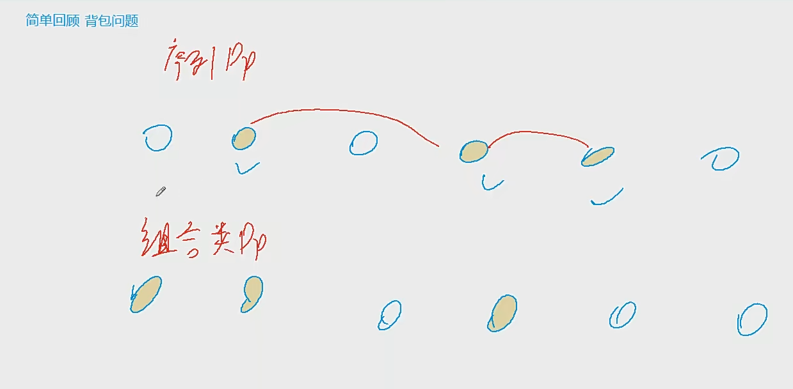
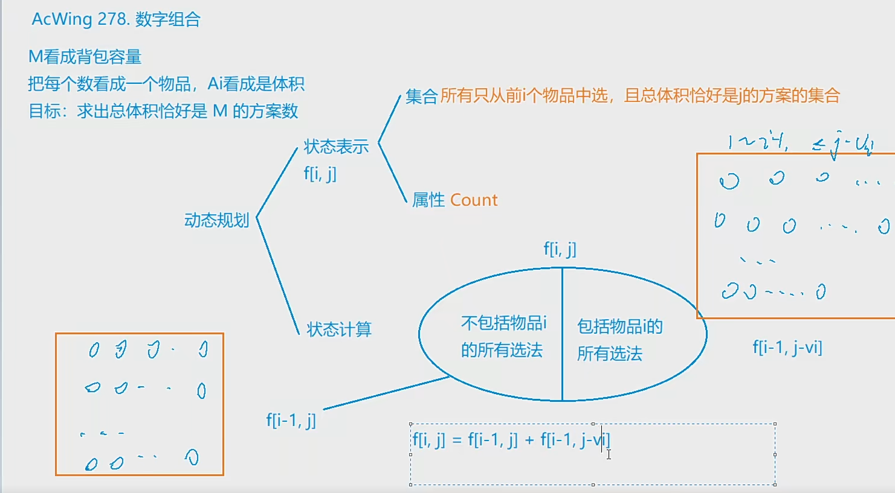
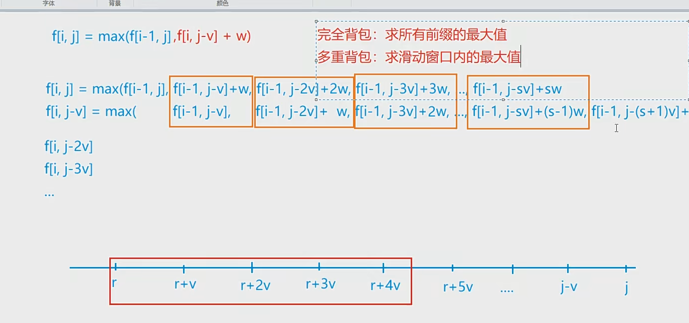
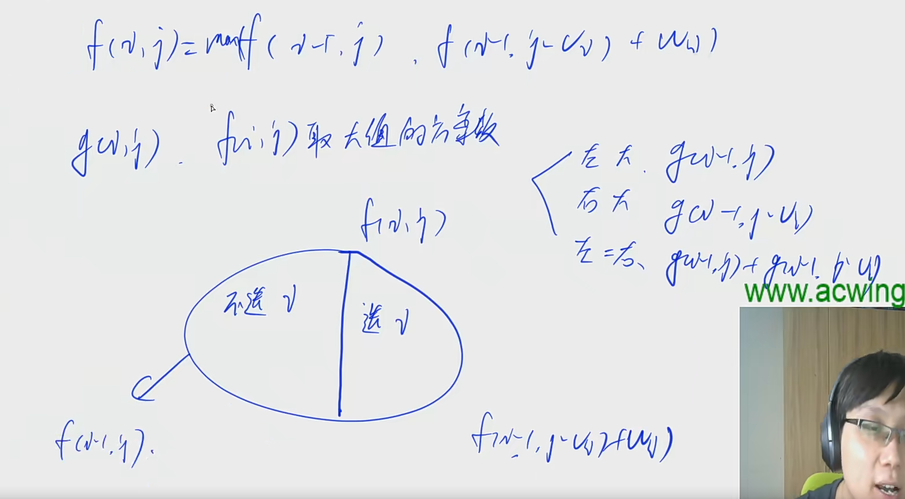

力扣」上的 0-1 背包问题：

「力扣」第 416 题：分割等和子集（中等）；
「力扣」第 474 题：一和零（中等）；
「力扣」第 494 题：目标和（中等）；
「力扣」第 879 题：盈利计划（困难）；
「力扣」上的 完全背包问题：

「力扣」第 322 题：零钱兑换（中等）；
「力扣」第 518 题：零钱兑换 II（中等）；
「力扣」第 1449 题：数位成本和为目标值的最大数字（困难）。
这里要注意鉴别：「力扣」第 377 题，不是「完全背包」问题。





## 模板

## 初始化的细节问题

有的题目要求“恰好装满背包”时的最优解，有的题目则并没有要求必须把背包装满。

如果是第一种问法，要求恰好装满背包，那么在初始化时除了f[0]为0其它f[1..V]均设为-∞，这样就可以保证最终得到的f[N]是一种恰好装满背包的最优解。

如果并没有要求必须把背包装满，而是只希望价格尽量大，初始化时应该将f[0..V]全部设为0。

>  总归是子问题的全部选法
>
> f[m] 定义为背包体积为m 的最大价值
>
> 如果不要求恰好装满 全部初始化为0
>
> f[m] 即为最大值 因为相当于一个偏移量 
>
> 证明:
>
> ​	f[0] = 0 => f[w0] = v[0]... 
>
> ​	设 k 为最大值的体积  f[m-k] = 0  => f[m-k+w0] = v[0];这样转移过来
>
> 如果要求恰好装满的max
>
> ​	除了 dp[0] 为  0 其他为-INF
>
>    
>
> 我这里写清楚了 初始化的问题,具体求解具体应用即可


> 优化空间后 除了 完全背包可从前往后 ,其他都是从后往前

```java
for 物品
    for 体积
        for 决策
```


## 01背包

```java
//不选第i个物品和 选一个最后一个物品
dp[i][j] = Math.max(dp[i-1][j],dp[i-1][j-v[i]] + w[i]);
```


### 板子题


```java
输入 
3 70
71 100
69 1
1 2
    
// 给定背包大小 m,给定 物品个数 n,w[i] v[i] 求背包能装物品的最大值
```

```java
import java.util.*;
class Main{
    public static void main(String[] args) {
        Scanner in = new Scanner(System.in);
        int n = in.nextInt();
        int m = in.nextInt();
        int[] dp = new int[m+10];
        for (int i =0; i < n; i++) {
            int w = in.nextInt();
            int v = in.nextInt();
            for (int j = m; j >= w; j--) dp[j] = Math.max(dp[j],dp[j-w]+v);
        }
        System.out.println(dp[m]);
    }
}
```

### 装箱问题

有一个箱子容量为 V，同时有 n 个物品，每个物品有一个体积（正整数）。

要求 n 个物品中，任取若干个装入箱内，使箱子的剩余空间为最小。

#### 输入格式

第一行是一个整数 V，表示箱子容量。

第二行是一个整数 n，表示物品数。

接下来 n 行，每行一个正整数（不超过10000），分别表示这 n 个物品的各自体积。

#### 输出格式

一个整数，表示箱子剩余空间。

#### 数据范围

0<V≤200000<V≤20000,
0<n≤300<n≤30

#### 输入样例：

```
24
6
8
3
12
7
9
7
```

#### 输出样例：

```
0
```

```java
输入
	24 // 箱子容量
	6  // 物品个数 
	8  // 物品体积
   	3
    12
    7
    9
    7
    // 求任取若干 使箱子剩余空间最小
    
    //思路 体积也看成价值
```


### 二维费用的背包问题

有 N 件物品和一个容量是 V 的背包，背包能承受的最大重量是 M。

每件物品只能用一次。体积是 vi，重量是 mi，价值是 wi。

求解将哪些物品装入背包，可使物品总体积不超过背包容量，总重量不超过背包可承受的最大重量，且价值总和最大。
输出最大价值。

#### 输入格式

第一行三个整数，N,V,M，用空格隔开，分别表示物品件数、背包容积和背包可承受的最大重量。

接下来有 N 行，每行三个整数 vi,mi,wi,，用空格隔开，分别表示第 i 件物品的体积、重量和价值。

#### 输出格式

输出一个整数，表示最大价值。

#### 数据范围

0<N≤10000
0<V,M≤1000
0<vi,mi≤1000
0<wi≤10000

#### 输入样例

```
4 5 6
1 2 3
2 4 4
3 4 5
4 5 6
```

#### 输出样例：

```\
8
```

#### 代码: 

```java
f[i][j][k] = Math.max(dp[i-1][j][k],dp[i][j-w1][k-w2] + v)
```


```java
import java.util.*;
class Main{
    public static void main(String[] args) {
        Scanner in = new Scanner(System.in);
        int n = in.nextInt();
        int W1 = in.nextInt();
        int W2 = in.nextInt();
        for (int i = 0; i < n; i++) {
            int w1 = in.nextInt();
            int w2 = in.nextInt();
            int v = nextInt();
            for (int j = W1; j >= 0; j--) {
				for (int k = W2; k>= 0; k--) {
                    dp[j][k] = Math.max(dp[i][k],dp[j-w1][k-w2]+v);
                }
            }
        }
        System.out.println(dp[W1][W2]);
    }
}
```

### 数字组合




给定 N 个正整数 A1,A2,…,AN ,从中选出若干个数，使它们的和为 M，求有多少种选择方案。

#### 输入格式

第一行包含两个整数 N 和 M。

第二行包含 N 个整数，表示 A1,A2,…,AN。

#### 输出格式

包含一个整数，表示可选方案数。

#### 数据范围

1≤N≤1001≤N≤100,
1≤M≤100001≤M≤10000,
1≤Ai≤10001≤Ai≤1000,
答案保证在 int 范围内。

#### 输入样例：

```
4 4
1 1 2 2
```

#### 输出样例：

```
3
```


#### 代码

```java
import 
```

给你一个 只包含正整数 的 非空 数组 nums 。请你判断是否可以将这个数组分割成两个子集，使得两个子集的元素和相等。

 

### LeetCode 416 分割等和子集

示例 1：

输入：nums = [1,5,11,5]
输出：true
解释：数组可以分割成 [1, 5, 5] 和 [11] 。
示例 2：

输入：nums = [1,2,3,5]
输出：false
解释：数组不能分割成两个元素和相等的子集。


提示：

1 <= nums.length <= 200
1 <= nums[i] <= 100

来源：力扣（LeetCode）
链接：https://leetcode.cn/problems/partition-equal-subset-sum
著作权归领扣网络所有。商业转载请联系官方授权，非商业转载请注明出处。

#### solution

```java
// 传统用INF的写法
class Solution {
    public boolean canPartition(int[] nums) {
        //求和 求一半的背包能否装满
        int INF = 0x3f3f3f3f;
        int n = nums.length;
        int sum = 0;
        for (int num : nums) {
            sum += num;
        }
        if (sum % 2 == 1 || sum == 0) return false;
        int weight = sum / 2;
        int[] dp = new int[weight+1]; 
        for (int i = 1; i <= weight; i++) dp[i] = -INF;
        for (int i = 1; i <= n; i++) {
            for (int j = weight; j >= nums[i-1]; j--) {
                    dp[j] = Math.max(dp[j-nums[i-1]] + nums[i-1],dp[j]);      
            }
        }
        return dp[weight] < -INF / 2? false : true;  
    }
}

//这道题有特殊
class Solution {
    public boolean canPartition(int[] nums) {
        //求和 求一半的背包能否装满
        int n = nums.length;
        int sum = 0;
        for (int num : nums) {
            sum += num;
        }
        if (sum % 2 == 1 || sum == 0) return false;
        int weight = sum / 2;
        int[] dp = new int[weight+1];
        
        
        
        for (int i = 1; i <= n; i++) {
            for (int j = weight; j >= nums[i-1]; j--) {
                    dp[j] = Math.max(dp[j-nums[i-1]] + nums[i-1],dp[j]);      
            }
        }
        // 这个结果保证是恰好装满 即从dp[0]转移而来
        return dp[weight] == weight;
         
    }
}
```


## 完全背包


```java
//不选第i个物品和,选一个,选两个,选n个直到不能选
dp[i][j] = Math.max(dp[i-1][j],dp[i-1][j-w]+v,dp[i-1][j-2w]+2v...dp[i-1][j-nw] + nv);
dp[i][j-w] = Math.max(         dp[i-1][j-w]  ,dp[i-1][j-2w]+v ...dp[i-1][j-nw] + (n-1)v);

//最终
dp[i][j] = Math.max(dp[i-1][j],dp[i][j-w[i]] + v[i]); 
```

### 零钱兑换I

给你一个整数数组 coins ，表示不同面额的硬币；以及一个整数 amount ，表示总金额。

计算并返回可以凑成总金额所需的 最少的硬币个数 。如果没有任何一种硬币组合能组成总金额，返回 -1 。

你可以认为每种硬币的数量是无限的。

 

示例 1：

输入：coins = [1, 2, 5], amount = 11
输出：3 
解释：11 = 5 + 5 + 1
示例 2：

输入：coins = [2], amount = 3
输出：-1
示例 3：

输入：coins = [1], amount = 0
输出：0


提示：

1 <= coins.length <= 12
1 <= coins[i] <= 231 - 1
0 <= amount <= 104

来源：力扣（LeetCode）
链接：https://leetcode.cn/problems/coin-change
著作权归领扣网络所有。商业转载请联系官方授权，非商业转载请注明出处。

```java
class Solution {
    public final int INF = Integer.MAX_VALUE / 2;
    public int coinChange(int[] coins, int amount) {
        // dp[i]  
        // 刚好装满的最少个数(价值为1) 
        
       int m = amount;
       int n = coins.length;
       int[]dp = new int[amount+10];
       Arrays.fill(dp,INF);
       dp[0] = 0;
       for (int i = 0; i < n; i++) {
           for (int j = coins[i]; j <= m; j++) {
               dp[j] = Math.min(dp[j],dp[j-coins[i]]+1);
           }
       }   
        return dp[amount] == INF ? -1 : dp[amount];
        
        
    }
}
```


### 零钱兑换II


### 买书/货币系统/零钱兑换II


### 货币系统II


## 多重背包



r = j % v;

物品有限s[i]个

```java
//不选第i个物品,选一个第i个物品,选两个,选到不能选(体积之内 || 个数之内)
dp[i][j] = Math.max(dp[i-1][j],dp[i-1][j-w]+v,dp[i-1][j-2w]+2v...dp[i-1][j-nw] + nv);
dp[i][j-w] = Math.max(         dp[i-1][j-w]  ,dp[i-1][j-2w]+v ...dp[i-1][j-nw] + (n-1)v,dp[i][j-(n+1)w] + v); //在多重背包里会多一项不能直接替换 (在j-w的体积基础上选s[i](n个),所以要-(n+1)w)

//最简单的
 for(int j = 1; j <= V; j++){
     for(int k = 0; k <= s && j >= k * v; k++){
         dp[i][j] = Math.max(dp[i][j], dp[i - 1][j - k * v] + k * w);
     }
 }
```

### 多重背包I

有 N 种物品和一个容量是 V 的背包。

第 i 种物品最多有 si 件，每件体积是 vi，价值是 wi。

求解将哪些物品装入背包，可使物品体积总和不超过背包容量，且价值总和最大。
输出最大价值。

#### 输入格式

第一行两个整数，N，V用空格隔开，分别表示物品种数和背包容积。

接下来有 NN行，每行三个整数 vi,wi,si，用空格隔开，分别表示第 i种物品的体积、价值和数量。

#### 输出格式

输出一个整数，表示最大价值。

#### 数据范围

0<N,V≤1000<N,V≤100
0<vi,wi,si≤1000<vi,wi,si≤100

#### 输入样例

```java
4 5   // n m
1 2 3 //体积、价值和数量
2 4 1
3 4 3
4 5 2
```

#### 输出样例：

```
10
```


#### 代码:


```java
import java.util.*;
class Main{
    public static void main(String[] args) {
		Scanner in = new Scanner.nextInt();
        int n = in.nextInt();
        int m = in.nextInt();
        int[] w = new int[n+10];
        int[] v = new int[n+10];
        int[] s = new int[n+10];
        for (int i = 0; i < n; i++)
            
    }
}
```

## 混合背包

### 板子题


## 最优选法 背包问题求方案数



有 N件物品和一个容量是 V的背包。每件物品只能使用一次。

第 i 件物品的体积是 v_i，价值是 w_i。

求解将哪些物品装入背包，可使这些物品的总体积不超过背包容量，且总价值最大。

输出 **最优选法的方案数**。注意答案可能很大，请输出答案模 10^9 + 7 的结果。

#### 输入格式

第一行两个整数，N，V，用空格隔开，分别表示物品数量和背包容积。

接下来有 N 行，每行两个整数 v_i, w_i，用空格隔开，分别表示第 i 件物品的体积和价值。

#### 输出格式

输出一个整数，表示 **方案数** 模 10^9 + 7 的结果。

#### 数据范围

$0 \lt N, V \le 1000$
$0\lt v_i, w_i \le 1000$

#### 输入样例

```
4 5
1 2
2 4
3 4
4 6
```

#### 输出样例：

```
2
```

#### 代码

```java
import java.util.*;
class Main{
    static final int mod = (int)1e9 + 7;
    public static void main(String[] args) {
        Scanner in = new Scanner(System.in);
        int n = in.nextInt();
        int m = in.nextInt();
        //恰好装满的最大价值
        int[] f = new int[m+10];
        Arrays.fill(f,-1010);
        // 最优解的方案数
        int[] g = new int[m+10];
        f[0] = 0;
        g[0] = 1;
        
        for (int i = 0; i < n; i++) {
            int w = in.nextInt();
            int v = in.nextInt();
            for (int j = m; j >= w; j--) {
				int maxv = Math.max(f[j],f[j-w] + v);
                int cnt = 0;
                if (maxv == f[j]) cnt += g[j];
                if (maxv == f[j-w] + v) cnt += g[j-w];
                g[j] = cnt % mod;
                f[j] = maxv; 
            }
        }
        int res = 0;
        for (int i = 1; i <= m; i++) {
            res = Math.max(res,f[i]);
        }
        int cnt = 0;
        for (int i = 1; i <= m; i++) {
			if (res == f[i]) cnt = (cnt + g[i]) % mod;
        }
        
        System.out.println(cnt == 0 ? 1 : cnt);
        
    }
    
}
```

