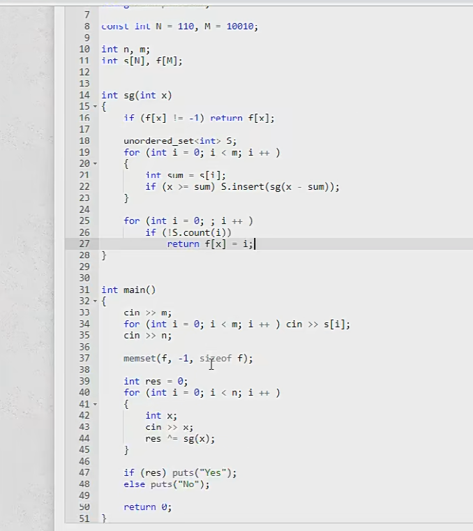

## 容斥原理

//代码 二进制枚举 选1个 选两个  组合


### 能被整除的数

给定一个整数 n 和 m 个不同的质数 p1,p2,…,pm

请你求出 1∼n 中能被 p1,p2,…,pm 中的至少一个数整除的整数有多少个。

#### 输入格式

第一行包含整数 nn 和 mm。

第二行包含 mm 个质数。

#### 输出格式

输出一个整数，表示满足条件的整数的个数。

#### 数据范围

1≤m≤161≤m≤16,
1≤n,pi≤1091≤n,pi≤109

#### 输入样例：

```
10 2
2 3
```

#### 输出样例：

```
7
```

#### 代码

```java
import java.util.*;

class Main{
	public static void main(String[] args) {
        Scanner in = new Scanner(System.in);
        int n = in.nextInt();
        int m = in.nextInt();
        int[] p = new int[m+10];
        for (int i = 0; i < m; i++) {
			p[i] = in.nextInt();
        }
        //枚举每个质数 算集合个数 
        int res = 0;
        for (int i = 0; i < 1 << m; i++) {
			
            int t = 1, cnt = 0;
            for (int j = 0; j < m; j++) {
                if (((i >> j) & 1) != 0) {
                    cnt++;
                    if ((long)t * p[j] > n) {
                        t = -1;
                        break;
                    }
                    t *= p[j];
                }
            }
            if (t != -1) {
                if (cnt % 2 == 0) res -= n / t;
                else res += n / t;
            }
        }
        Sytem.out.println(res);
        
    }
}
```

## 博弈论

先手必胜

先手必败




集合

### 移棋子游戏

有 N个节点的**有向无环图**，图中某些节点上有棋子，两名玩家交替移动棋子。

玩家每一步可将任意一颗棋子沿一条有向边移动到另一个点，无法移动者输掉游戏。

对于给定的图和棋子初始位置，双方都会采取最优的行动，询问先手必胜还是先手必败。

#### 输入格式

第一行，三个整数 N,M,K，N 表示图中节点总数，M 表示图中边的条数，K 表示棋子的个数。

接下来 M 行，每行两个整数 X,Y 表示有一条边从点 X 出发指向点 Y。

接下来一行， K 个空格间隔的整数，表示初始时，棋子所在的节点编号。

节点编号从 1 到 N。

#### 输出格式

若先手胜，输出 win，否则输出 lose。

#### 数据范围

1≤N≤20001≤N≤2000,
1≤M≤60001≤M≤6000,
1≤K≤N1≤K≤N

#### 输入样例：

```
6 8 4
2 1
2 4
1 4
1 5
4 5
1 3
3 5
3 6
1 2 4 6
```

#### 输出样例：

```
win
```

#### 代码

```java
import java.util.*;

class Main{
	public static void main(String[] args) {
        Scanner in = new Scanner(System.in);
        int n = in.nextInt();
        int m = in.nextInt();
        int k = in.nextInt();
        
    }
}
```

