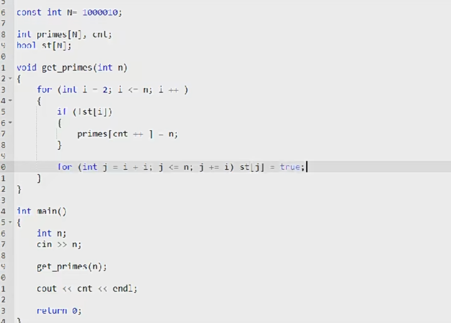
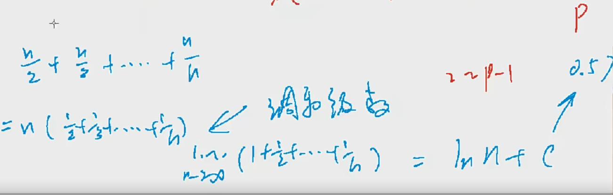
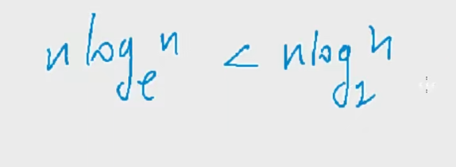
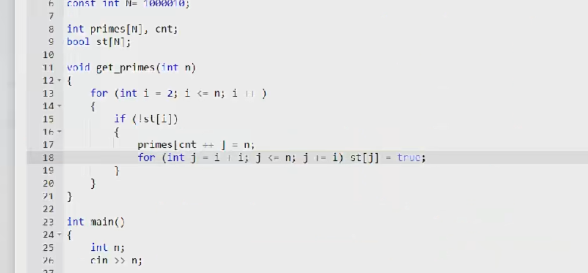
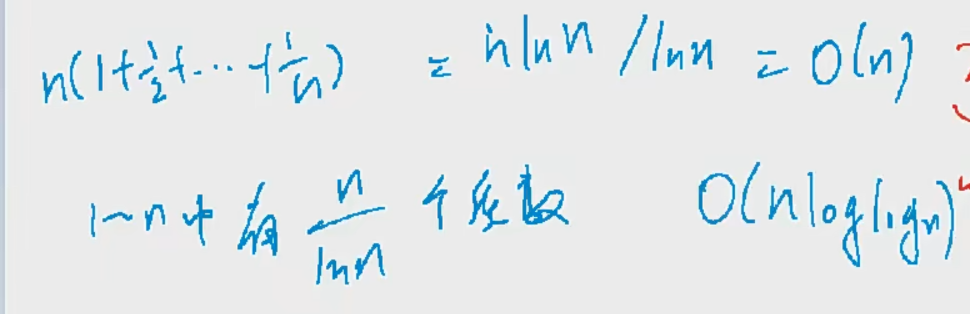

# 质数

```python
# 试除法
质数: 只能被1和本身整除
暴力思路: 试除法 o(N)
    
1. 成对出现 所以从2枚举到 <= 根号n即可 i < n / i
```

```cpp
bool is_prime(int a) {
    if (a < 2) return false;
    for (int i = 2; i <= a / i; i++) {
        if (a % i == 0) return false;
    }
    return true;
}
```


# 分解质因数

分解质因数每个合数都可以写成几个质数相乘的形式，其中每个质数都是这个合数的因数，把一个合数用质因数相乘的形式表示出来，叫做分解质因数


# 筛质数

埃氏筛: 枚举每个数将他的倍数删掉









埃氏筛法




```c++
#include<bits/stdc++.h>
using namespace std;
const int maxn = 1e6 + 10;
int primes[maxn],cnt;
bool st[maxn];
 
int n;
 
void get_prime(int n) {
	for(int i = 2;i <= n;i++) {
		//当前这个数没有被筛掉说明它是素数 
		/*埃式筛 
		if(!st[i]) {
			primes[cnt++] = i;
		} else break;									// (优化:只保留质数的调和级数,loglogn)
		for(int j = i + i;j <= n;j += i) st[j] = true;  
		//如果没有else优化, 每次
		//nloglogn,可以认为loglogn为常数 
		*/ 
		
		//线性筛  
		if(!st[i]) primes[cnt++] = i;
		for(int j = 0;primes[j] <= n / i;j++) {
			st[primes[j] * i] = true;
			if(i % primes[j] == 0) break;
		} 
	}
}
 
int main() {
	cin >> n;
	get_prime(n);
	cout << cnt << endl;
	return 0;
}
```


