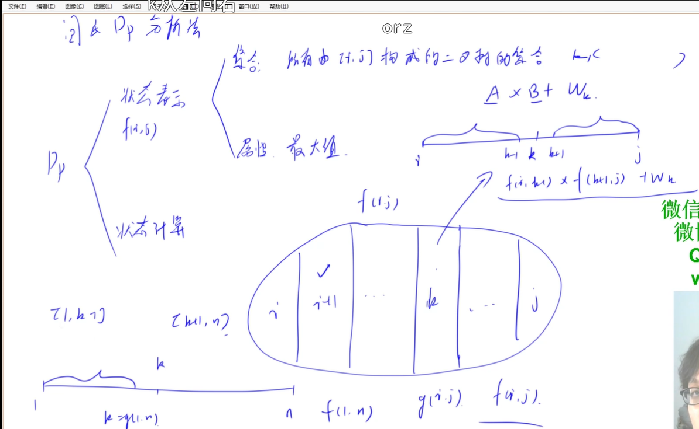
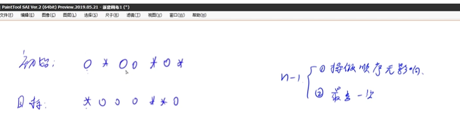
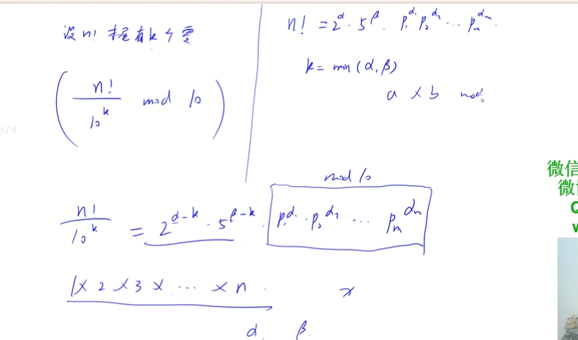
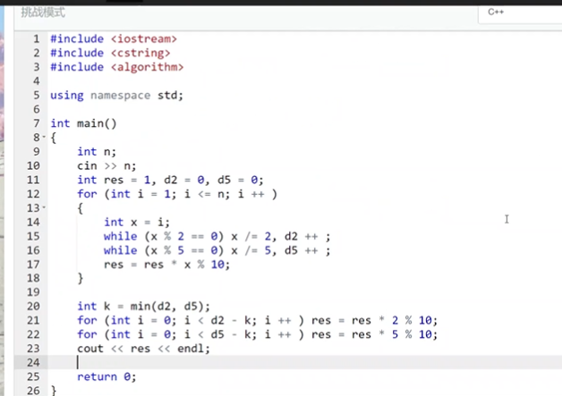

# 提高组

# AcWing 1402. 星空之夜（dfs + 图案hash）

```java
import java.io.BufferedReader;
import java.io.IOException;
import java.io.InputStreamReader;
import java.util.ArrayList;
import java.util.List;

public class Main {
    public static int n, m;
    public static char[][] g;
    public static List<Double> hash = new ArrayList<>();
    public static List<int[]> q = new ArrayList<>();
    public static void main(String[] args) throws IOException {
        BufferedReader in = new BufferedReader(new InputStreamReader(System.in));
        m = Integer.parseInt(in.readLine());
        n = Integer.parseInt(in.readLine());
        g = new char[n][m];
        for (int i = 0; i < n; i++) {
            g[i] = in.readLine().toCharArray();
        }
        // 找到一个星图, 将坐标存储,
        // hash 下标(0+'a') 映射为 double 欧几里得距离
        for (int i = 0; i < n; i++) {
            for (int j = 0; j < m; j++) {
                if (g[i][j] == '1') {
                    q.clear();
                    dfs(i,j);
                   
                    double val = get_hash();
                    char c = get_char(val);
                   
                    for (int[] p : q) {
                        int x = p[0], y = p[1];
                        g[x][y] = c;
                    }
                }
            }
        }
        for (int i = 0; i < n; i++) {
            System.out.println(g[i]);
        }

    }

    private static char get_char(double val) {
        int sz = hash.size();
        for (int i = 0; i < sz; i++) {
            if (Math.abs(hash.get(i) - val) < 1e-6) { // 1e-6
                return (char)((i) + 'a');
            }
        }
        hash.add(val);
        return (char)((sz) + 'a');
    }


   
 
    public static void dfs(int x, int y) {
        q.add(new int[]{x,y});
        g[x][y] = '0';
        for (int i = x - 1; i <= x + 1; i++) {
            for (int j = y - 1; j <= y + 1; j ++) {
                if (i >= 0 && i < n && j >= 0 && j < m && g[i][j] == '1') {
                    dfs(i,j);
                }
            }
        }
    }

    // 欧几里得距离 两两配对
    public static double get_hash()  { //connected block
        double res = 0;
        int sz = q.size();
        for (int i = 0; i < sz; i++) {
            for (int j = i + 1; j < sz; j++) {
                res += get_dist(q.get(i),q.get(j));
            }
        }
        return res;
    }

    private static double get_dist(int[] a, int[] b) {
        int dx = a[0] - b[0];
        int dy = a[1] - b[1];
        return Math.sqrt(dx * dx + dy * dy);
    }


}

```

# AcWing 479. 加分二叉树（寒假每日一题）

AcWing 479. 加分二叉树（寒假每日一题）



```java
// 区间dp
// 因为 要先构造子树 在构造根, 则可以以根的不同划分集合


import java.io.BufferedReader;
import java.io.IOException;
import java.io.InputStreamReader;
import java.util.Arrays;
import java.util.stream.IntStream;

public class Main {
    public static int n;
    public static int[] w;
    public static void main(String[] args) throws IOException {
        BufferedReader in = new BufferedReader(new InputStreamReader(System.in));
        n = Integer.parseInt(in.readLine());
        String[] s = in.readLine().split(" ");
        int[] w = Arrays.stream(s).mapToInt(str -> Integer.parseInt(str)).toArray();
        // f[i,j] 区间 i j构成的所有集合 属性 : max 加分
        int[][] f = new int[n][n];

        int[][] g = new int[n][n];
        // g[i][j] 表示 区间i j 字典序 加分最大的 根节点

        for (int len = 1; len <= n; len ++) {
            for (int i = 0; i + len - 1 < n; i++) {
                int j = i + len - 1;
                if (len == 1) {
                    f[i][j] = w[i];
                    g[i][j] = i;
                } else {
                    for (int k = i; k <= j; k++) {
                        int left = k == i ? 1 : f[i][k-1];
                        int right = k == j ? 1: f[k+1][j];
                        int score = w[k] + left * right;
                        if (score > f[i][j]) {
                            f[i][j] = score;
                            g[i][j] = k;
                        }
                    }
                }
            }

        }
        System.out.println(f[0][n-1]);
        dfs(0, n - 1, g);

    }

    private static void dfs(int l, int r, int[][] g) {
        if (l > r) return ;
        int k = g[l][r];
        System.out.print((k+1) + " ");
        dfs(l, k -1,g);
        dfs(k + 1,r,g);
    }
}

```

# \1414. 牛异或

```java
// trie树
// package WinterImpro;

import java.io.BufferedReader;
import java.io.IOException;
import java.io.InputStreamReader;
import java.util.Arrays;
import java.util.stream.IntStream;

public class Main {
    private static final int N = 100010, M = 21 * N;
    public static int n, idx = 0;
    public static int[] w, id = new int[M];
    public static int[][] son = new int[M][2];
    public static void main(String[] args) throws IOException {
        BufferedReader in = new BufferedReader(new InputStreamReader(System.in));
        n = Integer.parseInt(in.readLine());
        w = new int[n];
        // trie树
        for (int i = 0; i < n; i++) {
            w[i] = Integer.parseInt(in.readLine());
        }
        int[] s = new int[n+1];
        for (int i = 1; i <= n; i++) {
            s[i] ^= s[i-1] ^ w[i - 1];
//            System.out.println(i + " " + s[i]);
        }

        int res = -1, a = 0, b = 0;
        insert(s[0],0);
        for (int i = 1; i <= n; i++) {
            int k = query(s[i]); // 找到最大异或值 所在的位置
            int t = s[i] ^ s[k];
            if (t > res) {
                res = t;
                a = k + 1;
                b = i;
            }
            insert(s[i],i);
        }
        System.out.println(res + " " + a + " " + b);

    }
    public static void insert(int x, int k) {
        int p = 0;
        for (int i = 20; i >= 0; i--) {
            int u = (x >> i) & 1;
            if (son[p][u] == 0) son[p][u] = ++ idx;
            p = son[p][u];
        }
        id[p] = k; // id 存储与之前第几个位置 结果最大
    }

    public static int query(int x) {
        int p = 0;
        for (int i = 20; i >= 0; i--) {
            int u = (x >> i) & 1;
            int _u = 1 - u;
            if (son[p][_u] != 0) p = son[p][_u]; // 查不同前缀 存在不同前缀则 走不同前缀
            else p = son[p][u];
        }
        return id[p];
    }

}

```


# AcWing 122. 糖果传递 数学/贪心

# 入门组


# AcWing 756. 蛇形矩阵

```java
import java.util.Arrays;
import java.util.Scanner;

public class Main {

    public static void main(String[] args) {
        Scanner in = new Scanner(System.in);
        int n = in.nextInt();
        int m = in.nextInt();
        int[][] q = new int[n][m];
        int[] dx = new int[]{0,1,0,-1}, dy = new int[]{1,0,-1,0};
        int d = 0, x = 0, y = 0;
        for (int i = 1; i <= n * m; i++) {
            q[x][y] = i;
            int a = x + dx[d], b = y + dy[d];
            if (a < 0 || a >= n || b < 0 || b >= m || q[a][b] != 0) { // q[a][b] != 0 边界会发生变化 不等于0 也相当于 边界变化
                d = (d + 1) % 4;
                a = x + dx[d];
                b = y + dy[d];
            }
            x = a;
            y = b;
        }
        for (int i = 0; i < n; i++) {
            for (int j = 0; j < m; j++) {
                System.out.print(q[i][j] + " ");
            }
            System.out.println();
        }
    }
}
```

# AcWing 680. 剪绳子 二分


# AcWing 1208. 翻硬币

小明正在玩一个“翻硬币”的游戏。

桌上放着排成一排的若干硬币。我们用 * 表示正面，用 o 表示反面（是小写字母，不是零）。

比如，可能情形是：`**oo***oooo`

如果同时翻转左边的两个硬币，则变为：`oooo***oooo`

现在小明的问题是：如果已知了初始状态和要达到的目标状态，每次只能同时翻转相邻的两个硬币,那么对特定的局面，最少要翻动多少次呢？

	


# \1353. 滑雪场设计


# 



(a∗b)modp=(amodp∗bmodp)modp

