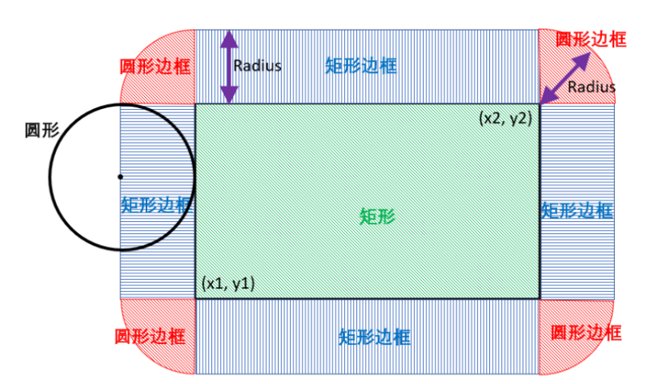
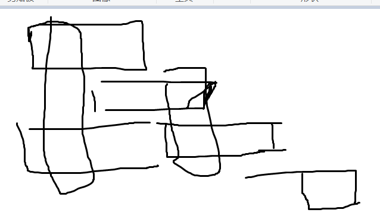

# 2023. 2.15日 1607- 1709

## \1864. 构成交替字符串需要的最小交换次数 1600

给你一个二进制字符串 `s` ，现需要将其转化为一个 **交替字符串** 。请你计算并返回转化所需的 **最小** 字符交换次数，如果无法完成转化，返回 `-1` 。

**交替字符串** 是指：相邻字符之间不存在相等情况的字符串。例如，字符串 `"010"` 和 `"1010"` 属于交替字符串，但 `"0100"` 不是。

任意两个字符都可以进行交换，**不必相邻** 。

**示例 1：**

```
输入：s = "111000"
输出：1
解释：交换位置 1 和 4："111000" -> "101010" ，字符串变为交替字符串。
```

```java
class Solution {
    public int minSwaps(String s) {
        // 每一次操作减少两个  必须是偶数 且01数量够
        char[] carr = s.toCharArray();
        int n = carr.length;
        // 统计两种开头 位置不对的数量
        int start0 = 0; // 010101  i % 2 == 1 
        int start1 = 0; // 101010  i % 2 == 1 == 0 start0 ++;
        int cnt0 = 0;
        int cnt1 = 0;
        for (int i = 1; i <= n; i++) {
            if (carr[i-1] == '0') {
                cnt0 ++;
            } else {
                cnt1 ++;
            }
            if (i % 2 == 1) {
                if (carr[i-1] == '1') {
                    start0 ++;
                } else {
                    // System.out.println("-");
                    start1 ++;
                }
            } else {
                if (carr[i-1] == '1') {
                    // System.out.println("==");
                    start1 ++;
                } else {
                    start0 ++;
                }
            }
        }
        if (n % 2 == 0 && (cnt0 != cnt1)) return -1;
        if (n % 2 == 1 && Math.abs(cnt0 - cnt1) != 1) return -1;
        // System.out.println(start0 + " " + start1);
        if (start0 % 2 != 0 && start1 % 2 != 0) return -1;
        if (start0 % 2 != 0) return start1 / 2;
        if (start1 % 2 != 0) return start0 / 2;
        return Math.min(start0 / 2, start1 / 2);
        
    }
}
```


## \962. 最大宽度坡 1607 #状态机分析

给定一个整数数组 `A`，*坡*是元组 `(i, j)`，其中 `i < j` 且 `A[i] <= A[j]`。这样的坡的宽度为 `j - i`。

找出 `A` 中的坡的最大宽度，如果不存在，返回 0 。

 

**示例 1：**

```
输入：[6,0,8,2,1,5]
输出：4
解释：
最大宽度的坡为 (i, j) = (1, 5): A[1] = 0 且 A[5] = 5.
```

**示例 2：**

```
输入：[9,8,1,0,1,9,4,0,4,1]
输出：7
解释：
最大宽度的坡为 (i, j) = (2, 9): A[2] = 1 且 A[9] = 1.
```

 

**提示：**

1. `2 <= A.length <= 50000`
2. `0 <= A[i] <= 50000`

### 思路一 二分优化查找

```java
class Solution {
    public int maxWidthRamp(int[] nums) {
        // 优化: 找出第一个比ai小的 aj res = max(res,i - j)
        int n = nums.length;
        int[] q = new int[n];
        int tail = 0;
        int res = 0;
        for (int i = 0; i < n; i++) {
            // 单调队列 存储下标  单调性: 6 0 (8 , 0  不需要的8 0 )
            if (i == 0) q[tail++] = i;
            else {
                int l = b_search(nums[i],0,tail-1,q,nums);

                if (l != 0x3f3f3f3f) res = Math.max(res,i - q[l]);
                if (nums[q[tail-1]] > nums[i]) {
                    q[tail++] = i;
                }
            }
        }
        return res;
    }
    public int b_search(int target, int i, int j, int[] q, int[] nums) {
        //找到<= a[i] 的左边界;
        // 从大到小 5 4 3 2 1 小于等于2
        int l = i, r = j;
        while (l <= r) {
            int mid = l + (r - l) / 2;
            if (nums[q[mid]] <= target) {
                r = mid - 1;
            } else {
                l = mid + 1;
            }
        }
        if (l > j) return 0x3f3f3f3f;
        return l;
    }
}
```

### 思路二 排序后 股票买卖1


### 思路三  单调栈 贪心


## \829. 连续整数求和 1694 #设x 将未知变量表示出来 增加条件

给定一个正整数 `n`，返回 *连续正整数满足所有数字之和为 `n` 的组数* 。 

 

**示****例 1:**

```
输入: n = 5
输出: 2
解释: 5 = 2 + 3，共有两组连续整数([5],[2,3])求和后为 5。
```

**示例 2:**

```
输入: n = 9
输出: 3
解释: 9 = 4 + 5 = 2 + 3 + 4
```

**示例 3:**

```
输入: n = 15
输出: 4
解释: 15 = 8 + 7 = 4 + 5 + 6 = 1 + 2 + 3 + 4 + 5
```

 

**提示:**

- `1 <= n <= 109`

### 思路: 设x 将未知变量表示出来

```java
class Solution {
    public int consecutiveNumbersSum(int n) {
        // 数学推导
        int count = 0;
        for (int w = 1; w * w <= 2 * n + 1; w++) {
            if (bsearch(n,w)) {
                count++;
            }
        }
        return count;
    }
    // long w 
    public boolean bsearch(int n, int w) {
        long nn = (long)n;
        int l = 0, r = n;
        while (l <= r) {
            int m = l + (r - l) / 2;
            // 这里的 w转为long是为了 防止溢出 如果 int 是先以int算在转为long
            long sum = (m + m + w - 1) * (long)w;
            if (sum == 2 * nn) {
                return true;
            } else if (sum > 2 * nn) {
                r = m - 1;
            } else {
                l = m + 1;
            }
        }
        return false;
    }
}
```


## \870. 优势洗牌 1648 # 不能改变顺序的 将idx按从小到排序

给定两个大小相等的数组 `nums1` 和 `nums2`，`nums1` 相对于 `nums2` 的*优势*可以用满足 `nums1[i] > nums2[i]` 的索引 `i` 的数目来描述。

返回 nums1 的**任意**排列，使其相对于 `nums2` 的优势最大化。

 

**示例 1：**

```
输入：nums1 = [2,7,11,15], nums2 = [1,10,4,11]
输出：[2,11,7,15]
```

**示例 2：**

```
输入：nums1 = [12,24,8,32], nums2 = [13,25,32,11]
输出：[24,32,8,12]
```

 

**提示：**

- `1 <= nums1.length <= 105`
- `nums2.length == nums1.length`
- `0 <= nums1[i], nums2[i] <= 109`

```java
class Solution {
    public int[] advantageCount(int[] a, int[] nums2) {
        // 田忌赛马 nums2 不变 贪心 对nums2每张牌 选取大于他的最小值
        // 都排序后 对于 每个首项 1 > 2 则 优势加一 并将结果保存
        // 否则 1的这张牌不能作为 2的任意优势牌 放在从后往前的right
        int n = a.length;
        int[] ans = new int[n];
        Integer[] idx = new Integer[n];
        for (int i = 0; i < n; i++) {
            idx[i] = i;
        }
        Arrays.sort(a);
        Arrays.sort(idx, (i, j) -> nums2[i] - nums2[j]);
        
        int l = 0, r = n - 1;
        for (int i = 0; i < n; i++) {
            if (a[i] > nums2[idx[l]]) ans[idx[l++]] = a[i];
            else {
                ans[idx[r--]] = a[i];
            }
        }
        return ans;
    
    }
}
```

## \2196. 根据描述创建二叉树 1643

给你一个二维整数数组 `descriptions` ，其中 `descriptions[i] = [parenti, childi, isLefti]` 表示 `parenti` 是 `childi` 在 **二叉树** 中的 **父节点**，二叉树中各节点的值 **互不相同** 。此外：

- 如果 `isLefti == 1` ，那么 `childi` 就是 `parenti` 的左子节点。
- 如果 `isLefti == 0` ，那么 `childi` 就是 `parenti` 的右子节点。

请你根据 `descriptions` 的描述来构造二叉树并返回其 **根节点** 。

测试用例会保证可以构造出 **有效** 的二叉树。

 

**示例 1：**


```
输入：descriptions = [[20,15,1],[20,17,0],[50,20,1],[50,80,0],[80,19,1]]
输出：[50,20,80,15,17,19]
解释：根节点是值为 50 的节点，因为它没有父节点。
结果二叉树如上图所示。
```

```java
/**
 * Definition for a binary tree node.
 * public class TreeNode {
 *     int val;
 *     TreeNode left;
 *     TreeNode right;
 *     TreeNode() {}
 *     TreeNode(int val) { this.val = val; }
 *     TreeNode(int val, TreeNode left, TreeNode right) {
 *         this.val = val;
 *         this.left = left;
 *         this.right = right;
 *     }
 * }
 */
class Solution {
    public TreeNode createBinaryTree(int[][] descriptions) {
        TreeNode root = new TreeNode();
        Map<Integer,TreeNode> map = new HashMap();
        int n = descriptions.length;
        int[] isRoot = new int[100001];
        for (int[] node : descriptions) {
            int p = node[0];
            int c = node[1];
            int isL = node[2];
            TreeNode parent = map.get(p) == null ? new TreeNode(p): map.get(p);
            TreeNode child = map.get(c) == null ? new TreeNode(c): map.get(c);
            isRoot[c] = 1;
            map.put(p,parent);
            map.put(c,child);
            if (isL == 1) {
                parent.left = child;
            } else {
                parent.right = child;
            }
        
        }
        for (Integer val : map.keySet()) {
            if (isRoot[val] == 0) {
                return map.get(val);
            }
        }
        return null;
    }
}
```

## \792. 匹配子序列的单词数 1695 #多单词子序列匹配

给定字符串 `s` 和字符串数组 `words`, 返回 *`words[i]` 中是`s`的子序列的单词个数* 。

字符串的 **子序列** 是从原始字符串中生成的新字符串，可以从中删去一些字符(可以是none)，而不改变其余字符的相对顺序。

- 例如， `“ace”` 是 `“abcde”` 的子序列。

 

**示例 1:**

```
输入: s = "abcde", words = ["a","bb","acd","ace"]
输出: 3
解释: 有三个是 s 的子序列的单词: "a", "acd", "ace"。
```

**Example 2:**

```
输入: s = "dsahjpjauf", words = ["ahjpjau","ja","ahbwzgqnuk","tnmlanowax"]
输出: 2
```

 

**提示:**

- `1 <= s.length <= 5 * 104`
- `1 <= words.length <= 5000`
- `1 <= words[i].length <= 50`
- `words[i]`和 s 都只由小写字母组成。

```java
class Solution {
    public int numMatchingSubseq(String s, String[] words) {
        // 多个匹配 遍历s 没字符 去判断每个word能不能匹配 
        // 5 * 1e4 * 5e3 还需将 words[i]分组优化 
        // System.out.println(5e3);
        int n = words.length;
        int ans = 0;
        Deque<String>[] w = new Deque[26];
        for (int i = 0; i < 26; i++) {
            w[i] = new ArrayDeque<>();
        }
        for (int i = 0; i < n; i++) {
            w[words[i].charAt(0) - 'a'].addLast(words[i]);
        }

        for (int i = 0; i < s.length(); i++) {
            char c = s.charAt(i);
            Deque<String> q = w[c - 'a'];
            if (q.isEmpty()) continue;
            int sz = q.size();
            for (int j = 0; j < sz; j++) {
                String ss = q.removeFirst().substring(1);
                if (ss.length() == 0) {
                    ans ++;
                    continue;
                } else {
                    w[ss.charAt(0) - 'a'].addLast(ss);
                }
                
            }
        }
        

        return ans;

    }
}
```


## \979. 在二叉树中分配硬币 1709 ##边贡献问题


```java
答案要加上子树的每天边的贡献值, 累加起来即可
```


```java
class Solution {
    int[] ans = new int[3];
    public int distributeCoins(TreeNode root) {
        // 思路 边贡献: 对每个顶点计算 使该子树的除了root每个结点都为1的 负载量 = (子树硬币数 - 当前子树结点数  ) 后序遍历 
        // 算法合理性 对于一个 只有三个节点的子树 可以单独算每条边的贡献度
        // 类似dp具有
        
        return dfs(root)[2];

    }
    // 算负载值 
    public int[] dfs(TreeNode root) {
        if (root == null) return new int[]{0,0,0};
        int[] l = dfs(root.left);
        int[] r = dfs(root.right);
        int x = l[0] + r[0] + 1;
        int y = l[1] + r[1] + root.val;
        return new int[]{x,y,(int)Math.abs(x - y) + l[2] + r[2]};
    }
}
```

# 2023/2/19 1653-1680

## \1155. 掷骰子的N种方法 1653 #分组背包

这里有 `n` 个一样的骰子，每个骰子上都有 `k` 个面，分别标号为 `1` 到 `k` 。

给定三个整数 `n` , `k` 和 `target` ，返回可能的方式(从总共 `kn` 种方式中)滚动骰子的数量，使正面朝上的数字之和等于 `target` 。

答案可能很大，你需要对 `109 + 7` **取模** 。

 

**示例 1：**

```
输入：n = 1, k = 6, target = 3
输出：1
解释：你扔一个有6张脸的骰子。
得到3的和只有一种方法。
```

**示例 2：**

```
输入：n = 2, k = 6, target = 7
输出：6
解释：你扔两个骰子，每个骰子有6个面。
得到7的和有6种方法1+6 2+5 3+4 4+3 5+2 6+1。
```

**示例 3：**

```
输入：n = 30, k = 30, target = 500
输出：222616187
解释：返回的结果必须是对 109 + 7 取模。
```

 

**提示：**

- `1 <= n, k <= 30`
- `1 <= target <= 1000`


```java
class Solution {
    public int ans = 0;
    public int numRollsToTarget(int n, int k, int target) {
        // n dice  k faces  dfs 超时吧 剪枝 怎么剪 ❌
        // 分组背包 的方案数
        // f[j] 前i组物品 选 1..6 装满容量恰好j的最大值 
        // g[j] 方案数 用1个即可吧
        int mod = (int)1e9 + 7;
        int[] f = new int[target+1];
        f[0] = 1;
        for (int i = 0; i < n; i++) {
            for (int j = target; j >= 0; j--) {
                f[j] = 0;
                // 至少选一个 把不选的去掉
                for(int s = 1; s <= k; s++) {
                    if (j < s) continue;
                    f[j] = (f[j] + f[j - s]) % mod;
                    // System.out.println(s + " " + j + " "  + f[j]);
                }

            }

                    // System.out.println(i + " "  + " "  + f[target]);
        }
        return f[target];


    }

}
```

## \1339. 分裂二叉树的最大乘积 1674

```java
/**
 * Definition for a binary tree node.
 * public class TreeNode {
 *     int val;
 *     TreeNode left;
 *     TreeNode right;
 *     TreeNode() {}
 *     TreeNode(int val) { this.val = val; }
 *     TreeNode(int val, TreeNode left, TreeNode right) {
 *         this.val = val;
 *         this.left = left;
 *         this.right = right;
 *     }
 * }
 */
class Solution {
    public int sum;
    public int mod = (int)1e9 + 7;
    public int maxProduct(TreeNode root) {
        // sum - kroot sum
        List<Integer> l = new ArrayList<>();
        dfs(root,l);
        long ans = 0;
        int sz = l.size();
        for (int i = 0; i < sz; i++) {
            // 居然不能再 max里 取模
            ans = Math.max((sum - l.get(i)) * (long)l.get(i), ans);
            // System.out.println(sum + "   " + l.get(i) + " " + ans);
        }
        return (int)(ans % mod);
    }
    public int dfs(TreeNode root, List<Integer> l) {
        if (root == null) return 0;
        int res = dfs(root.left,l) + dfs(root.right,l) + root.val;
        l.add(res);
        sum = res;
        return res;
    }
}
```

## \1254. 统计封闭岛屿的数目1658

```java
class Solution {
    public int n, m;
    public int closedIsland(int[][] grid) {
        // closed island 没有越界的陆地
        // 
        int ans = 0;
        n = grid.length;
        m = grid[0].length;
        for (int i = 0; i < n; i++) {
            for(int j = 0; j < m; j++) {
                if (grid[i][j] == 0) {
                    if (dfs(i,j,grid)) ans++;
                }
            }
        }
        return ans;
    }
    public boolean dfs(int x, int y, int[][] grid) {
        grid[x][y] = 1;
        int[] dx = new int[]{-1,0,1,0}, dy = new int[]{0,1,0,-1};
        boolean res = true;
        for (int i = 0; i < 4; i++) {
            int a = x + dx[i], b = y + dy[i];
            if (a < 0 || a >= n || b < 0 || b >= m) {
                res = false;
                continue;
            } 
            if (grid[a][b] == 1) continue;
            res &= dfs(a,b,grid);
        }
        return res;
    }
}
```

## \2457. 美丽整数的最小增量 1680 #整数进位操作

给你两个正整数 `n` 和 `target` 。

如果某个整数每一位上的数字相加小于或等于 `target` ，则认为这个整数是一个 **美丽整数** 。

找出并返回满足 `n + x` 是 **美丽整数** 的最小非负整数 `x` 。生成的输入保证总可以使 `n` 变成一个美丽整数。

```java
class Solution {
    public long makeIntegerBeautiful(long n, int target) {
        // 从后往前  置0
        

        long tail = 1;
        while (true) {
            // 数学题 进位操作 tail 每 ＊ 10 
            long m  = n +  (tail - (n % tail)) % tail; 
            long t = m;
            int cur = 0;
            while(t != 0) {
                cur += t % 10;
                t /= 10;
            }
            if (cur <= target) return m - n;
            tail *= 10;
        }
    
    }
}
```

# 2023/2/20 1709

## \2140. 解决智力问题 1709 ##线性dp与状态dp的区分好题 

给你一个下标从 **0** 开始的二维整数数组 `questions` ，其中 `questions[i] = [pointsi, brainpoweri]` 。

这个数组表示一场考试里的一系列题目，你需要 **按顺序** （也就是从问题 `0` 开始依次解决），针对每个问题选择 **解决** 或者 **跳过** 操作。解决问题 `i` 将让你 **获得** `pointsi` 的分数，但是你将 **无法** 解决接下来的 `brainpoweri` 个问题（即只能跳过接下来的 `brainpoweri` 个问题）。如果你跳过问题 `i` ，你可以对下一个问题决定使用哪种操作。

- 比方说，给你 

  ```
  questions = [[3, 2], [4, 3], [4, 4], [2, 5]]
  ```

   ：

  - 如果问题 `0` 被解决了， 那么你可以获得 `3` 分，但你不能解决问题 `1` 和 `2` 。
  - 如果你跳过问题 `0` ，且解决问题 `1` ，你将获得 `4` 分但是不能解决问题 `2` 和 `3` 。

请你返回这场考试里你能获得的 **最高** 分数。

 

**示例 1：**

```
输入：questions = [[3,2],[4,3],[4,4],[2,5]]
输出：5
解释：解决问题 0 和 3 得到最高分。
- 解决问题 0 ：获得 3 分，但接下来 2 个问题都不能解决。
- 不能解决问题 1 和 2
- 解决问题 3 ：获得 2 分
总得分为：3 + 2 = 5 。没有别的办法获得 5 分或者多于 5 分。
```

**示例 2：**

```
输入：questions = [[1,1],[2,2],[3,3],[4,4],[5,5]]
输出：7
解释：解决问题 1 和 4 得到最高分。
- 跳过问题 0
- 解决问题 1 ：获得 2 分，但接下来 2 个问题都不能解决。
- 不能解决问题 2 和 3
- 解决问题 4 ：获得 5 分
总得分为：2 + 5 = 7 。没有别的办法获得 7 分或者多于 7 分。
```

 

**提示：**

- `1 <= questions.length <= 105`
- `questions[i].length == 2`
- `1 <= pointsi, brainpoweri <= 105`

```java
// 超时线性dp
class Solution {
    public long mostPoints(int[][] questions) {
        // 状态机 或者 线性dp
        // f[i] 从0 - i 选择获得第i个问题的分数> 的所有选法的集合 
        // 属性 max 
        // f[i] = 前面能结尾的所有的max或者都不选 + 第i个分数 n方 10的10次方不符合
        // 从后往前考虑 f[i] 表示选第i个题 从后往前的选法
        int n = questions.length;
        int[] f = new int[n];
        f[0] = questions[0][0];
        int ans = f[0];
        for (int i = 1; i < n; i++) {
            for (int j = 0; j <= i; j++) {
                // 要优化
                int d = i - j;
                if (questions[j][1] >= d) {
                    f[i] = Math.max(f[i], questions[i][0]);
                    continue;
                }
                f[i] = Math.max(f[i],f[j] + questions[i][0]);
            }
            ans = Math.max(ans,f[i]);
            // System.out.println(i + " " + f[i]);
        }
        return ans;
        
    }
}
```

```java
// 正解状态机划分清除状态
class Solution {
    public long mostPoints(int[][] questions) {  
        // 状态机划分 将 选i 与不选i划分开来 
        // f[i] 表示 从i到最后的里的所有选法 的 max
        // 选第i个题 与不选第i个题的划分
        int n = questions.length;
        long[] f = new long[n+1];
        // f[n-1] = questions[n-1][0];
        long ans = 0;
        for (int i = n-1; i >= 0; i--) {
            f[i] = questions[i][0];
            int next = i + questions[i][1] + 1;
            
                // 线性选法不一定是next 而是合条件的最大值 状态机的定义则必定是next
            f[i] = Math.max(f[i+1], f[Math.min(n,next)] + f[i]);
            
            ans = Math.max(ans,f[i]);
            // System.out.println(i + " " + f[i]);
        }
        return ans;
        
    }
}
```

## \901. 股票价格跨度 1708

设计一个算法收集某些股票的每日报价，并返回该股票当日价格的 **跨度** 。

当日股票价格的 **跨度** 被定义为股票价格小于或等于今天价格的最大连续日数（从今天开始往回数，包括今天）。

- 例如，如果未来 7 天股票的价格是 `[100,80,60,70,60,75,85]`，那么股票跨度将是 `[1,1,1,2,1,4,6]` 。

实现 `StockSpanner` 类：

- `StockSpanner()` 初始化类对象。
- `int next(int price)` 给出今天的股价 `price` ，返回该股票当日价格的 **跨度** 。

**示例：**

```java
输入：
["StockSpanner", "next", "next", "next", "next", "next", "next", "next"]
[[], [100], [80], [60], [70], [60], [75], [85]]
输出：
[null, 1, 1, 1, 2, 1, 4, 6]

解释：
StockSpanner stockSpanner = new StockSpanner();
stockSpanner.next(100); // 返回 1
stockSpanner.next(80);  // 返回 1
stockSpanner.next(60);  // 返回 1
stockSpanner.next(70);  // 返回 2
stockSpanner.next(60);  // 返回 1
stockSpanner.next(75);  // 返回 4 ，因为截至今天的最后 4 个股价 (包括今天的股价 75) 都小于或等于今天的股价。
stockSpanner.next(85);  // 返回 6
```

**提示：**

- `1 <= price <= 105`
- 最多调用 `next` 方法 `104` 次

```java
class StockSpanner {
    // 对 第k个来说 求右往左第一个大于本身的坐标
    Deque<Integer> stack;
    int idx;
    List<Integer> arr;
    public StockSpanner() {
        stack = new ArrayDeque<>();
        idx = 0;
        arr = new ArrayList<>();
    }
    
    public int next(int price) {
        arr.add(price);
        while(!stack.isEmpty() && arr.get(stack.peekLast()) <= price){
            stack.removeLast();
        }
        int ans = stack.isEmpty() ? idx + 1 : idx - stack.peekLast();
        stack.addLast(idx);
        idx++;
        return ans;
    }
}

/**
 * Your StockSpanner object will be instantiated and called as such:
 * StockSpanner obj = new StockSpanner();
 * int param_1 = obj.next(price);
 */
```

# 2023/2/21 1700_1710

## 圆和矩阵是否重叠 1708



```java
class Solution {
    public boolean checkOverlap(int r, int a, int b, int x1, int y1, int x2, int y2) {
        if (d(a,b,x1,y1) <= r || d(a,b,x1,y2) <= r || d(a,b,x2,y1) <= r || d(a,b,x2,y2) <= r) return true;
        if (a >= x1 - r && a <= x2 + r && b >= y1  && b <= y2) return true;
        if (a >= x1 && a <= x2 && b >= y1 - r && b <= y2 + r) return true;
        return false;
    }
    public int d (int x, int y, int a, int b) {
        return (int)Math.sqrt((x-a) * (x-a) + (y-b) * (y-b));
    }
}
```

## \826. 安排工作以达到最大收益

你有 `n` 个工作和 `m` 个工人。给定三个数组： `difficulty`, `profit` 和 `worker` ，其中:

- `difficulty[i]` 表示第 `i` 个工作的难度，`profit[i]` 表示第 `i` 个工作的收益。
- `worker[i]` 是第 `i` 个工人的能力，即该工人只能完成难度小于等于 `worker[i]` 的工作。

每个工人 **最多** 只能安排 **一个** 工作，但是一个工作可以 **完成多次** 。

- 举个例子，如果 3 个工人都尝试完成一份报酬为 `$1` 的同样工作，那么总收益为 `$3` 。如果一个工人不能完成任何工作，他的收益为 `$0` 。

返回 *在把工人分配到工作岗位后，我们所能获得的最大利润* 。

```java
import java.awt.Point;

class Solution {
    public int maxProfitAssignment(int[] d, int[] p, int[] w) {
        // 思路 排序好一遍遍历
        // 工人按能力排序
        // 工作按难度排序 双指针+ 记录以前的best收益即可: 
        int n = d.length;
        Point[] jobs = new Point[n];
        for (int i = 0; i < n; i++) {
            jobs[i] = new Point(d[i],p[i]);
        } 
        Arrays.sort(w);
        Arrays.sort(jobs, (a, b) -> a.x - b.x);
        int i = 0, best = 0, ans = 0;
        for (int a : w) {
            while (i < n && a >= jobs[i].x) {
                best = Math.max(best, jobs[i++].y);
            }
            ans += best;
        }
        return ans;
    }
}

```

## \2100. 适合打劫银行的日子

你和一群强盗准备打劫银行。给你一个下标从 **0** 开始的整数数组 `security` ，其中 `security[i]` 是第 `i` 天执勤警卫的数量。日子从 `0` 开始编号。同时给你一个整数 `time` 。

如果第 `i` 天满足以下所有条件，我们称它为一个适合打劫银行的日子：

- 第 `i` 天前和后都分别至少有 `time` 天。
- 第 `i` 天前连续 `time` 天警卫数目都是非递增的。
- 第 `i` 天后连续 `time` 天警卫数目都是非递减的。

更正式的，第 `i` 天是一个合适打劫银行的日子当且仅当：`security[i - time] >= security[i - time + 1] >= ... >= security[i] <= ... <= security[i + time - 1] <= security[i + time]`.

请你返回一个数组，包含 **所有** 适合打劫银行的日子（下标从 **0** 开始）。返回的日子可以 **任意** 顺序排列。

 

**示例 1：**

```
输入：security = [5,3,3,3,5,6,2], time = 2
输出：[2,3]
解释：
第 2 天，我们有 security[0] >= security[1] >= security[2] <= security[3] <= security[4] 。
第 3 天，我们有 security[1] >= security[2] >= security[3] <= security[4] <= security[5] 。
没有其他日子符合这个条件，所以日子 2 和 3 是适合打劫银行的日子。
```

**示例 2：**

```
输入：security = [1,1,1,1,1], time = 0
输出：[0,1,2,3,4]
解释：
因为 time 等于 0 ，所以每一天都是适合打劫银行的日子，所以返回每一天。
```

**示例 3：**

```
输入：security = [1,2,3,4,5,6], time = 2
输出：[]
解释：
没有任何一天的前 2 天警卫数目是非递增的。
所以没有适合打劫银行的日子，返回空数组。
```

 

**提示：**

- `1 <= security.length <= 105`
- `0 <= security[i], time <= 105`


```java
class Solution {
    public List<Integer> goodDaysToRobBank(int[] s, int t) {
        // 对天k 判断前time天 和后time天 
        // 预处理优化: time固定 从前往后 从后往前记录
        int n = s.length;
        int[] f = new int[n]; //  记录以i为尾满足条件的连续天数
        int[] g = new int[n];
        List<Integer> ans = new ArrayList<>();
        f[0] = 1;
        for (int i = 1; i < n; i++) {
             f[i] = s[i - 1] >= s[i] ? f[i - 1] + 1: 1; 
        }

        g[n-1] = 1;
        for (int i = n - 2; i >= 0; i--) {
            g[i] = s[i+1] >= s[i] ? g[i + 1] + 1: 1;
        }

        for (int i = 0; i < n; i++) {
            if(f[i] > t && g[i] > t) ans.add(i);
        }
        return ans;
    }
}
```

## \1054. 距离相等的条形码

在一个仓库里，有一排条形码，其中第 `i` 个条形码为 `barcodes[i]`。

请你重新排列这些条形码，使其中任意两个相邻的条形码不能相等。 你可以返回任何满足该要求的答案，此题保证存在答案。

```java
class Solution {
    public int[] rearrangeBarcodes(int[] b) {
        // 频次贪心 安排
        int n = b.length;
        Map<Integer,Integer> map = new HashMap();
        for (int a: b) {
            map.put(a,map.getOrDefault(a,0) + 1);
        }
        PriorityQueue<int[]> pq = new PriorityQueue<>((a, c) -> {
            return c[0] - a[0];
        });


        for (int key: map.keySet()) {
            pq.offer(new int[]{map.get(key),key});
        }
        for (int i = 0; i < n; i++) {
            int[] cur = pq.poll();
            b[i++] = cur[1];
            cur[0] --;
            boolean flag = false;
            int[] next = null;
            if (!pq.isEmpty()) {
                next = pq.poll();
                b[i] = next[1];
                next[0] --;
                flag = true;
            }
            if (cur[0] > 0) pq.offer(cur);
            if (flag && next[0] > 0) pq.offer(next);
        }
        return b;
        

    }
   
}
```

# 2023/2/22 1710_1720

## \2017. 网格游戏 1718 问题抽象

给你一个下标从 **0** 开始的二维数组 `grid` ，数组大小为 `2 x n` ，其中 `grid[r][c]` 表示矩阵中 `(r, c)` 位置上的点数。现在有两个机器人正在矩阵上参与一场游戏。

两个机器人初始位置都是 `(0, 0)` ，目标位置是 `(1, n-1)` 。每个机器人只会 **向右** (`(r, c)` 到 `(r, c + 1)`) 或 **向下** (`(r, c)` 到 `(r + 1, c)`) 。

游戏开始，**第一个** 机器人从 `(0, 0)` 移动到 `(1, n-1)` ，并收集路径上单元格的全部点数。对于路径上所有单元格 `(r, c)` ，途经后 `grid[r][c]` 会重置为 `0` 。然后，**第二个** 机器人从 `(0, 0)` 移动到 `(1, n-1)` ，同样收集路径上单元的全部点数。注意，它们的路径可能会存在相交的部分。

**第一个** 机器人想要打击竞争对手，使 **第二个** 机器人收集到的点数 **最小化** 。与此相对，**第二个** 机器人想要 **最大化** 自己收集到的点数。两个机器人都发挥出自己的 **最佳水平** 的前提下，返回 **第二个** 机器人收集到的 **点数** *。*

 

**示例 1：**


```
输入：grid = [[2,5,4],[1,5,1]]
输出：4
解释：第一个机器人的最佳路径如红色所示，第二个机器人的最佳路径如蓝色所示。
第一个机器人访问过的单元格将会重置为 0 。
第二个机器人将会收集到 0 + 0 + 4 + 0 = 4 个点。
```

**示例 2：**


```
输入：grid = [[3,3,1],[8,5,2]]
输出：4
解释：第一个机器人的最佳路径如红色所示，第二个机器人的最佳路径如蓝色所示。 
第一个机器人访问过的单元格将会重置为 0 。
第二个机器人将会收集到 0 + 3 + 1 + 0 = 4 个点。
```

**提示：**

- `grid.length == 2`
- `n == grid[r].length`
- `1 <= n <= 5 * 104`
- `1 <= grid[r][c] <= 105`

```java
class Solution {
    public long gridGame(int[][] grid) {
        // 2 * n
        int n = grid[0].length;
        long[] s1 = new long[n+1];
        long[] s2 = new long[n+1];
        for (int i = 1; i <= n; i++) {
            s1[i] = s1[i-1] + grid[0][i-1];
            s2[i] = s2[i-1] + grid[1][i-1]; 
        }
        long ans = Long.MAX_VALUE;
        for(int i = 0; i < n; i++) {
            ans = Math.min(ans,Math.max(s2[i],s1[n] - s1[i+1]));
        }
        return ans;
    }
}
```

## \1239. 串联字符串的最大长度 1719 dfs子集

```java
// 比较暴力了
class Solution {
    int ans = 0;
    public int maxLength(List<String> arr) {
        int n = arr.size();
        int[] mark = new int[26];
        dfs(0,arr,mark,n, 0);
        return ans;
    }

    public void dfs(int u, List<String> arr, int[] mark, int n, int len) {
         
        if (u == n) {
            ans = Math.max(ans, len);
            return ;
        }
        // dfs剪枝 
        

        Set<Character> set = new HashSet<>();
        char[] s = arr.get(u).toCharArray();
        boolean flag = false;
        for(char a: s) {
            if (mark[a - 'a'] > 0) {
                flag = true;
                break;
            } 
            if (set.contains(a)) {
                flag = true;
                break;
            } 
            set.add(a);
        }
        // 剪枝
        if (flag) {
            dfs(u+1,arr,mark,n,len);
            return ;
        }
        for (char a: s) {
            mark[a - 'a'] ++;
        }    
        dfs(u+1,arr,mark,n,len+s.length);
        for (char a: s) {
            mark[a - 'a'] --;
        }
		// 不选第i
        dfs(u+1, arr, mark, n, len);


    }
}
```

# 2023/2/23 1710_1720

## \1567. 乘积为正数的最长子数组长度 1710

```java
class Solution {
    public int getMaxLen(int[] nums) {
        //  对第 k个数而言 如果为正 正max[k-1]  )
        //  为负 找负min[k-1]
        int n = nums.length;
        int[] f = new int[n]; // f[i] 以第i个为尾的 为正的长度
        int[] g = new int[n]; // 为负的长度
        int ans = 0;
        if (nums[0] > 0) {
            f[0] = 1;
            ans ++;
        } else if (nums[0] < 0) {
            g[0] = 1;
        }

        for (int i = 1; i < n; i++) {
            if (nums[i] == 0) continue;
            if (nums[i] > 0) {
                if (f[i-1] != 0) {
                    f[i] = f[i-1] + 1; 
                } else {
                    f[i] = 1;
                }
                if(g[i-1] != 0) {
                    g[i] = g[i-1] + 1;
                }
            } else {
                if (f[i-1] != 0) {
                    g[i] = f[i-1] + 1; 
                } else {
                    g[i] = 1;
                }
                if(g[i-1] != 0) {
                    f[i] = g[i-1] + 1;
                } 
            }
            ans = Math.max(ans, f[i]);
        }
        return ans;

    }
}
```

## \2359. 找到离给定两个节点最近的节点

```java
class Solution {
    final int INF = 0x3f3f3f3f;
    List<Integer>[] g;
    int n;
    public int closestMeetingNode(int[] edges, int n1, int n2) {
        // 对两个点 dijkstra
        n = edges.length;
        g = new List[n];
        for (int i = 0; i < n; i++) {
            g[i] = new ArrayList<>();
        }
        for (int i = 0; i < n; i++) {
            if (edges[i] < 0) continue ; 
            g[i].add(edges[i]);
        }
        int[] d1 = dijkstra(n1);
        int[] d2 = dijkstra(n2);
        int than = INF;
        int ans = -1;
        for (int i = 0; i < n; i++) {
            int t = Math.max(d1[i],d2[i]);
            if (t < than) {
                ans = i;
                than = t;
            }
        }
        return ans;
    }
    public int[] dijkstra(int start) {
        int[] d = new int[n];
        boolean[] st = new boolean[n];
        Arrays.fill(d,INF);
        d[start] = 0;
        PriorityQueue<int[]> pq = new PriorityQueue<>((a,b)-> a[0] - b[0]);
        pq.offer(new int[]{0,start});
        while (!pq.isEmpty()) {
            int[] min = pq.poll();
            int t = min[1];
            if (st[t]) continue;
            st[t] = true;

            for (int ne: g[t]) {
                if (d[t] + 1 < d[ne]) {
                    d[ne] = d[t] + 1;
                    pq.offer(new int[]{d[ne], ne});
                }
            }
        }
        return d;
    }
}
```

# 2023/2/24 1720_1730


## \1220. 统计元音字母序列的数目

```java
class Solution {
    public int countVowelPermutation(int n) {
        //记忆化搜索 dp fa[i] 第i个以a为尾的个数
        // a -> e
        // e -> a i
        // i -> a e o u
        // o -> i u
        // u -> a
        int mod = (int)1e9 + 7;
        long[] fa = new long[n];
        long[] fe = new long[n];
        long[] fi = new long[n];
        long[] fo = new long[n];
        long[] fu = new long[n];

        for (int i = 0; i < n; i++) {
            if (i == 0) {
                fa[i] = 1;
                fe[i] = 1;
                fi[i] = 1;
                fo[i] = 1;
                fu[i] = 1;
            } else {
                fa[i] = (fe[i-1] + fi[i-1] + fu[i-1]) % mod;
                fe[i] = (fi[i-1] + fa[i-1]) % mod;
                fi[i] = (fe[i-1] + fo[i-1]) % mod;
                fo[i] = (fi[i-1]) % mod;
                fu[i] = (fo[i-1] + fi[i-1]) % mod;  
            }

            // System.out.println(i + " " + fa[i] + " "+ fe[i] +" " + fi[i] + " " + fo[i] + " "+ fu[i]);
        }
        return (int)((fa[n-1] + fe[n-1] + fi[n-1] + fo[n-1] + fu[n-1]) % mod);

    }
}
```


## \2070. 每一个查询的最大美丽值 

给你一个二维整数数组 `items` ，其中 `items[i] = [pricei, beautyi]` 分别表示每一个物品的 **价格** 和 **美丽值** 。

同时给你一个下标从 **0** 开始的整数数组 `queries` 。对于每个查询 `queries[j]` ，你想求出价格小于等于 `queries[j]` 的物品中，**最大的美丽值** 是多少。如果不存在符合条件的物品，那么查询的结果为 `0` 。

请你返回一个长度与 `queries` 相同的数组 `answer`，其中 `answer[j]`是第 `j` 个查询的答案。

```java
class Solution {
    public int[] maximumBeauty(int[][] items, int[] q) {
        // 类似安排工人 多了一个下标映射
        int n = q.length;
        int m = items.length;
        Integer[] idx = new Integer[n];
        for (int i = 0; i < n; i++) {
            idx[i] = i;
        }
        Arrays.sort(idx, (a,b) -> q[a] - q[b]);
        int[] ans = new int[n];
        Arrays.sort(items, (a,b) -> a[0] - b[0]);
        int best = 0, j = 0;
        for (int i = 0; i < n; i++) {
            int query = q[idx[i]];
            
            while(j < m && query >= items[j][0]) {
                best = Math.max(best, items[j][1]);
                j++;
            }
            ans[idx[i]] = best; 

        }
        
        return ans;

    }
}
```

## \1359. 有效的快递序列数目

给你 `n` 笔订单，每笔订单都需要快递服务。

请你统计所有有效的 收件/配送 序列的数目，确保第 `i` 个物品的配送服务 `delivery(i)` 总是在其收件服务 `pickup(i)` 之后。

由于答案可能很大，请返回答案对 `10^9 + 7` 取余的结果。

```java

class Solution {
    public int countOrders(int n) {
        // p1 (n-1个位置[1, n-1] = x) d1([x+1, n]) 
        // n - 2 同样的
        // 15 + 14 + 13 + 12 + 11 10 9 8 7 6 5 4 3 2 1
        // 60 + 15 + 45 
        int mod = (int)1e9 + 7;
        int t = 2 * n;
        long last = 1;
        while (t != 0) {
            int an = 0;
            for (int i = 1; i < t; i++) {
                an += t - i;
            }
            if (an != 0) last =(last * an) % mod;
            t -= 2;
        }
        
        return (int)(last % mod);
     
    }
}
//优化
class Solution {
    public int countOrders(int n) {
        // p1 (n-1个位置[1, n-1] = x) d1([x+1, n]) 
        // 15 + 14 + 13 + 12 + 11 10 9 8 7 6 5 4 3 2 1
        // 60 + 15 + 45 
        int mod = (int)1e9 + 7;
        int t = 2;
        long last = 1;
        int an = 0;
        while (t <= 2 * n) {
            an += (2 * (t - 1) -1);
            last =(last * an) % mod;
            // System.out.println(t + " " + last + " " + an);
            t += 2;
           
        }
        return (int)(last % mod);
    }
}
```

## \1011. 在 D 天内送达包裹的能力

传送带上的包裹必须在 `days` 天内从一个港口运送到另一个港口。

传送带上的第 `i` 个包裹的重量为 `weights[i]`。每一天，我们都会按给出重量（`weights`）的顺序往传送带上装载包裹。我们装载的重量不会超过船的最大运载重量。

返回能在 `days` 天内将传送带上的所有包裹送达的船的最低运载能力。

```java
class Solution {
    public int shipWithinDays(int[] w, int d) {
        // 设 为 x (0 , sum) {} 二分
        int sum = 0;
        int max = 0;
        for (int a: w) {
            max = Math.max(max,a);
            sum += a;
        }
        int l = max, r = sum;
        // 求 a > d 的左边界 
        while (l <= r) {
            int mid = l + (r - l) / 2;
            // r 越小 装完的天数越多 多了一层映射
            if (check(w,mid,d)) {
                l = mid + 1;
            } else {
                r = mid - 1;
            }
        }
        return l;
    }
    public boolean check(int[] w, int x, int d) {
        int n = w.length;
        int ans = 1;
        int t = 0;
        // System.out.println(x);
        // 滑动窗口
        for (int i = 0; i < n; i++) {
            t += w[i];
            if (t > x) {
                ans++;
                t = 0;
                i --;
            }
            // System.out.print(i + " " + t + " -- ");
        }
        // System.out.println(x + " " + ans);
        return ans > d;
    }
}
```

## \2416. 字符串的前缀分数和


```java
// 每个结点都有26个子节点
class Solution {
    public int[] sumPrefixScores(String[] words) {
        // 1000 * 1000
        // 排序加 字典树
        // 对每一个查询 统计 cnt
        int n = words.length;
        int[] ans = new int[n];
        TreeNode root = new TreeNode();
        for (String s: words) {
            insert(root,s);
        }
        for (int i = 0; i < n; i++) {
            ans[i] = query(root,words[i]);
        }
        return ans;
    }
    class TreeNode {
        int cnt;
        TreeNode[] children = new TreeNode[26];
    }
    public void insert(TreeNode p, String s) {

        for (char c: s.toCharArray()) {
            int son = c - 'a';
            if (p.children[son] == null) {
                p.children[son] = new TreeNode();
            } 
            p = p.children[son];
            p.cnt ++;
        }
        
    }
    public int query(TreeNode p, String s) {
        int ans = 0;
        for (char c: s.toCharArray()) {
            int son = c - 'a';
            ans += p.children[son].cnt;
            p = p.children[son];
        }
        return ans;
    }

}
```

# 2023/2/25 1739

## \1593. 拆分字符串使唯一子字符串的数目最大 1739 	#dfs拆分

给你一个字符串 `s` ，请你拆分该字符串，并返回拆分后唯一子字符串的最大数目。

字符串 `s` 拆分后可以得到若干 **非空子字符串** ，这些子字符串连接后应当能够还原为原字符串。但是拆分出来的每个子字符串都必须是 **唯一的** 。

注意：**子字符串** 是字符串中的一个连续字符序列。

 

**示例 1：**

```
输入：s = "ababccc"
输出：5
解释：一种最大拆分方法为 ['a', 'b', 'ab', 'c', 'cc'] 。像 ['a', 'b', 'a', 'b', 'c', 'cc'] 这样拆分不满足题目要求，因为其中的 'a' 和 'b' 都出现了不止一次。
```

**示例 2：**

```
输入：s = "aba"
输出：2
解释：一种最大拆分方法为 ['a', 'ba'] 。
```

**示例 3：**

```
输入：s = "aa"
输出：1
解释：无法进一步拆分字符串。
```

 

**提示：**

- `1 <= s.length <= 16`
- `s` 仅包含小写英文字母

```java
class Solution {
    Set<String> set = new HashSet<>();
    int ans = 0;
    public int maxUniqueSplit(String s) {
        // dfs 搜索顺序: 对位置u  拆分还是不拆分 已有
        char[] carr = s.toCharArray();
        
        dfs(0,0,new StringBuilder(),carr);
        return ans;
    }
    public void dfs(int u, int k, StringBuilder sb, char[] carr) {
        // if (k >= carr.length) {
        //     ans = k;
        //     return ;
        // }
        if (u >= carr.length) {
            ans = Math.max(k,ans);
            return ;
        }
        sb.append(carr[u]);
        if (!set.contains(sb.toString())) {
            // 拆分
            set.add(sb.toString());
            dfs(u+1,k+1,new StringBuilder(),carr);
            set.remove(sb.toString());
            
        }
        // sb.deleteCharAt(sb.length()-1);

        // //不拆分
        // sb.append(carr[u]);
        dfs(u+1,k,sb,carr);
        sb.deleteCharAt(sb.length()-1);
    }
}
```

# 2023/2/28 1800_1810

给你一个整数数组 `arr` ，你一开始在数组的第一个元素处（下标为 0）。

每一步，你可以从下标 `i` 跳到下标 `i + 1` 、`i - 1` 或者 `j` ：

- `i + 1` 需满足：`i + 1 < arr.length`
- `i - 1` 需满足：`i - 1 >= 0`
- `j` 需满足：`arr[i] == arr[j]` 且 `i != j`

请你返回到达数组最后一个元素的下标处所需的 **最少操作次数** 。

注意：任何时候你都不能跳到数组外面。

## \1345. 跳跃游戏 IV 1809#BFS优化

```java
class Solution {
    public int minJumps(int[] arr) {
        //BFS 第一次访问同数跳时加入队列后就不在访问这些元素了
        // 因为显然在之后的都是走回头路了 总会有比更短的
        int n = arr.length;
        int INF = 0x3f3f3f3f;
        int[] dist = new int[n];
        Arrays.fill(dist,INF);
        Map<Integer,List<Integer>> map = new HashMap<>();
        for (int i = 0; i < n; i++) {
            if (map.get(arr[i]) == null) {
                map.put(arr[i],new ArrayList<>());
            }
            map.get(arr[i]).add(i);
        }
        Deque<Integer> q = new ArrayDeque<>();
        q.offer(0);
        dist[0] = 0;
        while (!q.isEmpty()) {
            int i = q.poll();
            int curd = dist[i];
            if (i - 1 >= 0 && dist[i-1] == INF) {
                q.offer(i-1);
                dist[i-1] = curd + 1;
            } 
            if (i + 1 < n && dist[i+1] == INF) {
                q.offer(i+1);
                dist[i+1] = curd + 1;
            } 
            if (map.get(arr[i]) != null) {
                for (int u: map.get(arr[i])) {
                    if (dist[u] == INF) {
                        q.offer(u);
                        dist[u] = curd + 1;
                    }
                }
                map.remove(arr[i]);
            }
        }
        return dist[n-1];
    }
}
```

## \1519. 子树中标签相同的节点数 1809# dfs存储信息

给你一棵树（即，一个连通的无环无向图），这棵树由编号从 `0` 到 `n - 1` 的 n 个节点组成，且恰好有 `n - 1` 条 `edges` 。树的根节点为节点 `0` ，树上的每一个节点都有一个标签，也就是字符串 `labels` 中的一个小写字符（编号为 `i` 的 节点的标签就是 `labels[i]` ）

边数组 `edges` 以 `edges[i] = [ai, bi]` 的形式给出，该格式表示节点 `ai` 和 `bi` 之间存在一条边。

返回一个大小为 *`n`* 的数组，其中 `ans[i]` 表示第 `i` 个节点的子树中与节点 `i` 标签相同的节点数。

树 `T` 中的子树是由 `T` 中的某个节点及其所有后代节点组成的树。

```java
class Solution {
    int[] ans;
    List<Integer>[] g;
    public int[] countSubTrees(int n, int[][] edges, String labels) {
       // 子树的概念: 隔离父边
        g = new List[n];
        for (int i = 0; i < n; i++) {
           g[i] = new ArrayList<>();
        }
        for (int[] edge: edges) {
            int a = edge[0];
            int b = edge[1];
            g[a].add(b);
            g[b].add(a);
        }
        ans = new int[n];
        dfs(0,-1,n,labels);
        return ans;
    }
    // dfs 统计信息 
    public int[] dfs(int cur, int p, int n, String labels) {
        // 恰好n-1edges 所以能过 
        int[] hash = new int[26];
        char c = labels.charAt(cur);
        for (int node: g[cur]) {
            if (node != p) {
                int[] a = dfs(node,cur,n,labels);
                for (int i = 0; i < 26; i++) {
                    hash[i] += a[i];
                }
            }
        }
        ans[cur] += ++hash[c -'a'];
        return hash;
    }
}
```

## \2302. 统计得分小于 K 的子数组数目

一个数字的 **分数** 定义为数组之和 **乘以** 数组的长度。

- 比方说，`[1, 2, 3, 4, 5]` 的分数为 `(1 + 2 + 3 + 4 + 5) * 5 = 75` 。

给你一个正整数数组 `nums` 和一个整数 `k` ，请你返回 `nums` 中分数 **严格小于** `k` 的 **非空整数子数组数目**。

**子数组** 是数组中的一个连续元素序列。

```java
class Solution {
    public long countSubarrays(int[] nums, long k) {
        // 1e5,  滑动窗口
        long sum = 0, ans = 0;
        for (int i = 0, j = 0; i < nums.length; i++) {
            sum += nums[i];
            while (sum * (i - j + 1) >= k) {
                sum -= nums[j++];
            }
            ans += (i - j + 1);
        } 
        return ans;
    }
}
```

# 2023/3/1

## \1419. 数青蛙


# 2023/3/7 

## 948 双指针贪心


# 2023/3/12

## \6317. 统计美丽子数组数目  前缀异或和

利用前缀异或和 *s*，问题相当于在求 *s* 中有多少对相同的数字。

```java
class Solution {
    //利用前缀异或和 *s*，问题相当于在求 *s* 中有多少对相同的数字。
    public long beautifulSubarrays(int[] nums) {
        int n = nums.length;
        long ans = 0;
        Map<Integer,Integer> map = new HashMap<>();
        map.put(0,1);
        int[] f = new int[n+1];  
        for (int i = 1; i <= n; i++) {
            f[i] ^= f[i-1] ^ nums[i-1];
   
            if (map.get(f[i]) != null) {
                ans += map.get(f[i]);
            } 
            map.put(f[i],map.getOrDefault(f[i],0) + 1);
        }
        
        return ans;
    }
}
```


## 区间问题 \6318. 完成所有任务的最少时间




```java
class Solution {
    public int findMinimumTime(int[][] arr) {
        // 按尾部排序 
        Arrays.sort(arr,(a,b)->a[1] - b[1]);
        // 统计已经安排的时间
        boolean[] f = new boolean[2001];
        // 
        int ans = 0;
        for (int[] a: arr) {
            int start = a[0], end = a[1], d = a[2];
            // 与上个之前的所有的已统计的
            for (int i = start; i <= end; i++) {
                if (f[i]) d--;
            }
            // 区间后缀安排
            for (int i = end; d > 0; i--) {
                if (!f[i]) {
                    f[i] = true;
                    ans++;
                    d--;
                }
                
            }
        }
        return ans;
    }
}
```


## 2023/3/23

### 1284. 转化为全零矩阵的最少反转次数  外部搜索


