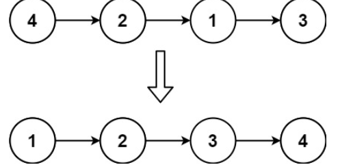
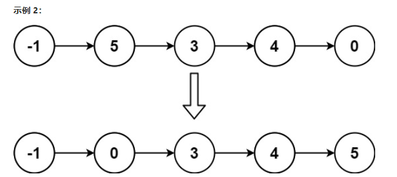

# 公式推导题

AcWing 122. 糖果传递【环形纸牌均分问题】

https://www.acwing.com/solution/content/41677/

# 奇特的单链表操作方式


## 147. 对链表进行插入排序

给定单个链表的头 head ，使用 插入排序 对链表进行排序，并返回 排序后链表的头 。

插入排序 算法的步骤:

插入排序是迭代的，每次只移动一个元素，直到所有元素可以形成一个有序的输出列表。
每次迭代中，插入排序只从输入数据中移除一个待排序的元素，找到它在序列中适当的位置，并将其插入。
重复直到所有输入数据插入完为止。
下面是插入排序算法的一个图形示例。部分排序的列表(黑色)最初只包含列表中的第一个元素。每次迭代时，从输入数据中删除一个元素(红色)，并就地插入已排序的列表中。

对链表进行插入排序。


示例 1：



输入: head = [4,2,1,3]
输出: [1,2,3,4]
示例 2：



输入: head = [-1,5,3,4,0]
输出: [-1,0,3,4,5]


提示：

列表中的节点数在 [1, 5000]范围内
-5000 <= Node.val <= 5000

来源：力扣（LeetCode）
链接：https://leetcode.cn/problems/insertion-sort-list
著作权归领扣网络所有。商业转载请联系官方授权，非商业转载请注明出处。

### 方法一 直观模拟

```java
//方法一 直观模拟
class Solution {
    public ListNode insertionSortList(ListNode head) {
        
        //分割成单结点,去除链表的影响 所有都是单节点操作
        //不分割可能会成环
        if (head == null) return null;
        ListNode newHead = head;
        head = head.next;
        ListNode p = newHead;
        newHead.next = null;
        ListNode q = head;
        // 梳理下思路
        //遍历输入结点,找输入结点在新链表的位置,小于等于新结点的头结点 直接头插 大于则往后遍历,
        // 直到 p.next.val > q.val
        // 如果 p.next == null 直接尾插
        while (q != null) {
            //头插
            ListNode t = q.next;
            q.next = null;
            if (q.val < newHead.val) {
                //头插法
                q.next = newHead;
                newHead = q;

                q = t;
                p = newHead;
                continue;
            }
            while (p == null || q.val > p.val) {
                if (p.next == null || p.next.val > q.val ) {
                    break;
                }
                p = p.next;
            }
            // 插入
            ListNode temp = p.next;
            p.next = q;
            q.next = temp;
            q = t;
            p = newHead;
        }
        return newHead;
    }
}
```

### 方法二

```java
class Solution {
    public ListNode insertionSortList(ListNode head) {
        //在一条环上处理
        ListNode dummy = new ListNode(-1,head);
        ListNode newLast = dummy.next;
        ListNode cur = newLast.next;
        while (cur != null) {
            if (cur.val >= newLast.val) {
                newLast = cur;   
            }else {
                //从头找到p.next.val > cur.val
                //因为last.val > cur.val 所以.next不会为空的
                ListNode p = dummy;
                while (p.next.val <= cur.val) {
                    p = p.next;
                }
                newLast.next = cur.next;
                cur.next = p.next;
                p.next = cur;
            }
            cur = newLast.next;
        }
        return dummy.next;
    }
}
```

# 二维前缀和

```java
第一题：题目内容
小美在玩一项游戏。该游戏的目标是尽可能抓获敌人。
敌人的位置将被一个二维坐标(x,y)所描述。
小美有一个全屏技能，该技能能一次性将若干敌人一次性捕获。捕获的敌人之间的横坐标的最大差值不能大于
A，纵坐标的最大差值不能大于B现在给出所有敌人的坐标，你的任务是计算小美一次性最多能使用技能捕获多少敌人。

    开个1000x1000的数组，把有敌人的位置填上1。求二维前缀和后可以在均摊O(1)的复杂度内求出每个AxB大小的矩阵的和，也就是题目要的敌人数量。总复杂度瓶颈为开数组和预处理前缀和的O(max(x)*max(y)


```

